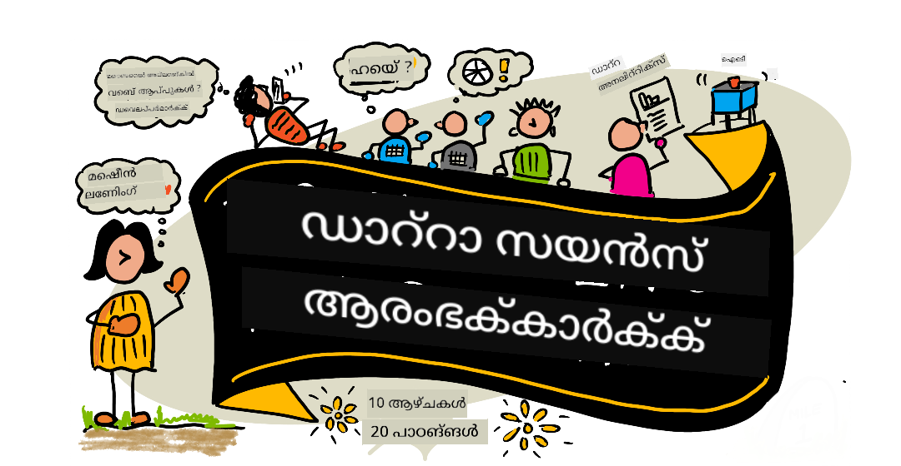

<!--
CO_OP_TRANSLATOR_METADATA:
{
  "original_hash": "278a30661fe9f10afd81dea999adc63a",
  "translation_date": "2025-12-21T12:57:15+00:00",
  "source_file": "README.md",
  "language_code": "ml"
}
-->
# ഡാറ്റാ സയൻസ് ആരംഭിക്കുന്നവർക്ക് - ഒരു പാഠ്യക്രമം

Microsoft-ിലെ Azure Cloud Advocates-കൾ ഡാറ്റാ സയൻസ് സംബന്ധിച്ചുള്ള 10-വാര, 20-പാഠങ്ങളുള്ള ഒരു പാഠ്യക്രമം നല്കാൻ ഞാൻമത്സന്നദ്ധരാണ്. ഓരോ പാഠത്തിലും മുൻപച്ച പഠനത്തിനുമുമ്പും പിന്നിലെ ക്വിസുകൾ, പാഠം പൂർത്തിയാക്കാനുള്ള എഴുത്ത് നിർദ്ദേശങ്ങൾ, ഒരു പരിഹാരം, ഒരു അസൈൻമെൻറ് എന്നിവ ഉൾപ്പെടുന്നു. പ്രോജക്ട് അധിഷ്ഠിത പാഠപദ്ധതിയാണ് നമ്മുടേത് — നിങ്ങള്‍ നിർമ്മിക്കുമ്പോഴാണ് പഠിക്കുക; പുതിയ നൈപുണ്യങ്ങൾ 'ഒതുങ്ങുന്ന' തെളിവായ മാർഗം.

**ഞങ്ങളുടെ ലേഖകർക്കുള്ള ഹൃദയം നിറഞ്ഞ നന്ദി:** [Jasmine Greenaway](https://www.twitter.com/paladique), [Dmitry Soshnikov](http://soshnikov.com), [Nitya Narasimhan](https://twitter.com/nitya), [Jalen McGee](https://twitter.com/JalenMcG), [Jen Looper](https://twitter.com/jenlooper), [Maud Levy](https://twitter.com/maudstweets), [Tiffany Souterre](https://twitter.com/TiffanySouterre), [Christopher Harrison](https://www.twitter.com/geektrainer).

**🙏 പ്രത്യേക നന്ദി 🙏 ഞങ്ങളുടെ [Microsoft Student Ambassador](https://studentambassadors.microsoft.com/) ലേഖകർക്കും റിവ്യൂവ്രുകൾക്കും ഉള്ളടക്ക സംഭാവനക്കാർക്കും,** പ്രത്യേകിച്ചു Aaryan Arora, [Aditya Garg](https://github.com/AdityaGarg00), [Alondra Sanchez](https://www.linkedin.com/in/alondra-sanchez-molina/), [Ankita Singh](https://www.linkedin.com/in/ankitasingh007), [Anupam Mishra](https://www.linkedin.com/in/anupam--mishra/), [Arpita Das](https://www.linkedin.com/in/arpitadas01/), ChhailBihari Dubey, [Dibri Nsofor](https://www.linkedin.com/in/dibrinsofor), [Dishita Bhasin](https://www.linkedin.com/in/dishita-bhasin-7065281bb), [Majd Safi](https://www.linkedin.com/in/majd-s/), [Max Blum](https://www.linkedin.com/in/max-blum-6036a1186/), [Miguel Correa](https://www.linkedin.com/in/miguelmque/), [Mohamma Iftekher (Iftu) Ebne Jalal](https://twitter.com/iftu119), [Nawrin Tabassum](https://www.linkedin.com/in/nawrin-tabassum), [Raymond Wangsa Putra](https://www.linkedin.com/in/raymond-wp/), [Rohit Yadav](https://www.linkedin.com/in/rty2423), Samridhi Sharma, [Sanya Sinha](https://www.linkedin.com/mwlite/in/sanya-sinha-13aab1200),
[Sheena Narula](https://www.linkedin.com/in/sheena-narua-n/), [Tauqeer Ahmad](https://www.linkedin.com/in/tauqeerahmad5201/), Yogendrasingh Pawar , [Vidushi Gupta](https://www.linkedin.com/in/vidushi-gupta07/), [Jasleen Sondhi](https://www.linkedin.com/in/jasleen-sondhi/)

||
|:---:|
| ഡാറ്റാ സയൻസ് ആരംഭിക്കുന്നവർക്ക് - _സ്കെച്ച്നോട്ട് by [@nitya](https://twitter.com/nitya)_ |

### 🌐 ബഹുഭാഷാ പിന്തുണ

#### GitHub Action മുഖേന പിന്തുണ (സ്വയംപ്രവർത്തിയാക്കുന്നതും എപ്പോഴും പുതുക്കപ്പെട്ടതുമായ)

<!-- CO-OP TRANSLATOR LANGUAGES TABLE START -->
[അറബിക്](../ar/README.md) | [ബംഗാളി](../bn/README.md) | [ബൾഗേറിയൻ](../bg/README.md) | [ബർമ്മീസ് (മ്യാൻമാർ)](../my/README.md) | [ചൈനീസ് (സിംപ്ലിഫൈഡ്)](../zh/README.md) | [ചൈനീസ് (പരമ്പരാഗതം, ഹോംഗ് കോങ്)](../hk/README.md) | [ചൈനീസ് (പരമ്പരാഗതം, മക്കാവോ)](../mo/README.md) | [ചൈനീസ് (പരമ്പരാഗതം, തായ്‍വാൻ)](../tw/README.md) | [ക്രോയേഷ്യൻ](../hr/README.md) | [ചെക്ക്](../cs/README.md) | [ഡാനിഷ്](../da/README.md) | [ഡച്ച്](../nl/README.md) | [എസ്റ്റോണിയൻ](../et/README.md) | [ഫിന്നിഷ്](../fi/README.md) | [ഫ്രഞ്ച്](../fr/README.md) | [ജർമ്മൺ](../de/README.md) | [ഗ്രീക്ക്](../el/README.md) | [ഹീബ്രു](../he/README.md) | [ഹിന്ദി](../hi/README.md) | [ഹംഗേറിയൻ](../hu/README.md) | [ഇൻഡൊനേഷ്യൻ](../id/README.md) | [ഇറ്റാലിയൻ](../it/README.md) | [ജാപ്പനീസ്](../ja/README.md) | [കന്നഡ](../kn/README.md) | [കൊറിയൻ](../ko/README.md) | [ലിത്ത്വേനിയൻ](../lt/README.md) | [മലേ](../ms/README.md) | [മലയാളം](./README.md) | [മറാത്തി](../mr/README.md) | [നെപ്പാലി](../ne/README.md) | [നൈജീരിയൻ പിഡിനായിന്](../pcm/README.md) | [നോർവേജിയൻ](../no/README.md) | [പെർഷ്യൻ (ഫാർസി)](../fa/README.md) | [പോളിഷ്](../pl/README.md) | [പോർചുഗീസ് (ബ്രസീൽ)](../br/README.md) | [പോർചുഗീസ് (പോർച്ചുഗൽ)](../pt/README.md) | [പഞ്ചാബി (ഗുരുമുഖി)](../pa/README.md) | [റൂമാനിയൻ](../ro/README.md) | [റഷ്യൻ](../ru/README.md) | [സെർബിയൻ (സൈറില്ലിക്)](../sr/README.md) | [സ്ലോവാക്ക്](../sk/README.md) | [സ്ലൊവേനിയൻ](../sl/README.md) | [സ്പാനിഷ്](../es/README.md) | [സ്വാഹിലി](../sw/README.md) | [സ്വീഡിഷ്](../sv/README.md) | [തഗാലോഗ് (ഫിലിപ്പീനോ)](../tl/README.md) | [തമിഴ്](../ta/README.md) | [തെലുങ്ക്](../te/README.md) | [തായ്](../th/README.md) | [ടർക്കിഷ്](../tr/README.md) | [ഉക്രൈനിയൻ](../uk/README.md) | [ഉർദു](../ur/README.md) | [വിയറ്റ്നാമീസ്](../vi/README.md)
<!-- CO-OP TRANSLATOR LANGUAGES TABLE END -->

**കൂടുതൽ ഭാവിവിഭാഗങ്ങൾ പിന്തുണയ്ക്കണമെന്ന് ആഗ്രഹിക്കുന്നുവെങ്കിൽ, ലഭ്യമായ ഭാഷകളുടെ ഒരു ലിസ്റ്റ് [ഇവിടെ](https://github.com/Azure/co-op-translator/blob/main/getting_started/supported-languages.md) കാണാം**

#### ഞങ്ങളുടെ സമൂഹത്തിൽ ചേരൂ 

നമ്മുടെ Discord-ൽ "Learn with AI" സീരീസ് തുടരുന്നുണ്ട് — കൂടുതൽ അറിയാനും 18 - 30 സെപ്തംബർ, 2025-ൽ μαςയിൽ ചേർന്നു പങ്കെടുക്കാനും [Learn with AI Series](https://aka.ms/learnwithai/discord) സന്ദർശിക്കുക. GitHub Copilot ഡാറ്റാ സയൻസ് ഉപയോഗിക്കുന്നതിന്റെ ടിപ്സും ട്രിക്ക്സുകളും നിങ്ങൾക്കു നൽകപ്പെടും.

# നിങ്ങൾ ഒരു വിദ്യാർത്ഥി ആണോ?

തുടങ്ങുന്നതിനുള്ള ഉപകരണം താഴെ കാണാം:

- [വിദ്യാർത്ഥി ഹബ് പേജ്](https://docs.microsoft.com/en-gb/learn/student-hub?WT.mc_id=academic-77958-bethanycheum) ഈ പേജിൽ നിങ്ങൾക്ക് ആരംഭക്കാർക്കുള്ള വിഭവങ്ങൾ, Student പാക്കുകൾ, സൗജന്യ സർട്ടിഫിക്കറ്റ് വൗച്ചർ നേടാനുള്ള മാർഗ്ഗങ്ങളും എന്നിവ കാണാൻ കഴിയും. ഇത് നിങ്ങൾക്ക് ബുക്ക് മാർക്ക് ചെയ്ത് ചില സമയമുള്ളിൽ പരിശോധിക്കേണ്ട ഒരു പേജ് ആണ്, കാരണം ہم കുറഞ്ഞത് മാസന്ത്യമായി ഉള്ളടക്കം മാറ്റാറുണ്ട്.
- [Microsoft Learn Student Ambassadors](https://studentambassadors.microsoft.com?WT.mc_id=academic-77958-bethanycheum) ലോകവ്യാപകമായ ഒരു സ്റ്റുഡന്റ് അമ്പാസഡർ കമ്മ്യൂണിറ്റിയിൽ ചേരാൻ സഹായകമാണ്; ഇത് Microsoft-യിൽ പ്രവേശിക്കാൻ നിങ്ങൾക്ക് ഒരു വഴി ആകാം.

# ആരംഭിക്കുക

## 📚 ഡോക്യുമെന്റേഷൻ

- **[സ്ഥാപന മാർഗ്ഗനിർദേശം](INSTALLATION.md)** - തുടക്കക്കാർക്കുള്ള ക്രമാനുസൃതമായ സജ്ജീകരണ നിർദ്ദേശങ്ങൾ
- **[ഉപയോഗ മാർഗ്ഗനിർദേശം](USAGE.md)** - ഉദാഹരണങ്ങളും സാധാരണ വർക്ക്‌ഫ്ലോകുകളും
- **[പ്രശ്‌നപരിഹാരം](TROUBLESHOOTING.md)** - സാധാരണ പ്രശ്‌നങ്ങൾക്ക് പരിഹാരങ്ങൾ
- **[ഓരോരുത്തരും സംഭാവന ചെയ്യുന്നതെങ്ങനെ](CONTRIBUTING.md)** - ഈ പ്രൊജക്ടിൽ സംഭാവന ചെയ്യാനുള്ള മാർഗ്ഗങ്ങൾ
- **[അധ്യാപകർക്കുള്ള ദിശാനിർദ്ദേശം](for-teachers.md)** - അധ്യാപന മാർഗ്ഗനിർദ്ദേശങ്ങളും ക്ലാസ്റൂം വിഭവങ്ങളും

## 👨‍🎓 വിദ്യാർത്ഥികൾക്കായി
> **പൂർണമായുള്ള തുടക്കക്കാർ**: ഡാറ്റാ സയൻസിൽ പുതിയവരോ? നമ്മുടെ [അറിവ് സുഹൃത്തായ ഉദാഹരണങ്ങൾ](examples/README.md) മുതൽ ആരംഭിക്കുക! ഈ ലളിതവും കുറ്റ്യവിവരണങ്ങളോടും കൂടിയ ഉദാഹരണങ്ങൾ മുഴുവൻ പാഠ്യക്രമത്തിലേക്ക് ചാടാൻ മുൻപ് അടിസ്ഥാനങ്ങൾ മനസ്സിലാക്കാൻ സഹായിക്കും.
> **[വിദ്യാർത്ഥികൾ](https://aka.ms/student-page)**: ഈ പാഠ്യക്രമം സ്വയം ഉപയോഗിക്കാൻ ആഗ്രഹിക്കുന്നവർക്ക്, മുഴുവൻ റെപ്പോ ഫോർക്കുചെയ്യുകയും പ്രാക്ടീസ് സ്വയം പൂർത്തിയാക്കുകയും ചെയ്യുക, പ്രീ-ലെക്ചർ ക്വിസില്‍ തുടങ്ങുക. ശേഷം ലക്ചർ വായിച്ച് ബാക്കി പ്രവർത്തനങ്ങളും പൂർത്തിയാക്കുക. പരിഹാരം കോഡ് പോസ്റ്റ് ചെയ്യാതς പാഠങ്ങൾ മനസ്സിലാക്കി പ്രോജക്ടുകൾ സൃഷ്ടിക്കാൻ ശ്രമിക്കുക; എന്നിരുന്നാലും ആ കോഡ് ഓരോ പ്രോജക്ട്-ഓറിയെന്റഡ് പാഠത്തിലെ /solutions ഫൊൾഡറുകളില്‍ ലഭ്യമാണ്. മറ്റൊരു ആശയം: സുഹൃത്തുക്കളുമായി ഒരു പഠന സംഘം രൂപീകരിച്ചുകൊണ്ട് ഉള്ളടക്കം ഒത്തുകൂടി പഠിക്കുക. കൂടുതൽ പഠനത്തിനായി, നാം [Microsoft Learn](https://docs.microsoft.com/en-us/users/jenlooper-2911/collections/qprpajyoy3x0g7?WT.mc_id=academic-77958-bethanycheum) ശിപാർശ ചെയ്യുന്നു.

**ത്വരിത തുടക്കം:**
1. നിങ്ങളുടെ പരിതസ്ഥിതി സജ്ജമാക്കുന്നതിനായി [സ്ഥാപന മാർഗ്ഗനിർദേശം](INSTALLATION.md) പരിശോധിക്കുക
2. പാഠ്യಕ್ರಮം എങ്ങനെ ഉപയോഗിക്കാമെന്ന് മനസ്സിലാക്കാൻ [ഉപയോഗ മാർഗ്ഗനിർദേശം](USAGE.md) അവലോകനം ചെയ്യുക
3. പാഠം 1-ന് തുടക്കം കുറിച്ച് ക്രമദത്തമായി മുന്നോട്ട് പോവുക
4. പിന്തുണയ്ക്കായി ഞങ്ങളുടെ [Discord കമ്മ്യൂണിറ്റിയിൽ](https://aka.ms/ds4beginners/discord) ചേരുക

## 👩‍🏫 അധ്യാപകർക്കായി

> **അധ്യാപകർ**: ഈ പാഠ്യക്രമം എങ്ങനെ ഉപയോഗിക്കാമെന്ന് കുറിച്ച് നാം [ചില നിർദ്ദേശങ്ങൾ ഉൾപ്പെടുത്തിയിട്ടുണ്ട്](for-teachers.md). നിങ്ങളുടെ അഭിപ്രായങ്ങൾ [ഞങ്ങളുടെ ചർച്ചാ ഫോറത്തിൽ](https://github.com/microsoft/Data-Science-For-Beginners/discussions) അറിയിക്കാൻ ഞങ്ങൾ ആഗ്രഹിക്കുന്നു!

## ടീമിനെ പരിചയപ്പെടുക

**ജിഫ് നൽകിയിരിക്കുന്നത്** [Mohit Jaisal](https://www.linkedin.com/in/mohitjaisal)
> 🎥 മേലിലെ ചിത്രത്തെ ക്ലിക്ക് ചെയ്ത് ഈ പ്രോജക്റ്റിനെക്കുറിച്ചും അതു സൃഷ്ടിച്ച ആളുകളെയും കുറിച്ചുള്ള ഒരു വീഡിയോ കാണുക!  

## പഠനരീതി

ഈ പഠനപദ്ധതി നിർമ്മിക്കുന്നതിനിടെ ഞങ്ങൾ രണ്ട് അധ്യാപന തത്വങ്ങൾ തിരഞ്ഞെടുക്കുകയുണ്ടായി: ഇത് പ്രോജക്ട്-പ്രധാനമാക്കുകയെന്നത് ഉറപ്പുവരുത്തുക എന്നിവയും കൂടെ അതിൽ പലപ്പോഴും ക്വിസുകൾ ഉൾപ്പെടെയാവുക എന്നതുമാണ്. ഈ സീരീസ് അവസാനിക്കുന്നതോടെ, വിദ്യാർത്ഥികൾ ഡാറ്റാ സയൻസിന്റെ അടിസ്ഥാന സിദ്ധാന്തങ്ങൾ പഠിച്ചിരിക്കുമ്പോളേയും, ഇതിൽ നൈതിക ആശയങ്ങൾ, ഡാറ്റാ തയ്യാറാക്കിയൽ, ഡാറ്റയുമായി പ്രവർത്തിക്കുന്ന വ്യത്യസ്ത മാർഗങ്ങൾ, ഡാറ്റാ ദൃശ്യീകരണം, ഡാറ്റാ വിശകലനം, ഡാറ്റാ സയൻസിന്റെ യഥാർഥ ലോക ഉപയോഗ കേസുകൾ എന്നിവ ഉൾപ്പെടും.

തുടർന്ന്, ഒരു ക്ലാസിന് മുമ്പിലുള്ള കുറവ്-പവിത്രതയുള്ള ക്വിസ് ഒരു വിഷയത്തിന് പഠനമനോഭാവം സജ്ജമാക്കുന്നു, അതേ സമയം ക്ലാസിന് ശേഷം നടത്തുന്ന രണ്ടാമത്തെ ക്വിസ് കൂടുതല്‍ പഠന നിലനിൽപ്പിനെ ഉറപ്പാക്കുന്നു. ഈ പാഠ്യক্রমം ലചീലും മനോഹരവുമാണ് രൂപകൽപ്പന ചെയ്തിട്ടുള്ളത് കൂടാതെ മുഴുവൻപോലും ഭാഗികമോ ആയും લેવામાં സാധിക്കും. പ്രോജക്ടുകൾ ചെറുതായിടത്ത് ആരംഭിക്കുകയും 10 ആഴ്ചകളുടെ ചക്രത്തിന്റെ അവസാനം വരെ ക്രമാതീതമായി കൂടുതൽ സങ്കീർണ്ണമാവുകയും ചെയ്യും.

> ഞങ്ങളുടെ [പ്രവർത്തന നയം](CODE_OF_CONDUCT.md), [സംഭാവനകൾ](CONTRIBUTING.md),  [പരിഭാഷാ മാർഗനിർദ്ദേശങ്ങൾ](TRANSLATIONS.md) കാണുക. നിങ്ങളുടെ നിർമ്മാത്മകമായ അഭിപ്രായങ്ങൾ ഞങ്ങൾ സ്വാഗതം ചെയ്യുന്നു!

## ഓരോ പാഠവും ഉൾക്കൊള്ളുന്നത്:

- ഐച്ഛിക സ്കെച്നോട്ട്
- ഐച്ഛിക സഹായി വീഡിയോ
- പാഠത്തിന് മുമ്പുള്ള വാര്മ്-അപ്പ് ക്വിസ്
- ലിഖിത പാഠം
- പ്രോജക്ട്-അധിഷ്ഠിത പാഠങ്ങൾക്ക്, പ്രോജക്ട് നിർമ്മിക്കാൻ ഘട്ടം ഘട്ടമായ മാർഗ്ഗനിർദ്ദേശങ്ങൾ
- ജ്ഞാനപരീക്ഷകൾ
- ഒരു വെല്ലുവിളി
- സഹായക വായന
- അസൈൻമെന്റ്
- [പാഠത്തിനു ശേഷമുള്ള ക്വിസ്](https://ff-quizzes.netlify.app/en/)

> **ക്വിസുകളെക്കുറിച്ചുള്ള ഒരു കുറിപ്പ്**: എല്ലാ ക്വിസുകളും Quiz-App ഫോളഡറിൽ ഉൾക്കൊള്ളിച്ചിരിക്കുന്നതാണ്, ഒറ്റത്തവണ എല്ലാ മൂന്ന് ചോദ്യങ്ങളടങ്ങിയ മൊത്തം 40 ക്വിസുകൾ. ഇവ പാഠങ്ങളിലൂടെ ലോകിച്ചിരിക്കുന്നു, പക്ഷേ ക്വിസ് ആപ്പ് പ്രാദേശികമായി ഓടിക്കാൻ അല്ലെങ്കിൽ Azure-ലേക്ക് ഡിപ്ലോയ്ചെയ്യാൻ പറ്റും; `quiz-app` ഫോൾഡറിലുള്ള നിർദേശങ്ങൾ പിനതിർത്തു സമീപിക്കുക. ഇവ ക്രമേണാ വിവിധ ഭാഷകളിലേക്ക് പരിവർത്തനം ചെയ്യപ്പെടുന്നു.

## 🎓_New to Data Science?_ (Beginner-Friendly Examples)

**ഡാറ്റാ സയൻസിൽ പുതിയവരാണ്?** ഞങ്ങൾ ഈതുടക്കം എങ്ങനെ തുടങ്ങാമെന്ന് സഹായിക്കുന്ന ലളിതവും നല്ലതടച്ച കമന്റുകളോടെ ഉള്ള കോഡും കൂടെ ഒരു പ്രത്യേക [examples directory](examples/README.md) സൃഷ്ടിച്ചു:

- 🌟 **ഹെല്ലോ വേൾഡ്** - നിങ്ങൾറെ ആദ്യ ഡാറ്റാ സയൻസ് പ്രോഗ്രാം
- 📂 **ഡേറ്റാ ലോഡിംഗ്** - ഡാറ്റാസെറ്റുകൾ വായിക്കാനും അന്വേഷിക്കാനുമുള്ള പഠനം
- 📊 **ലളിതമായ വിശകലനം** - കോണുകളവും പാറ്റേണുകളും കണ്ടെത്തുക
- 📈 **അടിസ്ഥാന ദൃശ്യീകരണം** - ചാർട്ടുകളും ഗ്രാഫുകളും സൃഷ്ടിക്കുക
- 🔬 **യഥാർത്ഥ ലോക പ്രോജക്ട്** - ആദ്യം മുതൽ അവസാനം വരെ പൂര്‍ണ്ണ പ്രവൃത്തി ഫ്ലോ

ഓരോ ഉദാഹരണഭാഗവും ഓരോ ഘട്ടവും വിശദമായി വിശദീകരിക്കുന്ന കമന്റുകൾ ഉൾക്കൊള്ളിക്കുന്നു, അതുകൊണ്ട് ഏറ്റവും ಪ್ರാരംഭരായവർക്കും ഇത് അനുയോജ്യം ആകുന്നു!

👉 **[ഉദാഹരണങ്ങളുമായി ആരംഭിക്കുക](examples/README.md)** 👈

## പാഠങ്ങൾ

||
|:---:|
| ഡാറ്റാ സയൻസ് അടിസ്ഥാനപരമായവർക്ക്: റോഡ്‌മാപ് - _സ്കെച്ച്നോട്ട് by [@nitya](https://twitter.com/nitya)_ |

| പാഠ നമ്പർ | വിഷയം | പാഠ ഗണന | പഠന ലക്ഷ്യങ്ങൾ | ലിങ്കുചെയ്ത പാഠം | രചയിതാവ് |
| :-----------: | :----------------------------------------: | :--------------------------------------------------: | :-----------------------------------------------------------------------------------------------------------------------------------------------------------------------: | :---------------------------------------------------------------------: | :----: |
| 01 | ഡാറ്റാ സയൻസ് നിർവചനം | [പരിചയം](1-Introduction/README.md) | ഡാറ്റാ സയൻസിന്റെ അടിസ്ഥാന ആശയങ്ങൾ എന്തൊക്കെയാണെന്ന്, അതിന്റെ തൊഴിൽ ശാഖയായെങ്ങനെ ആർട്ടിഫിഷ്യൽ ഇന്റലിജൻസ്, മെഷീൻ ലേണിംഗ്, വലിയ ഡാറ്റ എന്നിവയുമായി ബന്ധപ്പെട്ടിരിക്കുന്നുവെന്നതെങ്ങനെ എന്നു പഠിക്കുക. | [പാഠം](1-Introduction/01-defining-data-science/README.md) [വീഡിയോ](https://youtu.be/beZ7Mb_oz9I) | [Dmitry](http://soshnikov.com) |
| 02 | ഡാറ്റാ സയൻസ് നൈതികത | [പരിചയം](1-Introduction/README.md) | ഡാറ്റാ നൈതികതാ ആശയങ്ങൾ, വെല്ലുവിളികൾ & ചട്ടക്കൂടുകൾ. | [പാഠം](1-Introduction/02-ethics/README.md) | [Nitya](https://twitter.com/nitya) |
| 03 | ഡാറ്റ നിർവചനം | [പരിചയം](1-Introduction/README.md) | ഡാറ്റ എങ്ങനെ വർഗീകരിക്കപ്പെടുന്നു എന്നതും അതിന്റെ സാധാരണ സ്രോതസ്സുകൾ. | [പാഠം](1-Introduction/03-defining-data/README.md) | [Jasmine](https://www.twitter.com/paladique) |
| 04 | സ്റ്റാറ്റിസ്റ്റിക്സ് & സാധ്യതയുടെ പരിചയം | [പരിചയം](1-Introduction/README.md) | ഡാറ്റ മനസ്സിലാക്കാന്概率ം ಮತ್ತು സ്റ്റാറ്റിസ്റ്റിക്സിന്റെ ഗണിത തന്ത്രങ്ങൾ. | [പാഠം](1-Introduction/04-stats-and-probability/README.md) [വീഡിയോ](https://youtu.be/Z5Zy85g4Yjw) | [Dmitry](http://soshnikov.com) |
| 05 | റിലേഷൻഷിപ്പായ ഡാറ്റയുമായി പ്രവർത്തിക്കൽ | [ഡാറ്റയുമായി പ്രവർത്തിക്കൽ](2-Working-With-Data/README.md) | റിലേഷണൽ ഡാറ്റയ്ക്ക് പരിചയം, Structured Query Language എന്നേക്കു വിളിക്കുന്ന SQL ഉപയോഗിച്ച് റിലേഷണൽ ഡാറ്റ പരിശോധിക്കുകയും വിശകലനം ചെയ്യുകയും ചെയ്യാനുള്ള അടിസ്ഥാനങ്ങൾ. | [പാഠം](2-Working-With-Data/05-relational-databases/README.md) | [Christopher](https://www.twitter.com/geektrainer) | | |
| 06 | NoSQL ഡാറ്റയുമായി പ്രവർത്തിക്കൽ | [ഡാറ്റയുമായി പ്രവർത്തിക്കൽ](2-Working-With-Data/README.md) | നോൺ-റിലേഷണൽ ഡാറ്റയുടെ പരിചയം, അതിന്റെ വിവിധ തരങ്ങൾ, ഡോക്യുമെന്റ് ഡാറ്റാബേസുകൾ അന്വേഷിക്കുകയും വിശകലനം ചെയ്യുകയും ചെയ്യാനുള്ള അടിസ്ഥാനങ്ങൾ. | [പാഠം](2-Working-With-Data/06-non-relational/README.md) | [Jasmine](https://twitter.com/paladique)|
| 07 | Python ഉപയോഗിച്ച് പ്രവർത്തിക്കൽ | [ഡാറ്റയുമായി പ്രവർത്തിക്കൽ](2-Working-With-Data/README.md) | Pandas പോലുള്ള ലൈബ്രറികൾ ഉപയോഗിച്ച് ഡാറ്റ അന്വേഷണത്തിന് Python ഉപയോഗിക്കുന്നതിന്റെ അടിസ്ഥാനങ്ങൾ. Python പ്രോഗ്രാമിങ്ങില് അടിസ്ഥാനജ്ഞാനം ഉണ്ടായിരിക്കണം. | [പാഠം](2-Working-With-Data/07-python/README.md) [വീഡിയോ](https://youtu.be/dZjWOGbsN4Y) | [Dmitry](http://soshnikov.com) |
| 08 | ഡാറ്റാ ഒരുക്കൽ | [ഡാറ്റയുമായി പ്രവർത്തിക്കൽ](2-Working-With-Data/README.md) | മിസ്സിംഗ്, തെറ്റായ, അഥവാ അപ്പൂർത്തിയായ ഡാറ്റയുടെ വെല്ലുവിളികൾ കൈകാര്യം ചെയ്യാൻ ഡാറ്റ ക്ലീനിംഗ്, ട്രാൻസ്ഫോർമേഷൻ എന്നിവ സംബന്ധിച്ച സാങ്കേതികവി​ദ്ധങ്ങൾ. | [പാഠം](2-Working-With-Data/08-data-preparation/README.md) | [Jasmine](https://www.twitter.com/paladique) |
| 09 | അളവുകളുടെ ദൃശ്യീകരണം | [ഡാറ്റാ ദൃശ്യീകരണം](3-Data-Visualization/README.md) | Matplotlib ഉപയോഗിച്ച് പക്ഷികളുടെ ഡാറ്റ ദൃശ്യീകരിക്കാൻ പഠിക്കുക 🦆 | [പാഠം](3-Data-Visualization/09-visualization-quantities/README.md) | [Jen](https://twitter.com/jenlooper) |
| 10 | ഡാറ്റയുടെ വിതരണങ്ങളുടെ ദൃശ്യീകരണം | [ഡാറ്റാ ദൃശ്യീകരണം](3-Data-Visualization/README.md) | നിരതലാതിലുള്ള നിരീക്ഷണങ്ങളും പ്രവണതകളും ദൃശ്യപരമാക്കൽ. | [പാഠം](3-Data-Visualization/10-visualization-distributions/README.md) | [Jen](https://twitter.com/jenlooper) |
| 11 | അനുപാതങ്ങളുടെ ദൃശ്യീകരണം | [ഡാറ്റാ ദൃശ്യീകരണം](3-Data-Visualization/README.md) | വിഭജിച്ചും കൂട്ടിക്കൂട്ടിയ ശതമാനങ്ങളും ദൃശ്യീകരിക്കൽ. | [പാഠം](3-Data-Visualization/11-visualization-proportions/README.md) | [Jen](https://twitter.com/jenlooper) |
| 12 | ബന്ധങ്ങളുടെ ദൃശ്യീകരണം | [ഡാറ്റാ ദൃശ്യീകരണം](3-Data-Visualization/README.md) | ഡാറ്റ സെറ്റുകളുടെയും അത് ഉൾപ്പെടുന്ന ചേരുവകളുടെയും തമ്മിലുള്ള ബന്ധങ്ങളും സഹസംപർക്കങ്ങളും ദൃശ്യപരമാക്കൽ. | [പാഠം](3-Data-Visualization/12-visualization-relationships/README.md) | [Jen](https://twitter.com/jenlooper) |
| 13 |ার্থപൂർണമായ ദൃശ്യീകരണങ്ങൾ | [ഡാറ്റാ ദൃശ്യീകരണം](3-Data-Visualization/README.md) | നിങ്ങളുടെ ദൃശ്യീകരണങ്ങളെ പ്രശ്നപരിഹാരത്തിനും洞察ത്തിനും മൂല്യമാർന്നതാക്കാൻ അനുയോജ്യമായ തന്ത്രങ്ങളും നിർദ്ദേശങ്ങളും. | [പാഠം](3-Data-Visualization/13-meaningful-visualizations/README.md) | [Jen](https://twitter.com/jenlooper) |
| 14 | ഡാറ്റാ സയൻസ് ലൈഫ്സൈക്കിൾ പരിചയം | [ലൈഫ്സൈക്കിൾ](4-Data-Science-Lifecycle/README.md) | ഡാറ്റാ സയൻസ് ലൈഫ്സൈകിളിന്റെ പരിചയവും ഡാറ്റ സമാഹരിക്കൽവും എക്സ്ട്രാക്ഷൻ ചെയ്യലും എന്ന ആദ്യ ഘട്ടം. | [പാഠം](4-Data-Science-Lifecycle/14-Introduction/README.md) | [Jasmine](https://twitter.com/paladique) |
| 15 | വിശകലനം | [ലൈഫ്സൈക്കിൾ](4-Data-Science-Lifecycle/README.md) | ഡാറ്റാ സയൻസ് ലൈഫ്സൈകിളിന്റെ ഈ ഘട്ടം ഡാറ്റ വിശകലന തന്ത്രങ്ങളിലാണു ഊന്നൽ സൂക്ഷിക്കുന്നത്. | [പാഠം](4-Data-Science-Lifecycle/15-analyzing/README.md) | [Jasmine](https://twitter.com/paladique) | | |
| 16 | സംവേദനം | [ലൈഫ്സൈക്കിൾ](4-Data-Science-Lifecycle/README.md) | ഡാറ്റയിൽ നിന്നുള്ള洞察ങ്ങൾ ആർക്കും എളുപ്പത്തിൽ മനസ്സിലാക്കാൻ രൂപത്തിൽ അവതരിപ്പിക്കുന്നതിൽ ഈ ഘട്ടം ഊന്നികുട്ടുന്നു. | [പാഠം](4-Data-Science-Lifecycle/16-communication/README.md) | [Jalen](https://twitter.com/JalenMcG) | | |
| 17 | മേഘത്തിൽ ഡാറ്റാ സയൻസ് | [മേഘ ഡാറ്റ](5-Data-Science-In-Cloud/README.md) | മേഘത്തിലുണ്ടാകുന്ന ഡാറ്റാ സയൻസ് ഉൾപ്പെടെയുള്ളതിന്റെ പരിചയം ಮತ್ತು അതിന്റെ നന്മകൾ. | [പാഠം](5-Data-Science-In-Cloud/17-Introduction/README.md) | [Tiffany](https://twitter.com/TiffanySouterre) and [Maud](https://twitter.com/maudstweets) |
| 18 | മേഘത്തിൽ ഡാറ്റാ സയൻസ് | [മേഘ ഡാറ്റ](5-Data-Science-In-Cloud/README.md) | Low Code ഉപകരണങ്ങൾ ഉപയോഗിച്ച് മോഡലുകൾ പരിശീലിപ്പിക്കൽ. |[പാഠം](5-Data-Science-In-Cloud/18-Low-Code/README.md) | [Tiffany](https://twitter.com/TiffanySouterre) and [Maud](https://twitter.com/maudstweets) |
| 19 | മേഘത്തിൽ ഡാറ്റാ സയൻസ് | [മേഘ ഡാറ്റ](5-Data-Science-In-Cloud/README.md) | Azure Machine Learning Studio-ൽ മോഡലുകൾ ഡിപ്ലോയ് ചെയ്യൽ. | [പാഠം](5-Data-Science-In-Cloud/19-Azure/README.md)| [Tiffany](https://twitter.com/TiffanySouterre) and [Maud](https://twitter.com/maudstweets) |
| 20 | യഥാർത്ഥ ലോകത്തിൽ ഡാറ്റാ സയൻസ് | [In the Wild](6-Data-Science-In-Wild/README.md) | യഥാർത്ഥ ലോകത്തിലുള്ള ഡാറ്റാ സയൻസ് നയിച്ച പ്രോജക്ടുകൾ. | [പാഠം](6-Data-Science-In-Wild/20-Real-World-Examples/README.md) | [Nitya](https://twitter.com/nitya) |

## GitHub Codespaces

ഈ സാമ്പിൾ ഒരു Codespace-ൽ തുറക്കാൻ താഴെപ്പറയുന്ന ഘട്ടങ്ങൾ പാലിക്കുക:
1. Code ഡ്രോപ്പ്-ഡാവ്ൻ മെനുവിൽ ക്ലിക്കുചെയ്യുകയും Open with Codespaces ഓപ്‌ഷൻ തിരഞ്ഞെടുക്കുകയും ചെയ്യുക.
2. പാനലിന്റെ താഴ്ന്ന ഭാഗത്ത് + New codespace തിരഞ്ഞെടുക്കുക.
കൂടുതൽ വിവരങ്ങൾക്ക്, [GitHub ഡോക്യുമെൻറേഷൻ](https://docs.github.com/en/codespaces/developing-in-codespaces/creating-a-codespace-for-a-repository#creating-a-codespace) കാണുക.

## VSCode Remote - Containers
ഈ റിപോ ഒരു കോൺറ്റെയ്നറിനുള്ളിൽ നിങ്ങളുടെ ലൊക്കൽ മെഷീനിലും VSCode-ഉം ഉപയോഗിച്ച് തുറക്കാൻ VS Code Remote - Containers എക്സ്റ്റൻഷൻ ഉപയോഗിച്ച് താഴെപ്പറയുന്ന ഘട്ടങ്ങൾ പിന്തുടരുക:

1. നിങ്ങൾ ആദ്യമായാണ് വികസന കോൺറ്റെയ്നർ ഉപയോഗിക്കുക എന്നു വരുത്തുകയാണെങ്കിൽ, നിങ്ങളുടെ സിസ്റ്റം മുൻകരുതലുകൾ (ഉദാ., Docker ഇൻസ്റ്റാൾ ചെയ്യുക) പാലിച്ചിരിക്കുന്നുവെന്ന് ദയവായി ഉറപ്പാക്കുക, [the getting started documentation](https://code.visualstudio.com/docs/devcontainers/containers#_getting-started) പരിശോധിക്കുക.

ഈ റിപോ ഉപയോഗിക്കാൻ, നിങ്ങൾ റിപൊസി ഡോക്കർ ഐസൊലേറ്റഡ് വോള്യൂമിൽ തുറക്കാവുന്നതാണ്:

**Note**: അടിവെള്ളത്തിനു കീഴിൽ, ഇത് Remote-Containers: **Clone Repository in Container Volume...** കമാൻഡ് භാവ്യപ്പെടുത്താൻ ഉപയോഗിക്കും, സോഴ്‌സ് കോഡ് ലോക്കൽ ഫയൽ സിസ്റ്റത്തിന്റെ പകരം Docker വോള്യൂമിൽ ക്ലോൺ ചെയ്യാൻ. [Volumes](https://docs.docker.com/storage/volumes/) കോൺറ്റെയ്നർ ഡാറ്റ സംരക്ഷിക്കാൻ റഫറൻസായ സംവിധാനം ആണു.

അല്ലെങ്കിൽ റിപൊ ഒറ്റയ്ക്ക് ലൊക്കലായി ക്ലോൺ ചെയ്തോ ഡൗൺലോഡ് ചെയ്തോ ഉള്ള പതിപ്പ് തുറക്കുക:

- ഈ റിപൊ നിങ്ങളുടെ ലൊക്കൽ ഫയൽ സിസ്റ്റത്തിൽ ക്ലോൺ ചെയ്യുക.
- F1 അമർത്തി **Remote-Containers: Open Folder in Container...** കമാൻഡ് തിരഞ്ഞെടുക്കുക.
- ഈ ഫോൾഡറിന്റെ ക്ലോൺ ചെയ്‌ത കോപ്പി തിരഞ്ഞെടുക്കുക, കോൺറ്റെയ്നർ ആരംഭിക്കാൻ കാത്തിരിക്കുക, പിന്നെ പരീക്ഷണം നടത്തുക.

## ഒഫ്‌ലൈൻ ആക്സസ്

[Docsify](https://docsify.js.org/#/) ഉപയോഗിച്ചുള്ള ഈ ഡോക്യുമെന്റേഷൻ ഓഫ്‌ലൈൻ ആയി റൺ ചെയ്യാൻ നിങ്ങൾക്ക് കഴിയും. ഈ റിപോ ഫോർക്കുചെയ്യുക, നിങ്ങളുടെ ലൊക്കൽ മെഷീനിൽ [Docsify ഇൻസ്റ്റാൾ ചെയ്യുക](https://docsify.js.org/#/quickstart), പിന്നെ ഈ റിപോയുടെ മൂല ഫോളഡറിലേക്ക് പോய் `docsify serve` ടൈപ്പ് ചെയ്യുക. വെബ്സൈറ്റ് നിങ്ങളുടെ ਲੋਕൽഹോസ്റ്റിന്റെ 3000 പോർട്ടിൽ സർവ് ചെയ്യപ്പെടും: `localhost:3000`.

> ശ്രദ്ധിക്കുക, നോട്ട്ബുക്കുകൾ Docsify വഴി റെൻഡർ ചെയ്യപ്പെടില്ല, അതിനാൽ നോട്ട്ബുക്ക് റൺ ചെയ്യേണ്ടപ്രായോഗികത ഉണ്ടായാൽ അത് വേർതിരിച്ച് VS Code-ൽ Python കെർണൽ ഉപയോഗിച്ച് ചെയ്യുക.

## മറ്റു പാഠ്യക്രമങ്ങൾ

ഞങ്ങളുടെ ടീം മറ്റു പാഠ്യക്രമങ്ങളും തയ്യാറാക്കുന്നു! കാണുക:

<!-- CO-OP TRANSLATOR OTHER COURSES START -->
### LangChain

---

### Azure / Edge / MCP / Agents

---
 
### ജനറേറ്റീവ് AI സീരീസ്

[-9333EA?style=for-the-badge&labelColor=E5E7EB&color=9333EA)](https://github.com/microsoft/Generative-AI-for-beginners-dotnet?WT.mc_id=academic-105485-koreyst)
[-C084FC?style=for-the-badge&labelColor=E5E7EB&color=C084FC)](https://github.com/microsoft/generative-ai-for-beginners-java?WT.mc_id=academic-105485-koreyst)
[-E879F9?style=for-the-badge&labelColor=E5E7EB&color=E879F9)](https://github.com/microsoft/generative-ai-with-javascript?WT.mc_id=academic-105485-koreyst)

---
 
### അടിസ്ഥാന പഠനം

---
 
### Copilot പരമ്പര

<!-- CO-OP TRANSLATOR OTHER COURSES END -->

## സഹായം

**പ്രശ്നങ്ങൾ നേരിടുന്നുണ്ടോ?** ഞങ്ങളുടെ [പ്രശ്നപരിഹാര ഗൈഡ്](TROUBLESHOOTING.md) സാധാരണ പ്രശ്നങ്ങൾക്ക് പരിഹാരങ്ങൾക്കായി പരിശോധിക്കുക.

If you get stuck or have any questions about building AI apps. Join fellow learners and experienced developers in discussions about MCP. It's a supportive community where questions are welcome and knowledge is shared freely.

If you have product feedback or errors while building visit:

---

<!-- CO-OP TRANSLATOR DISCLAIMER START -->
അസ്വീകരണ കുറിപ്പ്:
ഈ രേഖ AI പരിഭാഷാ സേവനം [Co-op Translator](https://github.com/Azure/co-op-translator) ഉപയോഗിച്ച് പരിഭാഷപ്പെടുത്തിയതാണ്. ഞങ്ങൾ കൃത്യതയ്ക്ക് ശ്രമിക്കുന്നുണ്ടെങ്കിലും, യന്ത്രപരിഭാഷകളിൽ പിശകുകൾ അല്ലെങ്കിൽ കൃത്യതാ കുറവുകൾ ഉണ്ടാകാവുന്നതാണ് എന്ന് ദയവായി ശ്രദ്ധിക്കുക. മൂലരൂപത്തിലുള്ള രേഖ അതിന്റെ മാതൃഭാഷയിൽ പ്രാമാണികമായ ഉറവിടമായി കണക്കാക്കപ്പെടണം. അത്യാവശ്യമായ വിവരങ്ങൾക്ക് പ്രൊഫഷണൽ മനുഷ്യപരിഭാഷ നിർദ്ദേശിക്കുന്നു. ഈ പരിഭാഷ ഉപയോഗിച്ചതിൽ നിന്നുണ്ടാവാവുന്ന ഏത് തെറ്റായ മനസ്സിലാക്കലിനെയും തെറ്റിദ്ധാരണകളെയുംക്കുറിച്ചും ഞങ്ങൾ ഉത്തരവാദികളല്ല.
<!-- CO-OP TRANSLATOR DISCLAIMER END -->