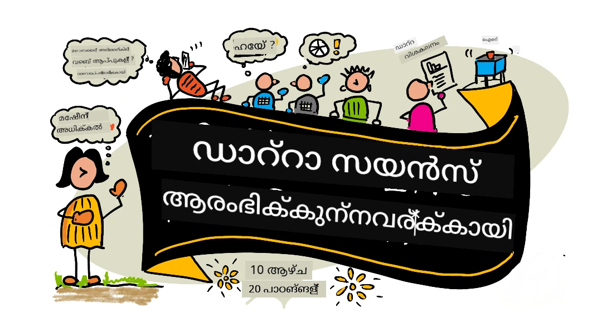
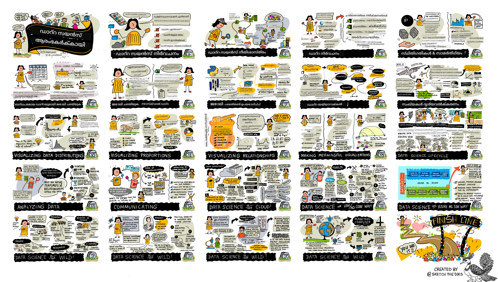

# തുടക്കക്കാർക്കായി ഡേറ്റാ സയൻസ് - ഒരു പഠനപദ്ധതി

[](https://github.com/codespaces/new?hide_repo_select=true&ref=main&repo=344191198)

[](https://github.com/microsoft/Data-Science-For-Beginners/blob/master/LICENSE)
[](https://GitHub.com/microsoft/Data-Science-For-Beginners/graphs/contributors/)
[](https://GitHub.com/microsoft/Data-Science-For-Beginners/issues/)
[](https://GitHub.com/microsoft/Data-Science-For-Beginners/pulls/)
[](http://makeapullrequest.com)

[](https://GitHub.com/microsoft/Data-Science-For-Beginners/watchers/)
[](https://GitHub.com/microsoft/Data-Science-For-Beginners/network/)
[](https://GitHub.com/microsoft/Data-Science-For-Beginners/stargazers/)


[](https://discord.gg/nTYy5BXMWG)

[](https://aka.ms/foundry/forum)

Microsoft-ലുള്ള Azure ക്ലൗഡ് ആഡ്വോക്കറ്റുകൾ ഡേറ്റാ സയൻസ് സംബന്ധിച്ചുള്ള 10 ആഴ്ചകളും 20 ലെഷൻസും ഉൾപ്പെടുന്ന ഒരു പഠനപദ്ധതി നിങ്ങൾക്കായി ഒരുക്കിയിരിക്കുന്നതിൽ സന്തോഷവാന്മാരായിരിക്കുന്നു. ഓരോ ലെഷനിലും പ്രീ-ലെഷൻ, പോസ്റ്റ്-ലെഷൻ ക്വിസുകളും, ലെഷൻ പൂർത്തിയാക്കാനുള്ള എഴുത്ത് നിർദ്ദേശങ്ങളും, ഒരു പരിഹാരവും, ഒരു അസൈൻമെന്റും ഉൾക്കുന്നുണ്ട്.   നമ്മുടെ പ്രൊജക്റ്റ് അടിസ്ഥാനമാക്കിയ പഠനരീതി നിങ്ങൾക്ക് പഠിച്ചു ആഹ്ലാദകരമായി നിർമ്മിക്കുന്നതിനും സഹായിക്കുന്നു, ഇതൊരു പുതിയ കഴിവുകൾ ‘പിടിപ്പിക്കാൻ’ പ്രമാണമായ രീതിയാണ്.

**ഞങ്ങളുടെ എഴുത്തുകാരെ ഹൃദയപൂർവം നന്ദി:** [Jasmine Greenaway](https://www.twitter.com/paladique), [Dmitry Soshnikov](http://soshnikov.com), [Nitya Narasimhan](https://twitter.com/nitya), [Jalen McGee](https://twitter.com/JalenMcG), [Jen Looper](https://twitter.com/jenlooper), [Maud Levy](https://twitter.com/maudstweets), [Tiffany Souterre](https://twitter.com/TiffanySouterre), [Christopher Harrison](https://www.twitter.com/geektrainer).

**🙏 പ്രത്യേക നന്ദി 🙏 നമ്മുടെ [Microsoft Student Ambassador](https://studentambassadors.microsoft.com/) എഴുത്തുകാരന്‍മാർ‌, അവലോകകരും ഉള്ളടക്ക സംഭാവകരും,** പ്രധാനമായും Aaryan Arora, [Aditya Garg](https://github.com/AdityaGarg00), [Alondra Sanchez](https://www.linkedin.com/in/alondra-sanchez-molina/), [Ankita Singh](https://www.linkedin.com/in/ankitasingh007), [Anupam Mishra](https://www.linkedin.com/in/anupam--mishra/), [Arpita Das](https://www.linkedin.com/in/arpitadas01/), ChhailBihari Dubey, [Dibri Nsofor](https://www.linkedin.com/in/dibrinsofor), [Dishita Bhasin](https://www.linkedin.com/in/dishita-bhasin-7065281bb), [Majd Safi](https://www.linkedin.com/in/majd-s/), [Max Blum](https://www.linkedin.com/in/max-blum-6036a1186/), [Miguel Correa](https://www.linkedin.com/in/miguelmque/), [Mohamma Iftekher (Iftu) Ebne Jalal](https://twitter.com/iftu119), [Nawrin Tabassum](https://www.linkedin.com/in/nawrin-tabassum), [Raymond Wangsa Putra](https://www.linkedin.com/in/raymond-wp/), [Rohit Yadav](https://www.linkedin.com/in/rty2423), Samridhi Sharma, [Sanya Sinha](https://www.linkedin.com/mwlite/in/sanya-sinha-13aab1200),
[Sheena Narula](https://www.linkedin.com/in/sheena-narua-n/), [Tauqeer Ahmad](https://www.linkedin.com/in/tauqeerahmad5201/), Yogendrasingh Pawar , [Vidushi Gupta](https://www.linkedin.com/in/vidushi-gupta07/), [Jasleen Sondhi](https://www.linkedin.com/in/jasleen-sondhi/)

||
|:---:|
| തുടക്കക്കാരുടെ ഡേറ്റാ സയൻസ് - _സ്കെച്ച്നോട്ട് [@nitya](https://twitter.com/nitya) സ്രഷ്ടിച്ചത്_ |

### 🌐 ബഹുഭാഷാ പിന്തുണ

#### GitHub ആക്ഷൻ വഴി പിന്തുണ (സ്വകാര്യവും കൊണ്ട് എപ്പോഴും പുതുക്കപ്പെട്ടതുമായത്)

<!-- CO-OP TRANSLATOR LANGUAGES TABLE START -->
[Arabic](../ar/README.md) | [Bengali](../bn/README.md) | [Bulgarian](../bg/README.md) | [Burmese (Myanmar)](../my/README.md) | [Chinese (Simplified)](../zh-CN/README.md) | [Chinese (Traditional, Hong Kong)](../zh-HK/README.md) | [Chinese (Traditional, Macau)](../zh-MO/README.md) | [Chinese (Traditional, Taiwan)](../zh-TW/README.md) | [Croatian](../hr/README.md) | [Czech](../cs/README.md) | [Danish](../da/README.md) | [Dutch](../nl/README.md) | [Estonian](../et/README.md) | [Finnish](../fi/README.md) | [French](../fr/README.md) | [German](../de/README.md) | [Greek](../el/README.md) | [Hebrew](../he/README.md) | [Hindi](../hi/README.md) | [Hungarian](../hu/README.md) | [Indonesian](../id/README.md) | [Italian](../it/README.md) | [Japanese](../ja/README.md) | [Kannada](../kn/README.md) | [Khmer](../km/README.md) | [Korean](../ko/README.md) | [Lithuanian](../lt/README.md) | [Malay](../ms/README.md) | [Malayalam](./README.md) | [Marathi](../mr/README.md) | [Nepali](../ne/README.md) | [Nigerian Pidgin](../pcm/README.md) | [Norwegian](../no/README.md) | [Persian (Farsi)](../fa/README.md) | [Polish](../pl/README.md) | [Portuguese (Brazil)](../pt-BR/README.md) | [Portuguese (Portugal)](../pt-PT/README.md) | [Punjabi (Gurmukhi)](../pa/README.md) | [Romanian](../ro/README.md) | [Russian](../ru/README.md) | [Serbian (Cyrillic)](../sr/README.md) | [Slovak](../sk/README.md) | [Slovenian](../sl/README.md) | [Spanish](../es/README.md) | [Swahili](../sw/README.md) | [Swedish](../sv/README.md) | [Tagalog (Filipino)](../tl/README.md) | [Tamil](../ta/README.md) | [Telugu](../te/README.md) | [Thai](../th/README.md) | [Turkish](../tr/README.md) | [Ukrainian](../uk/README.md) | [Urdu](../ur/README.md) | [Vietnamese](../vi/README.md)

> **പ്രിയപ്പെട്ടവർക്ക് ലോക്കലായി ക്ലോൺ ചെയ്യാനോ ആഗ്രഹമാണോ?**
>
> ഈ റിപ്പോസിറ്ററിയിൽ 50ലധികം ഭാഷാ പരിഭാഷകൾ ഉൾപ്പടുന്നുണ്ട്, അതിനാൽ ഡൗൺലോഡ് വലുതാണ്. പരിഭാഷകൾ ഒഴിച്ച് ക്ലോൺ ചെയ്യാൻ sparse checkout ഉപയോഗിക്കുക:
>
> **Bash / macOS / Linux:**
> ```bash
> git clone --filter=blob:none --sparse https://github.com/microsoft/Data-Science-For-Beginners.git
> cd Data-Science-For-Beginners
> git sparse-checkout set --no-cone '/*' '!translations' '!translated_images'
> ```
>
> **CMD (Windows):**
> ```cmd
> git clone --filter=blob:none --sparse https://github.com/microsoft/Data-Science-For-Beginners.git
> cd Data-Science-For-Beginners
> git sparse-checkout set --no-cone "/*" "!translations" "!translated_images"
> ```
>
> ഇത് വളരെ വേഗം ഡൗൺലോഡ് ചെയ്ത് കോഴ്സ് പൂർത്തിയാക്കാൻ നിങ്ങൾക്ക് ആവശ്യമായ എല്ലാ ഉള്ളടക്കവും നൽകും.
<!-- CO-OP TRANSLATOR LANGUAGES TABLE END -->

**ഞാൻ ആഗ്രഹിക്കുന്നെങ്കിൽ കൂടുതൽ ഭാഷാ പരിഭാഷകൾക്ക് പിന്തുണ ലഭ്യമാക്കുന്നതിന്റെ പട്ടിക [ഇവിടെ](https://github.com/Azure/co-op-translator/blob/main/getting_started/supported-languages.md) കാണുക**

#### ഞങ്ങളുടെ സമൂഹവുമായി ചേർക്കുക
[](https://discord.gg/nTYy5BXMWG)

നമുക്ക് Discord-യിൽ കൃത്രിമബുദ്ധിയുമായുള്ള പഠന പരമ്പര തുടരുകയാണ്, കൂടുതൽ അറിയാനാകും, കൂടെ ചേരാനും [Learn with AI Series](https://aka.ms/learnwithai/discord) 2025 സെപ്റ്റംബർ 18 മുതൽ 30 വരെ. GitHub Copilot ഡേറ്റാ സയൻസിനായി ഉപയോഗിക്കുന്നതിനുള്ള ടിപ്പ്‌സും താരതമ്യങ്ങളും നിങ്ങൾക്ക് ലഭിക്കും.


# നിങ്ങൾ ഒരു വിദ്യാർത്ഥിയാണോ?

അടുത്തുള്ള വనരൂപങ്ങളിലൂടെ തുടങ്ങുക:

- [Student Hub പേജ്](https://docs.microsoft.com/en-gb/learn/student-hub?WT.mc_id=academic-77958-bethanycheum) ഈ പേജിൽ നിങ്ങൾക്ക് തുടക്കക്കാരെ സഹായിക്കുന്ന വനങ്ങൾ, വിദ്യാർത്ഥി പാക്കുകൾ, ഫ്രീ സർട്ട് വൗച്ചർ ലഭിക്കുന്ന മാർഗ്ഗങ്ങൾ എന്നിവ കാണാം. ഈ പേജ് നിങ്ങൾക്ക് സമയം സമയം സന്ദർശിക്കുക, കാരണം ഓരോ മാസവും ഉള്ളടക്കം പുതുക്കുന്നു.
- [Microsoft Learn Student Ambassadors](https://studentambassadors.microsoft.com?WT.mc_id=academic-77958-bethanycheum) ഒരു ആഗോള വിദ്യാർത്ഥി അംബാസഡർ സമൂഹത്തിലേക്ക് ചേർന്നേക്കാം, ഇത് Microsoft-ലേക്ക് നിങ്ങളുടെ വഴി ആകാം.

# ആരംഭിക്കുന്നത്

## 📚 ഡോക്യുമെന്റേഷൻ

- **[ഇൻസ്റ്റലേഷൻ ഗൈഡ്](INSTALLATION.md)** - തുടക്കക്കാർക്കുള്ള പടിവഴികൾ
- **[ഉപയോഗം ഗൈഡ്](USAGE.md)** - ഉദാഹരണങ്ങളും സാധാരണ പ്രവൃത്തികളുമാണ്
- **[പ്രശ്‌നപരിഹാരം](TROUBLESHOOTING.md)** - സാധാരണ പ്രശ്‌നങ്ങൾക്കുള്ള പരിഹാരങ്ങൾ
- **[സംഭാവന ഗൈഡ്](CONTRIBUTING.md)** - ഈ പ്രൊജക്ടിൽ സംഭാവന ചെയ്യുന്നത് എങ്ങനെ
- **[അധ്യാപകർക്ക്](for-teachers.md)** - പഠിപ്പിക്കുന്ന മാർഗ്ഗദർശനവും ക്ലാസ് റിസോഴ്‌സുകളും

## 👨‍🎓 വിദ്യാർത്ഥികൾക്കായി
> **പൂർത്തിയായ തുടക്കക്കാർ**: ഡേറ്റാ സയൻസ് പുതിയതായി പഠിക്കണോ? ഞങ്ങളുടെ [തുടക്കക്കാരെ സഹായിക്കുന്ന ഉദാഹരണങ്ങൾ](examples/README.md) കൊണ്ട് ആരംഭിക്കുക! ഈ ലളിതവും വിശദീകരിക്കപ്പെട്ട ഉദ്ധരണികൾ ബോധ്യപ്പെടാൻ സഹായിക്കും, പൂർണ്ണ പഠനപദ്ധതിയുടെ മുമ്പ് അടിസ്ഥാനങ്ങൾ മനസ്സിലാക്കാൻ.
> **[വിദ്യാർത്ഥികൾ](https://aka.ms/student-page)**: ഈ പഠനപദ്ധതി സ്വയം ഉപയോഗിക്കാൻ, മുഴുവൻ റിപ്പോ ഫോർക്കുചെയ്ത് സ്വതന്ത്രമായി അഭ്യാസങ്ങൾ പൂർത്തിയാക്കുക, പ്രീ-ലെക്ഷർ ക്വിസ് പ്രാഥമികമായി ചെയ്യുക. പിന്നീട് ലെക്ഷർ വായിച്ച് ബാക്കി പ്രവർത്തനങ്ങൾ പൂർത്തിയാക്കുക. പരിഹാര കോഡ് പകർന്നു നൽകുന്നത് ഒഴിവാക്കി ലെക്ഷനിലെ അർത്ഥം മനസ്സിലാക്കുകയാണെങ്കിൽ പ്രൊജക്റ്റുകൾ സൃഷ്ടിക്കാൻ ശ്രമിക്കുക; എങ്കിലും, പരിഹാര കോഡ് ഓരോ പ്രൊജക്റ്റ്-അഭിമുഖമായ ലെഷനിലെ /solutions ഫോളഡറുകളിലുണ്ട്. മറ്റൊരു മാർഗ്ഗം കൂട്ടുകാർക്കൊപ്പം പഠന സംഘം രൂപീകരിച്ച് ഉള്ളടക്കം ഒരുമിച്ച് മനസ്സിലാക്കുക എന്നതാണ്. കൂടുതൽ പഠനത്തിന് [Microsoft Learn](https://docs.microsoft.com/en-us/users/jenlooper-2911/collections/qprpajyoy3x0g7?WT.mc_id=academic-77958-bethanycheum) ശുപാർശ ചെയ്യുന്നു.

**ശീഘ്രാരംഭം:**
1. നിങ്ങളുടെ പരിസ്ഥിതി ക്രമീകരിക്കാനായി [ഇൻസ്റ്റലേഷൻ ഗൈഡ്](INSTALLATION.md) പരിശോധിക്കുക
2. ഈ പഠനപദ്ധതിയിൽ പ്രവർത്തിക്കുവാനുള്ള മാർഗ്ഗങ്ങൾ മനസ്സിലാക്കുവാൻ [ഉപയോഗം ഗൈഡ്](USAGE.md) അവലോകനം ചെയ്യുക
3. ലെഷൻ 1നു തുടക്കം കുറിച്ച് തുടർച്ചയായി ജോലിചെയ്യുക
4. പിന്തുണയ്ക്ക് ഞങ്ങളുടെ [Discord സമൂഹത്തിൽ](https://aka.ms/ds4beginners/discord) ചേരുക

## 👩‍🏫 അധ്യാപകർക്ക്
> **അധ്യാപകർ**: ഈ പാഠ്യപദ്ധതി എങ്ങിനെ ഉപയോഗിക്കാമെന്നു സംബന്ധിച്ച [ചില നിർദ്ദേശങ്ങൾ ഞങ്ങൾ ഉൾപ്പെടുത്തിയിട്ടുണ്ട്](for-teachers.md). നിങ്ങളുടെ അഭിപ്രായങ്ങൾ [ഞങ്ങളുടെ ചർച്ചാ ഫോറത്തിലേക്ക്](https://github.com/microsoft/Data-Science-For-Beginners/discussions) സ്വാഗതം ചെയ്യും!

## ടീം രക്ഷിക്കുക

[](https://youtu.be/8mzavjQSMM4 "പ്രമോ വീഡിയോ")

**ഗിഫ്** [മോഹിത് ജയിസൽ](https://www.linkedin.com/in/mohitjaisal)

> 🎥 പദ്ധതി സൃഷ്ടിച്ചവരുടെ വീഡിയോക്കായി മുകളിൽ ചിത്രത്തിൽ ക്ലിക്ക് ചെയ്യുക!

## പാഠശാസ്ത്രം

ഈ പാഠ്യപദ്ധതി രൂപപ്പെടുത്തുമ്പോൾ ഞങ്ങൾ രണ്ട് അധ്യാപന സിദ്ധാന്തങ്ങൾ തിരഞ്ഞെടുക്കുകയും ചെയ്തു: ഇത് പ്രൊജക്ട് അടിസ്ഥാനമാക്കിയാണെന്ന് ഉറപ്പാക്കുകയും, പതിവായി ക്വിസുകൾ ഉൾപ്പെടുത്തുകയും ചെയ്യുക. ഈ പരമ്പരയുടെ അവസാനം, വിദ്യാർത്ഥികൾക്ക് ഡാറ്റ സയൻസിന്റെ അടിസ്ഥാന തത്ത്വങ്ങൾ, ഇടപാടുകാർക്കുള്ള സദാചാര ആശയങ്ങൾ, ഡാറ്റ ഒരുക്കൽ, ഡാറ്റയിൽ പ്രവർത്തിക്കുന്ന വ്യത്യസ്ത മാർഗങ്ങൾ, ഡാറ്റ ദൃശ്യീകരണം, ഡാറ്റ വിശകലനം, ഡാറ്റ സയൻസിന്റെ യഥാർത്ഥ ലോക പ്രയോഗങ്ങൾ തുടങ്ങി കൂടുതൽ കാര്യങ്ങൾ പഠിക്കാനാകും.

തുടർന്ന്, ഒരു ക്ലാസിന് മുൻപ് നടത്തപ്പെടുന്ന കുറഞ്ഞമുതൽ ക്വിസ് വിദ്യാർത്ഥിയുടെ വിഷയ പഠനത്തിലേക്കുള്ള ഉദ്ദേശ്യം നിർണ്ണയിക്കുന്നു, കൂടാതെ ക്ലാസിനു ശേഷം രണ്ടാമത്തെ ക്വിസ് കൂടുതൽ നിലനിൽപ്പിനായി ഉപകരിക്കും. ഈ പാഠ്യപദ്ധതി സൗകര്യപ്രദവും രസകരവുമായിട്ട് രൂപകൽപ്പന ചെയ്തിട്ടുണ്ട്, മുഴുവനായി അല്ലെങ്കിൽ ഭാഗികമായി ഇത് സ്വീകരിക്കാവുന്നതാണ്. പ്രോജക്റ്റുകൾ ചെറുതായി ആരംഭിച്ച് 10 ആഴ്ച കാൽവർഷം മുഴുവനോടെ കൂടുതൽ സങ്കീർണ്ണമാകും.

> [ഞങ്ങളുടെ പ്രവർത്തനചട്ടം](CODE_OF_CONDUCT.md), [സംവാദം](CONTRIBUTING.md), [ഭാഷാന്തരം](TRANSLATIONS.md) മാർഗ്ഗനിർദ്ദേശങ്ങൾ കാണുക. നിങ്ങളുടെ നന്മയുള്ള അഭിപ്രായങ്ങൾ ഞങ്ങൾ സ്വാഗതം ചെയ്യുന്നു!

## ഓരോ പാഠവും ഉൾക്കൊള്ളുന്നതിൽ:

- ഇച്ഛാനുസൃത സ്‌കെച്ച്നോട്ട്
- ഇച്ഛാനുസൃത ഉപരിതല വീഡിയോ
- പാഠം മുന്നറിയിപ്പായി വാര്മപ്പ് ക്വിസ്
- എഴുത്തുപ്രബന്ധം
- പ്രോജക്റ്റ് അടിസ്ഥാന പാഠങ്ങൾക്ക്, പ്രോജക്റ്റ് നിർമ്മിക്കാൻ ഘട്ടംഘട്ട മാർഗ്ഗനിർദ്ദേശങ്ങൾ
- അറിവ് പരിശോധനകൾ
- ഒരു ചേല്ലഞ്ച്
- പൂരക വായന
- അസൈൻമെന്റ്
- [പാഠം കഴിഞ്ഞുള്ള ക്വിസ്](https://ff-quizzes.netlify.app/en/)

> **ക്വിസുകൾക്കുറിച്ച് ഒരു കുറിപ്പ്**: മുഴുവൻ ക്വിസുകളും Quiz-App ഫോൾഡറിൽ 40 എണ്ണം, ഓരോതിലും മൂന്ന് ചോദ്യങ്ങളടങ്ങിയവയാണ്. ഇവ പാഠങ്ങളിൽ നിന്നാകും ലിങ്ക് ചെയ്യപ്പെട്ടത്, പക്ഷേ ക്വിസ് ആപ്പ് പ്രാദേശികമായി പ്രവർത്തിപ്പിക്കാനോ ആസ്യൂറിൽ വിനിയോഗിക്കാനോ കഴിയും; `quiz-app` ഫോൾഡറിൽ ഉള്ള നിർദ്ദേശങ്ങൾ പാലിക്കുക. ഇത് ക്രമാതീതമായി ഭാഷാന്തരപ്പെടുത്തിയെടുക്കുന്നു.

## 🎓 തുടക്കക്കാർക്കായി സൗഹൃദമായ ഉദാഹരണങ്ങൾ

**ഡാറ്റ സയൻസ് പുതിയയാളോ?** തുടക്കം കുറിക്കാൻ സഹായവും നന്നായി നിക്ക്‌ളവിയ എടുത്തുകൊടുത്ത കോഡും ഉൾക്കൊള്ളുന്ന പ്രത്യേക [ഉദാഹരണ ഡയറക്ടറി](examples/README.md) ഞങ്ങൾ സൃഷ്ടിച്ചിട്ടുണ്ട്:

- 🌟 **ഹലോ വേൾഡ്** - നിങ്ങളുടെ ആദ്യ ഡാറ്റ സയൻസ് പ്രോഗ്രാം  
- 📂 **ഡാറ്റ ലോഡിംഗ്** - ഡാറ്റാസെറ്റുകൾ വായിക്കുകയും അന്വേഷണവും ചെയ്ത് പഠിക്കുക  
- 📊 **സാധാരണ വിശകലനം** - സ്ഥിതിവിവര കണക്ക് കൂട്ടി മാതൃകകൾ കണ്ടെത്തുക  
- 📈 ** അടിസ്ഥാന ദൃശ്യീകരണം ** - ചാർട്ടുകളും ഗ്രാഫുകളും സൃഷ്ടിക്കുക  
- 🔬 ** യഥാർത്ഥ ലോക പ്രോജക്ട് ** - ആരംഭത്തിൽ നിന്നു സമ്പൂർണ്ണ പ്രവൃത്തി പ്രവാഹം  

ഓരോ ഉദാഹരണത്തിലും എല്ലാ ഘട്ടവും വിശദമായി വിശദീകരിച്ചിട്ടുള്ള ഉദ്ദേശ്യങ്ങള്‍ ഉള്ളതുകൊണ്ട്, നിശ്ചയമായും തുടങ്ങി തുടങ്ങുന്നവർക്കും ഇത് ഏറ്റവും അനുയോജ്യമാണ്!

👉 **[ഉദാഹരണങ്ങളോടെ ആരംഭിക്കുക](examples/README.md)** 👈

## പാഠങ്ങൾ


||
|:---:|
| ഡാറ്റ സയൻസ് ഫോർ ബിഗിന്നേഴ്സ്: റോഡ്‌മാപ്പ് - _സ്‌കെച്ച്നോട്ട് [@nitya](https://twitter.com/nitya) ത്തിൽ നിന്നുള്ളത്_ |


| പാഠ നമ്പർ | വിഷയം | പാഠ ഗ്രൂപ്പിംഗ് | പഠന ലക്ഷ്യങ്ങൾ | ലിങ്കുചെയ്ത പാഠം | എഴുതിയവൻ |
| :-----------: | :----------------------------------------: | :--------------------------------------------------: | :-----------------------------------------------------------------------------------------------------------------------------------------------------------------------: | :---------------------------------------------------------------------: | :----: |
| 01 | ഡാറ്റ സയൻസ് നിർവചനം | [പരിചയം](1-Introduction/README.md) | ഡാറ്റ സയൻസ് പിന്നിൽ ഉൾപ്പെടുന്ന അടിസ്ഥാന ആശയങ്ങൾ, അത് കൃത്രിമ ബുദ്ധി, മെഷീൻ ലേണിങ്, വലിയ ഡാറ്റ എന്നിവയുമായി എങ്ങനെ ബന്ധപ്പെട്ടിരിക്കുന്നുവെന്ന് പഠിക്കുക. | [പാഠം](1-Introduction/01-defining-data-science/README.md) [വീഡിയോ](https://youtu.be/beZ7Mb_oz9I) | [ദ്മിത്രി](http://soshnikov.com) |
| 02 | ഡാറ്റ സയൻസ് സദാചാരം | [പരിചയം](1-Introduction/README.md) | ഡാറ്റ സദാചാര ആശയങ്ങൾ, വെല്ലുവിളികൾ & ഫ്രെയിംവർക്ക്. | [പാഠം](1-Introduction/02-ethics/README.md) | [നിത്യ](https://twitter.com/nitya) |
| 03 | ഡാറ്റ നിർവചനം | [പരിചയം](1-Introduction/README.md) | ഡാറ്റ എങ്ങനെ വർഗ്ഗീകരിക്കപ്പെടുന്നു, സാധാരണ ഉറവിടങ്ങൾ. | [പാഠം](1-Introduction/03-defining-data/README.md) | [ജാസ്മിൻ](https://www.twitter.com/paladique) |
| 04 | സ്ഥിതിവിവരവും സാദ്ധ്യതയും പരിചയപ്പെടുത്തൽ | [പരിചയം](1-Introduction/README.md) | ഡാറ്റ മനസ്സിലാക്കുന്നതിനുള്ള സാദ്ധ്യതയും സ്ഥിതിവിവരശാസ്ത്രവും സംബന്ധിച്ച ഗണിത തന്ത്രങ്ങൾ. | [പാഠം](1-Introduction/04-stats-and-probability/README.md) [വീഡിയോ](https://youtu.be/Z5Zy85g4Yjw) | [ദ്മിത്രി](http://soshnikov.com) |
| 05 | ബന്ധമുള്ള ഡാറ്റ ഉപയോഗിക്കൽ | [ഡാറ്റയുമായി പ്രവർത്തിക്കൽ](2-Working-With-Data/README.md) | ബന്ധമുള്ള ഡാറ്റ പരിചയപ്പെടുത്തൽ, SQL (എസ്‌ക്യൂഎൽ) ഉപയോഗിച്ച് ഡാറ്റ അന്വേഷിക്കുകയും വിശകലനം ചെയ്യുന്നതിന്റെ അടിസ്ഥാനങ്ങൾ. | [പാഠം](2-Working-With-Data/05-relational-databases/README.md) | [ക്രിസ്റ്റഫർ](https://www.twitter.com/geektrainer) | | |
| 06 | നോൺ-എസ്‌ക്യൂഎൽ ഡാറ്റ ഉപയോഗിക്കൽ | [ഡാറ്റയുമായി പ്രവർത്തിക്കൽ](2-Working-With-Data/README.md) | ബന്ധരഹിത ഡാറ്റ പരിചയപ്പെടുത്തൽ, അതിന്റെ വിവിധ തരങ്ങൾ, ഡോക്യുമെന്റ് ഡാറ്റാബേസുകൾ അന്വേഷിച്ചു വിശകലനം ചെയ്യുന്നതിന്റെ അടിസ്ഥാനങ്ങൾ. | [പാഠം](2-Working-With-Data/06-non-relational/README.md) | [ജാസ്മിൻ](https://twitter.com/paladique)|
| 07 | പൈത്തൺ ഉപയോഗിക്കുക | [ഡാറ്റയുമായി പ്രവർത്തിക്കൽ](2-Working-With-Data/README.md) | പാൻഡാസ് പോലുള്ള ലൈബ്രറികൾ ഉപയോഗിച്ച് ഡാറ്റ അന്വേഷിക്കുന്നതിനുള്ള പൈത്തൺ അടിസ്ഥാനങ്ങൾ. പൈത്തൺ പ്രോഗ്രാമിങ് അടിസ്ഥാന പരിജ്ഞാനം നിർബന്ധമാണ്. | [പാഠം](2-Working-With-Data/07-python/README.md) [വീഡിയോ](https://youtu.be/dZjWOGbsN4Y) | [ദ്മിത്രി](http://soshnikov.com) |
| 08 | ഡാറ്റ ഒരുക്കൽ | [ഡാറ്റയുമായി പ്രവർത്തിക്കൽ](2-Working-With-Data/README.md) | നഷ്ടമായ, തെറ്റായ, അല്ലെങ്കിൽ അപൂർണ്ണമായ ഡാറ്റ ചുരുക്കുന്നതിന് ക്ലീൻ ചെയ്യുകയും പരിവർത്തനം ചെയ്യുന്നതിനുള്ള ഡാറ്റാ സാങ്കേതികതകൾ. | [പാഠം](2-Working-With-Data/08-data-preparation/README.md) | [ജാസ്മിൻ](https://www.twitter.com/paladique) |
| 09 | അളവുകൾ ദൃശ്യീകരിക്കൽ | [ഡാറ്റാ ദൃശ്യീകരണം](3-Data-Visualization/README.md) | മാട്പ്ലോട്ട്ലിബ് ഉപയോഗിച്ച് പാറി ഡാറ്റ കാണിക്കുക 🦆 | [പാഠം](3-Data-Visualization/09-visualization-quantities/README.md) | [ജെൻ](https://twitter.com/jenlooper) |
| 10 | ഡാറ്റ വזיך ചിതറലുകളുടെ ദൃശ്യവൽക്കരണം | [ഡാറ്റാ ദൃശ്യീകരണം](3-Data-Visualization/README.md) | ഒരു ഇടവേളയിലുള്ള നിരീക്ഷണങ്ങളും പ്രവണതകളും ദൃശ്യവൽക്കരം. | [പാഠം](3-Data-Visualization/10-visualization-distributions/README.md) | [ജെൻ](https://twitter.com/jenlooper) |
| 11 | അളവുകളുടെ ദൃശ്യവൽക്കരണം | [ഡാറ്റാ ദൃശ്യീകരണം](3-Data-Visualization/README.md) | പ്രത്യക്ഷമായും ഗണനാത്മകമായി ശതമാനങ്ങൾ കാണിക്കുക. | [പാഠം](3-Data-Visualization/11-visualization-proportions/README.md) | [ജെൻ](https://twitter.com/jenlooper) |
| 12 | ബന്ധങ്ങളുടെ ദൃശ്യവൽക്കരണം | [ഡാറ്റാ ദൃശ്യീകരണം](3-Data-Visualization/README.md) | ഡാറ്റാ സെറ്റുകൾക്കിടയിലെ കണക്ഷനുകൾ, സഹബന്ധങ്ങൾ ദൃശ്യമാക്കൽ. | [പാഠം](3-Data-Visualization/12-visualization-relationships/README.md) | [ജെൻ](https://twitter.com/jenlooper) |
| 13 | പ്രാധാന്യമുള്ള ദൃശ്യവൽക്കരണങ്ങൾ | [ഡാറ്റാ ദൃശ്യീകരണം](3-Data-Visualization/README.md) | ഫലപ്രദമായ പ്രശ്‌നം പരിഹാരത്തിനും洞察ങ്ങൾക്കും നിങ്ങളുടെ ദൃശ്യവൽക്കരണങ്ങൾ മൂല്യമർപ്പിക്കുന്ന സാങ്കേതിക വിദ്യകളും മാർഗ്ഗനിർദ്ദേശങ്ങളും. | [പാഠം](3-Data-Visualization/13-meaningful-visualizations/README.md) | [ജെൻ](https://twitter.com/jenlooper) |
| 14 | ഡാറ്റ സയൻസ് ലൈഫ്സൈക്കിൾ പരിചയപ്പെടുത്തൽ | [ലൈഫ്സൈക്കിൾ](4-Data-Science-Lifecycle/README.md) | ഡാറ്റ സയൻസ് ലൈഫ്സൈക്കിള്‍ പരിചയപ്പെടുത്തൽ, ആദ്യഘട്ടം: ഡാറ്റ സംഭരണം, എന്നിവ. | [പാഠം](4-Data-Science-Lifecycle/14-Introduction/README.md) | [ജാസ്മിൻ](https://twitter.com/paladique) |
| 15 | വിശകലനം | [ലൈഫ്സൈക്കിൾ](4-Data-Science-Lifecycle/README.md) | ഡാറ്റ സയൻസ് ലൈഫ്സൈക്കിളിലെ ഈ ഘട്ടം ഡാറ്റ വിശകലന സാങ്കേതിക വിദ്യകളിൽ ശ്രദ്ധ കേന്ദ്രീകരിക്കുന്നു. | [പാഠം](4-Data-Science-Lifecycle/15-analyzing/README.md) | [ജാസ്മിൻ](https://twitter.com/paladique) | | |
| 16 | ആശയവിനിമയം | [ലൈഫ്സൈക്കിൾ](4-Data-Science-Lifecycle/README.md) | ഡാറ്റയിൽ നിന്ന് നിങ്ങൾ ശക്തമായ洞察ങ്ങൾ പരിചയപ്പെടുത്തുക, തീരുമാനമെടുക്കുന്നവർക്കു മനസ്സിലാക്കാനായ രീതിയിൽ, ഈ ഘട്ടം ശ്രദ്ധ കേന്ദ്രീകരിക്കുന്നു. | [പാഠം](4-Data-Science-Lifecycle/16-communication/README.md) | [ജാലെൻ](https://twitter.com/JalenMcG) | | |
| 17 | ക്ലൗഡിൽ ഡാറ്റ സയൻസ് | [ക്ലൗഡ് ഡാറ്റ](5-Data-Science-In-Cloud/README.md) | ക്ലൗഡിലെ ഡാറ്റ സയൻസ് പരിചയപ്പെടുത്തലും അതിന്റെ ഗുണങ്ങളും. | [പാഠം](5-Data-Science-In-Cloud/17-Introduction/README.md) | [ടിഫാനി](https://twitter.com/TiffanySouterre) and [മോഡ്](https://twitter.com/maudstweets) |
| 18 | ക്ലൗഡിൽ ഡാറ്റ സയൻസ് | [ക്ലൗഡ് ഡാറ്റ](5-Data-Science-In-Cloud/README.md) | ലോ കോഡ് ഉപകരണങ്ങളിലൂടെയുള്ള മോഡൽ പരിശീലനം. |[പാഠം](5-Data-Science-In-Cloud/18-Low-Code/README.md) | [ടിഫാനി](https://twitter.com/TiffanySouterre) and [മോഡ്](https://twitter.com/maudstweets) |
| 19 | ക്ലൗഡില് ഡാറ്റ സയൻസ് | [ക്ലൗഡ് ഡാറ്റ](5-Data-Science-In-Cloud/README.md) | ആസ്യൂർ മെഷീൻ ലേണിംഗ് സ്റ്റുഡിയോ ഉപയോഗിച്ച് മോഡലുകൾ വിനിയോഗിക്കൽ. | [പാഠം](5-Data-Science-In-Cloud/19-Azure/README.md)| [ടിഫാനി](https://twitter.com/TiffanySouterre) and [മോഡ്](https://twitter.com/maudstweets) |
| 20 | യഥാർത്ഥ ലോകത്തിലെ ഡാറ്റ സയൻസ് | [ഇൻ ദി വائل്ഡ്](6-Data-Science-In-Wild/README.md) | യഥാർത്ഥ ലോകം കേന്ദ്രീകരിച്ച ഡാറ്റ സയൻസ് പ്രോജക്റ്റുകൾ. | [പాఠം](6-Data-Science-In-Wild/20-Real-World-Examples/README.md) | [നിത്യ](https://twitter.com/nitya) |

## GitHub കോഡ്സ്പേസുകൾ

ഈ സാമ്പിൾ കോഡ്സ്പേസ് ഉപയോഗിച്ച് തുറക്കാൻ താഴെ ഉള്ള ഘട്ടങ്ങൾ പിന്തുടരുക:
1. കോഡ് ഡ്രോപ്പ്-ഡൗൺ മെനുവിൽ ക്ലിക്ക് ചെയ്ത് Open with Codespaces ഓപ്ഷൻ തിരഞ്ഞെടുക്കുക.
2. പെട്ടിയിലെ താഴെ + New codespace തിരഞ്ഞെടുക്കുക.
കൂടുതൽ വിവരങ്ങൾക്ക്, [GitHub ഡോക്യുമെന്റേഷൻ](https://docs.github.com/en/codespaces/developing-in-codespaces/creating-a-codespace-for-a-repository#creating-a-codespace) കാണുക.

## VSCode റിമോട്ട് - കണ്ടെയ്‌നറുകൾ
നിങ്ങളുടെ ലൊക്കൽ മെഷീനിലും VSCode-യിലും VS Code Remote - Containers എക്‌സ്ടൻഷൻ ഉപയോഗിച്ച് ഈ റീപോ കണ്ടെയ്‌നറിൽ തുറക്കാൻ താഴെ കാണുന്ന ഘട്ടങ്ങൾ പിന്തുടരുക:

1. ഇത് development container പ്രഥമമായി ഉപയോഗിക്കുന്നുവെങ്കിൽ, നിങ്ങളുടെ സിസ്റ്റം മുൻ നിറവുകൾക്കായി Docker ഇൻസ്റ്റാൾ ചെയ്തിട്ടുണ്ടെന്ന് ഉറപ്പാക്കുക [Getting Started ഡോക്യുമെന്റേഷൻ](https://code.visualstudio.com/docs/devcontainers/containers#_getting-started) കാണുക.

ഈ റീപൊ ഉപയോഗിക്കാൻ, നിങ്ങൾക്ക് റീപൊ Docker വോളിയമിൽ ഇസൊലേറ്റഡ് ആയി തുറക്കാം:

**ശ്രദ്ധിക്കേണ്ടത്**: ഇതിൽ Remote-Containers: **Clone Repository in Container Volume...** കമാൻഡ് ഉപയോഗിച്ച് സോഴ്‌സ് കോഡ് Docker വോളിയത്തിൽ ക്ലോൺ ചെയ്യുന്നു, ലൊക്കൽ ഫയൽസിസ്റ്റം ഉപയോഗിക്കുന്നതിന് പകരം. [Volumes](https://docs.docker.com/storage/volumes/) കണ്ടെയ്‌നർ ഡാറ്റ സംരക്ഷിക്കുന്നതിന് പ്രിയപ്പെട്ട മാർഗമാണ്.

അല്ലെങ്കിൽ, GitHub-ൽ നിന്നു ലോക്കലായി ക്ലോൺ ചെയ്ത കോപ്പി ഒഴിച്ച് തുറക്കാം:

- ഈ റീപൊ നിങ്ങളുടെ ലൊക്കൽ ഫയൽസിസ്റ്റത്തിലേക്ക് ക്ലോൺ ചെയ്യുക.
- F1 അമർത്തി **Remote-Containers: Open Folder in Container...** കമാൻഡ് തിരഞ്ഞെടുക്കുക.
- ക്ലോൺ ചെയ്ത ഈ ഫോൾഡർ തിരഞ്ഞെടുക്കുക, കണ്ടെയ്‌നർ തുടങ്ങാൻ കാത്തിരിക്കുക, പിന്നെ പരീക്ഷിക്കുക.

## ഓഫ്ലൈൻ ആക്‌സസ്സ്

[Docsify](https://docsify.js.org/#/) ഉപയോഗിച്ച് ഈ ഡോക്യുമെന്റേഷൻ ഓഫ്ലൈനായി പ്രവർത്തിപ്പിക്കാം. ഈ റീപോ ഫോർക്ക് ചെയ്യുക, [Docsify ഇൻസ്റ്റാൾ](https://docsify.js.org/#/quickstart) ചെയ്യുക, പിന്നെ ഈ റീപോയുടെ റൂട്ട് ഫോൾഡറിൽ `docsify serve` ടൈപ്പ് ചെയ്യുക. വെബ്സൈറ്റ് പോർട്ട് 3000 ൽ നിങ്ങളുടെ ലോകൽഹോസ്റ്റിൽ തുറക്കപ്പെടും: `localhost:3000`.

> ശ്രദ്ധിക്കുക, നോട്ട്ബുക്കുകൾ Docsify വഴി റെൻഡർ ചെയ്യപ്പെടുകയില്ല, അതിനാൽ നിങ്ങൾക്ക് നോട്ട്ബുക്ക് പ്രവർത്തിപ്പിക്കേണ്ടപ്പോൾ, Python കർണൽ പ്രവർത്തിപ്പിക്കുന്ന VSCode-യിൽ വെച്ച് വേലിയുറപ്പിച്ച് വേറെ പ്രവർത്തിപ്പിക്കുക.

## മറ്റ് പാഠപദ്ധതികൾ

ഞങ്ങളുടെ ടീം മറ്റ് പാഠപദ്ധതികളും തയ്യാറാക്കുന്നു! വിലയിരുത്തുക:

<!-- CO-OP TRANSLATOR OTHER COURSES START -->
### LangChain
[](https://aka.ms/langchain4j-for-beginners)
[](https://aka.ms/langchainjs-for-beginners?WT.mc_id=m365-94501-dwahlin)
[](https://github.com/microsoft/langchain-for-beginners?WT.mc_id=m365-94501-dwahlin)
---

### അസ്യൂർ / എഡ്ജ് / MCP / ഏജൻസുകൾ
[](https://github.com/microsoft/AZD-for-beginners?WT.mc_id=academic-105485-koreyst)
[](https://github.com/microsoft/edgeai-for-beginners?WT.mc_id=academic-105485-koreyst)
[](https://github.com/microsoft/mcp-for-beginners?WT.mc_id=academic-105485-koreyst)
[](https://github.com/microsoft/ai-agents-for-beginners?WT.mc_id=academic-105485-koreyst)

---
 
### ജനറേറ്റീവ് AI പരമ്പര
[](https://github.com/microsoft/generative-ai-for-beginners?WT.mc_id=academic-105485-koreyst)
[-9333EA?style=for-the-badge&labelColor=E5E7EB&color=9333EA)](https://github.com/microsoft/Generative-AI-for-beginners-dotnet?WT.mc_id=academic-105485-koreyst)
[-C084FC?style=for-the-badge&labelColor=E5E7EB&color=C084FC)](https://github.com/microsoft/generative-ai-for-beginners-java?WT.mc_id=academic-105485-koreyst)
[-E879F9?style=for-the-badge&labelColor=E5E7EB&color=E879F9)](https://github.com/microsoft/generative-ai-with-javascript?WT.mc_id=academic-105485-koreyst)

---
 
### കോർ പഠനം
[](https://aka.ms/ml-beginners?WT.mc_id=academic-105485-koreyst)
[](https://aka.ms/datascience-beginners?WT.mc_id=academic-105485-koreyst)
[](https://aka.ms/ai-beginners?WT.mc_id=academic-105485-koreyst)
[](https://github.com/microsoft/Security-101?WT.mc_id=academic-96948-sayoung)
[](https://aka.ms/webdev-beginners?WT.mc_id=academic-105485-koreyst)
[](https://aka.ms/iot-beginners?WT.mc_id=academic-105485-koreyst)
[](https://github.com/microsoft/xr-development-for-beginners?WT.mc_id=academic-105485-koreyst)

---
 
### കോപൈലറ്റ് പരമ്പര
[](https://aka.ms/GitHubCopilotAI?WT.mc_id=academic-105485-koreyst)
[](https://github.com/microsoft/mastering-github-copilot-for-dotnet-csharp-developers?WT.mc_id=academic-105485-koreyst)
[](https://github.com/microsoft/CopilotAdventures?WT.mc_id=academic-105485-koreyst)
<!-- CO-OP TRANSLATOR OTHER COURSES END -->

## സഹായം ലഭിക്കുക

**പ്രശ്നങ്ങൾ നേരിടുകയാണോ?** സാധാരണ പ്രശ്നങ്ങൾക്ക് പരിഹാരങ്ങൾക്കായി ഞങ്ങളുടെ [Troubleshooting Guide](TROUBLESHOOTING.md) പരിശോധിക്കുക.

നിങ്ങൾ പാളിയാലോ AI ആപ്പുകൾ നിർമ്മിക്കുന്നതെങ്ങനെ എന്നതിലൂടെ സംശയമുണ്ടെങ്കിൽ. MCPാ സംബന്ധിച്ച ചർച്ചകളിൽ കൂട്ടുകാർക്കും പരിചയസമ്പന്നരായ ഡെവലപ്പർമാരുടെയും കൂട്ടായ്മയിൽ ചേരുക. ചോദ്യങ്ങൾക്ക് സ്വാഗതം ചെയ്യുന്നും അറിവ് സ്വതന്ത്രമായി പങ്കിടപ്പെടുന്ന ഒരു സഹകരണ സമൂഹമാണിത്.

[](https://discord.gg/nTYy5BXMWG)

നിറം വിളി നൽകുന്ന ഫീഡ്ബാക്ക് അല്ലെങ്കിൽ നിർമാണത്തിനിടെ പിഴവുകൾ ലഭിച്ചാൽ സന്ദർശിക്കുക:

[](https://aka.ms/foundry/forum)

---

<!-- CO-OP TRANSLATOR DISCLAIMER START -->
**പരാമര്‍ശം**:  
ഈ ഡോക്യുമെന്റ് AI പരിഭാഷ സേവനം [Co-op Translator](https://github.com/Azure/co-op-translator) ഉപയോഗിച്ചാണു് പരിഭാഷ ചെയ്തിരിക്കുന്നത്. നാം കൃത്യത ലക്ഷിച്ചു പ്രവര്‍ത്തിച്ചാലും, യാന്ത്രിത പരിഭാഷകള്‍ പിഴവുകളും അപൂര്‍ണതകളും അടങ്ങിയിരിക്കാം എന്ന് ദയവായി ശ്രദ്ധിക്കുക. മാതൃഭാഷയിലുള്ള അതിന്റെ മൗലിക ഡോക്യുമെന്റിനെ വിശ്വാസയോഗ്യമായ ഉറവിടമായി കാണണം. അത്യന്താവശ്യമായ വിവരങ്ങള്‍ക്കായി പ്രൊഫഷണല്‍ മനുഷ്യ പരിഭാഷ നിര്‍ദേശിക്കുന്നു. ഈ പരിഭാഷ ഉപയോഗിക്കുന്നതിൽ നിന്നുണ്ടാകുന്ന തെറ്റുപറച്ചിലുകള്‍ക്കും തെറ്റിദ്ധാരണകൾക്കും ഞങ്ങൾ ഉത്തരവാദിത്വം വഹിച്ചു കൊള്ളുന്നില്ല.
<!-- CO-OP TRANSLATOR DISCLAIMER END -->