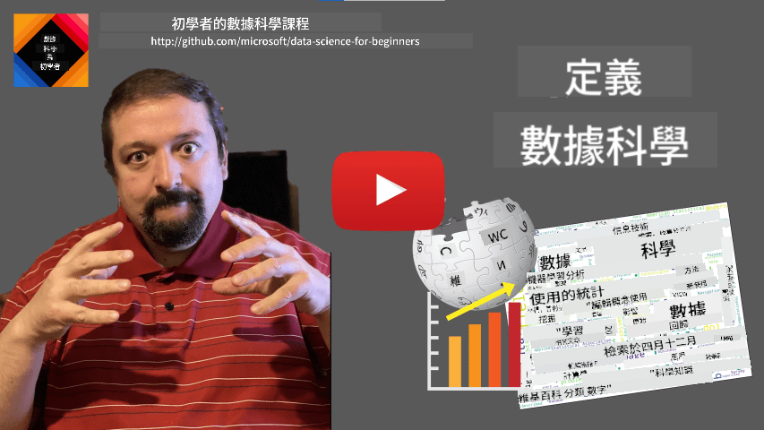
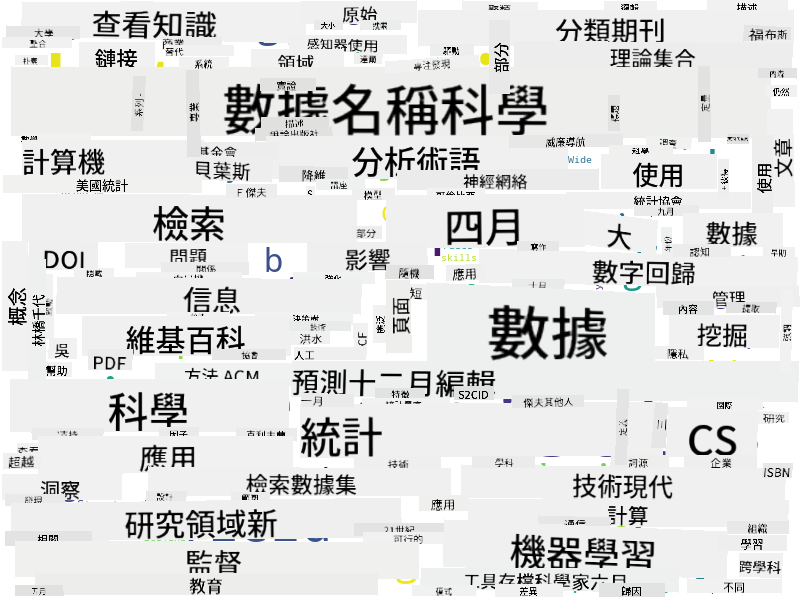

<!--
CO_OP_TRANSLATOR_METADATA:
{
  "original_hash": "2583a9894af7123b2fcae3376b14c035",
  "translation_date": "2025-08-27T09:01:04+00:00",
  "source_file": "1-Introduction/01-defining-data-science/README.md",
  "language_code": "mo"
}
-->
# 定義數據科學

|  繪製的手繪筆記 ](../../sketchnotes/01-Definitions.png) |
| :----------------------------------------------------------------------------------------------------: |
|              定義數據科學 - _由 [@nitya](https://twitter.com/nitya) 繪製的手繪筆記_                       |

---

## [課前測驗](https://purple-hill-04aebfb03.1.azurestaticapps.net/quiz/0)

## 什麼是數據？
在我們的日常生活中，我們無時無刻不被數據包圍著。你現在正在閱讀的文字就是數據。你手機裡朋友的電話號碼列表是數據，你手錶上顯示的當前時間也是數據。作為人類，我們天生就會處理數據，比如數錢或者給朋友寫信。

然而，隨著電腦的誕生，數據變得更加重要。電腦的主要功能是進行計算，但它們需要數據來操作。因此，我們需要了解電腦如何存儲和處理數據。

隨著互聯網的出現，電腦作為數據處理設備的角色變得更加重要。仔細想想，我們現在使用電腦更多的是進行數據處理和通信，而不是純粹的計算。當我們給朋友寫電子郵件或在互聯網上搜索信息時，本質上就是在創建、存儲、傳輸和操作數據。
> 你能記得上一次真正用電腦進行計算是什麼時候嗎？

## 什麼是數據科學？

根據 [維基百科](https://en.wikipedia.org/wiki/Data_science)，**數據科學**被定義為*一個使用科學方法從結構化和非結構化數據中提取知識和洞察力，並將這些知識和可操作的洞察力應用於廣泛應用領域的科學領域*。

這一定義突出了數據科學的以下重要方面：

* 數據科學的主要目的是從數據中**提取知識**，換句話說，就是**理解**數據，發現隱藏的關係並建立**模型**。
* 數據科學使用**科學方法**，例如概率和統計。事實上，當*數據科學*這個術語首次出現時，有些人認為數據科學只是統計學的一個新潮名稱。然而，現在已經很明顯這個領域要廣泛得多。
* 獲得的知識應用於產生一些**可操作的洞察力**，即可以應用於實際商業情境的實用洞察。
* 我們應該能夠處理**結構化**和**非結構化**數據。我們稍後會在課程中討論不同類型的數據。
* **應用領域**是一個重要概念，數據科學家通常需要對問題領域（例如金融、醫學、營銷等）有一定程度的專業知識。

> 數據科學的另一個重要方面是研究如何使用計算機收集、存儲和操作數據。雖然統計學為我們提供了數學基礎，數據科學則將數學概念應用於實際從數據中獲取洞察。

根據 [Jim Gray](https://en.wikipedia.org/wiki/Jim_Gray_(computer_scientist)) 的觀點，數據科學可以被視為一種獨立的科學範式：
* **經驗科學**，主要依賴觀察和實驗結果
* **理論科學**，從現有的科學知識中產生新概念
* **計算科學**，基於計算實驗發現新原則
* **數據驅動科學**，基於發現數據中的關係和模式

## 相關領域

由於數據無處不在，數據科學本身也是一個廣泛的領域，涉及許多其他學科。

## 數據的類型

正如我們之前提到的，數據無處不在。我們只需要以正確的方式捕捉它！區分**結構化**和**非結構化**數據是很有用的。前者通常以某種結構化的形式表示，通常是表格或多個表格，而後者則是一堆文件的集合。有時我們還會提到**半結構化**數據，它們具有某種結構，但可能差異很大。

| 結構化數據                                                               | 半結構化數據                                                                                   | 非結構化數據                          |
| ------------------------------------------------------------------------ | --------------------------------------------------------------------------------------------- | ------------------------------------- |
| 包含人員及其電話號碼的列表                                               | 包含鏈接的維基百科頁面                                                                         | 《大英百科全書》的文本                |
| 過去 20 年內每分鐘建築物內所有房間的溫度                                 | 以 JSON 格式存儲的科學論文集合，包含作者、發表日期和摘要                                       | 包含公司文件的文件共享                |
| 記錄進入建築物的所有人的年齡和性別數據                                  | 網頁                                                                                           | 監控攝像頭的原始視頻流                |

## 數據的來源

數據的來源有很多，無法一一列舉！然而，我們可以提到一些典型的數據來源：

* **結構化數據**
  - **物聯網**（IoT），包括來自不同傳感器（如溫度或壓力傳感器）的數據，提供了許多有用的數據。例如，如果辦公樓配備了物聯網傳感器，我們可以自動控制供暖和照明以降低成本。
  - **調查問卷**，例如在購買後或訪問網站後要求用戶完成的問卷。
  - **行為分析**，例如幫助我們了解用戶在網站上的瀏覽深度，以及離開網站的典型原因。
* **非結構化數據**
  - **文本**可以是豐富的洞察來源，例如整體**情感分數**，或提取關鍵詞和語義含義。
  - **圖像**或**視頻**。監控攝像頭的視頻可以用來估算道路上的交通情況，並通知人們潛在的交通擁堵。
  - 網絡服務器的**日誌**可以用來了解我們網站上最常被訪問的頁面以及訪問時長。
* **半結構化數據**
  - **社交網絡**圖譜可以提供有關用戶個性和信息傳播潛在效果的數據。
  - 當我們擁有一堆派對照片時，我們可以通過構建人們互相拍照的圖譜來提取**群體動態**數據。

通過了解不同的數據來源，你可以思考數據科學技術可以應用於哪些場景，以更好地了解情況並改進業務流程。

## 數據的應用

在數據科學中，我們專注於數據旅程的以下步驟：

當然，根據實際數據的情況，有些步驟可能會缺失（例如，當我們已經擁有數據庫中的數據，或者不需要模型訓練時），或者某些步驟可能會重複多次（例如數據處理）。

## 數字化與數字化轉型

在過去十年中，許多企業開始意識到數據在商業決策中的重要性。要將數據科學原則應用於企業運營，首先需要收集一些數據，即將業務流程轉化為數字形式，這被稱為**數字化**。將數據科學技術應用於這些數據以指導決策，可能會帶來生產力的顯著提升（甚至是業務轉型），這被稱為**數字化轉型**。

讓我們考慮一個例子。假設我們有一門數據科學課程（比如這門課程），我們在線上向學生提供，並希望利用數據科學來改進它。我們該怎麼做？

我們可以從問「什麼可以數字化？」開始。最簡單的方法是測量每位學生完成每個模塊所需的時間，並通過在每個模塊結束時進行選擇題測試來測量獲得的知識。通過計算所有學生的平均完成時間，我們可以找出哪些模塊對學生來說最困難，並著手簡化它們。
你可能會認為這種方法並不理想，因為模組的長度可能各不相同。或許更公平的做法是將時間除以模組的長度（以字元數計算），然後比較這些值。
當我們開始分析多選測試的結果時，可以嘗試找出學生難以理解的概念，並利用這些資訊改進內容。為了達到這個目的，我們需要設計測試，使每個問題都能對應到某個特定概念或知識塊。

如果我們想進一步深入分析，可以將每個模組所花的時間與學生的年齡類別進行對比。我們可能會發現某些年齡類別的學生完成模組所需時間過長，或者在完成之前就中途退出。這些資訊可以幫助我們為模組提供年齡建議，並減少因錯誤期望而導致的不滿。

## 🚀 挑戰

在這個挑戰中，我們將嘗試透過分析文本來找出與資料科學領域相關的概念。我們會選取一篇關於資料科學的維基百科文章，下載並處理文本，然後建立一個像這樣的文字雲：

請訪問 [`notebook.ipynb`](../../../../../../../../../1-Introduction/01-defining-data-science/notebook.ipynb ':ignore') 閱讀程式碼。您也可以執行程式碼，並即時查看它如何進行所有的資料轉換。

> 如果您不知道如何在 Jupyter Notebook 中執行程式碼，可以參考 [這篇文章](https://soshnikov.com/education/how-to-execute-notebooks-from-github/)。

## [課後測驗](https://purple-hill-04aebfb03.1.azurestaticapps.net/quiz/1)

## 作業

* **任務 1**：修改上述程式碼，找出與 **大數據** 和 **機器學習** 領域相關的概念
* **任務 2**：[思考資料科學場景](assignment.md)

## 致謝

這節課由 [Dmitry Soshnikov](http://soshnikov.com) 用 ♥️ 編寫。

---

**免責聲明**：  
本文件使用 AI 翻譯服務 [Co-op Translator](https://github.com/Azure/co-op-translator) 進行翻譯。我們致力於提供準確的翻譯，但請注意，自動翻譯可能包含錯誤或不準確之處。應以原始語言的文件作為權威來源。對於關鍵資訊，建議尋求專業人工翻譯。我們對因使用此翻譯而引起的任何誤解或誤釋不承擔責任。