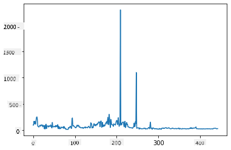
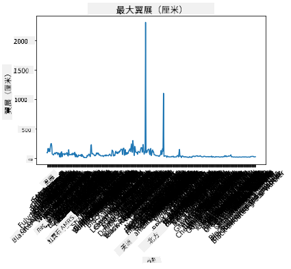
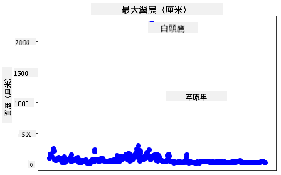
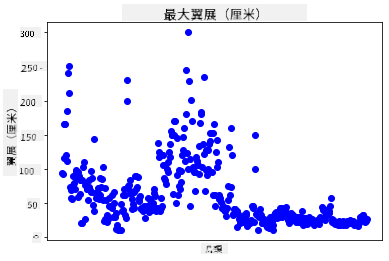
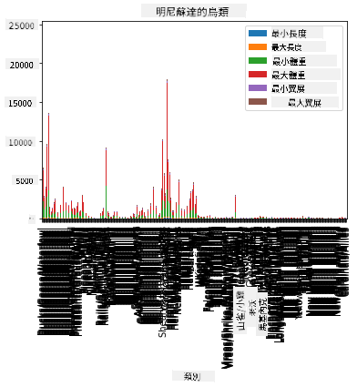
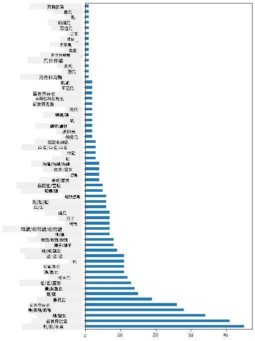
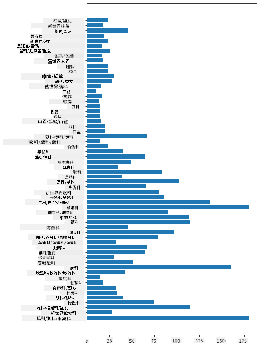
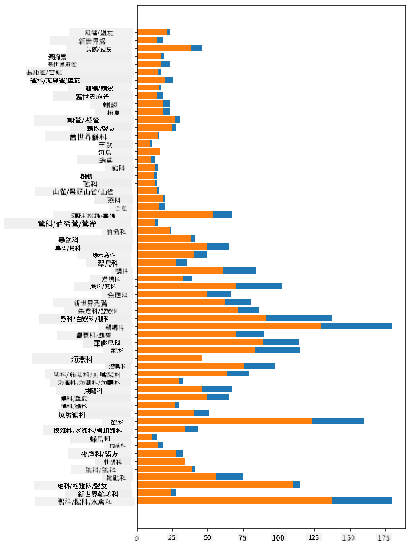

<!--
CO_OP_TRANSLATOR_METADATA:
{
  "original_hash": "43c402d9d90ae6da55d004519ada5033",
  "translation_date": "2025-08-27T10:44:32+00:00",
  "source_file": "3-Data-Visualization/09-visualization-quantities/README.md",
  "language_code": "mo"
}
-->
# 視覺化數量

| 繪製的手繪筆記](../../sketchnotes/09-Visualizing-Quantities.png)|
|:---:|
| 視覺化數量 - _由 [@nitya](https://twitter.com/nitya) 繪製的手繪筆記_ |

在這節課中，你將探索如何使用眾多可用的 Python 庫之一，學習如何圍繞數量的概念創建有趣的視覺化。使用一個關於明尼蘇達州鳥類的清理過的數據集，你可以了解許多關於當地野生動物的有趣事實。

## [課前測驗](https://purple-hill-04aebfb03.1.azurestaticapps.net/quiz/16)

## 使用 Matplotlib 觀察翼展

一個非常出色的庫是 [Matplotlib](https://matplotlib.org/stable/index.html)，它可以用來創建各種簡單或複雜的圖表和圖形。一般來說，使用這些庫繪製數據的過程包括：識別你想要處理的數據框部分，對數據進行必要的轉換，分配 x 和 y 軸的值，決定要顯示的圖表類型，然後顯示圖表。Matplotlib 提供了多種視覺化選擇，但在這節課中，我們將專注於最適合視覺化數量的圖表類型：折線圖、散點圖和柱狀圖。

> ✅ 根據數據結構和你想要講述的故事選擇最佳圖表。
> - 分析時間趨勢：折線圖
> - 比較數值：柱狀圖、條形圖、餅圖、散點圖
> - 展示部分與整體的關係：餅圖
> - 展示數據分佈：散點圖、柱狀圖
> - 展示趨勢：折線圖、條形圖
> - 展示數值之間的關係：折線圖、散點圖、氣泡圖

如果你有一個數據集並需要了解某個項目的數量，第一步通常是檢查其值。

✅ 這裡有一些非常好的 Matplotlib '速查表'：[點擊查看](https://matplotlib.org/cheatsheets/cheatsheets.pdf)。

## 建立鳥類翼展數值的折線圖

打開本課文件夾根目錄中的 `notebook.ipynb` 文件並添加一個單元格。

> 注意：數據存儲在本倉庫根目錄的 `/data` 文件夾中。

```python
import pandas as pd
import matplotlib.pyplot as plt
birds = pd.read_csv('../../data/birds.csv')
birds.head()
```
這些數據是文本和數字的混合：

|      | 名稱                         | 學名                   | 類別                  | 目            | 科       | 屬          | 保育狀態           | 最小長度 | 最大長度 | 最小體重   | 最大體重   | 最小翼展   | 最大翼展   |
| ---: | :--------------------------- | :--------------------- | :-------------------- | :----------- | :------- | :---------- | :----------------- | --------: | --------: | ----------: | ----------: | ----------: | ----------: |
|    0 | 黑腹樹鴨                     | Dendrocygna autumnalis | 鴨/鵝/水禽            | 雁形目       | 鴨科     | 樹鴨屬       | LC                 |        47 |        56 |         652 |        1020 |          76 |          94 |
|    1 | 棕樹鴨                       | Dendrocygna bicolor    | 鴨/鵝/水禽            | 雁形目       | 鴨科     | 樹鴨屬       | LC                 |        45 |        53 |         712 |        1050 |          85 |          93 |
|    2 | 雪鵝                         | Anser caerulescens     | 鴨/鵝/水禽            | 雁形目       | 鴨科     | 雁屬         | LC                 |        64 |        79 |        2050 |        4050 |         135 |         165 |
|    3 | 羅斯鵝                       | Anser rossii           | 鴨/鵝/水禽            | 雁形目       | 鴨科     | 雁屬         | LC                 |      57.3 |        64 |        1066 |        1567 |         113 |         116 |
|    4 | 大白額雁                     | Anser albifrons        | 鴨/鵝/水禽            | 雁形目       | 鴨科     | 雁屬         | LC                 |        64 |        81 |        1930 |        3310 |         130 |         165 |

讓我們開始使用基本折線圖繪製一些數字數據。假設你想查看這些有趣鳥類的最大翼展。

```python
wingspan = birds['MaxWingspan'] 
wingspan.plot()
```


你立即注意到什麼？似乎至少有一個異常值——這是一個相當大的翼展！2300 公分的翼展等於 23 米——明尼蘇達州有翼龍在飛翔嗎？讓我們調查一下。

雖然你可以在 Excel 中快速排序找到這些異常值（可能是錯誤），但繼續從圖表中進行視覺化分析。

在 x 軸上添加標籤以顯示涉及的鳥類類型：

```
plt.title('Max Wingspan in Centimeters')
plt.ylabel('Wingspan (CM)')
plt.xlabel('Birds')
plt.xticks(rotation=45)
x = birds['Name'] 
y = birds['MaxWingspan']

plt.plot(x, y)

plt.show()
```


即使將標籤旋轉設置為 45 度，仍然太多以至於無法閱讀。讓我們嘗試另一種策略：僅標記那些異常值並在圖表內設置標籤。你可以使用散點圖來為標籤留出更多空間：

```python
plt.title('Max Wingspan in Centimeters')
plt.ylabel('Wingspan (CM)')
plt.tick_params(axis='both',which='both',labelbottom=False,bottom=False)

for i in range(len(birds)):
    x = birds['Name'][i]
    y = birds['MaxWingspan'][i]
    plt.plot(x, y, 'bo')
    if birds['MaxWingspan'][i] > 500:
        plt.text(x, y * (1 - 0.05), birds['Name'][i], fontsize=12)
    
plt.show()
```
這裡發生了什麼？你使用 `tick_params` 隱藏底部標籤，然後對你的鳥類數據集進行迴圈。通過使用 `bo` 繪製帶有小圓形藍點的圖表，你檢查了任何最大翼展超過 500 的鳥類，並在點旁邊顯示其標籤。你在 y 軸上稍微偏移標籤 (`y * (1 - 0.05)`) 並使用鳥類名稱作為標籤。

你發現了什麼？



## 篩選數據

禿鷹和草原隼，雖然可能是非常大的鳥類，但似乎被錯誤標記了，其最大翼展多加了一個 `0`。不太可能遇到翼展 25 米的禿鷹，但如果真的遇到，請告訴我們！讓我們創建一個新的數據框，去掉這兩個異常值：

```python
plt.title('Max Wingspan in Centimeters')
plt.ylabel('Wingspan (CM)')
plt.xlabel('Birds')
plt.tick_params(axis='both',which='both',labelbottom=False,bottom=False)
for i in range(len(birds)):
    x = birds['Name'][i]
    y = birds['MaxWingspan'][i]
    if birds['Name'][i] not in ['Bald eagle', 'Prairie falcon']:
        plt.plot(x, y, 'bo')
plt.show()
```

通過篩選掉異常值，你的數據現在更加一致且易於理解。



現在我們至少在翼展方面有一個更乾淨的數據集，讓我們進一步探索這些鳥類。

雖然折線圖和散點圖可以顯示數據值及其分佈的信息，但我們想要思考這個數據集中固有的數值。你可以創建視覺化來回答以下關於數量的問題：

> 有多少類別的鳥類？它們的數量是多少？
> 有多少鳥類是滅絕、瀕危、稀有或常見的？
> 根據林奈分類法，有多少屬和目？

## 探索柱狀圖

當你需要展示數據分組時，柱狀圖非常實用。讓我們探索這個數據集中存在的鳥類類別，看看哪一類最常見。

在 notebook 文件中，創建一個基本柱狀圖。

✅ 注意，你可以篩選掉上一節中識別的兩個異常鳥類，編輯它們翼展中的錯誤，或者保留它們，因為這些練習不依賴於翼展值。

如果你想創建柱狀圖，可以選擇你想要關注的數據。柱狀圖可以從原始數據創建：

```python
birds.plot(x='Category',
        kind='bar',
        stacked=True,
        title='Birds of Minnesota')

```


然而，這個柱狀圖因為數據未分組而難以閱讀。你需要選擇你想要繪製的數據，所以讓我們看看基於鳥類類別的長度。

篩選數據以僅包含鳥類的類別。

✅ 注意，你使用 Pandas 管理數據，然後讓 Matplotlib 繪製圖表。

由於類別很多，你可以垂直顯示此圖表並調整其高度以容納所有數據：

```python
category_count = birds.value_counts(birds['Category'].values, sort=True)
plt.rcParams['figure.figsize'] = [6, 12]
category_count.plot.barh()
```


這個柱狀圖很好地展示了每個類別中鳥類的數量。一眼就能看出，這個地區最多的鳥類是鴨/鵝/水禽類別。明尼蘇達州是“萬湖之地”，所以這並不令人驚訝！

✅ 試試這個數據集中的其他計數。有什麼讓你感到驚訝嗎？

## 比較數據

你可以通過創建新軸嘗試不同的分組數據比較。試試基於類別的鳥類最大長度比較：

```python
maxlength = birds['MaxLength']
plt.barh(y=birds['Category'], width=maxlength)
plt.rcParams['figure.figsize'] = [6, 12]
plt.show()
```


這裡沒有什麼令人驚訝的：相比鵜鶘或鵝，蜂鳥的最大長度最小。當數據符合邏輯時，這是件好事！

你可以通過疊加數據創建更有趣的柱狀圖視覺化。讓我們疊加最小和最大長度在給定鳥類類別上：

```python
minLength = birds['MinLength']
maxLength = birds['MaxLength']
category = birds['Category']

plt.barh(category, maxLength)
plt.barh(category, minLength)

plt.show()
```
在這個圖表中，你可以看到每個鳥類類別的最小長度和最大長度範圍。你可以安全地說，根據這些數據，鳥越大，其長度範圍越大。真是有趣！



## 🚀 挑戰

這個鳥類數據集提供了關於特定生態系統中不同類型鳥類的大量信息。上網搜索，看看你是否能找到其他與鳥類相關的數據集。練習圍繞這些鳥類構建圖表和圖形，發現你之前未曾意識到的事實。

## [課後測驗](https://purple-hill-04aebfb03.1.azurestaticapps.net/quiz/17)

## 回顧與自學

這第一節課提供了一些關於如何使用 Matplotlib 視覺化數量的信息。研究其他方法來處理數據集進行視覺化。[Plotly](https://github.com/plotly/plotly.py) 是我們不會在這些課程中涵蓋的一個工具，看看它能提供什麼。

## 作業

[折線圖、散點圖和柱狀圖](assignment.md)

---

**免責聲明**：  
本文件使用 AI 翻譯服務 [Co-op Translator](https://github.com/Azure/co-op-translator) 進行翻譯。我們致力於提供準確的翻譯，但請注意，自動翻譯可能包含錯誤或不準確之處。應以原始語言的文件作為權威來源。對於關鍵資訊，建議尋求專業人工翻譯。我們對於因使用此翻譯而產生的任何誤解或錯誤解讀概不負責。