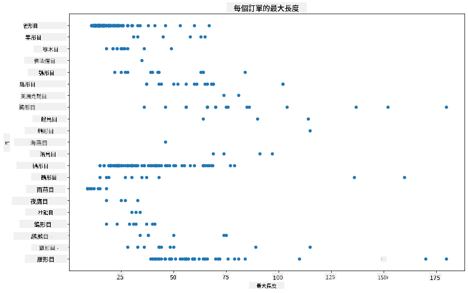
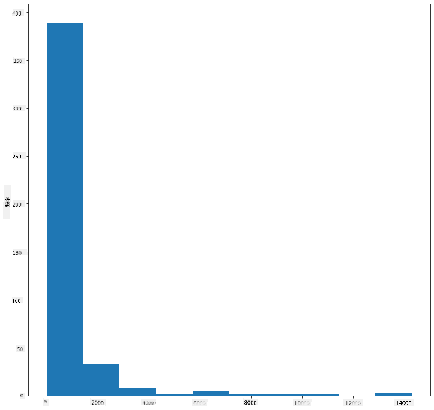
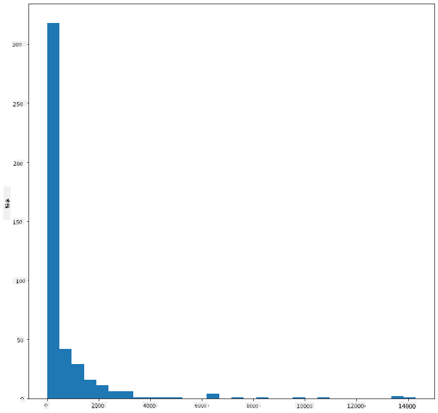
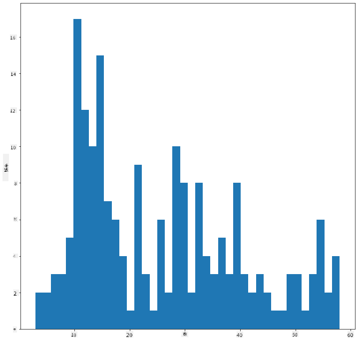
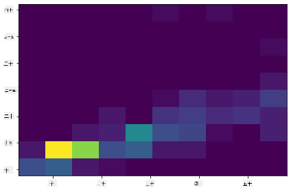
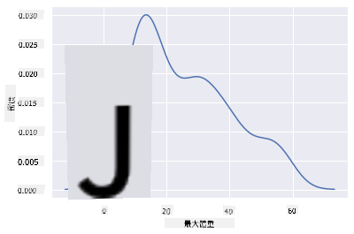
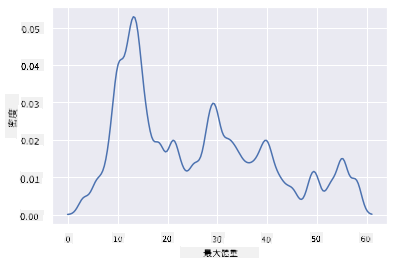
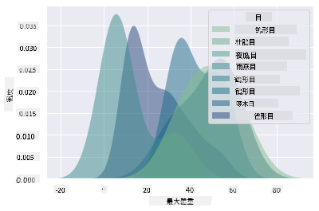
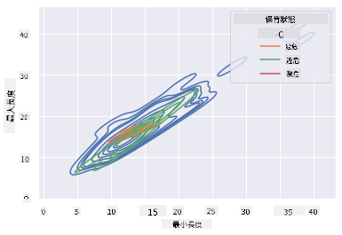

<!--
CO_OP_TRANSLATOR_METADATA:
{
  "original_hash": "87faccac113d772551486a67a607153e",
  "translation_date": "2025-08-27T10:14:23+00:00",
  "source_file": "3-Data-Visualization/10-visualization-distributions/README.md",
  "language_code": "mo"
}
-->
# 視覺化分佈

| 繪製的手繪筆記](../../sketchnotes/10-Visualizing-Distributions.png)|
|:---:|
| 視覺化分佈 - _手繪筆記由 [@nitya](https://twitter.com/nitya) 繪製_ |

在上一課中，你學到了關於明尼蘇達州鳥類數據集的一些有趣事實。通過視覺化異常值，你發現了一些錯誤的數據，並觀察了不同鳥類分類在最大長度上的差異。

## [課前測驗](https://purple-hill-04aebfb03.1.azurestaticapps.net/quiz/18)
## 探索鳥類數據集

另一種深入了解數據的方法是觀察其分佈，也就是數據如何沿著某個軸排列。例如，你可能想了解這個數據集中鳥類的最大翼展或最大體重的整體分佈情況。

讓我們來發現一些關於這個數據集中分佈的事實。在本課文件夾根目錄中的 _notebook.ipynb_ 文件中，導入 Pandas、Matplotlib 和你的數據：

```python
import pandas as pd
import matplotlib.pyplot as plt
birds = pd.read_csv('../../data/birds.csv')
birds.head()
```

|      | 名稱                         | 學名                   | 分類                  | 目          | 科       | 屬          | 保育狀態           | 最小長度 | 最大長度 | 最小體重   | 最大體重   | 最小翼展   | 最大翼展   |
| ---: | :--------------------------- | :--------------------- | :-------------------- | :----------- | :------- | :---------- | :----------------- | --------: | --------: | ----------: | ----------: | ----------: | ----------: |
|    0 | 黑腹樹鴨                     | Dendrocygna autumnalis | 鴨/鵝/水禽            | 雁形目       | 鴨科     | 樹鴨屬      | LC                 |        47 |        56 |         652 |        1020 |          76 |          94 |
|    1 | 棕樹鴨                       | Dendrocygna bicolor    | 鴨/鵝/水禽            | 雁形目       | 鴨科     | 樹鴨屬      | LC                 |        45 |        53 |         712 |        1050 |          85 |          93 |
|    2 | 雪雁                         | Anser caerulescens     | 鴨/鵝/水禽            | 雁形目       | 鴨科     | 雁屬        | LC                 |        64 |        79 |        2050 |        4050 |         135 |         165 |
|    3 | 羅氏雁                       | Anser rossii           | 鴨/鵝/水禽            | 雁形目       | 鴨科     | 雁屬        | LC                 |      57.3 |        64 |        1066 |        1567 |         113 |         116 |
|    4 | 大白額雁                     | Anser albifrons        | 鴨/鵝/水禽            | 雁形目       | 鴨科     | 雁屬        | LC                 |        64 |        81 |        1930 |        3310 |         130 |         165 |

通常，你可以通過使用散點圖快速查看數據的分佈方式，就像我們在上一課中所做的那樣：

```python
birds.plot(kind='scatter',x='MaxLength',y='Order',figsize=(12,8))

plt.title('Max Length per Order')
plt.ylabel('Order')
plt.xlabel('Max Length')

plt.show()
```


這提供了每個鳥類目體長分佈的概覽，但這並不是顯示真實分佈的最佳方式。這個任務通常通過創建直方圖來完成。

## 使用直方圖

Matplotlib 提供了非常好的方法來使用直方圖視覺化數據分佈。這種類型的圖表類似於條形圖，通過條形的升降可以看到分佈情況。要構建直方圖，你需要數值數據。構建直方圖時，可以將圖表的類型定義為 'hist'。以下圖表顯示了整個數據集中最大體重的分佈。通過將數據數組分成更小的區間（bins），它可以顯示數據值的分佈：

```python
birds['MaxBodyMass'].plot(kind = 'hist', bins = 10, figsize = (12,12))
plt.show()
```


如你所見，這個數據集中大多數的 400 多種鳥類的最大體重都在 2000 以下。通過將 `bins` 參數設置為更高的數字（例如 30），可以獲得更多的數據洞察：

```python
birds['MaxBodyMass'].plot(kind = 'hist', bins = 30, figsize = (12,12))
plt.show()
```


這張圖表顯示了更細緻的分佈。通過僅選擇給定範圍內的數據，可以創建一個不那麼偏向左側的圖表：

篩選數據以僅獲取體重低於 60 的鳥類，並顯示 40 個 `bins`：

```python
filteredBirds = birds[(birds['MaxBodyMass'] > 1) & (birds['MaxBodyMass'] < 60)]      
filteredBirds['MaxBodyMass'].plot(kind = 'hist',bins = 40,figsize = (12,12))
plt.show()     
```


✅ 試試其他篩選條件和數據點。若要查看數據的完整分佈，移除 `['MaxBodyMass']` 篩選條件以顯示帶標籤的分佈。

直方圖還提供了一些不錯的顏色和標籤增強功能可以嘗試：

創建一個 2D 直方圖來比較兩個分佈之間的關係。我們來比較 `MaxBodyMass` 和 `MaxLength`。Matplotlib 提供了一種內建方式，通過更亮的顏色顯示匯聚點：

```python
x = filteredBirds['MaxBodyMass']
y = filteredBirds['MaxLength']

fig, ax = plt.subplots(tight_layout=True)
hist = ax.hist2d(x, y)
```
可以看到，這兩個元素之間沿著預期軸線存在預期的相關性，並且有一個特別強的匯聚點：



直方圖對於數值數據默認效果很好。如果你需要根據文本數據查看分佈該怎麼辦？

## 使用文本數據探索數據集的分佈

這個數據集還包括關於鳥類分類、屬、種、科以及保育狀態的良好信息。讓我們深入了解這些保育信息。鳥類根據其保育狀態的分佈是什麼樣的？

> ✅ 在數據集中，使用了一些縮寫來描述保育狀態。這些縮寫來自 [IUCN 紅色名錄分類](https://www.iucnredlist.org/)，該組織記錄了物種的狀態。
> 
> - CR: 極危
> - EN: 瀕危
> - EX: 滅絕
> - LC: 無危
> - NT: 近危
> - VU: 易危

這些是基於文本的值，因此你需要進行轉換以創建直方圖。使用篩選後的 Birds 數據框，顯示其保育狀態與最小翼展。你看到了什麼？

```python
x1 = filteredBirds.loc[filteredBirds.ConservationStatus=='EX', 'MinWingspan']
x2 = filteredBirds.loc[filteredBirds.ConservationStatus=='CR', 'MinWingspan']
x3 = filteredBirds.loc[filteredBirds.ConservationStatus=='EN', 'MinWingspan']
x4 = filteredBirds.loc[filteredBirds.ConservationStatus=='NT', 'MinWingspan']
x5 = filteredBirds.loc[filteredBirds.ConservationStatus=='VU', 'MinWingspan']
x6 = filteredBirds.loc[filteredBirds.ConservationStatus=='LC', 'MinWingspan']

kwargs = dict(alpha=0.5, bins=20)

plt.hist(x1, **kwargs, color='red', label='Extinct')
plt.hist(x2, **kwargs, color='orange', label='Critically Endangered')
plt.hist(x3, **kwargs, color='yellow', label='Endangered')
plt.hist(x4, **kwargs, color='green', label='Near Threatened')
plt.hist(x5, **kwargs, color='blue', label='Vulnerable')
plt.hist(x6, **kwargs, color='gray', label='Least Concern')

plt.gca().set(title='Conservation Status', ylabel='Min Wingspan')
plt.legend();
```


最小翼展與保育狀態之間似乎沒有明顯的相關性。使用這種方法測試數據集的其他元素。你也可以嘗試不同的篩選條件。你發現了任何相關性嗎？

## 密度圖

你可能已經注意到，我們目前看到的直方圖是“階梯式”的，並沒有平滑地呈現弧線。若要顯示更平滑的密度圖，你可以嘗試使用密度圖。

為了使用密度圖，請熟悉一個新的繪圖庫 [Seaborn](https://seaborn.pydata.org/generated/seaborn.kdeplot.html)。

加載 Seaborn，嘗試一個基本的密度圖：

```python
import seaborn as sns
import matplotlib.pyplot as plt
sns.kdeplot(filteredBirds['MinWingspan'])
plt.show()
```


你可以看到，這個圖表與之前的最小翼展數據圖表相呼應，只是更平滑了一些。根據 Seaborn 的文檔，“相較於直方圖，KDE 可以生成一個更簡潔且更易於解讀的圖表，特別是在繪製多個分佈時。但如果底層分佈有界或不平滑，它可能會引入失真。與直方圖一樣，圖表的質量也取決於良好平滑參數的選擇。” [來源](https://seaborn.pydata.org/generated/seaborn.kdeplot.html)。換句話說，異常值仍然會影響圖表的表現。

如果你想重新檢視第二張圖中那條鋸齒狀的 MaxBodyMass 線，可以通過這種方法將其平滑化：

```python
sns.kdeplot(filteredBirds['MaxBodyMass'])
plt.show()
```


如果你想要一條平滑但不過於平滑的線，可以調整 `bw_adjust` 參數：

```python
sns.kdeplot(filteredBirds['MaxBodyMass'], bw_adjust=.2)
plt.show()
```


✅ 閱讀此類圖表可用的參數並進行實驗！

這種類型的圖表提供了非常直觀的視覺化效果。例如，只需幾行代碼，你就可以顯示每個鳥類目最大體重的密度：

```python
sns.kdeplot(
   data=filteredBirds, x="MaxBodyMass", hue="Order",
   fill=True, common_norm=False, palette="crest",
   alpha=.5, linewidth=0,
)
```



你還可以在一張圖表中映射多個變量的密度。測試鳥類的 MaxLength 和 MinLength 與其保育狀態的關係：

```python
sns.kdeplot(data=filteredBirds, x="MinLength", y="MaxLength", hue="ConservationStatus")
```



或許值得研究一下，根據鳥類長度的“易危”群體是否具有某種意義。

## 🚀 挑戰

直方圖是一種比基本散點圖、條形圖或折線圖更為複雜的圖表類型。上網搜索一些直方圖的優秀應用範例。它們是如何使用的？展示了什麼？通常在哪些領域或研究方向中使用？

## [課後測驗](https://purple-hill-04aebfb03.1.azurestaticapps.net/quiz/19)

## 回顧與自學

在本課中，你使用了 Matplotlib，並開始使用 Seaborn 來繪製更為複雜的圖表。研究 Seaborn 中的 `kdeplot`，這是一種“在一個或多個維度上顯示連續概率密度曲線”的方法。閱讀 [文檔](https://seaborn.pydata.org/generated/seaborn.kdeplot.html) 以了解其工作原理。

## 作業

[應用你的技能](assignment.md)

---

**免責聲明**：  
本文件已使用 AI 翻譯服務 [Co-op Translator](https://github.com/Azure/co-op-translator) 進行翻譯。我們致力於提供準確的翻譯，但請注意，自動翻譯可能包含錯誤或不準確之處。應以原始語言的文件作為權威來源。對於關鍵資訊，建議尋求專業人工翻譯。我們對因使用此翻譯而引起的任何誤解或錯誤解釋概不負責。