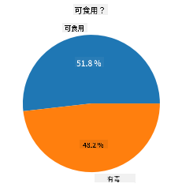
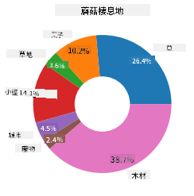
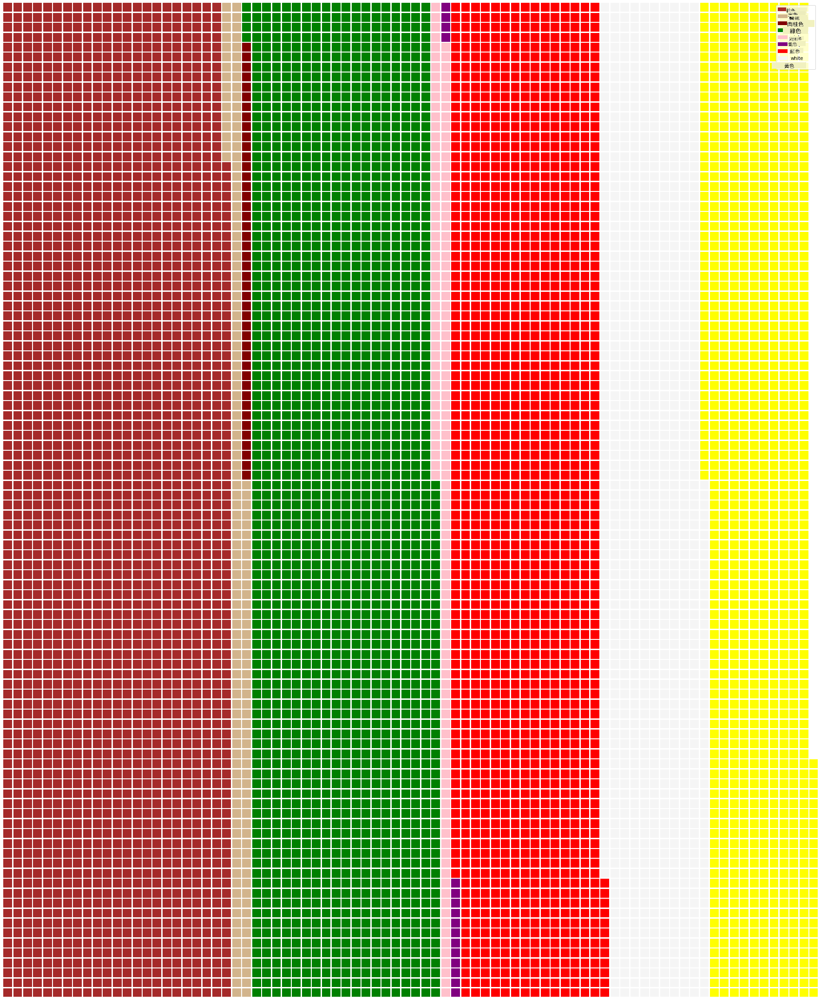

<!--
CO_OP_TRANSLATOR_METADATA:
{
  "original_hash": "cc490897ee2d276870472bcb31602d03",
  "translation_date": "2025-09-04T16:16:09+00:00",
  "source_file": "3-Data-Visualization/11-visualization-proportions/README.md",
  "language_code": "mo"
}
-->
# 視覺化比例

| 繪製的手繪筆記](../../sketchnotes/11-Visualizing-Proportions.png)|
|:---:|
|視覺化比例 - _手繪筆記由 [@nitya](https://twitter.com/nitya) 提供_ |

在這節課中，你將使用一個以自然為主題的數據集來視覺化比例，例如在一個關於蘑菇的數據集中，不同種類的真菌數量分佈。我們將使用來自 Audubon 的數據集，該數據集列出了 Agaricus 和 Lepiota 家族中 23 種有鰓蘑菇的詳細信息，來探索這些迷人的真菌。你將嘗試一些有趣的視覺化方式，例如：

- 圓餅圖 🥧  
- 甜甜圈圖 🍩  
- 華夫圖 🧇  

> 💡 微軟研究院的一個非常有趣的項目 [Charticulator](https://charticulator.com) 提供了一個免費的拖放式數據視覺化界面。在他們的一個教程中，他們也使用了這個蘑菇數據集！因此，你可以一邊探索數據，一邊學習這個工具庫：[Charticulator 教程](https://charticulator.com/tutorials/tutorial4.html)。

## [課後測驗](https://ff-quizzes.netlify.app/en/ds/)

## 認識你的蘑菇 🍄

蘑菇非常有趣。我們來導入一個數據集來研究它們：

```python
import pandas as pd
import matplotlib.pyplot as plt
mushrooms = pd.read_csv('../../data/mushrooms.csv')
mushrooms.head()
```  
一個表格被打印出來，裡面有一些適合分析的數據：

| 類別       | 菌蓋形狀 | 菌蓋表面 | 菌蓋顏色 | 是否有瘀傷 | 氣味    | 鰓附著方式   | 鰓間距     | 鰓大小   | 鰓顏色   | 菌柄形狀   | 菌柄根部   | 菌柄環上表面         | 菌柄環下表面         | 菌柄環上顏色         | 菌柄環下顏色         | 菌幕類型   | 菌幕顏色   | 環數       | 環類型   | 孢子印顏色       | 群體數量   | 棲息地   |
| --------- | --------- | --------- | --------- | --------- | ------- | ------------- | ----------- | --------- | --------- | ----------- | ----------- | -------------------- | -------------------- | -------------------- | -------------------- | --------- | --------- | --------- | --------- | ----------------- | --------- | --------- |
| 有毒      | 凸形      | 光滑      | 棕色      | 有瘀傷    | 刺鼻    | 自由          | 緊密        | 狹窄      | 黑色      | 擴大        | 等粗        | 光滑                 | 光滑                 | 白色                 | 白色                 | 部分      | 白色      | 一個      | 垂懸      | 黑色             | 分散      | 城市      |
| 可食用    | 凸形      | 光滑      | 黃色      | 有瘀傷    | 杏仁    | 自由          | 緊密        | 寬廣      | 黑色      | 擴大        | 棒狀        | 光滑                 | 光滑                 | 白色                 | 白色                 | 部分      | 白色      | 一個      | 垂懸      | 棕色             | 大量      | 草地      |
| 可食用    | 鐘形      | 光滑      | 白色      | 有瘀傷    | 茴香    | 自由          | 緊密        | 寬廣      | 棕色      | 擴大        | 棒狀        | 光滑                 | 光滑                 | 白色                 | 白色                 | 部分      | 白色      | 一個      | 垂懸      | 棕色             | 大量      | 草原      |
| 有毒      | 凸形      | 鱗狀      | 白色      | 有瘀傷    | 刺鼻    | 自由          | 緊密        | 狹窄      | 棕色      | 擴大        | 等粗        | 光滑                 | 光滑                 | 白色                 | 白色                 | 部分      | 白色      | 一個      | 垂懸      | 黑色             | 分散      | 城市      |

你會立刻注意到，所有數據都是文本格式。你需要將這些數據轉換成可以用於圖表的格式。事實上，大部分數據是以對象形式表示的：

```python
print(mushrooms.select_dtypes(["object"]).columns)
```  

輸出結果為：

```output
Index(['class', 'cap-shape', 'cap-surface', 'cap-color', 'bruises', 'odor',
       'gill-attachment', 'gill-spacing', 'gill-size', 'gill-color',
       'stalk-shape', 'stalk-root', 'stalk-surface-above-ring',
       'stalk-surface-below-ring', 'stalk-color-above-ring',
       'stalk-color-below-ring', 'veil-type', 'veil-color', 'ring-number',
       'ring-type', 'spore-print-color', 'population', 'habitat'],
      dtype='object')
```  
將這些數據中的 'class' 列轉換為類別：

```python
cols = mushrooms.select_dtypes(["object"]).columns
mushrooms[cols] = mushrooms[cols].astype('category')
```  

```python
edibleclass=mushrooms.groupby(['class']).count()
edibleclass
```  

現在，如果你打印出蘑菇數據，你會看到它已經根據有毒/可食用類別分組：

|           | 菌蓋形狀 | 菌蓋表面 | 菌蓋顏色 | 是否有瘀傷 | 氣味 | 鰓附著方式 | 鰓間距 | 鰓大小 | 鰓顏色 | 菌柄形狀 | ... | 菌柄環下表面 | 菌柄環上顏色 | 菌柄環下顏色 | 菌幕類型 | 菌幕顏色 | 環數 | 環類型 | 孢子印顏色 | 群體數量 | 棲息地 |
| --------- | --------- | --------- | --------- | --------- | ---- | ----------- | ------- | ------- | ------- | --------- | --- | ----------- | ----------- | ----------- | ------- | ------- | ----- | ------- | ----------- | ------- | ------- |
| 類別      |           |           |           |           |      |             |         |         |         |           |     |             |             |             |         |         |       |         |             |         |         |
| 可食用    | 4208      | 4208      | 4208      | 4208      | 4208 | 4208        | 4208    | 4208    | 4208    | 4208      | ... | 4208        | 4208        | 4208        | 4208    | 4208    | 4208  | 4208    | 4208        | 4208    | 4208    |
| 有毒      | 3916      | 3916      | 3916      | 3916      | 3916 | 3916        | 3916    | 3916    | 3916    | 3916      | ... | 3916        | 3916        | 3916        | 3916    | 3916    | 3916  | 3916    | 3916        | 3916    | 3916    |

如果你按照這個表格中的順序來創建類別標籤，你就可以製作一個圓餅圖：

## 圓餅圖！

```python
labels=['Edible','Poisonous']
plt.pie(edibleclass['population'],labels=labels,autopct='%.1f %%')
plt.title('Edible?')
plt.show()
```  
瞧，一個圓餅圖展示了這些數據中兩類蘑菇的比例。正確排列標籤的順序非常重要，尤其是在這裡，所以一定要確認標籤數組的順序！



## 甜甜圈圖！

一個更具視覺吸引力的圓餅圖是甜甜圈圖，它是在圓餅圖中間挖了一個洞。我們用這種方法來看看蘑菇的棲息地數據。

查看蘑菇生長的各種棲息地：

```python
habitat=mushrooms.groupby(['habitat']).count()
habitat
```  
在這裡，你將數據按棲息地分組。共有 7 種棲息地，因此使用這些作為甜甜圈圖的標籤：

```python
labels=['Grasses','Leaves','Meadows','Paths','Urban','Waste','Wood']

plt.pie(habitat['class'], labels=labels,
        autopct='%1.1f%%', pctdistance=0.85)
  
center_circle = plt.Circle((0, 0), 0.40, fc='white')
fig = plt.gcf()

fig.gca().add_artist(center_circle)
  
plt.title('Mushroom Habitats')
  
plt.show()
```  



這段代碼繪製了一個圖表和一個中心圓，然後將該中心圓添加到圖表中。通過更改 `0.40` 的值來調整中心圓的寬度。

甜甜圈圖可以通過多種方式進行調整以改變標籤。特別是標籤可以被突出顯示以提高可讀性。更多信息請參考[文檔](https://matplotlib.org/stable/gallery/pie_and_polar_charts/pie_and_donut_labels.html?highlight=donut)。

現在你已經知道如何分組數據並將其顯示為圓餅圖或甜甜圈圖，你可以嘗試其他類型的圖表。試試華夫圖，這是一種不同的方式來探索數量。

## 華夫圖！

華夫圖是一種以 2D 方格陣列的形式來視覺化數量的圖表。試著用這個數據集來視覺化不同顏色的蘑菇菌蓋數量。為此，你需要安裝一個名為 [PyWaffle](https://pypi.org/project/pywaffle/) 的輔助庫並使用 Matplotlib：

```python
pip install pywaffle
```  

選擇一部分數據進行分組：

```python
capcolor=mushrooms.groupby(['cap-color']).count()
capcolor
```  

通過創建標籤並分組數據來製作華夫圖：

```python
import pandas as pd
import matplotlib.pyplot as plt
from pywaffle import Waffle
  
data ={'color': ['brown', 'buff', 'cinnamon', 'green', 'pink', 'purple', 'red', 'white', 'yellow'],
    'amount': capcolor['class']
     }
  
df = pd.DataFrame(data)
  
fig = plt.figure(
    FigureClass = Waffle,
    rows = 100,
    values = df.amount,
    labels = list(df.color),
    figsize = (30,30),
    colors=["brown", "tan", "maroon", "green", "pink", "purple", "red", "whitesmoke", "yellow"],
)
```  

使用華夫圖，你可以清楚地看到這個蘑菇數據集中菌蓋顏色的比例。有趣的是，有許多綠色菌蓋的蘑菇！



✅ PyWaffle 支持在圖表中使用任何 [Font Awesome](https://fontawesome.com/) 提供的圖標。試著用圖標代替方格，創建一個更有趣的華夫圖。

在這節課中，你學到了三種視覺化比例的方法。首先，你需要將數據分組到類別中，然後決定哪種方式最適合展示數據——圓餅圖、甜甜圈圖或華夫圖。這些方法都很有趣，能讓用戶快速了解數據集的概況。

## 🚀 挑戰

試著在 [Charticulator](https://charticulator.com) 中重現這些有趣的圖表。

## [課後測驗](https://purple-hill-04aebfb03.1.azurestaticapps.net/quiz/21)

## 回顧與自學

有時候，什麼時候該用圓餅圖、甜甜圈圖或華夫圖並不明顯。以下是一些相關文章供你閱讀：

https://www.beautiful.ai/blog/battle-of-the-charts-pie-chart-vs-donut-chart  

https://medium.com/@hypsypops/pie-chart-vs-donut-chart-showdown-in-the-ring-5d24fd86a9ce  

https://www.mit.edu/~mbarker/formula1/f1help/11-ch-c6.htm  

https://medium.datadriveninvestor.com/data-visualization-done-the-right-way-with-tableau-waffle-chart-fdf2a19be402  

做一些研究，找到更多關於這個選擇的相關信息。

## 作業

[在 Excel 中試試看](assignment.md)  

---

**免責聲明**：  
本文件使用 AI 翻譯服務 [Co-op Translator](https://github.com/Azure/co-op-translator) 進行翻譯。我們致力於提供準確的翻譯，但請注意，自動翻譯可能包含錯誤或不準確之處。應以原始語言的文件作為權威來源。對於關鍵資訊，建議尋求專業人工翻譯。我們對因使用此翻譯而引起的任何誤解或錯誤解讀概不負責。