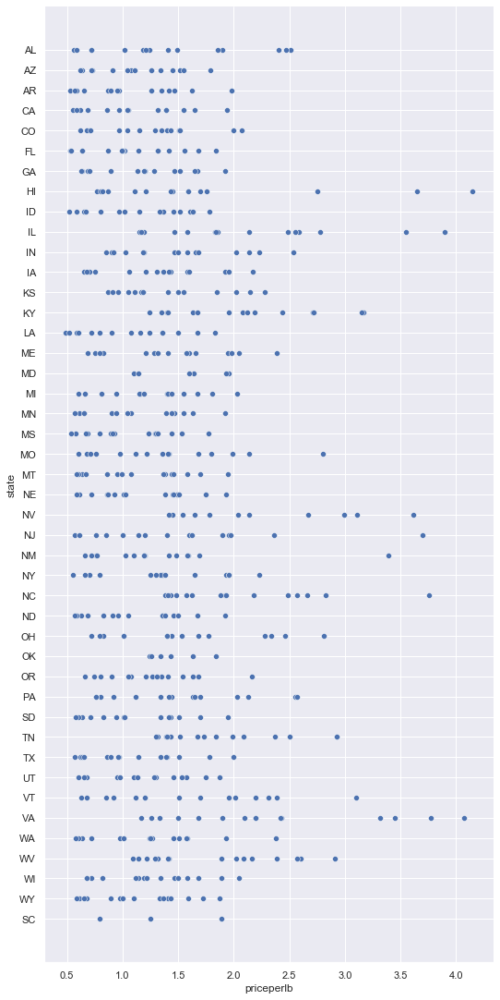
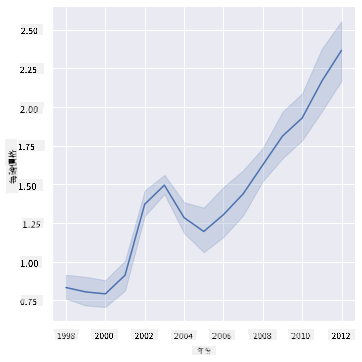
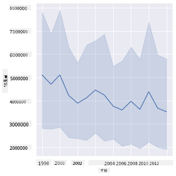
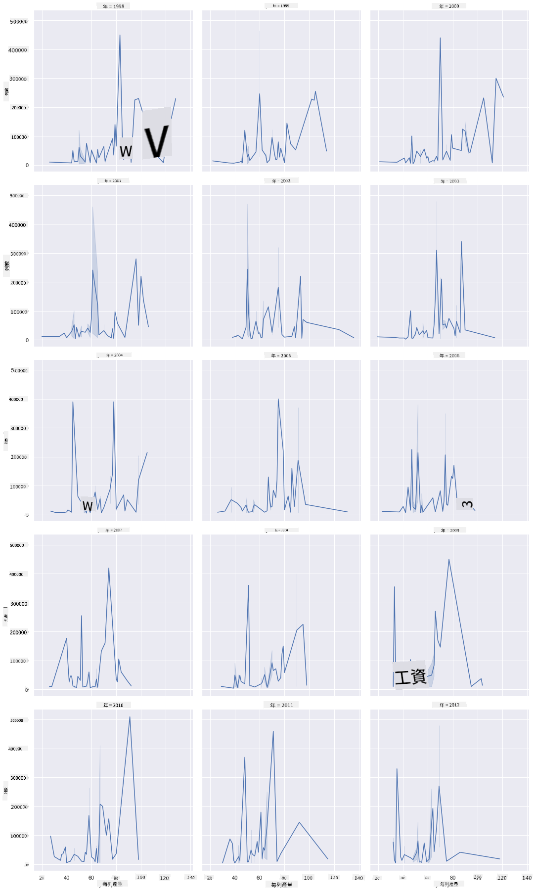
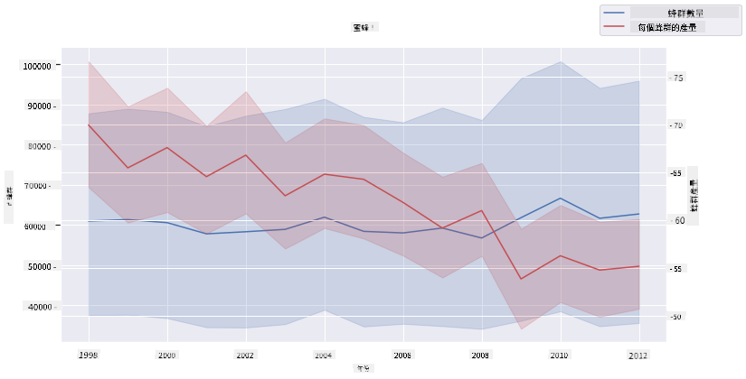

<!--
CO_OP_TRANSLATOR_METADATA:
{
  "original_hash": "b29e427401499e81f4af55a8c4afea76",
  "translation_date": "2025-09-04T16:18:21+00:00",
  "source_file": "3-Data-Visualization/12-visualization-relationships/README.md",
  "language_code": "mo"
}
-->
# 視覺化關係：蜂蜜的故事 🍯

| ](../../sketchnotes/12-Visualizing-Relationships.png)|
|:---:|
|視覺化關係 - _Sketchnote by [@nitya](https://twitter.com/nitya)_ |

延續我們研究的自然主題，讓我們探索一些有趣的視覺化方式，來展示不同種類蜂蜜之間的關係。這些數據來自[美國農業部](https://www.nass.usda.gov/About_NASS/index.php)的資料集。

這個包含約600項的數據集展示了美國多個州的蜂蜜生產情況。例如，您可以查看每個州在1998年至2012年間的蜂群數量、每群產量、總產量、庫存、每磅價格以及蜂蜜的生產價值，每年每州一行數據。

我們可以視覺化某州每年的生產量與該州蜂蜜價格之間的關係。或者，您也可以視覺化各州每群蜂蜜產量之間的關係。這段時間涵蓋了2006年首次出現的毀滅性「蜂群崩潰症候群 (CCD)」（http://npic.orst.edu/envir/ccd.html），因此這是一個值得研究的數據集。🐝

## [課前測驗](https://purple-hill-04aebfb03.1.azurestaticapps.net/quiz/22)

在本課中，您可以使用之前使用過的 Seaborn 庫，這是一個很好的工具來視覺化變數之間的關係。特別有趣的是 Seaborn 的 `relplot` 函數，它可以快速生成散點圖和折線圖，用於視覺化「[統計關係](https://seaborn.pydata.org/tutorial/relational.html?highlight=relationships)」，幫助數據科學家更好地理解變數之間的關聯。

## 散點圖

使用散點圖來展示蜂蜜價格如何隨年份在各州演變。Seaborn 的 `relplot` 可以方便地將州的數據分組，並顯示分類數據和數值數據的數據點。

首先，導入數據和 Seaborn：

```python
import pandas as pd
import matplotlib.pyplot as plt
import seaborn as sns
honey = pd.read_csv('../../data/honey.csv')
honey.head()
```
您會注意到蜂蜜數據中有幾個有趣的列，包括年份和每磅價格。讓我們按美國州分組來探索這些數據：

| 州   | 蜂群數量 | 每群產量 | 總產量     | 庫存     | 每磅價格   | 生產價值   | 年份 |
| ----- | ------ | ----------- | --------- | -------- | ---------- | --------- | ---- |
| AL    | 16000  | 71          | 1136000   | 159000   | 0.72       | 818000    | 1998 |
| AZ    | 55000  | 60          | 3300000   | 1485000  | 0.64       | 2112000   | 1998 |
| AR    | 53000  | 65          | 3445000   | 1688000  | 0.59       | 2033000   | 1998 |
| CA    | 450000 | 83          | 37350000  | 12326000 | 0.62       | 23157000  | 1998 |
| CO    | 27000  | 72          | 1944000   | 1594000  | 0.7        | 1361000   | 1998 |

創建一個基本的散點圖，展示蜂蜜每磅價格與其來源州之間的關係。讓 `y` 軸足夠高以顯示所有州：

```python
sns.relplot(x="priceperlb", y="state", data=honey, height=15, aspect=.5);
```


接下來，使用蜂蜜色系來展示價格如何隨年份演變。您可以通過添加 'hue' 參數來顯示年份的變化：

> ✅ 了解更多關於 [Seaborn 中可用的色彩調色板](https://seaborn.pydata.org/tutorial/color_palettes.html) - 試試美麗的彩虹色系！

```python
sns.relplot(x="priceperlb", y="state", hue="year", palette="YlOrBr", data=honey, height=15, aspect=.5);
```


使用這種色彩方案，您可以清楚地看到蜂蜜每磅價格在多年來的明顯增長趨勢。事實上，如果您查看數據中的樣本集（例如選擇亞利桑那州），您可以看到價格逐年上漲的模式，僅有少數例外：

| 州   | 蜂群數量 | 每群產量 | 總產量     | 庫存     | 每磅價格   | 生產價值   | 年份 |
| ----- | ------ | ----------- | --------- | ------- | ---------- | --------- | ---- |
| AZ    | 55000  | 60          | 3300000   | 1485000 | 0.64       | 2112000   | 1998 |
| AZ    | 52000  | 62          | 3224000   | 1548000 | 0.62       | 1999000   | 1999 |
| AZ    | 40000  | 59          | 2360000   | 1322000 | 0.73       | 1723000   | 2000 |
| AZ    | 43000  | 59          | 2537000   | 1142000 | 0.72       | 1827000   | 2001 |
| AZ    | 38000  | 63          | 2394000   | 1197000 | 1.08       | 2586000   | 2002 |
| AZ    | 35000  | 72          | 2520000   | 983000  | 1.34       | 3377000   | 2003 |
| AZ    | 32000  | 55          | 1760000   | 774000  | 1.11       | 1954000   | 2004 |
| AZ    | 36000  | 50          | 1800000   | 720000  | 1.04       | 1872000   | 2005 |
| AZ    | 30000  | 65          | 1950000   | 839000  | 0.91       | 1775000   | 2006 |
| AZ    | 30000  | 64          | 1920000   | 902000  | 1.26       | 2419000   | 2007 |
| AZ    | 25000  | 64          | 1600000   | 336000  | 1.26       | 2016000   | 2008 |
| AZ    | 20000  | 52          | 1040000   | 562000  | 1.45       | 1508000   | 2009 |
| AZ    | 24000  | 77          | 1848000   | 665000  | 1.52       | 2809000   | 2010 |
| AZ    | 23000  | 53          | 1219000   | 427000  | 1.55       | 1889000   | 2011 |
| AZ    | 22000  | 46          | 1012000   | 253000  | 1.79       | 1811000   | 2012 |

另一種視覺化這種趨勢的方法是使用大小而非顏色。對於色盲用戶，這可能是一個更好的選擇。修改您的視覺化，通過點的直徑大小來展示價格的增長：

```python
sns.relplot(x="priceperlb", y="state", size="year", data=honey, height=15, aspect=.5);
```
您可以看到點的大小逐漸增大。


這是否是一個簡單的供需問題？由於氣候變化和蜂群崩潰等因素，是否導致蜂蜜供應逐年減少，從而價格上漲？

為了探索這個數據集中一些變數之間的相關性，讓我們來看看一些折線圖。

## 折線圖

問題：蜂蜜每磅價格是否隨年份逐年上漲？您可以通過創建一個單一折線圖來最容易地發現這一點：

```python
sns.relplot(x="year", y="priceperlb", kind="line", data=honey);
```
答案：是的，但在2003年左右有一些例外：



✅ 由於 Seaborn 將數據聚合到一條線上，它通過繪製均值和均值周圍的95%置信區間來顯示「每個 x 值的多個測量值」。[來源](https://seaborn.pydata.org/tutorial/relational.html)。這種耗時的行為可以通過添加 `ci=None` 禁用。

問題：那麼在2003年，我們是否也能看到蜂蜜供應的激增？如果您查看每年的總產量呢？

```python
sns.relplot(x="year", y="totalprod", kind="line", data=honey);
```



答案：並不完全。如果您查看總產量，實際上在那一年似乎有所增加，儘管總體而言蜂蜜的生產量在這些年中呈下降趨勢。

問題：在這種情況下，2003年蜂蜜價格的激增可能是什麼原因？

為了探索這一點，您可以使用 Facet Grid。

## Facet Grids

Facet Grid 可以選擇數據集的一個面向（在我們的例子中，您可以選擇「年份」以避免生成過多的面向）。Seaborn 可以為您選擇的 x 和 y 坐標生成每個面向的圖表，方便比較。2003年是否在這種比較中顯得突出？

繼續使用 Seaborn 的 `relplot` 創建 Facet Grid，正如 [Seaborn 文檔](https://seaborn.pydata.org/generated/seaborn.FacetGrid.html?highlight=facetgrid#seaborn.FacetGrid) 所推薦的。

```python
sns.relplot(
    data=honey, 
    x="yieldpercol", y="numcol",
    col="year", 
    col_wrap=3,
    kind="line"
```
在這個視覺化中，您可以比較每年的每群產量和蜂群數量，並將列的包裹設置為3：



對於這個數據集，關於蜂群數量和每群產量，年份和州之間並沒有特別突出的地方。是否有其他方式來尋找這兩個變數之間的相關性？

## 雙折線圖

嘗試使用多折線圖，通過將兩個折線圖疊加在一起，使用 Seaborn 的 'despine' 移除圖表的頂部和右側框架，並使用 `ax.twinx` [源自 Matplotlib](https://matplotlib.org/stable/api/_as_gen/matplotlib.axes.Axes.twinx.html)。Twins 允許圖表共享 x 軸並顯示兩個 y 軸。因此，顯示每群產量和蜂群數量的疊加圖：

```python
fig, ax = plt.subplots(figsize=(12,6))
lineplot = sns.lineplot(x=honey['year'], y=honey['numcol'], data=honey, 
                        label = 'Number of bee colonies', legend=False)
sns.despine()
plt.ylabel('# colonies')
plt.title('Honey Production Year over Year');

ax2 = ax.twinx()
lineplot2 = sns.lineplot(x=honey['year'], y=honey['yieldpercol'], ax=ax2, color="r", 
                         label ='Yield per colony', legend=False) 
sns.despine(right=False)
plt.ylabel('colony yield')
ax.figure.legend();
```


雖然在2003年並沒有明顯的異常，但這讓我們以一個稍微樂觀的結論結束這節課：儘管蜂群數量總體上在下降，但蜂群數量正在穩定，即使每群產量在減少。

加油，蜜蜂們！

🐝❤️
## 🚀 挑戰

在本課中，您學到了更多關於散點圖和折線圖的其他用途，包括 Facet Grid。挑戰自己使用不同的數據集（可能是您之前使用過的數據集）來創建 Facet Grid。注意它們的生成時間以及如何小心選擇需要繪製的網格數量。

## [課後測驗](https://ff-quizzes.netlify.app/en/ds/)

## 回顧與自學

折線圖可以很簡單，也可以非常複雜。閱讀 [Seaborn 文檔](https://seaborn.pydata.org/generated/seaborn.lineplot.html) 中的相關內容，了解您可以如何構建折線圖。嘗試使用文檔中列出的其他方法來增強您在本課中構建的折線圖。
## 作業

[深入蜂巢](assignment.md)

---

**免責聲明**：  
本文件使用 AI 翻譯服務 [Co-op Translator](https://github.com/Azure/co-op-translator) 進行翻譯。我們致力於提供準確的翻譯，但請注意，自動翻譯可能包含錯誤或不準確之處。應以原始語言的文件作為權威來源。對於關鍵資訊，建議尋求專業人工翻譯。我們對因使用此翻譯而產生的任何誤解或錯誤解讀概不負責。