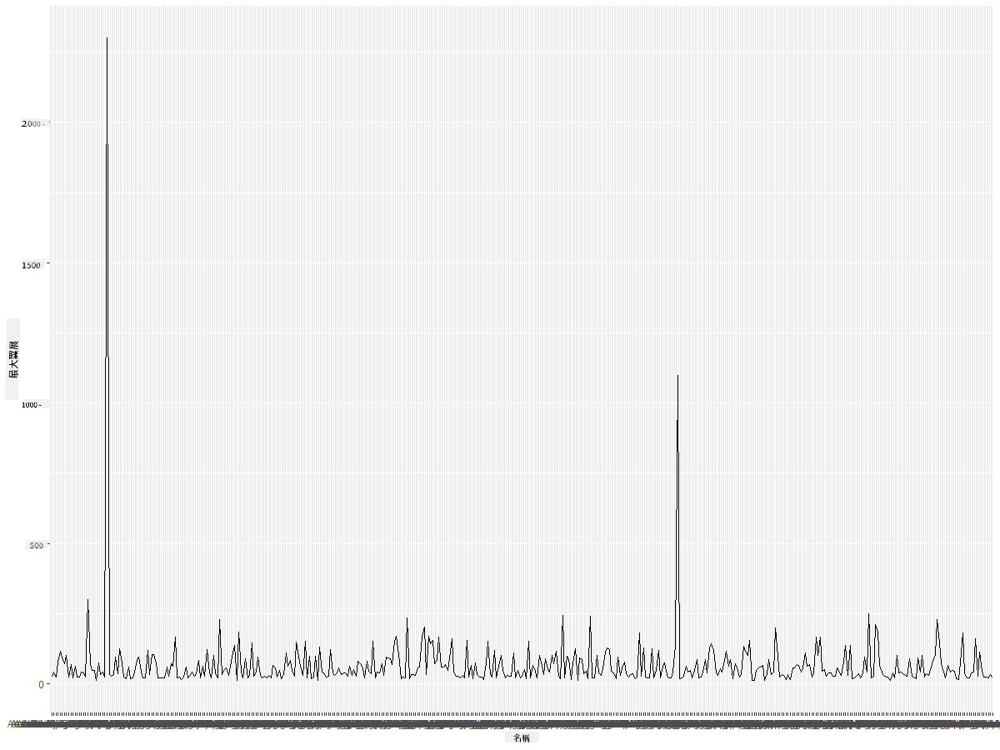
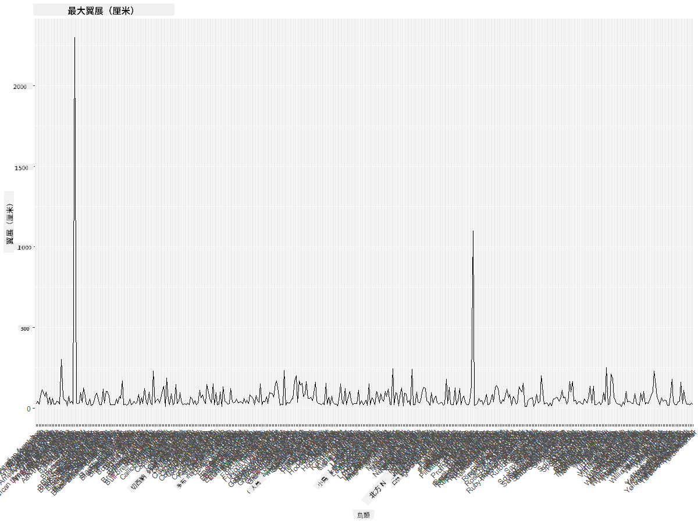
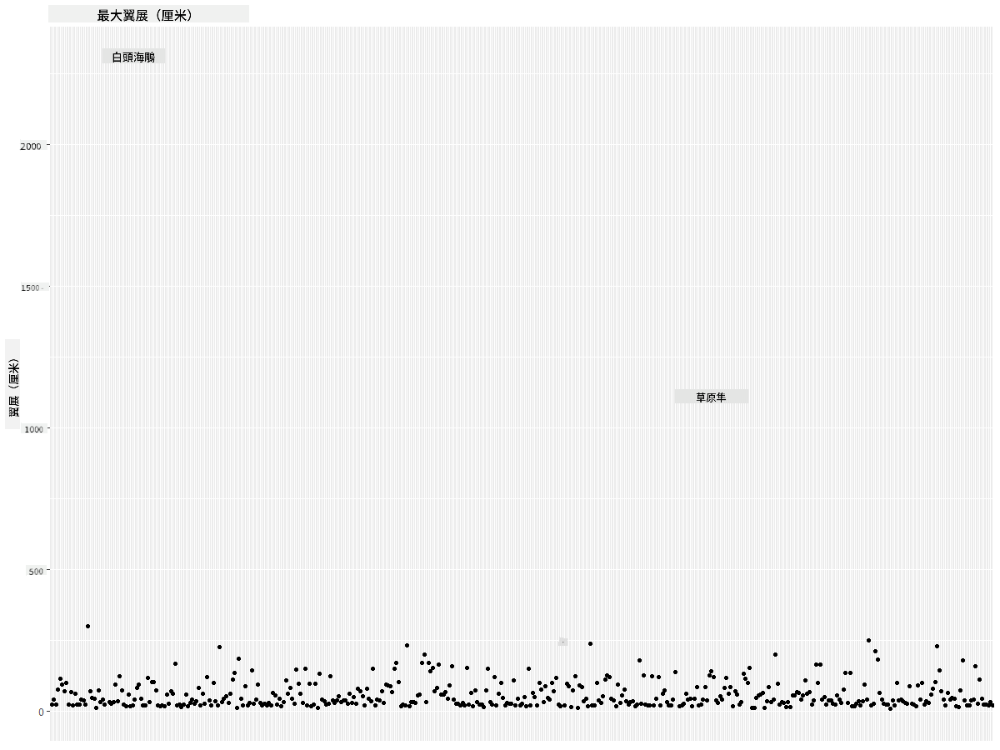
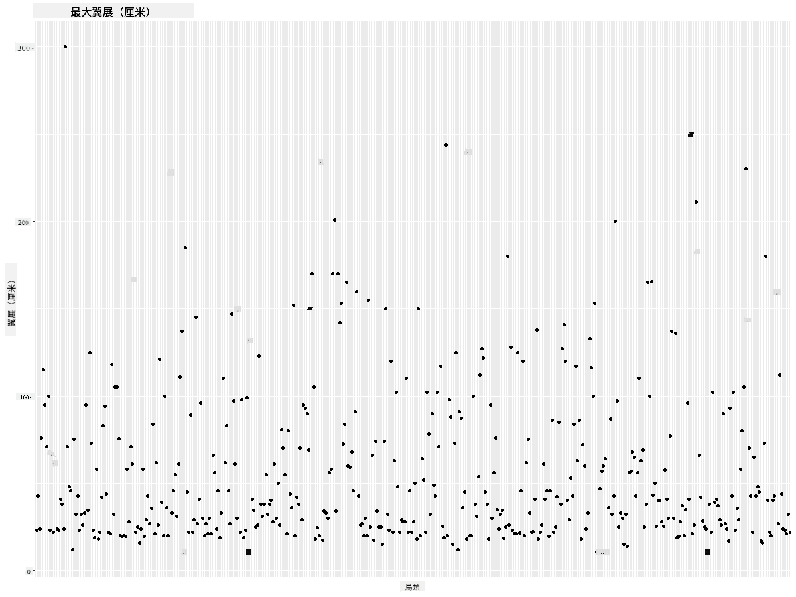
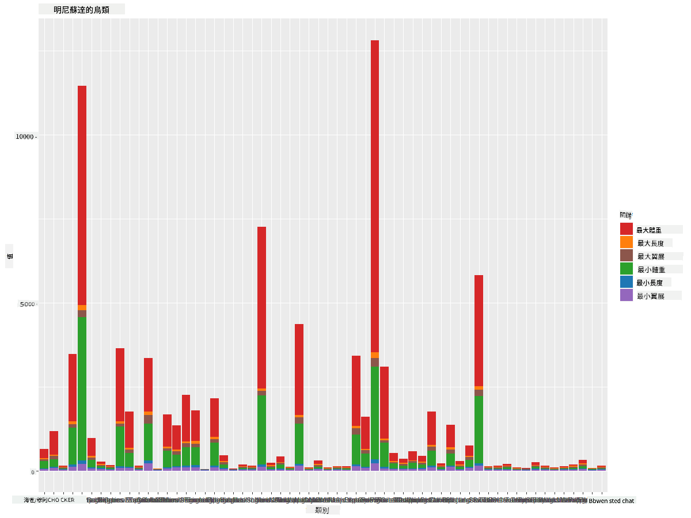
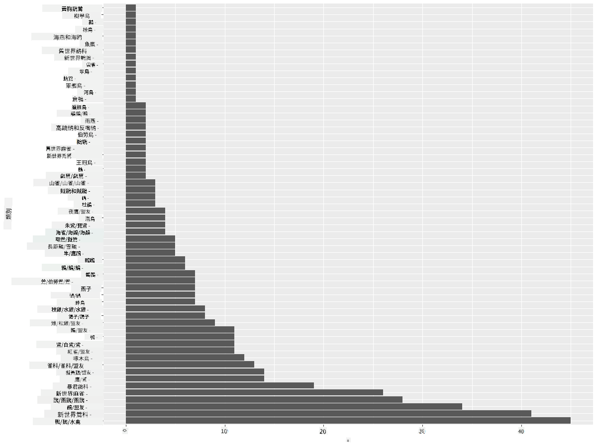
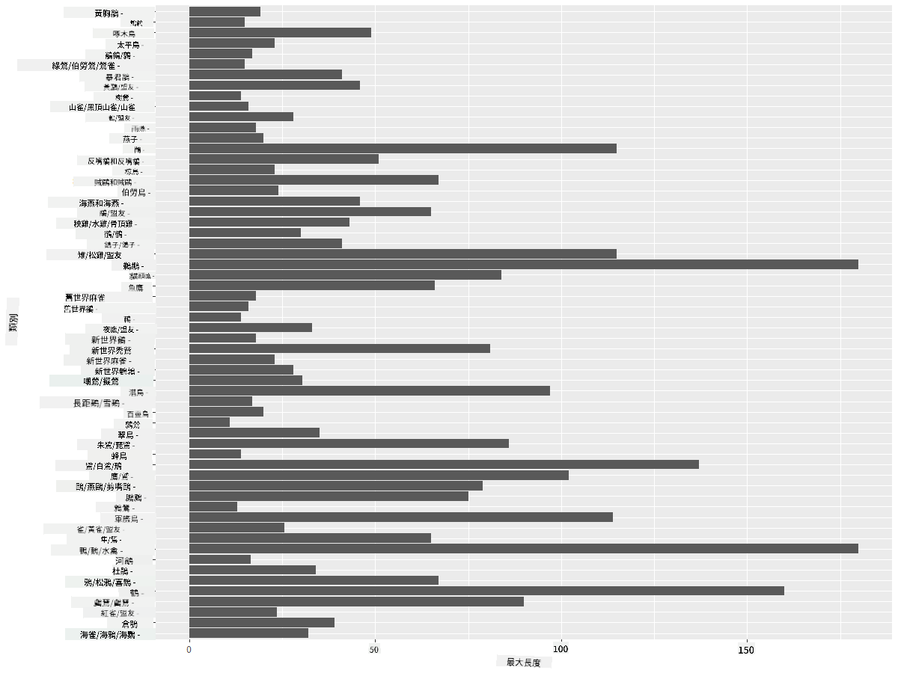

<!--
CO_OP_TRANSLATOR_METADATA:
{
  "original_hash": "22acf28f518a4769ea14fa42f4734b9f",
  "translation_date": "2025-08-27T10:32:04+00:00",
  "source_file": "3-Data-Visualization/R/09-visualization-quantities/README.md",
  "language_code": "mo"
}
-->
# 視覺化數量
| 繪製的手繪筆記](https://github.com/microsoft/Data-Science-For-Beginners/blob/main/sketchnotes/09-Visualizing-Quantities.png)|
|:---:|
| 視覺化數量 - _由 [@nitya](https://twitter.com/nitya) 繪製的手繪筆記_ |

在本課程中，您將探索如何使用一些 R 套件庫來學習如何圍繞數量概念創建有趣的視覺化。使用一個關於明尼蘇達州鳥類的清理過的數據集，您可以了解許多有趣的本地野生動物資訊。

## [課前測驗](https://purple-hill-04aebfb03.1.azurestaticapps.net/quiz/16)

## 使用 ggplot2 觀察翼展
一個非常出色的庫是 [ggplot2](https://cran.r-project.org/web/packages/ggplot2/index.html)，它可以用來創建各種簡單或複雜的圖表。一般來說，使用這些庫繪製數據的過程包括：識別您想要針對的數據框部分，對數據進行必要的轉換，分配其 x 和 y 軸值，決定要顯示的圖表類型，然後顯示圖表。

`ggplot2` 是一個基於圖形語法（Grammar of Graphics）聲明式創建圖形的系統。[圖形語法](https://en.wikipedia.org/wiki/Ggplot2) 是一種數據視覺化的通用方案，它將圖表分解為語義組件，例如比例和層次。換句話說，`ggplot2` 使得用少量代碼創建單變量或多變量數據的圖表和圖形變得非常容易，因此成為 R 中最受歡迎的視覺化套件。使用者告訴 `ggplot2` 如何將變數映射到美學屬性，使用哪些圖形元素，然後 `ggplot2` 負責其餘部分。

> ✅ 圖表 = 數據 + 美學 + 幾何
> - 數據指的是數據集
> - 美學表示要研究的變數（x 和 y 變數）
> - 幾何指的是圖表類型（折線圖、柱狀圖等）

根據您的數據和想要通過圖表講述的故事，選擇最佳的幾何（圖表類型）。

> - 分析趨勢：折線圖、柱狀圖
> - 比較數值：條形圖、柱狀圖、餅圖、散點圖
> - 顯示部分與整體的關係：餅圖
> - 顯示數據分佈：散點圖、柱狀圖
> - 顯示數值之間的關係：折線圖、散點圖、氣泡圖

✅ 您也可以查看這份描述性的 [ggplot2 速查表](https://nyu-cdsc.github.io/learningr/assets/data-visualization-2.1.pdf)。

## 建立鳥類翼展值的折線圖

打開 R 控制台並導入數據集。
> 注意：數據集存儲在此 repo 的 `/data` 文件夾中。

讓我們導入數據集並觀察數據的前五行。

```r
birds <- read.csv("../../data/birds.csv",fileEncoding="UTF-8-BOM")
head(birds)
```
數據的前五行包含文本和數字的混合：

|      | 名稱                         | 學名                   | 類別                  | 目          | 科       | 屬         | 保育狀態             | 最小長度 | 最大長度 | 最小體重   | 最大體重   | 最小翼展   | 最大翼展   |
| ---: | :--------------------------- | :--------------------- | :-------------------- | :----------- | :------- | :---------- | :----------------- | --------: | --------: | ----------: | ----------: | ----------: | ----------: |
|    0 | 黑腹樹鴨                     | Dendrocygna autumnalis | 鴨/鵝/水禽            | 雁形目       | 鴨科     | 樹鴨屬     | LC                 |        47 |        56 |         652 |        1020 |          76 |          94 |
|    1 | 棕樹鴨                       | Dendrocygna bicolor    | 鴨/鵝/水禽            | 雁形目       | 鴨科     | 樹鴨屬     | LC                 |        45 |        53 |         712 |        1050 |          85 |          93 |
|    2 | 雪鵝                         | Anser caerulescens     | 鴨/鵝/水禽            | 雁形目       | 鴨科     | 雁屬       | LC                 |        64 |        79 |        2050 |        4050 |         135 |         165 |
|    3 | 羅斯鵝                       | Anser rossii           | 鴨/鵝/水禽            | 雁形目       | 鴨科     | 雁屬       | LC                 |      57.3 |        64 |        1066 |        1567 |         113 |         116 |
|    4 | 大白額雁                     | Anser albifrons        | 鴨/鵝/水禽            | 雁形目       | 鴨科     | 雁屬       | LC                 |        64 |        81 |        1930 |        3310 |         130 |         165 |

讓我們從繪製一些數字數據的基本折線圖開始。假設您想查看這些有趣鳥類的最大翼展。

```r
install.packages("ggplot2")
library("ggplot2")
ggplot(data=birds, aes(x=Name, y=MaxWingspan,group=1)) +
  geom_line() 
```
在這裡，您安裝了 `ggplot2` 套件，然後使用 `library("ggplot2")` 命令將其導入工作區。要在 ggplot 中繪製任何圖表，使用 `ggplot()` 函數並指定數據集、x 和 y 變數作為屬性。在此情況下，我們使用 `geom_line()` 函數，因為我們的目標是繪製折線圖。



您立即注意到什麼？似乎至少有一個異常值——那是一個相當大的翼展！2000+ 公分的翼展超過了 20 公尺——明尼蘇達州有翼龍在飛嗎？讓我們調查一下。

雖然您可以在 Excel 中快速排序以找到這些可能是錯誤的異常值，但請繼續從圖表內部進行視覺化處理。

為 x 軸添加標籤以顯示涉及哪些鳥類：

```r
ggplot(data=birds, aes(x=Name, y=MaxWingspan,group=1)) +
  geom_line() +
  theme(axis.text.x = element_text(angle = 45, hjust=1))+
  xlab("Birds") +
  ylab("Wingspan (CM)") +
  ggtitle("Max Wingspan in Centimeters")
```
我們在 `theme` 中指定了角度，並在 `xlab()` 和 `ylab()` 中分別指定了 x 和 y 軸標籤。`ggtitle()` 為圖表/圖形命名。



即使將標籤的旋轉設置為 45 度，仍然有太多標籤難以閱讀。讓我們嘗試另一種策略：僅標記那些異常值並在圖表內設置標籤。您可以使用散點圖來為標籤留出更多空間：

```r
ggplot(data=birds, aes(x=Name, y=MaxWingspan,group=1)) +
  geom_point() +
  geom_text(aes(label=ifelse(MaxWingspan>500,as.character(Name),'')),hjust=0,vjust=0) + 
  theme(axis.title.x=element_blank(), axis.text.x=element_blank(), axis.ticks.x=element_blank())
  ylab("Wingspan (CM)") +
  ggtitle("Max Wingspan in Centimeters") + 
```
這裡發生了什麼？您使用了 `geom_point()` 函數來繪製散點。通過這個，您為 `MaxWingspan > 500` 的鳥類添加了標籤，並隱藏了 x 軸上的標籤以減少圖表的混亂。

您發現了什麼？



## 篩選數據

禿鷹和草原隼，雖然可能是非常大的鳥類，但似乎被錯誤標記了，其最大翼展多加了一個 0。遇到翼展 25 公尺的禿鷹的可能性不大，但如果真的遇到，請告訴我們！讓我們創建一個新的數據框，去掉這兩個異常值：

```r
birds_filtered <- subset(birds, MaxWingspan < 500)

ggplot(data=birds_filtered, aes(x=Name, y=MaxWingspan,group=1)) +
  geom_point() +
  ylab("Wingspan (CM)") +
  xlab("Birds") +
  ggtitle("Max Wingspan in Centimeters") + 
  geom_text(aes(label=ifelse(MaxWingspan>500,as.character(Name),'')),hjust=0,vjust=0) +
  theme(axis.text.x=element_blank(), axis.ticks.x=element_blank())
```
我們創建了一個新的數據框 `birds_filtered`，然後繪製了一個散點圖。通過篩選掉異常值，您的數據現在更加一致且易於理解。



現在我們至少在翼展方面有了一個更乾淨的數據集，讓我們進一步探索這些鳥類。

雖然折線圖和散點圖可以顯示數據值及其分佈的資訊，但我們想要思考這個數據集中固有的數值。您可以創建視覺化來回答以下關於數量的問題：

> 有多少類別的鳥類？它們的數量是多少？
> 有多少鳥類是滅絕、瀕危、稀有或常見的？
> 根據林奈分類法，有多少屬和目？

## 探索條形圖

當您需要顯示數據分組時，條形圖非常實用。讓我們探索這個數據集中存在的鳥類類別，看看哪一類最常見。

讓我們在篩選後的數據上創建一個條形圖。

```r
install.packages("dplyr")
install.packages("tidyverse")

library(lubridate)
library(scales)
library(dplyr)
library(ggplot2)
library(tidyverse)

birds_filtered %>% group_by(Category) %>%
  summarise(n=n(),
  MinLength = mean(MinLength),
  MaxLength = mean(MaxLength),
  MinBodyMass = mean(MinBodyMass),
  MaxBodyMass = mean(MaxBodyMass),
  MinWingspan=mean(MinWingspan),
  MaxWingspan=mean(MaxWingspan)) %>% 
  gather("key", "value", - c(Category, n)) %>%
  ggplot(aes(x = Category, y = value, group = key, fill = key)) +
  geom_bar(stat = "identity") +
  scale_fill_manual(values = c("#D62728", "#FF7F0E", "#8C564B","#2CA02C", "#1F77B4", "#9467BD")) +                   
  xlab("Category")+ggtitle("Birds of Minnesota")

```
在以下代碼片段中，我們安裝了 [dplyr](https://www.rdocumentation.org/packages/dplyr/versions/0.7.8) 和 [lubridate](https://www.rdocumentation.org/packages/lubridate/versions/1.8.0) 套件，以幫助操作和分組數據以繪製堆疊條形圖。首先，您按鳥類的 `Category` 分組數據，然後總結 `MinLength`、`MaxLength`、`MinBodyMass`、`MaxBodyMass`、`MinWingspan`、`MaxWingspan` 列。接著，使用 `ggplot2` 套件繪製條形圖並指定不同類別的顏色和標籤。



然而，這個條形圖因為有太多未分組的數據而難以閱讀。您需要選擇僅想要繪製的數據，因此讓我們看看基於鳥類類別的鳥類長度。

篩選您的數據以僅包含鳥類的類別。

由於有許多類別，您可以垂直顯示此圖表並調整其高度以容納所有數據：

```r
birds_count<-dplyr::count(birds_filtered, Category, sort = TRUE)
birds_count$Category <- factor(birds_count$Category, levels = birds_count$Category)
ggplot(birds_count,aes(Category,n))+geom_bar(stat="identity")+coord_flip()
```
您首先計算 `Category` 列中的唯一值，然後將它們排序到新的數據框 `birds_count` 中。這些排序後的數據在相同層次中進行分級，以便按排序方式繪製。使用 `ggplot2`，您接著繪製條形圖。`coord_flip()` 則繪製水平條形圖。



這個條形圖很好地展示了每個類別中鳥類的數量。一眼就能看出，在這個地區最多的鳥類是鴨/鵝/水禽類別。明尼蘇達州是“萬湖之地”，所以這並不令人驚訝！

✅ 嘗試對此數據集進行其他計數。是否有任何結果令您驚訝？

## 比較數據

您可以通過創建新的軸嘗試不同的分組數據比較。嘗試比較基於鳥類類別的最大長度：

```r
birds_grouped <- birds_filtered %>%
  group_by(Category) %>%
  summarise(
  MaxLength = max(MaxLength, na.rm = T),
  MinLength = max(MinLength, na.rm = T)
           ) %>%
  arrange(Category)
  
ggplot(birds_grouped,aes(Category,MaxLength))+geom_bar(stat="identity")+coord_flip()
```
我們按 `Category` 分組 `birds_filtered` 數據，然後繪製條形圖。



這裡沒有什麼令人驚訝的：蜂鳥的最大長度比鵜鶘或鵝要小得多。當數據符合邏輯時，這是件好事！

您可以通過疊加數據創建更有趣的條形圖視覺化。讓我們在給定的鳥類類別上疊加最小和最大長度：

```r
ggplot(data=birds_grouped, aes(x=Category)) +
  geom_bar(aes(y=MaxLength), stat="identity", position ="identity",  fill='blue') +
  geom_bar(aes(y=MinLength), stat="identity", position="identity", fill='orange')+
  coord_flip()
```


## 🚀 挑戰

這個鳥類數據集提供了關於特定生態系統中不同類型鳥類的大量資訊。在網上搜索，看看您是否能找到其他與鳥類相關的數據集。練習圍繞這些鳥類構建圖表和圖形，發現您之前未曾意識到的事實。

## [課後測驗](https://purple-hill-04aebfb03.1.azurestaticapps.net/quiz/17)

## 回顧與自學

這第一課提供了一些關於如何使用 `ggplot2` 視覺化數量的資訊。進一步研究其他方法來處理數據集進行視覺化。研究並尋找可以使用其他套件（如 [Lattice](https://stat.ethz.ch/R-manual/R-devel/library/lattice/html/Lattice.html) 和 [Plotly](https://github.com/plotly/plotly.R#readme)）進行視覺化的數據集。

## 作業
[折線圖、散點圖和條形圖](assignment.md)

---

**免責聲明**：  
本文檔已使用 AI 翻譯服務 [Co-op Translator](https://github.com/Azure/co-op-translator) 進行翻譯。我們致力於提供準確的翻譯，但請注意，自動翻譯可能包含錯誤或不準確之處。應以原始語言的文件作為權威來源。對於關鍵信息，建議尋求專業人工翻譯。我們對因使用此翻譯而引起的任何誤解或錯誤解讀概不負責。