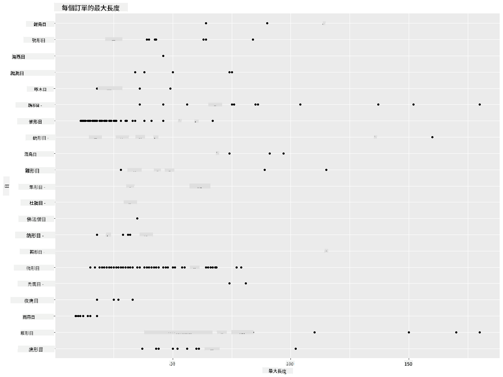
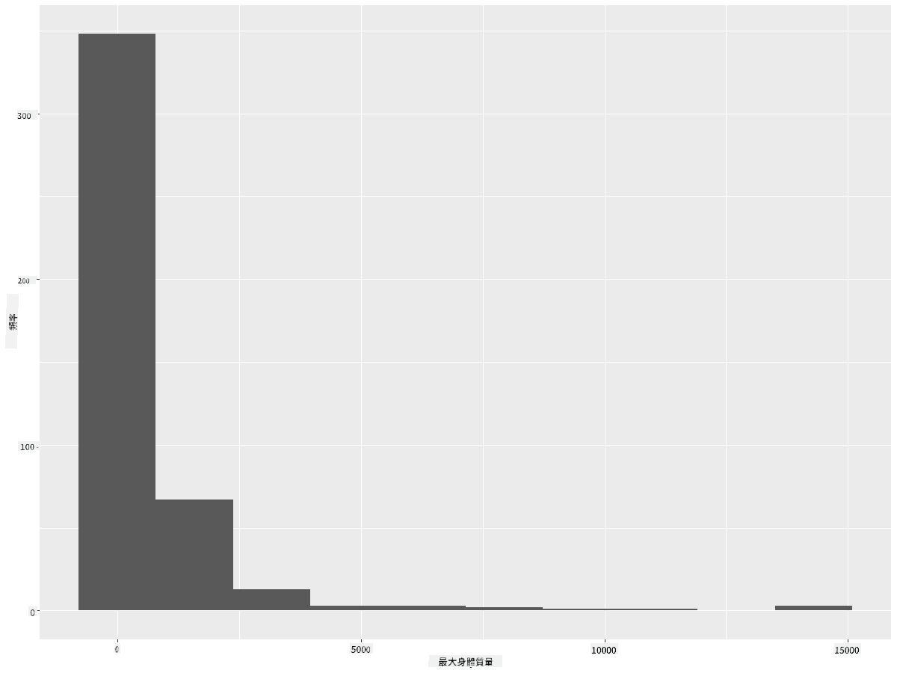
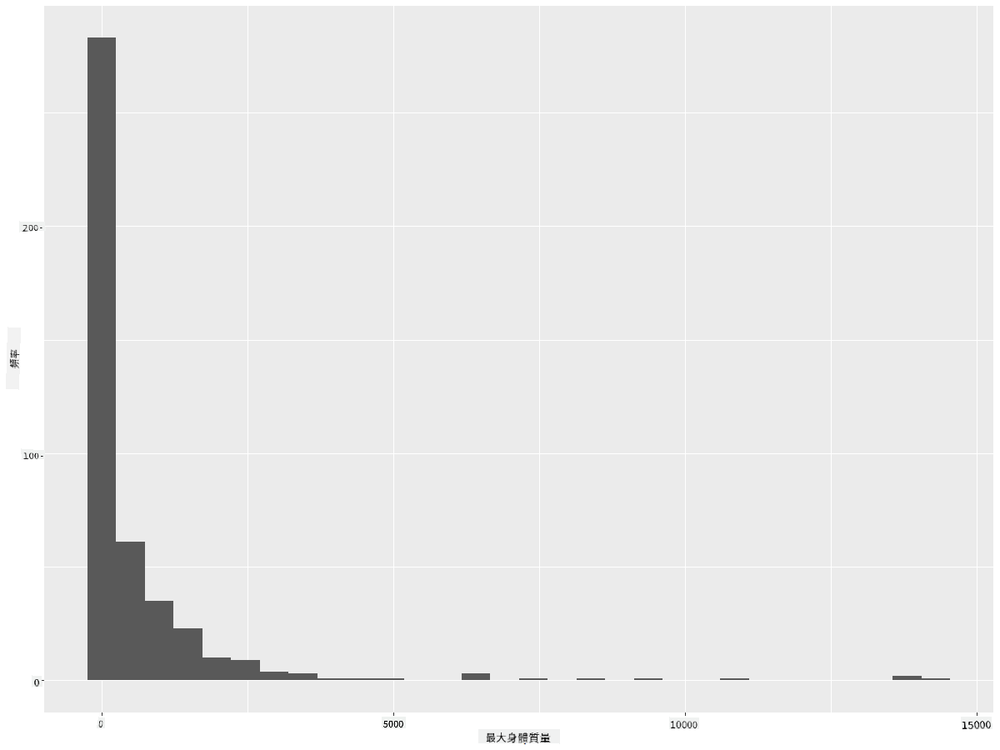
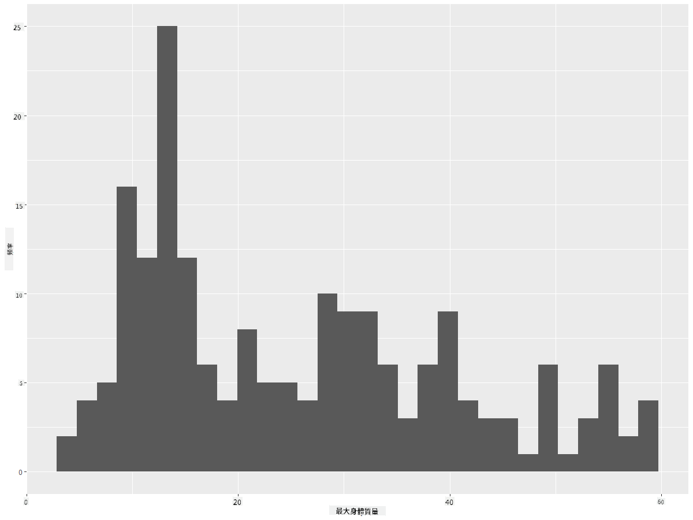
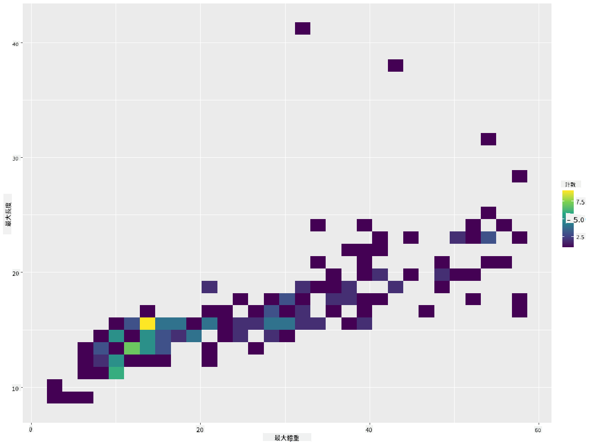
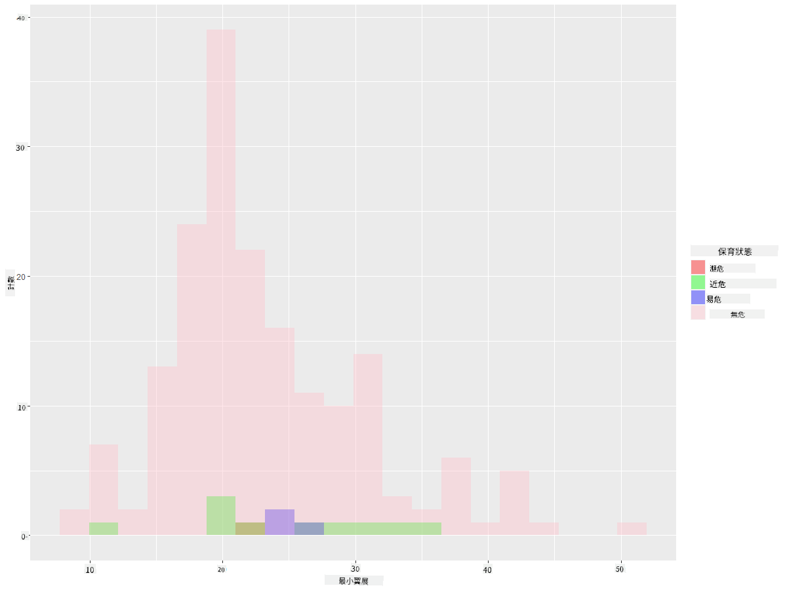
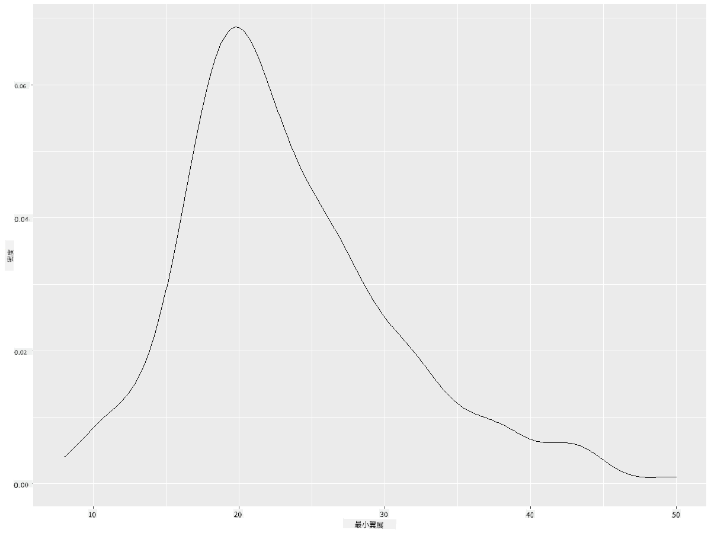
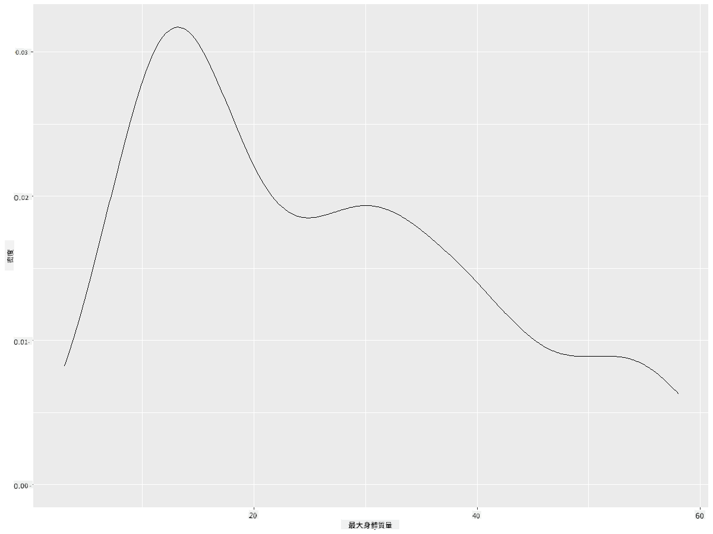
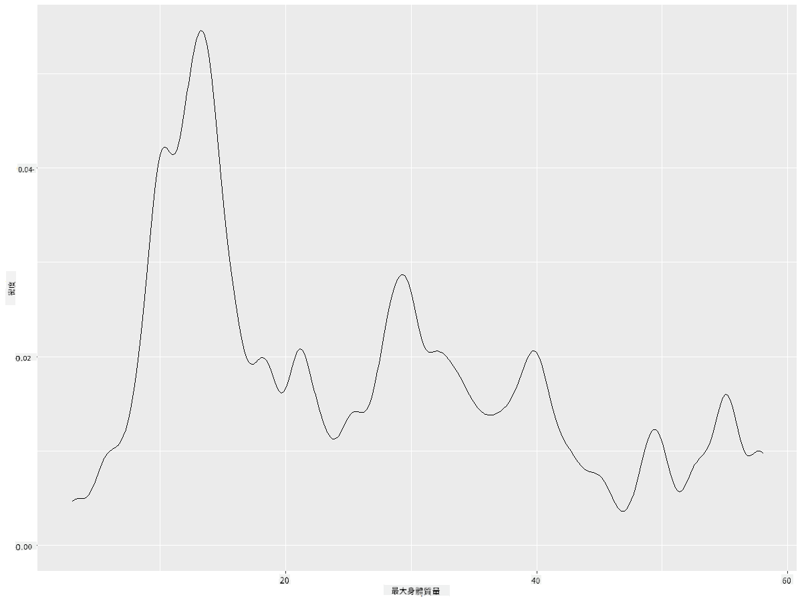
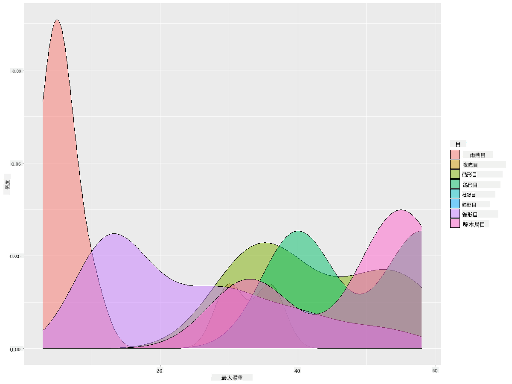

<!--
CO_OP_TRANSLATOR_METADATA:
{
  "original_hash": "ea67c0c40808fd723594de6896c37ccf",
  "translation_date": "2025-08-27T10:23:12+00:00",
  "source_file": "3-Data-Visualization/R/10-visualization-distributions/README.md",
  "language_code": "mo"
}
-->
# 視覺化分佈

| 繪製的速記筆記](https://github.com/microsoft/Data-Science-For-Beginners/blob/main/sketchnotes/10-Visualizing-Distributions.png)|
|:---:|
| 視覺化分佈 - _速記筆記由 [@nitya](https://twitter.com/nitya) 繪製_ |

在上一課中，你學習了一些關於明尼蘇達州鳥類數據集的有趣事實。你通過視覺化異常值發現了一些錯誤的數據，並通過最大長度比較了不同鳥類類別的差異。

## [課前測驗](https://purple-hill-04aebfb03.1.azurestaticapps.net/quiz/18)
## 探索鳥類數據集

另一種深入了解數據的方法是查看其分佈，即數據如何沿著某個軸排列。例如，你可能想了解這個數據集中鳥類的最大翼展或最大體重的一般分佈。

讓我們來探索這個數據集中分佈的一些事實。在你的 R 控制台中，導入 `ggplot2` 和數據庫。像上一個主題中一樣，從數據庫中移除異常值。

```r
library(ggplot2)

birds <- read.csv("../../data/birds.csv",fileEncoding="UTF-8-BOM")

birds_filtered <- subset(birds, MaxWingspan < 500)
head(birds_filtered)
```
|      | 名稱                         | 學名                   | 類別                  | 目          | 科       | 屬         | 保育狀態             | 最小長度 | 最大長度 | 最小體重   | 最大體重   | 最小翼展   | 最大翼展   |
| ---: | :--------------------------- | :--------------------- | :-------------------- | :----------- | :------- | :---------- | :----------------- | --------: | --------: | ----------: | ----------: | ----------: | ----------: |
|    0 | 黑腹樹鴨                     | Dendrocygna autumnalis | 鴨/鵝/水禽            | 雁形目       | 鴨科     | 樹鴨屬     | LC                 |        47 |        56 |         652 |        1020 |          76 |          94 |
|    1 | 棕樹鴨                       | Dendrocygna bicolor    | 鴨/鵝/水禽            | 雁形目       | 鴨科     | 樹鴨屬     | LC                 |        45 |        53 |         712 |        1050 |          85 |          93 |
|    2 | 雪鵝                         | Anser caerulescens     | 鴨/鵝/水禽            | 雁形目       | 鴨科     | 鵝屬       | LC                 |        64 |        79 |        2050 |        4050 |         135 |         165 |
|    3 | 羅斯鵝                       | Anser rossii           | 鴨/鵝/水禽            | 雁形目       | 鴨科     | 鵝屬       | LC                 |      57.3 |        64 |        1066 |        1567 |         113 |         116 |
|    4 | 大白額鵝                     | Anser albifrons        | 鴨/鵝/水禽            | 雁形目       | 鴨科     | 鵝屬       | LC                 |        64 |        81 |        1930 |        3310 |         130 |         165 |

通常，你可以通過使用散點圖快速查看數據的分佈，就像我們在上一課中所做的那樣：

```r
ggplot(data=birds_filtered, aes(x=Order, y=MaxLength,group=1)) +
  geom_point() +
  ggtitle("Max Length per order") + coord_flip()
```


這提供了每個鳥類目的一般身體長度分佈概況，但這並不是顯示真實分佈的最佳方式。通常使用直方圖來完成這項任務。
## 使用直方圖

`ggplot2` 提供了非常好的方法來使用直方圖視覺化數據分佈。這種圖表類似於柱狀圖，分佈可以通過柱狀的升降來觀察。要構建直方圖，你需要數值型數據。要構建直方圖，你可以繪製一個圖表，將類型定義為 'hist' 以表示直方圖。此圖表顯示了整個數據集的最大體重分佈。通過將數據陣列分成較小的區間，它可以顯示數據值的分佈：

```r
ggplot(data = birds_filtered, aes(x = MaxBodyMass)) + 
  geom_histogram(bins=10)+ylab('Frequency')
```


如你所見，這個數據集中的 400 多種鳥類大多數最大體重都低於 2000。通過將 `bins` 參數更改為更高的數字，例如 30，可以獲得更多的洞察：

```r
ggplot(data = birds_filtered, aes(x = MaxBodyMass)) + geom_histogram(bins=30)+ylab('Frequency')
```



此圖表以更細緻的方式顯示了分佈。通過確保僅選擇特定範圍內的數據，可以創建一個不那麼偏向左側的圖表：

篩選你的數據，僅獲取體重低於 60 的鳥類，並顯示 30 個 `bins`：

```r
birds_filtered_1 <- subset(birds_filtered, MaxBodyMass > 1 & MaxBodyMass < 60)
ggplot(data = birds_filtered_1, aes(x = MaxBodyMass)) + 
  geom_histogram(bins=30)+ylab('Frequency')
```



✅ 嘗試其他篩選條件和數據點。要查看數據的完整分佈，移除 `['MaxBodyMass']` 篩選器以顯示標籤分佈。

直方圖還提供了一些不錯的顏色和標籤增強功能可以嘗試：

創建一個 2D 直方圖來比較兩個分佈之間的關係。讓我們比較 `MaxBodyMass` 和 `MaxLength`。`ggplot2` 提供了一種內建方式來通過更亮的顏色顯示收斂：

```r
ggplot(data=birds_filtered_1, aes(x=MaxBodyMass, y=MaxLength) ) +
  geom_bin2d() +scale_fill_continuous(type = "viridis")
```
沿著預期的軸，這兩個元素之間似乎存在預期的相關性，其中有一個特別強的收斂點：



直方圖默認適用於數值型數據。如果你需要查看基於文本數據的分佈該怎麼辦？
## 使用文本數據探索數據集的分佈

此數據集還包括關於鳥類類別及其屬、種、科以及保育狀態的良好信息。讓我們深入了解這些保育信息。鳥類根據其保育狀態的分佈是什麼樣的？

> ✅ 在數據集中，使用了幾個縮寫來描述保育狀態。這些縮寫來自 [IUCN 紅色名錄分類](https://www.iucnredlist.org/)，該組織記錄了物種的狀態。
> 
> - CR: 極危
> - EN: 瀕危
> - EX: 滅絕
> - LC: 無危
> - NT: 近危
> - VU: 易危

這些是基於文本的值，因此你需要進行轉換以創建直方圖。使用篩選後的鳥類數據框，顯示其保育狀態及其最小翼展。你看到了什麼？

```r
birds_filtered_1$ConservationStatus[birds_filtered_1$ConservationStatus == 'EX'] <- 'x1' 
birds_filtered_1$ConservationStatus[birds_filtered_1$ConservationStatus == 'CR'] <- 'x2'
birds_filtered_1$ConservationStatus[birds_filtered_1$ConservationStatus == 'EN'] <- 'x3'
birds_filtered_1$ConservationStatus[birds_filtered_1$ConservationStatus == 'NT'] <- 'x4'
birds_filtered_1$ConservationStatus[birds_filtered_1$ConservationStatus == 'VU'] <- 'x5'
birds_filtered_1$ConservationStatus[birds_filtered_1$ConservationStatus == 'LC'] <- 'x6'

ggplot(data=birds_filtered_1, aes(x = MinWingspan, fill = ConservationStatus)) +
  geom_histogram(position = "identity", alpha = 0.4, bins = 20) +
  scale_fill_manual(name="Conservation Status",values=c("red","green","blue","pink"),labels=c("Endangered","Near Threathened","Vulnerable","Least Concern"))
```



最小翼展和保育狀態之間似乎沒有良好的相關性。使用此方法測試數據集的其他元素。你可以嘗試不同的篩選條件。你是否發現了任何相關性？

## 密度圖

你可能已經注意到，我們到目前為止看到的直方圖是“階梯式”的，並沒有平滑地呈弧形。要顯示更平滑的密度圖，可以嘗試使用密度圖。

現在讓我們來使用密度圖！

```r
ggplot(data = birds_filtered_1, aes(x = MinWingspan)) + 
  geom_density()
```


你可以看到該圖表反映了之前的最小翼展數據；它只是稍微平滑了一些。如果你想重新訪問第二個圖表中那條鋸齒狀的最大體重線，可以通過使用此方法非常好地將其平滑化：

```r
ggplot(data = birds_filtered_1, aes(x = MaxBodyMass)) + 
  geom_density()
```


如果你想要一條平滑但不過於平滑的線，可以編輯 `adjust` 參數：

```r
ggplot(data = birds_filtered_1, aes(x = MaxBodyMass)) + 
  geom_density(adjust = 1/5)
```


✅ 閱讀此類圖表可用的參數並進行實驗！

這種類型的圖表提供了非常具有解釋性的視覺化效果。例如，通過幾行代碼，你可以顯示每個鳥類目最大體重的密度：

```r
ggplot(data=birds_filtered_1,aes(x = MaxBodyMass, fill = Order)) +
  geom_density(alpha=0.5)
```


## 🚀 挑戰

直方圖是一種比基本散點圖、柱狀圖或折線圖更為複雜的圖表類型。上網搜索直方圖的良好使用案例。它們如何使用，它們展示了什麼，以及它們通常在哪些領域或研究領域中使用？

## [課後測驗](https://purple-hill-04aebfb03.1.azurestaticapps.net/quiz/19)

## 回顧與自學

在本課中，你使用了 `ggplot2` 並開始展示更為複雜的圖表。研究一下 `geom_density_2d()`，這是一種“在一個或多個維度上的連續概率密度曲線”。閱讀 [文檔](https://ggplot2.tidyverse.org/reference/geom_density_2d.html) 以了解其工作原理。

## 作業

[應用你的技能](assignment.md)

---

**免責聲明**：  
本文件已使用 AI 翻譯服務 [Co-op Translator](https://github.com/Azure/co-op-translator) 進行翻譯。我們致力於提供準確的翻譯，但請注意，自動翻譯可能包含錯誤或不準確之處。應以原始語言的文件作為權威來源。對於關鍵資訊，建議尋求專業人工翻譯。我們對因使用此翻譯而引起的任何誤解或錯誤解讀概不負責。