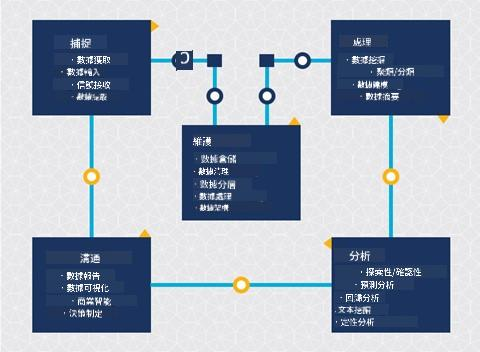
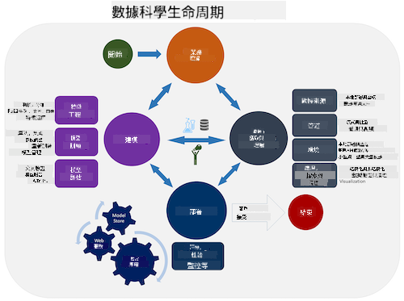
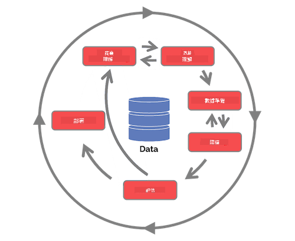

<!--
CO_OP_TRANSLATOR_METADATA:
{
  "original_hash": "07e12a25d20b8f191e3cb651c27fdb2b",
  "translation_date": "2025-09-06T20:28:19+00:00",
  "source_file": "4-Data-Science-Lifecycle/14-Introduction/README.md",
  "language_code": "mo"
}
-->
# 資料科學生命週期介紹

| ](../../sketchnotes/14-DataScience-Lifecycle.png)|
|:---:|
| 資料科學生命週期介紹 - _Sketchnote by [@nitya](https://twitter.com/nitya)_ |

## [課前測驗](https://ff-quizzes.netlify.app/en/ds/quiz/26)

到目前為止，你可能已經意識到資料科學是一個過程。這個過程可以分為五個階段：

- 資料捕捉
- 資料處理
- 資料分析
- 資料溝通
- 資料維護

本課程將重點放在生命週期的三個部分：資料捕捉、資料處理和資料維護。

> 圖片來源：[Berkeley School of Information](https://ischoolonline.berkeley.edu/data-science/what-is-data-science/)

## 資料捕捉

生命週期的第一階段非常重要，因為接下來的階段都依賴於此。這實際上是兩個階段的結合：獲取資料以及定義需要解決的目的和問題。  
定義專案的目標需要深入了解問題或問題的背景。首先，我們需要識別並獲取那些需要解決問題的人。這些可能是企業的利益相關者或專案的贊助者，他們可以幫助確定誰或什麼將從這個專案中受益，以及他們需要什麼和為什麼需要它。一個明確定義的目標應該是可測量且可量化的，以定義可接受的結果。

資料科學家可能會問的問題：
-	這個問題以前是否被研究過？發現了什麼？
-	所有參與者是否都理解目的和目標？
-	是否存在模糊性？如何減少模糊性？
-	有哪些限制條件？
-	最終結果可能會是什麼樣子？
-	有多少資源（時間、人力、計算能力）可用？

接下來是識別、收集，然後探索為實現這些目標所需的資料。在這個獲取階段，資料科學家還必須評估資料的數量和質量。這需要一些資料探索，以確認所獲取的資料能夠支持達到期望的結果。

資料科學家可能會問的關於資料的問題：
-	我已經擁有哪些資料？
-	誰擁有這些資料？
-	有哪些隱私問題？
-	我是否有足夠的資料來解決這個問題？
-	這些資料的質量是否適合解決這個問題？
-	如果我通過這些資料發現了額外的信息，我們是否應該考慮改變或重新定義目標？

## 資料處理

生命週期的處理階段專注於發現資料中的模式以及建模。一些處理階段使用的技術需要統計方法來揭示模式。通常，這對於人類來說是一項繁瑣的任務，尤其是面對大型資料集，因此需要依賴計算機來加速過程。在這個階段，資料科學和機器學習會交叉。正如你在第一課中學到的，機器學習是建立模型以理解資料的過程。模型是資料中變數之間關係的表示，幫助預測結果。

此階段常用的技術在《機器學習初學者》課程中有涵蓋。點擊以下連結了解更多：

- [分類](https://github.com/microsoft/ML-For-Beginners/tree/main/4-Classification)：將資料組織到不同的類別中以提高使用效率。
- [聚類](https://github.com/microsoft/ML-For-Beginners/tree/main/5-Clustering)：將資料分組到相似的群組中。
- [回歸](https://github.com/microsoft/ML-For-Beginners/tree/main/2-Regression)：確定變數之間的關係以預測或預估值。

## 資料維護

在生命週期的圖示中，你可能注意到維護位於資料捕捉和資料處理之間。維護是一個持續的過程，涉及在專案過程中管理、存儲和保護資料，並且應在整個專案期間予以考慮。

### 資料存儲
資料存儲的方式和位置可能會影響存儲成本以及資料訪問的速度。這些決策通常不僅僅由資料科學家做出，但他們可能需要根據資料存儲方式來選擇如何處理資料。

以下是現代資料存儲系統的一些方面，可能會影響這些選擇：

**本地存儲 vs 離線存儲 vs 公有或私有雲**

本地存儲指的是使用自己的設備來管理資料，例如擁有一台存儲資料的伺服器；而離線存儲則依賴於你不擁有的設備，例如資料中心。公有雲是一種流行的資料存儲選擇，不需要了解資料的存儲方式或位置，其中公有指的是所有使用雲服務的人共享統一的基礎設施。一些組織有嚴格的安全政策，要求完全訪問存儲資料的設備，因此會選擇提供自身雲服務的私有雲。你將在[後續課程](https://github.com/microsoft/Data-Science-For-Beginners/tree/main/5-Data-Science-In-Cloud)中學到更多關於雲端資料的內容。

**冷資料 vs 熱資料**

在訓練模型時，你可能需要更多的訓練資料。如果你對模型感到滿意，更多的資料將到來以使模型發揮其作用。無論如何，隨著資料的累積，存儲和訪問資料的成本將增加。將不常使用的冷資料與頻繁訪問的熱資料分開存儲，可以通過硬體或軟體服務提供更便宜的存儲選擇。如果需要訪問冷資料，可能會比熱資料花費更長的時間。

### 資料管理
在處理資料時，你可能會發現某些資料需要使用[資料準備](https://github.com/microsoft/Data-Science-For-Beginners/tree/main/2-Working-With-Data/08-data-preparation)課程中涵蓋的技術進行清理，以建立準確的模型。當新資料到來時，也需要應用相同的技術以保持質量的一致性。一些專案會使用自動化工具進行清理、聚合和壓縮，然後將資料移動到最終位置。Azure Data Factory 就是一個這樣的工具。

### 資料安全
資料安全的主要目標之一是確保資料的使用者能夠控制所收集的內容以及使用的背景。保持資料安全包括限制只有需要的人才能訪問資料，遵守當地法律和法規，以及維持道德標準，這些在[道德課程](https://github.com/microsoft/Data-Science-For-Beginners/tree/main/1-Introduction/02-ethics)中有涵蓋。

以下是團隊可能採取的一些安全措施：
- 確保所有資料都已加密
- 向客戶提供有關其資料使用方式的信息
- 移除已離開專案的成員的資料訪問權限
- 僅允許特定專案成員修改資料

## 🚀 挑戰

資料科學生命週期有許多版本，每個步驟可能有不同的名稱和階段數量，但都包含本課程中提到的相同過程。

探索[團隊資料科學過程生命週期](https://docs.microsoft.com/en-us/azure/architecture/data-science-process/lifecycle)和[跨行業標準資料挖掘過程](https://www.datascience-pm.com/crisp-dm-2/)。列出三個相似點和不同點。

|團隊資料科學過程 (TDSP)|跨行業標準資料挖掘過程 (CRISP-DM)|
|--|--|
| |  |
| 圖片來源：[Microsoft](https://docs.microsoft.comazure/architecture/data-science-process/lifecycle) | 圖片來源：[Data Science Process Alliance](https://www.datascience-pm.com/crisp-dm-2/) |

## [課後測驗](https://ff-quizzes.netlify.app/en/ds/quiz/27)

## 回顧與自學

應用資料科學生命週期涉及多個角色和任務，其中一些可能專注於每個階段的特定部分。團隊資料科學過程提供了一些資源，解釋了專案中可能涉及的角色和任務類型。

* [團隊資料科學過程的角色和任務](https://docs.microsoft.com/en-us/azure/architecture/data-science-process/roles-tasks)
* [執行資料科學任務：探索、建模和部署](https://docs.microsoft.com/en-us/azure/architecture/data-science-process/execute-data-science-tasks)

## 作業

[評估資料集](assignment.md)

---

**免責聲明**：  
本文件使用 AI 翻譯服務 [Co-op Translator](https://github.com/Azure/co-op-translator) 進行翻譯。我們致力於提供準確的翻譯，但請注意，自動翻譯可能包含錯誤或不準確之處。應以原始語言的文件作為權威來源。對於關鍵資訊，建議尋求專業人工翻譯。我們對於因使用此翻譯而產生的任何誤解或錯誤解讀概不負責。