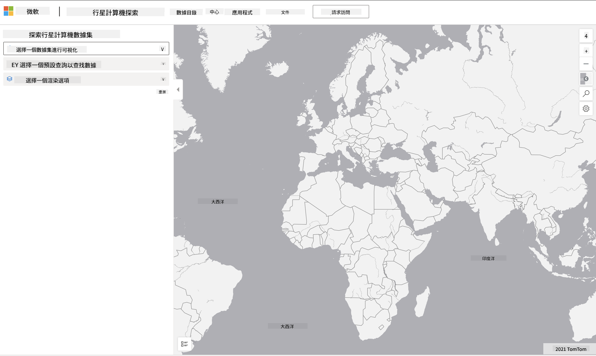

<!--
CO_OP_TRANSLATOR_METADATA:
{
  "original_hash": "d1e05715f9d97de6c4f1fb0c5a4702c0",
  "translation_date": "2025-08-27T09:25:02+00:00",
  "source_file": "6-Data-Science-In-Wild/20-Real-World-Examples/assignment.md",
  "language_code": "mo"
}
-->
# 探索行星電腦數據集

## 說明

在這節課中，我們討論了各種數據科學的應用領域，並深入探討了與研究、可持續性和數字人文相關的例子。在這次作業中，您將更詳細地探索其中一個例子，並應用您學到的有關數據可視化和分析的知識，從可持續性數據中獲取洞察。

[行星電腦](https://planetarycomputer.microsoft.com/)項目提供了數據集和API，您可以通過註冊帳戶來訪問——如果您想嘗試作業的額外步驟，請申請一個帳戶。該網站還提供了一個[Explorer](https://planetarycomputer.microsoft.com/explore)功能，您可以在不創建帳戶的情況下使用它。

`步驟：`
Explorer界面（如下圖所示）允許您選擇一個數據集（從提供的選項中），一個預設查詢（用於篩選數據）以及一個渲染選項（用於創建相關的可視化）。在這次作業中，您的任務是：

 1. 閱讀[Explorer文檔](https://planetarycomputer.microsoft.com/docs/overview/explorer/)——了解選項。
 2. 探索數據集[目錄](https://planetarycomputer.microsoft.com/catalog)——了解每個數據集的用途。
 3. 使用Explorer——選擇一個您感興趣的數據集，選擇相關的查詢和渲染選項。

`您的任務：`
現在，研究瀏覽器中渲染的可視化，並回答以下問題：
 * 該數據集有哪些_特徵_？
 * 該可視化提供了哪些_洞察_或結果？
 * 這些洞察對於該項目的可持續性目標有什麼_影響_？
 * 該可視化的_局限性_是什麼（即，您未能獲得哪些洞察）？
 * 如果您能獲取原始數據，您會創建哪些_替代可視化_，為什麼？

`額外加分：`
申請一個帳戶——並在獲批後登錄。
 * 使用 _Launch Hub_ 選項在Notebook中打開原始數據。
 * 交互式地探索數據，並實現您想到的替代可視化。
 * 現在分析您的自定義可視化——您是否能夠獲得之前錯過的洞察？

## 評分標準

優秀 | 合格 | 需要改進
--- | --- | -- |
回答了所有五個核心問題。學生清楚地指出了當前和替代可視化如何提供有關可持續性目標或結果的洞察。| 學生詳細回答了至少前三個問題，表明他們對Explorer有實際操作經驗。| 學生未能回答多個問題，或提供的細節不足——表明未對該項目進行有意義的嘗試。 |

---

**免責聲明**：  
本文件使用 AI 翻譯服務 [Co-op Translator](https://github.com/Azure/co-op-translator) 進行翻譯。我們致力於提供準確的翻譯，但請注意，自動翻譯可能包含錯誤或不準確之處。應以原始語言的文件作為權威來源。對於關鍵資訊，建議尋求專業人工翻譯。我們對因使用此翻譯而引起的任何誤解或錯誤解讀概不負責。