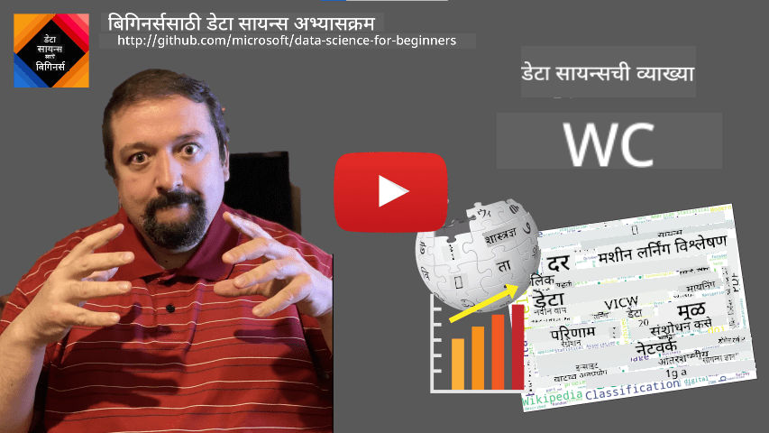
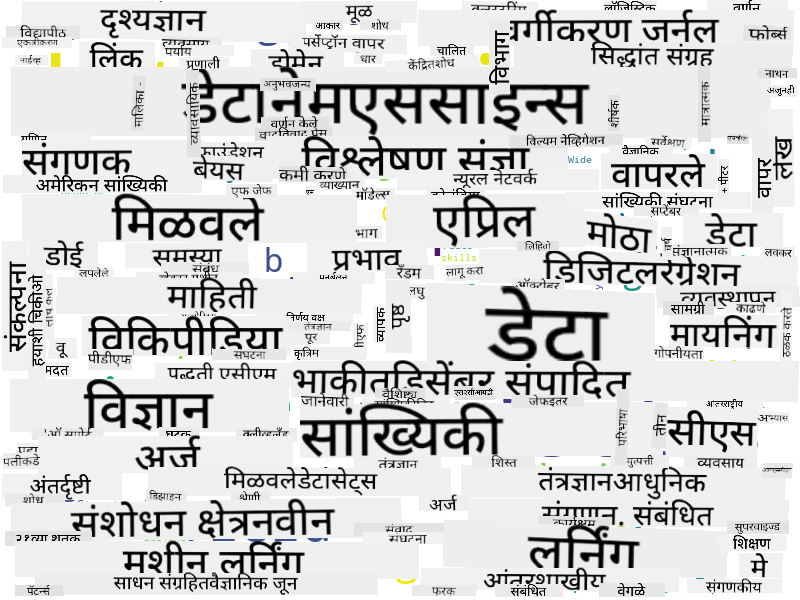

<!--
CO_OP_TRANSLATOR_METADATA:
{
  "original_hash": "43212cc1ac137b7bb1dcfb37ca06b0f4",
  "translation_date": "2025-10-25T18:45:29+00:00",
  "source_file": "1-Introduction/01-defining-data-science/README.md",
  "language_code": "mr"
}
-->
# डेटा सायन्सची व्याख्या

|  द्वारे ](../../sketchnotes/01-Definitions.png) |
| :----------------------------------------------------------------------------------------------------: |
|              डेटा सायन्सची व्याख्या - _[@nitya](https://twitter.com/nitya) द्वारे स्केच नोट_               |

---

## [पूर्व-व्याख्यान प्रश्नमंजुषा](https://ff-quizzes.netlify.app/en/ds/quiz/0)

## डेटा म्हणजे काय?
आपल्या दैनंदिन जीवनात, आपण सतत डेटाने वेढलेले असतो. तुम्ही सध्या वाचत असलेला मजकूर हा डेटा आहे. तुमच्या स्मार्टफोनमध्ये तुमच्या मित्रांचे फोन नंबर असलेली यादी डेटा आहे, तसेच तुमच्या घड्याळावर दिसणारा सध्याचा वेळ देखील डेटा आहे. मानव म्हणून, आपण नैसर्गिकरित्या डेटा वापरतो, जसे की आपल्याकडे असलेले पैसे मोजणे किंवा आपल्या मित्रांना पत्र लिहिणे.

तथापि, संगणकांच्या निर्मितीसह डेटा अधिक महत्त्वाचा झाला. संगणकांचे प्राथमिक कार्य गणना करणे आहे, परंतु त्यांना कार्य करण्यासाठी डेटाची आवश्यकता असते. त्यामुळे, संगणक डेटा कसा साठवतो आणि प्रक्रिया करतो हे समजून घेणे आपल्याला आवश्यक आहे.

इंटरनेटच्या उदयासह, डेटा हाताळण्याच्या उपकरणे म्हणून संगणकांची भूमिका वाढली. जर तुम्ही विचार केला तर, आपण आता संगणकांचा वापर गणनांसाठी कमी आणि डेटा प्रक्रिया व संवादासाठी अधिक करत आहोत. जेव्हा आपण मित्राला ई-मेल लिहितो किंवा इंटरनेटवर काही माहिती शोधतो - तेव्हा आपण मूलतः डेटा तयार करतो, साठवतो, प्रसारित करतो आणि त्यावर प्रक्रिया करतो.
> तुम्ही शेवटच्या वेळी संगणकाचा वापर काहीतरी गणना करण्यासाठी कधी केला होता?

## डेटा सायन्स म्हणजे काय?

[विकिपीडिया](https://en.wikipedia.org/wiki/Data_science) मध्ये, **डेटा सायन्स** ची व्याख्या *वैज्ञानिक पद्धतींचा वापर करून संरचित आणि असंरचित डेटामधून ज्ञान आणि अंतर्दृष्टी काढण्यासाठी आणि विविध अनुप्रयोग क्षेत्रांमध्ये डेटा कडून मिळालेल्या ज्ञानाचा आणि कृतीक्षम अंतर्दृष्टीचा उपयोग करण्यासाठी वैज्ञानिक क्षेत्र* म्हणून केली आहे.

ही व्याख्या डेटा सायन्सचे खालील महत्त्वाचे पैलू अधोरेखित करते:

* डेटा सायन्सचे मुख्य उद्दिष्ट म्हणजे डेटामधून **ज्ञान काढणे**, म्हणजे डेटा **समजून घेणे**, काही लपलेले संबंध शोधणे आणि **मॉडेल** तयार करणे.
* डेटा सायन्स **वैज्ञानिक पद्धतींचा** वापर करते, जसे की संभाव्यता आणि सांख्यिकी. खरं तर, जेव्हा *डेटा सायन्स* हा शब्द प्रथम सादर करण्यात आला, तेव्हा काही लोकांनी असा युक्तिवाद केला की डेटा सायन्स हे फक्त सांख्यिकीसाठी एक नवीन आकर्षक नाव आहे. आजकाल हे स्पष्ट झाले आहे की हे क्षेत्र खूप व्यापक आहे.
* प्राप्त झालेले ज्ञान काही **कृतीक्षम अंतर्दृष्टी** तयार करण्यासाठी लागू केले पाहिजे, म्हणजेच वास्तविक व्यवसाय परिस्थितीत लागू करता येणाऱ्या व्यावहारिक अंतर्दृष्टी.
* आपल्याला **संरचित** आणि **असंरचित** डेटा दोन्हीवर कार्य करण्यास सक्षम असले पाहिजे. आम्ही नंतर अभ्यासक्रमात डेटा प्रकारांवर चर्चा करू.
* **अनुप्रयोग क्षेत्र** हा एक महत्त्वाचा संकल्पना आहे, आणि डेटा सायंटिस्ट्सना समस्या क्षेत्रात किमान काही प्रमाणात तज्ज्ञता असणे आवश्यक आहे, उदाहरणार्थ: वित्त, औषध, विपणन इत्यादी.

> डेटा सायन्सचा आणखी एक महत्त्वाचा पैलू म्हणजे डेटा संगणकांचा वापर करून कसा गोळा, साठवला आणि कार्य केला जाऊ शकतो याचा अभ्यास करणे. सांख्यिकी आपल्याला गणितीय पाया देते, तर डेटा सायन्स गणितीय संकल्पना लागू करून डेटामधून प्रत्यक्ष अंतर्दृष्टी काढते.

[जिम ग्रे](https://en.wikipedia.org/wiki/Jim_Gray_(computer_scientist)) यांच्या मते, डेटा सायन्सकडे विज्ञानाचा एक स्वतंत्र पॅराडाइम म्हणून पाहण्याचा एक मार्ग आहे:
* **प्रायोगिक**, ज्यामध्ये आपण प्रामुख्याने निरीक्षणे आणि प्रयोगांच्या परिणामांवर अवलंबून असतो
* **सैद्धांतिक**, जिथे विद्यमान वैज्ञानिक ज्ञानातून नवीन संकल्पना उदयास येतात
* **संगणकीय**, जिथे आपण काही संगणकीय प्रयोगांवर आधारित नवीन तत्त्वे शोधतो
* **डेटा-आधारित**, डेटामधील संबंध आणि नमुने शोधण्यावर आधारित  

## संबंधित इतर क्षेत्रे

डेटा सर्वत्र असल्याने, डेटा सायन्स स्वतः एक विस्तृत क्षेत्र आहे, जे अनेक इतर शिस्तींचा समावेश करते.

<dl>
<dt>डेटाबेस</dt>
<dd>
डेटा <b>कसा साठवायचा</b> हे एक महत्त्वाचे विचार आहे, म्हणजेच त्याची रचना अशा प्रकारे कशी करावी की ती जलद प्रक्रिया करण्यास अनुमती देईल. संरचित आणि असंरचित डेटा साठवणारे विविध प्रकारचे डेटाबेस आहेत, जे <a href="../../2-Working-With-Data/README.md">आमच्या अभ्यासक्रमात आम्ही विचारात घेऊ</a>.
</dd>
<dt>बिग डेटा</dt>
<dd>
अनेकदा आपल्याला तुलनेने सोप्या रचनेच्या खूप मोठ्या प्रमाणात डेटा साठवण्याची आणि प्रक्रिया करण्याची आवश्यकता असते. संगणक क्लस्टरवर डेटा वितरित पद्धतीने साठवण्यासाठी आणि कार्यक्षमतेने प्रक्रिया करण्यासाठी विशेष पद्धती आणि साधने आहेत.
</dd>
<dt>मशीन लर्निंग</dt>
<dd>
डेटा समजून घेण्याचा एक मार्ग म्हणजे <b>मॉडेल तयार करणे</b> जे इच्छित परिणामाची भविष्यवाणी करू शकेल. डेटामधून मॉडेल विकसित करणे याला <b>मशीन लर्निंग</b> म्हणतात. याबद्दल अधिक जाणून घेण्यासाठी तुम्ही आमच्या <a href="https://aka.ms/ml-beginners">मशीन लर्निंग फॉर बिगिनर्स</a> अभ्यासक्रमाकडे पाहू शकता.
</dd>
<dt>कृत्रिम बुद्धिमत्ता</dt>
<dd>
मशीन लर्निंगचा एक भाग म्हणून ओळखले जाणारे कृत्रिम बुद्धिमत्ता (AI) देखील डेटावर अवलंबून असते आणि यात मानवी विचार प्रक्रियेची नक्कल करणारी उच्च जटिलता मॉडेल तयार करणे समाविष्ट आहे. AI पद्धती अनेकदा आपल्याला असंरचित डेटा (उदा. नैसर्गिक भाषा) संरचित अंतर्दृष्टीमध्ये बदलण्यास अनुमती देतात.
</dd>
<dt>व्हिज्युअलायझेशन</dt>
<dd>
मोठ्या प्रमाणात डेटा मानवीसाठी समजण्यायोग्य नसतो, परंतु एकदा आपण त्या डेटाचा उपयोग करून उपयुक्त व्हिज्युअलायझेशन तयार केल्यावर, आपण डेटा अधिक चांगल्या प्रकारे समजू शकतो आणि काही निष्कर्ष काढू शकतो. त्यामुळे, माहिती व्हिज्युअलायझेशनचे अनेक मार्ग जाणून घेणे महत्त्वाचे आहे - काहीतरी जे आम्ही आमच्या अभ्यासक्रमाच्या <a href="../../3-Data-Visualization/README.md">भाग 3</a> मध्ये कव्हर करू. संबंधित क्षेत्रांमध्ये <b>इन्फोग्राफिक्स</b>, आणि <b>मानव-संगणक संवाद</b> यांचा समावेश आहे.
</dd>
</dl>

## डेटा प्रकार

जसे आपण आधीच उल्लेख केले आहे, डेटा सर्वत्र आहे. आपल्याला फक्त योग्य प्रकारे ते कॅप्चर करणे आवश्यक आहे! **संरचित** आणि **असंरचित** डेटा यामध्ये फरक करणे उपयुक्त आहे. पहिला प्रकार सामान्यतः काही चांगल्या प्रकारे संरचित स्वरूपात दर्शविला जातो, अनेकदा टेबल किंवा टेबल्सच्या स्वरूपात, तर दुसरा प्रकार फक्त फाइल्सचा संग्रह असतो. कधी कधी आपण **अर्ध-संरचित** डेटाबद्दल देखील बोलतो, ज्यामध्ये काही प्रकारची रचना असते जी मोठ्या प्रमाणात बदलू शकते.

| संरचित                                                                   | अर्ध-संरचित                                                                                | असंरचित                            |
| ---------------------------------------------------------------------------- | ---------------------------------------------------------------------------------------------- | --------------------------------------- |
| लोकांची यादी त्यांच्या फोन नंबरसह                                      | लिंकसह विकिपीडिया पृष्ठे                                                                     | एनसायक्लोपीडिया ब्रिटानिका मजकूर        |
| गेल्या 20 वर्षांतील प्रत्येक मिनिटाला इमारतीतील सर्व खोल्यांचे तापमान | लेखक, प्रकाशनाची तारीख आणि सारांशासह JSON स्वरूपात वैज्ञानिक पेपरांचा संग्रह | कॉर्पोरेट दस्तऐवजांसह फाइल शेअर     |
| इमारतीत प्रवेश करणाऱ्या सर्व लोकांचे वय आणि लिंग डेटा                  | इंटरनेट पृष्ठे                                                                                 | देखरेख कॅमेरामधून कच्चा व्हिडिओ फीड |

## डेटा कुठे मिळवायचा

डेटा मिळवण्यासाठी अनेक संभाव्य स्रोत आहेत, आणि त्यांची यादी करणे अशक्य होईल! तथापि, आपण डेटा मिळवण्यासाठी काही सामान्य ठिकाणांचा उल्लेख करूया:

* **संरचित**
  - **इंटरनेट ऑफ थिंग्स** (IoT), ज्यामध्ये विविध सेन्सर्समधून डेटा मिळतो, जसे की तापमान किंवा दाब सेन्सर्स, उपयुक्त डेटा प्रदान करतात. उदाहरणार्थ, जर कार्यालयीन इमारत IoT सेन्सर्सने सुसज्ज असेल, तर आपण खर्च कमी करण्यासाठी स्वयंचलितपणे हीटिंग आणि लाइटिंग नियंत्रित करू शकतो.
  - **सर्वेक्षणे** जी आपण वापरकर्त्यांना खरेदी केल्यानंतर किंवा वेबसाइटला भेट दिल्यानंतर पूर्ण करण्यास सांगतो.
  - **वर्तन विश्लेषण** उदाहरणार्थ, आम्हाला समजून घेण्यास मदत करू शकते की वापरकर्ता साइटमध्ये किती खोलवर जातो आणि साइट सोडण्याचे सामान्य कारण काय आहे.
* **असंरचित**
  - **मजकूर** अंतर्दृष्टीचा समृद्ध स्रोत असू शकतो, जसे की एकूण **भावनात्मक स्कोअर**, किंवा कीवर्ड आणि अर्थपूर्ण अर्थ काढणे.
  - **प्रतिमा** किंवा **व्हिडिओ**. देखरेख कॅमेरामधून व्हिडिओ रस्त्यावर वाहतूक अंदाज करण्यासाठी वापरला जाऊ शकतो आणि लोकांना संभाव्य वाहतूक कोंडीबद्दल माहिती देऊ शकतो.
  - वेब सर्व्हर **लॉग्स** वापरले जाऊ शकतात ज्यामुळे आपल्याला समजते की आमच्या साइटचे कोणते पृष्ठे सर्वाधिक वेळा भेट दिले जातात आणि किती वेळासाठी.
* अर्ध-संरचित
  - **सोशल नेटवर्क** ग्राफ्स वापरकर्त्यांच्या व्यक्तिमत्त्वांबद्दल आणि माहिती पसरवण्यात संभाव्य प्रभावीतेबद्दल डेटा मिळवण्यासाठी उत्कृष्ट स्रोत असू शकतात.
  - जेव्हा आमच्याकडे पार्टीमधील छायाचित्रांचा समूह असतो, तेव्हा आम्ही लोक एकमेकांसोबत छायाचित्रे घेत असलेल्या लोकांचा ग्राफ तयार करून **गट गतिकी** डेटा काढण्याचा प्रयत्न करू शकतो.

डेटाचे विविध संभाव्य स्रोत माहित असल्याने, तुम्ही डेटा सायन्स तंत्रज्ञान लागू करून परिस्थिती चांगल्या प्रकारे जाणून घेण्यासाठी आणि व्यवसाय प्रक्रियांमध्ये सुधारणा करण्यासाठी विविध परिस्थितींबद्दल विचार करू शकता.

## डेटा सह काय करता येईल

डेटा सायन्समध्ये, आम्ही डेटा प्रवासाच्या खालील टप्प्यांवर लक्ष केंद्रित करतो:

<dl>
<dt>1) डेटा संकलन</dt>
<dd>
पहिला टप्पा म्हणजे डेटा गोळा करणे. अनेक प्रकरणांमध्ये, हे एक सोपे प्रक्रिया असू शकते, जसे की वेब अनुप्रयोगातून डेटाबेसमध्ये डेटा येणे, परंतु कधी कधी आपल्याला विशेष तंत्रांचा वापर करावा लागतो. उदाहरणार्थ, IoT सेन्सर्समधून डेटा प्रचंड प्रमाणात येऊ शकतो, आणि सर्व डेटा पुढील प्रक्रियेपूर्वी गोळा करण्यासाठी IoT हब सारख्या बफरिंग एंडपॉइंट्सचा वापर करणे चांगली प्रथा आहे.
</dd>
<dt>2) डेटा साठवण</dt>
<dd>
डेटा साठवणे आव्हानात्मक असू शकते, विशेषतः जर आपण मोठ्या डेटाबद्दल बोलत असाल. डेटा कसा साठवायचा हे ठरवताना, भविष्यात डेटा क्वेरी कसा करायचा आहे याचा अंदाज घेणे योग्य ठरेल. डेटा साठवण्याचे अनेक मार्ग आहेत:
<ul>
<li>संबंधित डेटाबेस टेबल्सचा संग्रह साठवतो आणि SQL नावाच्या विशेष भाषेचा वापर करून त्यांना क्वेरी करतो. सामान्यतः, टेबल्स वेगवेगळ्या गटांमध्ये आयोजित केले जातात ज्याला स्कीम म्हणतात. अनेक प्रकरणांमध्ये, डेटा मूळ स्वरूपातून स्कीमामध्ये बसवण्यासाठी रूपांतरित करणे आवश्यक आहे.</li>
<li><a href="https://en.wikipedia.org
> तुम्ही असा युक्तिवाद करू शकता की हा दृष्टिकोन आदर्श नाही, कारण मॉड्यूल्सची लांबी वेगवेगळी असू शकते. कदाचित मॉड्यूलच्या लांबीने (अक्षरांच्या संख्येने) वेळ विभागणे अधिक न्याय्य ठरेल आणि त्या मूल्यांची तुलना करणे योग्य ठरेल.

जेव्हा आपण बहुपर्यायी चाचण्यांचे निकाल विश्लेषित करण्यास सुरुवात करतो, तेव्हा आपण ठरवू शकतो की विद्यार्थ्यांना कोणत्या संकल्पना समजण्यात अडचण येत आहे आणि त्या माहितीचा उपयोग सामग्री सुधारण्यासाठी करू शकतो. हे करण्यासाठी, आपल्याला चाचण्या अशा प्रकारे डिझाइन कराव्या लागतील की प्रत्येक प्रश्न विशिष्ट संकल्पना किंवा ज्ञानाच्या तुकड्याशी संबंधित असेल.

जर आपण आणखी गुंतागुंतीचे व्हायचे असेल, तर आपण प्रत्येक मॉड्यूलसाठी घेतलेला वेळ विद्यार्थ्यांच्या वयोगटाच्या विरोधात प्लॉट करू शकतो. आपल्याला असे आढळू शकते की काही वयोगटांसाठी मॉड्यूल पूर्ण करण्यासाठी अत्यधिक वेळ लागतो किंवा विद्यार्थ्यांनी ते पूर्ण करण्यापूर्वीच सोडून दिले आहे. हे आपल्याला मॉड्यूलसाठी वयाच्या शिफारसी देण्यास मदत करू शकते आणि चुकीच्या अपेक्षांमुळे होणारा असमाधान कमी करू शकते.

## 🚀 आव्हान

या आव्हानात, आपण डेटा सायन्स क्षेत्राशी संबंधित संकल्पना शोधण्याचा प्रयत्न करू, ते मजकूर पाहून. आपण डेटा सायन्सवरील विकिपीडिया लेख घेऊ, मजकूर डाउनलोड आणि प्रक्रिया करू, आणि नंतर खालीलप्रमाणे एक वर्ड क्लाउड तयार करू:

कोड वाचण्यासाठी [`notebook.ipynb`](../../../../1-Introduction/01-defining-data-science/notebook.ipynb ':ignore') ला भेट द्या. तुम्ही कोड चालवू शकता आणि तो प्रत्यक्षात डेटा ट्रान्सफॉर्मेशन कसे करतो ते पाहू शकता.

> जर तुम्हाला जुपिटर नोटबुकमध्ये कोड कसा चालवायचा हे माहित नसेल, तर [हा लेख](https://soshnikov.com/education/how-to-execute-notebooks-from-github/) वाचा.

## [व्याख्यानानंतरची क्विझ](https://ff-quizzes.netlify.app/en/ds/quiz/1)

## असाइनमेंट्स

* **कार्य 1**: वरील कोड बदलून **बिग डेटा** आणि **मशीन लर्निंग** क्षेत्रांसाठी संबंधित संकल्पना शोधा.
* **कार्य 2**: [डेटा सायन्स परिदृश्यांवर विचार करा](assignment.md)

## क्रेडिट्स

ही शिकवण ♥️ सह [दिमित्री सोश्निकोव्ह](http://soshnikov.com) यांनी तयार केली आहे.

---

**अस्वीकरण**:  
हा दस्तऐवज AI भाषांतर सेवा [Co-op Translator](https://github.com/Azure/co-op-translator) वापरून भाषांतरित करण्यात आला आहे. आम्ही अचूकतेसाठी प्रयत्नशील असलो तरी, कृपयास लक्षात ठेवा की स्वयंचलित भाषांतरे त्रुटी किंवा अचूकतेच्या अभावाने युक्त असू शकतात. मूळ भाषेतील दस्तऐवज हा अधिकृत स्रोत मानला जावा. महत्त्वाच्या माहितीसाठी, व्यावसायिक मानवी भाषांतराची शिफारस केली जाते. या भाषांतराचा वापर करून उद्भवलेल्या कोणत्याही गैरसमज किंवा चुकीच्या अर्थासाठी आम्ही जबाबदार राहणार नाही.