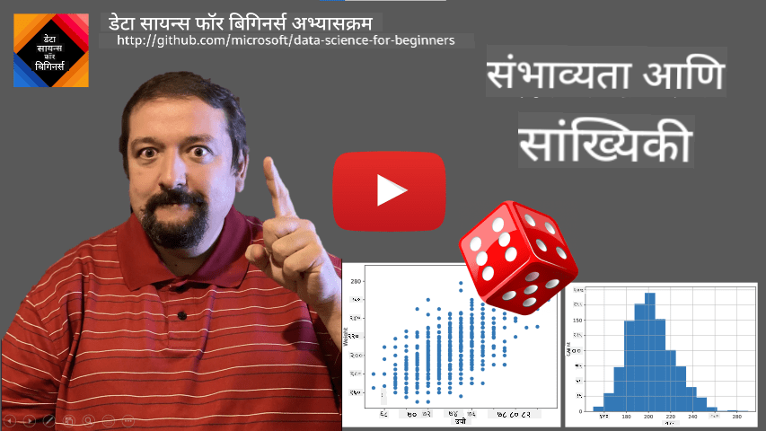
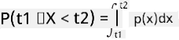
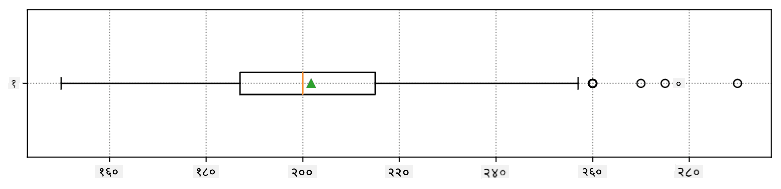
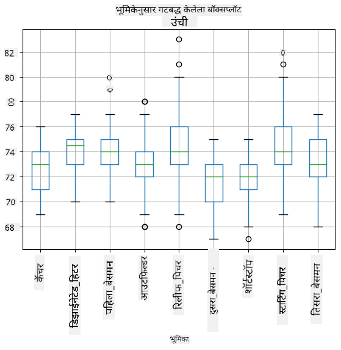
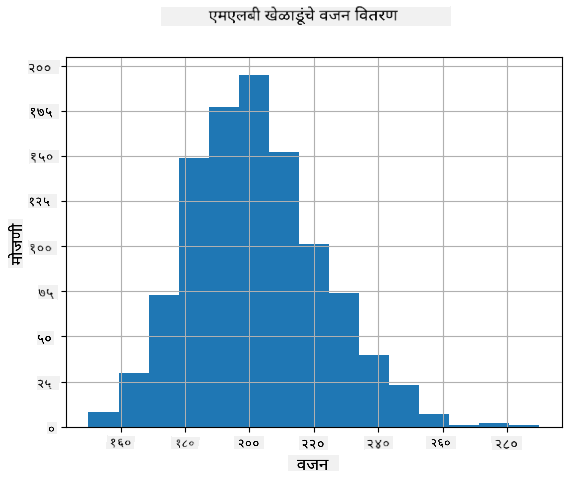
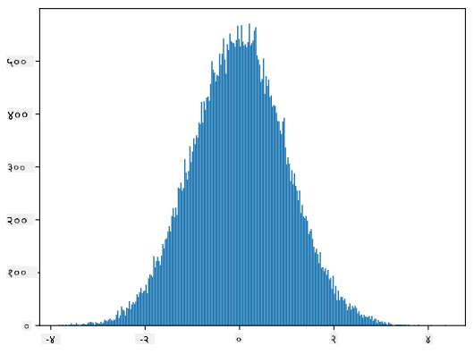
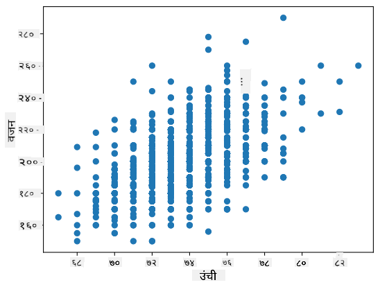

<!--
CO_OP_TRANSLATOR_METADATA:
{
  "original_hash": "b706a07cfa87ba091cbb91e0aa775600",
  "translation_date": "2025-08-27T17:21:40+00:00",
  "source_file": "1-Introduction/04-stats-and-probability/README.md",
  "language_code": "mr"
}
-->
# सांख्यिकी आणि संभाव्यता यांचे थोडक्यात परिचय

| ](../../sketchnotes/04-Statistics-Probability.png)|
|:---:|
| सांख्यिकी आणि संभाव्यता - _[@nitya](https://twitter.com/nitya) यांचे स्केच_ |

सांख्यिकी आणि संभाव्यता सिद्धांत हे गणिताचे दोन परस्पर संबंधित क्षेत्र आहेत, जे डेटा सायन्ससाठी अत्यंत महत्त्वाचे आहेत. गणिताचे सखोल ज्ञान नसतानाही डेटावर काम करणे शक्य आहे, परंतु किमान काही मूलभूत संकल्पना जाणून घेणे चांगले आहे. येथे आम्ही तुम्हाला सुरुवात करण्यासाठी मदत करणारा एक छोटासा परिचय सादर करू.

[](https://youtu.be/Z5Zy85g4Yjw)

## [पूर्व-व्याख्यान प्रश्नमंजुषा](https://purple-hill-04aebfb03.1.azurestaticapps.net/quiz/6)

## संभाव्यता आणि रँडम व्हेरिएबल्स

**संभाव्यता** ही 0 आणि 1 दरम्यानची संख्या आहे, जी एखाद्या **घटनेची** शक्यता व्यक्त करते. ती सकारात्मक परिणामांची संख्या (जे घटनेला कारणीभूत ठरतात) एकूण परिणामांच्या संख्येने विभागून परिभाषित केली जाते, असे गृहीत धरले जाते की सर्व परिणाम समान शक्यतेचे आहेत. उदाहरणार्थ, जर आपण एक पासा फेकला, तर सम संख्या येण्याची शक्यता 3/6 = 0.5 आहे.

जेव्हा आपण घटनांबद्दल बोलतो, तेव्हा आपण **रँडम व्हेरिएबल्स** वापरतो. उदाहरणार्थ, पासा फेकल्यावर मिळालेली संख्या दर्शवणारा रँडम व्हेरिएबल 1 ते 6 पर्यंतच्या मूल्ये घेईल. 1 ते 6 पर्यंतच्या संख्यांचा संच **नमुना जागा** (sample space) म्हणून ओळखला जातो. आपण रँडम व्हेरिएबलने विशिष्ट मूल्य घेण्याची शक्यता व्यक्त करू शकतो, उदाहरणार्थ P(X=3)=1/6.

वरील उदाहरणातील रँडम व्हेरिएबलला **विभक्त (discrete)** म्हणतात, कारण त्याची नमुना जागा मोजता येण्याजोगी आहे, म्हणजेच वेगवेगळ्या मूल्यांची गणना करता येते. काही वेळा नमुना जागा वास्तविक संख्यांच्या श्रेणीमध्ये किंवा संपूर्ण वास्तविक संख्यांच्या संचामध्ये असते. अशा व्हेरिएबल्सना **सातत्यपूर्ण (continuous)** म्हणतात. बस येण्याच्या वेळेचे उदाहरण यासाठी योग्य आहे.

## संभाव्यता वितरण

विभक्त रँडम व्हेरिएबल्सच्या बाबतीत, प्रत्येक घटनेची संभाव्यता P(X) फंक्शनद्वारे वर्णन करणे सोपे आहे. नमुना जागेतील *S* मधील प्रत्येक मूल्यासाठी, ते 0 ते 1 दरम्यानची संख्या देते, अशी की सर्व घटनांसाठी P(X=s) च्या सर्व मूल्यांची बेरीज 1 असेल.

सर्वात प्रसिद्ध विभक्त वितरण म्हणजे **समान वितरण (uniform distribution)**, ज्यामध्ये N घटकांची नमुना जागा असते, आणि प्रत्येक घटकासाठी समान 1/N संभाव्यता असते.

सातत्यपूर्ण व्हेरिएबलच्या संभाव्यता वितरणाचे वर्णन करणे अधिक कठीण आहे, ज्याची मूल्ये [a,b] या अंतरालातून किंवा संपूर्ण वास्तविक संख्यांच्या संच ℝ मधून घेतली जातात. बस येण्याच्या वेळेचा विचार करा. प्रत्यक्षात, विशिष्ट वेळ *t* वर बस येण्याची संभाव्यता 0 आहे!

> आता तुम्हाला कळले असेल की 0 संभाव्यता असलेल्या घटना घडतात, आणि त्या खूप वेळा घडतात! किमान प्रत्येक वेळी जेव्हा बस येते!

आपण फक्त एखाद्या व्हेरिएबलने विशिष्ट मूल्यांच्या अंतरालात येण्याची शक्यता व्यक्त करू शकतो, उदा. P(t<sub>1</sub>≤X<t<sub>2</sub>). अशा वेळी, संभाव्यता वितरण **संभाव्यता घनता फंक्शन (probability density function)** p(x) ने वर्णन केले जाते, ज्यासाठी:



सातत्यपूर्ण समान वितरणाचा सातत्यपूर्ण समकक्ष **सातत्यपूर्ण समान वितरण (continuous uniform distribution)** म्हणून ओळखला जातो, जो एका मर्यादित अंतरालावर परिभाषित केला जातो. व्हेरिएबल X ने लांबी l च्या अंतरालात येण्याची संभाव्यता l शी प्रमाणबद्ध असते, आणि ती 1 पर्यंत वाढते.

आणखी एक महत्त्वाचे वितरण म्हणजे **सामान्य वितरण (normal distribution)**, ज्याबद्दल आपण खाली अधिक तपशीलवार चर्चा करू.

## सरासरी, विचलन आणि मानक विचलन

समजा आपण रँडम व्हेरिएबल X चे n नमुने घेतो: x<sub>1</sub>, x<sub>2</sub>, ..., x<sub>n</sub>. आपण पारंपरिक पद्धतीने या अनुक्रमाची **सरासरी (mean)** (किंवा **गुणोत्तर सरासरी**) काढू शकतो: (x<sub>1</sub>+x<sub>2</sub>+...+x<sub>n</sub>)/n. जर आपण नमुन्याचा आकार वाढवला (म्हणजे n→∞ घेतले), तर आपल्याला वितरणाची सरासरी (जिला **अपेक्षा (expectation)** म्हणतात) मिळेल. आपण अपेक्षेला **E**(x) ने दर्शवू.

> हे दाखवता येते की कोणत्याही विभक्त वितरणासाठी, ज्यामध्ये मूल्ये {x<sub>1</sub>, x<sub>2</sub>, ..., x<sub>N</sub>} आणि त्यासंबंधित संभाव्यता p<sub>1</sub>, p<sub>2</sub>, ..., p<sub>N</sub> असतात, अपेक्षा E(X)=x<sub>1</sub>p<sub>1</sub>+x<sub>2</sub>p<sub>2</sub>+...+x<sub>N</sub>p<sub>N</sub> असेल.

मूल्ये किती प्रमाणात पसरलेली आहेत हे ओळखण्यासाठी, आपण विचलन σ<sup>2</sup> = ∑(x<sub>i</sub> - μ)<sup>2</sup>/n काढू शकतो, जिथे μ हा अनुक्रमाचा सरासरी आहे. σ ला **मानक विचलन (standard deviation)** म्हणतात, आणि σ<sup>2</sup> ला **विचलन (variance)** म्हणतात.

## मोड, माध्यिका आणि चतुर्थांश

कधी कधी, सरासरी डेटा साठी "सामान्य" मूल्य योग्य प्रकारे दर्शवत नाही. उदाहरणार्थ, जर काही अत्यंत मूल्ये असतील जी पूर्णपणे श्रेणीबाहेर असतील, तर ती सरासरीवर परिणाम करू शकतात. अशा वेळी **माध्यिका (median)** हा चांगला निर्देशक ठरतो, जो असा मूल्य आहे की ज्या खाली 50% डेटा पॉइंट्स असतात आणि ज्या वर 50% डेटा पॉइंट्स असतात.

डेटाच्या वितरणाला समजून घेण्यासाठी, **चतुर्थांश (quartiles)** बद्दल बोलणे उपयुक्त ठरते:

* पहिला चतुर्थांश, किंवा Q1, असा मूल्य आहे की 25% डेटा त्याखाली येतो
* तिसरा चतुर्थांश, किंवा Q3, असा मूल्य आहे की 75% डेटा त्याखाली येतो

ग्राफिकदृष्ट्या, आपण माध्यिका आणि चतुर्थांश यांचे नाते **बॉक्स प्लॉट** मध्ये दर्शवू शकतो:


येथे आपण **आंतर-चतुर्थांश श्रेणी (inter-quartile range)** IQR=Q3-Q1 काढतो, आणि तथाकथित **आउटलायर्स (outliers)** - जी मूल्ये [Q1-1.5*IQR,Q3+1.5*IQR] च्या बाहेर असतात.

लहान संख्येच्या वितरणासाठी, एक चांगले "सामान्य" मूल्य म्हणजे ते जे सर्वाधिक वेळा दिसते, ज्याला **मोड (mode)** म्हणतात. हे सहसा श्रेणीबद्ध डेटावर लागू होते, जसे की रंग. उदाहरणार्थ, जर दोन गट असतील - एक ज्यांना लाल रंग आवडतो आणि दुसरा ज्यांना निळा रंग आवडतो, तर मोड लाल किंवा निळा असेल, किंवा दोन्ही रंग असतील (जर दोन्ही गटांची संख्या समान असेल, तर नमुना **मल्टीमोडल** म्हणतात).

## वास्तविक जीवनातील डेटा

जेव्हा आपण वास्तविक जीवनातील डेटाचे विश्लेषण करतो, तेव्हा ते नेहमी रँडम व्हेरिएबल्स नसतात, कारण आपण अज्ञात परिणामांसह प्रयोग करत नाही. उदाहरणार्थ, बेसबॉल खेळाडूंच्या संघाचा विचार करा, आणि त्यांची उंची, वजन आणि वय यासारखी शारीरिक माहिती. ही संख्या अचूकपणे रँडम नसली तरी, आपण त्याच गणितीय संकल्पना लागू करू शकतो. उदाहरणार्थ, लोकांच्या वजनाचा अनुक्रम हा काही रँडम व्हेरिएबलमधून घेतलेल्या मूल्यांचा अनुक्रम मानला जाऊ शकतो. खाली [मेजर लीग बेसबॉल](http://mlb.mlb.com/index.jsp) मधील वास्तविक बेसबॉल खेळाडूंच्या वजनांचा अनुक्रम दिला आहे, जो [या डेटासेट](http://wiki.stat.ucla.edu/socr/index.php/SOCR_Data_MLB_HeightsWeights) मधून घेतला आहे (तुमच्या सोयीसाठी, फक्त पहिले 20 मूल्ये दाखवली आहेत):

```
[180.0, 215.0, 210.0, 210.0, 188.0, 176.0, 209.0, 200.0, 231.0, 180.0, 188.0, 180.0, 185.0, 160.0, 180.0, 185.0, 197.0, 189.0, 185.0, 219.0]
```

> **टीप**: या डेटासेटसह काम करण्याचे उदाहरण पाहण्यासाठी, [संबंधित नोटबुक](notebook.ipynb) पहा. या धड्यात अनेक आव्हाने आहेत, आणि तुम्ही त्या नोटबुकमध्ये काही कोड जोडून पूर्ण करू शकता. जर तुम्हाला डेटावर कसे काम करायचे हे माहित नसेल, तर काळजी करू नका - आपण नंतर पायथन वापरून डेटावर काम करण्याकडे परत येऊ. जर तुम्हाला जुपिटर नोटबुकमध्ये कोड कसा चालवायचा हे माहित नसेल, तर [हा लेख](https://soshnikov.com/education/how-to-execute-notebooks-from-github/) पहा.

खालील बॉक्स प्लॉटमध्ये आपल्या डेटासाठी सरासरी, माध्यिका आणि चतुर्थांश दाखवले आहेत:



आपल्या डेटामध्ये वेगवेगळ्या खेळाडूंच्या **भूमिकांबद्दल** माहिती असल्यामुळे, आपण भूमिकेनुसार बॉक्स प्लॉट तयार करू शकतो - यामुळे आपल्याला समजेल की भूमिकांनुसार मापदंड कसे बदलतात. यावेळी आपण उंचीचा विचार करू:



हा आकृती सूचित करतो की, सरासरीने पहिले बेसमनची उंची दुसऱ्या बेसमनच्या उंचीपेक्षा जास्त आहे. या धड्याच्या पुढील भागात आपण अधिक औपचारिकपणे ही गृहीतके कशी तपासायची आणि आपला डेटा सांख्यिकदृष्ट्या महत्त्वाचा आहे का हे कसे सिद्ध करायचे ते शिकू.

> जेव्हा आपण वास्तविक जीवनातील डेटावर काम करतो, तेव्हा आपण गृहीत धरतो की सर्व डेटा पॉइंट्स काही संभाव्यता वितरणातून घेतलेले नमुने आहेत. ही गृहीतके आपल्याला मशीन लर्निंग तंत्र लागू करण्यास आणि कार्यक्षम भविष्यवाणी मॉडेल तयार करण्यास अनुमती देतात.

आपल्या डेटाचे वितरण काय आहे हे पाहण्यासाठी, आपण **हिस्टोग्राम** नावाचा ग्राफ तयार करू शकतो. X-अक्षावर विविध वजनाच्या अंतरालांची संख्या (ज्याला **बिन्स** म्हणतात) असेल, आणि Y-अक्षावर त्या अंतरालात आमचा रँडम व्हेरिएबल किती वेळा आला हे दर्शवले जाईल.



या हिस्टोग्रामवरून तुम्हाला दिसते की सर्व मूल्ये एका विशिष्ट सरासरी वजनाभोवती केंद्रित आहेत, आणि त्या वजनापासून जितके दूर जाऊ, तितके कमी वजनाचे मूल्य दिसते. म्हणजेच, बेसबॉल खेळाडूचे वजन सरासरी वजनापासून खूप वेगळे असण्याची शक्यता खूप कमी आहे. वजनांचे विचलन हे दर्शवते की वजन सरासरीपासून किती प्रमाणात वेगळे असण्याची शक्यता आहे.

> जर आपण बेसबॉल लीगच्या बाहेरील लोकांचे वजन घेतले, तर वितरण वेगळे असण्याची शक्यता आहे. तथापि, वितरणाचा आकार समान असेल, परंतु सरासरी आणि विचलन बदलतील. त्यामुळे, जर आपण बेसबॉल खेळाडूंवर आधारित मॉडेल तयार केले, तर ते विद्यापीठातील विद्यार्थ्यांवर लागू केल्यास चुकीचे परिणाम देण्याची शक्यता आहे, कारण अंतर्निहित वितरण वेगळे आहे.

## सामान्य वितरण

आपण वर पाहिलेले वजनांचे वितरण खूप सामान्य आहे, आणि वास्तविक जीवनातील अनेक मोजमापे याच प्रकारच्या वितरणाचे अनुसरण करतात, परंतु वेगवेगळ्या सरासरी आणि विचलनासह. या वितरणाला **सामान्य वितरण (normal distribution)** म्हणतात, आणि याला सांख्यिकीमध्ये खूप महत्त्व आहे.

सामान्य वितरणाचा वापर करून संभाव्य बेसबॉल खेळाडूंच्या वजनाचे यादृच्छिक नमुने तयार करणे योग्य आहे. एकदा आपल्याला `mean` (सरासरी वजन) आणि `std` (मानक विचलन) माहित झाले की, आपण 1000 वजन नमुने खालीलप्रमाणे तयार करू शकतो:
```python
samples = np.random.normal(mean,std,1000)
``` 

जर आपण तयार केलेल्या नमुन्यांचा हिस्टोग्राम तयार केला, तर आपल्याला वरीलप्रमाणेच चित्र दिसेल. आणि जर आपण नमुन्यांची संख्या आणि बिन्सची संख्या वाढवली, तर आपण आदर्श सामान्य वितरणासारखे चित्र तयार करू शकतो:



*सरासरी=0 आणि मानक विचलन=1 असलेले सामान्य वितरण*

## विश्वास अंतर (Confidence Intervals)

जेव्हा आपण बेसबॉल खेळाडूंच्या वजनाबद्दल बोलतो, तेव्हा आपण गृहीत धरतो की **W** नावाचा एक रँडम व्हेरिएबल आहे, जो सर्व बेसबॉल खेळाडूंच्या वजनाच्या आदर्श संभाव्यता वितरणाशी संबंधित आहे (ज्याला **लोकसंख्या (population)** म्हणतात). आपल्या वजनांचा अनुक्रम हा सर्व बेसबॉल खेळाडूंच्या एका उपसंचाशी संबंधित आहे, ज्याला **नमुना (sample)** म्हणतात. एक मनोरंजक प्रश्न असा आहे की, W च्या वितरणाचे मापदंड, म्हणजेच लोकसंख्येची सरासरी आणि विचलन, आपण ओळखू शकतो का?

सर्वात सोपा उत्तर म्हणजे आपल्या नमुन्याची सरासरी आणि विचलन काढणे. तथापि, असे होऊ शकते की आपला यादृच्छिक नमुना संपूर्ण लोकसंख्येचे अचूक प्रतिनिधित्व करत नाही. त्यामुळे **विश्वास अंतर (confidence interval)** बद्दल बोलणे योग्य ठरेल.
> **विश्वास अंतराल** म्हणजे आपल्या नमुन्याच्या आधारे लोकसंख्येच्या खऱ्या सरासरीचा अंदाज, जो एका विशिष्ट संभाव्यतेने (किंवा **विश्वास स्तर**) अचूक असतो.
समजा आपल्याकडे आपल्या वितरणातून घेतलेले नमुने X<sub>1</sub>, ..., X<sub>n</sub> आहेत. प्रत्येक वेळी आपण वितरणातून नमुना घेतो, तेव्हा आपल्याला भिन्न सरासरी मूल्य μ मिळते. त्यामुळे μ ला एक यादृच्छिक चल मानले जाऊ शकते. **विश्वास अंतर** (confidence interval) हे विश्वास p सह दोन मूल्यांचा संच (L<sub>p</sub>, R<sub>p</sub>) असतो, ज्यामध्ये **P**(L<sub>p</sub>≤μ≤R<sub>p</sub>) = p, म्हणजेच मोजलेल्या सरासरी मूल्याच्या त्या अंतरात येण्याची शक्यता p इतकी असते.

विश्वास अंतर कसे मोजले जातात याबद्दल सविस्तर चर्चा करणे या छोट्या परिचयाच्या पलीकडे जाते. याबद्दल अधिक तपशील [विकिपीडियावर](https://en.wikipedia.org/wiki/Confidence_interval) सापडू शकतो. थोडक्यात सांगायचे तर, आपण लोकसंख्येच्या खऱ्या सरासरीच्या संदर्भात मोजलेल्या नमुन्याच्या सरासरीचे वितरण परिभाषित करतो, ज्याला **स्टुडंट वितरण** (student distribution) म्हणतात.

> **रोचक तथ्य**: स्टुडंट वितरणाचे नाव गणितज्ञ विल्यम सीली गॉसेट यांच्या नावावरून ठेवले गेले आहे, ज्यांनी "स्टुडंट" या टोपणनावाने आपले संशोधन प्रकाशित केले. ते गिनीज ब्रुअरीमध्ये काम करत होते, आणि एका कथेनुसार, त्यांच्या नियोक्त्याला सामान्य लोकांना हे कळू द्यायचे नव्हते की ते कच्च्या मालाच्या गुणवत्तेचे परीक्षण करण्यासाठी सांख्यिकी चाचण्या वापरत होते.

जर आपल्याला विश्वास p सह आपल्या लोकसंख्येची सरासरी μ मोजायची असेल, तर आपल्याला स्टुडंट वितरण A च्या *(1-p)/2-थ टक्केवारी* घ्यावी लागेल, जी टेबल्समधून किंवा सांख्यिकी सॉफ्टवेअरच्या अंगभूत फंक्शन्सद्वारे (उदा. Python, R, इ.) काढता येते. मग μ साठीचे अंतर असेल X±A*D/√n, जिथे X हा नमुन्याची मिळालेली सरासरी आहे, D हा मानक विचलन आहे.

> **टीप**: स्टुडंट वितरणाशी संबंधित [स्वातंत्र्य अंश](https://en.wikipedia.org/wiki/Degrees_of_freedom_(statistics)) या महत्त्वाच्या संकल्पनेची चर्चा येथे वगळली आहे. या संकल्पनेचा सखोल अभ्यास करण्यासाठी सांख्यिकीवरील अधिक सविस्तर पुस्तके वाचा.

वजन आणि उंचींसाठी विश्वास अंतर कसे मोजायचे याचे उदाहरण [सोबतच्या नोटबुकमध्ये](notebook.ipynb) दिले आहे.

| p | वजनाची सरासरी |
|-----|-----------|
| 0.85 | 201.73±0.94 |
| 0.90 | 201.73±1.08 |
| 0.95 | 201.73±1.28 |

लक्षात घ्या की विश्वासाची शक्यता जशी जास्त होते, तशी विश्वास अंतराची रुंदी वाढते.

## गृहीतक चाचणी 

आपल्या बेसबॉल खेळाडूंच्या डेटासेटमध्ये विविध खेळाडूंच्या भूमिका आहेत, ज्याचा सारांश खालीलप्रमाणे दिला आहे (हे टेबल कसे मोजले जाते हे पाहण्यासाठी [सोबतच्या नोटबुकमध्ये](notebook.ipynb) पहा):

| भूमिका | उंची | वजन | संख्या |
|------|--------|--------|-------|
| कॅचर | 72.723684 | 204.328947 | 76 |
| डिझिग्नेटेड हिटर | 74.222222 | 220.888889 | 18 |
| फर्स्ट बेसमन | 74.000000 | 213.109091 | 55 |
| आऊटफिल्डर | 73.010309 | 199.113402 | 194 |
| रिलीफ पिचर | 74.374603 | 203.517460 | 315 |
| सेकंड बेसमन | 71.362069 | 184.344828 | 58 |
| शॉर्टस्टॉप | 71.903846 | 182.923077 | 52 |
| स्टार्टिंग पिचर | 74.719457 | 205.163636 | 221 |
| थर्ड बेसमन | 73.044444 | 200.955556 | 45 |

आपण पाहतो की फर्स्ट बेसमनची सरासरी उंची सेकंड बेसमनपेक्षा जास्त आहे. त्यामुळे आपण असा निष्कर्ष काढण्याचा मोह होतो की **फर्स्ट बेसमन हे सेकंड बेसमनपेक्षा उंच आहेत**.

> या विधानाला **गृहीतक** म्हणतात, कारण आपल्याला हे खरे आहे की नाही हे माहित नाही.

तथापि, हा निष्कर्ष काढणे नेहमीच स्पष्ट नसते. वरील चर्चेतून आपल्याला माहित आहे की प्रत्येक सरासरीला संबंधित विश्वास अंतर असते, आणि त्यामुळे हा फरक केवळ सांख्यिकी त्रुटी असू शकतो. आपल्याला आपल्या गृहीतकाची चाचणी घेण्यासाठी अधिक औपचारिक पद्धतीची आवश्यकता आहे.

चला फर्स्ट आणि सेकंड बेसमनच्या उंचींसाठी विश्वास अंतर वेगवेगळे मोजूया:

| विश्वास | फर्स्ट बेसमन | सेकंड बेसमन |
|------------|---------------|----------------|
| 0.85 | 73.62..74.38 | 71.04..71.69 |
| 0.90 | 73.56..74.44 | 70.99..71.73 |
| 0.95 | 73.47..74.53 | 70.92..71.81 |

आपण पाहतो की कोणत्याही विश्वास पातळीवर ही अंतरे ओव्हरलॅप होत नाहीत. यामुळे आपले गृहीतक सिद्ध होते की फर्स्ट बेसमन हे सेकंड बेसमनपेक्षा उंच आहेत.

अधिक औपचारिकपणे, आपण सोडवत असलेली समस्या म्हणजे **दोन संभाव्यता वितरण सारखी आहेत का**, किंवा किमान त्यांचे पॅरामीटर्स सारखे आहेत का हे पाहणे. वितरणाच्या प्रकारावर अवलंबून, आपल्याला त्यासाठी वेगवेगळ्या चाचण्या वापराव्या लागतात. जर आपल्याला माहित असेल की आपली वितरणे सामान्य आहेत, तर आपण **[स्टुडंट टी-चाचणी](https://en.wikipedia.org/wiki/Student%27s_t-test)** लागू करू शकतो.

स्टुडंट टी-चाचणीत, आपण तथाकथित **टी-मूल्य** (t-value) मोजतो, जे सरासरीतील फरक दर्शवते, विचलन लक्षात घेऊन. हे सिद्ध झाले आहे की टी-मूल्य **स्टुडंट वितरणाचे** अनुसरण करते, ज्यामुळे आपल्याला दिलेल्या विश्वास पातळी **p** साठी थ्रेशोल्ड मूल्य मिळते (हे संगणित केले जाऊ शकते किंवा संख्यात्मक टेबल्समध्ये पाहिले जाऊ शकते). मग आपण टी-मूल्य थ्रेशोल्डशी तुलना करून गृहीतक मान्य किंवा नाकारतो.

Python मध्ये, आपण **SciPy** पॅकेज वापरू शकतो, ज्यामध्ये `ttest_ind` फंक्शन समाविष्ट आहे (इतर अनेक उपयुक्त सांख्यिकी फंक्शन्ससह!). हे आपल्यासाठी टी-मूल्य मोजते आणि विश्वास पातळीचा उलट शोधही करते, ज्यामुळे आपण फक्त विश्वास पाहून निष्कर्ष काढू शकतो.

उदाहरणार्थ, फर्स्ट आणि सेकंड बेसमनच्या उंचींच्या तुलनेत आपल्याला खालील निकाल मिळतात: 
```python
from scipy.stats import ttest_ind

tval, pval = ttest_ind(df.loc[df['Role']=='First_Baseman',['Height']], df.loc[df['Role']=='Designated_Hitter',['Height']],equal_var=False)
print(f"T-value = {tval[0]:.2f}\nP-value: {pval[0]}")
```
```
T-value = 7.65
P-value: 9.137321189738925e-12
```
आपल्या बाबतीत, p-मूल्य खूपच कमी आहे, याचा अर्थ फर्स्ट बेसमन उंच असल्याचे समर्थन करणारे ठोस पुरावे आहेत.

तसेच, आपण इतर प्रकारची गृहीतके चाचणी करू इच्छितो, उदाहरणार्थ:
* एखादा नमुना विशिष्ट वितरणाचे अनुसरण करतो हे सिद्ध करणे. आपल्या बाबतीत आपण गृहीत धरले आहे की उंची सामान्य वितरणाचे अनुसरण करते, परंतु त्यासाठी औपचारिक सांख्यिकी पडताळणी आवश्यक आहे.
* एखाद्या नमुन्याचे सरासरी मूल्य पूर्वनिर्धारित मूल्याशी जुळते हे सिद्ध करणे
* अनेक नमुन्यांच्या सरासरींची तुलना करणे (उदा. वेगवेगळ्या वयोगटांमधील आनंदाच्या पातळीतील फरक काय आहे)

## मोठ्या संख्यांचा नियम आणि केंद्रीय मर्यादा प्रमेय

सामान्य वितरण इतके महत्त्वाचे का आहे याचे एक कारण म्हणजे **केंद्रीय मर्यादा प्रमेय**. समजा आपल्याकडे N स्वतंत्र मूल्यांचा मोठा नमुना X<sub>1</sub>, ..., X<sub>N</sub> आहे, जो कोणत्याही वितरणातून घेतला गेला आहे, ज्याची सरासरी μ आणि विचलन σ<sup>2</sup> आहे. मग, N पुरेसे मोठे असल्यास (म्हणजे N→∞), Σ<sub>i</sub>X<sub>i</sub> ची सरासरी सामान्य वितरणाचे अनुसरण करेल, ज्याची सरासरी μ आणि विचलन σ<sup>2</sup>/N असेल.

> केंद्रीय मर्यादा प्रमेयाचा दुसरा अर्थ असा आहे की कोणत्याही वितरणाच्या यादृच्छिक मूल्यांच्या बेरजाची सरासरी मोजल्यास, आपण नेहमीच सामान्य वितरणाकडे पोहोचतो.

केंद्रीय मर्यादा प्रमेयावरून असेही दिसून येते की, जेव्हा N→∞, तेव्हा नमुन्याच्या सरासरीचे μ बरोबर असण्याची शक्यता 1 होते. याला **मोठ्या संख्यांचा नियम** म्हणतात.

## सहसंबंध आणि सहप्रसरण

डेटा सायन्समध्ये एक महत्त्वाचे काम म्हणजे डेटामधील संबंध शोधणे. दोन अनुक्रम **सहसंबंधित** आहेत असे म्हणतो जेव्हा ते एकाच वेळी समान वर्तन प्रदर्शित करतात, म्हणजेच ते एकत्र वाढतात/घटतात, किंवा एक अनुक्रम वाढतो तेव्हा दुसरा घटतो आणि उलट. 

> सहसंबंध नेहमीच दोन अनुक्रमांमधील कारणात्मक संबंध दर्शवतो असे नाही; कधी कधी दोन्ही चल बाह्य कारणावर अवलंबून असू शकतात, किंवा केवळ योगायोगाने दोन अनुक्रम सहसंबंधित असू शकतात. तथापि, मजबूत गणितीय सहसंबंध हे सूचक असते की दोन चल कसेतरी जोडलेले आहेत.

गणितीयदृष्ट्या, दोन यादृच्छिक चलांमधील संबंध दर्शवणारी मुख्य संकल्पना म्हणजे **सहप्रसरण** (covariance), जी अशा प्रकारे मोजली जाते: Cov(X,Y) = **E**\[(X-**E**(X))(Y-**E**(Y))\]. आपण दोन्ही चलांच्या सरासरी मूल्यांपासून विचलन मोजतो आणि नंतर त्या विचलनांचे गुणाकार करतो. जर दोन्ही चल एकत्र विचलित झाले, तर गुणाकार नेहमीच सकारात्मक मूल्य असेल, ज्यामुळे सकारात्मक सहप्रसरण मिळेल. जर दोन्ही चल असमकालिकपणे विचलित झाले (म्हणजे एक सरासरीखाली जात असताना दुसरा सरासरीच्या वर जात असेल), तर आपल्याला नेहमीच नकारात्मक संख्या मिळतील, ज्यामुळे नकारात्मक सहप्रसरण मिळेल. जर विचलने स्वतंत्र असतील, तर ती साधारणतः शून्याच्या आसपास असतील.

सहप्रसरणाचे परिमाण आपल्याला सहसंबंध किती मोठा आहे हे फारसे सांगत नाही, कारण ते वास्तविक मूल्यांच्या परिमाणावर अवलंबून असते. ते सामान्यीकृत करण्यासाठी, आपण सहप्रसरणाला दोन्ही चलांच्या मानक विचलनाने विभागतो, ज्यामुळे **सहसंबंध** मिळतो. सहसंबंध नेहमीच [-1,1] च्या श्रेणीत असतो, जिथे 1 मजबूत सकारात्मक सहसंबंध दर्शवतो, -1 मजबूत नकारात्मक सहसंबंध दर्शवतो, आणि 0 म्हणजे कोणताही सहसंबंध नाही (चल स्वतंत्र आहेत).

**उदाहरण**: आपण वरील डेटासेटमधील बेसबॉल खेळाडूंच्या वजन आणि उंची यांच्यातील सहसंबंध मोजू शकतो:
```python
print(np.corrcoef(weights,heights))
```
यामुळे आपल्याला **सहसंबंध मॅट्रिक्स** मिळतो, जो असा दिसतो:
```
array([[1.        , 0.52959196],
       [0.52959196, 1.        ]])
```

> सहसंबंध मॅट्रिक्स C कोणत्याही संख्येच्या इनपुट अनुक्रमांसाठी S<sub>1</sub>, ..., S<sub>n</sub> साठी मोजला जाऊ शकतो. C<sub>ij</sub> चे मूल्य S<sub>i</sub> आणि S<sub>j</sub> यांच्यातील सहसंबंध आहे, आणि कर्णरेषेवरील घटक नेहमीच 1 असतात (जे S<sub>i</sub> चे स्व-सहसंबंध आहे).

आपल्या बाबतीत, 0.53 हे मूल्य सूचित करते की व्यक्तीच्या वजन आणि उंचीमध्ये काही प्रमाणात सहसंबंध आहे. आपण एकमेकांच्या विरोधात एक मूल्याचे स्कॅटर प्लॉट देखील तयार करू शकतो, जेणेकरून संबंध दृश्यमान होईल:



> सहसंबंध आणि सहप्रसरण यांचे अधिक उदाहरणे [सोबतच्या नोटबुकमध्ये](notebook.ipynb) सापडतील.

## निष्कर्ष

या विभागात, आपण शिकलो:

* डेटाच्या मूलभूत सांख्यिकी गुणधर्म, जसे की सरासरी, विचलन, मोड आणि चतुर्थांश
* यादृच्छिक चलांचे विविध वितरण, ज्यामध्ये सामान्य वितरण समाविष्ट आहे
* विविध गुणधर्मांमधील सहसंबंध कसा शोधायचा
* काही गृहीतके सिद्ध करण्यासाठी गणित आणि सांख्यिकीचा योग्य वापर कसा करायचा
* दिलेल्या डेटासेटसाठी यादृच्छिक चलाचे विश्वास अंतर कसे मोजायचे

जरी हे संभाव्यता आणि सांख्यिकीतील सर्व विषयांचा समावेश करणारे नसले तरी, या कोर्समध्ये सुरुवात करण्यासाठी हे पुरेसे आहे.

## 🚀 आव्हान

नोटबुकमधील नमुना कोड वापरून खालील गृहीतकांची चाचणी घ्या:
1. फर्स्ट बेसमन हे सेकंड बेसमनपेक्षा वयाने मोठे आहेत.
2. फर्स्ट बेसमन हे थर्ड बेसमनपेक्षा उंच आहेत.
3. शॉर्टस्टॉप हे सेकंड बेसमनपेक्षा उंच आहेत.

## [पाठानंतरचा क्विझ](https://purple-hill-04aebfb03.1.azurestaticapps.net/quiz/7)

## पुनरावलोकन आणि स्व-अभ्यास

संभाव्यता आणि सांख्यिकी हा इतका विस्तृत विषय आहे की त्यासाठी स्वतंत्र कोर्स आवश्यक आहे. जर तुम्हाला सिद्धांतात अधिक खोलवर जायचे असेल, तर तुम्ही खालील पुस्तके वाचू शकता:

1. [कार्लोस फर्नांडीज-ग्रांडा](https://cims.nyu.edu/~cfgranda/) (न्यूयॉर्क विद्यापीठ) यांचे [Probability and Statistics for Data Science](https://cims.nyu.edu/~cfgranda/pages/stuff/probability_stats_for_DS.pdf) (ऑनलाइन उपलब्ध).
2. [पीटर आणि अँड्र्यू ब्रूस. Practical Statistics for Data Scientists.](https://www.oreilly.com/library/view/practical-statistics-for/9781491952955/) [[R मध्ये नमुना कोड](https://github.com/andrewgbruce/statistics-for-data-scientists)].
3. [जेम्स डी. मिलर. Statistics for Data Science](https://www.packtpub.com/product/statistics-for-data-science/9781788290678) [[R मध्ये नमुना कोड](https://github.com/PacktPublishing/Statistics-for-Data-Science)].

## असाइनमेंट

[लहान मधुमेह अभ्यास](assignment.md)

## क्रेडिट्स

हा धडा [दिमित्री सोश्निकोव्ह](http://soshnikov.com) यांनी ♥️ सह तयार केला आहे.

---

**अस्वीकरण**:  
हा दस्तऐवज AI भाषांतर सेवा [Co-op Translator](https://github.com/Azure/co-op-translator) चा वापर करून भाषांतरित करण्यात आला आहे. आम्ही अचूकतेसाठी प्रयत्नशील असलो तरी, कृपया लक्षात घ्या की स्वयंचलित भाषांतरांमध्ये त्रुटी किंवा अचूकतेचा अभाव असू शकतो. मूळ भाषेतील मूळ दस्तऐवज हा अधिकृत स्रोत मानला जावा. महत्त्वाच्या माहितीसाठी, व्यावसायिक मानवी भाषांतराची शिफारस केली जाते. या भाषांतराचा वापर करून उद्भवणाऱ्या कोणत्याही गैरसमज किंवा चुकीच्या अर्थासाठी आम्ही जबाबदार राहणार नाही.