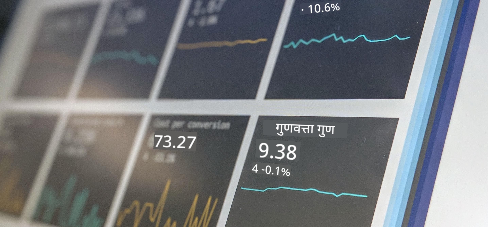

<!--
CO_OP_TRANSLATOR_METADATA:
{
  "original_hash": "696a8474a01054281704cbfb09148949",
  "translation_date": "2025-08-27T17:02:07+00:00",
  "source_file": "1-Introduction/README.md",
  "language_code": "mr"
}
-->
# डेटा सायन्सची ओळख

> फोटो <a href="https://unsplash.com/@dawson2406?utm_source=unsplash&utm_medium=referral&utm_content=creditCopyText">स्टीफन डॉसन</a> यांनी Unsplash वर <a href="https://unsplash.com/s/photos/data?utm_source=unsplash&utm_medium=referral&utm_content=creditCopyText">प्रकाशित केला</a>.

या धड्यांमध्ये, तुम्हाला डेटा सायन्स कसे परिभाषित केले जाते हे समजेल आणि डेटा सायंटिस्टने विचारात घ्याव्या लागणाऱ्या नैतिक बाबींबद्दल शिकायला मिळेल. तुम्हाला डेटा कसा परिभाषित केला जातो हे समजेल आणि डेटा सायन्सच्या मुख्य शैक्षणिक शाखा असलेल्या सांख्यिकी आणि संभाव्यता याबद्दल थोडेसे शिकायला मिळेल.

### विषय

1. [डेटा सायन्सची व्याख्या](01-defining-data-science/README.md)
2. [डेटा सायन्स नैतिकता](02-ethics/README.md)
3. [डेटाची व्याख्या](03-defining-data/README.md)
4. [सांख्यिकी आणि संभाव्यतेची ओळख](04-stats-and-probability/README.md)

### श्रेय

हे धडे ❤️ सह [नित्या नरसिंहन](https://twitter.com/nitya) आणि [दिमित्री सोश्निकोव्ह](https://twitter.com/shwars) यांनी लिहिले आहेत.

---

**अस्वीकरण**:  
हा दस्तऐवज AI भाषांतर सेवा [Co-op Translator](https://github.com/Azure/co-op-translator) वापरून भाषांतरित करण्यात आला आहे. आम्ही अचूकतेसाठी प्रयत्नशील असलो तरी कृपया लक्षात ठेवा की स्वयंचलित भाषांतरे त्रुटी किंवा अचूकतेच्या अभावाने युक्त असू शकतात. मूळ भाषेतील दस्तऐवज हा अधिकृत स्रोत मानला जावा. महत्त्वाच्या माहितीसाठी व्यावसायिक मानवी भाषांतराची शिफारस केली जाते. या भाषांतराचा वापर करून उद्भवलेल्या कोणत्याही गैरसमज किंवा चुकीच्या अर्थासाठी आम्ही जबाबदार राहणार नाही.