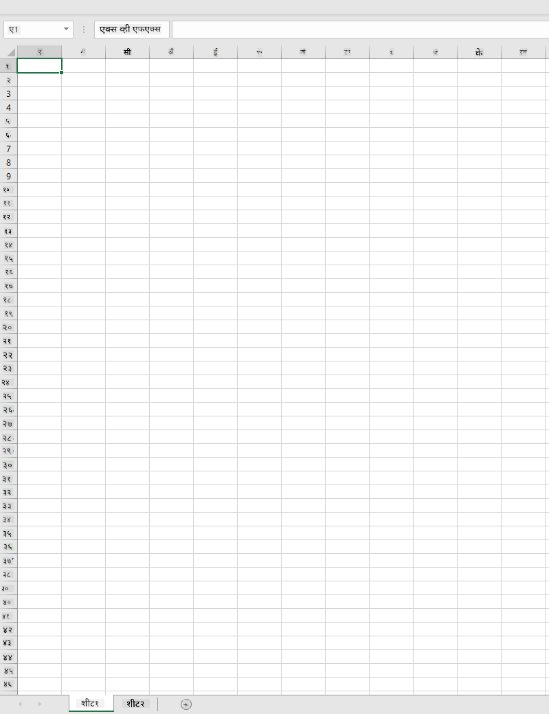
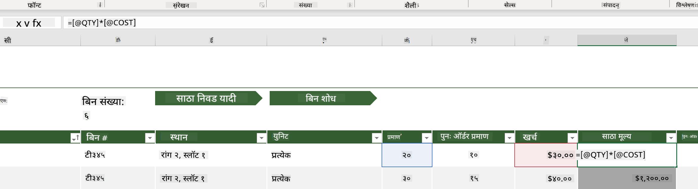
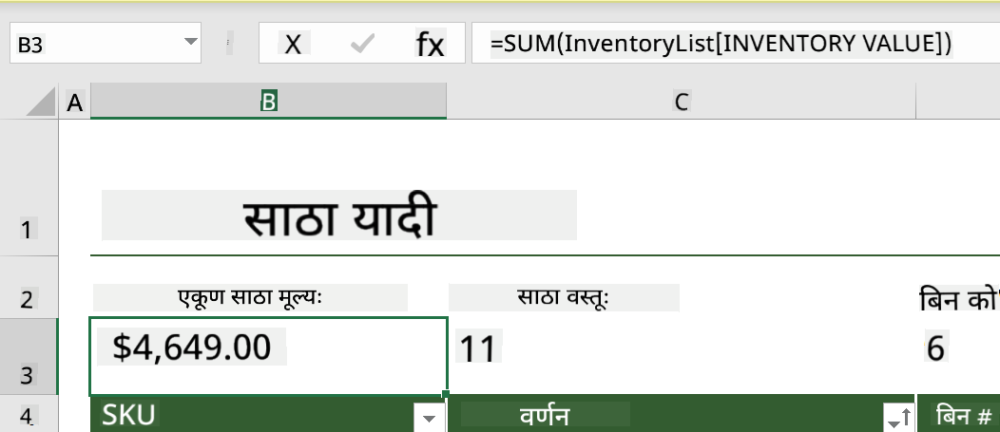
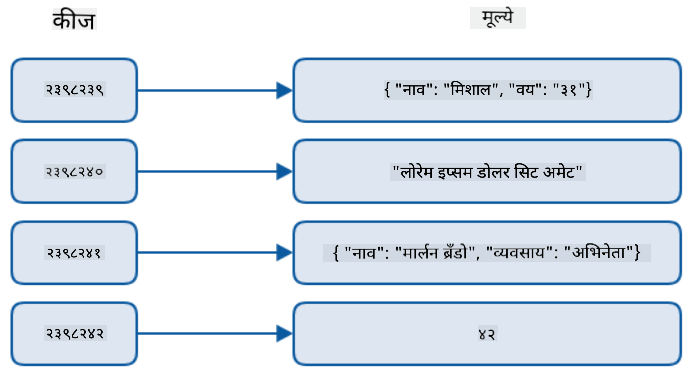
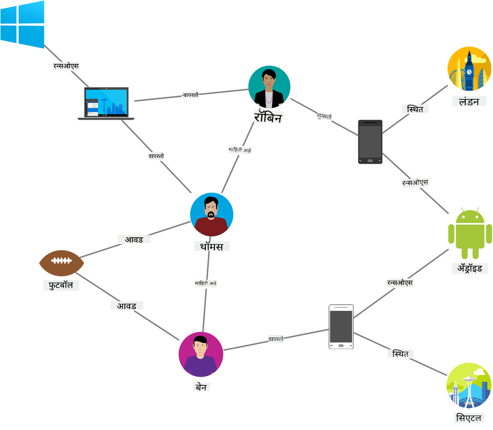
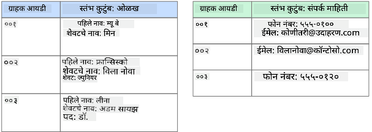
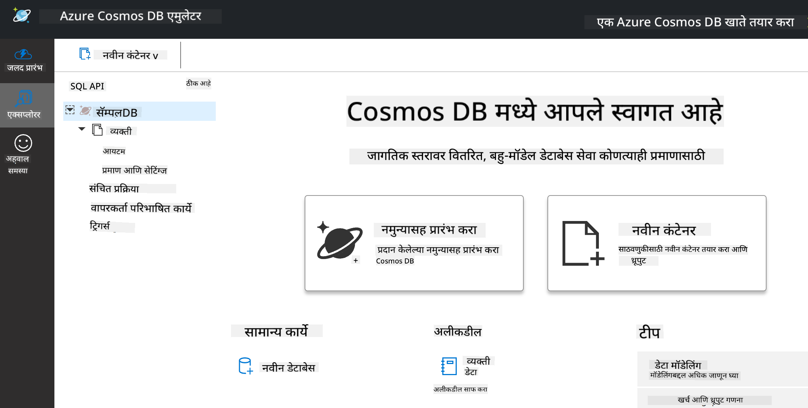
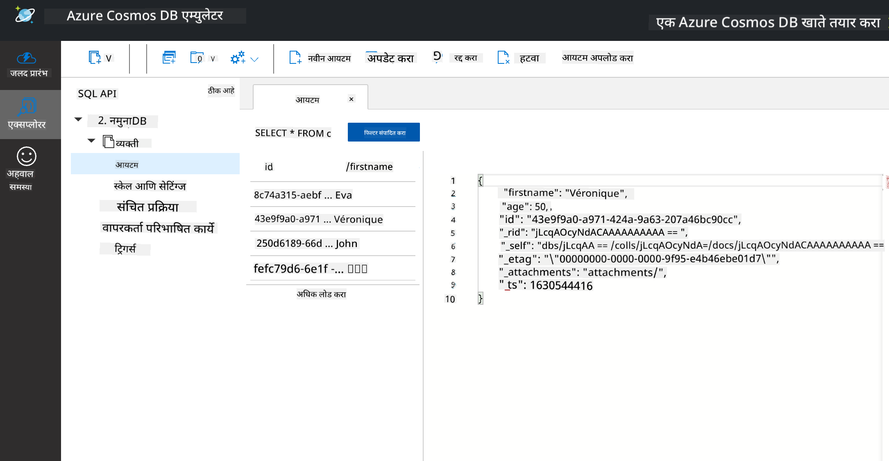
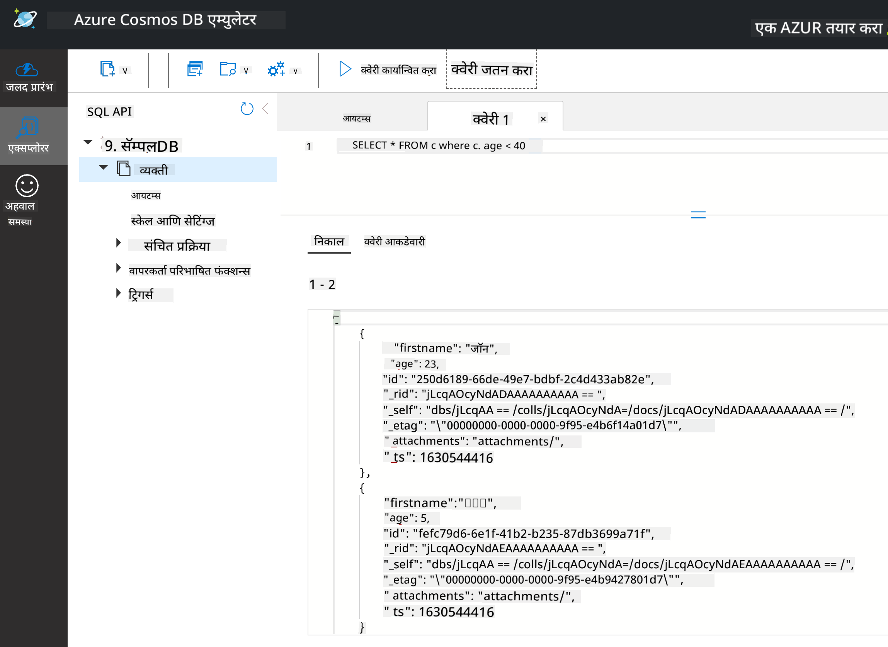

<!--
CO_OP_TRANSLATOR_METADATA:
{
  "original_hash": "54c5a1c74aecb69d2f9099300a4b7eea",
  "translation_date": "2025-09-04T16:42:05+00:00",
  "source_file": "2-Working-With-Data/06-non-relational/README.md",
  "language_code": "mr"
}
-->
# डेटा सोबत काम करणे: नॉन-रिलेशनल डेटा

| ](../../sketchnotes/06-NoSQL.png)|
|:---:|
|NoSQL डेटा सोबत काम करणे - _Sketchnote by [@nitya](https://twitter.com/nitya)_ |

## [पूर्व-व्याख्यान प्रश्नमंजूषा](https://purple-hill-04aebfb03.1.azurestaticapps.net/quiz/10)

डेटा केवळ रिलेशनल डेटाबेसपुरता मर्यादित नाही. या धड्यात नॉन-रिलेशनल डेटावर लक्ष केंद्रित केले जाईल आणि स्प्रेडशीट्स व NoSQL च्या मूलभूत गोष्टींचा अभ्यास केला जाईल.

## स्प्रेडशीट्स

स्प्रेडशीट्स डेटा साठवण्यासाठी आणि एक्सप्लोर करण्यासाठी लोकप्रिय आहेत कारण त्यासाठी सेटअप करणे आणि सुरुवात करणे सोपे असते. या धड्यात तुम्ही स्प्रेडशीटच्या मूलभूत घटकांबद्दल, तसेच फॉर्म्युला आणि फंक्शन्सबद्दल शिकाल. उदाहरणे Microsoft Excel वापरून स्पष्ट केली जातील, परंतु इतर स्प्रेडशीट सॉफ्टवेअरच्या तुलनेत बहुतेक भाग आणि विषय समान नाव आणि पायऱ्या असतील.



स्प्रेडशीट हा एक फाइल प्रकार आहे आणि तो संगणक, डिव्हाइस किंवा क्लाउड आधारित फाइल सिस्टममध्ये उपलब्ध असेल. सॉफ्टवेअर ब्राउझर आधारित असू शकते किंवा संगणकावर स्थापित करावे लागणारे अॅप्लिकेशन किंवा अॅप म्हणून डाउनलोड करावे लागते. Excel मध्ये या फाइल्सला **वर्कबुक्स** म्हणून परिभाषित केले जाते आणि उर्वरित धड्यात ही संज्ञा वापरली जाईल.

वर्कबुकमध्ये एक किंवा अधिक **वर्कशीट्स** असतात, जिथे प्रत्येक वर्कशीट टॅबद्वारे लेबल केलेले असते. वर्कशीटमध्ये **सेल्स** नावाचे आयत असतात, ज्यामध्ये वास्तविक डेटा असतो. सेल हा रो आणि कॉलमच्या छेदनबिंदूवर असतो, जिथे कॉलम्स वर्णमाला अक्षरांनी लेबल केलेले असतात आणि रो संख्यात्मक लेबल केलेले असतात. काही स्प्रेडशीट्समध्ये सेलमधील डेटाचे वर्णन करण्यासाठी पहिल्या काही रोमध्ये हेडर्स असतात.

Excel वर्कबुकच्या या मूलभूत घटकांसह, आपण [Microsoft Templates](https://templates.office.com/) मधील इन्व्हेंटरीवर आधारित एक उदाहरण वापरून स्प्रेडशीटच्या काही अतिरिक्त भागांवर चर्चा करू.

### इन्व्हेंटरी व्यवस्थापन

"InventoryExample" नावाची स्प्रेडशीट फाइल इन्व्हेंटरीमधील आयटम्सचे स्वरूपित स्प्रेडशीट आहे ज्यामध्ये तीन वर्कशीट्स आहेत, जिथे टॅब्स "Inventory List", "Inventory Pick List" आणि "Bin Lookup" म्हणून लेबल केलेले आहेत. Inventory List वर्कशीटच्या चौथ्या रोमध्ये हेडर आहे, जो हेडर कॉलममधील प्रत्येक सेलच्या मूल्याचे वर्णन करतो.



काही वेळा सेलचे मूल्य इतर सेल्सच्या मूल्यांवर अवलंबून असते. Inventory List स्प्रेडशीट प्रत्येक आयटमच्या खर्चाचा मागोवा ठेवते, परंतु जर आपल्याला संपूर्ण इन्व्हेंटरीचे मूल्य जाणून घ्यायचे असेल तर काय करावे? [**फॉर्म्युला**](https://support.microsoft.com/en-us/office/overview-of-formulas-34519a4e-1e8d-4f4b-84d4-d642c4f63263) सेल डेटा वर क्रिया करतो आणि या उदाहरणात इन्व्हेंटरीचा खर्च मोजण्यासाठी वापरला जातो. या स्प्रेडशीटमध्ये QTY हेडरखालील प्रमाण आणि COST हेडरखालील खर्च गुणाकार करून प्रत्येक आयटमचे मूल्य मोजण्यासाठी Inventory Value कॉलममध्ये फॉर्म्युला वापरला आहे. डबल क्लिक करून किंवा सेल हायलाइट करून फॉर्म्युला पाहता येतो. तुम्हाला लक्षात येईल की फॉर्म्युला "=" चिन्हाने सुरू होतो, त्यानंतर गणना किंवा ऑपरेशन असते.



आपण Inventory Value च्या सर्व मूल्यांना एकत्र करून त्याचे एकूण मूल्य मिळवण्यासाठी आणखी एक फॉर्म्युला वापरू शकतो. हे प्रत्येक सेल जोडून मोजले जाऊ शकते, परंतु ते एक कंटाळवाणे काम होऊ शकते. Excel मध्ये [**फंक्शन्स**](https://support.microsoft.com/en-us/office/sum-function-043e1c7d-7726-4e80-8f32-07b23e057f89) आहेत, जे सेल्सच्या मूल्यांवर गणना करण्यासाठी पूर्वनिर्धारित फॉर्म्युला आहेत. फंक्शन्ससाठी **arguments** आवश्यक असतात, जे गणना करण्यासाठी लागणारे मूल्य असते. जर फंक्शन्ससाठी एकापेक्षा जास्त arguments आवश्यक असतील, तर त्यांना विशिष्ट क्रमाने सूचीबद्ध करणे आवश्यक आहे अन्यथा फंक्शन योग्य मूल्य मोजू शकत नाही. या उदाहरणात SUM फंक्शन वापरले जाते आणि Inventory Value च्या मूल्यांना arguments म्हणून वापरून एकूण मूल्य तयार केले जाते, जे रो 3, कॉलम B (B3) मध्ये सूचीबद्ध आहे.

## NoSQL

NoSQL हा नॉन-रिलेशनल डेटा साठवण्याच्या विविध पद्धतींसाठी एक छत्री शब्द आहे आणि "non-SQL", "non-relational" किंवा "not only SQL" म्हणून समजला जाऊ शकतो. या प्रकारच्या डेटाबेस सिस्टम्स चार प्रकारांमध्ये वर्गीकृत केल्या जाऊ शकतात.


> स्रोत: [Michał Białecki Blog](https://www.michalbialecki.com/2018/03/18/azure-cosmos-db-key-value-database-cloud/)

[Key-value](https://docs.microsoft.com/en-us/azure/architecture/data-guide/big-data/non-relational-data#keyvalue-data-stores) डेटाबेस अद्वितीय कीज जोडतो, जे मूल्याशी संबंधित अद्वितीय ओळखकर्ता असतो. या जोड्या [hash table](https://www.hackerearth.com/practice/data-structures/hash-tables/basics-of-hash-tables/tutorial/) वापरून साठवल्या जातात, ज्यामध्ये योग्य hashing function असते.


> स्रोत: [Microsoft](https://docs.microsoft.com/en-us/azure/cosmos-db/graph/graph-introduction#graph-database-by-example)

[Graph](https://docs.microsoft.com/en-us/azure/architecture/data-guide/big-data/non-relational-data#graph-data-stores) डेटाबेस डेटा मधील संबंधांचे वर्णन करतो आणि नोड्स व एजेसच्या संग्रहासारखे सादर केले जातात. नोड म्हणजे एक entity, जे वास्तविक जगात अस्तित्वात असते जसे की विद्यार्थी किंवा बँक स्टेटमेंट. एजेस दोन entities मधील संबंध दर्शवतात. प्रत्येक नोड आणि एजेसकडे अतिरिक्त माहिती प्रदान करणारे गुणधर्म असतात.



[Columnar](https://docs.microsoft.com/en-us/azure/architecture/data-guide/big-data/non-relational-data#columnar-data-stores) डेटा स्टोर्स डेटा कॉलम्स आणि रोमध्ये आयोजित करतो, जसे रिलेशनल डेटा स्ट्रक्चरमध्ये असते, परंतु प्रत्येक कॉलम कॉलम फॅमिलीमध्ये विभागले जाते, जिथे एका कॉलम अंतर्गत सर्व डेटा संबंधित असतो आणि एक युनिट म्हणून पुनर्प्राप्त व बदलला जाऊ शकतो.

### Azure Cosmos DB सह Document डेटा स्टोर्स

[Document](https://docs.microsoft.com/en-us/azure/architecture/data-guide/big-data/non-relational-data#document-data-stores) डेटा स्टोर्स key-value डेटा स्टोअरच्या संकल्पनेवर आधारित असते आणि फील्ड्स व ऑब्जेक्ट्सच्या मालिकेने बनलेले असते. या विभागात Cosmos DB emulator सह document डेटाबेस एक्सप्लोर केला जाईल.

Cosmos DB डेटाबेस "Not Only SQL" च्या व्याख्येत बसतो, जिथे Cosmos DB चा document डेटाबेस डेटा क्वेरी करण्यासाठी SQL वर अवलंबून असतो. SQL च्या [मागील धडात](../05-relational-databases/README.md) या भाषेच्या मूलभूत गोष्टींचा अभ्यास केला आहे, आणि आपण येथे document डेटाबेसवर काही समान क्वेरी लागू करू शकतो. आपण Cosmos DB Emulator वापरणार आहोत, जो आपल्याला स्थानिक संगणकावर document डेटाबेस तयार करण्याची आणि एक्सप्लोर करण्याची परवानगी देतो. Emulator बद्दल अधिक वाचा [येथे](https://docs.microsoft.com/en-us/azure/cosmos-db/local-emulator?tabs=ssl-netstd21).

Document म्हणजे फील्ड्स आणि ऑब्जेक्ट्सच्या मूल्यांचा संग्रह, जिथे फील्ड्स ऑब्जेक्ट्सच्या मूल्याचे प्रतिनिधित्व काय आहे ते वर्णन करतात. खाली एक document चे उदाहरण दिले आहे.

```json
{
    "firstname": "Eva",
    "age": 44,
    "id": "8c74a315-aebf-4a16-bb38-2430a9896ce5",
    "_rid": "bHwDAPQz8s0BAAAAAAAAAA==",
    "_self": "dbs/bHwDAA==/colls/bHwDAPQz8s0=/docs/bHwDAPQz8s0BAAAAAAAAAA==/",
    "_etag": "\"00000000-0000-0000-9f95-010a691e01d7\"",
    "_attachments": "attachments/",
    "_ts": 1630544034
}
```

या document मधील महत्त्वाचे फील्ड्स आहेत: `firstname`, `id`, आणि `age`. उर्वरित फील्ड्स underscores सह Cosmos DB ने तयार केले आहेत.

#### Cosmos DB Emulator सह डेटा एक्सप्लोर करणे

तुम्ही Emulator [Windows साठी येथे](https://aka.ms/cosmosdb-emulator) डाउनलोड आणि इंस्टॉल करू शकता. macOS आणि Linux साठी Emulator कसे चालवायचे याचे पर्याय [या दस्तऐवजात](https://docs.microsoft.com/en-us/azure/cosmos-db/local-emulator?tabs=ssl-netstd21#run-on-linux-macos) दिले आहेत.

Emulator एक ब्राउझर विंडो लॉन्च करते, जिथे Explorer दृश्य तुम्हाला documents एक्सप्लोर करण्याची परवानगी देते.



जर तुम्ही अनुसरण करत असाल, तर "Start with Sample" वर क्लिक करा जेणेकरून SampleDB नावाचा एक नमुना डेटाबेस तयार होईल. SampleDB विस्तारण्यासाठी त्याच्या बाणावर क्लिक करा, तुम्हाला `Persons` नावाचा एक कंटेनर सापडेल. कंटेनर म्हणजे आयटम्सचा संग्रह असतो, जे कंटेनरमधील documents असतात. तुम्ही `Items` अंतर्गत चार वैयक्तिक documents एक्सप्लोर करू शकता.



#### Cosmos DB Emulator सह Document डेटा क्वेरी करणे

आपण नवीन SQL Query बटणावर (डावीकडून दुसरे बटण) क्लिक करून नमुना डेटावर क्वेरी करू शकतो.

`SELECT * FROM c` कंटेनरमधील सर्व documents परत करते. चला एक where clause जोडू आणि 40 पेक्षा कमी वय असलेल्या व्यक्ती शोधू.

`SELECT * FROM c where c.age < 40`



क्वेरी दोन documents परत करते, लक्षात घ्या की प्रत्येक document साठी age चे मूल्य 40 पेक्षा कमी आहे.

#### JSON आणि Documents

जर तुम्ही JavaScript Object Notation (JSON) शी परिचित असाल, तर तुम्हाला documents JSON सारखे दिसतील. या डिरेक्टरीमध्ये `PersonsData.json` नावाची फाइल आहे ज्यामध्ये अधिक डेटा आहे, जो तुम्ही Emulator मधील Persons कंटेनरमध्ये `Upload Item` बटणाद्वारे अपलोड करू शकता.

बहुतेक वेळा, JSON डेटा परत करणारे APIs थेट document डेटाबेसमध्ये हस्तांतरित आणि साठवले जाऊ शकतात. खाली आणखी एक document आहे, जो Microsoft Twitter अकाउंटमधून Twitter API वापरून प्राप्त केलेल्या tweets चे प्रतिनिधित्व करतो, नंतर Cosmos DB मध्ये समाविष्ट केला गेला.

```json
{
    "created_at": "2021-08-31T19:03:01.000Z",
    "id": "1432780985872142341",
    "text": "Blank slate. Like this tweet if you’ve ever painted in Microsoft Paint before. https://t.co/cFeEs8eOPK",
    "_rid": "dhAmAIUsA4oHAAAAAAAAAA==",
    "_self": "dbs/dhAmAA==/colls/dhAmAIUsA4o=/docs/dhAmAIUsA4oHAAAAAAAAAA==/",
    "_etag": "\"00000000-0000-0000-9f84-a0958ad901d7\"",
    "_attachments": "attachments/",
    "_ts": 1630537000
```

या document मधील महत्त्वाचे फील्ड्स आहेत: `created_at`, `id`, आणि `text`.

## 🚀 आव्हान

`TwitterData.json` नावाची फाइल आहे जी तुम्ही SampleDB डेटाबेसमध्ये अपलोड करू शकता. हे वेगळ्या कंटेनरमध्ये जोडणे शिफारसीय आहे. हे खालीलप्रमाणे करता येईल:

1. वरच्या उजव्या बाजूला नवीन कंटेनर बटणावर क्लिक करा
1. विद्यमान डेटाबेस (SampleDB) निवडा आणि कंटेनरसाठी एक id तयार करा
1. Partition key `/id` सेट करा
1. OK वर क्लिक करा (तुम्ही या दृश्यातील उर्वरित माहिती दुर्लक्ष करू शकता कारण हा एक छोटा डेटासेट आहे जो तुमच्या संगणकावर स्थानिक पातळीवर चालतो)
1. तुमचा नवीन कंटेनर उघडा आणि `Upload Item` बटणाद्वारे Twitter Data फाइल अपलोड करा

`text` फील्डमध्ये Microsoft असलेले documents शोधण्यासाठी काही SELECT क्वेरी चालवण्याचा प्रयत्न करा. सूचक: [LIKE keyword](https://docs.microsoft.com/en-us/azure/cosmos-db/sql/sql-query-keywords#using-like-with-the--wildcard-character) वापरण्याचा प्रयत्न करा.

## [व्याख्यानानंतरची प्रश्नमंजूषा](https://ff-quizzes.netlify.app/en/ds/)

## पुनरावलोकन आणि स्व-अभ्यास

- या स्प्रेडशीटमध्ये काही अतिरिक्त स्वरूपन आणि वैशिष्ट्ये आहेत ज्याचा या धड्यात समावेश नाही. Excel बद्दल अधिक जाणून घेण्यासाठी Microsoft कडे [दस्तऐवज आणि व्हिडिओंची मोठी लायब्ररी](https://support.microsoft.com/excel) आहे.

- नॉन-रिलेशनल डेटा प्रकारांमधील वैशिष्ट्ये तपशीलवार सांगणारी ही आर्किटेक्चरल दस्तऐवज वाचा: [Non-relational Data and NoSQL](https://docs.microsoft.com/en-us/azure/architecture/data-guide/big-data/non-relational-data)

- Cosmos DB हा क्लाउड आधारित नॉन-रिलेशनल डेटाबेस आहे जो या धड्यात नमूद केलेल्या विविध NoSQL प्रकारांना साठवू शकतो. या प्रकारांबद्दल अधिक जाणून घ्या [Cosmos DB Microsoft Learn Module](https://docs.microsoft.com/en-us/learn/paths/work-with-nosql-data-in-azure-cosmos-db/) मध्ये.

## असाइनमेंट

[Soda Profits](assignment.md)

---

**अस्वीकरण**:  
हा दस्तऐवज AI भाषांतर सेवा [Co-op Translator](https://github.com/Azure/co-op-translator) वापरून भाषांतरित करण्यात आला आहे. आम्ही अचूकतेसाठी प्रयत्नशील असलो तरी कृपया लक्षात ठेवा की स्वयंचलित भाषांतरांमध्ये त्रुटी किंवा अचूकतेचा अभाव असू शकतो. मूळ भाषेतील दस्तऐवज हा अधिकृत स्रोत मानला जावा. महत्त्वाच्या माहितीसाठी व्यावसायिक मानवी भाषांतराची शिफारस केली जाते. या भाषांतराचा वापर करून निर्माण होणाऱ्या कोणत्याही गैरसमज किंवा चुकीच्या अर्थासाठी आम्ही जबाबदार राहणार नाही.