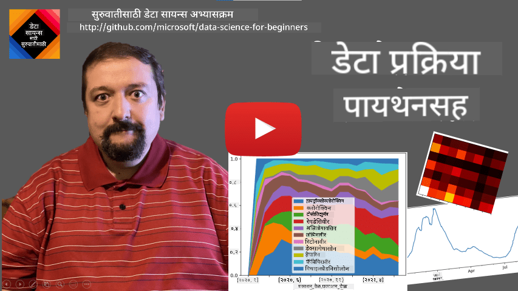
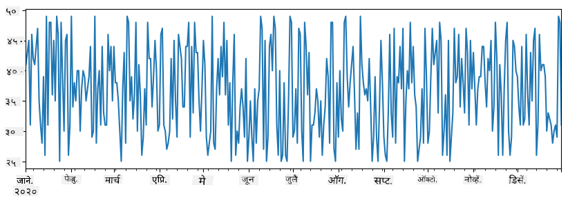
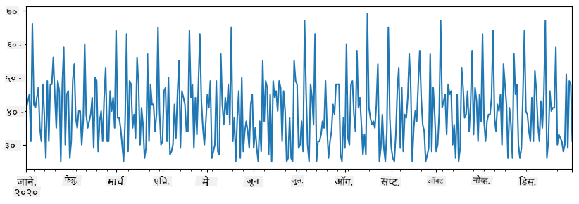
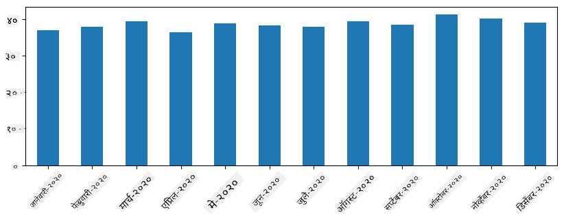
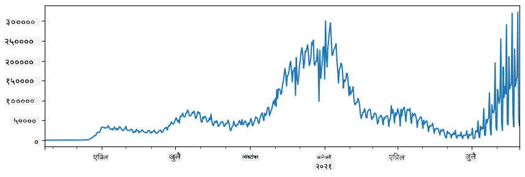
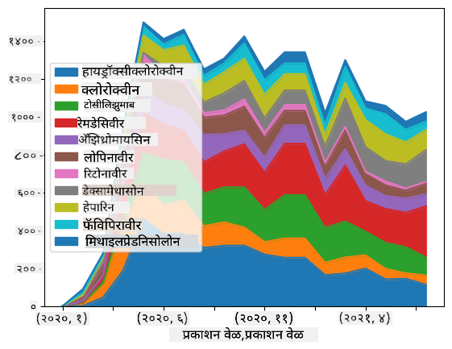

<!--
CO_OP_TRANSLATOR_METADATA:
{
  "original_hash": "57f7db1f4c3ae3361c1d1fbafcdd690c",
  "translation_date": "2025-09-04T16:42:46+00:00",
  "source_file": "2-Working-With-Data/07-python/README.md",
  "language_code": "mr"
}
-->
# डेटा सोबत काम करणे: Python आणि Pandas लायब्ररी

|  ](../../sketchnotes/07-WorkWithPython.png) |
| :-------------------------------------------------------------------------------------------------------: |
|                 Python सोबत काम करणे - _Sketchnote by [@nitya](https://twitter.com/nitya)_                 |

[](https://youtu.be/dZjWOGbsN4Y)

डेटाबेस डेटा साठवण्यासाठी आणि क्वेरी भाषांचा वापर करून त्यावर क्वेरी करण्यासाठी अत्यंत कार्यक्षम पद्धती प्रदान करतात, परंतु डेटा प्रक्रिया करण्याचा सर्वात लवचिक मार्ग म्हणजे स्वतःचा प्रोग्राम लिहून डेटा हाताळणे. अनेक वेळा, डेटाबेस क्वेरी करणे अधिक प्रभावी ठरेल. परंतु काही वेळा जेव्हा अधिक जटिल डेटा प्रक्रिया आवश्यक असते, तेव्हा ती SQL वापरून सहजपणे करता येत नाही. 
डेटा प्रक्रिया कोणत्याही प्रोग्रामिंग भाषेत प्रोग्राम केली जाऊ शकते, परंतु काही भाषा डेटा सोबत काम करण्याच्या संदर्भात उच्च स्तरावर असतात. डेटा वैज्ञानिक सामान्यतः खालील भाषांपैकी एक निवडतात:

* **[Python](https://www.python.org/)**, एक सामान्य-उद्देश प्रोग्रामिंग भाषा, जी तिच्या साधेपणामुळे सुरुवातीसाठी सर्वोत्तम पर्याय मानली जाते. Python मध्ये अनेक अतिरिक्त लायब्ररी आहेत ज्या तुम्हाला अनेक व्यावहारिक समस्या सोडवण्यास मदत करू शकतात, जसे की ZIP आर्काइव्हमधून डेटा काढणे किंवा चित्र ग्रेस्केलमध्ये रूपांतरित करणे. डेटा विज्ञानाशिवाय, Python वेब विकासासाठी देखील मोठ्या प्रमाणावर वापरली जाते. 
* **[R](https://www.r-project.org/)** ही पारंपरिक टूलबॉक्स आहे जी सांख्यिकीय डेटा प्रक्रिया लक्षात घेऊन विकसित केली गेली आहे. यात मोठ्या प्रमाणात लायब्ररींचा संग्रह (CRAN) आहे, ज्यामुळे डेटा प्रक्रिया करण्यासाठी हा एक चांगला पर्याय बनतो. तथापि, R ही सामान्य-उद्देश प्रोग्रामिंग भाषा नाही आणि डेटा विज्ञानाच्या क्षेत्राबाहेर क्वचितच वापरली जाते.
* **[Julia](https://julialang.org/)** ही आणखी एक भाषा आहे जी विशेषतः डेटा विज्ञानासाठी विकसित केली गेली आहे. Python पेक्षा चांगली कार्यक्षमता देण्यासाठी ती तयार केली गेली आहे, ज्यामुळे ती वैज्ञानिक प्रयोगांसाठी एक उत्कृष्ट साधन बनते.

या धड्यात, आम्ही साध्या डेटा प्रक्रियेसाठी Python वापरण्यावर लक्ष केंद्रित करू. आम्ही भाषेची मूलभूत ओळख गृहीत धरू. जर तुम्हाला Python चा सखोल अभ्यास करायचा असेल, तर तुम्ही खालील संसाधनांचा संदर्भ घेऊ शकता:

* [Learn Python in a Fun Way with Turtle Graphics and Fractals](https://github.com/shwars/pycourse) - GitHub-आधारित Python प्रोग्रामिंगचा जलद परिचय कोर्स
* [Take your First Steps with Python](https://docs.microsoft.com/en-us/learn/paths/python-first-steps/?WT.mc_id=academic-77958-bethanycheum) Microsoft Learn वर [Learning Path](http://learn.microsoft.com/?WT.mc_id=academic-77958-bethanycheum)

डेटा अनेक स्वरूपात येऊ शकतो. या धड्यात, आम्ही तीन प्रकारच्या डेटाचा विचार करू - **टॅब्युलर डेटा**, **टेक्स्ट** आणि **प्रतिमा**.

आम्ही संबंधित लायब्ररींचा संपूर्ण आढावा देण्याऐवजी डेटा प्रक्रियेच्या काही उदाहरणांवर लक्ष केंद्रित करू. यामुळे तुम्हाला काय शक्य आहे याची मुख्य कल्पना मिळेल आणि तुम्हाला तुमच्या समस्यांचे समाधान कुठे शोधायचे आहे याची समज मिळेल.

> **सर्वात उपयुक्त सल्ला**. जेव्हा तुम्हाला डेटावर काही विशिष्ट ऑपरेशन करायचे असते आणि ते कसे करायचे हे माहित नसते, तेव्हा इंटरनेटवर शोधण्याचा प्रयत्न करा. [Stackoverflow](https://stackoverflow.com/) वर अनेक सामान्य कार्यांसाठी Python मधील उपयुक्त कोड नमुने असतात. 

## [पूर्व-व्याख्यान प्रश्नमंजुषा](https://purple-hill-04aebfb03.1.azurestaticapps.net/quiz/12)

## टॅब्युलर डेटा आणि डेटा फ्रेम्स

तुम्ही आधीच टॅब्युलर डेटाशी परिचित आहात जेव्हा आपण रिलेशनल डेटाबेसबद्दल बोललो. जेव्हा तुमच्याकडे खूप डेटा असतो आणि तो अनेक वेगवेगळ्या लिंक केलेल्या टेबल्समध्ये असतो, तेव्हा त्यावर काम करण्यासाठी SQL वापरणे नक्कीच योग्य ठरते. तथापि, अनेक वेळा आपल्याकडे डेटा टेबल असतो आणि आपल्याला या डेटाबद्दल काही **समज** किंवा **अंतर्दृष्टी** मिळवायची असते, जसे की वितरण, मूल्यांमधील संबंध इत्यादी. डेटा विज्ञानात, अनेक वेळा आपल्याला मूळ डेटामध्ये काही रूपांतरणे करावी लागतात, त्यानंतर व्हिज्युअलायझेशन करावे लागते. Python वापरून दोन्ही पायऱ्या सहजपणे करता येतात.

Python मध्ये टॅब्युलर डेटाशी व्यवहार करण्यासाठी दोन सर्वात उपयुक्त लायब्ररी आहेत:
* **[Pandas](https://pandas.pydata.org/)** तुम्हाला तथाकथित **Dataframes** हाताळण्याची परवानगी देते, जे रिलेशनल टेबल्ससारखे असतात. तुम्ही नाव दिलेले कॉलम असू शकता आणि पंक्ती, कॉलम आणि डेटा फ्रेम्सवर सामान्यतः वेगवेगळ्या ऑपरेशन्स करू शकता. 
* **[Numpy](https://numpy.org/)** ही **tensors**, म्हणजेच बहु-आयामी **arrays** सोबत काम करण्यासाठी लायब्ररी आहे. Array मध्ये समान अंतर्निहित प्रकाराचे मूल्य असते आणि ते डेटा फ्रेमपेक्षा सोपे असते, परंतु ते अधिक गणितीय ऑपरेशन्स ऑफर करते आणि कमी ओव्हरहेड तयार करते.

तुम्हाला खालील लायब्ररींबद्दल देखील माहिती असणे आवश्यक आहे:
* **[Matplotlib](https://matplotlib.org/)** ही डेटा व्हिज्युअलायझेशन आणि ग्राफ्स प्लॉट करण्यासाठी वापरली जाणारी लायब्ररी आहे
* **[SciPy](https://www.scipy.org/)** ही काही अतिरिक्त वैज्ञानिक फंक्शन्ससह लायब्ररी आहे. आपण आधीच संभाव्यता आणि सांख्यिकीबद्दल बोलताना या लायब्ररीचा उल्लेख केला आहे

Python प्रोग्रामच्या सुरुवातीला तुम्ही सामान्यतः या लायब्ररी आयात करण्यासाठी वापरणारा कोड येथे आहे:
```python
import numpy as np
import pandas as pd
import matplotlib.pyplot as plt
from scipy import ... # you need to specify exact sub-packages that you need
``` 

Pandas काही मूलभूत संकल्पनांवर केंद्रित आहे.

### Series 

**Series** ही मूल्यांची अनुक्रम आहे, जी सूची किंवा numpy array सारखी आहे. मुख्य फरक म्हणजे series मध्ये **index** देखील असतो, आणि जेव्हा आपण series वर ऑपरेशन करतो (उदा., त्यांना जोडतो), तेव्हा index विचारात घेतला जातो. Index साधा पूर्णांक पंक्ती क्रमांक असू शकतो (जेव्हा सूची किंवा array मधून series तयार केली जाते तेव्हा वापरला जाणारा index), किंवा त्यात date interval सारखी जटिल रचना असू शकते.

> **Note**: Pandas चा काही प्रारंभिक कोड सोबतच्या नोटबुकमध्ये [`notebook.ipynb`](notebook.ipynb) आहे. आम्ही येथे काही उदाहरणे outline करतो, आणि तुम्ही पूर्ण नोटबुक तपासण्यासाठी नक्कीच स्वागत आहे.

उदाहरण विचार करा: आम्हाला आमच्या ice-cream spot च्या विक्रीचे विश्लेषण करायचे आहे. काही कालावधीसाठी विक्रीच्या संख्येची (प्रत्येक दिवशी विकल्या गेलेल्या वस्तूंची संख्या) series तयार करूया:

```python
start_date = "Jan 1, 2020"
end_date = "Mar 31, 2020"
idx = pd.date_range(start_date,end_date)
print(f"Length of index is {len(idx)}")
items_sold = pd.Series(np.random.randint(25,50,size=len(idx)),index=idx)
items_sold.plot()
```


आता समजा प्रत्येक आठवड्यात आम्ही मित्रांसाठी पार्टी आयोजित करतो आणि पार्टीसाठी अतिरिक्त 10 ice-cream पॅक्स घेतो. आम्ही हे दाखवण्यासाठी आठवड्याने index केलेली आणखी एक series तयार करू शकतो:
```python
additional_items = pd.Series(10,index=pd.date_range(start_date,end_date,freq="W"))
```
जेव्हा आम्ही दोन series एकत्र करतो, तेव्हा आपल्याला एकूण संख्या मिळते:
```python
total_items = items_sold.add(additional_items,fill_value=0)
total_items.plot()
```


> **Note** की आम्ही साधी syntax `total_items+additional_items` वापरत नाही. जर आम्ही असे केले असते, तर आम्हाला resulting series मध्ये अनेक `NaN` (*Not a Number*) मूल्ये मिळाली असती. हे असे आहे कारण `additional_items` series मध्ये काही index point साठी missing values आहेत, आणि `NaN` कशालाही जोडल्यास `NaN` मिळते. त्यामुळे आम्हाला addition दरम्यान `fill_value` parameter specify करणे आवश्यक आहे.

Time series सह, आपण वेगवेगळ्या time intervals सह series **resample** करू शकतो. उदाहरणार्थ, समजा आपल्याला मासिक विक्रीचे सरासरी प्रमाण compute करायचे आहे. आपण खालील कोड वापरू शकतो:
```python
monthly = total_items.resample("1M").mean()
ax = monthly.plot(kind='bar')
```


### DataFrame

DataFrame मूलत: समान index असलेल्या series चा संग्रह आहे. आपण अनेक series एकत्र करून DataFrame तयार करू शकतो:
```python
a = pd.Series(range(1,10))
b = pd.Series(["I","like","to","play","games","and","will","not","change"],index=range(0,9))
df = pd.DataFrame([a,b])
```
यामुळे खालीलप्रमाणे एक horizontal table तयार होईल:
|     | 0   | 1    | 2   | 3   | 4      | 5   | 6      | 7    | 8    |
| --- | --- | ---- | --- | --- | ------ | --- | ------ | ---- | ---- |
| 0   | 1   | 2    | 3   | 4   | 5      | 6   | 7      | 8    | 9    |
| 1   | I   | like | to  | use | Python | and | Pandas | very | much |

आपण Series कॉलम म्हणून वापरू शकतो आणि dictionary वापरून कॉलम नावे specify करू शकतो:
```python
df = pd.DataFrame({ 'A' : a, 'B' : b })
```
यामुळे आपल्याला खालीलप्रमाणे टेबल मिळेल:

|     | A   | B      |
| --- | --- | ------ |
| 0   | 1   | I      |
| 1   | 2   | like   |
| 2   | 3   | to     |
| 3   | 4   | use    |
| 4   | 5   | Python |
| 5   | 6   | and    |
| 6   | 7   | Pandas |
| 7   | 8   | very   |
| 8   | 9   | much   |

**Note** की आपण `.T` वापरून मागील टेबल transpose करून देखील ही टेबल लेआउट मिळवू शकतो, उदा. 
```python
df = pd.DataFrame([a,b]).T..rename(columns={ 0 : 'A', 1 : 'B' })
```
येथे `.T` म्हणजे DataFrame transpose करण्याची operation, म्हणजेच rows आणि columns बदलणे, आणि `rename` operation आपल्याला मागील उदाहरणाशी जुळण्यासाठी कॉलमचे नाव बदलण्याची परवानगी देते.

DataFrames वर आपण करू शकणाऱ्या काही महत्त्वाच्या ऑपरेशन्स येथे आहेत:

**Column selection**. आपण `df['A']` लिहून individual कॉलम निवडू शकतो - ही operation Series परत करते. आपण `df[['B','A']]` लिहून दुसऱ्या DataFrame मध्ये कॉलम subset निवडू शकतो - ही operation दुसरा DataFrame परत करते.

**Filtering** फक्त विशिष्ट criteria असलेल्या rows. उदाहरणार्थ, कॉलम `A` 5 पेक्षा जास्त असलेल्या rows ठेवण्यासाठी, आपण `df[df['A']>5]` लिहू शकतो.

> **Note**: Filtering कसे कार्य करते ते खालीलप्रमाणे आहे. Expression `df['A']<5` एक boolean series परत करते, जी मूळ series `df['A']` च्या प्रत्येक element साठी expression `True` किंवा `False` आहे का हे दर्शवते. Boolean series index म्हणून वापरली जाते तेव्हा ती DataFrame मधील rows subset परत करते. त्यामुळे arbitrary Python boolean expression वापरणे शक्य नाही, उदाहरणार्थ, `df[df['A']>5 and df['A']<7]` लिहिणे चुकीचे ठरेल. त्याऐवजी, तुम्ही boolean series वर विशेष `&` operation वापरून लिहा, उदा. `df[(df['A']>5) & (df['A']<7)]` (*brackets येथे महत्त्वाचे आहेत*).

**नवीन computable कॉलम तयार करणे**. आपण सहजपणे खालीलप्रमाणे intuitive expression वापरून DataFrame साठी नवीन computable कॉलम तयार करू शकतो:
```python
df['DivA'] = df['A']-df['A'].mean() 
``` 
हे उदाहरण A च्या mean value पासून divergence calculate करते. येथे प्रत्यक्षात काय होते ते म्हणजे आपण एक series compute करतो आणि नंतर ही series left-hand-side ला assign करतो, नवीन कॉलम तयार करतो. त्यामुळे, आपण series सोबत compatible नसलेल्या कोणत्याही operations वापरू शकत नाही, उदाहरणार्थ, खालील कोड चुकीचा आहे:
```python
# Wrong code -> df['ADescr'] = "Low" if df['A'] < 5 else "Hi"
df['LenB'] = len(df['B']) # <- Wrong result
``` 
मागील उदाहरण, syntactically योग्य असले तरी, चुकीचा परिणाम देते, कारण ते series `B` च्या length सर्व कॉलम values ला assign करते, आणि intended individual elements च्या length नाही.

जर आपल्याला अशा complex expressions compute करायच्या असतील, तर आपण `apply` function वापरू शकतो. मागील उदाहरण खालीलप्रमाणे लिहिले जाऊ शकते:
```python
df['LenB'] = df['B'].apply(lambda x : len(x))
# or 
df['LenB'] = df['B'].apply(len)
```

वरील ऑपरेशन्सनंतर, आपल्याला खालील DataFrame मिळेल:

|     | A   | B      | DivA | LenB |
| --- | --- | ------ | ---- | ---- |
| 0   | 1   | I      | -4.0 | 1    |
| 1   | 2   | like   | -3.0 | 4    |
| 2   | 3   | to     | -2.0 | 2    |
| 3   | 4   | use    | -1.0 | 3    |
| 4   | 5   | Python | 0.0  | 6    |
| 5   | 6   | and    | 1.0  | 3    |
| 6   | 7   | Pandas | 2.0  | 6    |
| 7   | 8   | very   | 3.0  | 4    |
| 8   | 9   | much   | 4.0  | 4    |

**नंबरवर आधारित rows निवडणे** `iloc` construct वापरून करता येते. उदाहरणार्थ, DataFrame मधील पहिल्या 5 rows निवडण्यासाठी:
```python
df.iloc[:5]
```

**Grouping** Excel मधील *pivot tables* सारखा परिणाम मिळवण्यासाठी अनेकदा वापरला जातो. समजा आपल्याला `LenB` च्या प्रत्येक दिलेल्या नंबरसाठी कॉलम `A` चे mean value compute करायचे आहे. मग आपण `LenB` द्वारे DataFrame group करू शकतो आणि `mean` कॉल करू शकतो:
```python
df.groupby(by='LenB').mean()
```
जर आपल्याला group मध्ये mean आणि elements ची संख्या compute करायची असेल, तर आपण अधिक complex `aggregate` function वापरू शकतो:
```python
df.groupby(by='LenB') \
 .aggregate({ 'DivA' : len, 'A' : lambda x: x.mean() }) \
 .rename(columns={ 'DivA' : 'Count', 'A' : 'Mean'})
```
यामुळे आपल्याला खालील टेबल मिळेल:

| LenB | Count | Mean     |
| ---- | ----- | -------- |
| 1    | 1     | 1.000000 |
| 2    | 1     | 3.000000 |
| 3    | 2     | 5.000000 |
| 4    | 3     | 6.333333 |
| 6    | 2     | 6.000000 |

### डेटा मिळवणे
आम्ही पाहिले आहे की Python ऑब्जेक्ट्समधून Series आणि DataFrames तयार करणे किती सोपे आहे. परंतु, डेटा सहसा टेक्स्ट फाइल किंवा Excel टेबलच्या स्वरूपात येतो. सुदैवाने, Pandas आपल्याला डिस्कवरून डेटा लोड करण्याचा सोपा मार्ग प्रदान करते. उदाहरणार्थ, CSV फाइल वाचणे इतके सोपे आहे:
```python
df = pd.read_csv('file.csv')
```
आम्ही डेटा लोड करण्याचे अधिक उदाहरणे पाहू, ज्यामध्ये बाह्य वेबसाइट्समधून डेटा मिळवणे समाविष्ट आहे, "Challenge" विभागात.

### प्रिंटिंग आणि प्लॉटिंग

डेटा सायंटिस्टला अनेकदा डेटा एक्सप्लोर करावा लागतो, त्यामुळे डेटा व्हिज्युअलाइझ करणे महत्त्वाचे आहे. जेव्हा DataFrame मोठा असतो, तेव्हा अनेक वेळा आपल्याला फक्त काही रांगा प्रिंट करून सर्वकाही योग्य प्रकारे चालू आहे याची खात्री करायची असते. हे `df.head()` कॉल करून करता येते. जर तुम्ही Jupyter Notebook वरून हे चालवत असाल, तर ते DataFrame चा सुंदर टेबल स्वरूपात प्रिंट करेल.

आम्ही काही कॉलम्स व्हिज्युअलाइझ करण्यासाठी `plot` फंक्शनचा वापर देखील पाहिला आहे. `plot` अनेक कार्यांसाठी उपयुक्त आहे आणि `kind=` पॅरामीटरद्वारे अनेक वेगवेगळ्या ग्राफ प्रकारांना समर्थन देते. परंतु, तुम्ही नेहमीच अधिक जटिल गोष्टी प्लॉट करण्यासाठी raw `matplotlib` लायब्ररी वापरू शकता. आम्ही डेटा व्हिज्युअलायझेशनचा सविस्तर अभ्यास स्वतंत्र कोर्स लेसनमध्ये करू.

या ओव्हरव्ह्यूमध्ये Pandas चे सर्वात महत्त्वाचे संकल्पना समाविष्ट आहेत, परंतु लायब्ररी खूप समृद्ध आहे आणि तुम्ही त्यासह काय करू शकता याला मर्यादा नाही! आता आपण विशिष्ट समस्येचे निराकरण करण्यासाठी हे ज्ञान लागू करूया.

## 🚀 Challenge 1: COVID प्रसाराचे विश्लेषण

आपण लक्ष केंद्रित करणार असलेली पहिली समस्या म्हणजे COVID-19 च्या साथीच्या प्रसाराचे मॉडेलिंग. हे करण्यासाठी, आम्ही [Center for Systems Science and Engineering](https://systems.jhu.edu/) (CSSE) द्वारे [Johns Hopkins University](https://jhu.edu/) येथे प्रदान केलेल्या विविध देशांतील संक्रमित व्यक्तींच्या संख्येवरील डेटा वापरू. डेटासेट [या GitHub Repository](https://github.com/CSSEGISandData/COVID-19) मध्ये उपलब्ध आहे.

आम्ही डेटा कसा हाताळायचा हे दाखवायचे असल्याने, आम्ही तुम्हाला [`notebook-covidspread.ipynb`](notebook-covidspread.ipynb) उघडून वरपासून खालपर्यंत वाचण्याचे आमंत्रण देतो. तुम्ही सेल्स चालवू शकता आणि शेवटी आम्ही तुमच्यासाठी ठेवलेल्या काही आव्हाने पूर्ण करू शकता.



> जर तुम्हाला Jupyter Notebook मध्ये कोड कसा चालवायचा माहित नसेल, तर [या लेखावर](https://soshnikov.com/education/how-to-execute-notebooks-from-github/) एक नजर टाका.

## असंरचित डेटासह काम करणे

डेटा अनेकदा टेबल स्वरूपात येतो, परंतु काही प्रकरणांमध्ये आपल्याला कमी संरचित डेटा हाताळावा लागतो, उदाहरणार्थ, टेक्स्ट किंवा प्रतिमा. अशा परिस्थितीत, वर पाहिलेल्या डेटा प्रक्रिया तंत्र लागू करण्यासाठी, आपल्याला **संरचित डेटा काढणे** आवश्यक आहे. येथे काही उदाहरणे आहेत:

* टेक्स्टमधून कीवर्ड्स काढणे आणि ते कीवर्ड्स किती वेळा दिसतात ते पाहणे
* चित्रातील वस्तूंबद्दल माहिती काढण्यासाठी न्यूरल नेटवर्क्स वापरणे
* व्हिडिओ कॅमेरा फीडवर लोकांच्या भावना जाणून घेणे

## 🚀 Challenge 2: COVID पेपर्सचे विश्लेषण

या आव्हानात, आपण COVID महामारीच्या विषयावर पुढे जाऊ आणि या विषयावरील वैज्ञानिक पेपर्सच्या प्रक्रियेवर लक्ष केंद्रित करू. [CORD-19 Dataset](https://www.kaggle.com/allen-institute-for-ai/CORD-19-research-challenge) मध्ये 7000 हून अधिक (लेखनाच्या वेळी) COVID वर पेपर्स उपलब्ध आहेत, ज्यामध्ये मेटाडेटा आणि अ‍ॅब्स्ट्रॅक्ट्स (आणि त्यापैकी सुमारे निम्म्यांसाठी पूर्ण मजकूर देखील प्रदान केला आहे).

[Text Analytics for Health](https://docs.microsoft.com/azure/cognitive-services/text-analytics/how-tos/text-analytics-for-health/?WT.mc_id=academic-77958-bethanycheum) कॉग्निटिव्ह सर्विस वापरून या डेटासेटचे विश्लेषण करण्याचे पूर्ण उदाहरण [या ब्लॉग पोस्टमध्ये](https://soshnikov.com/science/analyzing-medical-papers-with-azure-and-text-analytics-for-health/) वर्णन केले आहे. आम्ही या विश्लेषणाचा सोपा आवृत्ती चर्चा करू.

> **NOTE**: आम्ही या रेपॉझिटरीचा भाग म्हणून डेटासेटची प्रत प्रदान करत नाही. तुम्हाला प्रथम [Kaggle वर](https://www.kaggle.com/allen-institute-for-ai/CORD-19-research-challenge?select=metadata.csv) [`metadata.csv`](https://www.kaggle.com/allen-institute-for-ai/CORD-19-research-challenge?select=metadata.csv) फाइल डाउनलोड करावी लागेल. Kaggle वर नोंदणी आवश्यक असू शकते. तुम्ही नोंदणीशिवाय [येथून](https://ai2-semanticscholar-cord-19.s3-us-west-2.amazonaws.com/historical_releases.html) डेटासेट डाउनलोड करू शकता, परंतु त्यात मेटाडेटा फाइलसह सर्व पूर्ण मजकूर समाविष्ट असेल.

[`notebook-papers.ipynb`](notebook-papers.ipynb) उघडा आणि वरपासून खालपर्यंत वाचा. तुम्ही सेल्स चालवू शकता आणि शेवटी आम्ही तुमच्यासाठी ठेवलेल्या काही आव्हाने पूर्ण करू शकता.



## प्रतिमा डेटाचे प्रक्रिया करणे

अलीकडे, खूप शक्तिशाली AI मॉडेल्स विकसित केली गेली आहेत जी प्रतिमा समजून घेण्यास अनुमती देतात. अनेक कार्ये आहेत जी प्री-ट्रेन केलेल्या न्यूरल नेटवर्क्स किंवा क्लाउड सर्विसेस वापरून सोडवता येतात. काही उदाहरणे:

* **प्रतिमा वर्गीकरण**, जे तुम्हाला प्रतिमेला पूर्व-परिभाषित वर्गांपैकी एका वर्गात वर्गीकृत करण्यात मदत करू शकते. तुम्ही [Custom Vision](https://azure.microsoft.com/services/cognitive-services/custom-vision-service/?WT.mc_id=academic-77958-bethanycheum) सारख्या सेवांचा वापर करून तुमचे स्वतःचे प्रतिमा वर्गीकरणकर्ता सहजपणे प्रशिक्षित करू शकता.
* **ऑब्जेक्ट डिटेक्शन** प्रतिमेमध्ये वेगवेगळ्या वस्तू शोधण्यासाठी. [computer vision](https://azure.microsoft.com/services/cognitive-services/computer-vision/?WT.mc_id=academic-77958-bethanycheum) सारख्या सेवा अनेक सामान्य वस्तू शोधू शकतात, आणि तुम्ही [Custom Vision](https://azure.microsoft.com/services/cognitive-services/custom-vision-service/?WT.mc_id=academic-77958-bethanycheum) मॉडेल विशिष्ट वस्तू शोधण्यासाठी प्रशिक्षित करू शकता.
* **फेस डिटेक्शन**, ज्यामध्ये वय, लिंग आणि भावना शोधणे समाविष्ट आहे. हे [Face API](https://azure.microsoft.com/services/cognitive-services/face/?WT.mc_id=academic-77958-bethanycheum) द्वारे केले जाऊ शकते.

सर्व क्लाउड सेवा [Python SDKs](https://docs.microsoft.com/samples/azure-samples/cognitive-services-python-sdk-samples/cognitive-services-python-sdk-samples/?WT.mc_id=academic-77958-bethanycheum) वापरून कॉल करता येतात आणि त्यामुळे तुमच्या डेटा एक्सप्लोरेशन वर्कफ्लोमध्ये सहजपणे समाविष्ट करता येतात.

येथे प्रतिमा डेटा स्रोतांमधून डेटा एक्सप्लोर करण्याची काही उदाहरणे आहेत:
* [How to Learn Data Science without Coding](https://soshnikov.com/azure/how-to-learn-data-science-without-coding/) ब्लॉग पोस्टमध्ये आम्ही Instagram फोटो एक्सप्लोर करतो, लोकांना एखाद्या फोटोला अधिक लाईक्स का देतात हे समजून घेण्याचा प्रयत्न करतो. आम्ही प्रथम [computer vision](https://azure.microsoft.com/services/cognitive-services/computer-vision/?WT.mc_id=academic-77958-bethanycheum) वापरून चित्रांमधून शक्य तितकी माहिती काढतो आणि नंतर [Azure Machine Learning AutoML](https://docs.microsoft.com/azure/machine-learning/concept-automated-ml/?WT.mc_id=academic-77958-bethanycheum) वापरून समजण्यासारखे मॉडेल तयार करतो.
* [Facial Studies Workshop](https://github.com/CloudAdvocacy/FaceStudies) मध्ये आम्ही [Face API](https://azure.microsoft.com/services/cognitive-services/face/?WT.mc_id=academic-77958-bethanycheum) वापरून इव्हेंटमधील लोकांच्या फोटोवर भावना काढतो, लोकांना आनंदी बनवणाऱ्या गोष्टी समजून घेण्याचा प्रयत्न करतो.

## निष्कर्ष

तुमच्याकडे आधीच संरचित किंवा असंरचित डेटा असो, Python वापरून तुम्ही डेटा प्रक्रिया आणि समजण्याशी संबंधित सर्व पायऱ्या पार पाडू शकता. डेटा प्रक्रिया करण्याचा हा कदाचित सर्वात लवचिक मार्ग आहे, आणि याच कारणामुळे बहुतेक डेटा सायंटिस्ट Python त्यांच्या प्राथमिक साधन म्हणून वापरतात. जर तुम्ही तुमच्या डेटा सायन्स प्रवासाबद्दल गंभीर असाल, तर Python सखोल शिकणे कदाचित चांगली कल्पना आहे!

## [Post-lecture quiz](https://ff-quizzes.netlify.app/en/ds/)

## पुनरावलोकन आणि स्व-अभ्यास

**पुस्तके**
* [Wes McKinney. Python for Data Analysis: Data Wrangling with Pandas, NumPy, and IPython](https://www.amazon.com/gp/product/1491957662)

**ऑनलाइन संसाधने**
* अधिकृत [10 minutes to Pandas](https://pandas.pydata.org/pandas-docs/stable/user_guide/10min.html) ट्यूटोरियल
* [Pandas Visualization वर दस्तऐवज](https://pandas.pydata.org/pandas-docs/stable/user_guide/visualization.html)

**Python शिकणे**
* [Learn Python in a Fun Way with Turtle Graphics and Fractals](https://github.com/shwars/pycourse)
* [Take your First Steps with Python](https://docs.microsoft.com/learn/paths/python-first-steps/?WT.mc_id=academic-77958-bethanycheum) Learning Path on [Microsoft Learn](http://learn.microsoft.com/?WT.mc_id=academic-77958-bethanycheum)

## असाइनमेंट

[वरील आव्हानांसाठी अधिक तपशीलवार डेटा अभ्यास करा](assignment.md)

## क्रेडिट्स

हे लेसन [Dmitry Soshnikov](http://soshnikov.com) यांनी ♥️ सह तयार केले आहे.

---

**अस्वीकरण**:  
हा दस्तऐवज AI भाषांतर सेवा [Co-op Translator](https://github.com/Azure/co-op-translator) वापरून भाषांतरित करण्यात आला आहे. आम्ही अचूकतेसाठी प्रयत्नशील असलो तरी कृपया लक्षात ठेवा की स्वयंचलित भाषांतरांमध्ये त्रुटी किंवा अचूकतेचा अभाव असू शकतो. मूळ भाषेतील दस्तऐवज हा अधिकृत स्रोत मानला जावा. महत्त्वाच्या माहितीसाठी व्यावसायिक मानवी भाषांतराची शिफारस केली जाते. या भाषांतराचा वापर करून निर्माण होणाऱ्या कोणत्याही गैरसमज किंवा चुकीच्या अर्थासाठी आम्ही जबाबदार राहणार नाही.