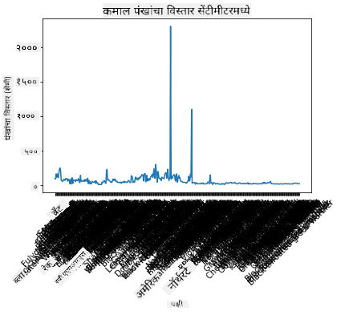
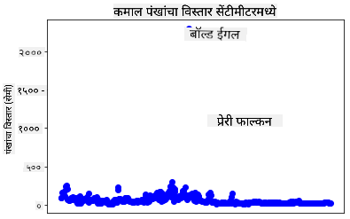
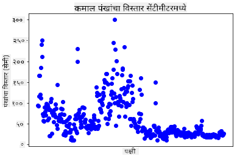
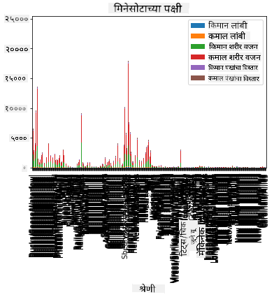
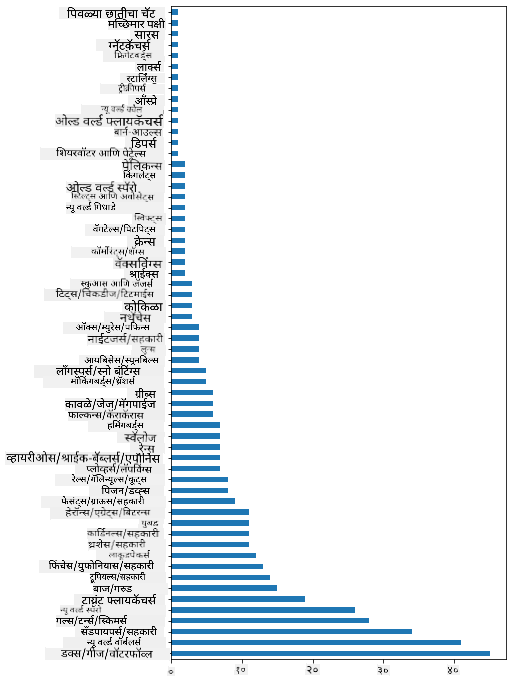
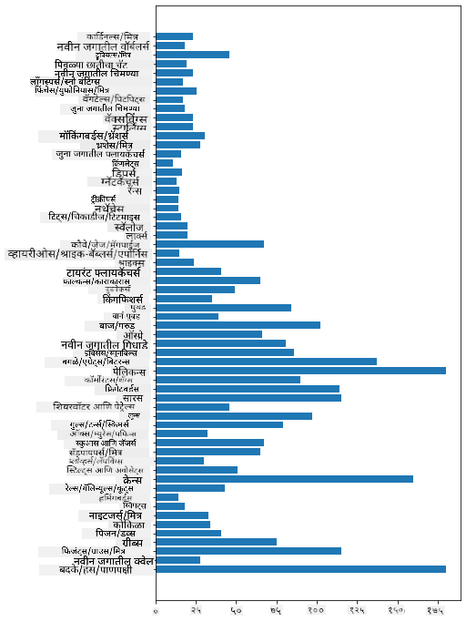
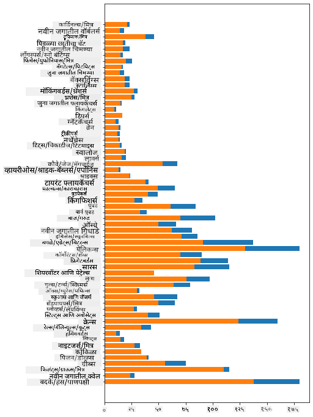

<!--
CO_OP_TRANSLATOR_METADATA:
{
  "original_hash": "69b32b6789a91f796ebc7a02f5575e03",
  "translation_date": "2025-09-04T16:48:51+00:00",
  "source_file": "3-Data-Visualization/09-visualization-quantities/README.md",
  "language_code": "mr"
}
-->
# प्रमाणांचे दृश्यांकन

| ](../../sketchnotes/09-Visualizing-Quantities.png)|
|:---:|
| प्रमाणांचे दृश्यांकन - _Sketchnote by [@nitya](https://twitter.com/nitya)_ |

या धड्यात तुम्ही प्रमाणाच्या संकल्पनेभोवती आकर्षक दृश्यांकन तयार करण्यासाठी उपलब्ध असलेल्या अनेक Python लायब्ररींपैकी एकाचा वापर कसा करायचा हे शिकाल. मिनेसोटामधील पक्ष्यांबद्दलच्या स्वच्छ डेटासेटचा वापर करून तुम्ही स्थानिक वन्यजीवांबद्दल अनेक मनोरंजक तथ्ये शिकू शकता.  
## [पूर्व-व्याख्यान प्रश्नमंजूषा](https://purple-hill-04aebfb03.1.azurestaticapps.net/quiz/16)

## Matplotlib वापरून पंखांचा विस्तार निरीक्षण करा

[Matplotlib](https://matplotlib.org/stable/index.html) ही एक उत्कृष्ट लायब्ररी आहे जी विविध प्रकारचे साधे आणि प्रगत प्लॉट्स आणि चार्ट्स तयार करण्यासाठी वापरली जाते. सामान्यतः, या लायब्ररींचा वापर करून डेटा प्लॉट करण्याची प्रक्रिया तुमच्या डेटा फ्रेममधील लक्ष्यित भाग ओळखणे, आवश्यक असल्यास त्या डेटावर कोणतेही रूपांतरण करणे, त्याचे x आणि y अक्ष मूल्ये नियुक्त करणे, कोणत्या प्रकारचा प्लॉट दाखवायचा ते ठरवणे आणि नंतर प्लॉट दाखवणे यांचा समावेश असतो. Matplotlib विविध प्रकारचे दृश्यांकन देते, परंतु या धड्यासाठी, प्रमाणाचे दृश्यांकन करण्यासाठी सर्वात योग्य असलेल्या प्रकारांवर लक्ष केंद्रित करूया: लाइन चार्ट्स, स्कॅटरप्लॉट्स आणि बार प्लॉट्स.

> ✅ तुमच्या डेटाच्या संरचनेसाठी आणि तुम्हाला सांगायची असलेल्या गोष्टीसाठी सर्वोत्तम चार्ट वापरा.  
> - वेळेनुसार ट्रेंड विश्लेषणासाठी: लाइन  
> - मूल्यांची तुलना करण्यासाठी: बार, कॉलम, पाई, स्कॅटरप्लॉट  
> - भाग संपूर्णाशी कसे संबंधित आहेत हे दाखवण्यासाठी: पाई  
> - डेटाचा वितरण दाखवण्यासाठी: स्कॅटरप्लॉट, बार  
> - ट्रेंड दाखवण्यासाठी: लाइन, कॉलम  
> - मूल्यांमधील संबंध दाखवण्यासाठी: लाइन, स्कॅटरप्लॉट, बबल  

जर तुमच्याकडे डेटासेट असेल आणि एखाद्या आयटमचे किती प्रमाण आहे हे शोधायचे असेल, तर तुमच्याकडे असलेले पहिले काम त्याच्या मूल्यांचे निरीक्षण करणे असेल.  

✅ Matplotlib साठी उत्कृष्ट 'चीट शीट्स' [इथे](https://matplotlib.org/cheatsheets/cheatsheets.pdf) उपलब्ध आहेत.

## पक्ष्यांच्या पंखांच्या विस्ताराच्या मूल्यांवर आधारित लाइन प्लॉट तयार करा

या धड्याच्या फोल्डरच्या मूळ भागातील `notebook.ipynb` फाइल उघडा आणि एक सेल जोडा.

> लक्षात ठेवा: डेटा या रिपॉजिटरीच्या मूळ भागात `/data` फोल्डरमध्ये संग्रहित आहे.

```python
import pandas as pd
import matplotlib.pyplot as plt
birds = pd.read_csv('../../data/birds.csv')
birds.head()
```  
हा डेटा मजकूर आणि संख्यांचा मिश्रण आहे:

|      | नाव                          | वैज्ञानिक नाव          | वर्ग                  | ऑर्डर       | कुटुंब   | वंश        | संवर्धन स्थिती       | किमान लांबी | कमाल लांबी | किमान शरीर वजन | कमाल शरीर वजन | किमान पंख विस्तार | कमाल पंख विस्तार |
| ---: | :--------------------------- | :--------------------- | :-------------------- | :----------- | :------- | :---------- | :----------------- | --------: | --------: | ----------: | ----------: | ----------: | ----------: |
|    0 | ब्लॅक-बेलिड व्हिसलिंग-डक     | Dendrocygna autumnalis | बदके/हंस/पाणपक्षी     | Anseriformes | Anatidae | Dendrocygna | LC                 |        47 |        56 |         652 |        1020 |          76 |          94 |
|    1 | फुल्व्हस व्हिसलिंग-डक        | Dendrocygna bicolor    | बदके/हंस/पाणपक्षी     | Anseriformes | Anatidae | Dendrocygna | LC                 |        45 |        53 |         712 |        1050 |          85 |          93 |
|    2 | स्नो गूज                     | Anser caerulescens     | बदके/हंस/पाणपक्षी     | Anseriformes | Anatidae | Anser       | LC                 |        64 |        79 |        2050 |        4050 |         135 |         165 |
|    3 | रॉसचा गूज                    | Anser rossii           | बदके/हंस/पाणपक्षी     | Anseriformes | Anatidae | Anser       | LC                 |      57.3 |        64 |        1066 |        1567 |         113 |         116 |
|    4 | ग्रेटर व्हाइट-फ्रंटेड गूज    | Anser albifrons        | बदके/हंस/पाणपक्षी     | Anseriformes | Anatidae | Anser       | LC                 |        64 |        81 |        1930 |        3310 |         130 |         165 |

आता या आकर्षक पक्ष्यांसाठी कमाल पंख विस्ताराचे दृश्य तयार करण्यासाठी काही संख्यात्मक डेटा प्लॉट करूया.

```python
wingspan = birds['MaxWingspan'] 
wingspan.plot()
```  


तुम्हाला लगेच काय लक्षात येते? किमान एक अपवाद दिसतो - हा पंख विस्तार खूपच मोठा आहे! 2300 सेंटीमीटर पंख विस्तार म्हणजे 23 मीटर - मिनेसोटामध्ये पॅटरोडॅक्टाइल्स फिरत आहेत का? चला तपास करूया.

तुम्ही Excel मध्ये जलद क्रमवारी लावून हे अपवाद शोधू शकता, जे कदाचित टायपो असतील, परंतु प्लॉटमधूनच दृश्यांकन प्रक्रिया सुरू ठेवा.

x-अक्षावर लेबल्स जोडून कोणत्या प्रकारचे पक्षी आहेत ते दाखवा:

```
plt.title('Max Wingspan in Centimeters')
plt.ylabel('Wingspan (CM)')
plt.xlabel('Birds')
plt.xticks(rotation=45)
x = birds['Name'] 
y = birds['MaxWingspan']

plt.plot(x, y)

plt.show()
```  


लेबल्स 45 अंशांवर फिरवले असले तरी वाचण्यासाठी खूप जास्त आहेत. वेगळ्या रणनीतीचा प्रयत्न करूया: फक्त अपवादांना लेबल करा आणि चार्टमध्ये लेबल्स सेट करा. लेबलिंगसाठी अधिक जागा तयार करण्यासाठी तुम्ही स्कॅटर चार्ट वापरू शकता:

```python
plt.title('Max Wingspan in Centimeters')
plt.ylabel('Wingspan (CM)')
plt.tick_params(axis='both',which='both',labelbottom=False,bottom=False)

for i in range(len(birds)):
    x = birds['Name'][i]
    y = birds['MaxWingspan'][i]
    plt.plot(x, y, 'bo')
    if birds['MaxWingspan'][i] > 500:
        plt.text(x, y * (1 - 0.05), birds['Name'][i], fontsize=12)
    
plt.show()
```  
इथे काय चालले आहे? तुम्ही `tick_params` वापरून तळाशी असलेली लेबल्स लपवली आणि नंतर तुमच्या पक्ष्यांच्या डेटासेटवर लूप तयार केला. `bo` वापरून लहान गोल निळ्या ठिपक्यांसह चार्ट प्लॉट करताना, तुम्ही 500 पेक्षा जास्त कमाल पंख विस्तार असलेल्या कोणत्याही पक्ष्याची तपासणी केली आणि जर तसे असेल तर ठिपक्याजवळ त्यांचे लेबल दाखवले. तुम्ही y अक्षावर लेबल्स थोडेसे ऑफसेट केले (`y * (1 - 0.05)`) आणि पक्ष्याचे नाव लेबल म्हणून वापरले.

तुम्ही काय शोधले?

  
## तुमचा डेटा फिल्टर करा

बॉल्ड ईगल आणि प्रेरी फाल्कन, कदाचित खूप मोठे पक्षी असले तरी, त्यांच्या कमाल पंख विस्तारासह चुकीचे लेबल लावलेले दिसतात, ज्यामध्ये अतिरिक्त `0` जोडले गेले आहे. 25 मीटर पंख विस्तार असलेला बॉल्ड ईगल भेटेल असे वाटत नाही, परंतु जर तसे झाले तर कृपया आम्हाला कळवा! चला या दोन अपवादांशिवाय नवीन डेटा फ्रेम तयार करूया:

```python
plt.title('Max Wingspan in Centimeters')
plt.ylabel('Wingspan (CM)')
plt.xlabel('Birds')
plt.tick_params(axis='both',which='both',labelbottom=False,bottom=False)
for i in range(len(birds)):
    x = birds['Name'][i]
    y = birds['MaxWingspan'][i]
    if birds['Name'][i] not in ['Bald eagle', 'Prairie falcon']:
        plt.plot(x, y, 'bo')
plt.show()
```  

अपवाद फिल्टर करून, तुमचा डेटा आता अधिक सुसंगत आणि समजण्यास सोपा झाला आहे.



आता आपल्याकडे पंख विस्ताराच्या बाबतीत स्वच्छ डेटासेट आहे, चला या पक्ष्यांबद्दल अधिक शोधूया.

लाइन आणि स्कॅटर प्लॉट्स डेटा मूल्ये आणि त्यांच्या वितरणाबद्दल माहिती दाखवू शकतात, परंतु आपण या डेटासेटमध्ये अंतर्भूत असलेल्या मूल्यांबद्दल विचार करू इच्छितो. तुम्ही प्रमाणाबद्दल खालील प्रश्नांची उत्तरे देण्यासाठी दृश्यांकन तयार करू शकता:

> पक्ष्यांचे किती वर्ग आहेत आणि त्यांची संख्या किती आहे?  
> पक्ष्यांपैकी किती नामशेष, संकटग्रस्त, दुर्मिळ किंवा सामान्य आहेत?  
> लिनीयसच्या संज्ञेत विविध वंश आणि ऑर्डर किती आहेत?  
## बार चार्ट्स एक्सप्लोर करा

जेव्हा तुम्हाला डेटा गट दाखवायचा असेल तेव्हा बार चार्ट्स व्यावहारिक असतात. या डेटासेटमध्ये असलेल्या पक्ष्यांच्या वर्गांचे अन्वेषण करूया आणि संख्या किती आहे ते पाहूया.

नोटबुक फाइलमध्ये एक मूलभूत बार चार्ट तयार करा.

✅ लक्षात ठेवा, तुम्ही मागील विभागात ओळखलेल्या दोन अपवाद पक्ष्यांना फिल्टर करू शकता, त्यांच्या पंख विस्तारातील टायपो संपादित करू शकता किंवा विंगस्पॅन मूल्यांवर अवलंबून नसलेल्या या व्यायामांसाठी त्यांना तसेच ठेवू शकता.

जर तुम्हाला बार चार्ट तयार करायचा असेल, तर तुम्ही लक्ष केंद्रित करायचा डेटा निवडू शकता. बार चार्ट्स कच्च्या डेटावरून तयार केले जाऊ शकतात:

```python
birds.plot(x='Category',
        kind='bar',
        stacked=True,
        title='Birds of Minnesota')

```  


तथापि, हा बार चार्ट वाचण्यायोग्य नाही कारण खूप जास्त न गटबद्ध डेटा आहे. तुम्हाला प्लॉट करायचा डेटा निवडावा लागेल, म्हणून पक्ष्यांच्या वर्गाच्या आधारावर पक्ष्यांच्या लांबीकडे पाहूया.

तुमचा डेटा फक्त पक्ष्यांच्या वर्गाचा समावेश करण्यासाठी फिल्टर करा.

✅ लक्षात ठेवा की तुम्ही Pandas वापरून डेटा व्यवस्थापित करता आणि नंतर Matplotlib चार्टिंग करते.

कारण अनेक वर्ग आहेत, तुम्ही हा चार्ट उभा दाखवू शकता आणि सर्व डेटासाठी त्याची उंची समायोजित करू शकता:

```python
category_count = birds.value_counts(birds['Category'].values, sort=True)
plt.rcParams['figure.figsize'] = [6, 12]
category_count.plot.barh()
```  


हा बार चार्ट प्रत्येक वर्गातील पक्ष्यांची संख्या चांगल्या प्रकारे दाखवतो. एका झटक्यात तुम्हाला दिसते की या प्रदेशातील सर्वात जास्त पक्षी बदके/हंस/पाणपक्षी वर्गात आहेत. मिनेसोटा '10,000 तलावांचे प्रदेश' आहे त्यामुळे हे आश्चर्यकारक नाही!

✅ या डेटासेटवर काही इतर गणना करून पहा. तुम्हाला काही आश्चर्य वाटते का?

## डेटा तुलना

तुम्ही नवीन अक्ष तयार करून गटबद्ध डेटाची वेगवेगळी तुलना करू शकता. पक्ष्याच्या वर्गाच्या आधारावर पक्ष्याच्या कमाल लांबीची तुलना करून पहा:

```python
maxlength = birds['MaxLength']
plt.barh(y=birds['Category'], width=maxlength)
plt.rcParams['figure.figsize'] = [6, 12]
plt.show()
```  


इथे काहीही आश्चर्यकारक नाही: हंबिंगबर्ड्सची कमाल लांबी पेलिकन्स किंवा गीजच्या तुलनेत सर्वात कमी आहे. जेव्हा डेटा तार्किक अर्थ देतो ते चांगले आहे!

तुम्ही बार चार्ट्सचे अधिक मनोरंजक दृश्य तयार करू शकता जेव्हा डेटा सुपरइम्पोज केला जातो. चला दिलेल्या पक्ष्याच्या वर्गावर किमान आणि कमाल लांबी सुपरइम्पोज करूया:

```python
minLength = birds['MinLength']
maxLength = birds['MaxLength']
category = birds['Category']

plt.barh(category, maxLength)
plt.barh(category, minLength)

plt.show()
```  
या प्लॉटमध्ये, तुम्ही किमान लांबी आणि कमाल लांबीच्या श्रेणी प्रति पक्षी वर्ग पाहू शकता. तुम्ही सुरक्षितपणे म्हणू शकता की, दिलेल्या डेटानुसार, पक्षी जितका मोठा असेल तितकी त्याची लांबी श्रेणी मोठी असेल. आकर्षक!



## 🚀 आव्हान

हा पक्षी डेटासेट विशिष्ट परिसंस्थेमधील विविध प्रकारच्या पक्ष्यांबद्दल भरपूर माहिती देतो. इंटरनेटवर शोधा आणि पक्ष्यांशी संबंधित इतर डेटासेट शोधा. या पक्ष्यांभोवती चार्ट्स आणि ग्राफ्स तयार करण्याचा सराव करा आणि तुम्हाला माहित नसलेल्या तथ्यांचा शोध घ्या.

## [व्याख्यानानंतरची प्रश्नमंजूषा](https://ff-quizzes.netlify.app/en/ds/)

## पुनरावलोकन आणि स्व-अभ्यास

या पहिल्या धड्याने तुम्हाला प्रमाणांचे दृश्यांकन करण्यासाठी Matplotlib कसे वापरायचे याबद्दल काही माहिती दिली आहे. दृश्यांकनासाठी डेटासेटसह काम करण्याच्या इतर मार्गांबद्दल संशोधन करा. [Plotly](https://github.com/plotly/plotly.py) ही एक लायब्ररी आहे जी या धड्यांमध्ये कव्हर केली जाणार नाही, त्यामुळे ती काय ऑफर करू शकते ते पाहा.  
## असाइनमेंट

[लाइन, स्कॅटर्स आणि बार्स](assignment.md)  

---

**अस्वीकरण**:  
हा दस्तऐवज AI भाषांतर सेवा [Co-op Translator](https://github.com/Azure/co-op-translator) वापरून भाषांतरित करण्यात आला आहे. आम्ही अचूकतेसाठी प्रयत्नशील असलो तरी, कृपया लक्षात ठेवा की स्वयंचलित भाषांतरांमध्ये त्रुटी किंवा अचूकतेचा अभाव असू शकतो. मूळ भाषेतील दस्तऐवज हा अधिकृत स्रोत मानला जावा. महत्त्वाच्या माहितीसाठी व्यावसायिक मानवी भाषांतराची शिफारस केली जाते. या भाषांतराचा वापर करून उद्भवलेल्या कोणत्याही गैरसमज किंवा चुकीच्या अर्थासाठी आम्ही जबाबदार राहणार नाही.