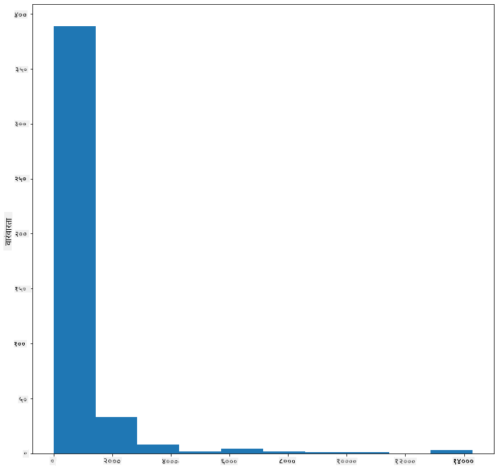
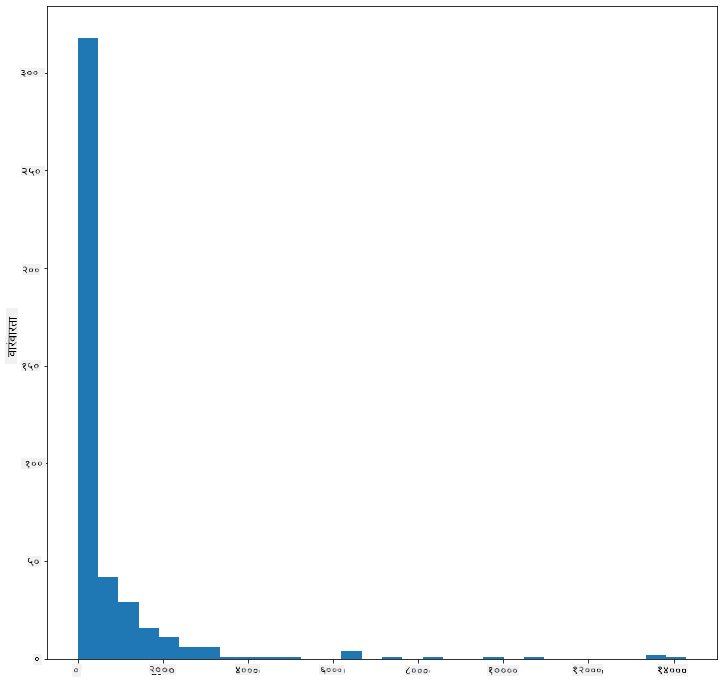
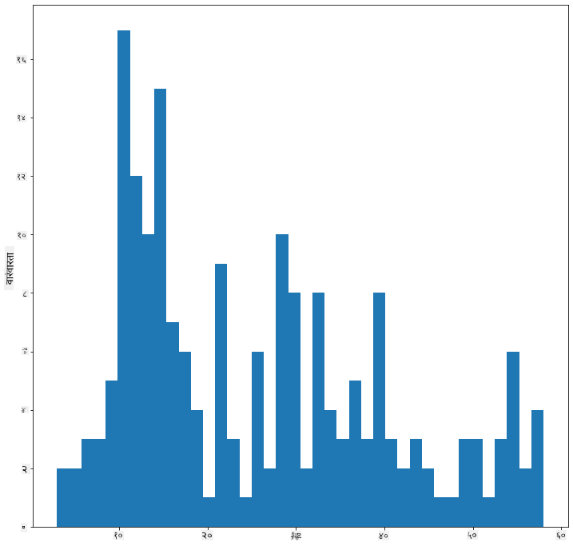
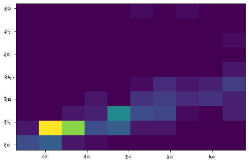
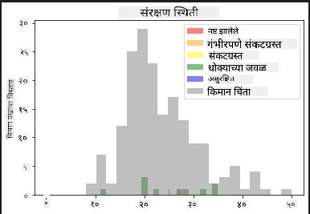
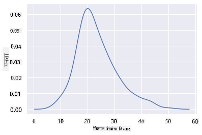
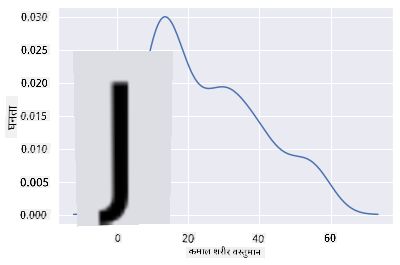
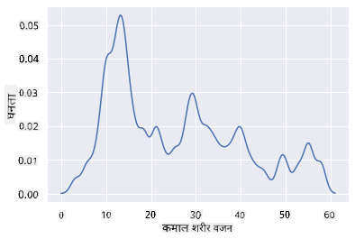
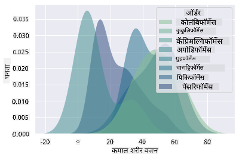
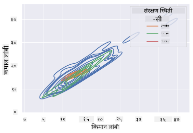

<!--
CO_OP_TRANSLATOR_METADATA:
{
  "original_hash": "87faccac113d772551486a67a607153e",
  "translation_date": "2025-08-27T18:16:29+00:00",
  "source_file": "3-Data-Visualization/10-visualization-distributions/README.md",
  "language_code": "mr"
}
-->
# वितरणांचे दृश्यांकन

| ](../../sketchnotes/10-Visualizing-Distributions.png)|
|:---:|
| वितरणांचे दृश्यांकन - _Sketchnote by [@nitya](https://twitter.com/nitya)_ |

मागील धड्यात, तुम्ही मिनेसोटाच्या पक्ष्यांबद्दलच्या डेटासेटमधील काही मनोरंजक तथ्ये शिकली. तुम्ही बाहेरच्या डेटाचा व्हिज्युअलायझेशन करून काही चुकीची डेटा शोधली आणि पक्ष्यांच्या श्रेणींमधील फरक त्यांच्या जास्तीत जास्त लांबीच्या आधारावर पाहिले.

## [पूर्व-व्याख्यान प्रश्नमंजुषा](https://purple-hill-04aebfb03.1.azurestaticapps.net/quiz/18)
## पक्ष्यांच्या डेटासेटचा अभ्यास करा

डेटामध्ये खोलवर जाण्याचा आणखी एक मार्ग म्हणजे त्याच्या वितरणाकडे पाहणे, म्हणजे डेटा अक्षावर कसा आयोजित केला आहे. उदाहरणार्थ, तुम्हाला मिनेसोटाच्या पक्ष्यांसाठी जास्तीत जास्त पंखांचा विस्तार किंवा जास्तीत जास्त शरीराच्या वजनाचे सामान्य वितरण जाणून घ्यायचे असेल. 

या डेटासेटमधील डेटाच्या वितरणाबद्दल काही तथ्ये शोधूया. या धड्याच्या फोल्डरच्या मूळ भागातील _notebook.ipynb_ फाइलमध्ये Pandas, Matplotlib आणि तुमचा डेटा आयात करा:

```python
import pandas as pd
import matplotlib.pyplot as plt
birds = pd.read_csv('../../data/birds.csv')
birds.head()
```

|      | नाव                          | वैज्ञानिक नाव          | श्रेणी                | ऑर्डर       | कुटुंब   | वंश        | संवर्धन स्थिती       | किमान लांबी | जास्तीत जास्त लांबी | किमान शरीराचे वजन | जास्तीत जास्त शरीराचे वजन | किमान पंखांचा विस्तार | जास्तीत जास्त पंखांचा विस्तार |
| ---: | :--------------------------- | :--------------------- | :-------------------- | :----------- | :------- | :---------- | :----------------- | --------: | --------: | ----------: | ----------: | ----------: | ----------: |
|    0 | ब्लॅक-बेलिड व्हिसलिंग-डक    | Dendrocygna autumnalis | बदके/हंस/जलपक्षी      | Anseriformes | Anatidae | Dendrocygna | LC                 |        47 |        56 |         652 |        1020 |          76 |          94 |
|    1 | फुल्व्हस व्हिसलिंग-डक        | Dendrocygna bicolor    | बदके/हंस/जलपक्षी      | Anseriformes | Anatidae | Dendrocygna | LC                 |        45 |        53 |         712 |        1050 |          85 |          93 |
|    2 | स्नो गूज                     | Anser caerulescens     | बदके/हंस/जलपक्षी      | Anseriformes | Anatidae | Anser       | LC                 |        64 |        79 |        2050 |        4050 |         135 |         165 |
|    3 | रॉसचा गूज                    | Anser rossii           | बदके/हंस/जलपक्षी      | Anseriformes | Anatidae | Anser       | LC                 |      57.3 |        64 |        1066 |        1567 |         113 |         116 |
|    4 | ग्रेटर व्हाइट-फ्रंटेड गूज    | Anser albifrons        | बदके/हंस/जलपक्षी      | Anseriformes | Anatidae | Anser       | LC                 |        64 |        81 |        1930 |        3310 |         130 |         165 |

सामान्यतः, तुम्ही स्कॅटर प्लॉट वापरून डेटा कसा वितरित केला आहे हे पटकन पाहू शकता, जसे आपण मागील धड्यात केले:

```python
birds.plot(kind='scatter',x='MaxLength',y='Order',figsize=(12,8))

plt.title('Max Length per Order')
plt.ylabel('Order')
plt.xlabel('Max Length')

plt.show()
```


हे पक्ष्यांच्या ऑर्डरनुसार शरीराच्या लांबीचे सामान्य वितरणाचे विहंगावलोकन देते, परंतु खऱ्या वितरणाचे प्रदर्शन करण्याचा हा सर्वोत्तम मार्ग नाही. ही जबाबदारी सहसा हिस्टोग्राम तयार करून हाताळली जाते.

## हिस्टोग्रामसह काम करणे

Matplotlib चांगल्या प्रकारे हिस्टोग्राम वापरून डेटा वितरणाचे दृश्यांकन करण्याचे मार्ग प्रदान करते. या प्रकारचा चार्ट बार चार्टसारखा असतो जिथे बारच्या चढ-उतारांद्वारे वितरण पाहिले जाऊ शकते. हिस्टोग्राम तयार करण्यासाठी, तुम्हाला संख्यात्मक डेटा आवश्यक आहे. हिस्टोग्राम तयार करण्यासाठी, तुम्ही 'hist' प्रकार परिभाषित करून चार्ट प्लॉट करू शकता. हा चार्ट संपूर्ण डेटासेटच्या संख्यात्मक डेटाच्या श्रेणीसाठी MaxBodyMass वितरण दर्शवतो. डेटा दिलेल्या अ‍ॅरेला लहान बिन्समध्ये विभागून, तो डेटाच्या मूल्यांचे वितरण प्रदर्शित करू शकतो:

```python
birds['MaxBodyMass'].plot(kind = 'hist', bins = 10, figsize = (12,12))
plt.show()
```


जसे तुम्ही पाहू शकता, या डेटासेटमधील 400+ पक्ष्यांपैकी बहुतेक पक्ष्यांचे जास्तीत जास्त शरीराचे वजन 2000 च्या खाली आहे. `bins` पॅरामीटर उच्च संख्येसाठी बदलून डेटाबद्दल अधिक अंतर्दृष्टी मिळवा, जसे की 30:

```python
birds['MaxBodyMass'].plot(kind = 'hist', bins = 30, figsize = (12,12))
plt.show()
```


हा चार्ट वितरण थोडा अधिक तपशीलवार पद्धतीने दर्शवतो. डावीकडे कमी झुकलेला चार्ट तयार केला जाऊ शकतो जर तुम्ही दिलेल्या श्रेणीतील डेटा निवडण्याची खात्री केली:

तुमचा डेटा फिल्टर करा ज्यामध्ये फक्त अशा पक्ष्यांचा समावेश आहे ज्यांचे शरीराचे वजन 60 च्या खाली आहे आणि 40 `bins` दर्शवा:

```python
filteredBirds = birds[(birds['MaxBodyMass'] > 1) & (birds['MaxBodyMass'] < 60)]      
filteredBirds['MaxBodyMass'].plot(kind = 'hist',bins = 40,figsize = (12,12))
plt.show()     
```


✅ काही इतर फिल्टर आणि डेटा पॉइंट्स वापरून पहा. डेटाचे पूर्ण वितरण पाहण्यासाठी, `['MaxBodyMass']` फिल्टर काढा आणि लेबल केलेले वितरण दर्शवा.

हिस्टोग्राममध्ये काही छान रंग आणि लेबलिंग सुधारणा देखील आहेत:

दोन वितरणांमधील संबंधांची तुलना करण्यासाठी 2D हिस्टोग्राम तयार करा. `MaxBodyMass` आणि `MaxLength` ची तुलना करूया. Matplotlib उजळ रंग वापरून अभिसरण दर्शविण्याचा अंगभूत मार्ग प्रदान करते:

```python
x = filteredBirds['MaxBodyMass']
y = filteredBirds['MaxLength']

fig, ax = plt.subplots(tight_layout=True)
hist = ax.hist2d(x, y)
```
या दोन घटकांमध्ये अपेक्षित अक्षावर अपेक्षित संबंध असल्याचे दिसते, एका ठिकाणी विशेषतः मजबूत अभिसरण बिंदू आहे:



हिस्टोग्राम संख्यात्मक डेटासाठी चांगले कार्य करतात. जर तुम्हाला मजकूर डेटानुसार वितरण पाहायचे असेल तर काय?

## मजकूर डेटाचा वापर करून डेटासेटसाठी वितरणाचा अभ्यास करा

या डेटासेटमध्ये पक्ष्यांची श्रेणी, वंश, प्रजाती, कुटुंब तसेच त्यांची संवर्धन स्थिती याबद्दलची चांगली माहिती समाविष्ट आहे. या संवर्धन माहितीत खोलवर जाऊया. पक्ष्यांचे संवर्धन स्थितीनुसार वितरण काय आहे?

> ✅ डेटासेटमध्ये संवर्धन स्थितीचे वर्णन करण्यासाठी अनेक संक्षेप वापरले जातात. हे संक्षेप [IUCN रेड लिस्ट श्रेणी](https://www.iucnredlist.org/) मधून आले आहेत, एक संस्था जी प्रजातींच्या स्थितीचे वर्गीकरण करते.
> 
> - CR: गंभीरपणे संकटग्रस्त
> - EN: संकटग्रस्त
> - EX: नामशेष
> - LC: कमी चिंता
> - NT: जवळजवळ संकटग्रस्त
> - VU: असुरक्षित

हे मजकूर-आधारित मूल्ये आहेत त्यामुळे तुम्हाला हिस्टोग्राम तयार करण्यासाठी ट्रान्सफॉर्म करावे लागेल. फिल्टर केलेल्या पक्ष्यांच्या डेटाफ्रेमचा वापर करून त्याची संवर्धन स्थिती आणि त्याचा किमान पंखांचा विस्तार दर्शवा. तुम्हाला काय दिसते?

```python
x1 = filteredBirds.loc[filteredBirds.ConservationStatus=='EX', 'MinWingspan']
x2 = filteredBirds.loc[filteredBirds.ConservationStatus=='CR', 'MinWingspan']
x3 = filteredBirds.loc[filteredBirds.ConservationStatus=='EN', 'MinWingspan']
x4 = filteredBirds.loc[filteredBirds.ConservationStatus=='NT', 'MinWingspan']
x5 = filteredBirds.loc[filteredBirds.ConservationStatus=='VU', 'MinWingspan']
x6 = filteredBirds.loc[filteredBirds.ConservationStatus=='LC', 'MinWingspan']

kwargs = dict(alpha=0.5, bins=20)

plt.hist(x1, **kwargs, color='red', label='Extinct')
plt.hist(x2, **kwargs, color='orange', label='Critically Endangered')
plt.hist(x3, **kwargs, color='yellow', label='Endangered')
plt.hist(x4, **kwargs, color='green', label='Near Threatened')
plt.hist(x5, **kwargs, color='blue', label='Vulnerable')
plt.hist(x6, **kwargs, color='gray', label='Least Concern')

plt.gca().set(title='Conservation Status', ylabel='Min Wingspan')
plt.legend();
```



किमान पंखांचा विस्तार आणि संवर्धन स्थिती यामध्ये चांगला संबंध दिसत नाही. या पद्धतीचा वापर करून डेटासेटमधील इतर घटकांची चाचणी करा. तुम्ही वेगवेगळे फिल्टर देखील वापरू शकता. तुम्हाला काही संबंध सापडतो का?

## घनता प्लॉट्स

तुम्ही लक्षात घेतले असेल की आतापर्यंत आपण पाहिलेले हिस्टोग्राम 'स्टेप्ड' आहेत आणि गुळगुळीत वक्रात प्रवाहित होत नाहीत. गुळगुळीत घनता चार्ट दर्शविण्यासाठी, तुम्ही घनता प्लॉट वापरून पाहू शकता.

घनता प्लॉट्ससह काम करण्यासाठी, नवीन प्लॉटिंग लायब्ररीशी परिचित व्हा, [Seaborn](https://seaborn.pydata.org/generated/seaborn.kdeplot.html).

Seaborn लोड करून, एक मूलभूत घनता प्लॉट वापरून पहा:

```python
import seaborn as sns
import matplotlib.pyplot as plt
sns.kdeplot(filteredBirds['MinWingspan'])
plt.show()
```


तुम्ही पाहू शकता की हा प्लॉट किमान पंखांचा विस्तार डेटासाठी मागील प्लॉटसारखा आहे; तो फक्त थोडा गुळगुळीत आहे. Seaborn च्या दस्तऐवजानुसार, "हिस्टोग्रामच्या तुलनेत, KDE एक प्लॉट तयार करू शकतो जो कमी गोंधळलेला आणि अधिक समजण्यासारखा असतो, विशेषतः एकाधिक वितरण काढताना. परंतु जर अंतर्निहित वितरण बाउंडेड किंवा गुळगुळीत नसेल तर विकृती आणण्याची क्षमता असते. हिस्टोग्रामसारखे, प्रतिनिधित्वाची गुणवत्ता चांगल्या गुळगुळीत पॅरामीटर्सच्या निवडीवर देखील अवलंबून असते." [स्रोत](https://seaborn.pydata.org/generated/seaborn.kdeplot.html) म्हणजेच, नेहमीप्रमाणे बाहेरच्या डेटामुळे तुमचे चार्ट चुकीचे वागतील.

जर तुम्हाला दुसऱ्या चार्टमध्ये तयार केलेल्या जास्तीत जास्त शरीराच्या वजनाच्या खडबडीत रेषेला पुन्हा पाहायचे असेल, तर तुम्ही ही पद्धत वापरून ती खूप चांगली गुळगुळीत करू शकता:

```python
sns.kdeplot(filteredBirds['MaxBodyMass'])
plt.show()
```


जर तुम्हाला गुळगुळीत, पण खूप गुळगुळीत रेषा नको असेल, तर `bw_adjust` पॅरामीटर संपादित करा:

```python
sns.kdeplot(filteredBirds['MaxBodyMass'], bw_adjust=.2)
plt.show()
```


✅ या प्रकारच्या प्लॉटसाठी उपलब्ध असलेल्या पॅरामीटर्सबद्दल वाचा आणि प्रयोग करा!

या प्रकारचा चार्ट सुंदर स्पष्टीकरणात्मक दृश्ये प्रदान करतो. उदाहरणार्थ, काही कोडच्या ओळींसह, तुम्ही पक्ष्यांच्या ऑर्डरनुसार जास्तीत जास्त शरीराचे वजन घनता दर्शवू शकता:

```python
sns.kdeplot(
   data=filteredBirds, x="MaxBodyMass", hue="Order",
   fill=True, common_norm=False, palette="crest",
   alpha=.5, linewidth=0,
)
```



तुम्ही एका चार्टमध्ये अनेक व्हेरिएबल्सची घनता देखील मॅप करू शकता. पक्ष्याची जास्तीत जास्त लांबी आणि किमान लांबी त्यांच्या संवर्धन स्थितीशी तुलना करा:

```python
sns.kdeplot(data=filteredBirds, x="MinLength", y="MaxLength", hue="ConservationStatus")
```



कदाचित 'असुरक्षित' पक्ष्यांच्या लांबींनुसार क्लस्टर अर्थपूर्ण आहे की नाही हे संशोधन करण्यासारखे आहे.

## 🚀 आव्हान

हिस्टोग्राम हे मूलभूत स्कॅटरप्लॉट्स, बार चार्ट्स किंवा लाइन चार्ट्सपेक्षा अधिक प्रगत प्रकारचे चार्ट आहेत. इंटरनेटवर शोधा आणि हिस्टोग्रामच्या चांगल्या उदाहरणांचा शोध घ्या. ते कसे वापरले जातात, ते काय दर्शवतात आणि कोणत्या क्षेत्रांमध्ये किंवा चौकशीच्या क्षेत्रांमध्ये त्यांचा वापर केला जातो?

## [व्याख्यानानंतर प्रश्नमंजुषा](https://purple-hill-04aebfb03.1.azurestaticapps.net/quiz/19)

## पुनरावलोकन आणि स्व-अभ्यास

या धड्यात, तुम्ही Matplotlib वापरले आणि अधिक प्रगत चार्ट्स दर्शवण्यासाठी Seaborn वापरण्यास सुरुवात केली. Seaborn मधील `kdeplot` वर संशोधन करा, एक "एक किंवा अधिक परिमाणांमध्ये सतत संभाव्यता घनता वक्र". [दस्तऐवज](https://seaborn.pydata.org/generated/seaborn.kdeplot.html) वाचा आणि ते कसे कार्य करते ते समजून घ्या.

## असाइनमेंट

[तुमचे कौशल्य लागू करा](assignment.md)

---

**अस्वीकरण**:  
हा दस्तऐवज AI भाषांतर सेवा [Co-op Translator](https://github.com/Azure/co-op-translator) वापरून भाषांतरित करण्यात आला आहे. आम्ही अचूकतेसाठी प्रयत्नशील असलो तरी कृपया लक्षात ठेवा की स्वयंचलित भाषांतरांमध्ये त्रुटी किंवा अचूकतेचा अभाव असू शकतो. मूळ भाषेतील दस्तऐवज हा अधिकृत स्रोत मानला जावा. महत्त्वाच्या माहितीसाठी व्यावसायिक मानवी भाषांतराची शिफारस केली जाते. या भाषांतराचा वापर करून उद्भवलेल्या कोणत्याही गैरसमज किंवा चुकीच्या अर्थासाठी आम्ही जबाबदार राहणार नाही.