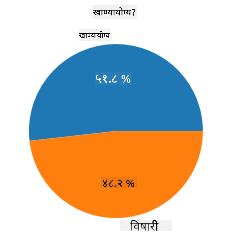
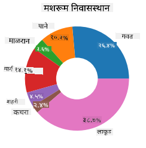
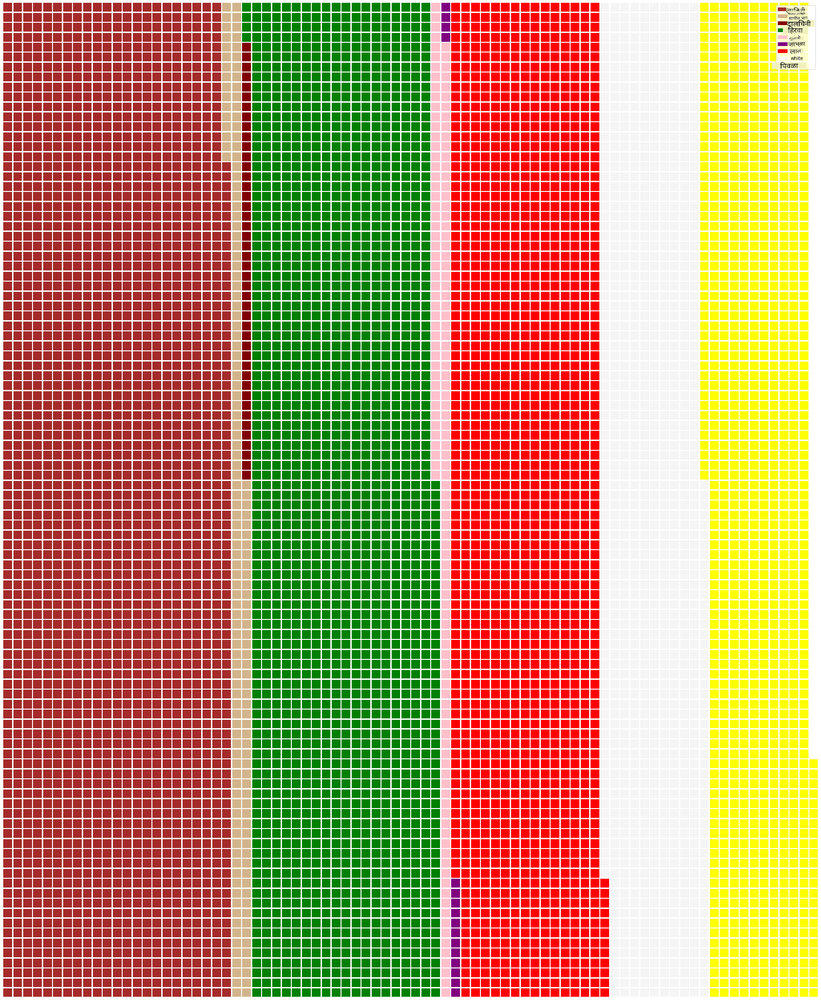

<!--
CO_OP_TRANSLATOR_METADATA:
{
  "original_hash": "cc490897ee2d276870472bcb31602d03",
  "translation_date": "2025-09-04T16:48:10+00:00",
  "source_file": "3-Data-Visualization/11-visualization-proportions/README.md",
  "language_code": "mr"
}
-->
# प्रमाणांचे दृश्यांकन

| यांचे स्केच नोट ](../../sketchnotes/11-Visualizing-Proportions.png)|
|:---:|
|प्रमाणांचे दृश्यांकन - _[@nitya](https://twitter.com/nitya) यांचे स्केच नोट_ |

या धड्यात, तुम्ही निसर्गाशी संबंधित वेगळ्या डेटासेटचा वापर करून प्रमाणांचे दृश्यांकन कराल, जसे की मशरूम्सबद्दलच्या डेटासेटमध्ये वेगवेगळ्या प्रकारच्या बुरशींची संख्या. चला, या अद्भुत बुरशींचा अभ्यास करूया, ज्यासाठी ऑडुबॉनकडून 23 प्रकारच्या गिल्ड मशरूम्सच्या Agaricus आणि Lepiota कुटुंबातील तपशीलांचा डेटासेट वापरला आहे. तुम्ही खालील प्रकारच्या स्वादिष्ट दृश्यांकनांचा प्रयोग कराल:

- पाई चार्ट्स 🥧  
- डोनट चार्ट्स 🍩  
- वाफल चार्ट्स 🧇  

> 💡 मायक्रोसॉफ्ट रिसर्चने तयार केलेल्या [Charticulator](https://charticulator.com) नावाच्या एका खूपच रोचक प्रकल्पात डेटा दृश्यांकनासाठी फ्री ड्रॅग आणि ड्रॉप इंटरफेस आहे. त्यांच्या एका ट्युटोरियलमध्ये त्यांनी हा मशरूम डेटासेटही वापरला आहे! त्यामुळे तुम्ही डेटा एक्सप्लोर करू शकता आणि त्याच वेळी लायब्ररी शिकू शकता: [Charticulator ट्युटोरियल](https://charticulator.com/tutorials/tutorial4.html).

## [व्याख्यानानंतरचा क्विझ](https://ff-quizzes.netlify.app/en/ds/)

## तुमच्या मशरूम्सना ओळखा 🍄

मशरूम्स खूपच रोचक असतात. चला, त्यांचा अभ्यास करण्यासाठी एक डेटासेट आयात करूया:

```python
import pandas as pd
import matplotlib.pyplot as plt
mushrooms = pd.read_csv('../../data/mushrooms.csv')
mushrooms.head()
```  
एक टेबल प्रिंट होते ज्यामध्ये विश्लेषणासाठी छान डेटा आहे:

| वर्ग      | कॅप-आकार | कॅप-पृष्ठभाग | कॅप-रंग | जखमा | वास      | गिल-जोडणी | गिल-अंतर | गिल-आकार | गिल-रंग | स्टॉक-आकार | स्टॉक-मूळ | स्टॉक-पृष्ठभाग-रिंगच्या-वर | स्टॉक-पृष्ठभाग-रिंगच्या-खाली | स्टॉक-रंग-रिंगच्या-वर | स्टॉक-रंग-रिंगच्या-खाली | पडदा-प्रकार | पडदा-रंग | रिंग-क्रमांक | रिंग-प्रकार | बीज-छपाई-रंग | लोकसंख्या | निवासस्थान |
| --------- | --------- | ----------- | -------- | ----- | -------- | ---------- | --------- | -------- | --------- | ---------- | --------- | -------------------------- | -------------------------- | ---------------------- | ---------------------- | ----------- | --------- | ------------ | ----------- | ------------- | ---------- | ----------- |
| विषारी    | उंचवटा   | गुळगुळीत    | तपकिरी   | जखमा  | तीव्र     | मुक्त      | जवळचे     | अरुंद     | काळा      | रुंदावलेला | समान      | गुळगुळीत                 | गुळगुळीत                 | पांढरा                | पांढरा                | अंशतः       | पांढरा   | एक          | लटकणारा     | काळा          | विखुरलेला | शहरी        |
| खाद्य      | उंचवटा   | गुळगुळीत    | पिवळा    | जखमा  | बदामाचा   | मुक्त      | जवळचे     | रुंद      | काळा      | रुंदावलेला | काठीसारखा | गुळगुळीत                 | गुळगुळीत                 | पांढरा                | पांढरा                | अंशतः       | पांढरा   | एक          | लटकणारा     | तपकिरी       | विपुल      | गवताळ       |
| खाद्य      | घंटेसारखा | गुळगुळीत    | पांढरा   | जखमा  | बडीशेप   | मुक्त      | जवळचे     | रुंद      | तपकिरी    | रुंदावलेला | काठीसारखा | गुळगुळीत                 | गुळगुळीत                 | पांढरा                | पांढरा                | अंशतः       | पांढरा   | एक          | लटकणारा     | तपकिरी       | विपुल      | कुरण         |
| विषारी    | उंचवटा   | खडबडीत      | पांढरा   | जखमा  | तीव्र     | मुक्त      | जवळचे     | अरुंद     | तपकिरी    | रुंदावलेला | समान      | गुळगुळीत                 | गुळगुळीत                 | पांढरा                | पांढरा                | अंशतः       | पांढरा   | एक          | लटकणारा     | काळा          | विखुरलेला | शहरी        |

तुम्हाला लगेच लक्षात येईल की सर्व डेटा मजकूर स्वरूपात आहे. तुम्हाला हा डेटा चार्टमध्ये वापरण्यासाठी रूपांतरित करावा लागेल. बहुतांश डेटा वस्तू स्वरूपात दर्शविला आहे:

```python
print(mushrooms.select_dtypes(["object"]).columns)
```

आउटपुट आहे:

```output
Index(['class', 'cap-shape', 'cap-surface', 'cap-color', 'bruises', 'odor',
       'gill-attachment', 'gill-spacing', 'gill-size', 'gill-color',
       'stalk-shape', 'stalk-root', 'stalk-surface-above-ring',
       'stalk-surface-below-ring', 'stalk-color-above-ring',
       'stalk-color-below-ring', 'veil-type', 'veil-color', 'ring-number',
       'ring-type', 'spore-print-color', 'population', 'habitat'],
      dtype='object')
```  
हा डेटा घ्या आणि 'class' कॉलमला श्रेणीमध्ये रूपांतरित करा:

```python
cols = mushrooms.select_dtypes(["object"]).columns
mushrooms[cols] = mushrooms[cols].astype('category')
```

```python
edibleclass=mushrooms.groupby(['class']).count()
edibleclass
```

आता, जर तुम्ही मशरूम्सचा डेटा प्रिंट केला, तर तुम्हाला दिसेल की तो विषारी/खाद्य वर्गानुसार श्रेणींमध्ये गटबद्ध केला गेला आहे:

|           | कॅप-आकार | कॅप-पृष्ठभाग | कॅप-रंग | जखमा | वास  | गिल-जोडणी | गिल-अंतर | गिल-आकार | गिल-रंग | स्टॉक-आकार | ... | स्टॉक-पृष्ठभाग-रिंगच्या-खाली | स्टॉक-रंग-रिंगच्या-वर | स्टॉक-रंग-रिंगच्या-खाली | पडदा-प्रकार | पडदा-रंग | रिंग-क्रमांक | रिंग-प्रकार | बीज-छपाई-रंग | लोकसंख्या | निवासस्थान |
| --------- | --------- | ----------- | -------- | ----- | ---- | ---------- | --------- | -------- | --------- | ---------- | --- | -------------------------- | ---------------------- | ---------------------- | ----------- | --------- | ------------ | ----------- | ------------- | ---------- | ----------- |
| वर्ग      |           |             |          |       |      |            |           |          |           |            |     |                          |                      |                      |             |           |              |             |               |            |             |
| खाद्य      | 4208      | 4208        | 4208     | 4208  | 4208 | 4208       | 4208      | 4208     | 4208      | 4208       | ... | 4208                     | 4208                 | 4208                 | 4208        | 4208      | 4208         | 4208        | 4208          | 4208       | 4208        |
| विषारी    | 3916      | 3916        | 3916     | 3916  | 3916 | 3916       | 3916      | 3916     | 3916      | 3916       | ... | 3916                     | 3916                 | 3916                 | 3916        | 3916      | 3916         | 3916        | 3916          | 3916       | 3916        |

जर तुम्ही या टेबलमध्ये दिलेल्या क्रमाने वर्ग श्रेणी लेबल तयार केले, तर तुम्ही पाई चार्ट तयार करू शकता:

## पाई!

```python
labels=['Edible','Poisonous']
plt.pie(edibleclass['population'],labels=labels,autopct='%.1f %%')
plt.title('Edible?')
plt.show()
```  
आणि तयार झाला, पाई चार्ट जो या दोन प्रकारच्या मशरूम्सच्या प्रमाणांचे दृश्यांकन करतो. लेबल्सच्या क्रमाची खात्री करणे खूप महत्त्वाचे आहे, विशेषतः येथे, त्यामुळे लेबल अॅरे तयार करताना क्रम तपासा!



## डोनट्स!

पाई चार्टपेक्षा अधिक आकर्षक दिसणारा चार्ट म्हणजे डोनट चार्ट, जो पाई चार्टमध्ये मध्यभागी एक छिद्र असतो. चला, आपल्या डेटाचा अभ्यास या पद्धतीने करूया.

मशरूम्स ज्या विविध निवासस्थानांमध्ये वाढतात त्याकडे लक्ष द्या:

```python
habitat=mushrooms.groupby(['habitat']).count()
habitat
```  
येथे, तुम्ही तुमचा डेटा निवासस्थानानुसार गटबद्ध करत आहात. सात निवासस्थानं दिली आहेत, त्यामुळे त्यांचा वापर डोनट चार्टसाठी लेबल्स म्हणून करा:

```python
labels=['Grasses','Leaves','Meadows','Paths','Urban','Waste','Wood']

plt.pie(habitat['class'], labels=labels,
        autopct='%1.1f%%', pctdistance=0.85)
  
center_circle = plt.Circle((0, 0), 0.40, fc='white')
fig = plt.gcf()

fig.gca().add_artist(center_circle)
  
plt.title('Mushroom Habitats')
  
plt.show()
```



हा कोड एक चार्ट आणि मध्यवर्ती वर्तुळ तयार करतो, नंतर त्या चार्टमध्ये ते वर्तुळ जोडतो. मध्यवर्ती वर्तुळाची रुंदी बदलण्यासाठी `0.40` चे मूल्य बदलून दुसरे मूल्य द्या.

डोनट चार्ट्समध्ये लेबल्स अधिक वाचनीय करण्यासाठी विविध प्रकारे सुधारणा करता येतात. अधिक माहितीसाठी [डॉक्युमेंटेशन](https://matplotlib.org/stable/gallery/pie_and_polar_charts/pie_and_donut_labels.html?highlight=donut) वाचा.

आता तुम्हाला तुमचा डेटा गटबद्ध करून तो पाई किंवा डोनट स्वरूपात कसा दर्शवायचा हे कळले आहे, तुम्ही इतर प्रकारचे चार्ट्सही एक्सप्लोर करू शकता. वाफल चार्ट वापरून पहा, जो प्रमाणांचे दृश्यांकन करण्याचा वेगळा मार्ग आहे.

## वाफल्स!

'वाफल' प्रकारचा चार्ट प्रमाणांचे दृश्यांकन करण्यासाठी 2D चौकोनांच्या अॅरेचा वापर करतो. या डेटासेटमधील मशरूम कॅप रंगांच्या प्रमाणांचे दृश्यांकन करण्याचा प्रयत्न करा. यासाठी, तुम्हाला [PyWaffle](https://pypi.org/project/pywaffle/) नावाची सहाय्यक लायब्ररी आणि Matplotlib वापरावी लागेल:

```python
pip install pywaffle
```

तुमच्या डेटाचा एक विभाग निवडा आणि गटबद्ध करा:

```python
capcolor=mushrooms.groupby(['cap-color']).count()
capcolor
```

लेबल तयार करून आणि तुमचा डेटा गटबद्ध करून वाफल चार्ट तयार करा:

```python
import pandas as pd
import matplotlib.pyplot as plt
from pywaffle import Waffle
  
data ={'color': ['brown', 'buff', 'cinnamon', 'green', 'pink', 'purple', 'red', 'white', 'yellow'],
    'amount': capcolor['class']
     }
  
df = pd.DataFrame(data)
  
fig = plt.figure(
    FigureClass = Waffle,
    rows = 100,
    values = df.amount,
    labels = list(df.color),
    figsize = (30,30),
    colors=["brown", "tan", "maroon", "green", "pink", "purple", "red", "whitesmoke", "yellow"],
)
```

वाफल चार्ट वापरून, तुम्ही या मशरूम्स डेटासेटमधील कॅप रंगांचे प्रमाण स्पष्टपणे पाहू शकता. आश्चर्यकारकपणे, अनेक हिरव्या कॅप असलेल्या मशरूम्स आहेत!



✅ PyWaffle मध्ये [Font Awesome](https://fontawesome.com/) मधील कोणतेही आयकॉन वापरून चार्ट्समध्ये आयकॉन समाविष्ट करण्याचा पर्याय आहे. चौकोनांऐवजी आयकॉन वापरून आणखी आकर्षक वाफल चार्ट तयार करण्यासाठी काही प्रयोग करा.

या धड्यात, तुम्ही प्रमाणांचे दृश्यांकन करण्याचे तीन मार्ग शिकलात. प्रथम, तुम्हाला तुमचा डेटा श्रेणींमध्ये गटबद्ध करावा लागतो आणि नंतर डेटा कसा दर्शवायचा ते ठरवावे लागते - पाई, डोनट, किंवा वाफल. हे सर्वच स्वादिष्ट आहेत आणि वापरकर्त्याला डेटासेटचा झटपट आढावा देतात.

## 🚀 आव्हान

[Charticulator](https://charticulator.com) मध्ये हे स्वादिष्ट चार्ट्स पुन्हा तयार करण्याचा प्रयत्न करा.  
## [व्याख्यानानंतरचा क्विझ](https://purple-hill-04aebfb03.1.azurestaticapps.net/quiz/21)

## पुनरावलोकन आणि स्व-अभ्यास

कधी पाई, डोनट, किंवा वाफल चार्ट वापरायचा हे स्पष्ट नसते. या विषयावर वाचण्यासाठी काही लेख:

https://www.beautiful.ai/blog/battle-of-the-charts-pie-chart-vs-donut-chart

https://medium.com/@hypsypops/pie-chart-vs-donut-chart-showdown-in-the-ring-5d24fd86a9ce

https://www.mit.edu/~mbarker/formula1/f1help/11-ch-c6.htm

https://medium.datadriveninvestor.com/data-visualization-done-the-right-way-with-tableau-waffle-chart-fdf2a19be402

या महत्त्वाच्या निर्णयावर अधिक माहिती मिळवण्यासाठी संशोधन करा.

## असाइनमेंट

[Excel मध्ये प्रयत्न करा](assignment.md)  

---

**अस्वीकरण**:  
हा दस्तऐवज AI भाषांतर सेवा [Co-op Translator](https://github.com/Azure/co-op-translator) वापरून भाषांतरित करण्यात आला आहे. आम्ही अचूकतेसाठी प्रयत्नशील असलो तरी कृपया लक्षात ठेवा की स्वयंचलित भाषांतरांमध्ये त्रुटी किंवा अचूकतेचा अभाव असू शकतो. मूळ भाषेतील दस्तऐवज हा अधिकृत स्रोत मानावा. महत्त्वाच्या माहितीसाठी व्यावसायिक मानवी भाषांतराची शिफारस केली जाते. या भाषांतराचा वापर करून निर्माण होणाऱ्या कोणत्याही गैरसमज किंवा चुकीच्या अर्थासाठी आम्ही जबाबदार राहणार नाही.