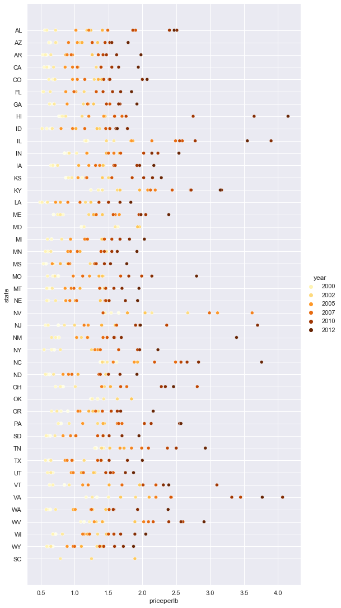
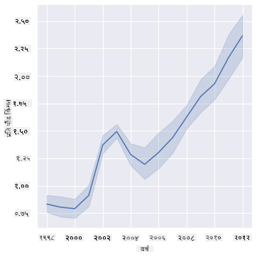
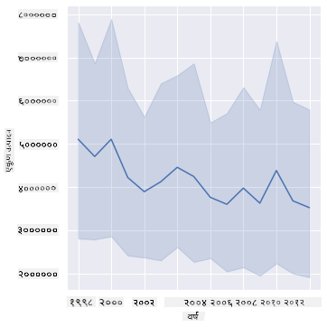
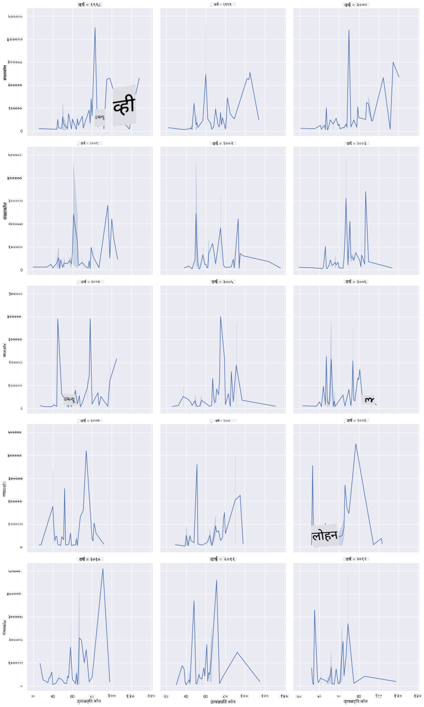
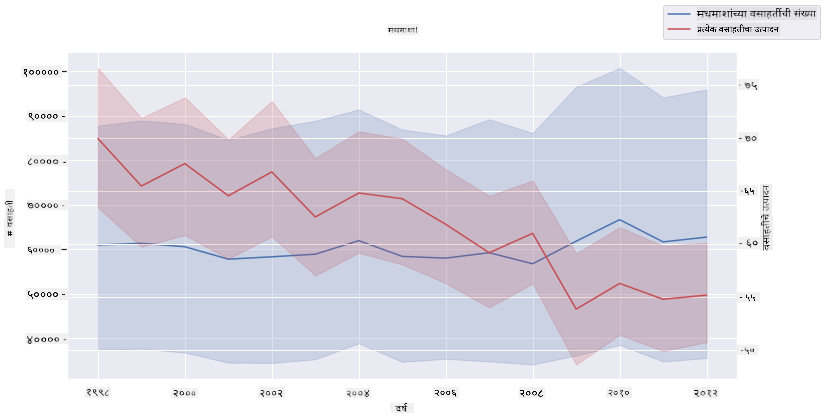

<!--
CO_OP_TRANSLATOR_METADATA:
{
  "original_hash": "b29e427401499e81f4af55a8c4afea76",
  "translation_date": "2025-09-04T16:50:24+00:00",
  "source_file": "3-Data-Visualization/12-visualization-relationships/README.md",
  "language_code": "mr"
}
-->
# नातेसंबंधांचे दृश्यांकन: मधाबद्दल सर्व काही 🍯

| ](../../sketchnotes/12-Visualizing-Relationships.png)|
|:---:|
|नातेसंबंधांचे दृश्यांकन - _Sketchnote by [@nitya](https://twitter.com/nitya)_ |

आपल्या संशोधनाच्या निसर्ग-केंद्रित दृष्टिकोनाला पुढे नेत, विविध प्रकारच्या मधामधील नातेसंबंध दाखवण्यासाठी काही मनोरंजक दृश्यांकन शोधूया, जे [United States Department of Agriculture](https://www.nass.usda.gov/About_NASS/index.php) कडून मिळालेल्या डेटासेटवर आधारित आहे.

सुमारे 600 आयटम्सचा हा डेटासेट अनेक अमेरिकन राज्यांमधील मध उत्पादन दाखवतो. उदाहरणार्थ, तुम्ही 1998-2012 दरम्यान प्रत्येक राज्यासाठी एका वर्षाच्या डेटावर आधारित, मध उत्पादनाच्या वसाहतींची संख्या, प्रति वसाहती उत्पादन, एकूण उत्पादन, साठा, प्रति पाउंड किंमत आणि उत्पादनाची किंमत पाहू शकता.

एखाद्या राज्याच्या वार्षिक उत्पादन आणि त्या राज्यातील मधाच्या किंमतीमधील नातेसंबंधाचे दृश्यांकन करणे मनोरंजक ठरेल. पर्यायाने, तुम्ही राज्यांतील मधाच्या प्रति वसाहती उत्पादनाचे नातेसंबंध देखील दाखवू शकता. या कालावधीत 2006 मध्ये प्रथम दिसलेला 'CCD' किंवा 'Colony Collapse Disorder' (http://npic.orst.edu/envir/ccd.html) चा विनाशकारी परिणाम समाविष्ट आहे, त्यामुळे हा डेटासेट अभ्यास करण्यासाठी महत्त्वाचा आहे. 🐝

## [पूर्व-पाठ प्रश्नमंजुषा](https://purple-hill-04aebfb03.1.azurestaticapps.net/quiz/22)

या धड्यात, तुम्ही Seaborn वापरू शकता, ज्याचा तुम्ही यापूर्वी वापर केला आहे, जो व्हेरिएबल्समधील नातेसंबंधांचे दृश्यांकन करण्यासाठी एक चांगले लायब्ररी आहे. विशेषतः Seaborn च्या `relplot` फंक्शनचा वापर, जो स्कॅटर प्लॉट्स आणि लाइन प्लॉट्सद्वारे '[statistical relationships](https://seaborn.pydata.org/tutorial/relational.html?highlight=relationships)' लवकर दाखवतो, डेटा सायंटिस्टला व्हेरिएबल्समधील नातेसंबंध अधिक चांगल्या प्रकारे समजून घेण्यास मदत करतो.

## स्कॅटरप्लॉट्स

मधाच्या किंमतीने वर्षागणिक, प्रत्येक राज्यासाठी कसा बदल केला आहे हे दाखवण्यासाठी स्कॅटरप्लॉट वापरा. Seaborn चा `relplot` वापरून, राज्य डेटा गटबद्ध करतो आणि श्रेणीसंबंधित तसेच संख्यात्मक डेटा पॉइंट्स दाखवतो.

चला डेटा आणि Seaborn आयात करून सुरुवात करूया:

```python
import pandas as pd
import matplotlib.pyplot as plt
import seaborn as sns
honey = pd.read_csv('../../data/honey.csv')
honey.head()
```
तुम्हाला लक्षात येईल की मधाच्या डेटामध्ये वर्ष आणि प्रति पाउंड किंमत यासह अनेक मनोरंजक कॉलम्स आहेत. चला हा डेटा, अमेरिकन राज्यांनुसार गटबद्ध करून एक्सप्लोर करूया:

| state | numcol | yieldpercol | totalprod | stocks   | priceperlb | prodvalue | year |
| ----- | ------ | ----------- | --------- | -------- | ---------- | --------- | ---- |
| AL    | 16000  | 71          | 1136000   | 159000   | 0.72       | 818000    | 1998 |
| AZ    | 55000  | 60          | 3300000   | 1485000  | 0.64       | 2112000   | 1998 |
| AR    | 53000  | 65          | 3445000   | 1688000  | 0.59       | 2033000   | 1998 |
| CA    | 450000 | 83          | 37350000  | 12326000 | 0.62       | 23157000  | 1998 |
| CO    | 27000  | 72          | 1944000   | 1594000  | 0.7        | 1361000   | 1998 |

प्रति पाउंड मधाच्या किंमती आणि त्याच्या अमेरिकन राज्याच्या मूळ स्थानामधील नातेसंबंध दाखवण्यासाठी एक मूलभूत स्कॅटरप्लॉट तयार करा. `y` अक्ष पुरेसा उंच ठेवा जेणेकरून सर्व राज्ये दिसतील:

```python
sns.relplot(x="priceperlb", y="state", data=honey, height=15, aspect=.5);
```


आता, मधाच्या रंगसंगतीसह वर्षागणिक किंमत कशी बदलते हे दाखवा. तुम्ही 'hue' पॅरामीटर जोडून वर्षागणिक बदल दाखवू शकता:

> ✅ Seaborn मध्ये वापरू शकणाऱ्या [रंग पॅलेट्सबद्दल अधिक जाणून घ्या](https://seaborn.pydata.org/tutorial/color_palettes.html) - सुंदर इंद्रधनुष्य रंगसंगती वापरून पहा!

```python
sns.relplot(x="priceperlb", y="state", hue="year", palette="YlOrBr", data=honey, height=15, aspect=.5);
```


या रंगसंगती बदलासह, तुम्हाला स्पष्टपणे दिसते की मधाच्या प्रति पाउंड किंमतीत वर्षागणिक मजबूत प्रगती आहे. खरंच, जर तुम्ही डेटामधील नमुना सेट तपासला (उदाहरणार्थ, एरिझोना राज्य निवडा) तर तुम्हाला किंमतीत वर्षागणिक वाढीचा नमुना दिसतो, काही अपवादांसह:

| state | numcol | yieldpercol | totalprod | stocks  | priceperlb | prodvalue | year |
| ----- | ------ | ----------- | --------- | ------- | ---------- | --------- | ---- |
| AZ    | 55000  | 60          | 3300000   | 1485000 | 0.64       | 2112000   | 1998 |
| AZ    | 52000  | 62          | 3224000   | 1548000 | 0.62       | 1999000   | 1999 |
| AZ    | 40000  | 59          | 2360000   | 1322000 | 0.73       | 1723000   | 2000 |
| AZ    | 43000  | 59          | 2537000   | 1142000 | 0.72       | 1827000   | 2001 |
| AZ    | 38000  | 63          | 2394000   | 1197000 | 1.08       | 2586000   | 2002 |
| AZ    | 35000  | 72          | 2520000   | 983000  | 1.34       | 3377000   | 2003 |
| AZ    | 32000  | 55          | 1760000   | 774000  | 1.11       | 1954000   | 2004 |
| AZ    | 36000  | 50          | 1800000   | 720000  | 1.04       | 1872000   | 2005 |
| AZ    | 30000  | 65          | 1950000   | 839000  | 0.91       | 1775000   | 2006 |
| AZ    | 30000  | 64          | 1920000   | 902000  | 1.26       | 2419000   | 2007 |
| AZ    | 25000  | 64          | 1600000   | 336000  | 1.26       | 2016000   | 2008 |
| AZ    | 20000  | 52          | 1040000   | 562000  | 1.45       | 1508000   | 2009 |
| AZ    | 24000  | 77          | 1848000   | 665000  | 1.52       | 2809000   | 2010 |
| AZ    | 23000  | 53          | 1219000   | 427000  | 1.55       | 1889000   | 2011 |
| AZ    | 22000  | 46          | 1012000   | 253000  | 1.79       | 1811000   | 2012 |

दृष्टीदोष असलेल्या वापरकर्त्यांसाठी, रंगाऐवजी आकार वापरणे हा एक चांगला पर्याय असू शकतो. किंमतीत वाढ दाखवण्यासाठी डॉट्सचा परिघ वाढवून तुमचे दृश्यांकन संपादित करा:

```python
sns.relplot(x="priceperlb", y="state", size="year", data=honey, height=15, aspect=.5);
```
तुम्ही पाहू शकता की डॉट्सचा आकार हळूहळू वाढत आहे.


हे साधे पुरवठा आणि मागणीचे प्रकरण आहे का? हवामान बदल आणि वसाहतींचा नाश यासारख्या घटकांमुळे, वर्षागणिक खरेदीसाठी कमी मध उपलब्ध आहे का, आणि त्यामुळे किंमत वाढते?

या डेटासेटमधील काही व्हेरिएबल्समधील नातेसंबंध शोधण्यासाठी, चला काही लाइन चार्ट्स एक्सप्लोर करूया.

## लाइन चार्ट्स

प्रश्न: मधाच्या प्रति पाउंड किंमतीत वर्षागणिक स्पष्ट वाढ आहे का? तुम्ही एकच लाइन चार्ट तयार करून ते सहज शोधू शकता:

```python
sns.relplot(x="year", y="priceperlb", kind="line", data=honey);
```
उत्तर: होय, काही अपवादांसह, विशेषतः 2003 च्या सुमारास:



✅ कारण Seaborn डेटा एका लाइनभोवती एकत्रित करत आहे, तो "प्रत्येक x मूल्यावर एकाधिक मोजमापांचे सरासरी आणि सरासरीभोवती 95% विश्वास अंतर प्लॉट करून" दाखवतो. [Source](https://seaborn.pydata.org/tutorial/relational.html). ही वेळखाऊ प्रक्रिया `ci=None` जोडून अक्षम केली जाऊ शकते.

प्रश्न: बरं, 2003 मध्ये मधाच्या पुरवठ्यातही वाढ दिसते का? जर तुम्ही वर्षागणिक एकूण उत्पादन पाहिले तर काय?

```python
sns.relplot(x="year", y="totalprod", kind="line", data=honey);
```



उत्तर: खरं तर नाही. जर तुम्ही एकूण उत्पादन पाहिले तर, त्या विशिष्ट वर्षात ते वाढलेले दिसते, जरी सामान्यतः या वर्षांमध्ये मधाचे उत्पादन कमी होत आहे.

प्रश्न: त्या परिस्थितीत, 2003 च्या सुमारास मधाच्या किंमतीत वाढीचे कारण काय असू शकते?

हे शोधण्यासाठी, तुम्ही फॅसेट ग्रिड एक्सप्लोर करू शकता.

## फॅसेट ग्रिड्स

फॅसेट ग्रिड्स तुमच्या डेटासेटचा एक फॅसेट घेतात (आपल्या बाबतीत, 'वर्ष' निवडू शकता जेणेकरून खूप जास्त फॅसेट्स तयार होणार नाहीत). Seaborn नंतर तुमच्या निवडलेल्या x आणि y समन्वयांसाठी प्रत्येक फॅसेटसाठी प्लॉट तयार करू शकतो, ज्यामुळे तुलना सोपी होते. या प्रकारच्या तुलनेत 2003 वेगळे दिसते का?

Seaborn च्या [डॉक्युमेंटेशन](https://seaborn.pydata.org/generated/seaborn.FacetGrid.html?highlight=facetgrid#seaborn.FacetGrid) च्या शिफारशीनुसार `relplot` वापरणे सुरू ठेवून फॅसेट ग्रिड तयार करा.

```python
sns.relplot(
    data=honey, 
    x="yieldpercol", y="numcol",
    col="year", 
    col_wrap=3,
    kind="line"
```
या दृश्यांकनात, तुम्ही प्रति वसाहती उत्पादन आणि वसाहतींची संख्या वर्षागणिक, राज्यागणिक, बाजूने तुलना करू शकता, स्तंभांसाठी रॅप 3 वर सेट करून:



या डेटासेटसाठी, वसाहतींची संख्या आणि त्यांचे उत्पादन, वर्षागणिक आणि राज्यागणिक, काहीही विशेषतः वेगळे दिसत नाही. या दोन व्हेरिएबल्समधील नातेसंबंध शोधण्यासाठी वेगळ्या प्रकारे पाहण्याचा प्रयत्न करता येईल का?

## ड्युअल-लाइन प्लॉट्स

Seaborn च्या 'despine' चा वापर करून दोन लाइनप्लॉट्स एकमेकांवर सुपरइम्पोज करा, त्यांच्या वरच्या आणि उजव्या स्पाइन्स काढून टाका, आणि `ax.twinx` [Matplotlib](https://matplotlib.org/stable/api/_as_gen/matplotlib.axes.Axes.twinx.html) मधून वापरा. Twinx चार्टला x अक्ष सामायिक करण्यास आणि दोन y अक्ष दाखवण्यास परवानगी देते. त्यामुळे, प्रति वसाहती उत्पादन आणि वसाहतींची संख्या, सुपरइम्पोज करा:

```python
fig, ax = plt.subplots(figsize=(12,6))
lineplot = sns.lineplot(x=honey['year'], y=honey['numcol'], data=honey, 
                        label = 'Number of bee colonies', legend=False)
sns.despine()
plt.ylabel('# colonies')
plt.title('Honey Production Year over Year');

ax2 = ax.twinx()
lineplot2 = sns.lineplot(x=honey['year'], y=honey['yieldpercol'], ax=ax2, color="r", 
                         label ='Yield per colony', legend=False) 
sns.despine(right=False)
plt.ylabel('colony yield')
ax.figure.legend();
```


2003 च्या सुमारास डोळ्यांना काहीही वेगळे दिसत नाही, परंतु हे आपल्याला या धड्याचा शेवट थोड्या आनंददायक नोटवर करण्याची परवानगी देते: जरी वसाहतींची संख्या एकूण कमी होत असली तरी, वसाहतींची संख्या स्थिर होत आहे जरी त्यांचे प्रति वसाहती उत्पादन कमी होत आहे.

जा, मधमाशा, जा!

🐝❤️
## 🚀 आव्हान

या धड्यात, तुम्ही स्कॅटरप्लॉट्स आणि लाइन ग्रिड्सच्या इतर उपयोगांबद्दल थोडे अधिक शिकले, ज्यामध्ये फॅसेट ग्रिड्स समाविष्ट आहेत. स्वतःला आव्हान द्या आणि वेगळ्या डेटासेटचा वापर करून फॅसेट ग्रिड तयार करा, कदाचित तुम्ही या धड्यांपूर्वी वापरलेला डेटासेट वापरा. ते तयार करण्यासाठी किती वेळ लागतो आणि तुम्हाला किती ग्रिड्स तयार करायचे आहेत याबद्दल तुम्हाला काळजी घ्यावी लागते हे नोंदवा.

## [पाठ-पश्चात प्रश्नमंजुषा](https://ff-quizzes.netlify.app/en/ds/)

## पुनरावलोकन आणि स्व-अभ्यास

लाइन प्लॉट्स साधे किंवा खूप जटिल असू शकतात. [Seaborn डॉक्युमेंटेशन](https://seaborn.pydata.org/generated/seaborn.lineplot.html) मध्ये थोडे वाचन करा आणि तुम्ही त्यांना तयार करण्याच्या विविध पद्धतींबद्दल जाणून घ्या. तुम्ही या धड्यात तयार केलेल्या लाइन चार्ट्सना डॉक्युमेंटेशनमध्ये सूचीबद्ध केलेल्या इतर पद्धतींसह सुधारण्याचा प्रयत्न करा.
## असाइनमेंट

[Dive into the beehive](assignment.md)

---

**अस्वीकरण**:  
हा दस्तऐवज AI भाषांतर सेवा [Co-op Translator](https://github.com/Azure/co-op-translator) वापरून भाषांतरित करण्यात आला आहे. आम्ही अचूकतेसाठी प्रयत्नशील असलो तरी कृपया लक्षात ठेवा की स्वयंचलित भाषांतरांमध्ये त्रुटी किंवा अचूकतेचा अभाव असू शकतो. मूळ भाषेतील दस्तऐवज हा अधिकृत स्रोत मानला जावा. महत्त्वाच्या माहितीसाठी व्यावसायिक मानवी भाषांतराची शिफारस केली जाते. या भाषांतराचा वापर करून निर्माण होणाऱ्या कोणत्याही गैरसमज किंवा चुकीच्या अर्थासाठी आम्ही जबाबदार राहणार नाही.