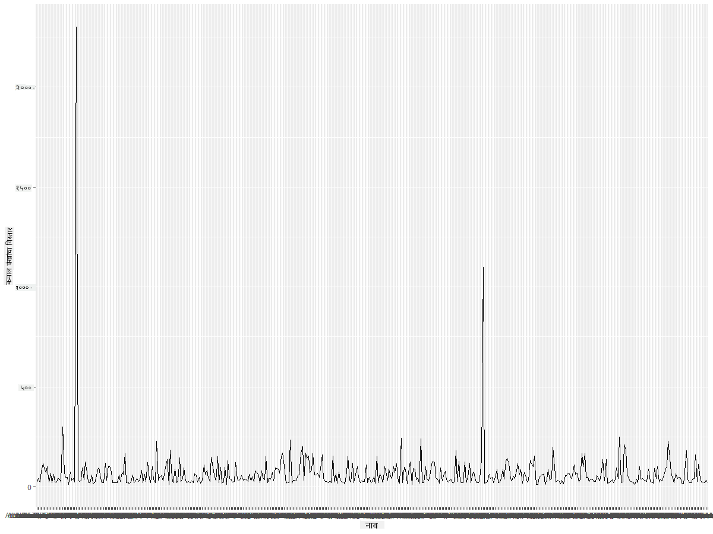
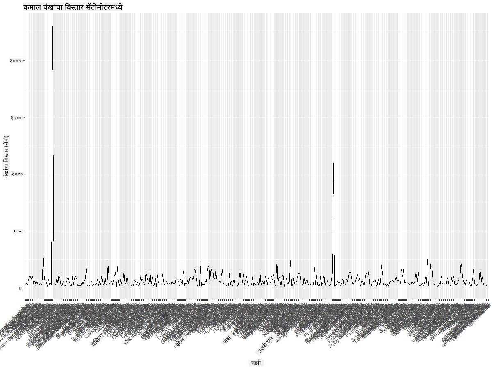
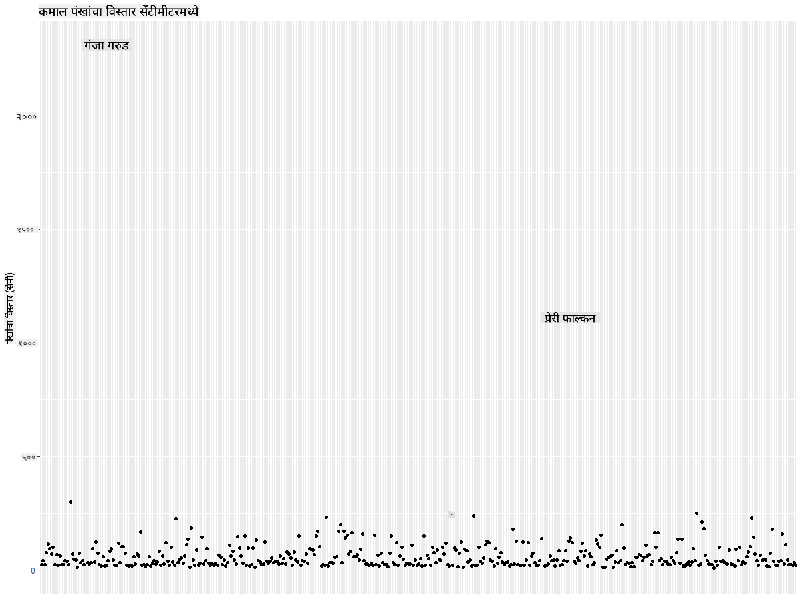
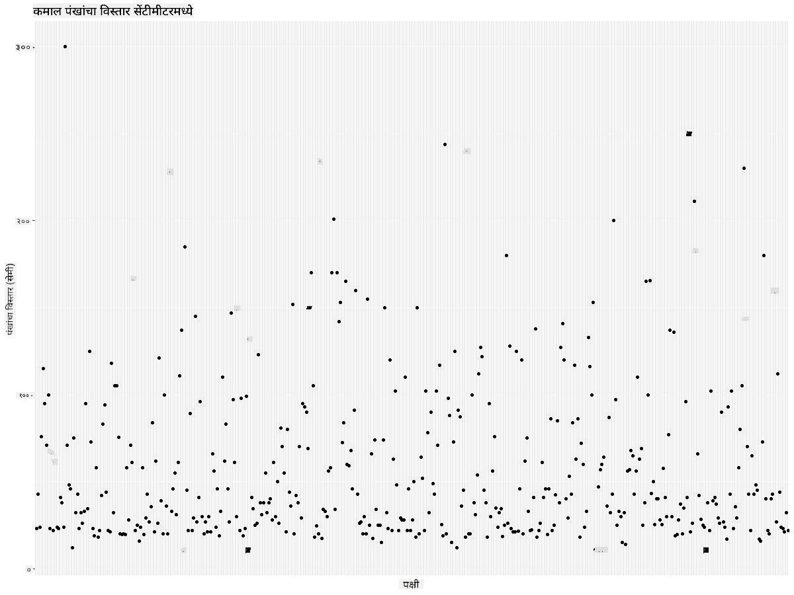
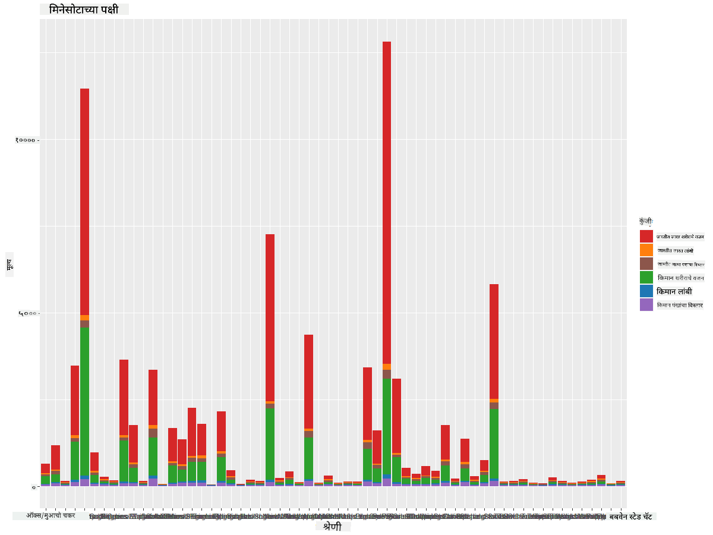
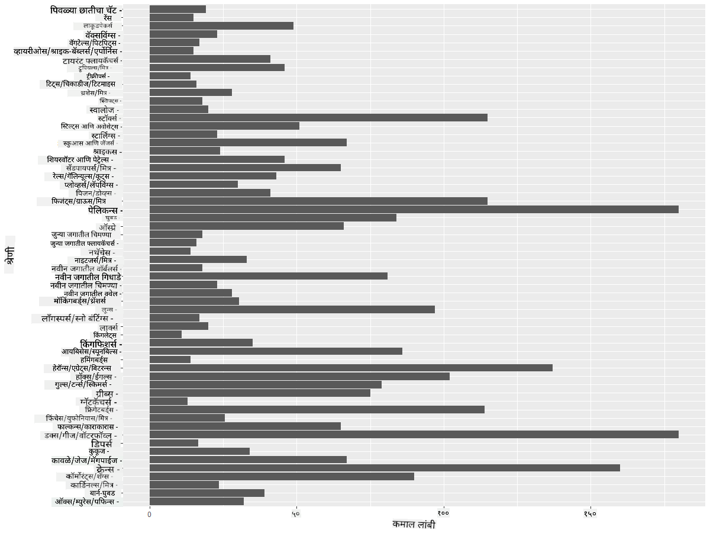

<!--
CO_OP_TRANSLATOR_METADATA:
{
  "original_hash": "22acf28f518a4769ea14fa42f4734b9f",
  "translation_date": "2025-08-27T18:28:57+00:00",
  "source_file": "3-Data-Visualization/R/09-visualization-quantities/README.md",
  "language_code": "mr"
}
-->
# प्रमाणांचे दृश्यरूप

| ](https://github.com/microsoft/Data-Science-For-Beginners/blob/main/sketchnotes/09-Visualizing-Quantities.png)|
|:---:|
| प्रमाणांचे दृश्यरूप - _Sketchnote by [@nitya](https://twitter.com/nitya)_ |

या धड्यात तुम्ही R पॅकेज लायब्ररींचा वापर करून प्रमाणाच्या संकल्पनेभोवती आकर्षक दृश्यरूप तयार करण्याचे तंत्र शिकाल. मिनेसोटाच्या पक्ष्यांबद्दलच्या स्वच्छ केलेल्या डेटासेटचा वापर करून तुम्ही स्थानिक वन्यजीवांबद्दल अनेक मनोरंजक तथ्ये शिकू शकता.  
## [पूर्व-व्याख्यान प्रश्नमंजुषा](https://purple-hill-04aebfb03.1.azurestaticapps.net/quiz/16)

## ggplot2 सह पंखांचा विस्तार निरीक्षण करा
[ggplot2](https://cran.r-project.org/web/packages/ggplot2/index.html) ही एक उत्कृष्ट लायब्ररी आहे जी विविध प्रकारचे साधे आणि प्रगत प्लॉट्स व चार्ट्स तयार करण्यासाठी वापरली जाते. साधारणतः, या लायब्ररींचा वापर करून डेटा प्लॉट करण्याची प्रक्रिया म्हणजे तुमच्या डेटाफ्रेममधील विशिष्ट भाग ओळखणे, आवश्यक असल्यास त्या डेटावर रूपांतरण करणे, त्याचे x आणि y अक्ष मूल्ये नियुक्त करणे, कोणत्या प्रकारचा प्लॉट दाखवायचा ते ठरवणे आणि नंतर प्लॉट दाखवणे.

`ggplot2` ही ग्राफिक्स तयार करण्यासाठी एक प्रणाली आहे जी The Grammar of Graphics वर आधारित आहे. [Grammar of Graphics](https://en.wikipedia.org/wiki/Ggplot2) ही डेटा व्हिज्युअलायझेशनसाठी एक सामान्य योजना आहे जी ग्राफ्सना स्केल्स आणि लेयर्ससारख्या घटकांमध्ये विभागते. थोडक्यात, कमी कोडसह एकेरी किंवा बहुविध डेटासाठी प्लॉट्स आणि ग्राफ्स तयार करण्याची सुलभता `ggplot2` ला R मधील सर्वात लोकप्रिय व्हिज्युअलायझेशन पॅकेज बनवते. वापरकर्ता `ggplot2` ला व्हेरिएबल्स कसे मॅप करायचे, कोणते ग्राफिकल प्रिमिटिव्ह वापरायचे हे सांगतो, आणि उर्वरित काम `ggplot2` करते.

> ✅ प्लॉट = डेटा + सौंदर्यशास्त्र + भूमिती
> - डेटा म्हणजे डेटासेट
> - सौंदर्यशास्त्र म्हणजे अभ्यास करायचे व्हेरिएबल्स (x आणि y व्हेरिएबल्स)
> - भूमिती म्हणजे प्लॉटचा प्रकार (लाइन प्लॉट, बार प्लॉट, इ.)

तुमच्या डेटानुसार आणि प्लॉटद्वारे सांगायच्या कथेच्या आधारावर सर्वोत्तम भूमिती (प्लॉटचा प्रकार) निवडा.

> - ट्रेंड्स विश्लेषणासाठी: लाइन, कॉलम
> - मूल्ये तुलना करण्यासाठी: बार, कॉलम, पाई, स्कॅटरप्लॉट
> - भाग कसे एकत्र येतात हे दाखवण्यासाठी: पाई
> - डेटाचा वितरण दाखवण्यासाठी: स्कॅटरप्लॉट, बार
> - मूल्यांमधील संबंध दाखवण्यासाठी: लाइन, स्कॅटरप्लॉट, बबल

✅ तुम्ही `ggplot2` साठी हा वर्णनात्मक [cheatsheet](https://nyu-cdsc.github.io/learningr/assets/data-visualization-2.1.pdf) देखील पाहू शकता.

## पक्ष्यांच्या पंखांच्या विस्तारावर आधारित लाइन प्लॉट तयार करा

R कन्सोल उघडा आणि डेटासेट आयात करा.  
> टीप: डेटासेट या रेपोच्या `/data` फोल्डरमध्ये संग्रहित आहे.

डेटासेट आयात करूया आणि डेटा हेड (वरच्या 5 ओळी) पाहूया.

```r
birds <- read.csv("../../data/birds.csv",fileEncoding="UTF-8-BOM")
head(birds)
```
डेटाच्या हेडमध्ये मजकूर आणि संख्यांचा मिश्रण आहे:

|      | नाव                          | शास्त्रीय नाव          | वर्ग                  | ऑर्डर       | कुटुंब   | वंश        | संवर्धन स्थिती      | किमान लांबी | कमाल लांबी | किमान शरीर वजन | कमाल शरीर वजन | किमान पंख विस्तार | कमाल पंख विस्तार |
| ---: | :--------------------------- | :--------------------- | :-------------------- | :----------- | :------- | :---------- | :----------------- | --------: | --------: | ----------: | ----------: | ----------: | ----------: |
|    0 | ब्लॅक-बेलिड व्हिसलिंग-डक    | Dendrocygna autumnalis | बदके/हंस/पाणपक्षी     | Anseriformes | Anatidae | Dendrocygna | LC                 |        47 |        56 |         652 |        1020 |          76 |          94 |
|    1 | फुल्व्हस व्हिसलिंग-डक       | Dendrocygna bicolor    | बदके/हंस/पाणपक्षी     | Anseriformes | Anatidae | Dendrocygna | LC                 |        45 |        53 |         712 |        1050 |          85 |          93 |
|    2 | स्नो गूज                     | Anser caerulescens     | बदके/हंस/पाणपक्षी     | Anseriformes | Anatidae | Anser       | LC                 |        64 |        79 |        2050 |        4050 |         135 |         165 |
|    3 | रॉसचा गूज                   | Anser rossii           | बदके/हंस/पाणपक्षी     | Anseriformes | Anatidae | Anser       | LC                 |      57.3 |        64 |        1066 |        1567 |         113 |         116 |
|    4 | ग्रेटर व्हाइट-फ्रंटेड गूज   | Anser albifrons        | बदके/हंस/पाणपक्षी     | Anseriformes | Anatidae | Anser       | LC                 |        64 |        81 |        1930 |        3310 |         130 |         165 |

आता या मनोरंजक पक्ष्यांसाठी कमाल पंख विस्ताराचे दृश्य तयार करूया.

```r
install.packages("ggplot2")
library("ggplot2")
ggplot(data=birds, aes(x=Name, y=MaxWingspan,group=1)) +
  geom_line() 
```
येथे, तुम्ही `ggplot2` पॅकेज इन्स्टॉल करता आणि नंतर `library("ggplot2")` कमांड वापरून ते वर्कस्पेसमध्ये आयात करता. ggplot मध्ये कोणताही प्लॉट तयार करण्यासाठी `ggplot()` फंक्शन वापरले जाते आणि तुम्ही डेटासेट, x आणि y व्हेरिएबल्स अॅट्रिब्युट्स म्हणून निर्दिष्ट करता. या प्रकरणात, आम्ही लाइन प्लॉट तयार करण्यासाठी `geom_line()` फंक्शन वापरतो.



तुम्हाला लगेच काय दिसते? किमान एक आउटलाईअर आहे - हा पंखांचा विस्तार खूपच मोठा आहे! 2000+ सेंटीमीटर पंखांचा विस्तार म्हणजे 20 मीटरपेक्षा जास्त - मिनेसोटामध्ये पॅटरोडॅक्टाइल्स आहेत का? चला तपास करूया.

तुम्ही Excel मध्ये जलद सॉर्ट करून हे आउटलाईअर्स शोधू शकता, जे कदाचित टायपोग्राफिकल चुका असतील, परंतु प्लॉटमधूनच व्हिज्युअलायझेशन प्रक्रिया सुरू ठेवा.

x-अक्षावर पक्ष्यांच्या प्रकारांचे लेबल्स जोडा:

```r
ggplot(data=birds, aes(x=Name, y=MaxWingspan,group=1)) +
  geom_line() +
  theme(axis.text.x = element_text(angle = 45, hjust=1))+
  xlab("Birds") +
  ylab("Wingspan (CM)") +
  ggtitle("Max Wingspan in Centimeters")
```
आम्ही `theme` मध्ये कोन निर्दिष्ट करतो आणि `xlab()` आणि `ylab()` मध्ये x आणि y अक्ष लेबल्स निर्दिष्ट करतो. `ggtitle()` ग्राफ/प्लॉटला नाव देते.



लेबल्स 45 अंशांवर फिरवूनही वाचण्यासाठी खूप जास्त आहेत. वेगळी रणनीती वापरूया: फक्त आउटलाईअर्सना लेबल करा आणि लेबल्स चार्टमध्ये सेट करा. अधिक जागा मिळवण्यासाठी तुम्ही स्कॅटर चार्ट वापरू शकता:

```r
ggplot(data=birds, aes(x=Name, y=MaxWingspan,group=1)) +
  geom_point() +
  geom_text(aes(label=ifelse(MaxWingspan>500,as.character(Name),'')),hjust=0,vjust=0) + 
  theme(axis.title.x=element_blank(), axis.text.x=element_blank(), axis.ticks.x=element_blank())
  ylab("Wingspan (CM)") +
  ggtitle("Max Wingspan in Centimeters") + 
```
येथे काय चालले आहे? तुम्ही `geom_point()` फंक्शन वापरून स्कॅटर पॉइंट्स प्लॉट केले. यासह, तुम्ही `MaxWingspan > 500` असलेल्या पक्ष्यांसाठी लेबल्स जोडले आणि प्लॉटला कमी गोंधळात आणण्यासाठी x अक्षावरील लेबल्स लपवले.

तुम्हाला काय सापडते?



## तुमचा डेटा फिल्टर करा

बॉल्ड ईगल आणि प्रेरी फाल्कन, कदाचित खूप मोठे पक्षी असले तरी, त्यांच्या कमाल पंख विस्तारासह चुकीचे लेबल लावलेले दिसतात, ज्यामध्ये अतिरिक्त 0 जोडले गेले आहे. 25 मीटर पंखांचा विस्तार असलेला बॉल्ड ईगल भेटण्याची शक्यता कमी आहे, परंतु जर असे झाले तर कृपया आम्हाला कळवा! चला या दोन आउटलाईअर्सशिवाय नवीन डेटाफ्रेम तयार करूया:

```r
birds_filtered <- subset(birds, MaxWingspan < 500)

ggplot(data=birds_filtered, aes(x=Name, y=MaxWingspan,group=1)) +
  geom_point() +
  ylab("Wingspan (CM)") +
  xlab("Birds") +
  ggtitle("Max Wingspan in Centimeters") + 
  geom_text(aes(label=ifelse(MaxWingspan>500,as.character(Name),'')),hjust=0,vjust=0) +
  theme(axis.text.x=element_blank(), axis.ticks.x=element_blank())
```
आम्ही नवीन डेटाफ्रेम `birds_filtered` तयार केला आणि नंतर स्कॅटर प्लॉट तयार केला. आउटलाईअर्स फिल्टर करून, तुमचा डेटा आता अधिक सुसंगत आणि समजण्यास सोपा आहे.



आता पंखांच्या विस्ताराच्या बाबतीत तरी आपल्याकडे स्वच्छ डेटासेट आहे, चला या पक्ष्यांबद्दल अधिक शोधूया.

लाइन आणि स्कॅटर प्लॉट्स डेटा मूल्ये आणि त्यांचे वितरण दर्शवू शकतात, परंतु आपण या डेटासेटमधील मूल्यांबद्दल विचार करू इच्छितो. तुम्ही प्रमाणाबद्दल खालील प्रश्नांची उत्तरे देण्यासाठी व्हिज्युअलायझेशन तयार करू शकता:

> पक्ष्यांच्या किती श्रेण्या आहेत, आणि त्यांची संख्या किती आहे?  
> किती पक्षी नामशेष, संकटग्रस्त, दुर्मिळ किंवा सामान्य आहेत?  
> लिनियसच्या टर्मिनॉलॉजीमध्ये विविध वंश आणि ऑर्डरचे किती आहेत?  

## बार चार्ट्सचा अभ्यास करा

जेव्हा तुम्हाला डेटाचे गट दाखवायचे असतात तेव्हा बार चार्ट्स उपयुक्त ठरतात. या डेटासेटमध्ये असलेल्या पक्ष्यांच्या श्रेण्या शोधूया आणि पाहूया की कोणती श्रेणी संख्येने सर्वाधिक आहे.  
फिल्टर केलेल्या डेटावर बार चार्ट तयार करूया.

```r
install.packages("dplyr")
install.packages("tidyverse")

library(lubridate)
library(scales)
library(dplyr)
library(ggplot2)
library(tidyverse)

birds_filtered %>% group_by(Category) %>%
  summarise(n=n(),
  MinLength = mean(MinLength),
  MaxLength = mean(MaxLength),
  MinBodyMass = mean(MinBodyMass),
  MaxBodyMass = mean(MaxBodyMass),
  MinWingspan=mean(MinWingspan),
  MaxWingspan=mean(MaxWingspan)) %>% 
  gather("key", "value", - c(Category, n)) %>%
  ggplot(aes(x = Category, y = value, group = key, fill = key)) +
  geom_bar(stat = "identity") +
  scale_fill_manual(values = c("#D62728", "#FF7F0E", "#8C564B","#2CA02C", "#1F77B4", "#9467BD")) +                   
  xlab("Category")+ggtitle("Birds of Minnesota")

```
खालील कोडमध्ये, आम्ही [dplyr](https://www.rdocumentation.org/packages/dplyr/versions/0.7.8) आणि [lubridate](https://www.rdocumentation.org/packages/lubridate/versions/1.8.0) पॅकेजेस इन्स्टॉल करतो जे डेटा हाताळण्यासाठी आणि गटबद्ध करण्यासाठी मदत करतात, जेणेकरून स्टॅक्ड बार चार्ट प्लॉट करता येईल. प्रथम, तुम्ही पक्ष्यांच्या `Category` नुसार डेटा गटबद्ध करता आणि नंतर `MinLength`, `MaxLength`, `MinBodyMass`, `MaxBodyMass`, `MinWingspan`, `MaxWingspan` स्तंभांचे सारांश तयार करता. नंतर, `ggplot2` पॅकेज वापरून बार चार्ट प्लॉट करा आणि विविध श्रेणींसाठी रंग आणि लेबल्स निर्दिष्ट करा.



हा बार चार्ट, तथापि, वाचण्यायोग्य नाही कारण खूप जास्त न गटबद्ध डेटा आहे. तुम्हाला फक्त प्लॉट करायचा डेटा निवडण्याची गरज आहे, म्हणून पक्ष्यांच्या श्रेणीवर आधारित लांबी पाहूया.

तुमचा डेटा फक्त पक्ष्यांच्या श्रेणीसाठी फिल्टर करा.

खूप श्रेण्या असल्याने, तुम्ही हा चार्ट उभा दाखवू शकता आणि सर्व डेटासाठी त्याची उंची समायोजित करू शकता:

```r
birds_count<-dplyr::count(birds_filtered, Category, sort = TRUE)
birds_count$Category <- factor(birds_count$Category, levels = birds_count$Category)
ggplot(birds_count,aes(Category,n))+geom_bar(stat="identity")+coord_flip()
```
तुम्ही `Category` स्तंभातील अद्वितीय मूल्ये मोजता आणि त्यांना नवीन डेटाफ्रेम `birds_count` मध्ये क्रमवारी लावता. ही क्रमवारी लावलेली डेटा नंतर त्याच स्तरावर फॅक्टर केली जाते जेणेकरून ती क्रमवारीत प्लॉट केली जाईल. नंतर, `ggplot2` वापरून तुम्ही डेटा बार चार्टमध्ये प्लॉट करता. `coord_flip()` क्षैतिज बार्स प्लॉट करते.


हा बार चार्ट प्रत्येक श्रेणीतील पक्ष्यांची संख्या चांगल्या प्रकारे दाखवतो. एका झटक्यात, तुम्हाला दिसते की या प्रदेशातील सर्वाधिक पक्षी बदके/हंस/पाणपक्षी या श्रेणीत आहेत. मिनेसोटा '10,000 तलावांचे प्रदेश' असल्याने हे आश्चर्यकारक नाही!

✅ या डेटासेटवर इतर काही मोजमाप करून पाहा. तुम्हाला काही आश्चर्य वाटते का?

## डेटाची तुलना

तुम्ही नवीन अक्ष तयार करून गटबद्ध डेटाची विविध तुलना करू शकता. पक्ष्यांच्या श्रेणीवर आधारित पक्ष्यांच्या `MaxLength` ची तुलना करून पाहा:

```r
birds_grouped <- birds_filtered %>%
  group_by(Category) %>%
  summarise(
  MaxLength = max(MaxLength, na.rm = T),
  MinLength = max(MinLength, na.rm = T)
           ) %>%
  arrange(Category)
  
ggplot(birds_grouped,aes(Category,MaxLength))+geom_bar(stat="identity")+coord_flip()
```
आम्ही `birds_filtered` डेटा `Category` नुसार गटबद्ध करतो आणि नंतर बार ग्राफ प्लॉट करतो.



येथे काहीही आश्चर्यकारक नाही: हुमिंगबर्ड्सचे `MaxLength` पेलिकन्स किंवा गीसेच्या तुलनेत सर्वात कमी आहे. जेव्हा डेटा तार्किक अर्थ लावतो तेव्हा ते चांगले असते!

तुम्ही बार चार्ट्सचे अधिक मनोरंजक व्हिज्युअलायझेशन तयार करू शकता, जसे की डेटा सुपरइम्पोज करणे. चला एका दिलेल्या पक्ष्याच्या श्रेणीवर किमान आणि कमाल लांबी सुपरइम्पोज करूया:

```r
ggplot(data=birds_grouped, aes(x=Category)) +
  geom_bar(aes(y=MaxLength), stat="identity", position ="identity",  fill='blue') +
  geom_bar(aes(y=MinLength), stat="identity", position="identity", fill='orange')+
  coord_flip()
```


## 🚀 आव्हान

हा पक्ष्यांचा डेटासेट विशिष्ट परिसंस्थेमधील विविध प्रकारच्या पक्ष्यांबद्दल माहिती देतो. इंटरनेटवर शोधा आणि पक्ष्यांशी संबंधित इतर डेटासेट शोधा. या पक्ष्यांभोवती चार्ट्स आणि ग्राफ्स तयार करण्याचा सराव करा आणि तुम्हाला माहित नसलेल्या तथ्यांचा शोध घ्या.  
## [व्याख्यानानंतरची प्रश्नमंजुषा](https://purple-hill-04aebfb03.1.azurestaticapps.net/quiz/17)

## पुनरावलोकन आणि स्व-अभ्यास

या पहिल्या धड्यात तुम्हाला प्रमाणांचे दृश्यरूप तयार करण्यासाठी `ggplot2` कसे वापरायचे याबद्दल काही माहिती दिली आहे. व्हिज्युअलायझेशनसाठी डेटासेटसह काम करण्याचे इतर मार्ग शोधा. [Lattice](https://stat.ethz.ch/R-manual/R-devel/library/lattice/html/Lattice.html) आणि [Plotly](https://github.com/plotly/plotly.R#readme) यांसारख्या इतर पॅकेजेस वापरून तुम्ही व्हिज्युअलायझेशनसाठी कोणते डेटासेट वापरू शकता ते शोधा.

## असाइनमेंट
[लाइन, स्कॅटर्स, आणि बार्स](assignment.md)

---

**अस्वीकरण**:  
हा दस्तऐवज AI भाषांतर सेवा [Co-op Translator](https://github.com/Azure/co-op-translator) चा वापर करून भाषांतरित करण्यात आला आहे. आम्ही अचूकतेसाठी प्रयत्नशील असलो तरी, कृपया लक्षात घ्या की स्वयंचलित भाषांतरांमध्ये त्रुटी किंवा अचूकतेचा अभाव असू शकतो. मूळ भाषेतील मूळ दस्तऐवज हा अधिकृत स्रोत मानला जावा. महत्त्वाच्या माहितीसाठी व्यावसायिक मानवी भाषांतराची शिफारस केली जाते. या भाषांतराचा वापर केल्यामुळे उद्भवणाऱ्या कोणत्याही गैरसमज किंवा चुकीच्या अर्थासाठी आम्ही जबाबदार राहणार नाही.