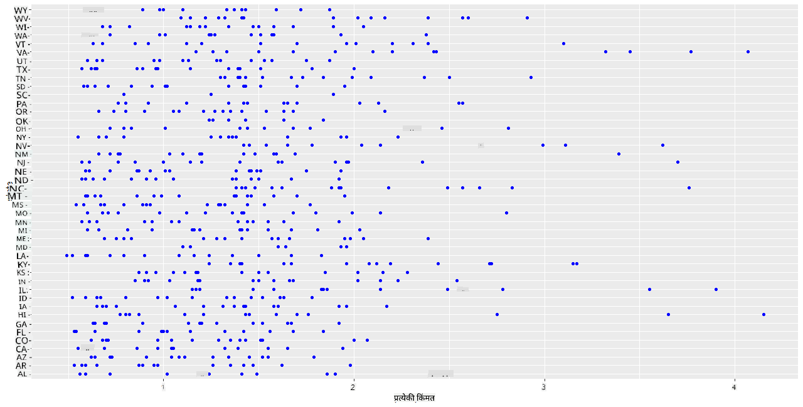
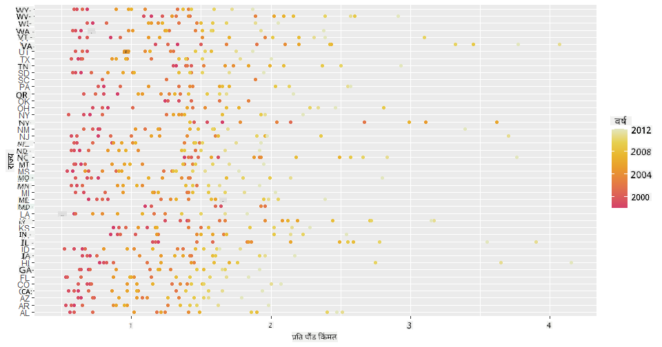
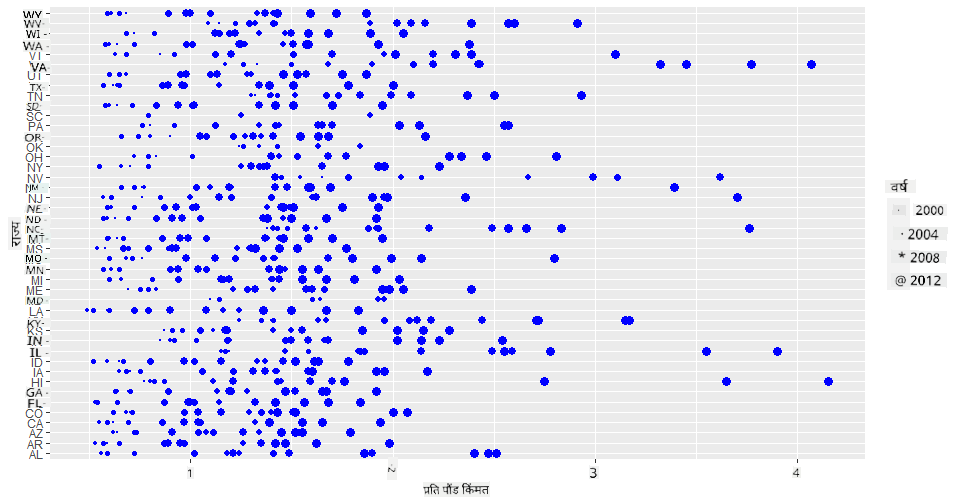
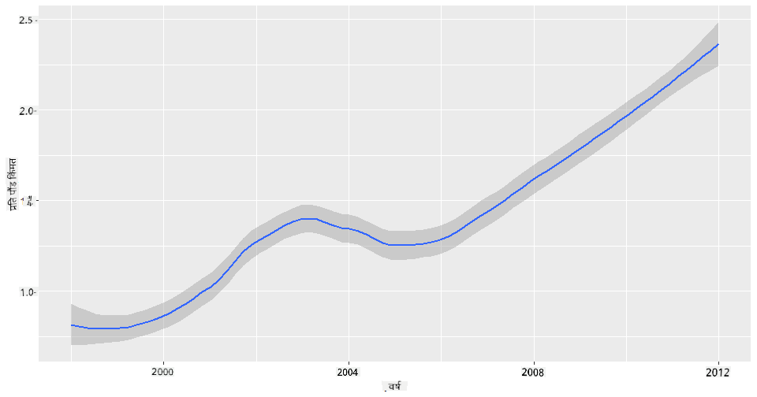
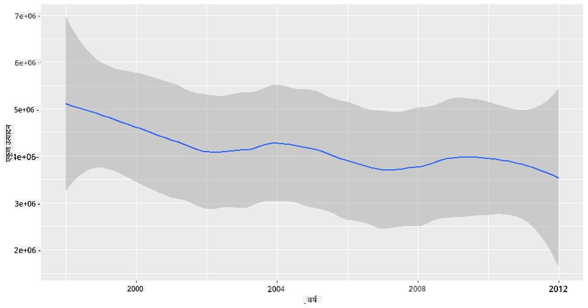
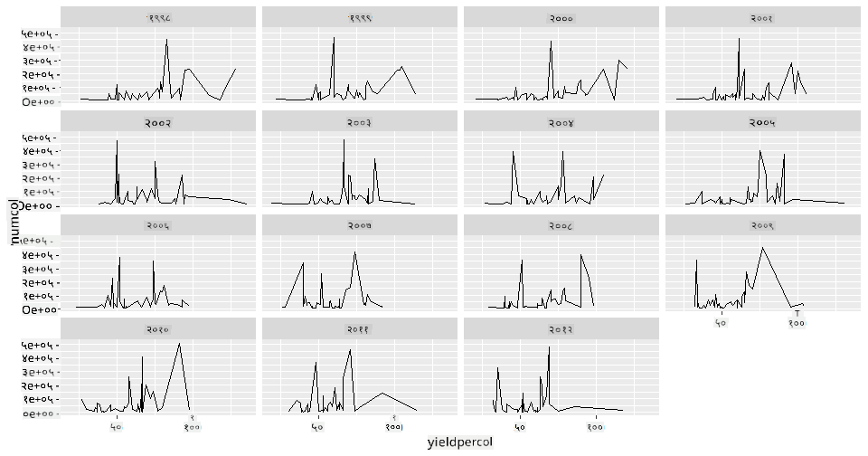
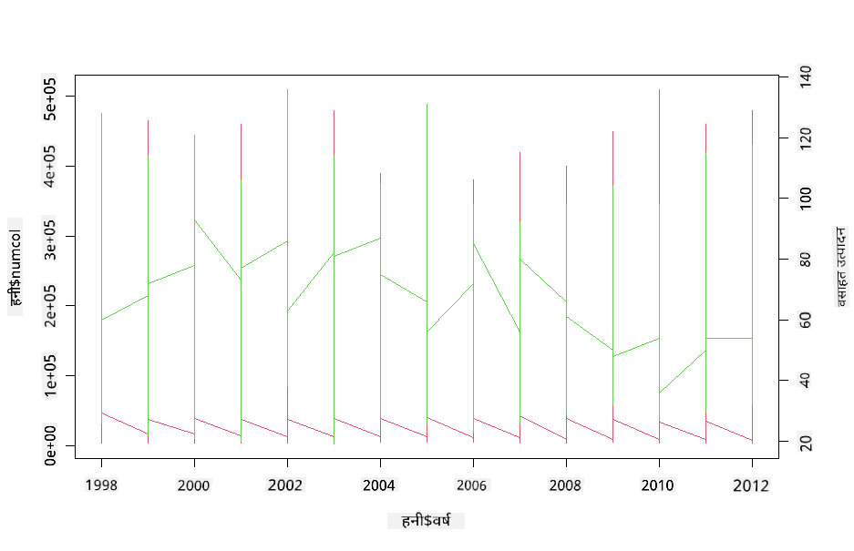

<!--
CO_OP_TRANSLATOR_METADATA:
{
  "original_hash": "a33c5d4b4156a2b41788d8720b6f724c",
  "translation_date": "2025-08-27T18:25:27+00:00",
  "source_file": "3-Data-Visualization/R/12-visualization-relationships/README.md",
  "language_code": "mr"
}
-->
# नातेसंबंधांचे दृश्यांकन: मधाबद्दल सर्व काही 🍯

| ](../../../sketchnotes/12-Visualizing-Relationships.png)|
|:---:|
|नातेसंबंधांचे दृश्यांकन - _Sketchnote by [@nitya](https://twitter.com/nitya)_ |

आपल्या संशोधनाच्या निसर्ग-केंद्रित दृष्टिकोनाला पुढे नेत, विविध प्रकारच्या मधामधील नातेसंबंध दाखवण्यासाठी काही मनोरंजक दृश्यांकन शोधूया, जे [United States Department of Agriculture](https://www.nass.usda.gov/About_NASS/index.php) कडून मिळालेल्या डेटासेटवर आधारित आहे.

सुमारे 600 आयटम्सचा हा डेटासेट अनेक अमेरिकन राज्यांमधील मध उत्पादन दाखवतो. उदाहरणार्थ, तुम्ही एका राज्यातील वसाहतींची संख्या, वसाहतीप्रति उत्पादन, एकूण उत्पादन, साठा, प्रति पाउंड किंमत आणि 1998-2012 दरम्यान प्रत्येक राज्यासाठी दरवर्षी मधाच्या उत्पादनाचे मूल्य पाहू शकता.

एखाद्या राज्याच्या दरवर्षीच्या उत्पादन आणि त्या राज्यातील मधाच्या किंमतीमधील नातेसंबंधाचे दृश्यांकन करणे मनोरंजक ठरेल. पर्यायाने, तुम्ही राज्यांमधील वसाहतीप्रति मध उत्पादनाचे नातेसंबंध देखील दाखवू शकता. या कालावधीत 2006 मध्ये प्रथम दिसलेला 'CCD' किंवा 'Colony Collapse Disorder' (http://npic.orst.edu/envir/ccd.html) समाविष्ट आहे, त्यामुळे हा अभ्यास करण्यासाठी एक महत्त्वपूर्ण डेटासेट आहे. 🐝

## [पूर्व-व्याख्यान प्रश्नमंजूषा](https://purple-hill-04aebfb03.1.azurestaticapps.net/quiz/22)

या धड्यात, तुम्ही ggplot2 वापरू शकता, ज्याचा तुम्ही यापूर्वी वापर केला आहे, जो व्हेरिएबल्समधील नातेसंबंधांचे दृश्यांकन करण्यासाठी एक चांगले लायब्ररी आहे. विशेषतः ggplot2 च्या `geom_point` आणि `qplot` फंक्शनचा वापर, ज्यामुळे स्कॅटर प्लॉट्स आणि लाइन प्लॉट्सद्वारे '[statistical relationships](https://ggplot2.tidyverse.org/)' लवकर दाखवता येतात, डेटा सायंटिस्टला व्हेरिएबल्समधील नातेसंबंध अधिक चांगल्या प्रकारे समजण्यास मदत होते.

## स्कॅटरप्लॉट्स

मधाच्या किंमतीने दरवर्षी, प्रत्येक राज्यानुसार कसा बदल केला आहे हे दाखवण्यासाठी स्कॅटरप्लॉट वापरा. ggplot2 चा वापर करून `ggplot` आणि `geom_point` राज्य डेटा गटबद्ध करते आणि श्रेणीसंबंधित तसेच संख्यात्मक डेटा पॉइंट्स दाखवते.

चला डेटा आणि Seaborn आयात करून सुरुवात करूया:

```r
honey=read.csv('../../data/honey.csv')
head(honey)
```
तुम्हाला लक्षात येईल की मधाच्या डेटामध्ये वर्ष आणि प्रति पाउंड किंमत यासह अनेक मनोरंजक कॉलम्स आहेत. चला हा डेटा, अमेरिकन राज्यांनुसार गटबद्ध करून एक्सप्लोर करूया:

| state | numcol | yieldpercol | totalprod | stocks   | priceperlb | prodvalue | year |
| ----- | ------ | ----------- | --------- | -------- | ---------- | --------- | ---- |
| AL    | 16000  | 71          | 1136000   | 159000   | 0.72       | 818000    | 1998 |
| AZ    | 55000  | 60          | 3300000   | 1485000  | 0.64       | 2112000   | 1998 |
| AR    | 53000  | 65          | 3445000   | 1688000  | 0.59       | 2033000   | 1998 |
| CA    | 450000 | 83          | 37350000  | 12326000 | 0.62       | 23157000  | 1998 |
| CO    | 27000  | 72          | 1944000   | 1594000  | 0.7        | 1361000   | 1998 |
| FL    | 230000 | 98          |22540000   | 4508000  | 0.64       | 14426000  | 1998 |

प्रति पाउंड मधाच्या किंमती आणि त्याच्या अमेरिकन राज्याच्या मूळमधील नातेसंबंध दाखवण्यासाठी एक मूलभूत स्कॅटरप्लॉट तयार करा. `y` अक्ष पुरेसा उंच ठेवा जेणेकरून सर्व राज्ये दिसतील:

```r
library(ggplot2)
ggplot(honey, aes(x = priceperlb, y = state)) +
  geom_point(colour = "blue")
```


आता, मधाच्या रंगसंगतीसह वर्षानुवर्षे किंमत कशी बदलत आहे हे दाखवा. तुम्ही 'scale_color_gradientn' पॅरामीटर जोडून वर्षानुवर्षे बदल दाखवू शकता:

> ✅ [scale_color_gradientn](https://www.rdocumentation.org/packages/ggplot2/versions/0.9.1/topics/scale_colour_gradientn) बद्दल अधिक जाणून घ्या - सुंदर इंद्रधनुष्य रंगसंगती वापरून पहा!

```r
ggplot(honey, aes(x = priceperlb, y = state, color=year)) +
  geom_point()+scale_color_gradientn(colours = colorspace::heat_hcl(7))
```


या रंगसंगती बदलासह, तुम्ही पाहू शकता की मधाच्या प्रति पाउंड किंमतीत वर्षानुवर्षे स्पष्टपणे प्रगती होत आहे. खरंच, जर तुम्ही डेटामधील नमुना सेट तपासला (उदाहरणार्थ, एरिझोना राज्य निवडा) तर तुम्ही वर्षानुवर्षे किंमती वाढण्याचा नमुना पाहू शकता, काही अपवादांसह:

| state | numcol | yieldpercol | totalprod | stocks  | priceperlb | prodvalue | year |
| ----- | ------ | ----------- | --------- | ------- | ---------- | --------- | ---- |
| AZ    | 55000  | 60          | 3300000   | 1485000 | 0.64       | 2112000   | 1998 |
| AZ    | 52000  | 62          | 3224000   | 1548000 | 0.62       | 1999000   | 1999 |
| AZ    | 40000  | 59          | 2360000   | 1322000 | 0.73       | 1723000   | 2000 |
| AZ    | 43000  | 59          | 2537000   | 1142000 | 0.72       | 1827000   | 2001 |
| AZ    | 38000  | 63          | 2394000   | 1197000 | 1.08       | 2586000   | 2002 |
| AZ    | 35000  | 72          | 2520000   | 983000  | 1.34       | 3377000   | 2003 |
| AZ    | 32000  | 55          | 1760000   | 774000  | 1.11       | 1954000   | 2004 |
| AZ    | 36000  | 50          | 1800000   | 720000  | 1.04       | 1872000   | 2005 |
| AZ    | 30000  | 65          | 1950000   | 839000  | 0.91       | 1775000   | 2006 |
| AZ    | 30000  | 64          | 1920000   | 902000  | 1.26       | 2419000   | 2007 |
| AZ    | 25000  | 64          | 1600000   | 336000  | 1.26       | 2016000   | 2008 |
| AZ    | 20000  | 52          | 1040000   | 562000  | 1.45       | 1508000   | 2009 |
| AZ    | 24000  | 77          | 1848000   | 665000  | 1.52       | 2809000   | 2010 |
| AZ    | 23000  | 53          | 1219000   | 427000  | 1.55       | 1889000   | 2011 |
| AZ    | 22000  | 46          | 1012000   | 253000  | 1.79       | 1811000   | 2012 |

रंगाऐवजी आकार वापरणे हा आणखी एक मार्ग आहे. रंगांबाबत अडचण असलेल्या वापरकर्त्यांसाठी, हा पर्याय चांगला ठरू शकतो. किंमतीत वाढ दाखवण्यासाठी डॉट्सच्या परिघात वाढ दाखवण्यासाठी तुमचे दृश्यांकन संपादित करा:

```r
ggplot(honey, aes(x = priceperlb, y = state)) +
  geom_point(aes(size = year),colour = "blue") +
  scale_size_continuous(range = c(0.25, 3))
```
तुम्ही पाहू शकता की डॉट्सचा आकार हळूहळू वाढत आहे.



हे साधे पुरवठा आणि मागणीचे प्रकरण आहे का? हवामान बदल आणि वसाहतींचा नाश यासारख्या घटकांमुळे, वर्षानुवर्षे खरेदीसाठी कमी मध उपलब्ध आहे का, आणि त्यामुळे किंमत वाढत आहे का?

या डेटासेटमधील काही व्हेरिएबल्समधील नातेसंबंध शोधण्यासाठी, चला काही लाइन चार्ट्स एक्सप्लोर करूया.

## लाइन चार्ट्स

प्रश्न: मधाच्या प्रति पाउंड किंमतीत दरवर्षी स्पष्ट वाढ आहे का? तुम्ही एकच लाइन चार्ट तयार करून ते सहज शोधू शकता:

```r
qplot(honey$year,honey$priceperlb, geom='smooth', span =0.5, xlab = "year",ylab = "priceperlb")
```
उत्तर: होय, काही अपवादांसह, विशेषतः 2003 च्या सुमारास:



प्रश्न: ठीक आहे, 2003 मध्ये मधाच्या पुरवठ्यातही वाढ दिसते का? जर तुम्ही वर्षानुवर्षे एकूण उत्पादन पाहिले तर काय?

```python
qplot(honey$year,honey$totalprod, geom='smooth', span =0.5, xlab = "year",ylab = "totalprod")
```



उत्तर: तसे नाही. जर तुम्ही एकूण उत्पादन पाहिले तर, त्या विशिष्ट वर्षात ते प्रत्यक्षात वाढलेले दिसते, जरी सामान्यतः मधाचे उत्पादन या वर्षांमध्ये घटत आहे.

प्रश्न: त्या बाबतीत, 2003 च्या सुमारास मधाच्या किंमतीत वाढ होण्याचे कारण काय असू शकते?

हे शोधण्यासाठी, तुम्ही फॅसेट ग्रिड एक्सप्लोर करू शकता.

## फॅसेट ग्रिड्स

फॅसेट ग्रिड्स तुमच्या डेटासेटचा एक फॅसेट घेतात (आपल्या बाबतीत, 'वर्ष' निवडू शकता जेणेकरून खूप जास्त फॅसेट्स तयार होणार नाहीत). Seaborn नंतर तुमच्या निवडलेल्या x आणि y समन्वयांसाठी प्रत्येक फॅसेटसाठी प्लॉट तयार करू शकतो, ज्यामुळे तुलना करणे सोपे होते. या प्रकारच्या तुलनेत 2003 वेगळे दिसते का?

[ggplot2 च्या दस्तऐवजांनुसार](https://ggplot2.tidyverse.org/reference/facet_wrap.html) `facet_wrap` वापरून फॅसेट ग्रिड तयार करा.

```r
ggplot(honey, aes(x=yieldpercol, y = numcol,group = 1)) + 
  geom_line() + facet_wrap(vars(year))
```
या दृश्यांकनात, तुम्ही वसाहतीप्रति उत्पादन आणि वसाहतींची संख्या वर्षानुवर्षे, राज्यानुसार बाजूने तुलना करू शकता, 3 कॉलम्ससाठी रॅप सेट करून:



या डेटासेटसाठी, वसाहतींची संख्या आणि त्यांचे उत्पादन, वर्षानुवर्षे आणि राज्यानुसार काहीही विशेषतः वेगळे दिसत नाही. या दोन व्हेरिएबल्समधील नातेसंबंध शोधण्यासाठी वेगळ्या प्रकारे पाहण्याचा प्रयत्न करता येईल का?

## ड्युअल-लाइन प्लॉट्स

R च्या `par` आणि `plot` फंक्शनचा वापर करून दोन लाइनप्लॉट्स एकमेकांवर सुपरइम्पोज करून मल्टीलाइन प्लॉट तयार करा. आपण x अक्षावर वर्ष प्लॉट करू आणि दोन y अक्ष प्रदर्शित करू. तर, वसाहतीप्रति उत्पादन आणि वसाहतींची संख्या सुपरइम्पोज करा:

```r
par(mar = c(5, 4, 4, 4) + 0.3)              
plot(honey$year, honey$numcol, pch = 16, col = 2,type="l")              
par(new = TRUE)                             
plot(honey$year, honey$yieldpercol, pch = 17, col = 3,              
     axes = FALSE, xlab = "", ylab = "",type="l")
axis(side = 4, at = pretty(range(y2)))      
mtext("colony yield", side = 4, line = 3)   
```


2003 च्या सुमारास डोळ्याला काहीही वेगळे दिसत नाही, परंतु हे आपल्याला थोड्या आनंददायक नोटवर धडा संपवण्याची परवानगी देते: जरी वसाहतींची संख्या एकूण घटत आहे, तरीही वसाहतींची संख्या स्थिर होत आहे जरी त्यांचे वसाहतीप्रति उत्पादन कमी होत आहे.

जा, मधमाशा, जा!

🐝❤️
## 🚀 आव्हान

या धड्यात, तुम्ही स्कॅटरप्लॉट्स आणि लाइन ग्रिड्सच्या इतर उपयोगांबद्दल थोडे अधिक शिकले, ज्यामध्ये फॅसेट ग्रिड्सचा समावेश आहे. या तंत्रांचा वापर करून वेगळ्या डेटासेटसह फॅसेट ग्रिड तयार करण्याचे आव्हान स्वतःला द्या, कदाचित तुम्ही या धड्यांपूर्वी वापरलेला डेटासेट वापरा. ते तयार करण्यासाठी किती वेळ लागतो आणि तुम्हाला किती ग्रिड्स तयार करायचे आहेत याबाबत तुम्हाला काळजी घ्यावी लागते हे लक्षात ठेवा.
## [व्याख्यानानंतर प्रश्नमंजूषा](https://purple-hill-04aebfb03.1.azurestaticapps.net/quiz/23)

## पुनरावलोकन आणि स्व-अभ्यास

लाइन प्लॉट्स साधे किंवा खूप जटिल असू शकतात. [ggplot2 च्या दस्तऐवजांमध्ये](https://ggplot2.tidyverse.org/reference/geom_path.html#:~:text=geom_line()%20connects%20them%20in,which%20cases%20are%20connected%20together) विविध प्रकारे तुम्ही ते कसे तयार करू शकता याबद्दल थोडे वाचा. तुम्ही या धड्यात तयार केलेल्या लाइन चार्ट्सला दस्तऐवजांमध्ये सूचीबद्ध केलेल्या इतर पद्धतींसह सुधारण्याचा प्रयत्न करा.
## असाइनमेंट

[Dive into the beehive](assignment.md)

---

**अस्वीकरण**:  
हा दस्तऐवज AI भाषांतर सेवा [Co-op Translator](https://github.com/Azure/co-op-translator) वापरून भाषांतरित करण्यात आला आहे. आम्ही अचूकतेसाठी प्रयत्नशील असलो तरी कृपया लक्षात ठेवा की स्वयंचलित भाषांतरे त्रुटी किंवा अचूकतेच्या अभावाने युक्त असू शकतात. मूळ भाषेतील दस्तऐवज हा अधिकृत स्रोत मानला जावा. महत्त्वाच्या माहितीसाठी, व्यावसायिक मानवी भाषांतराची शिफारस केली जाते. या भाषांतराचा वापर करून उद्भवलेल्या कोणत्याही गैरसमज किंवा चुकीच्या अर्थासाठी आम्ही जबाबदार राहणार नाही.