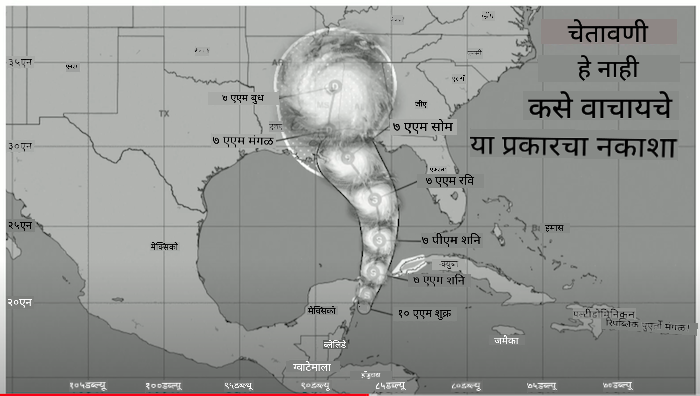
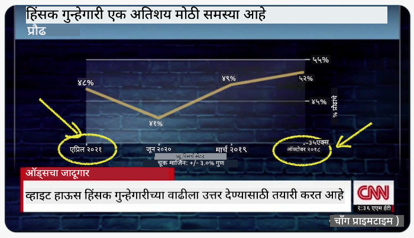
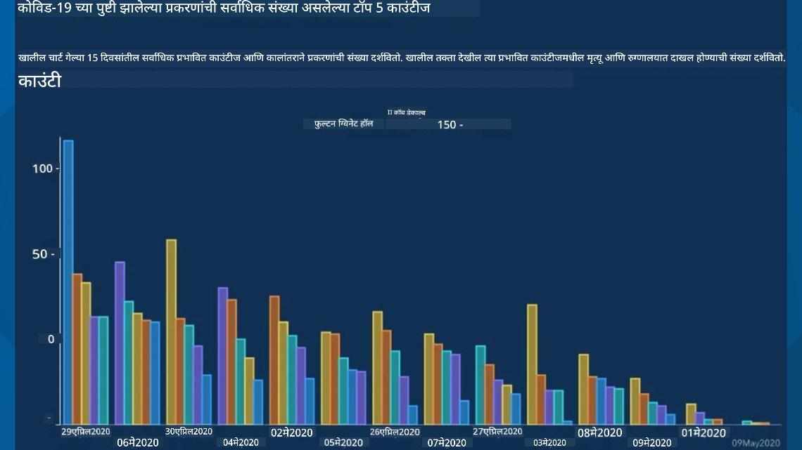
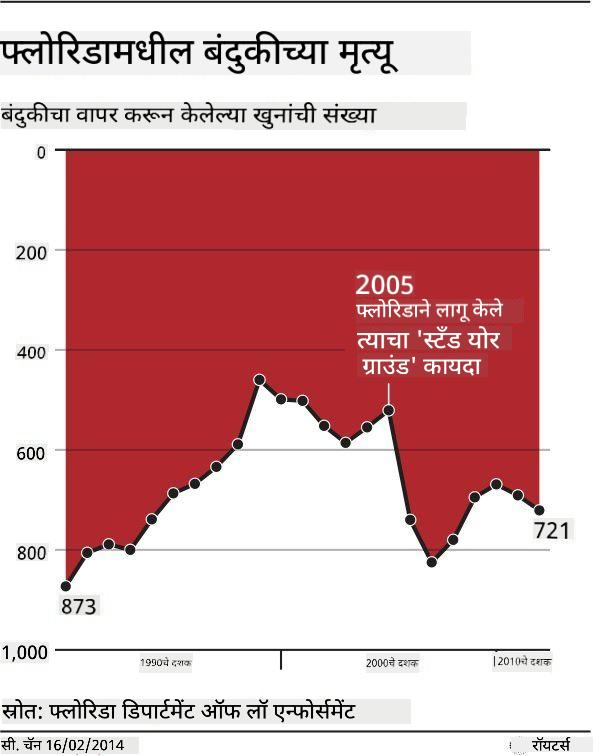
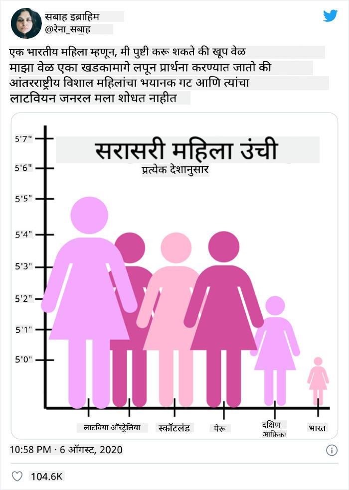
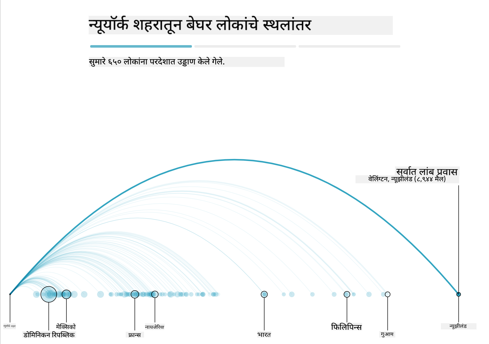
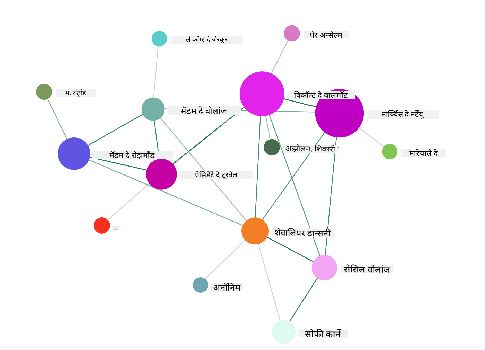

<!--
CO_OP_TRANSLATOR_METADATA:
{
  "original_hash": "b4039f1c76548d144a0aee0bf28304ec",
  "translation_date": "2025-08-27T18:34:12+00:00",
  "source_file": "3-Data-Visualization/R/13-meaningful-vizualizations/README.md",
  "language_code": "mr"
}
-->
# अर्थपूर्ण दृश्यांकन तयार करणे

| ](../../../sketchnotes/13-MeaningfulViz.png)|
|:---:|
| अर्थपूर्ण दृश्यांकन - _Sketchnote by [@nitya](https://twitter.com/nitya)_ |

> "जर तुम्ही डेटा पुरेसा त्रास दिला, तर तो काहीही कबूल करेल" -- [Ronald Coase](https://en.wikiquote.org/wiki/Ronald_Coase)

डेटा वैज्ञानिकाची एक मूलभूत कौशल्य म्हणजे अर्थपूर्ण डेटा दृश्यांकन तयार करण्याची क्षमता, ज्यामुळे तुम्हाला तुमचे प्रश्न सोडवण्यास मदत होते. तुमचा डेटा दृश्यात्मक करण्यापूर्वी, तुम्हाला तो स्वच्छ आणि तयार केला आहे याची खात्री करावी लागेल, जसे तुम्ही मागील धड्यांमध्ये केले. त्यानंतर, तुम्ही डेटा कसा सादर करायचा हे ठरवायला सुरुवात करू शकता.

या धड्यात तुम्ही पुनरावलोकन कराल:

1. योग्य चार्ट प्रकार कसा निवडायचा
2. फसव्या चार्टिंगपासून कसे टाळावे
3. रंगासोबत कसे काम करायचे
4. वाचनीयतेसाठी तुमचे चार्ट कसे स्टाइल करायचे
5. अॅनिमेटेड किंवा 3D चार्टिंग सोल्यूशन्स कसे तयार करायचे
6. सर्जनशील दृश्यांकन कसे तयार करायचे

## [पूर्व-व्याख्यान प्रश्नमंजुषा](https://purple-hill-04aebfb03.1.azurestaticapps.net/quiz/24)

## योग्य चार्ट प्रकार निवडा

मागील धड्यांमध्ये, तुम्ही Matplotlib आणि Seaborn वापरून विविध प्रकारचे डेटा दृश्यांकन तयार करण्याचा प्रयोग केला. सामान्यतः, तुम्ही विचारत असलेल्या प्रश्नासाठी [योग्य प्रकारचा चार्ट](https://chartio.com/learn/charts/how-to-select-a-data-vizualization/) निवडण्यासाठी खालील तक्ता वापरू शकता:

| तुम्हाला करायचे आहे:         | तुम्ही वापरावे:                 |
| -------------------------- | ------------------------------- |
| वेळेनुसार डेटा ट्रेंड दाखवा | लाइन                            |
| श्रेणींची तुलना करा         | बार, पाई                        |
| एकूणांची तुलना करा          | पाई, स्टॅक्ड बार                |
| नातेसंबंध दाखवा             | स्कॅटर, लाइन, फेसट, ड्युअल लाइन |
| वितरण दाखवा                 | स्कॅटर, हिस्टोग्राम, बॉक्स       |
| प्रमाण दाखवा                | पाई, डोनट, वाफल                |

> ✅ तुमच्या डेटाच्या स्वरूपानुसार, तुम्हाला ते टेक्स्टमधून संख्यात्मक स्वरूपात रूपांतरित करावे लागेल, जेणेकरून दिलेला चार्ट त्याला समर्थन देईल.

## फसवणूक टाळा

जरी डेटा वैज्ञानिक योग्य डेटा साठी योग्य चार्ट निवडण्यात काळजी घेत असेल, तरीही डेटा अशा प्रकारे प्रदर्शित केला जाऊ शकतो ज्यामुळे मुद्दा सिद्ध होतो, परंतु अनेकदा डेटा स्वतःच कमजोर होतो. फसव्या चार्ट्स आणि इन्फोग्राफिक्सचे अनेक उदाहरणे आहेत!

[](https://www.youtube.com/watch?v=oX74Nge8Wkw "How charts lie")

> 🎥 वरील प्रतिमेवर क्लिक करा फसव्या चार्ट्सबद्दलच्या परिषदेतल्या चर्चेसाठी

हा चार्ट X अक्ष उलटवतो, जेणेकरून तारीख आधारित सत्याच्या उलट दाखवले जाते:



[हा चार्ट](https://media.firstcoastnews.com/assets/WTLV/images/170ae16f-4643-438f-b689-50d66ca6a8d8/170ae16f-4643-438f-b689-50d66ca6a8d8_1140x641.jpg) आणखी फसवणूक करणारा आहे, कारण डोळा उजवीकडे जातो आणि असा निष्कर्ष काढतो की, कालांतराने, विविध काउंटीजमध्ये COVID प्रकरणे कमी झाली आहेत. प्रत्यक्षात, जर तुम्ही तारखांकडे बारकाईने पाहिले, तर तुम्हाला आढळेल की त्या फसव्या उतरणाऱ्या ट्रेंडसाठी पुन्हा व्यवस्था करण्यात आल्या आहेत.



हा कुप्रसिद्ध उदाहरण रंग आणि उलटवलेल्या Y अक्षाचा वापर करून फसवणूक करतो: बंदूक-संबंधित कायदे लागू झाल्यानंतर बंदूक मृत्यू वाढले, असे निष्कर्ष काढण्याऐवजी, प्रत्यक्षात डोळा उलट विचार करतो:



हा विचित्र चार्ट दाखवतो की प्रमाण कसे हसण्यासारखे परिणाम देण्यासाठी बदलले जाऊ शकते:



अतुलनीय गोष्टींची तुलना करणे हा आणखी एक छुपा युक्ती आहे. [एक अप्रतिम वेबसाइट](https://tylervigen.com/spurious-correlations) 'स्प्युरियस करिलेशन्स' बद्दल 'तथ्ये' प्रदर्शित करते, जसे की मेनमधील घटस्फोट दर आणि मार्जरीनचा वापर. रेडिट ग्रुप देखील डेटाच्या [अगदी वाईट उपयोग](https://www.reddit.com/r/dataisugly/top/?t=all) गोळा करतो.

फसव्या चार्ट्सद्वारे डोळा किती सहज फसवला जाऊ शकतो हे समजून घेणे महत्त्वाचे आहे. जरी डेटा वैज्ञानिकाचा हेतू चांगला असला तरी, खराब प्रकारचा चार्ट निवडणे, जसे की खूप जास्त श्रेणी दाखवणारा पाई चार्ट, फसवणूक करणारा ठरू शकतो.

## रंग

तुम्ही वर 'फ्लोरिडा गन व्हायोलन्स' चार्टमध्ये पाहिले की रंग चार्ट्समध्ये अतिरिक्त अर्थाचा स्तर प्रदान करू शकतो, विशेषतः जे ggplot2 आणि RColorBrewer सारख्या लायब्ररी वापरून डिझाइन केलेले नाहीत, ज्यामध्ये विविध प्रमाणित रंग लायब्ररी आणि पॅलेट्स असतात. जर तुम्ही चार्ट हाताने तयार करत असाल, तर [रंग सिद्धांत](https://colormatters.com/color-and-design/basic-color-theory) याचा थोडा अभ्यास करा.

> ✅ चार्ट डिझाइन करताना, अॅक्सेसिबिलिटी हा दृश्यांकनाचा एक महत्त्वाचा पैलू आहे हे लक्षात ठेवा. तुमचे काही वापरकर्ते रंगांध असू शकतात - तुमचा चार्ट व्हिज्युअल इम्पेअरमेंट असलेल्या वापरकर्त्यांसाठी चांगला दिसतो का?

तुमच्या चार्टसाठी रंग निवडताना काळजी घ्या, कारण रंग तुमच्या इच्छित नसलेल्या अर्थाचा संकेत देऊ शकतो. वर 'हाइट' चार्टमधील 'पिंक लेडीज' एक वेगळा 'स्त्रीलिंगी' अर्थ देतात, ज्यामुळे चार्ट स्वतःच विचित्र वाटतो.

जरी [रंगाचा अर्थ](https://colormatters.com/color-symbolism/the-meanings-of-colors) वेगवेगळ्या भागांमध्ये वेगळा असू शकतो आणि त्याच्या छटेनुसार बदलत असतो, तरी सामान्यतः रंगाचे अर्थ खालीलप्रमाणे असतात:

| रंग    | अर्थ                 |
| ------ | ------------------- |
| लाल    | शक्ती               |
| निळा   | विश्वास, निष्ठा      |
| पिवळा  | आनंद, सावधगिरी     |
| हिरवा  | पर्यावरण, नशीब, मत्सर |
| जांभळा | आनंद                |
| नारंगी | उत्साह              |

जर तुम्हाला कस्टम रंगांसह चार्ट तयार करण्याचे काम दिले गेले असेल, तर तुमचे चार्ट अॅक्सेसिबल आहेत आणि तुम्ही निवडलेला रंग तुम्ही व्यक्त करू इच्छित असलेल्या अर्थाशी जुळतो याची खात्री करा.

## वाचनीयतेसाठी तुमचे चार्ट स्टाइल करा

चार्ट अर्थपूर्ण नसतात जर ते वाचनीय नसतील! तुमच्या डेटासह चांगल्या प्रकारे स्केल करण्यासाठी तुमच्या चार्टची रुंदी आणि उंची स्टाइल करण्याचा विचार करा. जर एक व्हेरिएबल (जसे की सर्व 50 राज्ये) प्रदर्शित करायचे असेल, तर ते शक्य असल्यास Y अक्षावर उभे दाखवा, जेणेकरून आडव्या-स्क्रोलिंग चार्ट टाळता येईल.

तुमच्या अक्षांना लेबल द्या, आवश्यक असल्यास एक लेजेंड प्रदान करा आणि डेटा चांगल्या प्रकारे समजण्यासाठी टूलटिप्स ऑफर करा.

जर तुमचा डेटा X अक्षावर टेक्स्ट स्वरूपात आणि विस्तृत असेल, तर वाचनीयतेसाठी टेक्स्ट अँगल करा. [plot3D](https://cran.r-project.org/web/packages/plot3D/index.html) 3D प्लॉटिंग ऑफर करते, जर तुमचा डेटा त्याला समर्थन देत असेल. त्याचा वापर करून प्रगत डेटा दृश्यांकन तयार करता येते.


## अॅनिमेशन आणि 3D चार्ट प्रदर्शन

आजकाल काही सर्वोत्तम डेटा दृश्यांकन अॅनिमेटेड आहेत. Shirley Wu ने D3 वापरून केलेली अप्रतिम उदाहरणे आहेत, जसे '[film flowers](http://bl.ocks.org/sxywu/raw/d612c6c653fb8b4d7ff3d422be164a5d/)', जिथे प्रत्येक फूल एका चित्रपटाचे दृश्यांकन आहे. गार्डियनसाठी आणखी एक उदाहरण आहे 'bussed out', एक परस्पर अनुभव जो दृश्यांकन Greensock आणि D3 सह स्क्रोलिटेलिंग लेख स्वरूपात NYC कसे त्याच्या बेघर लोकांना शहराबाहेर पाठवते हे दाखवतो.



> "Bussed Out: How America Moves its Homeless" [गार्डियन](https://www.theguardian.com/us-news/ng-interactive/2017/dec/20/bussed-out-america-moves-homeless-people-country-study) कडून. दृश्यांकन Nadieh Bremer & Shirley Wu यांनी.

जरी हा धडा या शक्तिशाली दृश्यांकन लायब्ररी शिकवण्यासाठी पुरेसा नाही, तरी Vue.js अॅपमध्ये D3 वापरून 'Dangerous Liaisons' या पुस्तकाचे अॅनिमेटेड सोशल नेटवर्क दृश्यांकन तयार करण्याचा प्रयत्न करा.

> "Les Liaisons Dangereuses" हे पत्रांच्या मालिकेच्या स्वरूपात सादर केलेले एक कादंबरी आहे. 1782 मध्ये Choderlos de Laclos यांनी लिहिलेले, हे फ्रेंच अभिजात वर्गातील दोन प्रतिस्पर्धी नायक, Vicomte de Valmont आणि Marquise de Merteuil यांच्या सामाजिक युक्त्या आणि त्यांच्या पतनाची कथा सांगते. कादंबरी पत्रांच्या मालिकेच्या स्वरूपात उलगडते, ज्यामध्ये सूड घेण्याचे किंवा फक्त त्रास देण्याचे कट रचले जातात. या पत्रांचे दृश्यांकन तयार करा जेणेकरून कथानकातील प्रमुख पात्रे दृश्यात्मकपणे शोधता येतील.

तुम्ही एक वेब अॅप पूर्ण कराल जे या सामाजिक नेटवर्कचे अॅनिमेटेड दृश्य प्रदर्शित करेल. Vue.js आणि D3 वापरून नेटवर्कचे [दृश्य](https://github.com/emiliorizzo/vue-d3-network) तयार करण्यासाठी एक लायब्ररी वापरली जाते. अॅप चालू असताना, तुम्ही स्क्रीनवर नोड्स खेचून डेटा हलवू शकता.



## प्रकल्प: D3.js वापरून नेटवर्क दाखवणारा चार्ट तयार करा

> या धड्याच्या फोल्डरमध्ये एक `solution` फोल्डर समाविष्ट आहे जिथे तुम्ही पूर्ण प्रकल्प संदर्भासाठी शोधू शकता.

1. स्टार्टर फोल्डरच्या मूळमध्ये README.md फाइलमधील सूचना अनुसरा. तुमच्या मशीनवर NPM आणि Node.js चालू असल्याची खात्री करा आणि नंतर तुमच्या प्रकल्पाच्या dependencies इंस्टॉल करा.

2. `starter/src` फोल्डर उघडा. तुम्हाला एक `assets` फोल्डर सापडेल जिथे कादंबरीतील सर्व पत्रे असलेली .json फाइल आहे, क्रमांकित, 'to' आणि 'from' annotation सह.

3. `components/Nodes.vue` मध्ये कोड पूर्ण करा जेणेकरून दृश्य सक्षम होईल. `createLinks()` नावाच्या पद्धतीसाठी शोधा आणि खालील nested loop जोडा.

.json ऑब्जेक्टमधून 'to' आणि 'from' डेटा पत्रांसाठी कॅप्चर करा आणि `links` ऑब्जेक्ट तयार करा जेणेकरून दृश्यांकन लायब्ररी त्याचा वापर करू शकेल:

```javascript
//loop through letters
      let f = 0;
      let t = 0;
      for (var i = 0; i < letters.length; i++) {
          for (var j = 0; j < characters.length; j++) {
              
            if (characters[j] == letters[i].from) {
              f = j;
            }
            if (characters[j] == letters[i].to) {
              t = j;
            }
        }
        this.links.push({ sid: f, tid: t });
      }
  ```

तुमचा अॅप टर्मिनलमधून चालवा (npm run serve) आणि दृश्याचा आनंद घ्या!

## 🚀 आव्हान

इंटरनेटवर फसव्या दृश्यांकनांचा शोध घ्या. लेखक वापरकर्त्याला कसा फसवतो आणि तो हेतुपुरस्सर आहे का? दृश्यांकन योग्य प्रकारे कसे दिसावे हे दाखवण्यासाठी त्यांना सुधारण्याचा प्रयत्न करा.

## [व्याख्यानानंतरची प्रश्नमंजुषा](https://purple-hill-04aebfb03.1.azurestaticapps.net/quiz/25)

## पुनरावलोकन आणि स्व-अभ्यास

फसव्या डेटा दृश्यांकनाबद्दल वाचण्यासाठी काही लेख येथे आहेत:

https://gizmodo.com/how-to-lie-with-data-visualization-1563576606

http://ixd.prattsi.org/2017/12/visual-lies-usability-in-deceptive-data-visualizations/

ऐतिहासिक मालमत्ता आणि वस्तूंसाठी काही मनोरंजक दृश्यांकन येथे पहा:

https://handbook.pubpub.org/

अॅनिमेशन तुमच्या दृश्यांकनांना कसे सुधारू शकते याबद्दल या लेखाकडे पहा:

https://medium.com/@EvanSinar/use-animation-to-supercharge-data-visualization-cd905a882ad4

## असाइनमेंट

[तुमचे स्वतःचे कस्टम दृश्यांकन तयार करा](assignment.md)

---

**अस्वीकरण**:  
हा दस्तऐवज AI भाषांतर सेवा [Co-op Translator](https://github.com/Azure/co-op-translator) चा वापर करून भाषांतरित करण्यात आला आहे. आम्ही अचूकतेसाठी प्रयत्नशील असलो तरी, कृपया लक्षात घ्या की स्वयंचलित भाषांतरांमध्ये त्रुटी किंवा अचूकतेचा अभाव असू शकतो. मूळ भाषेतील मूळ दस्तऐवज हा अधिकृत स्रोत मानला जावा. महत्त्वाच्या माहितीसाठी, व्यावसायिक मानवी भाषांतराची शिफारस केली जाते. या भाषांतराचा वापर करून उद्भवलेल्या कोणत्याही गैरसमज किंवा चुकीच्या अर्थासाठी आम्ही जबाबदार राहणार नाही.