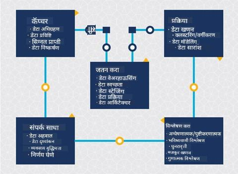
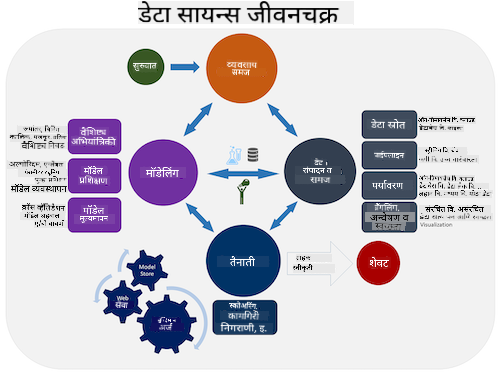
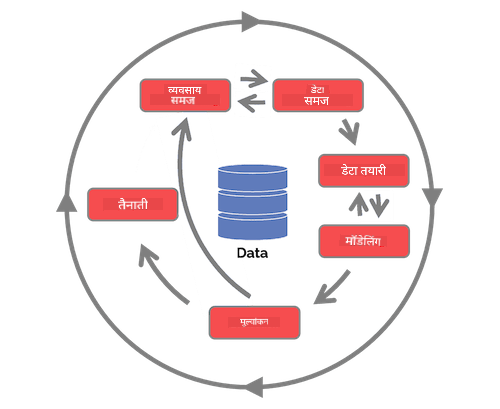

<!--
CO_OP_TRANSLATOR_METADATA:
{
  "original_hash": "79ca8a5a3135e94d2d43f56ba62d5205",
  "translation_date": "2025-09-04T16:46:27+00:00",
  "source_file": "4-Data-Science-Lifecycle/14-Introduction/README.md",
  "language_code": "mr"
}
-->
# डेटा सायन्स जीवनचक्राची ओळख

| ](../../sketchnotes/14-DataScience-Lifecycle.png)|
|:---:|
| डेटा सायन्स जीवनचक्राची ओळख - _Sketchnote by [@nitya](https://twitter.com/nitya)_ |

## [पूर्व-व्याख्यान प्रश्नमंजूषा](https://red-water-0103e7a0f.azurestaticapps.net/quiz/26)

आतापर्यंत तुम्हाला कदाचित हे लक्षात आले असेल की डेटा सायन्स हा एक प्रक्रिया आहे. ही प्रक्रिया 5 टप्प्यांमध्ये विभागली जाऊ शकते:

- डेटा संकलन
- प्रक्रिया
- विश्लेषण
- संवाद
- देखभाल

या धड्यात जीवनचक्राच्या 3 भागांवर लक्ष केंद्रित केले आहे: डेटा संकलन, प्रक्रिया आणि देखभाल.

> फोटो [Berkeley School of Information](https://ischoolonline.berkeley.edu/data-science/what-is-data-science/) यांच्याकडून

## डेटा संकलन

जीवनचक्राचा पहिला टप्पा अत्यंत महत्त्वाचा आहे कारण पुढील टप्पे त्यावर अवलंबून असतात. हा टप्पा प्रत्यक्षात दोन टप्प्यांचा एकत्रित भाग आहे: डेटा मिळवणे आणि उद्दिष्टे व समस्यांचे परिभाषित करणे ज्यावर काम करायचे आहे.  
प्रकल्पाचे उद्दिष्टे परिभाषित करण्यासाठी समस्येचा किंवा प्रश्नाचा सखोल संदर्भ आवश्यक आहे. प्रथम, आपल्याला त्या व्यक्तींची ओळख पटवावी लागेल ज्यांना त्यांची समस्या सोडवायची आहे. हे व्यवसायातील भागधारक किंवा प्रकल्पाचे प्रायोजक असू शकतात, जे प्रकल्पाचा लाभ कोणाला होईल, काय आणि का आवश्यक आहे हे ओळखण्यात मदत करू शकतात. चांगले परिभाषित उद्दिष्ट मोजता येण्याजोगे आणि प्रमाणित असावे जेणेकरून स्वीकारार्ह परिणाम परिभाषित करता येईल.

डेटा सायंटिस्ट विचारू शकणारे प्रश्न:
-	ही समस्या यापूर्वी सोडवण्याचा प्रयत्न झाला आहे का? काय शोधले गेले?
-	सर्व संबंधित व्यक्तींना उद्दिष्टे आणि हेतू समजले आहेत का?
-	अस्पष्टता आहे का आणि ती कशी कमी करायची?
-	मर्यादा काय आहेत?
-	अंतिम परिणाम कसा दिसेल?
-	किती संसाधने (वेळ, लोक, संगणकीय) उपलब्ध आहेत?

यानंतर, परिभाषित उद्दिष्टे साध्य करण्यासाठी आवश्यक डेटा ओळखणे, गोळा करणे आणि त्याचा शोध घेणे आवश्यक आहे. डेटा मिळवण्याच्या या टप्प्यावर, डेटा सायंटिस्ट्सना डेटाची मात्रा आणि गुणवत्ता देखील तपासावी लागते. यासाठी डेटा एक्सप्लोरेशन आवश्यक आहे जेणेकरून मिळवलेला डेटा अपेक्षित परिणाम साध्य करण्यात मदत करेल याची खात्री करता येईल.

डेटाबद्दल डेटा सायंटिस्ट विचारू शकणारे प्रश्न:
-	माझ्याकडे आधीच कोणता डेटा उपलब्ध आहे?
-	हा डेटा कोणाचा आहे?
-	गोपनीयतेशी संबंधित चिंता काय आहेत?
-	ही समस्या सोडवण्यासाठी पुरेसा डेटा आहे का?
-	ही समस्या सोडवण्यासाठी डेटा स्वीकारार्ह गुणवत्तेचा आहे का?
-	जर मला या डेटामधून अतिरिक्त माहिती सापडली तर आपण उद्दिष्टे बदलण्याचा किंवा पुन्हा परिभाषित करण्याचा विचार करावा का?

## प्रक्रिया

जीवनचक्राचा प्रक्रिया टप्पा डेटामधील नमुने शोधणे तसेच मॉडेलिंगवर लक्ष केंद्रित करतो. प्रक्रिया टप्प्यात वापरल्या जाणाऱ्या काही तंत्रांमध्ये नमुने शोधण्यासाठी सांख्यिकीय पद्धतींचा समावेश होतो. मोठ्या डेटासेटसह मानवी हस्तक्षेपासाठी हे सामान्यतः कंटाळवाणे काम असते आणि प्रक्रिया गतीने पूर्ण करण्यासाठी संगणकावर अवलंबून राहावे लागते. या टप्प्यावर डेटा सायन्स आणि मशीन लर्निंग एकत्र येतात. तुम्ही पहिल्या धड्यात शिकले, मशीन लर्निंग म्हणजे डेटा समजून घेण्यासाठी मॉडेल तयार करण्याची प्रक्रिया. मॉडेल्स म्हणजे डेटामधील व्हेरिएबल्समधील संबंधांचे प्रतिनिधित्व जे परिणामांची भविष्यवाणी करण्यात मदत करतात.

या टप्प्यात वापरल्या जाणाऱ्या सामान्य तंत्रांचा समावेश ML for Beginners अभ्यासक्रमात आहे. अधिक जाणून घेण्यासाठी खालील लिंकवर क्लिक करा:

- [Classification](https://github.com/microsoft/ML-For-Beginners/tree/main/4-Classification): डेटा अधिक कार्यक्षमतेने वापरण्यासाठी श्रेणींमध्ये वर्गीकृत करणे.
- [Clustering](https://github.com/microsoft/ML-For-Beginners/tree/main/5-Clustering): समान गटांमध्ये डेटा गटबद्ध करणे.
- [Regression](https://github.com/microsoft/ML-For-Beginners/tree/main/2-Regression): व्हेरिएबल्समधील संबंध निश्चित करणे जेणेकरून मूल्ये अंदाज किंवा पूर्वानुमान करता येतील.

## देखभाल

जीवनचक्राच्या आकृतीमध्ये, तुम्ही पाहिले असेल की देखभाल डेटा संकलन आणि प्रक्रिया यांच्यामध्ये आहे. देखभाल म्हणजे प्रकल्पाच्या प्रक्रियेदरम्यान डेटा व्यवस्थापित करणे, साठवणे आणि सुरक्षित ठेवणे आणि प्रकल्पाच्या संपूर्ण कालावधीत त्याचा विचार करणे आवश्यक आहे.

### डेटा साठवणे

डेटा कसा आणि कुठे साठवायचा याचा विचार साठवणीचा खर्च तसेच डेटा किती वेगाने प्रवेश केला जाऊ शकतो यावर परिणाम करू शकतो. अशा निर्णयांचा डेटा सायंटिस्टने एकट्याने विचार केला नाही तरीही डेटा कसा साठवला जातो यावर आधारित डेटा कसा हाताळायचा याबाबत निवडी कराव्या लागतात.

आधुनिक डेटा साठवण प्रणालींचे काही पैलू येथे दिले आहेत जे या निवडींवर परिणाम करू शकतात:

**ऑन-प्रिमाइसेस विरुद्ध ऑफ-प्रिमाइसेस विरुद्ध सार्वजनिक किंवा खाजगी क्लाउड**

ऑन-प्रिमाइसेस म्हणजे डेटा स्वतःच्या उपकरणांवर होस्ट करणे आणि व्यवस्थापित करणे, जसे की डेटा साठवणारे हार्ड ड्राइव्ह असलेले सर्व्हर, तर ऑफ-प्रिमाइसेस म्हणजे तुम्ही मालकी नसलेल्या उपकरणांवर अवलंबून राहणे, जसे की डेटा सेंटर. सार्वजनिक क्लाउड ही डेटा साठवण्यासाठी लोकप्रिय निवड आहे ज्यासाठी डेटा कसा किंवा कुठे साठवला जातो याची माहिती आवश्यक नसते, जिथे सार्वजनिक म्हणजे एकसंध पायाभूत सुविधा जी क्लाउड वापरणाऱ्या सर्वांसाठी सामायिक असते. काही संस्थांमध्ये कठोर सुरक्षा धोरणे असतात ज्यासाठी त्यांना डेटा होस्ट केलेल्या उपकरणांवर पूर्ण प्रवेश आवश्यक असतो आणि ते स्वतःच्या क्लाउड सेवांसह खाजगी क्लाउडवर अवलंबून असतात. तुम्ही [पुढील धड्यांमध्ये](https://github.com/microsoft/Data-Science-For-Beginners/tree/main/5-Data-Science-In-Cloud) क्लाउडमधील डेटाबद्दल अधिक शिकाल.

**कोल्ड विरुद्ध हॉट डेटा**

तुम्ही तुमचे मॉडेल्स प्रशिक्षण देत असताना तुम्हाला अधिक प्रशिक्षण डेटा आवश्यक असू शकतो. जर तुम्ही तुमच्या मॉडेलवर समाधानी असाल, तर मॉडेल त्याच्या उद्देशासाठी डेटा प्राप्त करेल. कोणत्याही परिस्थितीत, डेटा साठवण्याचा आणि त्याचा प्रवेश करण्याचा खर्च वाढेल कारण तुम्ही अधिक डेटा जमा करता. क्वचितच वापरला जाणारा डेटा, ज्याला कोल्ड डेटा म्हणतात, वारंवार प्रवेश केला जाणाऱ्या हॉट डेटापेक्षा स्वस्त साठवण पर्याय असू शकतो हार्डवेअर किंवा सॉफ्टवेअर सेवांद्वारे. जर कोल्ड डेटाचा प्रवेश करणे आवश्यक असेल, तर हॉट डेटाच्या तुलनेत ते पुनर्प्राप्त करण्यासाठी थोडा वेळ लागू शकतो.

### डेटा व्यवस्थापन

डेटासह काम करताना तुम्हाला असे आढळू शकते की काही डेटा स्वच्छ करण्याची आवश्यकता आहे, जे [डेटा तयारी](https://github.com/microsoft/Data-Science-For-Beginners/tree/main/2-Working-With-Data/08-data-preparation) धड्यात समाविष्ट केलेल्या तंत्रांचा वापर करून अचूक मॉडेल तयार करण्यासाठी आवश्यक आहे. जेव्हा नवीन डेटा येतो, तेव्हा गुणवत्ता सुसंगतता राखण्यासाठी त्याच अनुप्रयोगांची आवश्यकता असेल. काही प्रकल्पांमध्ये डेटा त्याच्या अंतिम स्थानावर हलवण्यापूर्वी स्वच्छता, एकत्रीकरण आणि संक्षेपणासाठी स्वयंचलित साधनांचा वापर समाविष्ट असेल. Azure Data Factory हे अशा साधनांचे एक उदाहरण आहे.

### डेटा सुरक्षित ठेवणे

डेटा सुरक्षित ठेवण्याचे मुख्य उद्दिष्ट म्हणजे डेटा कसा गोळा केला जातो आणि कोणत्या संदर्भात तो वापरला जातो यावर काम करणाऱ्यांचे नियंत्रण सुनिश्चित करणे. डेटा सुरक्षित ठेवणे म्हणजे फक्त त्यांना प्रवेश मर्यादित करणे ज्यांना त्याची आवश्यकता आहे, स्थानिक कायदे आणि नियमांचे पालन करणे, तसेच [नैतिकता धड्यात](https://github.com/microsoft/Data-Science-For-Beginners/tree/main/1-Introduction/02-ethics) समाविष्ट केलेल्या नैतिक मानकांचे पालन करणे.

सुरक्षेच्या दृष्टीने एखादी टीम करू शकणाऱ्या गोष्टी येथे दिल्या आहेत:
- सर्व डेटा एन्क्रिप्ट केला आहे याची खात्री करा
- ग्राहकांना त्यांचा डेटा कसा वापरला जातो याची माहिती द्या
- प्रकल्प सोडलेल्या व्यक्तींकडून डेटा प्रवेश काढून टाका
- फक्त विशिष्ट प्रकल्प सदस्यांना डेटा बदलण्याची परवानगी द्या

## 🚀 आव्हान

डेटा सायन्स जीवनचक्राच्या अनेक आवृत्त्या आहेत, जिथे प्रत्येक टप्प्याला वेगवेगळी नावे आणि टप्प्यांची संख्या असू शकते, परंतु या धड्यात नमूद केलेल्या प्रक्रियांचा समावेश असेल.

[Team Data Science Process जीवनचक्र](https://docs.microsoft.com/en-us/azure/architecture/data-science-process/lifecycle) आणि [Cross-industry standard process for data mining](https://www.datascience-pm.com/crisp-dm-2/) यांचा अभ्यास करा. त्यामधील 3 साम्ये आणि फरक सांगा.

|Team Data Science Process (TDSP)|Cross-industry standard process for data mining (CRISP-DM)|
|--|--|
| |  |
| Image by [Microsoft](https://docs.microsoft.comazure/architecture/data-science-process/lifecycle) | Image by [Data Science Process Alliance](https://www.datascience-pm.com/crisp-dm-2/) |

## [व्याख्यानानंतरची प्रश्नमंजूषा](https://ff-quizzes.netlify.app/en/ds/)

## पुनरावलोकन आणि स्व-अभ्यास

डेटा सायन्स जीवनचक्र लागू करणे यामध्ये अनेक भूमिका आणि कार्यांचा समावेश होतो, जिथे काही विशिष्ट टप्प्यांवर लक्ष केंद्रित करतात. Team Data Science Process काही संसाधने प्रदान करते जी प्रकल्पामध्ये एखाद्याची भूमिका आणि कार्ये स्पष्ट करतात.

* [Team Data Science Process भूमिका आणि कार्ये](https://docs.microsoft.com/en-us/azure/architecture/data-science-process/roles-tasks)
* [डेटा सायन्स कार्ये अंमलात आणा: एक्सप्लोरेशन, मॉडेलिंग आणि डिप्लॉयमेंट](https://docs.microsoft.com/en-us/azure/architecture/data-science-process/execute-data-science-tasks)

## असाइनमेंट

[डेटासेटचे मूल्यांकन](assignment.md)

---

**अस्वीकरण**:  
हा दस्तऐवज AI भाषांतर सेवा [Co-op Translator](https://github.com/Azure/co-op-translator) चा वापर करून भाषांतरित करण्यात आला आहे. आम्ही अचूकतेसाठी प्रयत्नशील असलो तरी, कृपया लक्षात घ्या की स्वयंचलित भाषांतरांमध्ये त्रुटी किंवा अचूकतेचा अभाव असू शकतो. मूळ भाषेतील मूळ दस्तऐवज हा अधिकृत स्रोत मानला जावा. महत्त्वाच्या माहितीसाठी व्यावसायिक मानवी भाषांतराची शिफारस केली जाते. या भाषांतराचा वापर केल्यामुळे उद्भवणाऱ्या कोणत्याही गैरसमज किंवा चुकीच्या अर्थासाठी आम्ही जबाबदार राहणार नाही.