<!--
CO_OP_TRANSLATOR_METADATA:
{
  "original_hash": "39f3b3a9d873eaa522c2e792ce0ca503",
  "translation_date": "2025-09-04T16:38:40+00:00",
  "source_file": "5-Data-Science-In-Cloud/18-Low-Code/README.md",
  "language_code": "mr"
}
-->
# क्लाउडमधील डेटा सायन्स: "लो कोड/नो कोड" पद्धत

| ](../../sketchnotes/18-DataScience-Cloud.png)|
|:---:|
| क्लाउडमधील डेटा सायन्स: लो कोड - _Sketchnote by [@nitya](https://twitter.com/nitya)_ |

सामग्रीची यादी:

- [क्लाउडमधील डेटा सायन्स: "लो कोड/नो कोड" पद्धत](../../../../5-Data-Science-In-Cloud/18-Low-Code)
  - [पूर्व-व्याख्यान प्रश्नमंजुषा](../../../../5-Data-Science-In-Cloud/18-Low-Code)
  - [1. परिचय](../../../../5-Data-Science-In-Cloud/18-Low-Code)
    - [1.1 Azure Machine Learning म्हणजे काय?](../../../../5-Data-Science-In-Cloud/18-Low-Code)
    - [1.2 हार्ट फेल्युअर प्रेडिक्शन प्रोजेक्ट:](../../../../5-Data-Science-In-Cloud/18-Low-Code)
    - [1.3 हार्ट फेल्युअर डेटासेट:](../../../../5-Data-Science-In-Cloud/18-Low-Code)
  - [2. Azure ML Studio मध्ये लो कोड/नो कोड पद्धतीने मॉडेल प्रशिक्षण](../../../../5-Data-Science-In-Cloud/18-Low-Code)
    - [2.1 Azure ML workspace तयार करा](../../../../5-Data-Science-In-Cloud/18-Low-Code)
    - [2.2 Compute Resources](../../../../5-Data-Science-In-Cloud/18-Low-Code)
      - [2.2.1 Compute Resources साठी योग्य पर्याय निवडणे](../../../../5-Data-Science-In-Cloud/18-Low-Code)
      - [2.2.2 Compute Cluster तयार करणे](../../../../5-Data-Science-In-Cloud/18-Low-Code)
    - [2.3 डेटासेट लोड करणे](../../../../5-Data-Science-In-Cloud/18-Low-Code)
    - [2.4 AutoML सह लो कोड/नो कोड प्रशिक्षण](../../../../5-Data-Science-In-Cloud/18-Low-Code)
  - [3. लो कोड/नो कोड मॉडेल डिप्लॉयमेंट आणि एंडपॉइंट वापर](../../../../5-Data-Science-In-Cloud/18-Low-Code)
    - [3.1 मॉडेल डिप्लॉयमेंट](../../../../5-Data-Science-In-Cloud/18-Low-Code)
    - [3.2 एंडपॉइंट वापर](../../../../5-Data-Science-In-Cloud/18-Low-Code)
  - [🚀 आव्हान](../../../../5-Data-Science-In-Cloud/18-Low-Code)
  - [व्याख्यानानंतरची प्रश्नमंजुषा](../../../../5-Data-Science-In-Cloud/18-Low-Code)
  - [पुनरावलोकन आणि स्व-अभ्यास](../../../../5-Data-Science-In-Cloud/18-Low-Code)
  - [असाइनमेंट](../../../../5-Data-Science-In-Cloud/18-Low-Code)
  
## [पूर्व-व्याख्यान प्रश्नमंजुषा](https://ff-quizzes.netlify.app/en/ds/)

## 1. परिचय
### 1.1 Azure Machine Learning म्हणजे काय?

Azure क्लाउड प्लॅटफॉर्ममध्ये 200 हून अधिक उत्पादने आणि क्लाउड सेवा आहेत, ज्यामुळे तुम्हाला नवीन उपाय तयार करण्यात मदत होते. डेटा सायंटिस्ट्स मोठ्या प्रमाणावर डेटा एक्सप्लोरिंग, प्री-प्रोसेसिंग आणि विविध प्रकारच्या मॉडेल-ट्रेनिंग अल्गोरिदम वापरून अचूक मॉडेल तयार करण्यासाठी प्रयत्न करतात. हे कार्य वेळखाऊ असते आणि महागड्या हार्डवेअरचा अकार्यक्षम वापर करते.

[Azure ML](https://docs.microsoft.com/azure/machine-learning/overview-what-is-azure-machine-learning?WT.mc_id=academic-77958-bethanycheum&ocid=AID3041109) ही Azure मध्ये मशीन लर्निंग सोल्यूशन्स तयार करण्यासाठी आणि ऑपरेट करण्यासाठी क्लाउड-आधारित प्लॅटफॉर्म आहे. यात डेटा तयार करणे, मॉडेल्स ट्रेन करणे, प्रेडिक्टिव्ह सर्व्हिसेस प्रकाशित करणे आणि त्यांचा वापर मॉनिटर करणे यासाठी अनेक वैशिष्ट्ये आणि क्षमता आहेत. सर्वात महत्त्वाचे म्हणजे, हे वेळखाऊ कार्ये स्वयंचलित करून डेटा सायंटिस्ट्सची कार्यक्षमता वाढवते; आणि मोठ्या प्रमाणात डेटा हाताळण्यासाठी प्रभावीपणे स्केल होणाऱ्या क्लाउड-आधारित Compute Resources वापरण्याची परवानगी देते, ज्यामुळे फक्त वापराच्या वेळीच खर्च होतो.

Azure ML डेटा सायंटिस्ट्स आणि डेव्हलपर्ससाठी मशीन लर्निंग वर्कफ्लो तयार करण्यासाठी आवश्यक असलेली सर्व साधने प्रदान करते. यात समाविष्ट आहे:

- **Azure Machine Learning Studio**: मॉडेल प्रशिक्षण, डिप्लॉयमेंट, ऑटोमेशन, ट्रॅकिंग आणि अॅसेट मॅनेजमेंटसाठी लो-कोड आणि नो-कोड पर्यायांसाठी वेब पोर्टल. स्टुडिओ Azure Machine Learning SDK सह एकत्रित अनुभव प्रदान करते.
- **Jupyter Notebooks**: जलद प्रोटोटाइप आणि ML मॉडेल्सची चाचणी.
- **Azure Machine Learning Designer**: लो-कोड वातावरणात प्रयोग तयार करण्यासाठी आणि पाइपलाइन्स डिप्लॉय करण्यासाठी ड्रॅग-एन-ड्रॉप मॉड्यूल्स.
- **Automated machine learning UI (AutoML)**: मशीन लर्निंग मॉडेल डेव्हलपमेंटच्या पुनरावृत्ती कार्यांना स्वयंचलित करते, उच्च स्केल, कार्यक्षमता आणि उत्पादकतेसह ML मॉडेल्स तयार करण्यास अनुमती देते, मॉडेल गुणवत्ता टिकवून ठेवते.
- **Data Labelling**: डेटा स्वयंचलितपणे लेबल करण्यासाठी सहाय्यक ML टूल.
- **Visual Studio Code साठी Machine learning extension**: ML प्रकल्प तयार करण्यासाठी आणि व्यवस्थापित करण्यासाठी पूर्ण-वैशिष्ट्यीकृत विकास वातावरण प्रदान करते.
- **Machine learning CLI**: कमांड लाइनवरून Azure ML Resources व्यवस्थापित करण्यासाठी आदेश प्रदान करते.
- **PyTorch, TensorFlow, Scikit-learn सारख्या ओपन-सोर्स फ्रेमवर्कसह एकत्रीकरण**: प्रशिक्षण, डिप्लॉयमेंट आणि एंड-टू-एंड मशीन लर्निंग प्रक्रिया व्यवस्थापित करण्यासाठी.
- **MLflow**: मशीन लर्निंग प्रयोगांच्या जीवनचक्राचे व्यवस्थापन करण्यासाठी ओपन-सोर्स लायब्ररी. **MLFlow Tracking** हे MLflow चे एक घटक आहे जे तुमच्या प्रशिक्षण रन मेट्रिक्स आणि मॉडेल आर्टिफॅक्ट्स लॉग आणि ट्रॅक करते, तुमच्या प्रयोगाच्या वातावरणाची पर्वा न करता.

### 1.2 हार्ट फेल्युअर प्रेडिक्शन प्रोजेक्ट:

प्रकल्प तयार करणे आणि तयार करणे ही तुमची कौशल्ये आणि ज्ञान तपासण्यासाठी सर्वोत्तम पद्धत आहे यात शंका नाही. या धड्यात, आम्ही Azure ML Studio मध्ये हार्ट फेल्युअर अटॅक्सच्या प्रेडिक्शनसाठी डेटा सायन्स प्रोजेक्ट तयार करण्याच्या दोन वेगवेगळ्या पद्धती एक्सप्लोर करणार आहोत: लो कोड/नो कोड आणि Azure ML SDK च्या माध्यमातून, खालील स्कीमामध्ये दाखवल्याप्रमाणे:

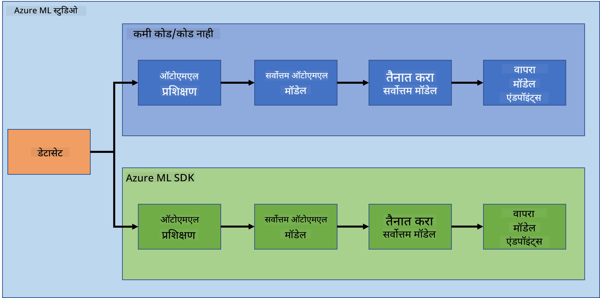

प्रत्येक पद्धतीचे स्वतःचे फायदे आणि तोटे आहेत. लो कोड/नो कोड पद्धत सुरू करण्यासाठी सोपी आहे कारण ती GUI (ग्राफिकल यूजर इंटरफेस) सह संवाद साधते, ज्यासाठी कोडचे पूर्वज्ञान आवश्यक नाही. ही पद्धत प्रकल्पाची व्यवहार्यता जलद चाचणी करण्यास आणि POC (Proof Of Concept) तयार करण्यास सक्षम करते. तथापि, प्रकल्प वाढत असताना आणि गोष्टी उत्पादनासाठी तयार करणे आवश्यक असताना, GUI द्वारे Resources तयार करणे व्यवहार्य नाही. आपल्याला Resources तयार करण्यापासून मॉडेल डिप्लॉयमेंटपर्यंत सर्व काही प्रोग्रामॅटिकली स्वयंचलित करणे आवश्यक आहे. यासाठी Azure ML SDK कसे वापरायचे हे जाणून घेणे महत्त्वाचे ठरते.

|                   | लो कोड/नो कोड | Azure ML SDK              |
|-------------------|------------------|---------------------------|
| कोडचे ज्ञान       | आवश्यक नाही     | आवश्यक                   |
| विकासासाठी वेळ    | जलद आणि सोपे    | कोड कौशल्यावर अवलंबून    |
| उत्पादनासाठी तयार| नाही             | होय                      |

### 1.3 हार्ट फेल्युअर डेटासेट:

कार्डिओव्हॅस्क्युलर आजार (CVDs) हे जागतिक स्तरावर मृत्यूचे क्रमांक 1 कारण आहेत, जे जगभरातील सर्व मृत्यूंपैकी 31% आहेत. तंबाखूचा वापर, अस्वास्थ्यकर आहार आणि स्थूलता, शारीरिक निष्क्रियता आणि अल्कोहोलचा हानिकारक वापर यासारखे पर्यावरणीय आणि वर्तनात्मक जोखीम घटक अंदाज मॉडेल्ससाठी वैशिष्ट्ये म्हणून वापरले जाऊ शकतात. CVD विकसित होण्याची शक्यता अंदाज करण्यास सक्षम असणे उच्च जोखीम असलेल्या लोकांमध्ये हृदयविकाराचा झटका टाळण्यासाठी खूप उपयुक्त ठरू शकते.

Kaggle ने [Heart Failure डेटासेट](https://www.kaggle.com/andrewmvd/heart-failure-clinical-data) सार्वजनिकपणे उपलब्ध करून दिला आहे, जो आपण या प्रकल्पासाठी वापरणार आहोत. तुम्ही आता डेटासेट डाउनलोड करू शकता. हा 13 स्तंभ (12 वैशिष्ट्ये आणि 1 लक्ष्य व्हेरिएबल) आणि 299 पंक्ती असलेला टॅब्युलर डेटासेट आहे.

|    | व्हेरिएबलचे नाव            | प्रकार            | वर्णन                                                   | उदाहरण           |
|----|---------------------------|-----------------|-------------------------------------------------------|-------------------|
| 1  | age                       | संख्यात्मक       | रुग्णाचे वय                                           | 25                |
| 2  | anaemia                   | बूलियन          | लाल रक्त पेशी किंवा हिमोग्लोबिन कमी होणे              | 0 किंवा 1         |
| 3  | creatinine_phosphokinase  | संख्यात्मक       | रक्तातील CPK एन्झाइमचे स्तर                          | 542               |
| 4  | diabetes                  | बूलियन          | रुग्णाला मधुमेह आहे का                                | 0 किंवा 1         |
| 5  | ejection_fraction         | संख्यात्मक       | प्रत्येक संकुचनावर हृदयातून बाहेर पडणाऱ्या रक्ताचे टक्केवारी | 45                |
| 6  | high_blood_pressure       | बूलियन          | रुग्णाला उच्च रक्तदाब आहे का                          | 0 किंवा 1         |
| 7  | platelets                 | संख्यात्मक       | रक्तातील प्लेटलेट्स                                   | 149000            |
| 8  | serum_creatinine          | संख्यात्मक       | रक्तातील सीरम क्रिएटिनिनचे स्तर                      | 0.5               |
| 9  | serum_sodium              | संख्यात्मक       | रक्तातील सीरम सोडियमचे स्तर                          | jun               |
| 10 | sex                       | बूलियन          | स्त्री किंवा पुरुष                                    | 0 किंवा 1         |
| 11 | smoking                   | बूलियन          | रुग्ण धूम्रपान करतो का                                | 0 किंवा 1         |
| 12 | time                      | संख्यात्मक       | फॉलो-अप कालावधी (दिवस)                               | 4                 |
|----|---------------------------|-----------------|-------------------------------------------------------|-------------------|
| 21 | DEATH_EVENT [Target]      | बूलियन          | फॉलो-अप कालावधीत रुग्णाचा मृत्यू होतो का              | 0 किंवा 1         |

एकदा तुम्ही डेटासेट मिळवल्यावर, आपण Azure मध्ये प्रकल्प सुरू करू शकतो.

## 2. Azure ML Studio मध्ये लो कोड/नो कोड पद्धतीने मॉडेल प्रशिक्षण
### 2.1 Azure ML workspace तयार करा
Azure ML मध्ये मॉडेल प्रशिक्षण देण्यासाठी तुम्हाला प्रथम Azure ML workspace तयार करणे आवश्यक आहे. Workspace हे Azure Machine Learning साठी टॉप-लेव्हल Resource आहे, जे तुम्ही Azure Machine Learning वापरत असताना तयार केलेल्या सर्व आर्टिफॅक्ट्ससह काम करण्यासाठी एक केंद्रीकृत जागा प्रदान करते. Workspace सर्व प्रशिक्षण रनचा इतिहास ठेवते, ज्यामध्ये लॉग्स, मेट्रिक्स, आउटपुट आणि तुमच्या स्क्रिप्ट्सचा स्नॅपशॉट समाविष्ट आहे. तुम्ही कोणता प्रशिक्षण रन सर्वोत्तम मॉडेल तयार करतो हे ठरवण्यासाठी ही माहिती वापरता. [अधिक जाणून घ्या](https://docs.microsoft.com/azure/machine-learning/concept-workspace?WT.mc_id=academic-77958-bethanycheum&ocid=AID3041109)

तुमच्या ऑपरेटिंग सिस्टमशी सुसंगत असलेला सर्वात अद्ययावत ब्राउझर वापरण्याची शिफारस केली जाते. खालील ब्राउझर समर्थित आहेत:

- Microsoft Edge (नवीन Microsoft Edge, नवीनतम आवृत्ती. Microsoft Edge legacy नाही)
- Safari (नवीनतम आवृत्ती, फक्त Mac साठी)
- Chrome (नवीनतम आवृत्ती)
- Firefox (नवीनतम आवृत्ती)

Azure Machine Learning वापरण्यासाठी, तुमच्या Azure सबस्क्रिप्शनमध्ये Workspace तयार करा. तुम्ही नंतर डेटा, Compute Resources, कोड, मॉडेल्स आणि तुमच्या मशीन लर्निंग वर्कलोडशी संबंधित इतर आर्टिफॅक्ट्स व्यवस्थापित करण्यासाठी या Workspace चा वापर करू शकता.

> **_टीप:_** तुमच्या Azure सबस्क्रिप्शनमध्ये Azure Machine Learning Workspace अस्तित्वात असताना डेटा स्टोरेजसाठी तुमच्या Azure सबस्क्रिप्शनवर थोडा खर्च होईल, त्यामुळे तुम्ही Azure Machine Learning Workspace वापरत नसल्यास ते हटवण्याची शिफारस केली जाते.

1. तुमच्या Azure सबस्क्रिप्शनशी संबंधित Microsoft क्रेडेन्शियल्स वापरून [Azure पोर्टल](https://ms.portal.azure.com/) मध्ये साइन इन करा.
2. **＋Create a resource** निवडा
   
   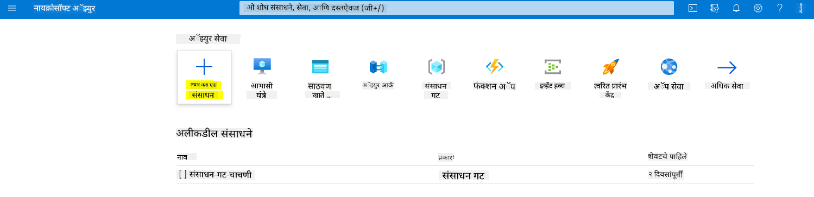

   Machine Learning शोधा आणि Machine Learning टाइल निवडा

   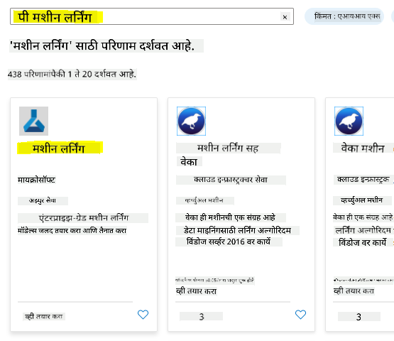

   Create बटणावर क्लिक करा

   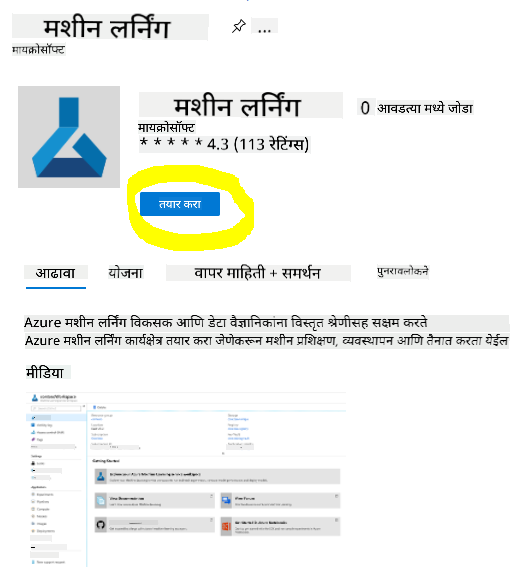

   खालीलप्रमाणे सेटिंग्ज भरा:
   - Subscription: तुमचे Azure सबस्क्रिप्शन
   - Resource group: Resource group तयार करा किंवा निवडा
   - Workspace name: तुमच्या Workspace साठी एक अद्वितीय नाव प्रविष्ट करा
   - Region: तुमच्याजवळील भौगोलिक क्षेत्र निवडा
   - Storage account: तुमच्या Workspace साठी तयार होणारे नवीन Storage account लक्षात ठेवा
   - Key vault: तुमच्या Workspace साठी तयार होणारे नवीन Key vault लक्षात ठेवा
   - Application insights: तुमच्या Workspace साठी तयार होणारे नवीन Application insights Resource लक्षात ठेवा
   - Container registry: None (तुम्ही मॉडेल कंटेनरमध्ये डिप्लॉय केल्यावर आपोआप तयार होईल)

    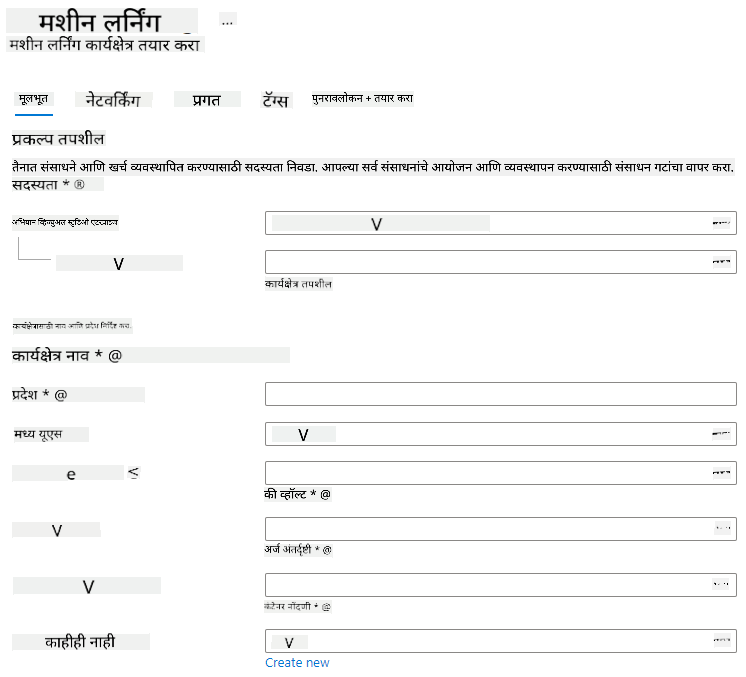

   - Create + review वर क्लिक करा आणि नंतर Create बटणावर क्लिक करा
3. तुमचे Workspace तयार होण्याची वाट पाहा (यास काही मिनिटे लागू शकतात). नंतर ते पोर्टलमध्ये जा. तुम्ही ते Machine Learning Azure सेवेद्वारे शोधू शकता.
4. तुमच्या Workspace च्या Overview पृष्ठावर, Azure Machine Learning studio लाँच करा (किंवा नवीन ब्राउझर टॅब उघडा आणि https://ml.azure.com वर जा), आणि तुमच्या Microsoft खात्याचा वापर करून Azure Machine Learning studio मध्ये साइन इन करा. जर विचारले गेले तर तुमची Azure directory आणि सबस्क्रिप्शन, आणि तुमचे Azure Machine Learning Workspace निवडा.
   


5. Azure Machine Learning studio मध्ये, इंटरफेसमधील विविध पृष्ठे पाहण्यासाठी वरच्या डाव्या ☰ चिन्हावर टॉगल करा. तुम्ही तुमच्या Workspace मधील Resources व्यवस्थापित करण्यासाठी ही पृष्ठे वापरू शकता.

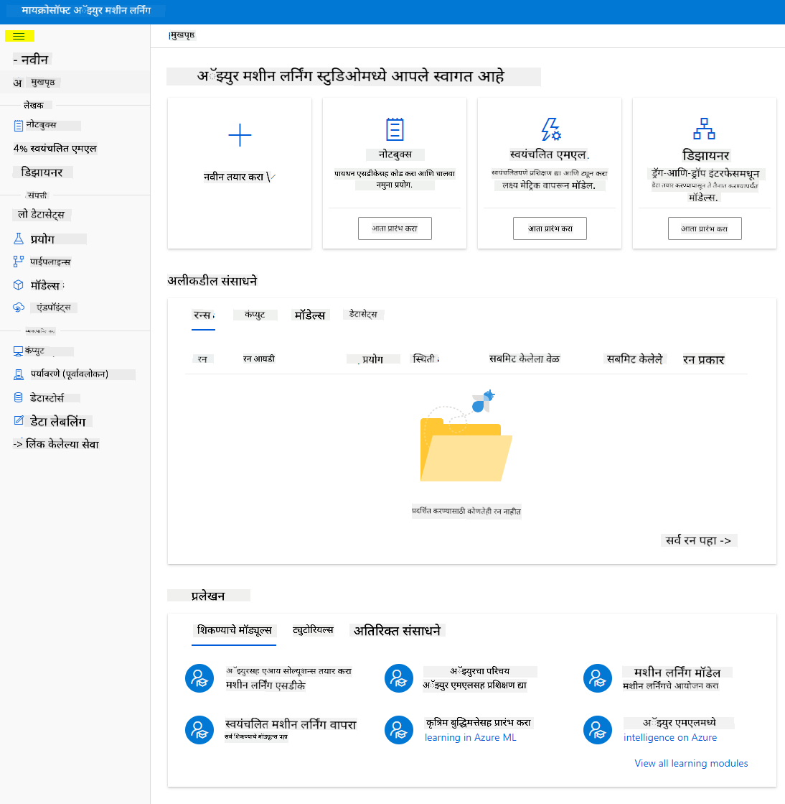

तुम्ही Azure पोर्टल वापरून तुमचे Workspace व्यवस्थापित करू शकता, परंतु डेटा सायंटिस्ट्स आणि Machine Learning ऑपरेशन्स इंजिनिअर्ससाठी, Azure Machine Learning Studio Workspace Resources व्यवस्थापित करण्यासाठी अधिक केंद्रित यूजर इंटरफेस प्रदान करते.

### 2.2 Compute Resources

Compute Resources म्हणजे क्लाउड-आधारित Resources आहेत ज्यावर तुम्ही मॉडेल प्रशिक्षण आणि डेटा एक्सप्लोरेशन प्रक्रिया चालवू शकता. तुम्ही चार प्रकारचे Compute Resources तयार करू शकता:

- **Compute Instances**: डेटा सायंटिस्ट्स डेटा आणि मॉडेल्ससह काम करण्यासाठी वापरू शकणारे विकास वर्कस्टेशन्स. यामध्ये Virtual Machine (VM) तयार करणे आणि नोटबुक instance लाँच करणे समाविष्ट आहे. तुम्ही नंतर नोटबुकमधून Compute Cluster कॉल करून मॉडेल ट्रेन करू शकता.
- **Compute Clusters**: प्रयोग कोडच्या ऑन-डिमांड प्रोसेसिंगसाठी स्केलेबल VMs चा समूह. तुम्हाला मॉडेल ट्रेन करताना याची आवश्यकता असेल. Compute Clusters विशेष GPU किंवा CPU Resources देखील वापरू शकतात.
- **Inference Clusters**: तुमच्या प्रशिक्षित मॉडेल्स वापरणाऱ्या प्रेडिक्टिव्ह सर्व्हिसेससाठी डिप्लॉयमेंट टार्गेट्स.
- **जोडलेले Compute**: Azure च्या विद्यमान compute संसाधनांशी लिंक करणे, जसे की Virtual Machines किंवा Azure Databricks क्लस्टर्स.

#### 2.2.1 तुमच्या compute संसाधनांसाठी योग्य पर्याय निवडणे

Compute संसाधन तयार करताना काही महत्त्वाचे घटक विचारात घ्यावे लागतात आणि हे निर्णय महत्त्वाचे ठरू शकतात.

**तुम्हाला CPU हवे आहे की GPU?**

CPU (Central Processing Unit) ही इलेक्ट्रॉनिक सर्किटरी आहे जी संगणक प्रोग्राममधील सूचना अंमलात आणते. GPU (Graphics Processing Unit) हे एक विशेष इलेक्ट्रॉनिक सर्किट आहे जे ग्राफिक्स-संबंधित कोड खूप वेगाने अंमलात आणू शकते.

CPU आणि GPU आर्किटेक्चरमधील मुख्य फरक असा आहे की CPU विविध प्रकारच्या कार्यांना जलद हाताळण्यासाठी डिझाइन केलेले आहे (CPU क्लॉक स्पीडने मोजले जाते), परंतु एकाच वेळी चालणाऱ्या कार्यांच्या समांतरतेमध्ये मर्यादित आहे. GPU समांतर संगणनासाठी डिझाइन केलेले आहे आणि त्यामुळे ते डीप लर्निंग कार्यांसाठी खूप चांगले आहे.

| CPU                                     | GPU                         |
|-----------------------------------------|-----------------------------|
| कमी खर्चिक                              | अधिक खर्चिक                |
| कमी समांतरता                            | जास्त समांतरता             |
| डीप लर्निंग मॉडेल्स प्रशिक्षणात धीमे     | डीप लर्निंगसाठी उत्तम       |

**क्लस्टर आकार**

मोठे क्लस्टर अधिक खर्चिक असतात परंतु चांगली प्रतिसादक्षमता देतात. त्यामुळे, जर तुमच्याकडे वेळ असेल पण पुरेसे पैसे नसतील, तर तुम्ही लहान क्लस्टरने सुरुवात करावी. उलट, जर तुमच्याकडे पैसे असतील पण वेळ कमी असेल, तर तुम्ही मोठ्या क्लस्टरने सुरुवात करावी.

**VM आकार**

तुमच्या वेळ आणि बजेटच्या मर्यादेनुसार, तुम्ही RAM, डिस्क, कोरची संख्या आणि क्लॉक स्पीड यांचा आकार बदलू शकता. या सर्व पॅरामीटर्स वाढवल्याने खर्च वाढेल, परंतु कार्यक्षमता सुधारेल.

**Dedicated किंवा Low-Priority Instances?**

Low-priority instance म्हणजे ते interruptible आहे: Microsoft Azure त्या संसाधनांचा वापर दुसऱ्या कार्यासाठी करू शकते, ज्यामुळे तुमचे काम थांबू शकते. Dedicated instance, म्हणजे non-interruptible, याचा अर्थ तुमची परवानगी न घेता काम कधीही थांबवले जाणार नाही. 
हा वेळ विरुद्ध पैशाचा विचार आहे, कारण interruptible instances dedicated instances पेक्षा कमी खर्चिक असतात.

#### 2.2.2 Compute क्लस्टर तयार करणे

आधी तयार केलेल्या [Azure ML workspace](https://ml.azure.com/) मध्ये जा, Compute वर क्लिक करा आणि तुम्हाला वेगवेगळ्या compute संसाधनांचे पर्याय दिसतील (जसे की compute instances, compute clusters, inference clusters आणि attached compute). या प्रकल्पासाठी, आम्हाला मॉडेल प्रशिक्षणासाठी compute cluster ची आवश्यकता आहे. Studio मध्ये, "Compute" मेनूवर क्लिक करा, नंतर "Compute cluster" टॅबवर जा आणि "+ New" बटणावर क्लिक करा.

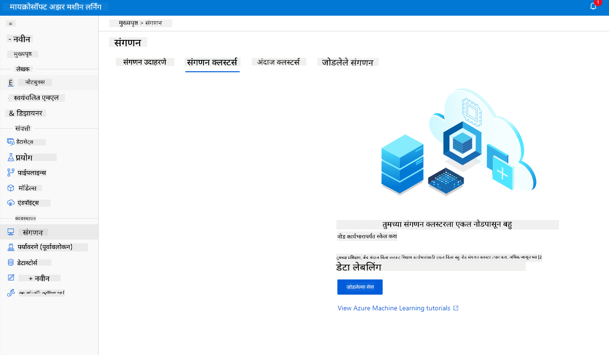

1. तुमचे पर्याय निवडा: Dedicated vs Low priority, CPU किंवा GPU, VM आकार आणि कोर संख्या (या प्रकल्पासाठी तुम्ही default सेटिंग ठेवू शकता).
2. "Next" बटणावर क्लिक करा.

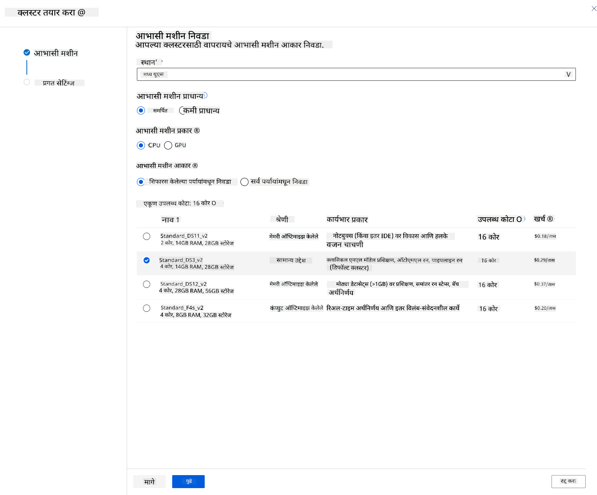

3. क्लस्टरला एक compute नाव द्या.
4. तुमचे पर्याय निवडा: किमान/कमाल नोड्सची संख्या, Idle seconds before scale down, SSH access. लक्षात ठेवा की जर किमान नोड्सची संख्या 0 असेल, तर क्लस्टर idle असताना तुम्ही पैसे वाचवाल. कमाल नोड्सची संख्या जास्त असल्यास प्रशिक्षणाचा कालावधी कमी होईल. कमाल नोड्सची शिफारस केलेली संख्या 3 आहे.
5. "Create" बटणावर क्लिक करा. ही प्रक्रिया काही मिनिटे लागू शकते.

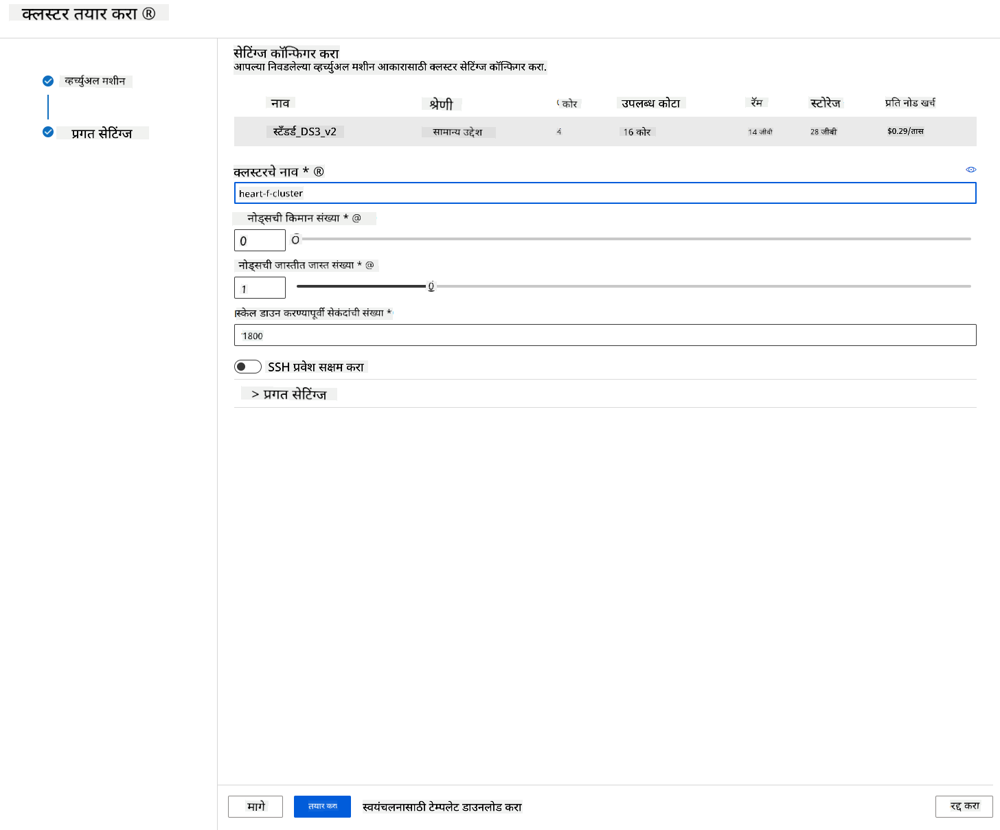

छान! आता आपल्याकडे Compute क्लस्टर आहे, आता आपल्याला डेटा Azure ML Studio मध्ये लोड करायचा आहे.

### 2.3 डेटासेट लोड करणे

1. [Azure ML workspace](https://ml.azure.com/) मध्ये, "Datasets" वर क्लिक करा आणि "+ Create dataset" बटणावर क्लिक करा. "From local files" पर्याय निवडा आणि आपण आधी डाउनलोड केलेला Kaggle डेटासेट निवडा.

   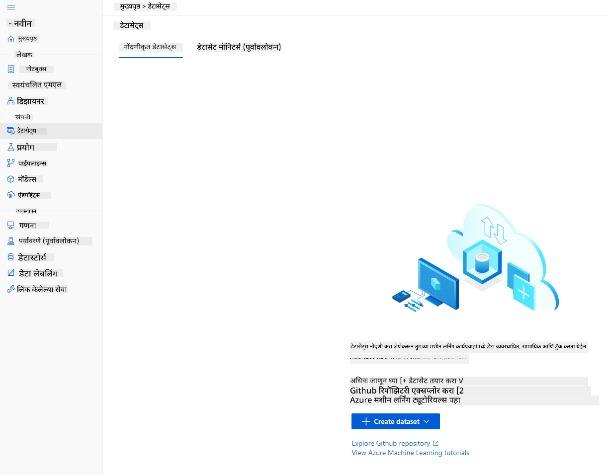

2. तुमच्या डेटासेटला नाव, प्रकार आणि वर्णन द्या. "Next" वर क्लिक करा. फाइल्समधून डेटा अपलोड करा. "Next" वर क्लिक करा.

   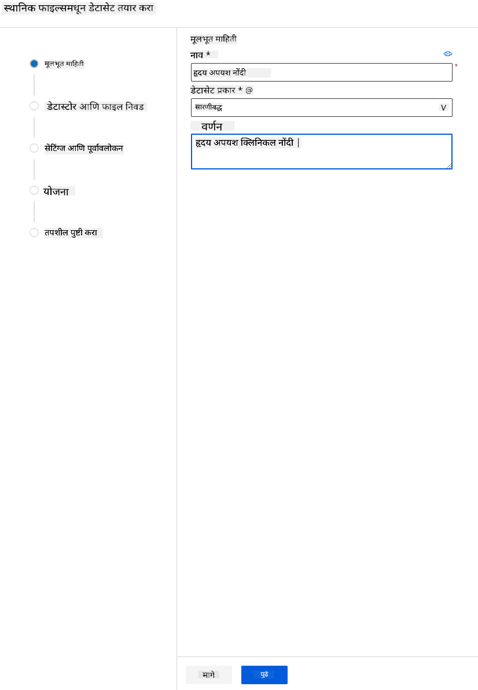

3. Schema मध्ये, खालील वैशिष्ट्यांसाठी डेटा प्रकार Boolean मध्ये बदला: anaemia, diabetes, high blood pressure, sex, smoking, आणि DEATH_EVENT. "Next" वर क्लिक करा आणि "Create" वर क्लिक करा.

   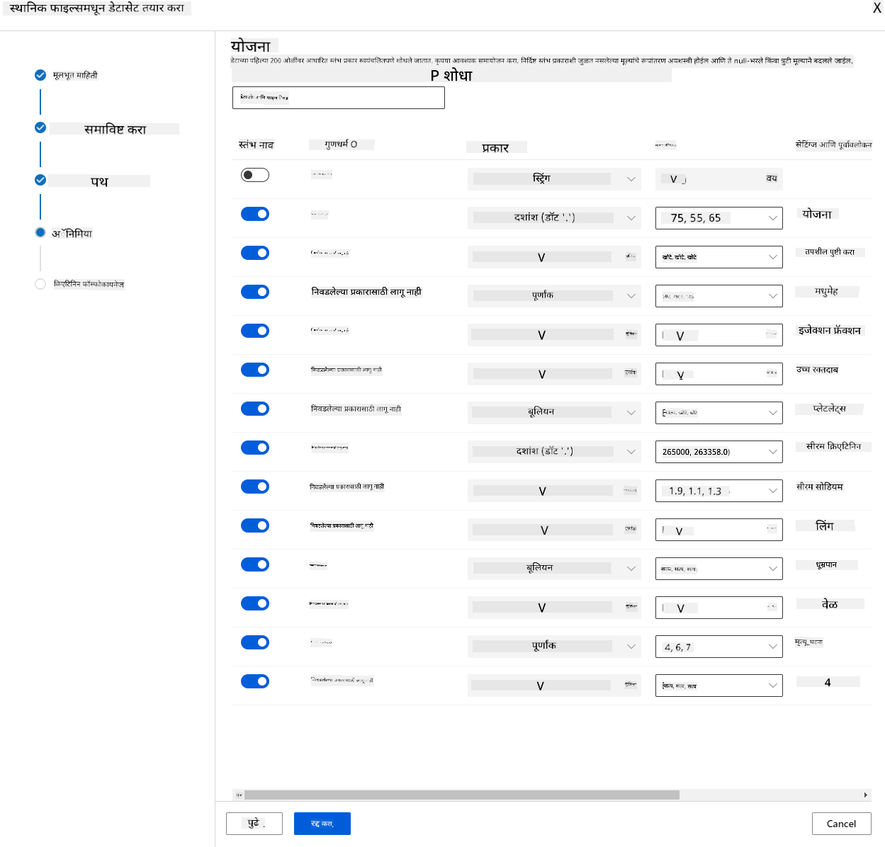

छान! आता डेटासेट तयार आहे आणि Compute क्लस्टर तयार आहे, आपण मॉडेलचे प्रशिक्षण सुरू करू शकतो!

### 2.4 AutoML सह Low code/No Code प्रशिक्षण

पारंपरिक मशीन लर्निंग मॉडेल विकास संसाधन-गहन असतो, ज्यासाठी महत्त्वपूर्ण डोमेन ज्ञान आणि अनेक मॉडेल्स तयार करण्यासाठी वेळ लागतो. Automated machine learning (AutoML) ही प्रक्रिया मशीन लर्निंग मॉडेल विकासातील वेळखाऊ, पुनरावृत्ती होणाऱ्या कार्यांना स्वयंचलित करते. यामुळे डेटा सायंटिस्ट, विश्लेषक आणि विकसकांना उच्च प्रमाणात, कार्यक्षमतेने आणि उत्पादकतेने ML मॉडेल तयार करता येतात, मॉडेलची गुणवत्ता टिकवून ठेवता येते. [अधिक जाणून घ्या](https://docs.microsoft.com/azure/machine-learning/concept-automated-ml?WT.mc_id=academic-77958-bethanycheum&ocid=AID3041109)

1. [Azure ML workspace](https://ml.azure.com/) मध्ये "Automated ML" वर क्लिक करा आणि तुम्ही अपलोड केलेला डेटासेट निवडा. "Next" वर क्लिक करा.

   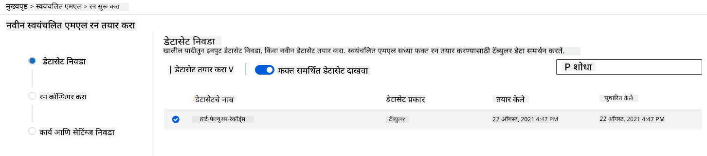

2. नवीन प्रयोगाचे नाव, target column (DEATH_EVENT) आणि तयार केलेला compute cluster प्रविष्ट करा. "Next" वर क्लिक करा.

   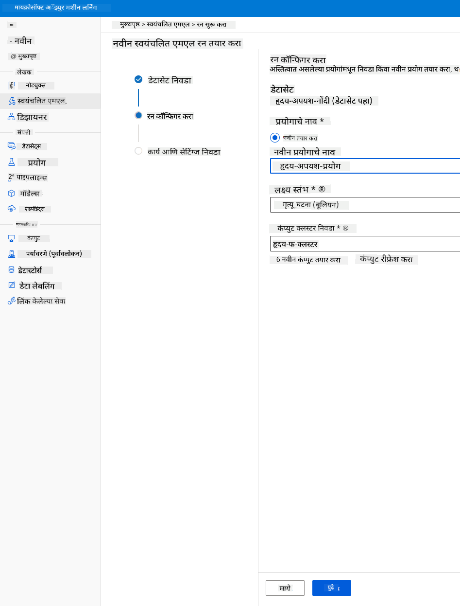

3. "Classification" निवडा आणि "Finish" वर क्लिक करा. ही प्रक्रिया 30 मिनिटांपासून 1 तासापर्यंत लागू शकते, तुमच्या compute cluster च्या आकारावर अवलंबून.

   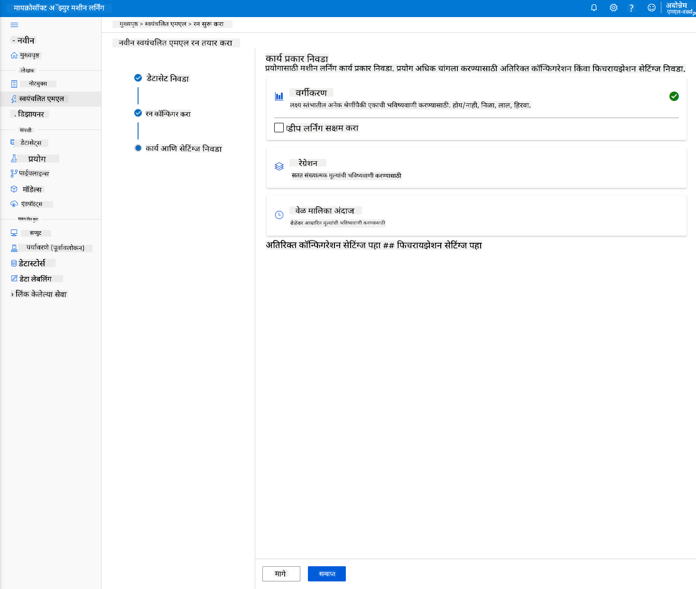

4. प्रक्रिया पूर्ण झाल्यावर, "Automated ML" टॅबवर जा, तुमच्या रनवर क्लिक करा आणि "Best model summary" कार्डमधील Algorithm वर क्लिक करा.

   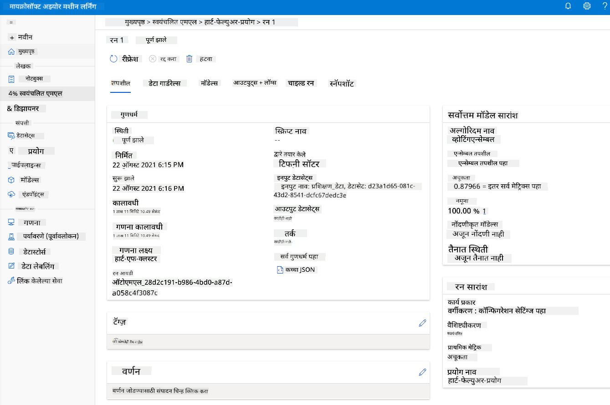

येथे तुम्हाला AutoML ने तयार केलेल्या सर्वोत्तम मॉडेलचे तपशीलवार वर्णन दिसेल. तुम्ही "Models" टॅबमध्ये इतर मॉडेल्सही एक्सप्लोर करू शकता. काही वेळ घ्या आणि Explanations (preview) बटणामध्ये मॉडेल्स एक्सप्लोर करा. एकदा तुम्ही वापरण्यासाठी मॉडेल निवडले (येथे आपण AutoML ने निवडलेले सर्वोत्तम मॉडेल निवडू), आपण ते कसे डिप्लॉय करायचे ते पाहू.

## 3. Low code/No Code मॉडेल डिप्लॉयमेंट आणि endpoint वापर
### 3.1 मॉडेल डिप्लॉयमेंट

Automated machine learning इंटरफेस तुम्हाला काही स्टेप्समध्ये सर्वोत्तम मॉडेल वेब सर्व्हिस म्हणून डिप्लॉय करण्याची परवानगी देते. डिप्लॉयमेंट म्हणजे मॉडेलचे एकत्रीकरण जेणेकरून ते नवीन डेटावर आधारित अंदाज करू शकेल आणि संभाव्य संधींचे क्षेत्र ओळखू शकेल. या प्रकल्पासाठी, वेब सर्व्हिसवर डिप्लॉय करणे म्हणजे वैद्यकीय अनुप्रयोगांना त्यांच्या रुग्णांच्या हृदयविकाराचा धोका ओळखण्यासाठी मॉडेल वापरण्याची परवानगी देणे.

सर्वोत्तम मॉडेलच्या वर्णनात, "Deploy" बटणावर क्लिक करा.

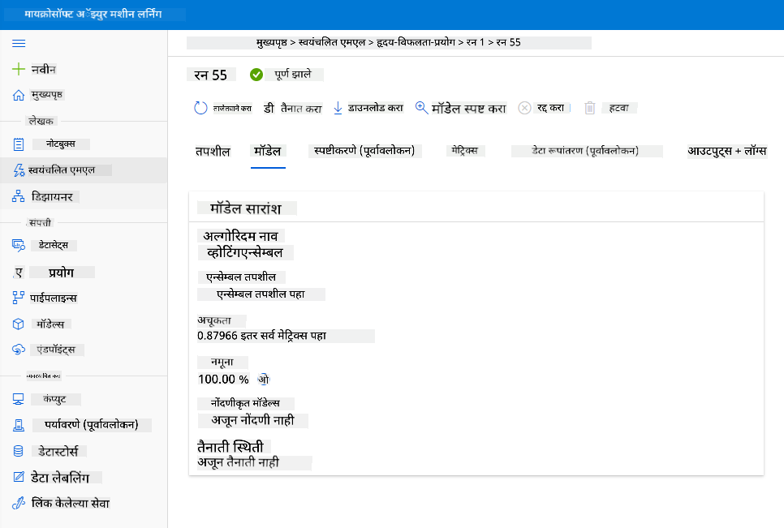

15. याला नाव, वर्णन, compute प्रकार (Azure Container Instance), authentication सक्षम करा आणि "Deploy" वर क्लिक करा. ही प्रक्रिया सुमारे 20 मिनिटे लागू शकते. डिप्लॉयमेंट प्रक्रियेमध्ये मॉडेल नोंदणी, संसाधने तयार करणे आणि वेब सर्व्हिससाठी त्यांचे कॉन्फिगरेशन यांचा समावेश आहे. "Deploy status" अंतर्गत स्थिती संदेश दिसतो. स्थिती तपासण्यासाठी "Refresh" निवडा. स्थिती "Healthy" असल्यावर ते डिप्लॉय केले गेले आहे आणि चालू आहे.

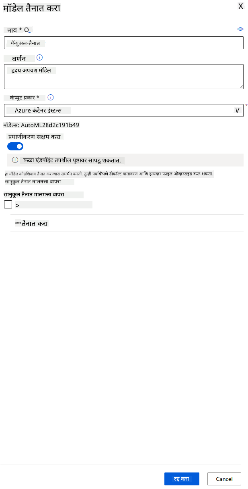

16. एकदा डिप्लॉय झाल्यावर, "Endpoint" टॅबवर क्लिक करा आणि तुम्ही नुकतेच डिप्लॉय केलेले endpoint निवडा. येथे तुम्हाला endpoint बद्दल सर्व तपशील मिळतील.

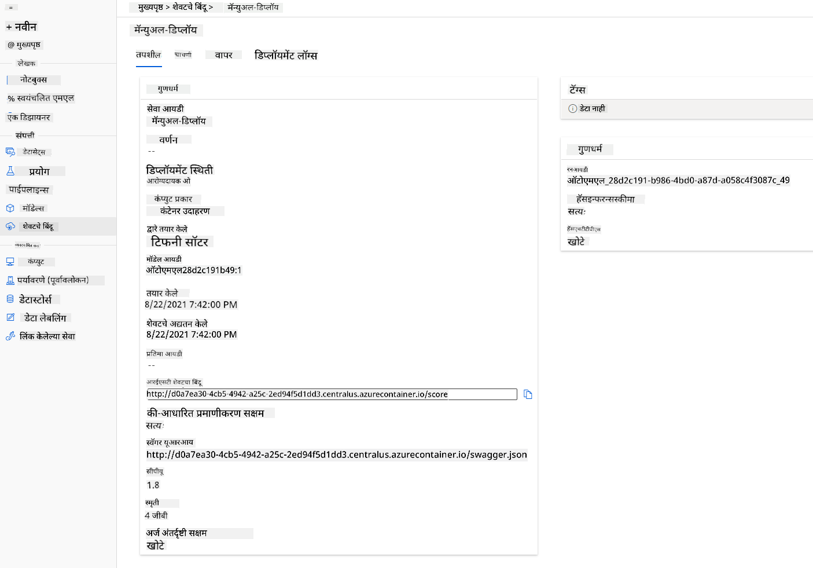

अप्रतिम! आता आपल्याकडे एक मॉडेल डिप्लॉय झाले आहे, आपण endpoint चा वापर सुरू करू शकतो.

### 3.2 Endpoint वापर

"Consume" टॅबवर क्लिक करा. येथे तुम्हाला REST endpoint आणि consumption पर्यायामध्ये एक Python स्क्रिप्ट सापडेल. Python कोड वाचण्यासाठी थोडा वेळ घ्या.

ही स्क्रिप्ट थेट तुमच्या स्थानिक मशीनवर चालवता येते आणि तुमच्या endpoint चा वापर करेल.

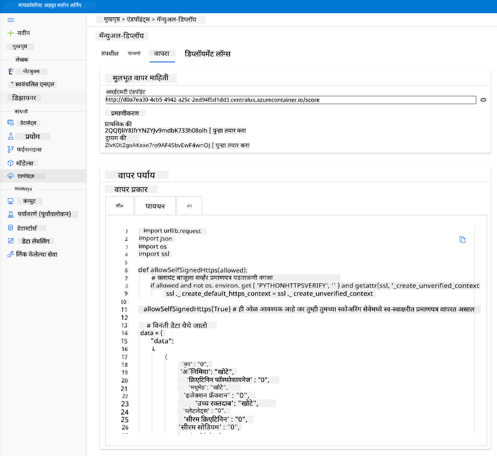

या दोन कोड ओळी तपासा:

```python
url = 'http://98e3715f-xxxx-xxxx-xxxx-9ec22d57b796.centralus.azurecontainer.io/score'
api_key = '' # Replace this with the API key for the web service
```
`url` व्हेरिएबल हा consume टॅबमध्ये सापडलेला REST endpoint आहे आणि `api_key` व्हेरिएबल हा primary key आहे जो consume टॅबमध्ये सापडतो (authentication सक्षम केल्यास). ही स्क्रिप्ट endpoint चा वापर कसा करते हे यावरून समजते.

18. स्क्रिप्ट चालवल्यावर, तुम्हाला खालील आउटपुट दिसेल:
    ```python
    b'"{\\"result\\": [true]}"'
    ```
याचा अर्थ दिलेल्या डेटासाठी हृदयविकाराचा धोका खरा आहे. हे योग्य वाटते कारण स्क्रिप्टमध्ये आपोआप तयार झालेल्या डेटावर बारकाईने लक्ष दिल्यास, सर्व काही 0 आणि false आहे. तुम्ही खालील इनपुट नमुन्याने डेटा बदलू शकता:

```python
data = {
    "data":
    [
        {
            'age': "0",
            'anaemia': "false",
            'creatinine_phosphokinase': "0",
            'diabetes': "false",
            'ejection_fraction': "0",
            'high_blood_pressure': "false",
            'platelets': "0",
            'serum_creatinine': "0",
            'serum_sodium': "0",
            'sex': "false",
            'smoking': "false",
            'time': "0",
        },
        {
            'age': "60",
            'anaemia': "false",
            'creatinine_phosphokinase': "500",
            'diabetes': "false",
            'ejection_fraction': "38",
            'high_blood_pressure': "false",
            'platelets': "260000",
            'serum_creatinine': "1.40",
            'serum_sodium': "137",
            'sex': "false",
            'smoking': "false",
            'time': "130",
        },
    ],
}
```
स्क्रिप्ट खालील आउटपुट परत करेल:
    ```python
    b'"{\\"result\\": [true, false]}"'
    ```

अभिनंदन! तुम्ही Azure ML वर मॉडेल डिप्लॉय केले, ट्रेन केले आणि त्याचा वापर केला!

> **_टीप:_** प्रकल्प पूर्ण झाल्यावर, सर्व संसाधने हटवायला विसरू नका.
## 🚀 आव्हान

AutoML ने तयार केलेल्या सर्वोत्तम मॉडेलच्या स्पष्टीकरणांवर आणि तपशीलांवर बारकाईने लक्ष द्या. सर्वोत्तम मॉडेल इतरांपेक्षा का चांगले आहे हे समजून घेण्याचा प्रयत्न करा. कोणते अल्गोरिदम तुलना केली गेली? त्यांच्यात काय फरक आहे? या प्रकरणात सर्वोत्तम मॉडेल का चांगले कार्य करत आहे?

## [पाठानंतर प्रश्नमंजुषा](https://ff-quizzes.netlify.app/en/ds/)

## पुनरावलोकन आणि स्व-अभ्यास

या धड्यात, तुम्ही Low code/No code पद्धतीने क्लाउडमध्ये हृदयविकाराचा धोका ओळखण्यासाठी मॉडेल कसे ट्रेन करायचे, डिप्लॉय करायचे आणि वापरायचे हे शिकलात. जर तुम्ही अजून केले नसेल, तर AutoML ने तयार केलेल्या सर्वोत्तम मॉडेलच्या स्पष्टीकरणांमध्ये खोलवर जा आणि इतरांपेक्षा ते का चांगले आहे हे समजून घ्या.

Low code/No code AutoML बद्दल अधिक जाणून घेण्यासाठी [ही माहिती](https://docs.microsoft.com/azure/machine-learning/tutorial-first-experiment-automated-ml?WT.mc_id=academic-77958-bethanycheum&ocid=AID3041109) वाचा.

## असाइनमेंट

[Azure ML वर Low code/No code डेटा सायन्स प्रकल्प](assignment.md)

---

**अस्वीकरण**:  
हा दस्तऐवज AI भाषांतर सेवा [Co-op Translator](https://github.com/Azure/co-op-translator) वापरून भाषांतरित करण्यात आला आहे. आम्ही अचूकतेसाठी प्रयत्नशील असलो तरी कृपया लक्षात ठेवा की स्वयंचलित भाषांतरांमध्ये त्रुटी किंवा अचूकतेचा अभाव असू शकतो. मूळ भाषेतील दस्तऐवज हा अधिकृत स्रोत मानला जावा. महत्त्वाच्या माहितीसाठी व्यावसायिक मानवी भाषांतराची शिफारस केली जाते. या भाषांतराचा वापर करून निर्माण होणाऱ्या कोणत्याही गैरसमज किंवा चुकीच्या अर्थासाठी आम्ही जबाबदार राहणार नाही.