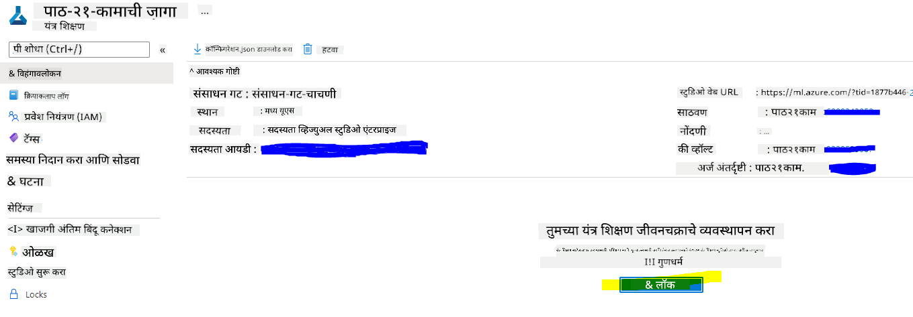

<!--
CO_OP_TRANSLATOR_METADATA:
{
  "original_hash": "14b2a7f1c63202920bd98eeb913f5614",
  "translation_date": "2025-08-27T17:37:33+00:00",
  "source_file": "5-Data-Science-In-Cloud/18-Low-Code/README.md",
  "language_code": "mr"
}
-->
# क्लाउडमधील डेटा सायन्स: "लो कोड/नो कोड" पद्धत

| ](../../sketchnotes/18-DataScience-Cloud.png)|
|:---:|
| क्लाउडमधील डेटा सायन्स: लो कोड - _[@nitya](https://twitter.com/nitya) यांचे स्केच_ |

सामग्री सूची:

- [क्लाउडमधील डेटा सायन्स: "लो कोड/नो कोड" पद्धत](../../../../5-Data-Science-In-Cloud/18-Low-Code)
  - [पूर्व-व्याख्यान प्रश्नमंजुषा](../../../../5-Data-Science-In-Cloud/18-Low-Code)
  - [1. परिचय](../../../../5-Data-Science-In-Cloud/18-Low-Code)
    - [1.1 Azure Machine Learning म्हणजे काय?](../../../../5-Data-Science-In-Cloud/18-Low-Code)
    - [1.2 हार्ट फेल्युअर प्रेडिक्शन प्रोजेक्ट:](../../../../5-Data-Science-In-Cloud/18-Low-Code)
    - [1.3 हार्ट फेल्युअर डेटासेट:](../../../../5-Data-Science-In-Cloud/18-Low-Code)
  - [2. Azure ML Studio मध्ये लो कोड/नो कोड पद्धतीने मॉडेल प्रशिक्षण](../../../../5-Data-Science-In-Cloud/18-Low-Code)
    - [2.1 Azure ML workspace तयार करा](../../../../5-Data-Science-In-Cloud/18-Low-Code)
    - [2.2 संगणकीय संसाधने](../../../../5-Data-Science-In-Cloud/18-Low-Code)
      - [2.2.1 संगणकीय संसाधनांसाठी योग्य पर्याय निवडणे](../../../../5-Data-Science-In-Cloud/18-Low-Code)
      - [2.2.2 संगणकीय क्लस्टर तयार करणे](../../../../5-Data-Science-In-Cloud/18-Low-Code)
    - [2.3 डेटासेट लोड करणे](../../../../5-Data-Science-In-Cloud/18-Low-Code)
    - [2.4 AutoML सह लो कोड/नो कोड प्रशिक्षण](../../../../5-Data-Science-In-Cloud/18-Low-Code)
  - [3. लो कोड/नो कोड मॉडेल डिप्लॉयमेंट आणि एंडपॉइंट वापर](../../../../5-Data-Science-In-Cloud/18-Low-Code)
    - [3.1 मॉडेल डिप्लॉयमेंट](../../../../5-Data-Science-In-Cloud/18-Low-Code)
    - [3.2 एंडपॉइंट वापर](../../../../5-Data-Science-In-Cloud/18-Low-Code)
  - [🚀 आव्हान](../../../../5-Data-Science-In-Cloud/18-Low-Code)
  - [व्याख्यानानंतरची प्रश्नमंजुषा](../../../../5-Data-Science-In-Cloud/18-Low-Code)
  - [पुनरावलोकन आणि स्व-अभ्यास](../../../../5-Data-Science-In-Cloud/18-Low-Code)
  - [असाइनमेंट](../../../../5-Data-Science-In-Cloud/18-Low-Code)

## [पूर्व-व्याख्यान प्रश्नमंजुषा](https://purple-hill-04aebfb03.1.azurestaticapps.net/quiz/34)

## 1. परिचय

### 1.1 Azure Machine Learning म्हणजे काय?

Azure क्लाउड प्लॅटफॉर्ममध्ये 200 हून अधिक उत्पादने आणि क्लाउड सेवा आहेत, ज्या तुम्हाला नवीन उपाय तयार करण्यात मदत करतात. डेटा सायंटिस्ट्स डेटाचे अन्वेषण आणि पूर्व-प्रक्रिया करण्यासाठी, तसेच अचूक मॉडेल तयार करण्यासाठी विविध प्रकारचे मॉडेल-प्रशिक्षण अल्गोरिदम वापरण्यासाठी खूप प्रयत्न करतात. हे कार्य वेळखाऊ असते आणि महागड्या संगणकीय हार्डवेअरचा अकार्यक्षम वापर होतो.

[Azure ML](https://docs.microsoft.com/azure/machine-learning/overview-what-is-azure-machine-learning?WT.mc_id=academic-77958-bethanycheum&ocid=AID3041109) ही Azure मध्ये मशीन लर्निंग सोल्यूशन्स तयार करण्यासाठी आणि ऑपरेट करण्यासाठी एक क्लाउड-आधारित प्लॅटफॉर्म आहे. यात डेटा तयार करणे, मॉडेल प्रशिक्षण, प्रेडिक्टिव्ह सेवा प्रकाशित करणे आणि त्यांचा वापर मॉनिटर करणे यासाठी अनेक वैशिष्ट्ये आणि क्षमता आहेत. सर्वात महत्त्वाचे म्हणजे, हे वेळखाऊ कार्ये स्वयंचलित करून डेटा सायंटिस्ट्सची कार्यक्षमता वाढवते; तसेच मोठ्या प्रमाणात डेटा हाताळण्यासाठी प्रभावीपणे स्केल होणाऱ्या क्लाउड-आधारित संगणकीय संसाधनांचा वापर करण्यास सक्षम करते, ज्यामुळे फक्त वापराच्या वेळीच खर्च होतो.

Azure ML मध्ये मशीन लर्निंग वर्कफ्लो साठी आवश्यक असलेली सर्व साधने आहेत. यामध्ये समाविष्ट आहे:

- **Azure Machine Learning Studio**: मॉडेल प्रशिक्षण, डिप्लॉयमेंट, ऑटोमेशन, ट्रॅकिंग आणि अॅसेट मॅनेजमेंटसाठी लो कोड/नो कोड पर्याय असलेले वेब पोर्टल.
- **Jupyter Notebooks**: ML मॉडेल्स जलद प्रोटोटाइप आणि चाचणीसाठी.
- **Azure Machine Learning Designer**: ड्रॅग-एन-ड्रॉप मॉड्यूल्स वापरून प्रयोग तयार करणे आणि लो कोड वातावरणात पाइपलाइन्स डिप्लॉय करणे.
- **Automated machine learning UI (AutoML)**: मॉडेल विकासातील पुनरावृत्ती कार्ये स्वयंचलित करते, उच्च स्केल, कार्यक्षमता आणि उत्पादकतेसह ML मॉडेल तयार करण्यास अनुमती देते.
- **डेटा लेबलिंग**: डेटा स्वयंचलितपणे लेबल करण्यासाठी सहाय्यक ML साधन.
- **Visual Studio Code साठी मशीन लर्निंग एक्स्टेंशन**: ML प्रकल्प तयार करण्यासाठी आणि व्यवस्थापित करण्यासाठी पूर्ण-वैशिष्ट्यीकृत विकास वातावरण प्रदान करते.
- **मशीन लर्निंग CLI**: कमांड लाइनवरून Azure ML संसाधने व्यवस्थापित करण्यासाठी आदेश प्रदान करते.
- **PyTorch, TensorFlow, Scikit-learn सारख्या ओपन-सोर्स फ्रेमवर्कसह एकत्रीकरण**: प्रशिक्षण, डिप्लॉयमेंट आणि एंड-टू-एंड मशीन लर्निंग प्रक्रिया व्यवस्थापित करण्यासाठी.
- **MLflow**: मशीन लर्निंग प्रयोगांच्या जीवनचक्राचे व्यवस्थापन करण्यासाठी एक ओपन-सोर्स लायब्ररी. **MLFlow Tracking** हे MLflow चे एक घटक आहे, जे तुमच्या प्रशिक्षण रन मेट्रिक्स आणि मॉडेल आर्टिफॅक्ट्स लॉग आणि ट्रॅक करते.

### 1.2 हार्ट फेल्युअर प्रेडिक्शन प्रोजेक्ट:

प्रकल्प तयार करणे आणि बांधणे ही तुमच्या कौशल्यांची आणि ज्ञानाची चाचणी घेण्याचा सर्वोत्तम मार्ग आहे. या धड्यात, आपण Azure ML Studio मध्ये हार्ट फेल्युअर अटॅक्सच्या प्रेडिक्शनसाठी डेटा सायन्स प्रकल्प तयार करण्याच्या दोन वेगवेगळ्या पद्धतींचा अभ्यास करू: लो कोड/नो कोड आणि Azure ML SDK च्या माध्यमातून, खालील योजनेप्रमाणे:


प्रत्येक पद्धतीचे स्वतःचे फायदे आणि तोटे आहेत. लो कोड/नो कोड पद्धत सुरू करण्यासाठी सोपी आहे कारण ती GUI (ग्राफिकल युजर इंटरफेस) चा वापर करते, ज्यासाठी कोडचे पूर्वज्ञान आवश्यक नाही. ही पद्धत प्रकल्पाची व्यवहार्यता जलद चाचणीसाठी आणि POC (प्रूफ ऑफ कॉन्सेप्ट) तयार करण्यासाठी सक्षम करते. परंतु, प्रकल्प वाढत असताना आणि उत्पादनासाठी तयार करणे आवश्यक असताना, GUI च्या माध्यमातून संसाधने तयार करणे व्यवहार्य नसते. अशा वेळी, Azure ML SDK चा वापर करून सर्वकाही प्रोग्रामॅटिकली स्वयंचलित करणे महत्त्वाचे ठरते.

|                   | लो कोड/नो कोड | Azure ML SDK              |
|-------------------|------------------|---------------------------|
| कोडचे ज्ञान       | आवश्यक नाही     | आवश्यक                   |
| विकासाचा वेळ      | जलद आणि सोपा    | कोड कौशल्यावर अवलंबून    |
| उत्पादनासाठी तयार| नाही             | होय                      |

### 1.3 हार्ट फेल्युअर डेटासेट:

हृदयविकार (CVDs) हे जागतिक स्तरावर मृत्यूचे क्रमांक 1 कारण आहेत, जे एकूण मृत्यूंपैकी 31% आहेत. तंबाखूचा वापर, अस्वस्थ आहार आणि लठ्ठपणा, शारीरिक निष्क्रियता आणि अल्कोहोलचा हानिकारक वापर यांसारख्या पर्यावरणीय आणि वर्तनात्मक जोखीम घटकांचा अंदाज मॉडेलसाठी वैशिष्ट्ये म्हणून वापरला जाऊ शकतो. उच्च जोखीम असलेल्या लोकांमध्ये हृदयविकाराचा झटका टाळण्यासाठी CVD विकसित होण्याची शक्यता अंदाज लावणे उपयुक्त ठरू शकते.

Kaggle ने [हार्ट फेल्युअर डेटासेट](https://www.kaggle.com/andrewmvd/heart-failure-clinical-data) सार्वजनिकपणे उपलब्ध करून दिला आहे, जो आपण या प्रकल्पासाठी वापरणार आहोत. तुम्ही हा डेटासेट आता डाउनलोड करू शकता. हा 13 स्तंभांचा (12 वैशिष्ट्ये आणि 1 लक्ष्य व्हेरिएबल) आणि 299 ओळींचा टॅब्लर डेटासेट आहे.

|    | व्हेरिएबल नाव             | प्रकार            | वर्णन                                               | उदाहरण           |
|----|---------------------------|-----------------|---------------------------------------------------|-------------------|
| 1  | age                       | संख्यात्मक       | रुग्णाचे वय                                        | 25                |
| 2  | anaemia                   | बूलियन         | लाल रक्तपेशी किंवा हिमोग्लोबिनची घट               | 0 किंवा 1         |
| 3  | creatinine_phosphokinase  | संख्यात्मक       | रक्तातील CPK एन्झाइमची पातळी                      | 542               |
| 4  | diabetes                  | बूलियन         | रुग्णाला मधुमेह आहे का?                          | 0 किंवा 1         |
| 5  | ejection_fraction         | संख्यात्मक       | प्रत्येक संकुचनावर हृदयातून बाहेर पडणाऱ्या रक्ताचे प्रमाण | 45                |
| 6  | high_blood_pressure       | बूलियन         | रुग्णाला उच्च रक्तदाब आहे का?                     | 0 किंवा 1         |
| 7  | platelets                 | संख्यात्मक       | रक्तातील प्लेटलेट्स                                | 149000            |
| 8  | serum_creatinine          | संख्यात्मक       | रक्तातील सिरम क्रिएटिनिनची पातळी                  | 0.5               |
| 9  | serum_sodium              | संख्यात्मक       | रक्तातील सिरम सोडियमची पातळी                      | jun               |
| 10 | sex                       | बूलियन         | स्त्री किंवा पुरुष                                 | 0 किंवा 1         |
| 11 | smoking                   | बूलियन         | रुग्ण धूम्रपान करतो का?                           | 0 किंवा 1         |
| 12 | time                      | संख्यात्मक       | फॉलो-अप कालावधी (दिवस)                            | 4                 |
|----|---------------------------|-----------------|---------------------------------------------------|-------------------|
| 21 | DEATH_EVENT [Target]      | बूलियन         | फॉलो-अप कालावधीत रुग्णाचा मृत्यू होतो का?         | 0 किंवा 1         |

एकदा तुम्ही डेटासेट मिळवल्यानंतर, आपण Azure मध्ये प्रकल्प सुरू करू शकतो.

## 2. Azure ML Studio मध्ये लो कोड/नो कोड पद्धतीने मॉडेल प्रशिक्षण

### 2.1 Azure ML workspace तयार करा

Azure ML मध्ये मॉडेल प्रशिक्षणासाठी, तुम्हाला प्रथम Azure ML workspace तयार करणे आवश्यक आहे. Workspace हे Azure Machine Learning साठी टॉप-लेव्हल संसाधन आहे, जे तुम्ही तयार केलेल्या सर्व आर्टिफॅक्ट्ससाठी केंद्रीकृत जागा प्रदान करते. Workspace मध्ये सर्व प्रशिक्षण रनचा इतिहास, लॉग्स, मेट्रिक्स, आउटपुट आणि तुमच्या स्क्रिप्ट्सचा स्नॅपशॉट ठेवला जातो. तुम्ही कोणता प्रशिक्षण रन सर्वोत्तम मॉडेल तयार करतो हे ठरवण्यासाठी ही माहिती वापरता. [अधिक जाणून घ्या](https://docs.microsoft.com/azure/machine-learning/concept-workspace?WT.mc_id=academic-77958-bethanycheum&ocid=AID3041109)

तुमच्या ऑपरेटिंग सिस्टमशी सुसंगत असलेला सर्वात अद्ययावत ब्राउझर वापरण्याची शिफारस केली जाते. खालील ब्राउझर समर्थित आहेत:

- Microsoft Edge (नवीन Microsoft Edge, नवीनतम आवृत्ती. Microsoft Edge लेगसी नाही)
- Safari (नवीनतम आवृत्ती, फक्त Mac साठी)
- Chrome (नवीनतम आवृत्ती)
- Firefox (नवीनतम आवृत्ती)

Azure Machine Learning वापरण्यासाठी, तुमच्या Azure सदस्यत्वात workspace तयार करा. तुम्ही नंतर या workspace चा वापर डेटा, संगणकीय संसाधने, कोड, मॉडेल्स आणि मशीन लर्निंग वर्कलोडशी संबंधित इतर आर्टिफॅक्ट्स व्यवस्थापित करण्यासाठी करू शकता.

> **_टीप:_** तुमच्या Azure सदस्यत्वासाठी Azure Machine Learning workspace अस्तित्वात असताना डेटा स्टोरेजसाठी थोडा खर्च होईल, त्यामुळे तुम्ही workspace वापरत नसल्यास ते हटवण्याची शिफारस केली जाते.

1. [Azure पोर्टल](https://ms.portal.azure.com/) मध्ये Microsoft क्रेडेन्शियल्ससह साइन इन करा.
2. **＋Create a resource** निवडा.

   

   Machine Learning शोधा आणि Machine Learning टाइल निवडा.

   

   Create बटणावर क्लिक करा.

   

   खालीलप्रमाणे सेटिंग्ज भरा:
   - Subscription: तुमचे Azure सदस्यत्व
   - Resource group: नवीन तयार करा किंवा विद्यमान निवडा
   - Workspace name: तुमच्या workspace साठी एक अद्वितीय नाव प्रविष्ट करा
   - Region: तुमच्याजवळील भौगोलिक क्षेत्र निवडा
   - Storage account: तुमच्या workspace साठी तयार होणारे नवीन स्टोरेज खाते लक्षात ठेवा
   - Key vault: तुमच्या workspace साठी तयार होणारे नवीन की व्हॉल्ट लक्षात ठेवा
   - Application insights: तुमच्या workspace साठी तयार होणारे नवीन application insights लक्षात ठेवा
   - Container registry: None (तुम्ही मॉडेल कंटेनरमध्ये डिप्लॉय केल्यावर आपोआप तयार होईल)

    

   - Create + Review वर क्लिक करा आणि नंतर Create बटणावर क्लिक करा.
3. तुमचे workspace तयार होण्याची प्रतीक्षा करा (यास काही मिनिटे लागू शकतात). नंतर ते पोर्टलमध्ये उघडा. तुम्ही Machine Learning Azure सेवेद्वारे ते शोधू शकता.
4. तुमच्या workspace च्या Overview पृष्ठावर, Azure Machine Learning studio लाँच करा (किंवा नवीन ब्राउझर टॅब उघडा आणि https://ml.azure.com वर जा), आणि Microsoft खात्याचा वापर करून Azure Machine Learning studio मध्ये साइन इन करा. जर विचारले गेले, तर तुमची Azure directory आणि सदस्यत्व, तसेच तुमचे Azure Machine Learning workspace निवडा.



5. Azure Machine Learning studio मध्ये, इंटरफेसमधील विविध पृष्ठे पाहण्यासाठी वरच्या डाव्या ☰ चिन्हावर टॉगल करा. तुम्ही workspace मधील संसाधने व्यवस्थापित करण्यासाठी ही पृष्ठे वापरू शकता.


तुम्ही Azure पोर्टल वापरून workspace व्यवस्थापित करू शकता, परंतु डेटा सायंटिस्ट्स आणि मशीन लर्निंग ऑपरेशन्स इंजिनिअर्ससाठी, Azure Machine Learning Studio workspace संसाधने व्यवस्थापित करण्यासाठी अधिक केंद्रित युजर इंटरफेस प्रदान करते.

### 2.2 संगणकीय संसाधने

संगणकीय संसाधने ही क्लाउड-आधारित संसाधने आहेत, ज्यावर तुम्ही मॉडेल प्रशिक्षण आणि डेटा अन्वेषण प्रक्रिया चालवू शकता. तुम्ही चार प्रकारची संगणकीय संसाधने तयार करू शकता:

- **Compute Instances**: डेटा सायंटिस्ट्ससाठी डेटा आणि मॉडेल्ससह काम करण्यासाठी विकास कार्यस्थान. यामध्ये व्हर्च्युअल मशीन (VM) तयार करणे आणि नोटबुक instance लाँच करणे समाविष्ट आहे. तुम्ही नंतर नोटबुकमधून संगणकीय क्लस्टर कॉल करून मॉडेल प्रशिक्षण करू शकता.
- **Compute Clusters**: प्रयोग कोडच्या ऑन-डिमांड प्रक्रियेसाठी स्केलेबल VM क्लस्टर. तुम्हाला मॉडेल प्रशिक्षणासाठी याची आवश्यकता असेल. Compute clusters विशेष GPU किंवा CPU संसाधनांचा वापर करू शकतात.
- **Inference Clusters**: तुमच्या प्रशिक्षित मॉडेल्स वापरणाऱ्या प्रेडिक्टिव्ह सेवांसाठी डिप्लॉयमेंट लक्ष्य.
- **जोडलेले Compute**: Azure compute संसाधनांशी लिंक करते, जसे की Virtual Machines किंवा Azure Databricks क्लस्टर्स.

#### 2.2.1 तुमच्या compute संसाधनांसाठी योग्य पर्याय निवडणे

Compute संसाधन तयार करताना काही महत्त्वाचे घटक विचारात घ्यावे लागतात आणि हे निर्णय महत्त्वाचे ठरू शकतात.

**तुम्हाला CPU किंवा GPU ची आवश्यकता आहे का?**

CPU (Central Processing Unit) ही इलेक्ट्रॉनिक सर्किटरी आहे जी संगणक प्रोग्राममध्ये समाविष्ट असलेल्या सूचनांची अंमलबजावणी करते. GPU (Graphics Processing Unit) ही एक विशेष इलेक्ट्रॉनिक सर्किट आहे जी ग्राफिक्स-संबंधित कोड अतिशय वेगाने अंमलात आणू शकते.

CPU आणि GPU आर्किटेक्चरमधील मुख्य फरक असा आहे की CPU विविध प्रकारच्या कार्ये जलद हाताळण्यासाठी डिझाइन केलेले आहे (CPU क्लॉक स्पीडने मोजले जाते), परंतु एकाच वेळी चालणाऱ्या कार्यांच्या संख्येत मर्यादा असते. GPU समांतर संगणनासाठी डिझाइन केलेले आहे आणि त्यामुळे ते डीप लर्निंग कार्यांसाठी अधिक चांगले आहे.

| CPU                                     | GPU                         |
|-----------------------------------------|-----------------------------|
| कमी खर्चिक                              | अधिक खर्चिक                |
| कमी स्तरावरील समांतरता                 | उच्च स्तरावरील समांतरता    |
| डीप लर्निंग मॉडेल्स प्रशिक्षणात धीम्या  | डीप लर्निंगसाठी उत्तम       |

**क्लस्टर आकार**

मोठे क्लस्टर अधिक खर्चिक असतात परंतु चांगली प्रतिसादक्षमता देतात. त्यामुळे, जर तुमच्याकडे वेळ असेल पण पुरेसे पैसे नसतील, तर तुम्ही लहान क्लस्टरने सुरुवात करावी. उलट, जर तुमच्याकडे पैसे असतील पण वेळ कमी असेल, तर तुम्ही मोठ्या क्लस्टरने सुरुवात करावी.

**VM आकार**

तुमच्या वेळ आणि बजेटच्या मर्यादेनुसार, तुम्ही RAM, डिस्क, कोरची संख्या आणि क्लॉक स्पीडचा आकार बदलू शकता. या सर्व पॅरामीटर्स वाढवणे अधिक खर्चिक असेल, परंतु चांगली कार्यक्षमता मिळेल.

**Dedicated किंवा Low-Priority Instances?**

Low-priority instance म्हणजे ते interruptible आहे: Microsoft Azure त्या संसाधनांचा वापर दुसऱ्या कार्यासाठी करू शकते, ज्यामुळे एक कार्य थांबवले जाऊ शकते. Dedicated instance, किंवा non-interruptible, म्हणजे तुमच्या परवानगीशिवाय कार्य कधीही थांबवले जाणार नाही.
हे वेळ विरुद्ध पैसे याचे आणखी एक विचार आहे, कारण interruptible instances हे dedicated instances पेक्षा कमी खर्चिक असतात.

#### 2.2.2 Compute क्लस्टर तयार करणे

आम्ही पूर्वी तयार केलेल्या [Azure ML workspace](https://ml.azure.com/) मध्ये जा, Compute वर क्लिक करा आणि तुम्हाला वेगवेगळ्या Compute संसाधने दिसतील (उदा. Compute instances, Compute clusters, inference clusters आणि attached compute). या प्रकल्पासाठी, आम्हाला मॉडेल प्रशिक्षणासाठी Compute क्लस्टरची आवश्यकता आहे. Studio मध्ये, "Compute" मेनूवर क्लिक करा, नंतर "Compute cluster" टॅबवर क्लिक करा आणि Compute क्लस्टर तयार करण्यासाठी "+ New" बटणावर क्लिक करा.


1. तुमचे पर्याय निवडा: Dedicated vs Low priority, CPU किंवा GPU, VM आकार आणि कोर संख्या (या प्रकल्पासाठी तुम्ही default सेटिंग ठेवू शकता).
2. Next बटणावर क्लिक करा.


3. क्लस्टरला Compute नाव द्या.
4. तुमचे पर्याय निवडा: Minimum/Maximum nodes ची संख्या, Idle seconds before scale down, SSH access. लक्षात ठेवा की जर minimum nodes ची संख्या 0 असेल, तर क्लस्टर idle असताना तुम्ही पैसे वाचवाल. लक्षात ठेवा की maximum nodes ची संख्या जास्त असल्यास, प्रशिक्षण कमी वेळेत पूर्ण होईल. Maximum nodes ची शिफारस केलेली संख्या 3 आहे.  
5. "Create" बटणावर क्लिक करा. ही प्रक्रिया काही मिनिटे लागू शकते.


छान! आता आपल्याकडे Compute क्लस्टर आहे, आता आपल्याला डेटा Azure ML Studio मध्ये लोड करायचा आहे.

### 2.3 डेटासेट लोड करणे

1. आम्ही पूर्वी तयार केलेल्या [Azure ML workspace](https://ml.azure.com/) मध्ये, डाव्या मेनूमध्ये "Datasets" वर क्लिक करा आणि "+ Create dataset" बटणावर क्लिक करा. "From local files" पर्याय निवडा आणि आपण पूर्वी डाउनलोड केलेला Kaggle डेटासेट निवडा.
   
   

2. तुमच्या डेटासेटला नाव, प्रकार आणि वर्णन द्या. Next वर क्लिक करा. फाइल्समधून डेटा अपलोड करा. Next वर क्लिक करा.
   
   

3. Schema मध्ये, खालील वैशिष्ट्यांसाठी डेटा प्रकार Boolean मध्ये बदला: anaemia, diabetes, high blood pressure, sex, smoking, आणि DEATH_EVENT. Next वर क्लिक करा आणि Create वर क्लिक करा.
   
   

छान! आता डेटासेट तयार आहे आणि Compute क्लस्टर तयार आहे, आपण मॉडेलचे प्रशिक्षण सुरू करू शकतो!

### 2.4 AutoML सह Low code/No Code प्रशिक्षण

पारंपरिक मशीन लर्निंग मॉडेल विकास संसाधन-गहन असतो, महत्त्वपूर्ण डोमेन ज्ञान आणि अनेक मॉडेल्स तयार करण्यासाठी आणि तुलना करण्यासाठी वेळ लागतो. 
Automated machine learning (AutoML) ही मशीन लर्निंग मॉडेल विकासाच्या वेळखाऊ, पुनरावृत्ती होणाऱ्या कार्यांना स्वयंचलित करण्याची प्रक्रिया आहे. हे डेटा वैज्ञानिक, विश्लेषक आणि विकसकांना उच्च प्रमाणात, कार्यक्षमता आणि उत्पादकतेसह ML मॉडेल्स तयार करण्यास अनुमती देते, मॉडेल गुणवत्ता टिकवून ठेवत. हे उत्पादन-तयार ML मॉडेल्स मिळवण्यासाठी लागणारा वेळ कमी करते, सोप्या आणि कार्यक्षमतेसह. [अधिक जाणून घ्या](https://docs.microsoft.com/azure/machine-learning/concept-automated-ml?WT.mc_id=academic-77958-bethanycheum&ocid=AID3041109)

1. आम्ही पूर्वी तयार केलेल्या [Azure ML workspace](https://ml.azure.com/) मध्ये "Automated ML" वर क्लिक करा आणि तुम्ही नुकतेच अपलोड केलेले डेटासेट निवडा. Next वर क्लिक करा.

   

2. नवीन प्रयोगाचे नाव, target column (DEATH_EVENT) आणि आपण तयार केलेले Compute क्लस्टर प्रविष्ट करा. Next वर क्लिक करा.
   
   

3. "Classification" निवडा आणि Finish वर क्लिक करा. ही प्रक्रिया तुमच्या Compute क्लस्टरच्या आकारावर अवलंबून 30 मिनिटे ते 1 तास लागू शकते.
    
    

4. रन पूर्ण झाल्यावर, "Automated ML" टॅबवर क्लिक करा, तुमच्या रनवर क्लिक करा आणि "Best model summary" कार्डमध्ये Algorithm वर क्लिक करा.
    
    

येथे तुम्ही AutoML ने तयार केलेल्या सर्वोत्तम मॉडेलचे तपशीलवार वर्णन पाहू शकता. तुम्ही Models टॅबमध्ये तयार केलेल्या इतर मॉडेल्स देखील एक्सप्लोर करू शकता. Explanations (preview button) मध्ये मॉडेल्स एक्सप्लोर करण्यासाठी काही मिनिटे घ्या. तुम्हाला वापरायचे मॉडेल निवडल्यानंतर (येथे आम्ही AutoML ने निवडलेले सर्वोत्तम मॉडेल निवडू), आपण ते कसे तैनात करू शकतो ते पाहू.

## 3. Low code/No Code मॉडेल तैनात करणे आणि endpoint वापरणे
### 3.1 मॉडेल तैनात करणे

Automated machine learning इंटरफेस तुम्हाला काही चरणांमध्ये सर्वोत्तम मॉडेल वेब सेवा म्हणून तैनात करण्याची परवानगी देते. तैनाती म्हणजे मॉडेलचे एकत्रीकरण जेणेकरून ते नवीन डेटावर आधारित अंदाज करू शकेल आणि संभाव्य संधींचे क्षेत्र ओळखू शकेल. या प्रकल्पासाठी, वेब सेवेला तैनात करणे म्हणजे वैद्यकीय अनुप्रयोग मॉडेलचा वापर करून त्यांच्या रुग्णांच्या हृदयविकाराचा धोका थेट अंदाज करू शकतील.

सर्वोत्तम मॉडेलच्या वर्णनात, "Deploy" बटणावर क्लिक करा.
    


15. त्याला नाव, वर्णन, Compute प्रकार (Azure Container Instance), authentication सक्षम करा आणि Deploy वर क्लिक करा. ही प्रक्रिया पूर्ण होण्यासाठी सुमारे 20 मिनिटे लागू शकतात. तैनाती प्रक्रियेमध्ये मॉडेल नोंदणी करणे, संसाधने तयार करणे आणि वेब सेवेसाठी त्यांचे कॉन्फिगरेशन समाविष्ट आहे. Deploy status अंतर्गत स्थिती संदेश दिसतो. तैनाती स्थिती तपासण्यासाठी वेळोवेळी Refresh निवडा. स्थिती "Healthy" असल्यावर ते तैनात आणि चालू आहे.


16. तैनात झाल्यानंतर, Endpoint टॅबवर क्लिक करा आणि तुम्ही नुकतेच तैनात केलेल्या Endpoint वर क्लिक करा. येथे तुम्हाला Endpoint बद्दल जाणून घेण्यासाठी सर्व तपशील सापडतील.


अप्रतिम! आता आपल्याकडे मॉडेल तैनात आहे, आपण Endpoint वापरण्यास सुरुवात करू शकतो.

### 3.2 Endpoint वापरणे

"Consume" टॅबवर क्लिक करा. येथे तुम्हाला REST endpoint आणि Python script consumption पर्यायामध्ये सापडेल. Python कोड वाचण्यासाठी थोडा वेळ घ्या.

हा स्क्रिप्ट थेट तुमच्या स्थानिक मशीनवर चालवला जाऊ शकतो आणि तुमचा Endpoint वापरेल.


या दोन कोड ओळी तपासण्यासाठी थोडा वेळ घ्या:

```python
url = 'http://98e3715f-xxxx-xxxx-xxxx-9ec22d57b796.centralus.azurecontainer.io/score'
api_key = '' # Replace this with the API key for the web service
```
`url` व्हेरिएबल हा Consume टॅबमध्ये सापडलेला REST endpoint आहे आणि `api_key` व्हेरिएबल हा प्राथमिक key आहे जो Consume टॅबमध्ये सापडतो (फक्त authentication सक्षम केल्यास). हा स्क्रिप्ट Endpoint वापरण्यास सक्षम आहे.

18. स्क्रिप्ट चालवल्यानंतर, तुम्हाला खालील आउटपुट दिसेल:
    ```python
    b'"{\\"result\\": [true]}"'
    ```
याचा अर्थ दिलेल्या डेटासाठी हृदयविकाराचा अंदाज खरा आहे. हे योग्य वाटते कारण जर तुम्ही स्क्रिप्टमध्ये स्वयंचलितपणे तयार केलेल्या डेटाकडे अधिक बारकाईने पाहिले तर सर्व काही default म्हणून 0 आणि false आहे. तुम्ही खालील इनपुट नमुन्याने डेटा बदलू शकता:

```python
data = {
    "data":
    [
        {
            'age': "0",
            'anaemia': "false",
            'creatinine_phosphokinase': "0",
            'diabetes': "false",
            'ejection_fraction': "0",
            'high_blood_pressure': "false",
            'platelets': "0",
            'serum_creatinine': "0",
            'serum_sodium': "0",
            'sex': "false",
            'smoking': "false",
            'time': "0",
        },
        {
            'age': "60",
            'anaemia': "false",
            'creatinine_phosphokinase': "500",
            'diabetes': "false",
            'ejection_fraction': "38",
            'high_blood_pressure': "false",
            'platelets': "260000",
            'serum_creatinine': "1.40",
            'serum_sodium': "137",
            'sex': "false",
            'smoking': "false",
            'time': "130",
        },
    ],
}
```
स्क्रिप्ट खालील आउटपुट परत करेल:
    ```python
    b'"{\\"result\\": [true, false]}"'
    ```

अभिनंदन! तुम्ही तैनात केलेले मॉडेल वापरले आणि Azure ML वर प्रशिक्षण दिले!

> **_टीप:_** प्रकल्प पूर्ण झाल्यावर, सर्व संसाधने हटवायला विसरू नका.
## 🚀 आव्हान

AutoML ने सर्वोत्तम मॉडेलसाठी तयार केलेल्या मॉडेल स्पष्टीकरण आणि तपशील बारकाईने पहा. सर्वोत्तम मॉडेल इतरांपेक्षा चांगले का आहे हे समजून घेण्याचा प्रयत्न करा. कोणते अल्गोरिदम्स तुलना केली गेली? त्यांच्यात काय फरक आहे? या प्रकरणात सर्वोत्तम मॉडेल चांगले कार्य करत आहे का?

## [Post-Lecture Quiz](https://purple-hill-04aebfb03.1.azurestaticapps.net/quiz/35)

## पुनरावलोकन आणि स्व-अभ्यास

या धड्यात, तुम्ही Low code/No code पद्धतीने क्लाउडमध्ये हृदयविकाराचा धोका अंदाज करण्यासाठी मॉडेल प्रशिक्षण, तैनात करणे आणि वापरणे शिकले. जर तुम्ही अजून केले नसेल, तर AutoML ने सर्वोत्तम मॉडेलसाठी तयार केलेल्या मॉडेल स्पष्टीकरणांमध्ये अधिक खोल जा आणि सर्वोत्तम मॉडेल इतरांपेक्षा चांगले का आहे हे समजून घेण्याचा प्रयत्न करा.

Low code/No code AutoML बद्दल अधिक जाणून घेण्यासाठी तुम्ही हे [डॉक्युमेंटेशन](https://docs.microsoft.com/azure/machine-learning/tutorial-first-experiment-automated-ml?WT.mc_id=academic-77958-bethanycheum&ocid=AID3041109) वाचू शकता.

## असाइनमेंट

[Azure ML वर Low code/No code डेटा सायन्स प्रकल्प](assignment.md)

---

**अस्वीकरण**:  
हा दस्तऐवज AI भाषांतर सेवा [Co-op Translator](https://github.com/Azure/co-op-translator) वापरून भाषांतरित करण्यात आला आहे. आम्ही अचूकतेसाठी प्रयत्नशील असलो तरी कृपया लक्षात ठेवा की स्वयंचलित भाषांतरांमध्ये त्रुटी किंवा अचूकतेचा अभाव असू शकतो. मूळ भाषेतील दस्तऐवज हा अधिकृत स्रोत मानावा. महत्त्वाच्या माहितीसाठी व्यावसायिक मानवी भाषांतराची शिफारस केली जाते. या भाषांतराचा वापर करून उद्भवलेल्या कोणत्याही गैरसमज किंवा चुकीच्या अर्थासाठी आम्ही जबाबदार राहणार नाही.