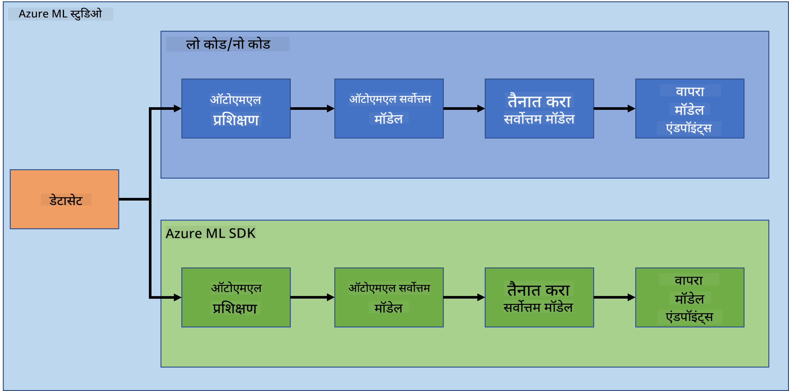
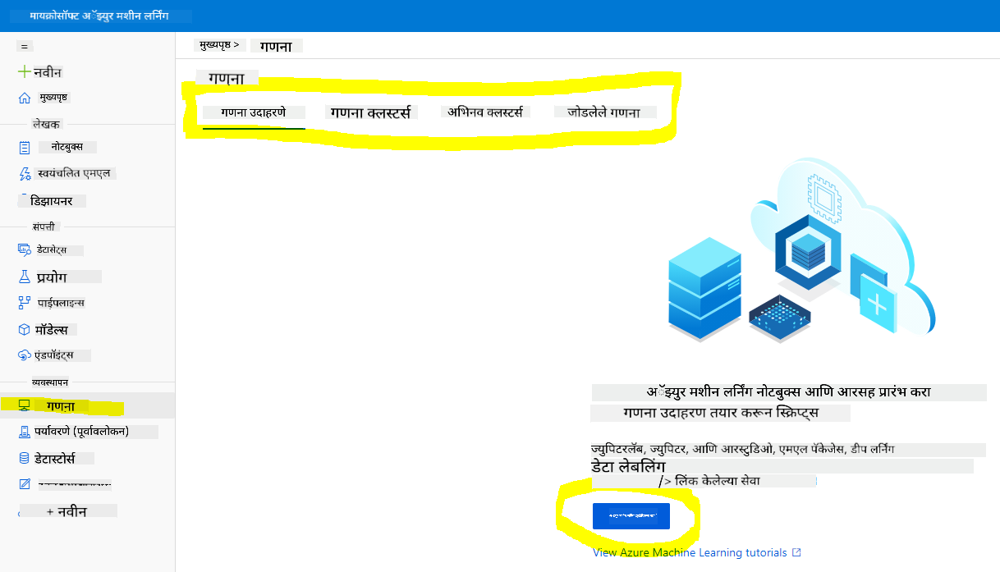
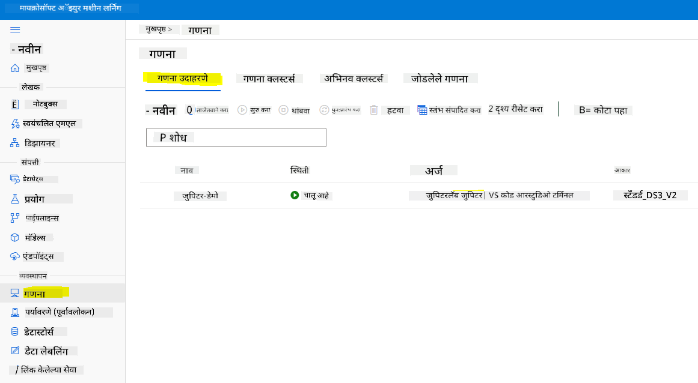
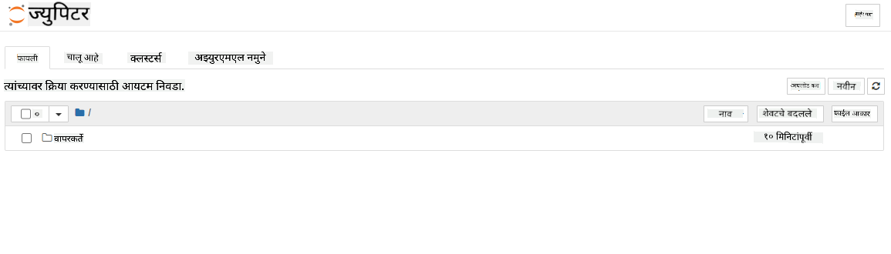

<!--
CO_OP_TRANSLATOR_METADATA:
{
  "original_hash": "73dead89dc2ddda4d6ec0232814a191e",
  "translation_date": "2025-08-27T17:48:48+00:00",
  "source_file": "5-Data-Science-In-Cloud/19-Azure/README.md",
  "language_code": "mr"
}
-->
# क्लाउडमधील डेटा सायन्स: "Azure ML SDK" पद्धत

| ](../../sketchnotes/19-DataScience-Cloud.png)|
|:---:|
| क्लाउडमधील डेटा सायन्स: Azure ML SDK - _Sketchnote by [@nitya](https://twitter.com/nitya)_ |

सामग्रीची यादी:

- [क्लाउडमधील डेटा सायन्स: "Azure ML SDK" पद्धत](../../../../5-Data-Science-In-Cloud/19-Azure)
  - [पूर्व-व्याख्यान प्रश्नमंजुषा](../../../../5-Data-Science-In-Cloud/19-Azure)
  - [1. परिचय](../../../../5-Data-Science-In-Cloud/19-Azure)
    - [1.1 Azure ML SDK म्हणजे काय?](../../../../5-Data-Science-In-Cloud/19-Azure)
    - [1.2 हार्ट फेल्युअर प्रेडिक्शन प्रोजेक्ट आणि डेटासेटची ओळख](../../../../5-Data-Science-In-Cloud/19-Azure)
  - [2. Azure ML SDK वापरून मॉडेल प्रशिक्षण](../../../../5-Data-Science-In-Cloud/19-Azure)
    - [2.1 Azure ML Workspace तयार करा](../../../../5-Data-Science-In-Cloud/19-Azure)
    - [2.2 Compute Instance तयार करा](../../../../5-Data-Science-In-Cloud/19-Azure)
    - [2.3 डेटासेट लोड करणे](../../../../5-Data-Science-In-Cloud/19-Azure)
    - [2.4 नोटबुक तयार करणे](../../../../5-Data-Science-In-Cloud/19-Azure)
    - [2.5 मॉडेल प्रशिक्षण](../../../../5-Data-Science-In-Cloud/19-Azure)
      - [2.5.1 Workspace, experiment, compute cluster आणि dataset सेटअप करा](../../../../5-Data-Science-In-Cloud/19-Azure)
      - [2.5.2 AutoML Configuration आणि प्रशिक्षण](../../../../5-Data-Science-In-Cloud/19-Azure)
  - [3. Azure ML SDK वापरून मॉडेल डिप्लॉयमेंट आणि एन्डपॉइंट वापर](../../../../5-Data-Science-In-Cloud/19-Azure)
    - [3.1 सर्वोत्तम मॉडेल सेव्ह करणे](../../../../5-Data-Science-In-Cloud/19-Azure)
    - [3.2 मॉडेल डिप्लॉयमेंट](../../../../5-Data-Science-In-Cloud/19-Azure)
    - [3.3 एन्डपॉइंट वापर](../../../../5-Data-Science-In-Cloud/19-Azure)
  - [🚀 आव्हान](../../../../5-Data-Science-In-Cloud/19-Azure)
  - [व्याख्यानानंतरची प्रश्नमंजुषा](../../../../5-Data-Science-In-Cloud/19-Azure)
  - [पुनरावलोकन आणि स्व-अभ्यास](../../../../5-Data-Science-In-Cloud/19-Azure)
  - [असाइनमेंट](../../../../5-Data-Science-In-Cloud/19-Azure)

## [पूर्व-व्याख्यान प्रश्नमंजुषा](https://purple-hill-04aebfb03.1.azurestaticapps.net/quiz/36)

## 1. परिचय

### 1.1 Azure ML SDK म्हणजे काय?

डेटा सायंटिस्ट आणि AI डेव्हलपर्स Azure Machine Learning SDK वापरून Azure Machine Learning सेवेसह मशीन लर्निंग वर्कफ्लो तयार करतात आणि चालवतात. तुम्ही कोणत्याही Python वातावरणात, जसे की Jupyter Notebooks, Visual Studio Code किंवा तुमच्या आवडत्या Python IDE मध्ये या सेवेशी संवाद साधू शकता.

SDK च्या मुख्य भागांमध्ये समाविष्ट आहे:

- मशीन लर्निंग प्रयोगांमध्ये वापरल्या जाणाऱ्या डेटासेट्सचे अन्वेषण, तयारी आणि जीवनचक्र व्यवस्थापन.
- क्लाउड संसाधनांचे व्यवस्थापन, मॉनिटरिंग, लॉगिंग आणि मशीन लर्निंग प्रयोगांचे आयोजन.
- मॉडेल्स स्थानिक पातळीवर किंवा GPU-प्रेरित मॉडेल प्रशिक्षणासह क्लाउड संसाधने वापरून प्रशिक्षित करा.
- स्वयंचलित मशीन लर्निंग वापरा, जे कॉन्फिगरेशन पॅरामीटर्स आणि प्रशिक्षण डेटा स्वीकारते. हे अल्गोरिदम आणि हायपरपॅरामीटर सेटिंग्जद्वारे स्वयंचलितपणे पुनरावृत्ती करते आणि अंदाज चालवण्यासाठी सर्वोत्तम मॉडेल शोधते.
- वेब सेवांचे डिप्लॉयमेंट करा जे तुमच्या प्रशिक्षित मॉडेल्सना RESTful सेवांमध्ये रूपांतरित करते, ज्याचा वापर कोणत्याही अॅप्लिकेशनमध्ये केला जाऊ शकतो.

[Azure Machine Learning SDK बद्दल अधिक जाणून घ्या](https://docs.microsoft.com/python/api/overview/azure/ml?WT.mc_id=academic-77958-bethanycheum&ocid=AID3041109)

[मागील धड्यात](../18-Low-Code/README.md), आपण लो कोड/नो कोड पद्धतीने मॉडेल प्रशिक्षण, डिप्लॉयमेंट आणि वापर कसे करायचे ते पाहिले. आपण हार्ट फेल्युअर डेटासेट वापरून हार्ट फेल्युअर प्रेडिक्शन मॉडेल तयार केले. या धड्यात, आपण अगदी तेच करणार आहोत पण Azure Machine Learning SDK वापरून.



### 1.2 हार्ट फेल्युअर प्रेडिक्शन प्रोजेक्ट आणि डेटासेटची ओळख

[येथे तपासा](../18-Low-Code/README.md) हार्ट फेल्युअर प्रेडिक्शन प्रोजेक्ट आणि डेटासेटची ओळख.

## 2. Azure ML SDK वापरून मॉडेल प्रशिक्षण

### 2.1 Azure ML Workspace तयार करा

सोप्या पद्धतीसाठी, आपण जुपिटर नोटबुकवर काम करणार आहोत. याचा अर्थ असा की तुमच्याकडे आधीच Workspace आणि compute instance असणे आवश्यक आहे. जर तुमच्याकडे Workspace असेल, तर तुम्ही थेट **2.3 Notebook तयार करणे** विभागाकडे जाऊ शकता.

जर नसेल, तर कृपया [मागील धड्यातील](../18-Low-Code/README.md) **2.1 Azure ML Workspace तयार करा** विभागातील सूचना Workspace तयार करण्यासाठी अनुसरण करा.

### 2.2 Compute Instance तयार करा

आपण पूर्वी तयार केलेल्या [Azure ML Workspace](https://ml.azure.com/) मध्ये जा, Compute मेनूमध्ये जा आणि तुम्हाला उपलब्ध असलेली विविध Compute संसाधने दिसतील.



चला जुपिटर नोटबुक तयार करण्यासाठी Compute Instance तयार करूया. 
1. + New बटणावर क्लिक करा. 
2. Compute Instance ला नाव द्या.
3. तुमचे पर्याय निवडा: CPU किंवा GPU, VM आकार आणि कोर संख्या.
4. Create बटणावर क्लिक करा.

अभिनंदन, तुम्ही Compute Instance तयार केले आहे! आपण [नोटबुक तयार करणे](../../../../5-Data-Science-In-Cloud/19-Azure) विभागात या Compute Instance चा वापर करू.

### 2.3 डेटासेट लोड करणे

जर तुम्ही अद्याप डेटासेट अपलोड केले नसेल, तर [मागील धडातील](../18-Low-Code/README.md) **2.3 डेटासेट लोड करणे** विभागाचा संदर्भ घ्या.

### 2.4 नोटबुक तयार करणे

> **_टीप:_** पुढील चरणासाठी तुम्ही नवीन नोटबुक स्क्रॅचपासून तयार करू शकता किंवा तुम्ही [आम्ही तयार केलेला नोटबुक](notebook.ipynb) Azure ML Studio मध्ये अपलोड करू शकता. अपलोड करण्यासाठी, फक्त "Notebook" मेनूवर क्लिक करा आणि नोटबुक अपलोड करा.

नोटबुक डेटा सायन्स प्रक्रियेचा खूप महत्त्वाचा भाग आहे. ते Exploratory Data Analysis (EDA) करण्यासाठी, Compute Cluster ला कॉल करून मॉडेल प्रशिक्षणासाठी किंवा Inference Cluster ला कॉल करून एन्डपॉइंट डिप्लॉय करण्यासाठी वापरले जाऊ शकते.

नोटबुक तयार करण्यासाठी, आपल्याला जुपिटर नोटबुक Instance चालवणारा Compute Node आवश्यक आहे. [Azure ML Workspace](https://ml.azure.com/) वर परत जा आणि Compute Instances वर क्लिक करा. Compute Instances च्या यादीत तुम्हाला [आधी तयार केलेला Compute Instance](../../../../5-Data-Science-In-Cloud/19-Azure) दिसेल.

1. Applications विभागात, Jupyter पर्यायावर क्लिक करा. 
2. "Yes, I understand" बॉक्सवर टिक करा आणि Continue बटणावर क्लिक करा.

3. यामुळे तुमच्या जुपिटर नोटबुक Instance सह नवीन ब्राउझर टॅब उघडले पाहिजे. "New" बटणावर क्लिक करून नोटबुक तयार करा.



आता आपल्याकडे नोटबुक आहे, आपण Azure ML SDK वापरून मॉडेल प्रशिक्षण सुरू करू शकतो.

### 2.5 मॉडेल प्रशिक्षण

सर्वप्रथम, जर तुम्हाला कधीही शंका असेल, तर [Azure ML SDK दस्तऐवज](https://docs.microsoft.com/python/api/overview/azure/ml?WT.mc_id=academic-77958-bethanycheum&ocid=AID3041109) पहा. यात आपण या धड्यात पाहणार असलेल्या मॉड्यूल्सची सर्व आवश्यक माहिती आहे.

#### 2.5.1 Workspace, experiment, compute cluster आणि dataset सेटअप करा

तुम्हाला खालील कोड वापरून `workspace` कॉन्फिगरेशन फाइलमधून लोड करणे आवश्यक आहे:

```python
from azureml.core import Workspace
ws = Workspace.from_config()
```

हे Workspace प्रकाराचे ऑब्जेक्ट परत करते जे Workspace चे प्रतिनिधित्व करते. त्यानंतर तुम्हाला खालील कोड वापरून `experiment` तयार करणे आवश्यक आहे:

```python
from azureml.core import Experiment
experiment_name = 'aml-experiment'
experiment = Experiment(ws, experiment_name)
```
Workspace मधून experiment मिळवण्यासाठी किंवा तयार करण्यासाठी, तुम्ही experiment नाव वापरून विनंती करता. Experiment नाव 3-36 अक्षरे असले पाहिजे, अक्षर किंवा संख्येने सुरू होणे आवश्यक आहे आणि फक्त अक्षरे, संख्या, अंडरस्कोर्स आणि डॅशेस असू शकतात. Workspace मध्ये experiment सापडला नाही तर नवीन experiment तयार केला जातो.

आता तुम्हाला खालील कोड वापरून प्रशिक्षणासाठी Compute Cluster तयार करणे आवश्यक आहे. लक्षात ठेवा की या चरणाला काही मिनिटे लागू शकतात.

```python
from azureml.core.compute import AmlCompute

aml_name = "heart-f-cluster"
try:
    aml_compute = AmlCompute(ws, aml_name)
    print('Found existing AML compute context.')
except:
    print('Creating new AML compute context.')
    aml_config = AmlCompute.provisioning_configuration(vm_size = "Standard_D2_v2", min_nodes=1, max_nodes=3)
    aml_compute = AmlCompute.create(ws, name = aml_name, provisioning_configuration = aml_config)
    aml_compute.wait_for_completion(show_output = True)

cts = ws.compute_targets
compute_target = cts[aml_name]
```

तुम्ही Workspace मधून dataset नाव वापरून dataset मिळवू शकता:

```python
dataset = ws.datasets['heart-failure-records']
df = dataset.to_pandas_dataframe()
df.describe()
```
#### 2.5.2 AutoML Configuration आणि प्रशिक्षण

AutoML Configuration सेट करण्यासाठी [AutoMLConfig class](https://docs.microsoft.com/python/api/azureml-train-automl-client/azureml.train.automl.automlconfig(class)?WT.mc_id=academic-77958-bethanycheum&ocid=AID3041109) वापरा.

दस्तऐवजात वर्णन केल्याप्रमाणे, तुम्ही खेळू शकता अशा अनेक पॅरामीटर्स आहेत. या प्रोजेक्टसाठी, आपण खालील पॅरामीटर्स वापरणार आहोत:

- `experiment_timeout_minutes`: प्रयोग चालविण्यासाठी अनुमती दिलेला जास्तीत जास्त वेळ (मिनिटांमध्ये) जो आपोआप थांबवला जातो आणि निकाल आपोआप उपलब्ध होतात.
- `max_concurrent_iterations`: प्रयोगासाठी अनुमती दिलेल्या जास्तीत जास्त एकत्रित प्रशिक्षण पुनरावृत्ती.
- `primary_metric`: प्रयोगाची स्थिती ठरवण्यासाठी वापरलेला प्राथमिक मेट्रिक.
- `compute_target`: स्वयंचलित मशीन लर्निंग प्रयोग चालवण्यासाठी Azure Machine Learning Compute Target.
- `task`: चालवायच्या कार्याचा प्रकार. 'classification', 'regression', किंवा 'forecasting' मूल्ये असू शकतात.
- `training_data`: प्रयोगामध्ये वापरण्यासाठी प्रशिक्षण डेटा. यात प्रशिक्षण वैशिष्ट्ये आणि लेबल कॉलम (पर्यायी सॅम्पल वेट्स कॉलम) असणे आवश्यक आहे.
- `label_column_name`: लेबल कॉलमचे नाव.
- `path`: Azure Machine Learning प्रोजेक्ट फोल्डरचा पूर्ण मार्ग.
- `enable_early_stopping`: स्कोअर अल्पकालीन सुधारत नसल्यास लवकर समाप्ती सक्षम करायची की नाही.
- `featurization`: स्वयंचलितपणे फीचरायझेशन चरण करायचा की नाही, किंवा सानुकूलित फीचरायझेशन वापरायचा.
- `debug_log`: डिबग माहिती लिहिण्यासाठी लॉग फाइल.

```python
from azureml.train.automl import AutoMLConfig

project_folder = './aml-project'

automl_settings = {
    "experiment_timeout_minutes": 20,
    "max_concurrent_iterations": 3,
    "primary_metric" : 'AUC_weighted'
}

automl_config = AutoMLConfig(compute_target=compute_target,
                             task = "classification",
                             training_data=dataset,
                             label_column_name="DEATH_EVENT",
                             path = project_folder,  
                             enable_early_stopping= True,
                             featurization= 'auto',
                             debug_log = "automl_errors.log",
                             **automl_settings
                            )
```
आता तुमची कॉन्फिगरेशन सेट झाली आहे, तुम्ही खालील कोड वापरून मॉडेल प्रशिक्षण करू शकता. या चरणाला तुमच्या क्लस्टर आकारावर अवलंबून एक तास लागू शकतो.

```python
remote_run = experiment.submit(automl_config)
```
तुम्ही RunDetails विजेट चालवू शकता जे विविध प्रयोग दर्शवते.
```python
from azureml.widgets import RunDetails
RunDetails(remote_run).show()
```

## 3. Azure ML SDK वापरून मॉडेल डिप्लॉयमेंट आणि एन्डपॉइंट वापर

### 3.1 सर्वोत्तम मॉडेल सेव्ह करणे

`remote_run` हा [AutoMLRun](https://docs.microsoft.com/python/api/azureml-train-automl-client/azureml.train.automl.run.automlrun?WT.mc_id=academic-77958-bethanycheum&ocid=AID3041109) प्रकाराचा ऑब्जेक्ट आहे. या ऑब्जेक्टमध्ये `get_output()` पद्धत आहे जी सर्वोत्तम रन आणि संबंधित फिट केलेले मॉडेल परत करते.

```python
best_run, fitted_model = remote_run.get_output()
```
तुम्ही फक्त fitted_model प्रिंट करून सर्वोत्तम मॉडेलसाठी वापरलेले पॅरामीटर्स पाहू शकता आणि [get_properties()](https://docs.microsoft.com/python/api/azureml-core/azureml.core.run(class)?view=azure-ml-py#azureml_core_Run_get_properties?WT.mc_id=academic-77958-bethanycheum&ocid=AID3041109) पद्धत वापरून सर्वोत्तम मॉडेलची गुणधर्म पाहू शकता.

```python
best_run.get_properties()
```

आता [register_model](https://docs.microsoft.com/python/api/azureml-train-automl-client/azureml.train.automl.run.automlrun?view=azure-ml-py#register-model-model-name-none--description-none--tags-none--iteration-none--metric-none-?WT.mc_id=academic-77958-bethanycheum&ocid=AID3041109) पद्धत वापरून मॉडेल नोंदणी करा.
```python
model_name = best_run.properties['model_name']
script_file_name = 'inference/score.py'
best_run.download_file('outputs/scoring_file_v_1_0_0.py', 'inference/score.py')
description = "aml heart failure project sdk"
model = best_run.register_model(model_name = model_name,
                                model_path = './outputs/',
                                description = description,
                                tags = None)
```

### 3.2 मॉडेल डिप्लॉयमेंट

सर्वोत्तम मॉडेल सेव्ह झाल्यानंतर, आपण [InferenceConfig](https://docs.microsoft.com/python/api/azureml-core/azureml.core.model.inferenceconfig?view=azure-ml-py?ocid=AID3041109) वर्ग वापरून ते डिप्लॉय करू शकतो. InferenceConfig डिप्लॉयमेंटसाठी वापरल्या जाणाऱ्या सानुकूल वातावरणासाठी कॉन्फिगरेशन सेटिंग्जचे प्रतिनिधित्व करते. [AciWebservice](https://docs.microsoft.com/python/api/azureml-core/azureml.core.webservice.aciwebservice?view=azure-ml-py) वर्ग Azure Container Instances वर वेब सेवा एन्डपॉइंट म्हणून डिप्लॉय केलेल्या मशीन लर्निंग मॉडेलचे प्रतिनिधित्व करते. डिप्लॉय केलेली सेवा मॉडेल, स्क्रिप्ट आणि संबंधित फाइल्समधून तयार केली जाते. परिणामी वेब सेवा लोड-बॅलन्स केलेला, HTTP एन्डपॉइंट आहे ज्यामध्ये REST API आहे. तुम्ही या API ला डेटा पाठवू शकता आणि मॉडेलद्वारे परत केलेला अंदाज प्राप्त करू शकता.

मॉडेल [deploy](https://docs.microsoft.com/python/api/azureml-core/azureml.core.model(class)?view=azure-ml-py#deploy-workspace--name--models--inference-config-none--deployment-config-none--deployment-target-none--overwrite-false--show-output-false-?WT.mc_id=academic-77958-bethanycheum&ocid=AID3041109) पद्धत वापरून डिप्लॉय केले जाते.

```python
from azureml.core.model import InferenceConfig, Model
from azureml.core.webservice import AciWebservice

inference_config = InferenceConfig(entry_script=script_file_name, environment=best_run.get_environment())

aciconfig = AciWebservice.deploy_configuration(cpu_cores = 1,
                                               memory_gb = 1,
                                               tags = {'type': "automl-heart-failure-prediction"},
                                               description = 'Sample service for AutoML Heart Failure Prediction')

aci_service_name = 'automl-hf-sdk'
aci_service = Model.deploy(ws, aci_service_name, [model], inference_config, aciconfig)
aci_service.wait_for_deployment(True)
print(aci_service.state)
```
या चरणाला काही मिनिटे लागू शकतात.

### 3.3 एन्डपॉइंट वापर

तुम्ही तुमचा एन्डपॉइंट तयार करून नमुना इनपुट तयार करू शकता:

```python
data = {
    "data":
    [
        {
            'age': "60",
            'anaemia': "false",
            'creatinine_phosphokinase': "500",
            'diabetes': "false",
            'ejection_fraction': "38",
            'high_blood_pressure': "false",
            'platelets': "260000",
            'serum_creatinine': "1.40",
            'serum_sodium': "137",
            'sex': "false",
            'smoking': "false",
            'time': "130",
        },
    ],
}

test_sample = str.encode(json.dumps(data))
```
आणि नंतर तुम्ही अंदाजासाठी तुमच्या मॉडेलला हा इनपुट पाठवू शकता:
```python
response = aci_service.run(input_data=test_sample)
response
```
याने `'{"result": [false]}'` असे आउटपुट मिळायला हवे. याचा अर्थ आपण एन्डपॉइंटला पाठवलेले रुग्णाचे इनपुट `false` अशी भविष्यवाणी निर्माण करते, ज्याचा अर्थ असा आहे की या व्यक्तीला हार्ट अटॅक होण्याची शक्यता नाही.

अभिनंदन! तुम्ही Azure ML वर प्रशिक्षित आणि तैनात केलेला मॉडेल Azure ML SDK चा वापर करून यशस्वीपणे वापरला आहे!

> **_NOTE:_** प्रकल्प पूर्ण झाल्यावर, सर्व संसाधने हटवायला विसरू नका.

## 🚀 आव्हान

SDK च्या माध्यमातून तुम्ही अनेक गोष्टी करू शकता, दुर्दैवाने, या धड्यात आपण त्या सर्व पाहू शकत नाही. पण चांगली बातमी म्हणजे, SDK दस्तऐवजांमधून माहिती शोधण्याची कला शिकल्यास तुम्ही स्वतःच खूप पुढे जाऊ शकता. Azure ML SDK दस्तऐवजांवर एक नजर टाका आणि `Pipeline` वर्ग शोधा जो तुम्हाला पाइपलाइन तयार करण्यास अनुमती देतो. पाइपलाइन म्हणजे अनेक चरणांची एक संग्रह आहे जी वर्कफ्लो म्हणून कार्यान्वित केली जाऊ शकते.

**सूचना:** [SDK दस्तऐवज](https://docs.microsoft.com/python/api/overview/azure/ml/?view=azure-ml-py?WT.mc_id=academic-77958-bethanycheum&ocid=AID3041109) वर जा आणि शोध बारमध्ये "Pipeline" सारखे कीवर्ड टाइप करा. तुम्हाला शोध परिणामांमध्ये `azureml.pipeline.core.Pipeline` वर्ग दिसायला हवा.

## [पाठानंतरचा क्विझ](https://purple-hill-04aebfb03.1.azurestaticapps.net/quiz/37)

## पुनरावलोकन आणि स्व-अभ्यास

या धड्यात, तुम्ही Azure ML SDK चा वापर करून क्लाउडमध्ये हार्ट फेल्युअरचा धोका भाकीत करणारा मॉडेल कसा प्रशिक्षित, तैनात आणि वापरायचा ते शिकले. Azure ML SDK बद्दल अधिक माहितीसाठी [दस्तऐवज](https://docs.microsoft.com/python/api/overview/azure/ml/?view=azure-ml-py?WT.mc_id=academic-77958-bethanycheum&ocid=AID3041109) तपासा. Azure ML SDK चा वापर करून स्वतःचा मॉडेल तयार करण्याचा प्रयत्न करा.

## असाइनमेंट

[Azure ML SDK वापरून डेटा सायन्स प्रकल्प](assignment.md)

---

**अस्वीकरण**:  
हा दस्तऐवज AI भाषांतर सेवा [Co-op Translator](https://github.com/Azure/co-op-translator) वापरून भाषांतरित करण्यात आला आहे. आम्ही अचूकतेसाठी प्रयत्नशील असलो तरी कृपया लक्षात ठेवा की स्वयंचलित भाषांतरे त्रुटी किंवा अचूकतेच्या अभावाने युक्त असू शकतात. मूळ भाषेतील दस्तऐवज हा अधिकृत स्रोत मानला जावा. महत्त्वाच्या माहितीसाठी व्यावसायिक मानवी भाषांतराची शिफारस केली जाते. या भाषांतराचा वापर करून उद्भवलेल्या कोणत्याही गैरसमज किंवा चुकीच्या अर्थासाठी आम्ही जबाबदार नाही.