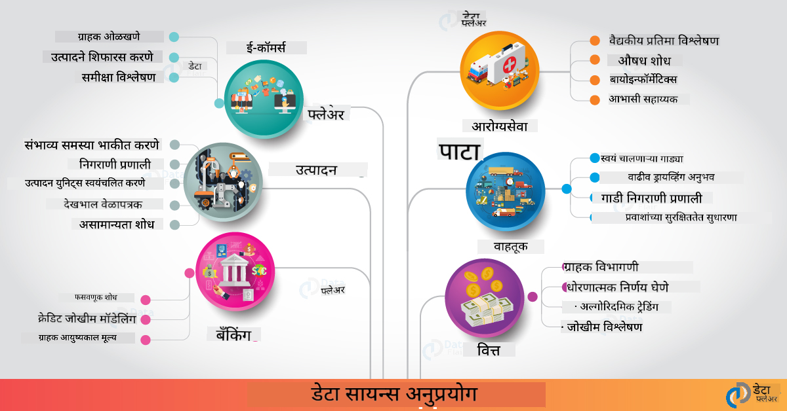

<!--
CO_OP_TRANSLATOR_METADATA:
{
  "original_hash": "67076ed50f54e7d26ba1ba378d6078f1",
  "translation_date": "2025-08-27T17:30:16+00:00",
  "source_file": "6-Data-Science-In-Wild/20-Real-World-Examples/README.md",
  "language_code": "mr"
}
-->
# वास्तविक जगातील डेटा सायन्स

|  ](../../sketchnotes/20-DataScience-RealWorld.png) |
| :--------------------------------------------------------------------------------------------------------------: |
|               वास्तविक जगातील डेटा सायन्स - _Sketchnote by [@nitya](https://twitter.com/nitya)_               |

आपल्या शिकण्याच्या प्रवासाचा शेवट जवळ आला आहे!

आपण डेटा सायन्स आणि नैतिकतेच्या व्याख्यांपासून सुरुवात केली, डेटा विश्लेषण आणि व्हिज्युअलायझेशनसाठी विविध साधने आणि तंत्रे शोधली, डेटा सायन्स जीवनचक्राचा आढावा घेतला आणि क्लाउड संगणन सेवांसह डेटा सायन्स वर्कफ्लो स्केलिंग आणि ऑटोमेशन कसे करावे हे पाहिले. त्यामुळे तुम्ही कदाचित विचार करत असाल: _"हे सर्व शिकलेले ज्ञान वास्तविक जगातील संदर्भांशी कसे जोडायचे?"_

या धड्यात, आपण उद्योगातील डेटा सायन्सच्या वास्तविक जगातील अनुप्रयोगांचा शोध घेऊ आणि संशोधन, डिजिटल मानविकी आणि शाश्वतता यासारख्या विशिष्ट उदाहरणांमध्ये डोकावू. आपण विद्यार्थ्यांसाठी प्रकल्प संधी पाहू आणि आपल्या शिकण्याच्या प्रवासाला पुढे नेण्यासाठी उपयुक्त संसाधनांसह समाप्त करू!

## पूर्व-व्याख्यान प्रश्नमंजुषा

[पूर्व-व्याख्यान प्रश्नमंजुषा](https://purple-hill-04aebfb03.1.azurestaticapps.net/quiz/38)

## डेटा सायन्स + उद्योग

AI च्या लोकशाहीकरणामुळे, विकसकांना आता AI-चालित निर्णय घेणे आणि डेटा-चालित अंतर्दृष्टी वापरकर्ता अनुभवांमध्ये आणि विकास कार्यप्रवाहांमध्ये समाकलित करणे सोपे झाले आहे. येथे उद्योगातील वास्तविक जगातील अनुप्रयोगांमध्ये डेटा सायन्स "लागू" कसा केला जातो याची काही उदाहरणे आहेत:

 * [Google Flu Trends](https://www.wired.com/2015/10/can-learn-epic-failure-google-flu-trends/) ने शोध शब्दांचा फ्लू ट्रेंड्सशी संबंध जोडण्यासाठी डेटा सायन्सचा वापर केला. जरी या दृष्टिकोनात त्रुटी होत्या, तरीही यामुळे डेटा-चालित आरोग्यसेवा अंदाजांच्या शक्यता (आणि आव्हाने) याबद्दल जागरूकता निर्माण झाली.

 * [UPS Routing Predictions](https://www.technologyreview.com/2018/11/21/139000/how-ups-uses-ai-to-outsmart-bad-weather/) - UPS कसे डेटा सायन्स आणि मशीन लर्निंगचा वापर करून हवामान परिस्थिती, वाहतूक नमुने, वितरणाच्या अंतिम मुदती आणि इतर घटक विचारात घेऊन वितरणासाठी सर्वोत्तम मार्गांची भविष्यवाणी करते हे स्पष्ट करते.

 * [NYC Taxicab Route Visualization](http://chriswhong.github.io/nyctaxi/) - [माहिती स्वातंत्र्य कायद्यांचा](https://chriswhong.com/open-data/foil_nyc_taxi/) वापर करून गोळा केलेल्या डेटाने NYC कॅब्सच्या एका दिवसाचे व्हिज्युअलायझेशन केले, ज्यामुळे आम्हाला समजले की ते गजबजलेल्या शहरात कसे नेव्हिगेट करतात, ते किती पैसे कमावतात आणि प्रत्येक २४ तासांच्या कालावधीत प्रवास किती काळ टिकतो.

 * [Uber Data Science Workbench](https://eng.uber.com/dsw/) - दररोज लाखो उबर ट्रिप्समधून गोळा केलेल्या डेटाचा (पिकअप आणि ड्रॉपऑफ स्थान, प्रवासाचा कालावधी, प्राधान्य मार्ग इ.) वापर करून किंमत निर्धारण, सुरक्षा, फसवणूक शोधणे आणि नेव्हिगेशन निर्णयांसाठी डेटा अॅनालिटिक्स साधन तयार केले.

 * [Sports Analytics](https://towardsdatascience.com/scope-of-analytics-in-sports-world-37ed09c39860) - _भविष्यवाणी विश्लेषण_ (संघ आणि खेळाडू विश्लेषण - [Moneyball](https://datasciencedegree.wisconsin.edu/blog/moneyball-proves-importance-big-data-big-ideas/) विचार करा - आणि चाहत्यांचे व्यवस्थापन) आणि _डेटा व्हिज्युअलायझेशन_ (संघ आणि चाहत्यांचे डॅशबोर्ड, खेळ इ.) वर लक्ष केंद्रित करते, ज्यामध्ये प्रतिभा शोधणे, क्रीडा जुगार आणि इन्व्हेंटरी/स्थळ व्यवस्थापन यासारख्या अनुप्रयोगांचा समावेश आहे.

 * [Data Science in Banking](https://data-flair.training/blogs/data-science-in-banking/) - वित्तीय उद्योगातील डेटा सायन्सच्या मूल्यावर प्रकाश टाकते, ज्यामध्ये जोखीम मॉडेलिंग आणि फसवणूक शोधणे, ग्राहक विभागणी, रिअल-टाइम अंदाज आणि शिफारस प्रणाली यासारख्या अनुप्रयोगांचा समावेश आहे. भविष्यवाणी विश्लेषण देखील [क्रेडिट स्कोअर्स](https://dzone.com/articles/using-big-data-and-predictive-analytics-for-credit) सारख्या महत्त्वाच्या उपायांना चालना देते.

 * [Data Science in Healthcare](https://data-flair.training/blogs/data-science-in-healthcare/) - वैद्यकीय प्रतिमा (उदा., MRI, X-Ray, CT-Scan), जीनोमिक्स (DNA अनुक्रमण), औषध विकास (जोखीम मूल्यांकन, यशस्वी अंदाज), भविष्यवाणी विश्लेषण (रुग्ण काळजी आणि पुरवठा लॉजिस्टिक्स), रोग ट्रॅकिंग आणि प्रतिबंध यासारख्या अनुप्रयोगांवर प्रकाश टाकते.

 प्रतिमा श्रेय: [Data Flair: 6 Amazing Data Science Applications ](https://data-flair.training/blogs/data-science-applications/)

चित्रात डेटा सायन्स तंत्र लागू करण्यासाठी इतर डोमेन आणि उदाहरणे दर्शविली आहेत. इतर अनुप्रयोगांचा शोध घ्यायचा आहे का? खालील [पुनरावलोकन आणि स्व-अभ्यास](../../../../6-Data-Science-In-Wild/20-Real-World-Examples) विभाग तपासा.

## डेटा सायन्स + संशोधन

|  ](../../sketchnotes/20-DataScience-Research.png) |
| :---------------------------------------------------------------------------------------------------------------: |
|              डेटा सायन्स आणि संशोधन - _Sketchnote by [@nitya](https://twitter.com/nitya)_              |

वास्तविक जगातील अनुप्रयोग प्रामुख्याने उद्योगातील मोठ्या प्रमाणातील वापरावर लक्ष केंद्रित करतात, तर _संशोधन_ अनुप्रयोग आणि प्रकल्प दोन दृष्टिकोनातून उपयुक्त ठरू शकतात:

* _नाविन्यपूर्ण संधी_ - पुढील पिढीच्या अनुप्रयोगांसाठी प्रगत संकल्पनांचे जलद प्रोटोटायपिंग आणि वापरकर्ता अनुभवांची चाचणी घेणे.
* _तैनाती आव्हाने_ - वास्तविक जगातील संदर्भांमध्ये डेटा सायन्स तंत्रज्ञानाच्या संभाव्य हानी किंवा अनपेक्षित परिणामांचा तपास करणे.

विद्यार्थ्यांसाठी, हे संशोधन प्रकल्प शिकण्याच्या आणि सहकार्याच्या संधी प्रदान करू शकतात, जे तुमच्या विषयावरील समज सुधारू शकतात आणि संबंधित लोक किंवा कार्यसंघांसोबत तुमची जागरूकता आणि सहभाग वाढवू शकतात. तर संशोधन प्रकल्प कसे दिसतात आणि ते कसा प्रभाव पाडू शकतात?

चला एका उदाहरणाकडे पाहूया - [MIT Gender Shades Study](http://gendershades.org/overview.html) ज्याचे नेतृत्व जॉय बुओलाम्विनी (MIT मीडिया लॅब्स) यांनी केले आणि [टिम्निट गेब्रू](http://proceedings.mlr.press/v81/buolamwini18a/buolamwini18a.pdf) यांच्यासोबत सह-लेखक असलेल्या संशोधन पेपरसह (त्यावेळी मायक्रोसॉफ्ट रिसर्चमध्ये) प्रकाशित केले. संशोधनाचा उद्देश होता:

 * **काय:** लिंग आणि त्वचेच्या प्रकारावर आधारित स्वयंचलित चेहर्यावरील विश्लेषण अल्गोरिदम आणि डेटासेट्समधील पूर्वग्रहांचे मूल्यांकन करणे.
 * **का:** चेहर्यावरील विश्लेषण कायद्याची अंमलबजावणी, विमानतळ सुरक्षा, भरती प्रणाली आणि इतर क्षेत्रांमध्ये वापरले जाते - जिथे चुकीचे वर्गीकरण (उदा., पूर्वग्रहांमुळे) प्रभावित व्यक्ती किंवा गटांसाठी संभाव्य आर्थिक आणि सामाजिक हानी होऊ शकते. वापरातील न्याय सुनिश्चित करण्यासाठी पूर्वग्रह समजून घेणे (आणि काढून टाकणे किंवा कमी करणे) महत्त्वाचे आहे.
 * **कसे:** संशोधकांनी ओळखले की विद्यमान बेंचमार्कमध्ये प्रामुख्याने फिकट त्वचेच्या व्यक्तींचा समावेश आहे आणि त्यांनी एक नवीन डेटासेट (१०००+ प्रतिमा) तयार केले जे लिंग आणि त्वचेच्या प्रकारानुसार अधिक संतुलित होते. डेटासेटचा वापर मायक्रोसॉफ्ट, IBM आणि Face++ च्या तीन लिंग वर्गीकरण उत्पादनांच्या अचूकतेचे मूल्यांकन करण्यासाठी केला गेला.

परिणामांमध्ये असे दिसून आले की एकूण वर्गीकरण अचूकता चांगली असली तरी विविध उपगटांमध्ये त्रुटी दरांमध्ये लक्षणीय फरक होता - **मिसजेंडरिंग** महिलांसाठी किंवा गडद त्वचेच्या प्रकारांसाठी जास्त होता, जो पूर्वग्रह दर्शवितो.

**महत्त्वाचे परिणाम:** डेटा सायन्सला अधिक _प्रतिनिधिक डेटासेट्स_ (संतुलित उपगट) आणि अधिक _समावेशक संघ_ (विविध पार्श्वभूमी) आवश्यक आहेत हे दाखवून दिले, जे AI सोल्यूशन्समध्ये असे पूर्वग्रह लवकर ओळखून काढून टाकण्यासाठी किंवा कमी करण्यासाठी महत्त्वाचे आहे. अशा संशोधन प्रयत्नांमुळे अनेक संस्थांना त्यांच्या AI उत्पादनांमध्ये आणि प्रक्रियांमध्ये न्याय सुनिश्चित करण्यासाठी _जबाबदार AI_ साठी तत्त्वे आणि पद्धती परिभाषित करण्यात मदत झाली.

**मायक्रोसॉफ्टमधील संबंधित संशोधन प्रयत्नांबद्दल जाणून घ्यायचे आहे का?**

* [Microsoft Research Projects](https://www.microsoft.com/research/research-area/artificial-intelligence/?facet%5Btax%5D%5Bmsr-research-area%5D%5B%5D=13556&facet%5Btax%5D%5Bmsr-content-type%5D%5B%5D=msr-project) वर कृत्रिम बुद्धिमत्तेवरील प्रकल्प तपासा.
* [Microsoft Research Data Science Summer School](https://www.microsoft.com/en-us/research/academic-program/data-science-summer-school/) मधील विद्यार्थी प्रकल्प शोधा.
* [Fairlearn](https://fairlearn.org/) प्रकल्प आणि [Responsible AI](https://www.microsoft.com/en-us/ai/responsible-ai?activetab=pivot1%3aprimaryr6) उपक्रम तपासा.

## डेटा सायन्स + मानविकी

|  ](../../sketchnotes/20-DataScience-Humanities.png) |
| :---------------------------------------------------------------------------------------------------------------: |
|              डेटा सायन्स आणि डिजिटल मानविकी - _Sketchnote by [@nitya](https://twitter.com/nitya)_              |

डिजिटल मानविकी [असे परिभाषित केले गेले आहे](https://digitalhumanities.stanford.edu/about-dh-stanford) की "मानवीय चौकशीसह संगणकीय पद्धती एकत्र करणाऱ्या पद्धती आणि दृष्टिकोनांचा संग्रह". [स्टॅनफोर्ड प्रकल्प](https://digitalhumanities.stanford.edu/projects) जसे की _"इतिहास पुन्हा सुरू करणे"_ आणि _"काव्यात्मक विचार"_ डिजिटल मानविकी आणि डेटा सायन्स यांच्यातील दुव्याचे उदाहरण देतात - नेटवर्क विश्लेषण, माहिती व्हिज्युअलायझेशन, स्थानिक आणि मजकूर विश्लेषण यासारख्या तंत्रांवर भर देऊन ऐतिहासिक आणि साहित्यिक डेटासेट्सचा पुनर्विचार करण्यासाठी नवीन अंतर्दृष्टी आणि दृष्टिकोन प्राप्त करण्यासाठी मदत करतात.

*या क्षेत्रातील प्रकल्प शोधायचा आणि विस्तारित करायचा आहे का?*

["Emily Dickinson and the Meter of Mood"](https://gist.github.com/jlooper/ce4d102efd057137bc000db796bfd671) तपासा - [Jen Looper](https://twitter.com/jenlooper) यांच्याकडून एक उत्कृष्ट उदाहरण जे विचारते की आपण डेटा सायन्सचा वापर करून परिचित कवितांचा पुनर्विचार कसा करू शकतो आणि नवीन संदर्भांमध्ये त्याचा अर्थ आणि लेखकाचे योगदान पुन्हा कसे मूल्यांकन करू शकतो. उदाहरणार्थ, _कवितेच्या टोन किंवा भावना विश्लेषणाद्वारे ती कोणत्या ऋतूमध्ये लिहिली गेली याचा अंदाज लावता येतो का_ - आणि यामुळे संबंधित कालावधीत लेखकाच्या मानसिक स्थितीबद्दल काय सांगते?

त्या प्रश्नाचे उत्तर देण्यासाठी, आपण डेटा सायन्स जीवनचक्राच्या टप्प्यांचे अनुसरण करतो:
 * [`डेटा संकलन`](https://gist.github.com/jlooper/ce4d102efd057137bc000db796bfd671#acquiring-the-dataset) - विश्लेषणासाठी संबंधित डेटासेट गोळा करणे. API (उदा., [Poetry DB API](https://poetrydb.org/index.html)) वापरणे किंवा वेब पृष्ठे स्क्रॅप करणे (उदा., [Project Gutenberg](https://www.gutenberg.org/files/12242/12242-h/12242-h.htm)) यासारखे पर्याय.
 * [`डेटा स्वच्छता`](https://gist.github.com/jlooper/ce4d102efd057137bc000db796bfd671#clean-the-data) - मजकूर स्वरूपित करणे, स्वच्छ करणे आणि सोपे करणे याचे स्पष्टीकरण देते, यासाठी Visual Studio Code आणि Microsoft Excel यासारखी मूलभूत साधने वापरली जातात.
 * [`डेटा विश्लेषण`](https://gist.github.com/jlooper/ce4d102efd057137bc000db796bfd671#working-with-the-data-in-a-notebook) - डेटासेट "नोटबुक्स" मध्ये आयात करून Python पॅकेजेस (जसे pandas, numpy आणि matplotlib) चा वापर करून डेटा आयोजित आणि व्हिज्युअलायझेशन कसे करावे याचे स्पष्टीकरण देते.
 * [`भावना विश्लेषण`](https://gist.github.com/jlooper/ce4d102efd057137bc000db796bfd671#sentiment-analysis-using-cognitive-services) - क्लाउड सेवांसारख्या Text Analytics चा समावेश कसा करू शकतो, याचे स्पष्टीकरण देते, कमी-कोड साधनांसह [Power Automate](https://flow.microsoft.com/en-us/) वापरून स्वयंचलित डेटा प्रक्रिया कार्यप्रवाहांसाठी.

या कार्यप्रवाहाचा वापर करून, आपण कवितांच्या भावनांवर ऋतूंचा प्रभाव शोधू शकतो आणि लेखकाबद्दल आपले स्वतःचे दृष्टिकोन तयार करू शकतो. स्वतः प्रयत्न करा - मग नोटबुक विस्तारित करा, इतर प्रश्न विचारा किंवा डेटा नवीन पद्धतीने व्हिज्युअल करा!

> तुम्ही [डिजिटल मानविकी टूलकिट](https://github.com/Digital-Humanities-Toolkit) मधील काही साधनांचा वापर करून या चौकशीच्या मार्गांचा पाठपुरावा करू शकता.

## डेटा सायन्स + शाश्वतता

|  ](../../sketchnotes/20-DataScience-Sustainability.png) |
| :---------------------------------------------------------------------------------------------------------------: |
|              डेटा सायन्स आणि शाश्वतता - _Sketchnote by [@nitya](https://twitter.com/nitya)_              |

[२०३० शाश्वत विकासासाठी अजेंडा](https://sdgs.un.org/2030agenda) - २०१५ मध्ये सर्व संयुक्त राष्ट्र सदस्यांनी स्वीकारलेला - १७ उद्दिष्टे ओळखतो, ज्यामध्ये **ग्रहाचे संरक्षण** हे उद्दिष्ट आहे, ज्यामध्ये हवामान बदलाचा परिणाम आणि पर्यावरणीय हानी यांचा समावेश आहे. [Microsoft Sustainability](https://www.microsoft.com/en-us/sustainability) उपक्रम या उद्दिष्टांचे समर्थन करतो, तंत्रज्ञानाच्या उपायांचा वापर करून अधिक शाश्वत भविष्य तयार करण्याच्या मार्गांचा शोध घेतो, ज्यामध्ये [४ उद्दिष्टांवर लक्ष केंद्रित केले आहे](https://dev.to/azure/a-visual-guide-to-sustainable-software-engineering-53hh) - २०३० पर्यंत कार्बन नकारात्मक, पाण्याचे सकारात्मक, शून्य कचरा आणि जैवविविधता.

या आव्हानांना स्केलेबल आणि वेळेवर हाताळण्यासाठी क्लाउड-स्केल विचार आणि मोठ्या प्रमाणातील डेटा आवश्यक आहे. [Planetary Computer](https://planetarycomputer.microsoft.com/) उपक्रम डेटा सायंटिस्ट्स आणि विकसकांना या प्रयत्नात मदत करण्यासाठी ४ घटक प्रदान करतो:

 * [डेटा कॅटलॉग](https://planetarycomputer.microsoft.com/catalog) - पृथ्वी प्रणाली डेटाचे पेटाबाइट्स (मोफत आणि Azure-होस्ट केलेले).
 * [Planetary API](https://planetarycomputer.microsoft.com/docs/reference/stac/) - वापरकर्त्यांना जागा आणि वेळेनुसार संबंधित डेटा शोधण्यात मदत करण्यासाठी.
 * [Hub](https://planetarycomputer.microsoft.com/docs/overview/environment/) - वैज्ञानिकांसाठी मोठ्या प्रमाणातील भू-स्थानिक डेटासेट्स प्रक्रिया करण्यासाठी व्यवस्थापित
**प्लॅनेटरी कॉम्प्युटर प्रकल्प सध्या प्रीव्ह्यूमध्ये आहे (सप्टेंबर 2021 पर्यंत)** - डेटा सायन्सचा वापर करून शाश्वततेसाठी उपाय शोधण्यासाठी कसे सुरुवात करायची ते येथे दिले आहे.

* [प्रवेशासाठी विनंती करा](https://planetarycomputer.microsoft.com/account/request) आणि अन्वेषण सुरू करा तसेच सहकाऱ्यांशी संपर्क साधा.
* [डॉक्युमेंटेशन एक्सप्लोर करा](https://planetarycomputer.microsoft.com/docs/overview/about) जेणेकरून समर्थित डेटासेट्स आणि API समजून घेता येतील.
* [Ecosystem Monitoring](https://analytics-lab.org/ecosystemmonitoring/) सारख्या अनुप्रयोगांचा अभ्यास करा, जे अनुप्रयोग कल्पनांसाठी प्रेरणा देऊ शकतात.

डेटा व्हिज्युअलायझेशनचा वापर करून हवामान बदल आणि जंगलतोड यांसारख्या क्षेत्रांमध्ये अंतर्दृष्टी कशी उघड करता येईल किंवा ती अधिक प्रभावीपणे कशी पोहोचवता येईल याचा विचार करा. किंवा अशा अंतर्दृष्टींचा वापर करून नवीन वापरकर्ता अनुभव तयार करण्याचा विचार करा, जे शाश्वत जीवनासाठी वर्तनात्मक बदलांना प्रेरित करतील.

## डेटा सायन्स + विद्यार्थी

आम्ही उद्योग आणि संशोधनातील प्रत्यक्ष अनुप्रयोगांबद्दल चर्चा केली आहे आणि डिजिटल ह्युमॅनिटीज आणि शाश्वततेतील डेटा सायन्स अनुप्रयोगांचे उदाहरण पाहिले आहे. तर, डेटा सायन्समध्ये नवशिक्या म्हणून कौशल्ये कशी विकसित करायची आणि आपले ज्ञान कसे सामायिक करायचे?

येथे काही डेटा सायन्स विद्यार्थी प्रकल्पांची उदाहरणे दिली आहेत, जी तुम्हाला प्रेरणा देतील.

* [MSR डेटा सायन्स समर स्कूल](https://www.microsoft.com/en-us/research/academic-program/data-science-summer-school/#!projects) GitHub [प्रकल्पांसह](https://github.com/msr-ds3) जे अशा विषयांचा अभ्यास करतात:
   - [पोलीसांच्या शक्तीच्या वापरातील वांशिक पक्षपात](https://www.microsoft.com/en-us/research/video/data-science-summer-school-2019-replicating-an-empirical-analysis-of-racial-differences-in-police-use-of-force/) | [Github](https://github.com/msr-ds3/stop-question-frisk)
   - [NYC सबवे सिस्टमची विश्वासार्हता](https://www.microsoft.com/en-us/research/video/data-science-summer-school-2018-exploring-the-reliability-of-the-nyc-subway-system/) | [Github](https://github.com/msr-ds3/nyctransit)
* [सामग्री संस्कृतीचे डिजिटायझेशन: सिरकपमधील सामाजिक-आर्थिक वितरणांचा अभ्यास](https://claremont.maps.arcgis.com/apps/Cascade/index.html?appid=bdf2aef0f45a4674ba41cd373fa23afc) - [Ornella Altunyan](https://twitter.com/ornelladotcom) आणि Claremont येथील टीमकडून, [ArcGIS StoryMaps](https://storymaps.arcgis.com/) चा वापर करून.

## 🚀 आव्हान

डेटा सायन्स प्रकल्पांसाठी अशा लेखांचा शोध घ्या जे नवशिक्यांसाठी सोपे आहेत - जसे की [हे 50 विषय क्षेत्र](https://www.upgrad.com/blog/data-science-project-ideas-topics-beginners/) किंवा [हे 21 प्रकल्प कल्पना](https://www.intellspot.com/data-science-project-ideas) किंवा [सोर्स कोडसह हे 16 प्रकल्प](https://data-flair.training/blogs/data-science-project-ideas/) जे तुम्ही समजून घेऊन पुन्हा तयार करू शकता. आणि तुमच्या शिकण्याच्या प्रवासाबद्दल ब्लॉग लिहायला विसरू नका आणि तुमच्या अंतर्दृष्टी आमच्यासोबत शेअर करा.

## व्याख्यानानंतरचा क्विझ

[व्याख्यानानंतरचा क्विझ](https://purple-hill-04aebfb03.1.azurestaticapps.net/quiz/39)

## पुनरावलोकन आणि स्व-अभ्यास

अधिक उपयोग प्रकरणे शोधायची आहेत? येथे काही संबंधित लेख आहेत:
* [डेटा सायन्सचे 17 अनुप्रयोग आणि उदाहरणे](https://builtin.com/data-science/data-science-applications-examples) - जुलै 2021
* [खऱ्या जगातील 11 जबरदस्त डेटा सायन्स अनुप्रयोग](https://myblindbird.com/data-science-applications-real-world/) - मे 2021
* [खऱ्या जगातील डेटा सायन्स](https://towardsdatascience.com/data-science-in-the-real-world/home) - लेख संग्रह
* डेटा सायन्स मध्ये: [शिक्षण](https://data-flair.training/blogs/data-science-in-education/), [कृषी](https://data-flair.training/blogs/data-science-in-agriculture/), [वित्त](https://data-flair.training/blogs/data-science-in-finance/), [चित्रपट](https://data-flair.training/blogs/data-science-at-movies/) आणि अधिक.

## असाइनमेंट

[प्लॅनेटरी कॉम्प्युटर डेटासेट एक्सप्लोर करा](assignment.md)

---

**अस्वीकरण**:  
हा दस्तऐवज AI भाषांतर सेवा [Co-op Translator](https://github.com/Azure/co-op-translator) वापरून भाषांतरित करण्यात आला आहे. आम्ही अचूकतेसाठी प्रयत्नशील असलो तरी, कृपया लक्षात घ्या की स्वयंचलित भाषांतरांमध्ये त्रुटी किंवा अचूकतेचा अभाव असू शकतो. मूळ भाषेतील मूळ दस्तऐवज हा अधिकृत स्रोत मानला जावा. महत्त्वाच्या माहितीसाठी, व्यावसायिक मानवी भाषांतराची शिफारस केली जाते. या भाषांतराचा वापर करून उद्भवणाऱ्या कोणत्याही गैरसमज किंवा चुकीच्या अर्थासाठी आम्ही जबाबदार राहणार नाही.