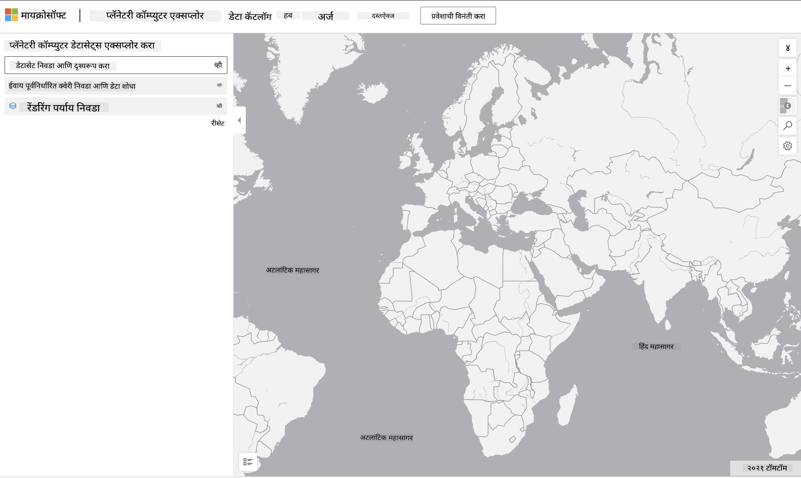

<!--
CO_OP_TRANSLATOR_METADATA:
{
  "original_hash": "d1e05715f9d97de6c4f1fb0c5a4702c0",
  "translation_date": "2025-08-27T17:35:50+00:00",
  "source_file": "6-Data-Science-In-Wild/20-Real-World-Examples/assignment.md",
  "language_code": "mr"
}
-->
# ग्रह संगणक डेटासेटचा अभ्यास करा

## सूचना

या धड्यात, आपण डेटा सायन्सच्या विविध अनुप्रयोग क्षेत्रांबद्दल चर्चा केली - संशोधन, शाश्वतता आणि डिजिटल मानविकीशी संबंधित उदाहरणांवर सखोल विचार केला. या असाइनमेंटमध्ये, तुम्ही या उदाहरणांपैकी एका उदाहरणाचा अधिक सविस्तर अभ्यास कराल आणि शाश्वतता डेटाबद्दल अंतर्दृष्टी मिळवण्यासाठी डेटा व्हिज्युअलायझेशन आणि विश्लेषणाबद्दलचे तुमचे ज्ञान लागू कराल.

[ग्रह संगणक](https://planetarycomputer.microsoft.com/) प्रकल्पामध्ये डेटासेट्स आणि API आहेत, जे खाते तयार करून प्रवेश करता येतात - जर तुम्हाला असाइनमेंटच्या बोनस टप्प्याचा प्रयत्न करायचा असेल तर प्रवेशासाठी विनंती करा. साइटमध्ये [Explorer](https://planetarycomputer.microsoft.com/explore) नावाचे एक वैशिष्ट्य देखील आहे, जे खाते न उघडता वापरता येते.

`पायऱ्या:`
Explorer इंटरफेस (खालील स्क्रीनशॉटमध्ये दाखवले आहे) तुम्हाला डेटासेट निवडण्याची (प्रदान केलेल्या पर्यायांमधून), पूर्वनिर्धारित क्वेरी निवडण्याची (डेटा फिल्टर करण्यासाठी) आणि रेंडरिंग पर्याय निवडण्याची (संबंधित व्हिज्युअलायझेशन तयार करण्यासाठी) परवानगी देते. या असाइनमेंटमध्ये, तुमचे काम असेल:

 1. [Explorer दस्तऐवज](https://planetarycomputer.microsoft.com/docs/overview/explorer/) वाचा - पर्याय समजून घ्या.
 2. [Catalog](https://planetarycomputer.microsoft.com/catalog) डेटासेटचा अभ्यास करा - प्रत्येकाचा उद्देश जाणून घ्या.
 3. Explorer वापरा - तुमच्या आवडीचा डेटासेट निवडा, संबंधित क्वेरी आणि रेंडरिंग पर्याय निवडा.

`तुमचे काम:`
आता ब्राउझरमध्ये तयार झालेले व्हिज्युअलायझेशन अभ्यासा आणि खालील प्रश्नांची उत्तरे द्या:
 * डेटासेटमध्ये कोणती _वैशिष्ट्ये_ आहेत?
 * व्हिज्युअलायझेशन कोणती _अंतर्दृष्टी_ किंवा निकाल प्रदान करते?
 * या अंतर्दृष्टींचा प्रकल्पाच्या शाश्वतता उद्दिष्टांवर काय _परिणाम_ होतो?
 * व्हिज्युअलायझेशनची _मर्यादा_ काय आहेत (म्हणजे, तुम्हाला कोणती अंतर्दृष्टी मिळाली नाही)?
 * जर तुम्हाला कच्चा डेटा मिळाला, तर तुम्ही कोणते _पर्यायी व्हिज्युअलायझेशन_ तयार कराल, आणि का?

`बोनस गुण:`
खाते तयार करण्यासाठी अर्ज करा - आणि स्वीकारल्यानंतर लॉगिन करा.
 * _Launch Hub_ पर्याय वापरून कच्चा डेटा Notebook मध्ये उघडा.
 * डेटा परस्परसंवादीपणे एक्सप्लोर करा आणि तुम्ही विचार केलेली पर्यायी व्हिज्युअलायझेशन तयार करा.
 * आता तुमच्या सानुकूल व्हिज्युअलायझेशनचे विश्लेषण करा - तुम्हाला यापूर्वी गमावलेल्या अंतर्दृष्टी मिळाल्या का?

## मूल्यांकन निकष

उत्कृष्ट | समाधानकारक | सुधारणा आवश्यक
--- | --- | -- |
पाचही मुख्य प्रश्नांची उत्तरे दिली. विद्यार्थ्याने स्पष्टपणे दाखवले की सध्याचे आणि पर्यायी व्हिज्युअलायझेशन शाश्वतता उद्दिष्टे किंवा परिणामांबद्दल अंतर्दृष्टी कशी प्रदान करू शकतात.| विद्यार्थ्याने किमान शीर्ष 3 प्रश्नांची सविस्तर उत्तरे दिली, ज्यामुळे Explorer चा व्यावहारिक अनुभव असल्याचे दिसून आले. | विद्यार्थ्याने अनेक प्रश्नांची उत्तरे दिली नाहीत किंवा पुरेशी माहिती दिली नाही - यामुळे प्रकल्पासाठी अर्थपूर्ण प्रयत्न झाल्याचे दिसत नाही. |

---

**अस्वीकरण**:  
हा दस्तऐवज AI भाषांतर सेवा [Co-op Translator](https://github.com/Azure/co-op-translator) चा वापर करून भाषांतरित करण्यात आला आहे. आम्ही अचूकतेसाठी प्रयत्नशील असलो तरी, कृपया लक्षात घ्या की स्वयंचलित भाषांतरांमध्ये त्रुटी किंवा अचूकतेचा अभाव असू शकतो. मूळ भाषेतील मूळ दस्तऐवज हा अधिकृत स्रोत मानला जावा. महत्त्वाच्या माहितीसाठी, व्यावसायिक मानवी भाषांतराची शिफारस केली जाते. या भाषांतराचा वापर केल्यामुळे उद्भवणाऱ्या कोणत्याही गैरसमज किंवा चुकीच्या अर्थासाठी आम्ही जबाबदार राहणार नाही.