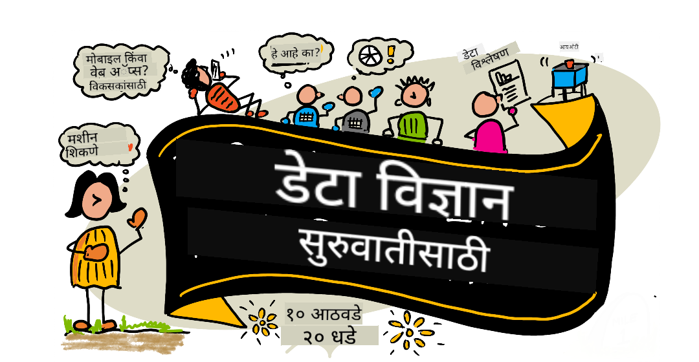

<!--
CO_OP_TRANSLATOR_METADATA:
{
  "original_hash": "dd9a1deb4da680b2cf11ba2e9f5a0a6e",
  "translation_date": "2025-09-29T21:42:22+00:00",
  "source_file": "README.md",
  "language_code": "mr"
}
-->
# डेटा सायन्ससाठी नवशिक्यांसाठी - अभ्यासक्रम

Azure Cloud Advocates, Microsoft कडून 10 आठवड्यांचा, 20 धड्यांचा अभ्यासक्रम डेटा सायन्सबद्दल सादर करण्यात येत आहे. प्रत्येक धड्यात प्री-लेसन आणि पोस्ट-लेसन क्विझ, धडा पूर्ण करण्यासाठी लेखी सूचना, समाधान आणि असाइनमेंट समाविष्ट आहे. प्रोजेक्ट-आधारित शिक्षण पद्धतीमुळे तुम्हाला शिकताना तयार करण्याची संधी मिळते, ज्यामुळे नवीन कौशल्ये अधिक चांगल्या प्रकारे आत्मसात होतात.

**आमच्या लेखकांचे मनःपूर्वक आभार:** [Jasmine Greenaway](https://www.twitter.com/paladique), [Dmitry Soshnikov](http://soshnikov.com), [Nitya Narasimhan](https://twitter.com/nitya), [Jalen McGee](https://twitter.com/JalenMcG), [Jen Looper](https://twitter.com/jenlooper), [Maud Levy](https://twitter.com/maudstweets), [Tiffany Souterre](https://twitter.com/TiffanySouterre), [Christopher Harrison](https://www.twitter.com/geektrainer).

**🙏 विशेष आभार 🙏 आमच्या [Microsoft Student Ambassador](https://studentambassadors.microsoft.com/) लेखक, समीक्षक आणि सामग्री योगदानकर्त्यांचे,** विशेषतः Aaryan Arora, [Aditya Garg](https://github.com/AdityaGarg00), [Alondra Sanchez](https://www.linkedin.com/in/alondra-sanchez-molina/), [Ankita Singh](https://www.linkedin.com/in/ankitasingh007), [Anupam Mishra](https://www.linkedin.com/in/anupam--mishra/), [Arpita Das](https://www.linkedin.com/in/arpitadas01/), ChhailBihari Dubey, [Dibri Nsofor](https://www.linkedin.com/in/dibrinsofor), [Dishita Bhasin](https://www.linkedin.com/in/dishita-bhasin-7065281bb), [Majd Safi](https://www.linkedin.com/in/majd-s/), [Max Blum](https://www.linkedin.com/in/max-blum-6036a1186/), [Miguel Correa](https://www.linkedin.com/in/miguelmque/), [Mohamma Iftekher (Iftu) Ebne Jalal](https://twitter.com/iftu119), [Nawrin Tabassum](https://www.linkedin.com/in/nawrin-tabassum), [Raymond Wangsa Putra](https://www.linkedin.com/in/raymond-wp/), [Rohit Yadav](https://www.linkedin.com/in/rty2423), Samridhi Sharma, [Sanya Sinha](https://www.linkedin.com/mwlite/in/sanya-sinha-13aab1200), [Sheena Narula](https://www.linkedin.com/in/sheena-narua-n/), [Tauqeer Ahmad](https://www.linkedin.com/in/tauqeerahmad5201/), Yogendrasingh Pawar, [Vidushi Gupta](https://www.linkedin.com/in/vidushi-gupta07/), [Jasleen Sondhi](https://www.linkedin.com/in/jasleen-sondhi/)

||
|:---:|
| डेटा सायन्ससाठी नवशिक्यांसाठी - _[@nitya](https://twitter.com/nitya) यांच्याकडून स्केच नोट_ |

### 🌐 बहुभाषिक समर्थन

#### GitHub Action द्वारे समर्थित (स्वयंचलित आणि नेहमी अद्ययावत)

[French](../fr/README.md) | [Spanish](../es/README.md) | [German](../de/README.md) | [Russian](../ru/README.md) | [Arabic](../ar/README.md) | [Persian (Farsi)](../fa/README.md) | [Urdu](../ur/README.md) | [Chinese (Simplified)](../zh/README.md) | [Chinese (Traditional, Macau)](../mo/README.md) | [Chinese (Traditional, Hong Kong)](../hk/README.md) | [Chinese (Traditional, Taiwan)](../tw/README.md) | [Japanese](../ja/README.md) | [Korean](../ko/README.md) | [Hindi](../hi/README.md) | [Bengali](../bn/README.md) | [Marathi](./README.md) | [Nepali](../ne/README.md) | [Punjabi (Gurmukhi)](../pa/README.md) | [Portuguese (Portugal)](../pt/README.md) | [Portuguese (Brazil)](../br/README.md) | [Italian](../it/README.md) | [Polish](../pl/README.md) | [Turkish](../tr/README.md) | [Greek](../el/README.md) | [Thai](../th/README.md) | [Swedish](../sv/README.md) | [Danish](../da/README.md) | [Norwegian](../no/README.md) | [Finnish](../fi/README.md) | [Dutch](../nl/README.md) | [Hebrew](../he/README.md) | [Vietnamese](../vi/README.md) | [Indonesian](../id/README.md) | [Malay](../ms/README.md) | [Tagalog (Filipino)](../tl/README.md) | [Swahili](../sw/README.md) | [Hungarian](../hu/README.md) | [Czech](../cs/README.md) | [Slovak](../sk/README.md) | [Romanian](../ro/README.md) | [Bulgarian](../bg/README.md) | [Serbian (Cyrillic)](../sr/README.md) | [Croatian](../hr/README.md) | [Slovenian](../sl/README.md) | [Ukrainian](../uk/README.md) | [Burmese (Myanmar)](../my/README.md)

**जर तुम्हाला अतिरिक्त भाषांमध्ये भाषांतर हवे असेल तर [येथे](https://github.com/Azure/co-op-translator/blob/main/getting_started/supported-languages.md) सूचीबद्ध भाषांमध्ये समर्थन उपलब्ध आहे.**

#### आमच्या समुदायात सामील व्हा 

आमच्याकडे Discord वर AI शिकण्याची मालिका सुरू आहे, अधिक जाणून घ्या आणि [Learn with AI Series](https://aka.ms/learnwithai/discord) मध्ये 18 - 30 सप्टेंबर, 2025 दरम्यान सामील व्हा. तुम्हाला GitHub Copilot डेटा सायन्ससाठी वापरण्याचे टिप्स आणि ट्रिक्स मिळतील.

# तुम्ही विद्यार्थी आहात का?

खालील संसाधनांपासून सुरुवात करा:

- [Student Hub पृष्ठ](https://docs.microsoft.com/en-gb/learn/student-hub?WT.mc_id=academic-77958-bethanycheum) या पृष्ठावर तुम्हाला नवशिक्यांसाठी संसाधने, विद्यार्थी पॅक आणि अगदी मोफत प्रमाणपत्र व्हाउचर मिळवण्याचे मार्ग सापडतील. हे पृष्ठ बुकमार्क करा आणि वेळोवेळी तपासा कारण आम्ही दर महिन्याला सामग्री बदलतो.
- [Microsoft Learn Student Ambassadors](https://studentambassadors.microsoft.com?WT.mc_id=academic-77958-bethanycheum) जागतिक विद्यार्थी राजदूत समुदायात सामील व्हा, हे Microsoft मध्ये प्रवेश करण्याचा तुमचा मार्ग असू शकतो.

# सुरुवात कशी करावी

> **शिक्षक:** आम्ही [काही सूचना समाविष्ट केल्या आहेत](for-teachers.md) या अभ्यासक्रमाचा उपयोग कसा करावा याबद्दल. आम्हाला तुमचे अभिप्राय [आमच्या चर्चा मंचावर](https://github.com/microsoft/Data-Science-For-Beginners/discussions) आवडेल!

> **[विद्यार्थी](https://aka.ms/student-page):** स्वतः हा अभ्यासक्रम वापरण्यासाठी, संपूर्ण रेपो फोर्क करा आणि स्वतःच व्यायाम पूर्ण करा, प्री-लेक्चर क्विझपासून सुरुवात करा. नंतर लेक्चर वाचा आणि उर्वरित क्रियाकलाप पूर्ण करा. धड्यांमधून समजून प्रोजेक्ट तयार करण्याचा प्रयत्न करा, समाधान कोड कॉपी करण्याऐवजी; तथापि, तो कोड प्रत्येक प्रोजेक्ट-आधारित धड्याच्या /solutions फोल्डरमध्ये उपलब्ध आहे. आणखी एक कल्पना म्हणजे मित्रांसोबत अभ्यास गट तयार करणे आणि एकत्र सामग्रीचा अभ्यास करणे. पुढील अभ्यासासाठी, आम्ही [Microsoft Learn](https://docs.microsoft.com/en-us/users/jenlooper-2911/collections/qprpajyoy3x0g7?WT.mc_id=academic-77958-bethanycheum) ची शिफारस करतो.

## टीमला भेटा

**Gif द्वारे** [Mohit Jaisal](https://www.linkedin.com/in/mohitjaisal)

> 🎥 वरच्या प्रतिमेवर क्लिक करा प्रकल्पाबद्दल आणि ते तयार करणाऱ्या लोकांबद्दल व्हिडिओ पाहण्यासाठी!

## शिक्षण पद्धती

आम्ही हा अभ्यासक्रम तयार करताना दोन शिक्षण पद्धती स्वीकारल्या आहेत: प्रोजेक्ट-आधारित शिक्षण सुनिश्चित करणे आणि वारंवार क्विझ समाविष्ट करणे. या मालिकेच्या शेवटी, विद्यार्थ्यांनी डेटा सायन्सचे मूलभूत तत्त्वे शिकलेली असतील, ज्यामध्ये नैतिक संकल्पना, डेटा तयारी, डेटा हाताळण्याचे विविध मार्ग, डेटा व्हिज्युअलायझेशन, डेटा विश्लेषण, डेटा सायन्सचे वास्तविक जीवनातील उपयोग आणि बरेच काही समाविष्ट आहे.

याशिवाय, वर्गाच्या आधीचा कमी ताणाचा क्विझ विद्यार्थ्याला विषय शिकण्याच्या उद्देशाने तयार करतो, तर वर्गानंतरचा दुसरा क्विझ अधिक चांगल्या प्रकारे माहिती टिकवून ठेवण्यास मदत करतो. हा अभ्यासक्रम लवचिक आणि मजेदार बनवण्यासाठी डिझाइन केला गेला आहे आणि तो संपूर्ण किंवा अंशतः घेतला जाऊ शकतो. प्रोजेक्ट्स लहान स्वरूपात सुरू होतात आणि 10 आठवड्यांच्या चक्राच्या शेवटी अधिकाधिक जटिल होतात.

> आमचा [Code of Conduct](CODE_OF_CONDUCT.md), [Contributing](CONTRIBUTING.md), [Translation](TRANSLATIONS.md) मार्गदर्शक शोधा. आम्ही तुमच्या रचनात्मक अभिप्रायांचे स्वागत करतो!

## प्रत्येक धड्यात समाविष्ट आहे:

- पर्यायी स्केच नोट
- पर्यायी पूरक व्हिडिओ
- प्री-लेसन वॉर्मअप क्विझ
- लेखी धडा
- प्रोजेक्ट-आधारित धड्यांसाठी, प्रोजेक्ट कसा तयार करायचा याबद्दल चरण-दर-चरण मार्गदर्शक
- ज्ञान तपासणी
- एक आव्हान
- पूरक वाचन
- असाइनमेंट
- [पोस्ट-लेसन क्विझ](https://ff-quizzes.netlify.app/en/)

> **क्विझबद्दल एक टीप:** सर्व क्विझ Quiz-App फोल्डरमध्ये समाविष्ट आहेत, प्रत्येक तीन प्रश्नांसाठी 40 एकूण क्विझ. ते धड्यांमधून लिंक केलेले आहेत, परंतु क्विझ अॅप स्थानिक पातळीवर चालवले जाऊ शकते किंवा Azure वर तैनात केले जाऊ शकते; `quiz-app` फोल्डरमधील सूचनांचे अनुसरण करा. ते हळूहळू स्थानिक भाषांमध्ये अनुवादित केले जात आहेत.

## धडे
||
|:---:|
| डेटा सायन्स फॉर बिगिनर्स: रोडमॅप - _[@nitya](https://twitter.com/nitya) यांचे स्केच नोट_ |

| धडा क्रमांक | विषय | धड्याचे गट | शिकण्याचे उद्दिष्ट | संबंधित धडा | लेखक |
| :-----------: | :----------------------------------------: | :--------------------------------------------------: | :-----------------------------------------------------------------------------------------------------------------------------------------------------------------------: | :---------------------------------------------------------------------: | :----: |
| 01 | डेटा सायन्सची व्याख्या | [परिचय](1-Introduction/README.md) | डेटा सायन्सचे मूलभूत संकल्पना आणि त्याचा कृत्रिम बुद्धिमत्ता, मशीन लर्निंग आणि बिग डेटा यांच्याशी संबंध कसा आहे हे जाणून घ्या. | [धडा](1-Introduction/01-defining-data-science/README.md) [व्हिडिओ](https://youtu.be/beZ7Mb_oz9I) | [Dmitry](http://soshnikov.com) |
| 02 | डेटा सायन्स नीतिशास्त्र | [परिचय](1-Introduction/README.md) | डेटा नीतिशास्त्र संकल्पना, आव्हाने आणि फ्रेमवर्क. | [धडा](1-Introduction/02-ethics/README.md) | [Nitya](https://twitter.com/nitya) |
| 03 | डेटाची व्याख्या | [परिचय](1-Introduction/README.md) | डेटा कसा वर्गीकृत केला जातो आणि त्याचे सामान्य स्रोत काय आहेत. | [धडा](1-Introduction/03-defining-data/README.md) | [Jasmine](https://www.twitter.com/paladique) |
| 04 | सांख्यिकी आणि संभाव्यतेची ओळख | [परिचय](1-Introduction/README.md) | डेटा समजण्यासाठी संभाव्यता आणि सांख्यिकीचे गणितीय तंत्र. | [धडा](1-Introduction/04-stats-and-probability/README.md) [व्हिडिओ](https://youtu.be/Z5Zy85g4Yjw) | [Dmitry](http://soshnikov.com) |
| 05 | रिलेशनल डेटासह काम करणे | [डेटासह काम करणे](2-Working-With-Data/README.md) | रिलेशनल डेटाची ओळख आणि स्ट्रक्चर्ड क्वेरी लँग्वेज (SQL) वापरून रिलेशनल डेटा एक्सप्लोर आणि विश्लेषण करण्याच्या मूलभूत गोष्टी. | [धडा](2-Working-With-Data/05-relational-databases/README.md) | [Christopher](https://www.twitter.com/geektrainer) | | |
| 06 | NoSQL डेटासह काम करणे | [डेटासह काम करणे](2-Working-With-Data/README.md) | नॉन-रिलेशनल डेटाची ओळख, त्याचे विविध प्रकार आणि डॉक्युमेंट डेटाबेस एक्सप्लोर आणि विश्लेषण करण्याच्या मूलभूत गोष्टी. | [धडा](2-Working-With-Data/06-non-relational/README.md) | [Jasmine](https://twitter.com/paladique)|
| 07 | पायथनसह काम करणे | [डेटासह काम करणे](2-Working-With-Data/README.md) | Pandas सारख्या लायब्ररीसह डेटा एक्सप्लोरेशनसाठी पायथन वापरण्याच्या मूलभूत गोष्टी. पायथन प्रोग्रामिंगची मूलभूत समज आवश्यक आहे. | [धडा](2-Working-With-Data/07-python/README.md) [व्हिडिओ](https://youtu.be/dZjWOGbsN4Y) | [Dmitry](http://soshnikov.com) |
| 08 | डेटा तयारी | [डेटासह काम करणे](2-Working-With-Data/README.md) | डेटा साफसफाई आणि रूपांतर करण्याच्या तंत्रांवरील विषय, ज्यामुळे हरवलेला, अचूक नसलेला किंवा अपूर्ण डेटा हाताळता येतो. | [धडा](2-Working-With-Data/08-data-preparation/README.md) | [Jasmine](https://www.twitter.com/paladique) |
| 09 | प्रमाणांचे व्हिज्युअलायझेशन | [डेटा व्हिज्युअलायझेशन](3-Data-Visualization/README.md) | Matplotlib वापरून पक्ष्यांचा डेटा 🦆 व्हिज्युअलायझेशन कसे करावे ते शिका. | [धडा](3-Data-Visualization/09-visualization-quantities/README.md) | [Jen](https://twitter.com/jenlooper) |
| 10 | डेटाच्या वितरणाचे व्हिज्युअलायझेशन | [डेटा व्हिज्युअलायझेशन](3-Data-Visualization/README.md) | एका अंतरालातील निरीक्षणे आणि ट्रेंड व्हिज्युअलायझेशन. | [धडा](3-Data-Visualization/10-visualization-distributions/README.md) | [Jen](https://twitter.com/jenlooper) |
| 11 | प्रमाणांचे व्हिज्युअलायझेशन | [डेटा व्हिज्युअलायझेशन](3-Data-Visualization/README.md) | डिस्क्रीट आणि गटबद्ध टक्केवारीचे व्हिज्युअलायझेशन. | [धडा](3-Data-Visualization/11-visualization-proportions/README.md) | [Jen](https://twitter.com/jenlooper) |
| 12 | संबंधांचे व्हिज्युअलायझेशन | [डेटा व्हिज्युअलायझेशन](3-Data-Visualization/README.md) | डेटा संच आणि त्याच्या व्हेरिएबल्समधील कनेक्शन आणि सहसंबंध व्हिज्युअलायझेशन. | [धडा](3-Data-Visualization/12-visualization-relationships/README.md) | [Jen](https://twitter.com/jenlooper) |
| 13 | अर्थपूर्ण व्हिज्युअलायझेशन | [डेटा व्हिज्युअलायझेशन](3-Data-Visualization/README.md) | प्रभावी समस्या सोडवण्यासाठी आणि अंतर्दृष्टीसाठी तुमच्या व्हिज्युअलायझेशनला मूल्यवान बनवण्यासाठी तंत्र आणि मार्गदर्शन. | [धडा](3-Data-Visualization/13-meaningful-visualizations/README.md) | [Jen](https://twitter.com/jenlooper) |
| 14 | डेटा सायन्स जीवनचक्राची ओळख | [जीवनचक्र](4-Data-Science-Lifecycle/README.md) | डेटा सायन्स जीवनचक्राची ओळख आणि डेटा मिळवणे आणि काढणे याची पहिली पायरी. | [धडा](4-Data-Science-Lifecycle/14-Introduction/README.md) | [Jasmine](https://twitter.com/paladique) |
| 15 | विश्लेषण करणे | [जीवनचक्र](4-Data-Science-Lifecycle/README.md) | डेटा सायन्स जीवनचक्राचा हा टप्पा डेटा विश्लेषण करण्याच्या तंत्रांवर केंद्रित आहे. | [धडा](4-Data-Science-Lifecycle/15-analyzing/README.md) | [Jasmine](https://twitter.com/paladique) | | |
| 16 | संवाद | [जीवनचक्र](4-Data-Science-Lifecycle/README.md) | डेटा सायन्स जीवनचक्राचा हा टप्पा डेटा मधून मिळालेल्या अंतर्दृष्टी निर्णय घेणाऱ्यांना समजण्यास सोपे होईल अशा प्रकारे सादर करण्यावर केंद्रित आहे. | [धडा](4-Data-Science-Lifecycle/16-communication/README.md) | [Jalen](https://twitter.com/JalenMcG) | | |
| 17 | क्लाउडमधील डेटा सायन्स | [क्लाउड डेटा](5-Data-Science-In-Cloud/README.md) | क्लाउडमधील डेटा सायन्स आणि त्याचे फायदे याची ओळख करून देणाऱ्या धड्यांची मालिका. | [धडा](5-Data-Science-In-Cloud/17-Introduction/README.md) | [Tiffany](https://twitter.com/TiffanySouterre) आणि [Maud](https://twitter.com/maudstweets) |
| 18 | क्लाउडमधील डेटा सायन्स | [क्लाउड डेटा](5-Data-Science-In-Cloud/README.md) | लो कोड टूल्स वापरून मॉडेल्स प्रशिक्षण. |[धडा](5-Data-Science-In-Cloud/18-Low-Code/README.md) | [Tiffany](https://twitter.com/TiffanySouterre) आणि [Maud](https://twitter.com/maudstweets) |
| 19 | क्लाउडमधील डेटा सायन्स | [क्लाउड डेटा](5-Data-Science-In-Cloud/README.md) | Azure Machine Learning Studio वापरून मॉडेल्स तैनात करणे. | [धडा](5-Data-Science-In-Cloud/19-Azure/README.md)| [Tiffany](https://twitter.com/TiffanySouterre) आणि [Maud](https://twitter.com/maudstweets) |
| 20 | वाइल्डमधील डेटा सायन्स | [वाइल्डमध्ये](6-Data-Science-In-Wild/README.md) | वास्तविक जगातील डेटा सायन्स चालित प्रकल्प. | [धडा](6-Data-Science-In-Wild/20-Real-World-Examples/README.md) | [Nitya](https://twitter.com/nitya) |

## GitHub Codespaces

Codespace मध्ये हे नमुना उघडण्यासाठी खालील चरणांचे अनुसरण करा:
1. कोड ड्रॉप-डाउन मेनूवर क्लिक करा आणि Open with Codespaces पर्याय निवडा.
2. पॅनच्या तळाशी + New codespace निवडा.
अधिक माहितीसाठी, [GitHub दस्तऐवज](https://docs.github.com/en/codespaces/developing-in-codespaces/creating-a-codespace-for-a-repository#creating-a-codespace) तपासा.

## VSCode Remote - Containers
VSCode Remote - Containers विस्तार वापरून तुमच्या स्थानिक मशीनवर आणि VSCode मध्ये कंटेनरमध्ये हे रिपो उघडण्यासाठी खालील चरणांचे अनुसरण करा:

1. जर तुम्ही प्रथमच विकास कंटेनर वापरत असाल, तर कृपया तुमची प्रणाली प्री-रेक्विझिट्स पूर्ण करते याची खात्री करा (उदा. [गेटिंग स्टार्टेड डॉक्युमेंटेशन](https://code.visualstudio.com/docs/devcontainers/containers#_getting-started) मध्ये Docker स्थापित केले आहे).

हे रिपॉझिटरी वापरण्यासाठी, तुम्ही रिपॉझिटरीला वेगळ्या Docker व्हॉल्यूममध्ये उघडू शकता:

**टीप**: अंतर्गत, हे Remote-Containers: **Clone Repository in Container Volume...** कमांड वापरेल जेणेकरून स्थानिक फाइल सिस्टमऐवजी Docker व्हॉल्यूममध्ये स्रोत कोड क्लोन केला जाईल. [व्हॉल्यूम्स](https://docs.docker.com/storage/volumes/) कंटेनर डेटा टिकवण्यासाठी प्राधान्य दिलेले यंत्र आहे.

किंवा स्थानिकपणे क्लोन केलेल्या किंवा डाउनलोड केलेल्या रिपॉझिटरीची आवृत्ती उघडा:

- या रिपॉझिटरीला तुमच्या स्थानिक फाइल सिस्टमवर क्लोन करा.
- F1 दाबा आणि **Remote-Containers: Open Folder in Container...** कमांड निवडा.
- या फोल्डरची क्लोन केलेली प्रत निवडा, कंटेनर सुरू होण्याची वाट पाहा आणि गोष्टी वापरून पहा.

## ऑफलाइन प्रवेश

[Docsify](https://docsify.js.org/#/) वापरून तुम्ही हे दस्तऐवज ऑफलाइन चालवू शकता. या रिपॉझिटरीला फोर्क करा, तुमच्या स्थानिक मशीनवर [Docsify स्थापित करा](https://docsify.js.org/#/quickstart), नंतर या रिपॉझिटरीच्या मूळ फोल्डरमध्ये `docsify serve` टाइप करा. वेबसाइट तुमच्या लोकलहोस्टवर पोर्ट 3000 वर चालवली जाईल: `localhost:3000`.

> टीप, नोटबुक्स Docsify द्वारे प्रस्तुत केले जाणार नाहीत, त्यामुळे तुम्हाला नोटबुक चालवायचे असल्यास, ते वेगळ्या पायथन कर्नल चालवणाऱ्या VS Code मध्ये करा.

## इतर अभ्यासक्रम

आमची टीम इतर अभ्यासक्रम तयार करते! तपासा:

- [एज AI फॉर बिगिनर्स](https://aka.ms/edgeai-for-beginners)
- [AI एजंट्स फॉर बिगिनर्स](https://aka.ms/ai-agents-beginners)
- [जनरेटिव AI फॉर बिगिनर्स](https://aka.ms/genai-beginners)
- [जनरेटिव AI फॉर बिगिनर्स .NET](https://github.com/microsoft/Generative-AI-for-beginners-dotnet)
- [जनरेटिव AI विथ जावास्क्रिप्ट](https://github.com/microsoft/generative-ai-with-javascript)
- [जनरेटिव AI विथ जावा](https://aka.ms/genaijava)
- [AI फॉर बिगिनर्स](https://aka.ms/ai-beginners)
- [डेटा सायन्स फॉर बिगिनर्स](https://aka.ms/datascience-beginners)
- [बॅश फॉर बिगिनर्स](https://github.com/microsoft/bash-for-beginners)
- [ML फॉर बिगिनर्स](https://aka.ms/ml-beginners)
- [सायबरसिक्युरिटी फॉर बिगिनर्स](https://github.com/microsoft/Security-101) 
- [वेब डेव्ह फॉर बिगिनर्स](https://aka.ms/webdev-beginners)
- [IoT फॉर बिगिनर्स](https://aka.ms/iot-beginners)
- [मशीन लर्निंग फॉर बिगिनर्स](https://aka.ms/ml-beginners)
- [XR डेव्हलपमेंट फॉर बिगिनर्स](https://aka.ms/xr-dev-for-beginners)
- [GitHub Copilot साठी मास्टरिंग - AI पायर्ड प्रोग्रामिंग](https://aka.ms/GitHubCopilotAI)
- [XR डेव्हलपमेंट फॉर बिगिनर्स](https://github.com/microsoft/xr-development-for-beginners)
- [GitHub Copilot साठी मास्टरिंग - C#/.NET डेव्हलपर्स](https://github.com/microsoft/mastering-github-copilot-for-dotnet-csharp-developers)
- [तुमचा स्वतःचा Copilot Adventure निवडा](https://github.com/microsoft/CopilotAdventures)

---

**अस्वीकरण**:  
हा दस्तऐवज AI भाषांतर सेवा [Co-op Translator](https://github.com/Azure/co-op-translator) चा वापर करून भाषांतरित करण्यात आला आहे. आम्ही अचूकतेसाठी प्रयत्नशील असलो तरी कृपया लक्षात ठेवा की स्वयंचलित भाषांतरे त्रुटी किंवा अचूकतेच्या अभावाने युक्त असू शकतात. मूळ भाषेतील दस्तऐवज हा अधिकृत स्रोत मानला जावा. महत्त्वाच्या माहितीसाठी व्यावसायिक मानवी भाषांतराची शिफारस केली जाते. या भाषांतराचा वापर करून उद्भवलेल्या कोणत्याही गैरसमज किंवा चुकीच्या अर्थासाठी आम्ही जबाबदार राहणार नाही.