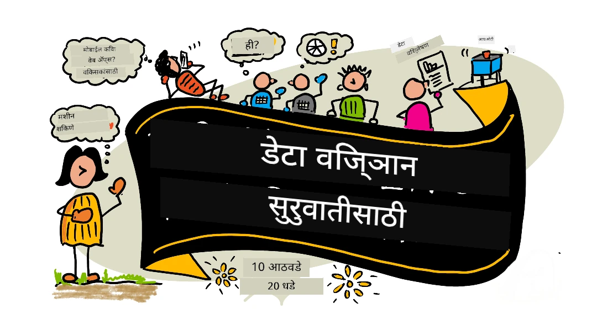
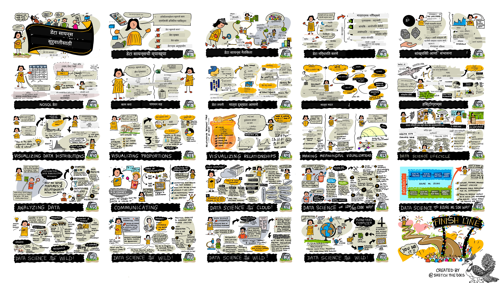

# नवशिक्यांसाठी डेटा सायन्स - एक अभ्यासक्रम

[](https://github.com/codespaces/new?hide_repo_select=true&ref=main&repo=344191198)

[](https://github.com/microsoft/Data-Science-For-Beginners/blob/master/LICENSE)
[](https://GitHub.com/microsoft/Data-Science-For-Beginners/graphs/contributors/)
[](https://GitHub.com/microsoft/Data-Science-For-Beginners/issues/)
[](https://GitHub.com/microsoft/Data-Science-For-Beginners/pulls/)
[](http://makeapullrequest.com)

[](https://GitHub.com/microsoft/Data-Science-For-Beginners/watchers/)
[](https://GitHub.com/microsoft/Data-Science-For-Beginners/network/)
[](https://GitHub.com/microsoft/Data-Science-For-Beginners/stargazers/)


[](https://discord.gg/nTYy5BXMWG)

[](https://aka.ms/foundry/forum)

मायक्रोसॉफ्टमधील Azure Cloud Advocates आपल्याला डेटा सायन्स विषयी 10 आठवड्यांचा, 20 धड्यांचा अभ्यासक्रम देण्यासाठी आनंदी आहेत. प्रत्येक धड्यात प्री-लेसन आणि पोस्ट-लेसन क्विझ, धडा पूर्ण करण्यासाठी लेखी सूचना, एक समाधान आणि एक असाइनमेंट समाविष्ट आहे. आमचा प्रकल्प-आधारित पद्धतशास्त्र तुम्हाला तयार करताना शिकण्यास अनुमती देतो, जो नवीन कौशल्ये 'टिकून' राहण्यासाठी सिद्ध मार्ग आहे.

**आमच्या लेखकांचे मनःपूर्वक आभार:** [Jasmine Greenaway](https://www.twitter.com/paladique), [Dmitry Soshnikov](http://soshnikov.com), [Nitya Narasimhan](https://twitter.com/nitya), [Jalen McGee](https://twitter.com/JalenMcG), [Jen Looper](https://twitter.com/jenlooper), [Maud Levy](https://twitter.com/maudstweets), [Tiffany Souterre](https://twitter.com/TiffanySouterre), [Christopher Harrison](https://www.twitter.com/geektrainer).

**🙏 विशेष आभार 🙏 आमच्या [Microsoft Student Ambassador](https://studentambassadors.microsoft.com/) लेखक, पुनरावलोकक आणि सामग्री योगदान देणाऱ्यांना,** विशेषतः Aaryan Arora, [Aditya Garg](https://github.com/AdityaGarg00), [Alondra Sanchez](https://www.linkedin.com/in/alondra-sanchez-molina/), [Ankita Singh](https://www.linkedin.com/in/ankitasingh007), [Anupam Mishra](https://www.linkedin.com/in/anupam--mishra/), [Arpita Das](https://www.linkedin.com/in/arpitadas01/), ChhailBihari Dubey, [Dibri Nsofor](https://www.linkedin.com/in/dibrinsofor), [Dishita Bhasin](https://www.linkedin.com/in/dishita-bhasin-7065281bb), [Majd Safi](https://www.linkedin.com/in/majd-s/), [Max Blum](https://www.linkedin.com/in/max-blum-6036a1186/), [Miguel Correa](https://www.linkedin.com/in/miguelmque/), [Mohamma Iftekher (Iftu) Ebne Jalal](https://twitter.com/iftu119), [Nawrin Tabassum](https://www.linkedin.com/in/nawrin-tabassum), [Raymond Wangsa Putra](https://www.linkedin.com/in/raymond-wp/), [Rohit Yadav](https://www.linkedin.com/in/rty2423), Samridhi Sharma, [Sanya Sinha](https://www.linkedin.com/mwlite/in/sanya-sinha-13aab1200),
[Sheena Narula](https://www.linkedin.com/in/sheena-narua-n/), [Tauqeer Ahmad](https://www.linkedin.com/in/tauqeerahmad5201/), Yogendrasingh Pawar , [Vidushi Gupta](https://www.linkedin.com/in/vidushi-gupta07/), [Jasleen Sondhi](https://www.linkedin.com/in/jasleen-sondhi/)

||
|:---:|
| नवशिक्यांसाठी डेटा सायन्स - _स्केचनोट [@nitya](https://twitter.com/nitya) कडून_ |

### 🌐 बहुभाषिक समर्थन

#### GitHub Action द्वारे समर्थित (स्वयंचलित आणि सदैव अद्ययावत)

<!-- CO-OP TRANSLATOR LANGUAGES TABLE START -->
[Arabic](../ar/README.md) | [Bengali](../bn/README.md) | [Bulgarian](../bg/README.md) | [Burmese (Myanmar)](../my/README.md) | [Chinese (Simplified)](../zh-CN/README.md) | [Chinese (Traditional, Hong Kong)](../zh-HK/README.md) | [Chinese (Traditional, Macau)](../zh-MO/README.md) | [Chinese (Traditional, Taiwan)](../zh-TW/README.md) | [Croatian](../hr/README.md) | [Czech](../cs/README.md) | [Danish](../da/README.md) | [Dutch](../nl/README.md) | [Estonian](../et/README.md) | [Finnish](../fi/README.md) | [French](../fr/README.md) | [German](../de/README.md) | [Greek](../el/README.md) | [Hebrew](../he/README.md) | [Hindi](../hi/README.md) | [Hungarian](../hu/README.md) | [Indonesian](../id/README.md) | [Italian](../it/README.md) | [Japanese](../ja/README.md) | [Kannada](../kn/README.md) | [Khmer](../km/README.md) | [Korean](../ko/README.md) | [Lithuanian](../lt/README.md) | [Malay](../ms/README.md) | [Malayalam](../ml/README.md) | [Marathi](./README.md) | [Nepali](../ne/README.md) | [Nigerian Pidgin](../pcm/README.md) | [Norwegian](../no/README.md) | [Persian (Farsi)](../fa/README.md) | [Polish](../pl/README.md) | [Portuguese (Brazil)](../pt-BR/README.md) | [Portuguese (Portugal)](../pt-PT/README.md) | [Punjabi (Gurmukhi)](../pa/README.md) | [Romanian](../ro/README.md) | [Russian](../ru/README.md) | [Serbian (Cyrillic)](../sr/README.md) | [Slovak](../sk/README.md) | [Slovenian](../sl/README.md) | [Spanish](../es/README.md) | [Swahili](../sw/README.md) | [Swedish](../sv/README.md) | [Tagalog (Filipino)](../tl/README.md) | [Tamil](../ta/README.md) | [Telugu](../te/README.md) | [Thai](../th/README.md) | [Turkish](../tr/README.md) | [Ukrainian](../uk/README.md) | [Urdu](../ur/README.md) | [Vietnamese](../vi/README.md)

> **स्थानिकरित्या क्लोन करायचे आहे?**
>
> या संग्रहात ५०+ भाषांमध्ये अनुवाद समाविष्ट आहेत ज्यामुळे डाउनलोड आकार मोठा होतो. अनुवादांशिवाय क्लोन करण्यासाठी sparse checkout वापरा:
>
> **Bash / macOS / Linux:**
> ```bash
> git clone --filter=blob:none --sparse https://github.com/microsoft/Data-Science-For-Beginners.git
> cd Data-Science-For-Beginners
> git sparse-checkout set --no-cone '/*' '!translations' '!translated_images'
> ```
>
> **CMD (Windows):**
> ```cmd
> git clone --filter=blob:none --sparse https://github.com/microsoft/Data-Science-For-Beginners.git
> cd Data-Science-For-Beginners
> git sparse-checkout set --no-cone "/*" "!translations" "!translated_images"
> ```
>
> यामुळे तुम्हाला अभ्यासक्रम पूर्ण करण्यास आवश्यक सर्व काही खूप जलद डाउनलोड दराने मिळेल.
<!-- CO-OP TRANSLATOR LANGUAGES TABLE END -->

**जर तुम्हाला अतिरिक्त अनुवादीत भाषा हव्या असतील तर त्या येथे नोंदविल्या आहेत [येथे](https://github.com/Azure/co-op-translator/blob/main/getting_started/supported-languages.md)**

#### आमच्या समुदायात सहभागी व्हा
[](https://discord.gg/nTYy5BXMWG)

आमच्याकडे AI सह शिकण्याचा Discord सिरीज चालू आहे, अधिक जाणून घेण्यासाठी आणि १८ - ३० सप्टेंबर, २०२५ पासून [Learn with AI Series](https://aka.ms/learnwithai/discord) येथे आमच्याशी सामील व्हा. तुम्हाला डेटा सायन्ससाठी GitHub Copilot वापरण्याबाबत टिप्स आणि ट्रिक्स मिळतील.


# तुम्ही विद्यार्थी आहात का?

खालील संसाधनांपासून सुरवात करा:

- [स्टुडент हब पेज](https://docs.microsoft.com/en-gb/learn/student-hub?WT.mc_id=academic-77958-bethanycheum) या पृष्ठावर तुम्हाला नवशिक्यांसाठी संसाधने, विद्यार्थी पॅक आणि अगदी मोफत प्रमाणपत्र कूपन मिळण्याचे मार्ग सापडतील. हे एक पान आहे जे तुम्हाला बुकमार्क करायचे आहे आणि कधीकधी तपासावे कारण आपण दरमहिन्याला किमान सामग्री बदलतो.
- [Microsoft Learn Student Ambassadors](https://studentambassadors.microsoft.com?WT.mc_id=academic-77958-bethanycheum) जागतिक विद्यार्थी प्रतिनिधींच्या समुदायात सामील व्हा, हे तुम्हाला मायक्रोसॉफ्टमध्ये प्रवेश देण्याचा मार्ग असू शकतो.

# सुरुवात करणे

## 📚 मार्गदर्शक

- **[इंस्टॉलेशन मार्गदर्शक](INSTALLATION.md)** - नवशिक्यांसाठी टप्प्याटप्प्याने सेटअप सूचनाएं
- **[वापर मार्गदर्शक](USAGE.md)** - उदाहरणे आणि सामान्य कार्यप्रवाह
- **[समस्या निवारण](TROUBLESHOOTING.md)** - सामान्य समस्यांचे उपाय
- **[योगदान मार्गदर्शक](CONTRIBUTING.md)** - या प्रकल्पात योगदान कसे द्यावे
- **[शिक्षकांसाठी](for-teachers.md)** - अध्यापन मार्गदर्शन आणि वर्गातील संसाधने

## 👨‍🎓 विद्यार्थ्यांसाठी
> **संपूर्ण नवशिक्यांसाठी**: डेटा सायन्समध्ये नवीन आहात? आमच्या [सोप्या उदाहरणांपासून](examples/README.md) सुरुवात करा! या सोप्या, चांगल्या टिप्पणी केलेल्या उदाहरणांमुळे तुम्हाला पूर्ण अभ्यासक्रमात डुबकी मारण्याआधी मूलभूत गोष्टी समजतील.
> **[विद्यार्थी](https://aka.ms/student-page)**: स्वतः हा अभ्यासक्रम वापरण्यासाठी, संपूर्ण रिपो फोर्क करा आणि प्री-लेक्चर क्विझपासून सुरू करून स्वतः सराव पूर्ण करा. नंतर पाठ वाचा आणि उर्वरित क्रियाकलाप पूर्ण करा. सोडवणुकीच्या कोडची कॉपी करण्याऐवजी धडे समजून प्रकल्प तयार करण्याचा प्रयत्न करा; मात्र, तो कोड प्रत्येक प्रकल्प-आधारित धड्यातील /solutions फोल्डरमध्ये उपलब्ध आहे. आणखी एक कल्पना म्हणजे मित्रांसोबत अध्ययन गट तयार करून एकत्र सामग्रीमध्ये जा. पुढील अभ्यासासाठी, आम्ही [Microsoft Learn](https://docs.microsoft.com/en-us/users/jenlooper-2911/collections/qprpajyoy3x0g7?WT.mc_id=academic-77958-bethanycheum) शिफारस करतो.

**त्वरित प्रारंभ:**
1. तुमचे पर्यावरण सेट करण्यासाठी [इंस्टॉलेशन मार्गदर्शक](INSTALLATION.md) तपासा
2. अभ्यासक्रम कसे वापरायचे ते शिकण्यासाठी [वापर मार्गदर्शक](USAGE.md) वाचा
3. धडा 1 पासून सुरू करा आणि अनुक्रमे काम करा
4. मदतीसाठी आमच्या [Discord समुदायामध्ये](https://aka.ms/ds4beginners/discord) सामील व्हा

## 👩‍🏫 शिक्षकांसाठी
> **शिक्षकांसाठी**: आम्ही [हा अभ्यासक्रम कसा वापरावा याबाबत काही सूचना समाविष्ट केल्या आहेत](for-teachers.md). आम्हाला तुमच्या अभिप्रायाची वाट पहात आहोत [आमच्या चर्चात्मक मंचावर](https://github.com/microsoft/Data-Science-For-Beginners/discussions)!

## टीमला भेटा

[](https://youtu.be/8mzavjQSMM4 "प्रमो व्हिडिओ")

**गिफ** [मोहित जैसल](https://www.linkedin.com/in/mohitjaisal) यांनी तयार केलेला

> 🎥 प्रकल्प आणि ते तयार करणाऱ्यांविषयी व्हिडिओसाठी वरील प्रतिमेवर क्लिक करा!

## अध्यापनशास्त्र

हा अभ्यासक्रम तयार करताना आम्ही दोन अध्यापनशास्त्रीय तत्त्वे निवडली: तो प्रकल्प-आधारित असावा आणि त्यात नियमित चाचण्या असाव्यात. या मालिकेच्या शेवटी, विद्यार्थ्यांनी डेटा सायन्सची मूलभूत तत्त्वे शिकलेली असतील, ज्यात नैतिक संकल्पना, डेटा तयारी, डेटा हाताळण्याचे विविध प्रकार, डेटा दृष्यीकरण, डेटा विश्लेषण, डेटा सायन्सचे वास्तविक वापर केस आणि बरेच काही समाविष्ट आहे.

याशिवाय, वर्गाच्या आधीची कमी जोखीमीची चाचणी विद्यार्थ्यांच्या एका विषय शिकण्याच्या हेतूची तयारी करते, तर वर्गानंतरची दुसरी चाचणी अधिक टिकवणूक सुनिश्चित करते. हा अभ्यासक्रम लवचीक आणि मजेशीर असेल अशा प्रकारे डिझाइन केला गेला आहे आणि तो पूर्णपणे किंवा अंशतः केला जाऊ शकतो. प्रकल्प सुरुवातीला सोपे असतात आणि 10 आठवड्यांच्या चक्राच्या शेवटी अधिक जटिल होतात.

> आमचे [आचारसंहिता](CODE_OF_CONDUCT.md), [योगदान](CONTRIBUTING.md), [भाषांतर](TRANSLATIONS.md) मार्गदर्शक तत्त्वे येथे पहा. तुमचा सकारात्मक अभिप्राय आम्ही स्वागत करतो!

## प्रत्येक धडे मध्ये समाविष्ट आहे:

- ऐच्छिक स्केचनोट
- ऐच्छिक पूरक व्हिडिओ
- पूर्व-धडा वॉर्मअप क्विझ
- लेखी धडा
- प्रकल्प-आधारित धड्यासाठी, प्रकल्प कसा तयार करायचा यावर टप्प्याटप्प्याने मार्गदर्शक
- ज्ञान तपासणी
- एक आव्हान
- पूरक वाचन
- असाइनमेंट
- [धडा नंतरचा क्विझ](https://ff-quizzes.netlify.app/en/)

> **क्विझबद्दल एक टीप**: सर्व क्विझ क्विझ-ऍप फोल्डरमध्ये आहेत, ज्यात प्रत्येकी तीन प्रश्नांच्या 40 एकूण क्विझ आहेत. ते धड्यांमधून लिंक केलेले आहेत, परंतु क्विझ ऍप स्थानिकरित्या चालवले जाऊ शकते किंवा Azure वर तैनात केले जाऊ शकते; `quiz-app` फोल्डरमधील सूचना पाळा. हळूहळू त्यांचे स्थानिकीकरण केले जात आहे.

## 🎓 नवशिक्यांसाठी सोपे उदाहरणे

**डेटा सायन्समध्ये नवीन आहात?** आम्ही एक खास [उदाहरणे निर्देशिका](examples/README.md) तयार केली आहे ज्यात सोपी, चांगल्या प्रकारे कमेंट केलेली कोड आहे ज्यामुळे तुम्हाला सुरुवात करण्यात मदत होईल:

- 🌟 **हॅलो वर्ल्ड** - तुमचा पहिला डेटा सायन्स प्रोग्राम
- 📂 **डेटा लोड करणे** - डेटा संच कसे वाचायचे आणि एक्सप्लोर करायचे ते शिका
- 📊 **साधे विश्लेषण** - सांख्यिकी मोजा आणि नमुने शोधा
- 📈 **मौलिक दृष्यीकरण** - चार्ट आणि ग्राफ तयार करा
- 🔬 **वास्तविक प्रकल्प** - सुरूवातीपासून शेवटपर्यंत संपूर्ण कार्यप्रवाह

प्रत्येक उदाहरणात प्रत्येक टप्पा सविस्तर समजावून सांगणारे टिप्पण्या आहेत, ज्यामुळे ते पूर्णपणे नवशिक्यांसाठी परिपूर्ण आहे!

👉 **[उदाहरणांसह प्रारंभ करा](examples/README.md)** 👈

## धडे


||
|:---:|
| डेटा सायन्स फॉर बिगिनर्स: रोडमॅप - _स्केचनोट [@nitya](https://twitter.com/nitya) यांच्या द्वारे_ |


| धडा क्रमांक | विषय | धडा गटवारी | शिकण्याचे उद्दिष्टे | लिंक केलेला धडा | लेखक |
| :-----------: | :----------------------------------------: | :--------------------------------------------------: | :-----------------------------------------------------------------------------------------------------------------------------------------------------------------------: | :---------------------------------------------------------------------: | :----: |
| 01 | डेटा सायन्सची व्याख्या | [परिचय](1-Introduction/README.md) | डेटा सायन्सची मूलभूत संकल्पना आणि त्याचा कृत्रिम बुद्धिमत्ता, मशीन लर्निंग आणि मोठ्या डेटाशी कसा संबंध आहे ते शिका. | [धडा](1-Introduction/01-defining-data-science/README.md) [व्हिडिओ](https://youtu.be/beZ7Mb_oz9I) | [डिमिट्री](http://soshnikov.com) |
| 02 | डेटा सायन्स नैतिकता | [परिचय](1-Introduction/README.md) | डेटा नैतिकता संकल्पना, आव्हाने आणि चौकट. | [धडा](1-Introduction/02-ethics/README.md) | [नित्य](https://twitter.com/nitya) |
| 03 | डेटा व्याख्या | [परिचय](1-Introduction/README.md) | डेटा कसा वर्गीकृत केला जातो आणि त्याचे सामान्य स्रोत काय आहेत. | [धडा](1-Introduction/03-defining-data/README.md) | [जॅस्मिन](https://www.twitter.com/paladique) |
| 04 | सांख्यिकी आणि संभाव्यता परिचय | [परिचय](1-Introduction/README.md) | डेटा समजण्यासाठी संभाव्यता आणि सांख्यिकी या गणितीय तंत्रांचा आधार घ्या. | [धडा](1-Introduction/04-stats-and-probability/README.md) [व्हिडिओ](https://youtu.be/Z5Zy85g4Yjw) | [डिमिट्री](http://soshnikov.com) |
| 05 | रिलेशनल डेटासह काम करणे | [डेटासह काम करणे](2-Working-With-Data/README.md) | रिलेशनल डेटा परिचय आणि स्ट्रक्चर्ड क्वेरी लँग्वेज (SQL, उच्चार "सी-क्वेल") वापरून डेटा अन्वेषण आणि विश्लेषणाचे मूलभूत तत्त्वे. | [धडा](2-Working-With-Data/05-relational-databases/README.md) | [क्रिस토फर](https://www.twitter.com/geektrainer) | | |
| 06 | नोएसक्यूएल डेटासह काम करणे | [डेटासह काम करणे](2-Working-With-Data/README.md) | नॉन-रिलेशनल डेटा परिचय, त्याचे विविध प्रकार आणि डॉक्युमेंट डेटाबेस एक्सप्लोर आणि विश्लेषणाची मूलभूत तत्त्वे. | [धडा](2-Working-With-Data/06-non-relational/README.md) | [जॅस्मिन](https://twitter.com/paladique)|
| 07 | पायथॉनसह काम करणे | [डेटासह काम करणे](2-Working-With-Data/README.md) | पायथॉन वापरून डेटा एक्सप्लोरेशनचे प्राथमिक तत्त्वे, जसे की पँडस लायब्ररीसह. पायथॉन प्रोग्रामिंगचा प्राथमिक समज आवश्यक आहे. | [धडा](2-Working-With-Data/07-python/README.md) [व्हिडिओ](https://youtu.be/dZjWOGbsN4Y) | [डिमिट्री](http://soshnikov.com) |
| 08 | डेटा तयारी | [डेटासह काम करणे](2-Working-With-Data/README.md) | गहाळ, अचूक नसलेला किंवा अपूर्ण डेटा हाताळण्यासाठी डेटा स्वच्छता आणि रूपांतरण तंत्रे. | [धडा](2-Working-With-Data/08-data-preparation/README.md) | [जॅस्मिन](https://www.twitter.com/paladique) |
| 09 | प्रमाणांचे दृष्यीकरण | [डेटा दृष्यीकरण](3-Data-Visualization/README.md) | मॅटप्लॉटलिब वापरून पक्ष्यांच्या डेटाचे दृष्यीकरण कसे करायचे ते शिका 🦆 | [धडा](3-Data-Visualization/09-visualization-quantities/README.md) | [जेन](https://twitter.com/jenlooper) |
| 10 | डेटाच्या वितरणाचे दृष्यीकरण | [डेटा दृष्यीकरण](3-Data-Visualization/README.md) | निरीक्षणे आणि प्रवृत्तींचे एका कालखंडातील दृष्यीकरण. | [धडा](3-Data-Visualization/10-visualization-distributions/README.md) | [जेन](https://twitter.com/jenlooper) |
| 11 | प्रमाणांचे दृष्यीकरण | [डेटा दृष्यीकरण](3-Data-Visualization/README.md) | वेगळे आणि गटबद्ध टक्केवारींचे दृष्यीकरण. | [धडा](3-Data-Visualization/11-visualization-proportions/README.md) | [जेन](https://twitter.com/jenlooper) |
| 12 | संबंधांचे दृष्यीकरण | [डेटा दृष्यीकरण](3-Data-Visualization/README.md) | डेटाच्या संचांमधील कनेक्शन आणि परस्परसंबंधांचे दृष्यीकरण. | [धडा](3-Data-Visualization/12-visualization-relationships/README.md) | [जेन](https://twitter.com/jenlooper) |
| 13 | अर्थपूर्ण दृष्यीकरण | [डेटा दृष्यीकरण](3-Data-Visualization/README.md) | प्रभावी समस्या समाधान आणि अंतर्दृष्टीसाठी तुमच्या दृष्यीकरणाला मौल्यवान बनवण्यासाठी तंत्रे आणि मार्गदर्शन. | [धडा](3-Data-Visualization/13-meaningful-visualizations/README.md) | [जेन](https://twitter.com/jenlooper) |
| 14 | डेटा सायन्स जीवनचक्र परिचय | [जीवनचक्र](4-Data-Science-Lifecycle/README.md) | डेटा सायन्स जीवनचक्र आणि त्याचा डेटा प्राप्ती आणि काढण्याचा पहिला चरण. | [धडा](4-Data-Science-Lifecycle/14-Introduction/README.md) | [जॅस्मिन](https://twitter.com/paladique) |
| 15 | विश्लेषण | [जीवनचक्र](4-Data-Science-Lifecycle/README.md) | डेटा सायन्स जीवनचक्राचा हा कालावधी डेटा विश्लेषण तंत्रांवर लक्ष केंद्रित करतो. | [धडा](4-Data-Science-Lifecycle/15-analyzing/README.md) | [जॅस्मिन](https://twitter.com/paladique) | | |
| 16 | संवाद | [जीवनचक्र](4-Data-Science-Lifecycle/README.md) | डेटा मधून मिळालेल्या अंतर्दृष्टी सादर करण्यावर लक्ष केंद्रित करणारा जीवनचक्राचा टप्पा जो निर्णय घेणाऱ्यांसाठी समजणे सोपे करते. | [धडा](4-Data-Science-Lifecycle/16-communication/README.md) | [जालेन](https://twitter.com/JalenMcG) | | |
| 17 | क्लाऊडमधील डेटा सायन्स | [क्लाऊड डेटा](5-Data-Science-In-Cloud/README.md) | या धडास मालिकेत क्लाऊडमधील डेटा सायन्स आणि त्याच्या फायद्यांची ओळख करून दिली जाते. | [धडा](5-Data-Science-In-Cloud/17-Introduction/README.md) | [टिफनी](https://twitter.com/TiffanySouterre) आणि [मौड](https://twitter.com/maudstweets) |
| 18 | क्लाऊडमधील डेटा सायन्स | [क्लाऊड डेटा](5-Data-Science-In-Cloud/README.md) | लो कोड टूल्स वापरून मॉडेलचे प्रशिक्षण. |[धडा](5-Data-Science-In-Cloud/18-Low-Code/README.md) | [टिफनी](https://twitter.com/TiffanySouterre) आणि [मौड](https://twitter.com/maudstweets) |
| 19 | क्लाऊडमधील डेटा सायन्स | [क्लाऊड डेटा](5-Data-Science-In-Cloud/README.md) | Azure मशीन लर्निंग स्टुडिओ वापरून मॉडेल तैनात करणे. | [धडा](5-Data-Science-In-Cloud/19-Azure/README.md)| [टिफनी](https://twitter.com/TiffanySouterre) आणि [मौड](https://twitter.com/maudstweets) |
| 20 | वास्तविक जगातील डेटा सायन्स | [वास्तविक जगात](6-Data-Science-In-Wild/README.md) | वास्तविक जगातील डेटा सायन्स चालवलेल्या प्रकल्पांची ओळख. | [धडा](6-Data-Science-In-Wild/20-Real-World-Examples/README.md) | [नित्य](https://twitter.com/nitya) |

## GitHub Codespaces

या नमुन्याला Codespace मध्ये उघडण्यासाठी हे पायऱ्या वापरा:
1. कोड ड्रॉप-डाउन मेनूमध्ये क्लिक करा आणि "Open with Codespaces" पर्याय निवडा.
2. पॅनलच्या खालील बाजूला + New codespace निवडा.
अधिक माहितीसाठी, [GitHub दस्तऐवज](https://docs.github.com/en/codespaces/developing-in-codespaces/creating-a-codespace-for-a-repository#creating-a-codespace) पाहा.

## VSCode Remote - कंटेनर्स
VSCode Remote - कंटेनर्स विस्तार वापरून तुमच्या स्थानिक यंत्रावर आणि VSCode मध्ये हा रिपॉजिटरी कंटेनरमध्ये उघडण्यासाठी खालील स्टेप्स फॉलो करा:

1. जर तुम्ही प्रथमच विकास कंटेनर वापरत असाल, तर कृपया खात्री करा की तुमच्या सिस्टममध्ये आवश्यक पूर्वतयारी आहे (उदा. Docker स्थापित आहे का) [गेटिंग स्टार्टेड डॉक्स](https://code.visualstudio.com/docs/devcontainers/containers#_getting-started) मधील सूचनांनुसार.

हा रिपॉजिटरी वापरण्यासाठी, तुम्ही रिपॉजिटरी एका वेगळ्या Docker व्हॉल्यूममध्ये उघडू शकता:

**टीप**: आतील प्रक्रियेत, हा Remote-Containers: **Clone Repository in Container Volume...** कमांड वापरून स्त्रोत कोड स्थानिक फाइलसिस्टमऐवजी Docker व्हॉल्यूममध्ये क्लोन करेल. [व्हॉल्यूम](https://docs.docker.com/storage/volumes/) कंटेनर डेटा टिकवण्यासाठी प्राधान्य दिली जातात.

किंवा स्थानिकपणे क्लोन केलेली किंवा डाउनलोड केलेली रिपॉजिटरी उघडा:

- ही रिपॉजिटरी तुमच्या स्थानिक फाइलसिस्टमवर क्लोन करा.
- F1 दाबा आणि **Remote-Containers: Open Folder in Container...** कमांड निवडा.
- या फोल्डरची क्लोन केलेली कॉपी निवडा, कंटेनर सुरू होईपर्यंत थांबा आणि नंतर वापरायला सुरुवात करा.

## ऑफलाइन प्रवेश

[Docsify](https://docsify.js.org/#/) वापरून तुम्ही ही डॉक्युमेंटेशन ऑफलाइन चालवू शकता. हा रिपॉजिटरी Fork करा, [Docsify इंस्टॉल करा](https://docsify.js.org/#/quickstart) तुमच्या स्थानिक मशीनवर, नंतर या रिपॉजिटरीच्या रूट फोल्डरमध्ये `docsify serve` टाइप करा. वेबसाईट तुमच्या लोकलहोस्टच्या पोर्ट 3000 वर चालेल: `localhost:3000`.

> लक्षात घ्या, नोटबुक्स Docsify द्वारे रेंडर केले जाणार नाहीत, त्यामुळे जेव्हा तुम्हाला नोटबुक चालवायचा असेल, तेव्हा ते VS Code मध्ये पायथॉन कर्नल चालवून स्वतंत्रपणे करा.

## इतर अभ्यासक्रम

आमची टीम इतर अभ्यासक्रम देखील तयार करते! तपासा:

<!-- CO-OP TRANSLATOR OTHER COURSES START -->
### LangChain
[](https://aka.ms/langchain4j-for-beginners)
[](https://aka.ms/langchainjs-for-beginners?WT.mc_id=m365-94501-dwahlin)
[](https://github.com/microsoft/langchain-for-beginners?WT.mc_id=m365-94501-dwahlin)
---

### Azure / Edge / MCP / एजंट्स
[](https://github.com/microsoft/AZD-for-beginners?WT.mc_id=academic-105485-koreyst)
[](https://github.com/microsoft/edgeai-for-beginners?WT.mc_id=academic-105485-koreyst)
[](https://github.com/microsoft/mcp-for-beginners?WT.mc_id=academic-105485-koreyst)
[](https://github.com/microsoft/ai-agents-for-beginners?WT.mc_id=academic-105485-koreyst)

---
 
### जनरेटिव AI मालिका
[](https://github.com/microsoft/generative-ai-for-beginners?WT.mc_id=academic-105485-koreyst)
[-9333EA?style=for-the-badge&labelColor=E5E7EB&color=9333EA)](https://github.com/microsoft/Generative-AI-for-beginners-dotnet?WT.mc_id=academic-105485-koreyst)
[-C084FC?style=for-the-badge&labelColor=E5E7EB&color=C084FC)](https://github.com/microsoft/generative-ai-for-beginners-java?WT.mc_id=academic-105485-koreyst)
[-E879F9?style=for-the-badge&labelColor=E5E7EB&color=E879F9)](https://github.com/microsoft/generative-ai-with-javascript?WT.mc_id=academic-105485-koreyst)

---
 
### कोर शिक्षण
[](https://aka.ms/ml-beginners?WT.mc_id=academic-105485-koreyst)
[](https://aka.ms/datascience-beginners?WT.mc_id=academic-105485-koreyst)
[](https://aka.ms/ai-beginners?WT.mc_id=academic-105485-koreyst)
[](https://github.com/microsoft/Security-101?WT.mc_id=academic-96948-sayoung)
[](https://aka.ms/webdev-beginners?WT.mc_id=academic-105485-koreyst)
[](https://aka.ms/iot-beginners?WT.mc_id=academic-105485-koreyst)
[](https://github.com/microsoft/xr-development-for-beginners?WT.mc_id=academic-105485-koreyst)

---
 
### को-पायलट मालिका
[](https://aka.ms/GitHubCopilotAI?WT.mc_id=academic-105485-koreyst)
[](https://github.com/microsoft/mastering-github-copilot-for-dotnet-csharp-developers?WT.mc_id=academic-105485-koreyst)
[](https://github.com/microsoft/CopilotAdventures?WT.mc_id=academic-105485-koreyst)
<!-- CO-OP TRANSLATOR OTHER COURSES END -->

## मदत मिळवणे

**समस्या येत आहेत?** सामान्य समस्या सोडवण्यासाठी आमचा [Troubleshooting Guide](TROUBLESHOOTING.md) तपासा.

जर तुम्हाला अडचण येत असेल किंवा AI अॅप्स तयार करताना कोणतेही प्रश्न असतील, तर MCP विषयी संवादात सहभागी व्हा. ते एक सहायक समुदाय आहे जिथे प्रश्न स्वागतार्ह आहेत आणि ज्ञान खुलेपणाने शेअर केले जाते.

[](https://discord.gg/nTYy5BXMWG)

जर तुम्हाला उत्पादनाबाबत अभिप्राय किंवा चुका आढळल्यास खालील ठिकाणी भेट द्या:

[](https://aka.ms/foundry/forum)

---

<!-- CO-OP TRANSLATOR DISCLAIMER START -->
**अस्वीकरण**:
हा दस्तऐवज AI अनुवाद सेवा [Co-op Translator](https://github.com/Azure/co-op-translator) वापरून भाषांतरित केला आहे. जरी आम्ही अचूकतेसाठी प्रयत्नशील असलो तरी, कृपया लक्षात घ्या की स्वयंचलित भाषांतरांमध्ये चुका किंवा अपूर्णता असू शकतात. मूळ दस्तऐवज त्याच्या मूळ भाषेत अधिकारप्राप्त स्रोत मानला जावा. महत्त्वाची माहिती असल्यास, व्यावसायिक मानवी अनुवाद शिफारसीय आहे. या भाषांतराच्या वापरामुळे उद्भवणाऱ्या कोणत्याही गैरसमजुती किंवा चुकीच्या अर्थ लागण्याबद्दल आम्ही जबाबदार नाही.
<!-- CO-OP TRANSLATOR DISCLAIMER END -->