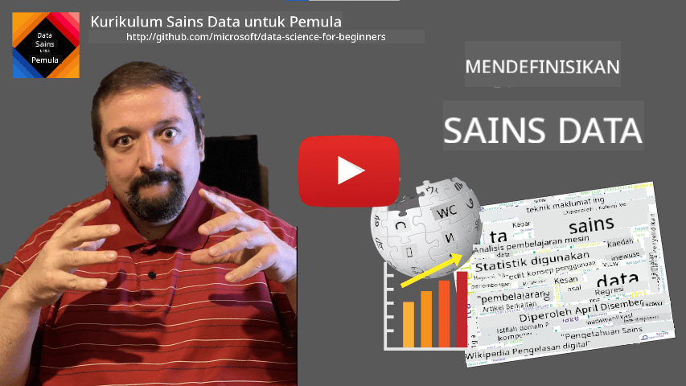

<!--
CO_OP_TRANSLATOR_METADATA:
{
  "original_hash": "43212cc1ac137b7bb1dcfb37ca06b0f4",
  "translation_date": "2025-10-25T19:01:16+00:00",
  "source_file": "1-Introduction/01-defining-data-science/README.md",
  "language_code": "ms"
}
-->
# Mendefinisikan Sains Data

|  ](../../sketchnotes/01-Definitions.png) |
| :----------------------------------------------------------------------------------------------------: |
|              Mendefinisikan Sains Data - _Sketchnote oleh [@nitya](https://twitter.com/nitya)_         |

---

## [Kuiz pra-kuliah](https://ff-quizzes.netlify.app/en/ds/quiz/0)

## Apa itu Data?
Dalam kehidupan seharian kita, kita sentiasa dikelilingi oleh data. Teks yang sedang anda baca sekarang adalah data. Senarai nombor telefon rakan-rakan anda dalam telefon pintar adalah data, begitu juga dengan waktu semasa yang dipaparkan pada jam tangan anda. Sebagai manusia, kita secara semula jadi beroperasi dengan data seperti mengira wang yang kita ada atau menulis surat kepada rakan-rakan.

Namun, data menjadi lebih penting dengan penciptaan komputer. Peranan utama komputer adalah untuk melakukan pengiraan, tetapi mereka memerlukan data untuk beroperasi. Oleh itu, kita perlu memahami bagaimana komputer menyimpan dan memproses data.

Dengan kemunculan Internet, peranan komputer sebagai alat pengendalian data semakin meningkat. Jika anda fikirkan, kita kini menggunakan komputer lebih banyak untuk pemprosesan dan komunikasi data, daripada pengiraan sebenar. Apabila kita menulis e-mel kepada rakan atau mencari maklumat di Internet - kita sebenarnya sedang mencipta, menyimpan, menghantar, dan memanipulasi data.
> Bolehkah anda ingat kali terakhir anda menggunakan komputer untuk benar-benar melakukan pengiraan sesuatu?

## Apa itu Sains Data?

Dalam [Wikipedia](https://en.wikipedia.org/wiki/Data_science), **Sains Data** didefinisikan sebagai *bidang saintifik yang menggunakan kaedah saintifik untuk mengekstrak pengetahuan dan wawasan daripada data berstruktur dan tidak berstruktur, serta menerapkan pengetahuan dan wawasan yang boleh diambil tindakan daripada data merentasi pelbagai domain aplikasi*.

Definisi ini menonjolkan aspek penting berikut dalam sains data:

* Matlamat utama sains data adalah untuk **mengekstrak pengetahuan** daripada data, dengan kata lain - untuk **memahami** data, mencari hubungan tersembunyi dan membina **model**.
* Sains data menggunakan **kaedah saintifik**, seperti kebarangkalian dan statistik. Malah, apabila istilah *sains data* pertama kali diperkenalkan, sesetengah orang berpendapat bahawa sains data hanyalah nama baru yang lebih menarik untuk statistik. Kini telah terbukti bahawa bidang ini jauh lebih luas.
* Pengetahuan yang diperoleh harus diterapkan untuk menghasilkan **wawasan yang boleh diambil tindakan**, iaitu wawasan praktikal yang boleh digunakan dalam situasi perniagaan sebenar.
* Kita harus dapat beroperasi pada data **berstruktur** dan **tidak berstruktur**. Kita akan kembali membincangkan jenis data yang berbeza kemudian dalam kursus ini.
* **Domain aplikasi** adalah konsep penting, dan saintis data sering memerlukan sekurang-kurangnya tahap kepakaran tertentu dalam domain masalah, contohnya: kewangan, perubatan, pemasaran, dan lain-lain.

> Satu lagi aspek penting dalam Sains Data adalah ia mengkaji bagaimana data boleh dikumpulkan, disimpan dan dioperasikan menggunakan komputer. Walaupun statistik memberikan asas matematik, sains data menerapkan konsep matematik untuk benar-benar mendapatkan wawasan daripada data.

Salah satu cara (dikaitkan dengan [Jim Gray](https://en.wikipedia.org/wiki/Jim_Gray_(computer_scientist))) untuk melihat sains data adalah menganggapnya sebagai paradigma sains yang berasingan:
* **Empirikal**, di mana kita bergantung terutamanya pada pemerhatian dan hasil eksperimen
* **Teoretikal**, di mana konsep baru muncul daripada pengetahuan saintifik sedia ada
* **Komputasi**, di mana kita menemui prinsip baru berdasarkan beberapa eksperimen komputasi
* **Berpandukan Data**, berdasarkan penemuan hubungan dan corak dalam data  

## Bidang Berkaitan Lain

Oleh kerana data adalah meluas, sains data itu sendiri juga merupakan bidang yang luas, menyentuh banyak disiplin lain.

<dl>
<dt>Pangkalan Data</dt>
<dd>
Pertimbangan kritikal adalah <b>bagaimana untuk menyimpan</b> data, iaitu bagaimana untuk menyusunnya dengan cara yang membolehkan pemprosesan lebih cepat. Terdapat pelbagai jenis pangkalan data yang menyimpan data berstruktur dan tidak berstruktur, yang <a href="../../2-Working-With-Data/README.md">akan kita pertimbangkan dalam kursus kita</a>.
</dd>
<dt>Data Besar</dt>
<dd>
Sering kali kita perlu menyimpan dan memproses sejumlah besar data dengan struktur yang agak mudah. Terdapat pendekatan dan alat khas untuk menyimpan data tersebut secara teragih pada kluster komputer, dan memprosesnya dengan cekap.
</dd>
<dt>Pembelajaran Mesin</dt>
<dd>
Salah satu cara untuk memahami data adalah dengan <b>membina model</b> yang dapat meramalkan hasil yang diinginkan. Membangunkan model daripada data dipanggil <b>pembelajaran mesin</b>. Anda mungkin ingin melihat <a href="https://aka.ms/ml-beginners">Kurikulum Pembelajaran Mesin untuk Pemula</a> kami untuk mengetahui lebih lanjut mengenainya.
</dd>
<dt>Kecerdasan Buatan</dt>
<dd>
Satu bidang pembelajaran mesin yang dikenali sebagai kecerdasan buatan (AI) juga bergantung pada data, dan ia melibatkan pembinaan model berkompleksiti tinggi yang meniru proses pemikiran manusia. Kaedah AI sering membolehkan kita mengubah data tidak berstruktur (contohnya bahasa semula jadi) menjadi wawasan berstruktur.
</dd>
<dt>Visualisasi</dt>
<dd>
Jumlah data yang besar tidak dapat difahami oleh manusia, tetapi apabila kita mencipta visualisasi yang berguna menggunakan data tersebut, kita dapat memahami data dengan lebih baik, dan membuat beberapa kesimpulan. Oleh itu, adalah penting untuk mengetahui banyak cara untuk memvisualisasikan maklumat - sesuatu yang akan kita bahas dalam <a href="../../3-Data-Visualization/README.md">Bahagian 3</a> kursus kita. Bidang berkaitan juga termasuk <b>Infografik</b>, dan <b>Interaksi Manusia-Komputer</b> secara umum.
</dd>
</dl>

## Jenis Data

Seperti yang telah disebutkan, data ada di mana-mana. Kita hanya perlu menangkapnya dengan cara yang betul! Adalah berguna untuk membezakan antara **data berstruktur** dan **tidak berstruktur**. Yang pertama biasanya diwakili dalam bentuk yang terstruktur dengan baik, sering kali sebagai jadual atau beberapa jadual, manakala yang kedua hanyalah koleksi fail. Kadang-kadang kita juga boleh bercakap tentang **data separa berstruktur**, yang mempunyai beberapa jenis struktur yang mungkin sangat berbeza.

| Berstruktur                                                                  | Separa berstruktur                                                                             | Tidak berstruktur                       |
| ---------------------------------------------------------------------------- | ---------------------------------------------------------------------------------------------- | --------------------------------------- |
| Senarai orang dengan nombor telefon mereka                                  | Halaman Wikipedia dengan pautan                                                               | Teks Ensiklopedia Britannica           |
| Suhu di semua bilik bangunan setiap minit selama 20 tahun terakhir           | Koleksi kertas saintifik dalam format JSON dengan penulis, tarikh penerbitan, dan abstrak     | Perkongsian fail dengan dokumen korporat |
| Data umur dan jantina semua orang yang memasuki bangunan                     | Halaman Internet                                                                               | Rakaman video mentah dari kamera pengawasan |

## Di Mana Mendapatkan Data

Terdapat banyak sumber data yang mungkin, dan mustahil untuk menyenaraikan semuanya! Walau bagaimanapun, mari kita sebutkan beberapa tempat biasa di mana anda boleh mendapatkan data:

* **Berstruktur**
  - **Internet of Things** (IoT), termasuk data daripada pelbagai sensor, seperti sensor suhu atau tekanan, menyediakan banyak data berguna. Sebagai contoh, jika bangunan pejabat dilengkapi dengan sensor IoT, kita boleh mengawal pemanasan dan pencahayaan secara automatik untuk meminimumkan kos.
  - **Tinjauan** yang kita minta pengguna untuk melengkapkan selepas pembelian, atau selepas melawat laman web.
  - **Analisis tingkah laku** boleh, sebagai contoh, membantu kita memahami sejauh mana pengguna mendalami laman web, dan apa sebab utama mereka meninggalkan laman web tersebut.
* **Tidak berstruktur**
  - **Teks** boleh menjadi sumber wawasan yang kaya, seperti skor **sentimen keseluruhan**, atau mengekstrak kata kunci dan makna semantik.
  - **Imej** atau **Video**. Video dari kamera pengawasan boleh digunakan untuk menganggarkan lalu lintas di jalan raya, dan memberitahu orang ramai tentang kemungkinan kesesakan lalu lintas.
  - **Log** pelayan web boleh digunakan untuk memahami halaman mana di laman web kita yang paling kerap dikunjungi, dan untuk berapa lama.
* **Separa berstruktur**
  - Graf **Rangkaian Sosial** boleh menjadi sumber data yang hebat tentang personaliti pengguna dan keberkesanan potensi dalam menyebarkan maklumat.
  - Apabila kita mempunyai sekumpulan gambar dari sebuah parti, kita boleh cuba mengekstrak data **Dinamika Kumpulan** dengan membina graf orang yang mengambil gambar bersama-sama.

Dengan mengetahui pelbagai sumber data yang mungkin, anda boleh cuba memikirkan pelbagai senario di mana teknik sains data boleh digunakan untuk memahami situasi dengan lebih baik, dan untuk meningkatkan proses perniagaan.

## Apa yang Boleh Anda Lakukan dengan Data

Dalam Sains Data, kita memberi tumpuan kepada langkah-langkah berikut dalam perjalanan data:

<dl>
<dt>1) Pengambilan Data</dt>
<dd>
Langkah pertama adalah mengumpulkan data. Walaupun dalam banyak kes ia boleh menjadi proses yang mudah, seperti data yang masuk ke pangkalan data dari aplikasi web, kadang-kadang kita perlu menggunakan teknik khas. Sebagai contoh, data dari sensor IoT boleh menjadi sangat banyak, dan adalah amalan yang baik untuk menggunakan titik akhir penampan seperti IoT Hub untuk mengumpulkan semua data sebelum pemprosesan lanjut.
</dd>
<dt>2) Penyimpanan Data</dt>
<dd>
Menyimpan data boleh menjadi cabaran, terutamanya jika kita bercakap tentang data besar. Apabila memutuskan bagaimana untuk menyimpan data, adalah masuk akal untuk menjangkakan cara anda ingin membuat pertanyaan terhadap data pada masa hadapan. Terdapat beberapa cara data boleh disimpan:
<ul>
<li>Pangkalan data relasional menyimpan koleksi jadual, dan menggunakan bahasa khas yang dipanggil SQL untuk membuat pertanyaan terhadapnya. Biasanya, jadual disusun ke dalam kumpulan yang berbeza yang dipanggil skema. Dalam banyak kes kita perlu menukar data dari bentuk asal untuk sesuai dengan skema.</li>
<li><a href="https://en.wikipedia.org/wiki/NoSQL">Pangkalan data NoSQL</a>, seperti <a href="https://azure.microsoft.com/services/cosmos-db/?WT.mc_id=academic-77958-bethanycheum">CosmosDB</a>, tidak memaksa skema pada data, dan membolehkan penyimpanan data yang lebih kompleks, contohnya, dokumen JSON hierarki atau graf. Walau bagaimanapun, pangkalan data NoSQL tidak mempunyai keupayaan pertanyaan yang kaya seperti SQL, dan tidak dapat menegakkan integriti referensi, iaitu peraturan tentang bagaimana data disusun dalam jadual dan mengatur hubungan antara jadual.</li>
<li><a href="https://en.wikipedia.org/wiki/Data_lake">Penyimpanan Data Lake</a> digunakan untuk koleksi data yang besar dalam bentuk mentah, tidak berstruktur. Data lake sering digunakan dengan data besar, di mana semua data tidak dapat dimuatkan pada satu mesin, dan perlu disimpan dan diproses oleh kluster pelayan. <a href="https://en.wikipedia.org/wiki/Apache_Parquet">Parquet</a> adalah format data yang sering digunakan bersama dengan data besar.</li> 
</ul>
</dd>
<dt>3) Pemprosesan Data</dt>
<dd>
Ini adalah bahagian yang paling menarik dalam perjalanan data, yang melibatkan penukaran data dari bentuk asalnya ke bentuk yang boleh digunakan untuk visualisasi/pembelajaran model. Apabila berurusan dengan data tidak berstruktur seperti teks atau imej, kita mungkin perlu menggunakan beberapa teknik AI untuk mengekstrak <b>ciri-ciri</b> dari data, dengan itu menukarkannya kepada bentuk berstruktur.
</dd>
<dt>4) Visualisasi / Wawasan Manusia</dt>
<dd>
Sering kali, untuk memahami data, kita perlu memvisualisasikannya. Dengan mempunyai banyak teknik visualisasi yang berbeza dalam alat kita, kita dapat mencari pandangan yang tepat untuk mendapatkan wawasan. Selalunya, seorang saintis data perlu "bermain dengan data", memvisualisasikannya berkali-kali dan mencari beberapa hubungan. Selain itu, kita mungkin menggunakan teknik statistik untuk menguji hipotesis atau membuktikan korelasi antara bahagian data yang berbeza.
</dd>
<dt>5) Melatih model ramalan</dt>
<dd>
Kerana matlamat utama sains data adalah untuk dapat membuat keputusan berdasarkan data, kita mungkin ingin menggunakan teknik <a href="http://github.com/microsoft/ml-for-beginners">Pembelajaran Mesin</a> untuk membina model ramalan. Kita kemudian boleh menggunakan ini untuk membuat ramalan menggunakan set data baru dengan struktur yang serupa.
</dd>
</dl>

Sudah tentu, bergantung pada data sebenar, beberapa langkah mungkin tidak diperlukan (contohnya, apabila kita sudah mempunyai data dalam pangkalan data, atau apabila kita tidak memerlukan latihan model), atau beberapa langkah mungkin diulang beberapa kali (seperti pemprosesan data).

## Digitalisasi dan Transformasi Digital

Dalam dekad terakhir, banyak perniagaan mula memahami kepentingan data dalam membuat keputusan perniagaan. Untuk menerapkan prinsip sains data dalam menjalankan perniagaan, seseorang perlu mengumpulkan beberapa data terlebih dahulu, iaitu menterjemahkan proses perniagaan ke dalam bentuk digital. Ini dikenali sebagai **digitalisasi**. Menerapkan teknik sains data pada data ini untuk membimbing keputusan boleh membawa kepada peningkatan produktiviti yang signifikan (atau bahkan perubahan arah perniagaan), yang disebut **transformasi digital**.

Mari kita pertimbangkan satu contoh. Katakan kita mempunyai kursus sains data (seperti yang ini) yang kita sampaikan secara dalam talian kepada pelajar, dan kita ingin menggunakan sains data untuk meningkatkannya. Bagaimana kita boleh melakukannya?

Kita boleh mula dengan bertanya "Apa yang boleh didigitalkan?" Cara yang paling mudah adalah dengan mengukur masa yang diambil oleh setiap pelajar untuk menyelesaikan setiap modul, dan mengukur pengetahuan yang diperoleh dengan memberikan ujian pilihan berganda pada akhir setiap modul. Dengan mengambil purata masa penyelesaian di kalangan semua pelajar, kita dapat mengetahui modul mana yang menyebabkan kesukaran paling banyak kepada pelajar, dan bekerja untuk menyederhanakannya.
> Anda mungkin berpendapat bahawa pendekatan ini tidak ideal, kerana modul boleh mempunyai panjang yang berbeza. Mungkin lebih adil untuk membahagikan masa dengan panjang modul (dalam bilangan aksara), dan membandingkan nilai-nilai tersebut.

Apabila kita mula menganalisis keputusan ujian pilihan berganda, kita boleh cuba menentukan konsep mana yang sukar difahami oleh pelajar, dan menggunakan maklumat tersebut untuk memperbaiki kandungan. Untuk melakukannya, kita perlu merancang ujian dengan cara setiap soalan memetakan kepada konsep tertentu atau bahagian pengetahuan.

Jika kita ingin menjadi lebih rumit, kita boleh memplot masa yang diambil untuk setiap modul terhadap kategori umur pelajar. Kita mungkin mendapati bahawa untuk beberapa kategori umur, masa yang diambil untuk menyelesaikan modul adalah terlalu lama, atau pelajar berhenti sebelum menyelesaikannya. Ini boleh membantu kita memberikan cadangan umur untuk modul tersebut, dan meminimumkan ketidakpuasan orang akibat jangkaan yang salah.

## 🚀 Cabaran

Dalam cabaran ini, kita akan cuba mencari konsep yang relevan dengan bidang Sains Data dengan melihat teks. Kita akan mengambil artikel Wikipedia tentang Sains Data, memuat turun dan memproses teks tersebut, dan kemudian membina awan kata seperti ini:

Lawati [`notebook.ipynb`](../../../../1-Introduction/01-defining-data-science/notebook.ipynb ':ignore') untuk membaca kodnya. Anda juga boleh menjalankan kod tersebut, dan melihat bagaimana ia melaksanakan semua transformasi data secara langsung.

> Jika anda tidak tahu cara menjalankan kod dalam Jupyter Notebook, lihat [artikel ini](https://soshnikov.com/education/how-to-execute-notebooks-from-github/).

## [Kuiz selepas kuliah](https://ff-quizzes.netlify.app/en/ds/quiz/1)

## Tugasan

* **Tugas 1**: Ubah suai kod di atas untuk mencari konsep berkaitan dengan bidang **Big Data** dan **Machine Learning**
* **Tugas 2**: [Fikirkan Tentang Senario Sains Data](assignment.md)

## Kredit

Pelajaran ini telah ditulis dengan ♥️ oleh [Dmitry Soshnikov](http://soshnikov.com)

---

**Penafian**:  
Dokumen ini telah diterjemahkan menggunakan perkhidmatan terjemahan AI [Co-op Translator](https://github.com/Azure/co-op-translator). Walaupun kami berusaha untuk ketepatan, sila ambil perhatian bahawa terjemahan automatik mungkin mengandungi kesilapan atau ketidaktepatan. Dokumen asal dalam bahasa asalnya harus dianggap sebagai sumber yang berwibawa. Untuk maklumat penting, terjemahan manusia profesional adalah disyorkan. Kami tidak bertanggungjawab atas sebarang salah faham atau salah tafsir yang timbul daripada penggunaan terjemahan ini.