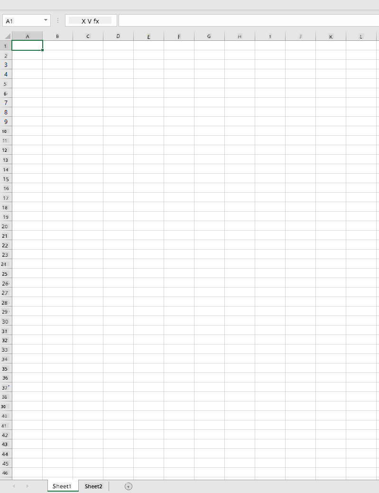
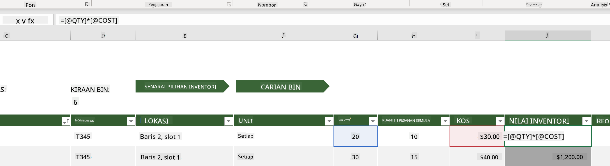
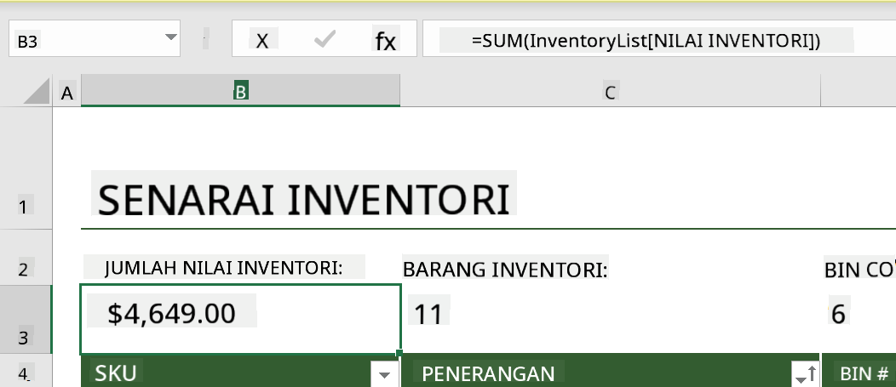
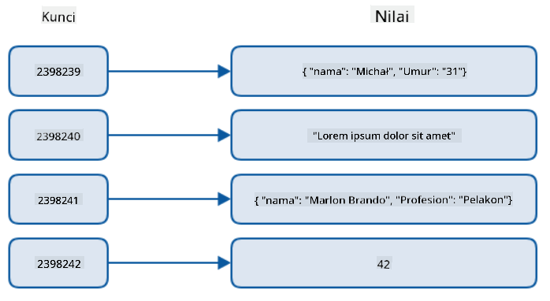
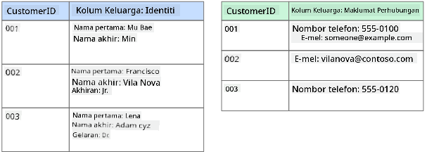
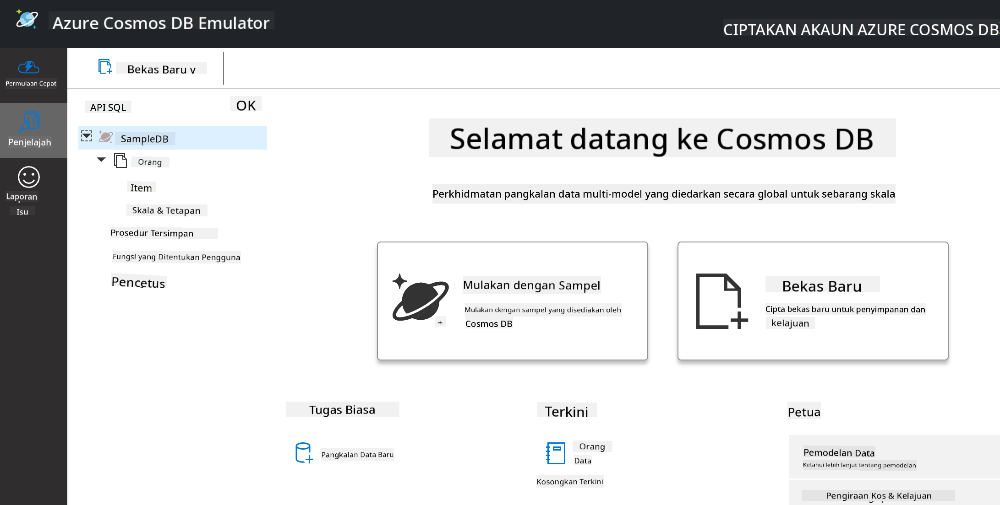
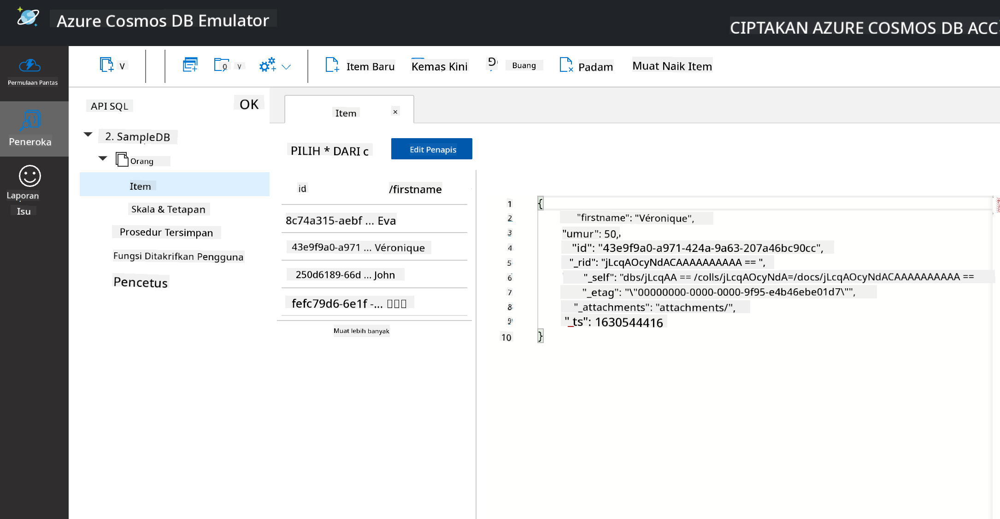
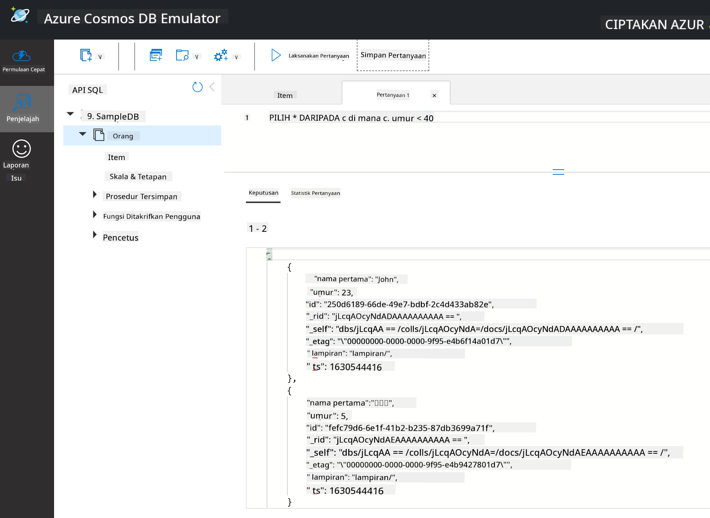

<!--
CO_OP_TRANSLATOR_METADATA:
{
  "original_hash": "32ddfef8121650f2ca2f3416fd283c37",
  "translation_date": "2025-08-28T18:06:39+00:00",
  "source_file": "2-Working-With-Data/06-non-relational/README.md",
  "language_code": "ms"
}
-->
# Bekerja dengan Data: Data Tidak Relasional

| ](../../sketchnotes/06-NoSQL.png)|
|:---:|
|Bekerja dengan Data NoSQL - _Sketchnote oleh [@nitya](https://twitter.com/nitya)_ |

## [Kuiz Pra-Kuliah](https://purple-hill-04aebfb03.1.azurestaticapps.net/quiz/10)

Data tidak terhad kepada pangkalan data relasional. Pelajaran ini memberi tumpuan kepada data tidak relasional dan akan merangkumi asas-asas spreadsheet dan NoSQL.

## Spreadsheet

Spreadsheet adalah cara yang popular untuk menyimpan dan meneroka data kerana ia memerlukan persediaan yang lebih mudah dan cepat untuk dimulakan. Dalam pelajaran ini, anda akan mempelajari komponen asas spreadsheet, serta formula dan fungsi. Contoh-contoh akan ditunjukkan menggunakan Microsoft Excel, tetapi kebanyakan bahagian dan topik akan mempunyai nama dan langkah yang serupa jika dibandingkan dengan perisian spreadsheet lain.



Spreadsheet adalah fail yang boleh diakses dalam sistem fail komputer, peranti, atau sistem fail berasaskan awan. Perisian itu sendiri mungkin berasaskan pelayar atau aplikasi yang perlu dipasang pada komputer atau dimuat turun sebagai aplikasi. Dalam Excel, fail-fail ini juga dikenali sebagai **workbook**, dan istilah ini akan digunakan sepanjang pelajaran ini.

Sebuah workbook mengandungi satu atau lebih **worksheet**, di mana setiap worksheet dilabelkan dengan tab. Dalam sebuah worksheet terdapat segi empat tepat yang dipanggil **cell**, yang mengandungi data sebenar. Sebuah cell adalah persilangan antara baris dan lajur, di mana lajur dilabelkan dengan huruf abjad dan baris dilabelkan secara numerik. Beberapa spreadsheet akan mengandungi header pada beberapa baris pertama untuk menerangkan data dalam cell.

Dengan elemen asas workbook Excel ini, kita akan menggunakan contoh daripada [Microsoft Templates](https://templates.office.com/) yang berfokus pada inventori untuk meneroka beberapa bahagian tambahan dalam spreadsheet.

### Menguruskan Inventori

Fail spreadsheet bernama "InventoryExample" adalah spreadsheet yang diformatkan untuk item dalam inventori yang mengandungi tiga worksheet, di mana tab-tabnya dilabelkan "Inventory List", "Inventory Pick List" dan "Bin Lookup". Baris 4 dalam worksheet Inventory List adalah header, yang menerangkan nilai setiap cell dalam lajur header.



Terdapat situasi di mana sebuah cell bergantung pada nilai cell lain untuk menghasilkan nilainya. Spreadsheet Inventory List menjejaki kos setiap item dalam inventori, tetapi bagaimana jika kita perlu mengetahui nilai keseluruhan inventori? [**Formula**](https://support.microsoft.com/en-us/office/overview-of-formulas-34519a4e-1e8d-4f4b-84d4-d642c4f63263) melaksanakan tindakan pada data cell dan digunakan untuk mengira kos inventori dalam contoh ini. Spreadsheet ini menggunakan formula dalam lajur Inventory Value untuk mengira nilai setiap item dengan mendarabkan kuantiti di bawah header QTY dan kosnya di bawah header COST. Dengan mengklik dua kali atau menyorot sebuah cell, anda akan melihat formula. Anda akan perasan bahawa formula bermula dengan tanda sama dengan, diikuti oleh pengiraan atau operasi.



Kita boleh menggunakan formula lain untuk menambah semua nilai dalam Inventory Value untuk mendapatkan jumlah keseluruhannya. Ini boleh dikira dengan menambah setiap cell untuk menghasilkan jumlah, tetapi itu boleh menjadi tugas yang membosankan. Excel mempunyai [**fungsi**](https://support.microsoft.com/en-us/office/sum-function-043e1c7d-7726-4e80-8f32-07b23e057f89), atau formula yang telah ditetapkan untuk melaksanakan pengiraan pada nilai cell. Fungsi memerlukan argumen, iaitu nilai yang diperlukan untuk melaksanakan pengiraan ini. Apabila fungsi memerlukan lebih daripada satu argumen, ia perlu disenaraikan dalam susunan tertentu atau fungsi mungkin tidak mengira nilai yang betul. Contoh ini menggunakan fungsi SUM, dan menggunakan nilai dalam Inventory Value sebagai argumen untuk menambah dan menghasilkan jumlah yang disenaraikan di bawah baris 3, lajur B (juga dirujuk sebagai B3).

## NoSQL

NoSQL adalah istilah umum untuk pelbagai cara menyimpan data tidak relasional dan boleh ditafsirkan sebagai "non-SQL", "tidak relasional" atau "bukan hanya SQL". Jenis sistem pangkalan data ini boleh dikategorikan kepada 4 jenis.


> Sumber daripada [Blog Michał Białecki](https://www.michalbialecki.com/2018/03/18/azure-cosmos-db-key-value-database-cloud/)

Pangkalan data [Key-value](https://docs.microsoft.com/en-us/azure/architecture/data-guide/big-data/non-relational-data#keyvalue-data-stores) memadankan kunci unik, yang merupakan pengenal pasti unik yang dikaitkan dengan nilai. Pasangan ini disimpan menggunakan [hash table](https://www.hackerearth.com/practice/data-structures/hash-tables/basics-of-hash-tables/tutorial/) dengan fungsi hashing yang sesuai.


> Sumber daripada [Microsoft](https://docs.microsoft.com/en-us/azure/cosmos-db/graph/graph-introduction#graph-database-by-example)

Pangkalan data [Graph](https://docs.microsoft.com/en-us/azure/architecture/data-guide/big-data/non-relational-data#graph-data-stores) menerangkan hubungan dalam data dan diwakili sebagai koleksi nod dan tepi. Sebuah nod mewakili entiti, sesuatu yang wujud di dunia nyata seperti pelajar atau penyata bank. Tepi mewakili hubungan antara dua entiti. Setiap nod dan tepi mempunyai sifat yang memberikan maklumat tambahan tentang setiap nod dan tepi.



Pangkalan data [Columnar](https://docs.microsoft.com/en-us/azure/architecture/data-guide/big-data/non-relational-data#columnar-data-stores) menyusun data ke dalam lajur dan baris seperti struktur data relasional tetapi setiap lajur dibahagikan kepada kumpulan yang dipanggil keluarga lajur, di mana semua data di bawah satu lajur berkaitan dan boleh diambil dan diubah dalam satu unit.

### Pangkalan Data Dokumen dengan Azure Cosmos DB

Pangkalan data [Dokumen](https://docs.microsoft.com/en-us/azure/architecture/data-guide/big-data/non-relational-data#document-data-stores) dibina berdasarkan konsep pangkalan data key-value dan terdiri daripada siri medan dan objek. Bahagian ini akan meneroka pangkalan data dokumen dengan emulator Cosmos DB.

Pangkalan data Cosmos DB memenuhi definisi "Bukan Hanya SQL", di mana pangkalan data dokumen Cosmos DB bergantung pada SQL untuk menyoal data. [Pelajaran sebelumnya](../05-relational-databases/README.md) mengenai SQL merangkumi asas-asas bahasa ini, dan kita akan dapat menggunakan beberapa pertanyaan yang sama pada pangkalan data dokumen di sini. Kita akan menggunakan Emulator Cosmos DB, yang membolehkan kita mencipta dan meneroka pangkalan data dokumen secara tempatan pada komputer. Baca lebih lanjut tentang Emulator [di sini](https://docs.microsoft.com/en-us/azure/cosmos-db/local-emulator?tabs=ssl-netstd21).

Sebuah dokumen adalah koleksi medan dan nilai objek, di mana medan menerangkan apa yang diwakili oleh nilai objek. Di bawah adalah contoh dokumen.

```json
{
    "firstname": "Eva",
    "age": 44,
    "id": "8c74a315-aebf-4a16-bb38-2430a9896ce5",
    "_rid": "bHwDAPQz8s0BAAAAAAAAAA==",
    "_self": "dbs/bHwDAA==/colls/bHwDAPQz8s0=/docs/bHwDAPQz8s0BAAAAAAAAAA==/",
    "_etag": "\"00000000-0000-0000-9f95-010a691e01d7\"",
    "_attachments": "attachments/",
    "_ts": 1630544034
}
```

Medan yang menarik dalam dokumen ini adalah: `firstname`, `id`, dan `age`. Medan lain dengan garis bawah dihasilkan oleh Cosmos DB.

#### Meneroka Data dengan Emulator Cosmos DB

Anda boleh memuat turun dan memasang emulator [untuk Windows di sini](https://aka.ms/cosmosdb-emulator). Rujuk [dokumentasi ini](https://docs.microsoft.com/en-us/azure/cosmos-db/local-emulator?tabs=ssl-netstd21#run-on-linux-macos) untuk pilihan cara menjalankan Emulator untuk macOS dan Linux.

Emulator melancarkan tetingkap pelayar, di mana paparan Explorer membolehkan anda meneroka dokumen.



Jika anda mengikuti langkah ini, klik pada "Start with Sample" untuk menjana pangkalan data contoh bernama SampleDB. Jika anda mengembangkan SampleDB dengan mengklik anak panah, anda akan menemui bekas bernama `Persons`, di mana bekas ini memegang koleksi item, iaitu dokumen dalam bekas tersebut. Anda boleh meneroka empat dokumen individu di bawah `Items`.



#### Menyoal Data Dokumen dengan Emulator Cosmos DB

Kita juga boleh menyoal data contoh dengan mengklik butang SQL Query baru (butang kedua dari kiri).

`SELECT * FROM c` mengembalikan semua dokumen dalam bekas. Mari tambahkan klausa where dan cari semua orang yang berumur di bawah 40 tahun.

`SELECT * FROM c where c.age < 40`



Pertanyaan ini mengembalikan dua dokumen, perhatikan nilai umur untuk setiap dokumen adalah kurang daripada 40.

#### JSON dan Dokumen

Jika anda biasa dengan JavaScript Object Notation (JSON), anda akan perasan bahawa dokumen kelihatan serupa dengan JSON. Terdapat fail `PersonsData.json` dalam direktori ini dengan lebih banyak data yang boleh anda muat naik ke bekas Persons dalam Emulator melalui butang `Upload Item`.

Dalam kebanyakan kes, API yang mengembalikan data JSON boleh dipindahkan dan disimpan secara langsung dalam pangkalan data dokumen. Di bawah adalah dokumen lain, ia mewakili tweet daripada akaun Twitter Microsoft yang diperoleh menggunakan API Twitter, kemudian dimasukkan ke dalam Cosmos DB.

```json
{
    "created_at": "2021-08-31T19:03:01.000Z",
    "id": "1432780985872142341",
    "text": "Blank slate. Like this tweet if you’ve ever painted in Microsoft Paint before. https://t.co/cFeEs8eOPK",
    "_rid": "dhAmAIUsA4oHAAAAAAAAAA==",
    "_self": "dbs/dhAmAA==/colls/dhAmAIUsA4o=/docs/dhAmAIUsA4oHAAAAAAAAAA==/",
    "_etag": "\"00000000-0000-0000-9f84-a0958ad901d7\"",
    "_attachments": "attachments/",
    "_ts": 1630537000
```

Medan yang menarik dalam dokumen ini adalah: `created_at`, `id`, dan `text`.

## 🚀 Cabaran

Terdapat fail `TwitterData.json` yang boleh anda muat naik ke pangkalan data SampleDB. Disarankan agar anda menambahkannya ke bekas yang berasingan. Ini boleh dilakukan dengan:

1. Mengklik butang bekas baru di bahagian atas kanan
1. Memilih pangkalan data sedia ada (SampleDB) dan mencipta id bekas untuk bekas tersebut
1. Menetapkan partition key kepada `/id`
1. Mengklik OK (anda boleh mengabaikan maklumat lain dalam paparan ini kerana ini adalah set data kecil yang dijalankan secara tempatan pada mesin anda)
1. Membuka bekas baru anda dan memuat naik fail Twitter Data dengan butang `Upload Item`

Cuba jalankan beberapa pertanyaan SELECT untuk mencari dokumen yang mempunyai perkataan Microsoft dalam medan teks. Petunjuk: cuba gunakan [kata kunci LIKE](https://docs.microsoft.com/en-us/azure/cosmos-db/sql/sql-query-keywords#using-like-with-the--wildcard-character)

## [Kuiz Pasca-Kuliah](https://purple-hill-04aebfb03.1.azurestaticapps.net/quiz/11)

## Ulasan & Kajian Kendiri

- Terdapat beberapa pemformatan dan ciri tambahan yang ditambah pada spreadsheet ini yang tidak diliputi dalam pelajaran ini. Microsoft mempunyai [perpustakaan dokumentasi dan video yang besar](https://support.microsoft.com/excel) tentang Excel jika anda berminat untuk belajar lebih lanjut.

- Dokumentasi seni bina ini memperincikan ciri-ciri dalam pelbagai jenis data tidak relasional: [Data Tidak Relasional dan NoSQL](https://docs.microsoft.com/en-us/azure/architecture/data-guide/big-data/non-relational-data)

- Cosmos DB adalah pangkalan data tidak relasional berasaskan awan yang juga boleh menyimpan pelbagai jenis NoSQL yang disebutkan dalam pelajaran ini. Ketahui lebih lanjut tentang jenis-jenis ini dalam [Modul Pembelajaran Microsoft Cosmos DB](https://docs.microsoft.com/en-us/learn/paths/work-with-nosql-data-in-azure-cosmos-db/)

## Tugasan

[Soda Profits](assignment.md)

---

**Penafian**:  
Dokumen ini telah diterjemahkan menggunakan perkhidmatan terjemahan AI [Co-op Translator](https://github.com/Azure/co-op-translator). Walaupun kami berusaha untuk memastikan ketepatan, sila ambil maklum bahawa terjemahan automatik mungkin mengandungi kesilapan atau ketidaktepatan. Dokumen asal dalam bahasa asalnya harus dianggap sebagai sumber yang berwibawa. Untuk maklumat penting, terjemahan manusia profesional adalah disyorkan. Kami tidak bertanggungjawab atas sebarang salah faham atau salah tafsir yang timbul daripada penggunaan terjemahan ini.