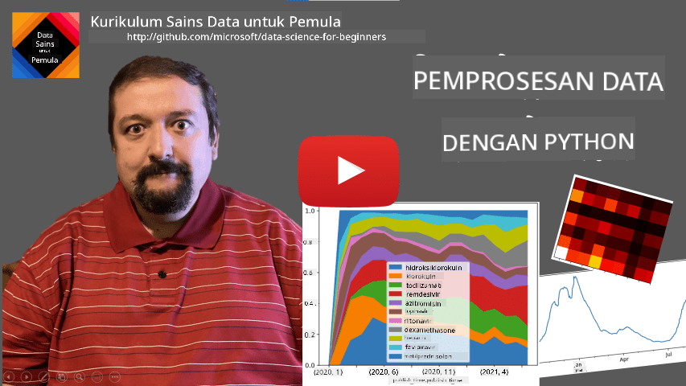
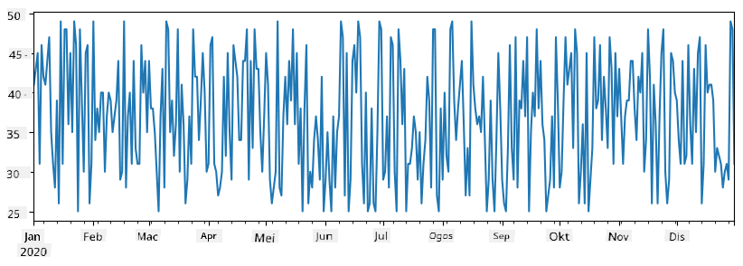
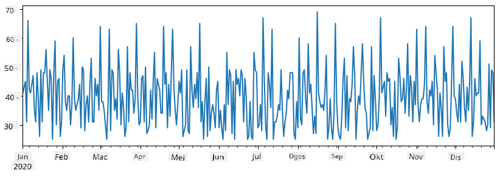
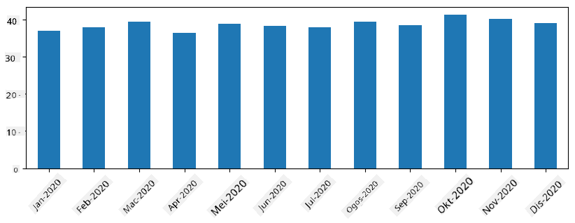
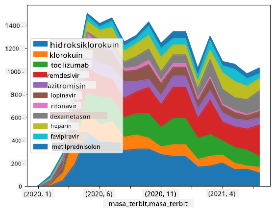

<!--
CO_OP_TRANSLATOR_METADATA:
{
  "original_hash": "116c5d361fbe812e59a73f37ce721d36",
  "translation_date": "2025-08-28T18:10:33+00:00",
  "source_file": "2-Working-With-Data/07-python/README.md",
  "language_code": "ms"
}
-->
# Bekerja dengan Data: Python dan Perpustakaan Pandas

|  ](../../sketchnotes/07-WorkWithPython.png) |
| :-------------------------------------------------------------------------------------------------------: |
|                 Bekerja dengan Python - _Sketchnote oleh [@nitya](https://twitter.com/nitya)_             |

[](https://youtu.be/dZjWOGbsN4Y)

Walaupun pangkalan data menawarkan cara yang sangat cekap untuk menyimpan data dan membuat pertanyaan menggunakan bahasa pertanyaan, cara yang paling fleksibel untuk memproses data adalah dengan menulis program anda sendiri untuk memanipulasi data. Dalam banyak kes, membuat pertanyaan pangkalan data adalah cara yang lebih berkesan. Namun, dalam beberapa kes di mana pemprosesan data yang lebih kompleks diperlukan, ia tidak dapat dilakukan dengan mudah menggunakan SQL.  
Pemprosesan data boleh diprogramkan dalam mana-mana bahasa pengaturcaraan, tetapi terdapat bahasa tertentu yang lebih tinggi tahapnya dalam bekerja dengan data. Saintis data biasanya memilih salah satu daripada bahasa berikut:

* **[Python](https://www.python.org/)**, bahasa pengaturcaraan serba guna, yang sering dianggap sebagai salah satu pilihan terbaik untuk pemula kerana kesederhanaannya. Python mempunyai banyak perpustakaan tambahan yang boleh membantu anda menyelesaikan banyak masalah praktikal, seperti mengekstrak data anda dari arkib ZIP, atau menukar gambar kepada skala kelabu. Selain sains data, Python juga sering digunakan untuk pembangunan web.  
* **[R](https://www.r-project.org/)** adalah alat tradisional yang dibangunkan dengan pemprosesan data statistik dalam fikiran. Ia juga mengandungi repositori perpustakaan yang besar (CRAN), menjadikannya pilihan yang baik untuk pemprosesan data. Walau bagaimanapun, R bukan bahasa pengaturcaraan serba guna, dan jarang digunakan di luar domain sains data.  
* **[Julia](https://julialang.org/)** adalah bahasa lain yang dibangunkan khusus untuk sains data. Ia bertujuan untuk memberikan prestasi yang lebih baik daripada Python, menjadikannya alat yang hebat untuk eksperimen saintifik.

Dalam pelajaran ini, kita akan memberi tumpuan kepada penggunaan Python untuk pemprosesan data ringkas. Kami akan mengandaikan anda mempunyai pengetahuan asas tentang bahasa ini. Jika anda ingin mendalami Python, anda boleh merujuk kepada salah satu sumber berikut:

* [Belajar Python dengan Cara Menyeronokkan menggunakan Grafik Turtle dan Fraktal](https://github.com/shwars/pycourse) - Kursus pengenalan ringkas berasaskan GitHub ke dalam Pengaturcaraan Python  
* [Ambil Langkah Pertama Anda dengan Python](https://docs.microsoft.com/en-us/learn/paths/python-first-steps/?WT.mc_id=academic-77958-bethanycheum) Laluan Pembelajaran di [Microsoft Learn](http://learn.microsoft.com/?WT.mc_id=academic-77958-bethanycheum)

Data boleh datang dalam pelbagai bentuk. Dalam pelajaran ini, kita akan mempertimbangkan tiga bentuk data - **data tabular**, **teks**, dan **imej**.

Kami akan memberi tumpuan kepada beberapa contoh pemprosesan data, bukannya memberikan gambaran keseluruhan penuh tentang semua perpustakaan berkaitan. Ini akan membolehkan anda memahami idea utama tentang apa yang mungkin dilakukan, dan meninggalkan anda dengan pemahaman tentang di mana untuk mencari penyelesaian kepada masalah anda apabila anda memerlukannya.

> **Nasihat paling berguna**. Apabila anda perlu melakukan operasi tertentu pada data yang anda tidak tahu bagaimana untuk melakukannya, cuba cari di internet. [Stackoverflow](https://stackoverflow.com/) biasanya mengandungi banyak contoh kod berguna dalam Python untuk banyak tugas biasa.


## [Kuiz Pra-Kuliah](https://purple-hill-04aebfb03.1.azurestaticapps.net/quiz/12)

## Data Tabular dan Dataframe

Anda sudah bertemu dengan data tabular apabila kita bercakap tentang pangkalan data relasi. Apabila anda mempunyai banyak data, dan ia terkandung dalam banyak jadual yang saling berkaitan, ia sememangnya masuk akal untuk menggunakan SQL untuk bekerja dengannya. Walau bagaimanapun, terdapat banyak kes di mana kita mempunyai jadual data, dan kita perlu mendapatkan **pemahaman** atau **wawasan** tentang data ini, seperti taburan, korelasi antara nilai, dan sebagainya. Dalam sains data, terdapat banyak kes di mana kita perlu melakukan beberapa transformasi data asal, diikuti dengan visualisasi. Kedua-dua langkah ini boleh dilakukan dengan mudah menggunakan Python.

Terdapat dua perpustakaan paling berguna dalam Python yang boleh membantu anda menangani data tabular:
* **[Pandas](https://pandas.pydata.org/)** membolehkan anda memanipulasi **Dataframe**, yang serupa dengan jadual relasi. Anda boleh mempunyai lajur bernama, dan melakukan pelbagai operasi pada baris, lajur, dan dataframe secara umum.  
* **[Numpy](https://numpy.org/)** adalah perpustakaan untuk bekerja dengan **tensor**, iaitu **array** pelbagai dimensi. Array mempunyai nilai jenis asas yang sama, dan ia lebih ringkas daripada dataframe, tetapi ia menawarkan lebih banyak operasi matematik, dan menghasilkan kurang overhead.

Terdapat juga beberapa perpustakaan lain yang anda patut tahu:
* **[Matplotlib](https://matplotlib.org/)** adalah perpustakaan yang digunakan untuk visualisasi data dan melukis graf  
* **[SciPy](https://www.scipy.org/)** adalah perpustakaan dengan beberapa fungsi saintifik tambahan. Kita sudah menemui perpustakaan ini semasa bercakap tentang kebarangkalian dan statistik

Berikut adalah sekeping kod yang biasanya anda gunakan untuk mengimport perpustakaan ini pada permulaan program Python anda:
```python
import numpy as np
import pandas as pd
import matplotlib.pyplot as plt
from scipy import ... # you need to specify exact sub-packages that you need
``` 

Pandas berpusat pada beberapa konsep asas.

### Siri 

**Siri** adalah urutan nilai, serupa dengan senarai atau array numpy. Perbezaan utama adalah siri juga mempunyai **indeks**, dan apabila kita beroperasi pada siri (contohnya, menambahnya), indeks diambil kira. Indeks boleh sesederhana nombor baris integer (ia adalah indeks yang digunakan secara lalai apabila mencipta siri daripada senarai atau array), atau ia boleh mempunyai struktur yang kompleks, seperti selang tarikh.

> **Nota**: Terdapat beberapa kod pengenalan Pandas dalam buku nota yang disertakan [`notebook.ipynb`](notebook.ipynb). Kami hanya menggariskan beberapa contoh di sini, dan anda dialu-alukan untuk melihat buku nota penuh.

Pertimbangkan contoh: kita ingin menganalisis jualan kedai aiskrim kita. Mari kita hasilkan siri nombor jualan (bilangan item yang dijual setiap hari) untuk beberapa tempoh masa:

```python
start_date = "Jan 1, 2020"
end_date = "Mar 31, 2020"
idx = pd.date_range(start_date,end_date)
print(f"Length of index is {len(idx)}")
items_sold = pd.Series(np.random.randint(25,50,size=len(idx)),index=idx)
items_sold.plot()
```


Sekarang anggaplah setiap minggu kita menganjurkan pesta untuk rakan-rakan, dan kita mengambil tambahan 10 pek aiskrim untuk pesta. Kita boleh mencipta siri lain, diindeks mengikut minggu, untuk menunjukkan itu:
```python
additional_items = pd.Series(10,index=pd.date_range(start_date,end_date,freq="W"))
```
Apabila kita menambah dua siri bersama, kita mendapat jumlah keseluruhan:
```python
total_items = items_sold.add(additional_items,fill_value=0)
total_items.plot()
```


> **Nota** bahawa kita tidak menggunakan sintaks mudah `total_items+additional_items`. Jika kita melakukannya, kita akan mendapat banyak nilai `NaN` (*Not a Number*) dalam siri hasil. Ini kerana terdapat nilai yang hilang untuk beberapa titik indeks dalam siri `additional_items`, dan menambah `NaN` kepada apa-apa akan menghasilkan `NaN`. Oleh itu, kita perlu menentukan parameter `fill_value` semasa penambahan.

Dengan siri masa, kita juga boleh **menyampel semula** siri dengan selang masa yang berbeza. Sebagai contoh, anggaplah kita ingin mengira purata jumlah jualan bulanan. Kita boleh menggunakan kod berikut:
```python
monthly = total_items.resample("1M").mean()
ax = monthly.plot(kind='bar')
```


### DataFrame

DataFrame pada dasarnya adalah koleksi siri dengan indeks yang sama. Kita boleh menggabungkan beberapa siri bersama menjadi DataFrame:
```python
a = pd.Series(range(1,10))
b = pd.Series(["I","like","to","play","games","and","will","not","change"],index=range(0,9))
df = pd.DataFrame([a,b])
```
Ini akan mencipta jadual mendatar seperti ini:
|     | 0   | 1    | 2   | 3   | 4      | 5   | 6      | 7    | 8    |
| --- | --- | ---- | --- | --- | ------ | --- | ------ | ---- | ---- |
| 0   | 1   | 2    | 3   | 4   | 5      | 6   | 7      | 8    | 9    |
| 1   | I   | like | to  | use | Python | and | Pandas | very | much |

Kita juga boleh menggunakan Siri sebagai lajur, dan menentukan nama lajur menggunakan kamus:
```python
df = pd.DataFrame({ 'A' : a, 'B' : b })
```
Ini akan memberikan kita jadual seperti ini:

|     | A   | B      |
| --- | --- | ------ |
| 0   | 1   | I      |
| 1   | 2   | like   |
| 2   | 3   | to     |
| 3   | 4   | use    |
| 4   | 5   | Python |
| 5   | 6   | and    |
| 6   | 7   | Pandas |
| 7   | 8   | very   |
| 8   | 9   | much   |

**Nota** bahawa kita juga boleh mendapatkan susun atur jadual ini dengan mentransposkan jadual sebelumnya, contohnya dengan menulis 
```python
df = pd.DataFrame([a,b]).T..rename(columns={ 0 : 'A', 1 : 'B' })
```
Di sini `.T` bermaksud operasi mentransposkan DataFrame, iaitu menukar baris dan lajur, dan operasi `rename` membolehkan kita menamakan semula lajur untuk sepadan dengan contoh sebelumnya.

Berikut adalah beberapa operasi paling penting yang boleh kita lakukan pada DataFrame:

**Pemilihan lajur**. Kita boleh memilih lajur individu dengan menulis `df['A']` - operasi ini mengembalikan Siri. Kita juga boleh memilih subset lajur ke dalam DataFrame lain dengan menulis `df[['B','A']]` - ini mengembalikan DataFrame lain.

**Penapisan** hanya baris tertentu berdasarkan kriteria. Sebagai contoh, untuk meninggalkan hanya baris dengan lajur `A` lebih besar daripada 5, kita boleh menulis `df[df['A']>5]`.

> **Nota**: Cara penapisan berfungsi adalah seperti berikut. Ungkapan `df['A']<5` mengembalikan siri boolean, yang menunjukkan sama ada ungkapan itu `True` atau `False` untuk setiap elemen siri asal `df['A']`. Apabila siri boolean digunakan sebagai indeks, ia mengembalikan subset baris dalam DataFrame. Oleh itu, tidak mungkin menggunakan ungkapan boolean Python sewenang-wenangnya, contohnya, menulis `df[df['A']>5 and df['A']<7]` adalah salah. Sebaliknya, anda harus menggunakan operasi khas `&` pada siri boolean, menulis `df[(df['A']>5) & (df['A']<7)]` (*kurungan adalah penting di sini*).

**Mencipta lajur boleh kira baru**. Kita boleh dengan mudah mencipta lajur boleh kira baru untuk DataFrame kita dengan menggunakan ungkapan intuitif seperti ini:
```python
df['DivA'] = df['A']-df['A'].mean() 
``` 
Contoh ini mengira perbezaan A daripada nilai puratanya. Apa yang sebenarnya berlaku di sini ialah kita mengira siri, dan kemudian menetapkan siri ini ke sebelah kiri, mencipta lajur lain. Oleh itu, kita tidak boleh menggunakan sebarang operasi yang tidak serasi dengan siri, contohnya, kod di bawah adalah salah:
```python
# Wrong code -> df['ADescr'] = "Low" if df['A'] < 5 else "Hi"
df['LenB'] = len(df['B']) # <- Wrong result
``` 
Contoh terakhir, walaupun secara sintaksis betul, memberikan kita hasil yang salah, kerana ia menetapkan panjang siri `B` kepada semua nilai dalam lajur, dan bukan panjang elemen individu seperti yang kita maksudkan.

Jika kita perlu mengira ungkapan kompleks seperti ini, kita boleh menggunakan fungsi `apply`. Contoh terakhir boleh ditulis seperti berikut:
```python
df['LenB'] = df['B'].apply(lambda x : len(x))
# or 
df['LenB'] = df['B'].apply(len)
```

Selepas operasi di atas, kita akan mendapat DataFrame berikut:

|     | A   | B      | DivA | LenB |
| --- | --- | ------ | ---- | ---- |
| 0   | 1   | I      | -4.0 | 1    |
| 1   | 2   | like   | -3.0 | 4    |
| 2   | 3   | to     | -2.0 | 2    |
| 3   | 4   | use    | -1.0 | 3    |
| 4   | 5   | Python | 0.0  | 6    |
| 5   | 6   | and    | 1.0  | 3    |
| 6   | 7   | Pandas | 2.0  | 6    |
| 7   | 8   | very   | 3.0  | 4    |
| 8   | 9   | much   | 4.0  | 4    |

**Memilih baris berdasarkan nombor** boleh dilakukan menggunakan konstruk `iloc`. Sebagai contoh, untuk memilih 5 baris pertama dari DataFrame:
```python
df.iloc[:5]
```

**Pengelompokan** sering digunakan untuk mendapatkan hasil yang serupa dengan *jadual pangsi* dalam Excel. Anggaplah kita ingin mengira nilai purata lajur `A` untuk setiap nombor `LenB` yang diberikan. Kemudian kita boleh mengelompokkan DataFrame kita mengikut `LenB`, dan memanggil `mean`:
```python
df.groupby(by='LenB').mean()
```
Jika kita perlu mengira purata dan bilangan elemen dalam kumpulan, maka kita boleh menggunakan fungsi `aggregate` yang lebih kompleks:
```python
df.groupby(by='LenB') \
 .aggregate({ 'DivA' : len, 'A' : lambda x: x.mean() }) \
 .rename(columns={ 'DivA' : 'Count', 'A' : 'Mean'})
```
Ini memberikan kita jadual berikut:

| LenB | Count | Mean     |
| ---- | ----- | -------- |
| 1    | 1     | 1.000000 |
| 2    | 1     | 3.000000 |
| 3    | 2     | 5.000000 |
| 4    | 3     | 6.333333 |
| 6    | 2     | 6.000000 |

### Mendapatkan Data
Kita telah melihat betapa mudahnya membina Series dan DataFrames daripada objek Python. Namun, data biasanya datang dalam bentuk fail teks atau jadual Excel. Nasib baik, Pandas menawarkan cara mudah untuk memuatkan data dari cakera. Sebagai contoh, membaca fail CSV semudah ini:  
```python
df = pd.read_csv('file.csv')
```  
Kita akan melihat lebih banyak contoh memuatkan data, termasuk mengambilnya dari laman web luaran, dalam bahagian "Cabaran".

### Mencetak dan Memplot

Seorang Saintis Data sering perlu meneroka data, jadi adalah penting untuk dapat memvisualisasikannya. Apabila DataFrame besar, banyak kali kita hanya ingin memastikan kita melakukan semuanya dengan betul dengan mencetak beberapa baris pertama. Ini boleh dilakukan dengan memanggil `df.head()`. Jika anda menjalankannya dari Jupyter Notebook, ia akan mencetak DataFrame dalam bentuk jadual yang kemas.

Kita juga telah melihat penggunaan fungsi `plot` untuk memvisualisasikan beberapa kolum. Walaupun `plot` sangat berguna untuk banyak tugas, dan menyokong pelbagai jenis graf melalui parameter `kind=`, anda sentiasa boleh menggunakan pustaka `matplotlib` mentah untuk memplot sesuatu yang lebih kompleks. Kita akan membincangkan visualisasi data secara terperinci dalam pelajaran kursus yang berasingan.

Gambaran keseluruhan ini merangkumi konsep paling penting dalam Pandas, namun, pustaka ini sangat kaya, dan tiada had kepada apa yang boleh anda lakukan dengannya! Mari kita gunakan pengetahuan ini untuk menyelesaikan masalah tertentu.

## 🚀 Cabaran 1: Menganalisis Penyebaran COVID

Masalah pertama yang akan kita fokuskan ialah pemodelan penyebaran wabak COVID-19. Untuk melakukannya, kita akan menggunakan data tentang bilangan individu yang dijangkiti di pelbagai negara, yang disediakan oleh [Center for Systems Science and Engineering](https://systems.jhu.edu/) (CSSE) di [Johns Hopkins University](https://jhu.edu/). Dataset tersedia di [Repositori GitHub ini](https://github.com/CSSEGISandData/COVID-19).

Oleh kerana kita ingin menunjukkan cara menangani data, kami mengajak anda untuk membuka [`notebook-covidspread.ipynb`](notebook-covidspread.ipynb) dan membacanya dari atas ke bawah. Anda juga boleh melaksanakan sel, dan melakukan beberapa cabaran yang telah kami tinggalkan untuk anda di penghujungnya.


> Jika anda tidak tahu cara menjalankan kod dalam Jupyter Notebook, lihat [artikel ini](https://soshnikov.com/education/how-to-execute-notebooks-from-github/).

## Bekerja dengan Data Tidak Berstruktur

Walaupun data sering datang dalam bentuk jadual, dalam beberapa kes kita perlu menangani data yang kurang berstruktur, contohnya, teks atau imej. Dalam kes ini, untuk menerapkan teknik pemprosesan data yang telah kita lihat di atas, kita perlu **mengekstrak** data berstruktur. Berikut adalah beberapa contoh:

* Mengekstrak kata kunci daripada teks, dan melihat seberapa kerap kata kunci tersebut muncul
* Menggunakan rangkaian neural untuk mengekstrak maklumat tentang objek dalam gambar
* Mendapatkan maklumat tentang emosi orang dalam suapan kamera video

## 🚀 Cabaran 2: Menganalisis Kertas COVID

Dalam cabaran ini, kita akan meneruskan topik pandemik COVID, dan fokus pada pemprosesan kertas saintifik mengenai subjek ini. Terdapat [Dataset CORD-19](https://www.kaggle.com/allen-institute-for-ai/CORD-19-research-challenge) dengan lebih daripada 7000 (pada masa penulisan) kertas mengenai COVID, tersedia dengan metadata dan abstrak (dan untuk kira-kira separuh daripadanya juga disediakan teks penuh).

Contoh penuh menganalisis dataset ini menggunakan perkhidmatan kognitif [Text Analytics for Health](https://docs.microsoft.com/azure/cognitive-services/text-analytics/how-tos/text-analytics-for-health/?WT.mc_id=academic-77958-bethanycheum) diterangkan [dalam catatan blog ini](https://soshnikov.com/science/analyzing-medical-papers-with-azure-and-text-analytics-for-health/). Kita akan membincangkan versi analisis yang dipermudahkan.

> **NOTE**: Kami tidak menyediakan salinan dataset sebagai sebahagian daripada repositori ini. Anda mungkin perlu memuat turun fail [`metadata.csv`](https://www.kaggle.com/allen-institute-for-ai/CORD-19-research-challenge?select=metadata.csv) daripada [dataset ini di Kaggle](https://www.kaggle.com/allen-institute-for-ai/CORD-19-research-challenge). Pendaftaran dengan Kaggle mungkin diperlukan. Anda juga boleh memuat turun dataset tanpa pendaftaran [di sini](https://ai2-semanticscholar-cord-19.s3-us-west-2.amazonaws.com/historical_releases.html), tetapi ia akan termasuk semua teks penuh selain daripada fail metadata.

Buka [`notebook-papers.ipynb`](notebook-papers.ipynb) dan bacalah dari atas ke bawah. Anda juga boleh melaksanakan sel, dan melakukan beberapa cabaran yang telah kami tinggalkan untuk anda di penghujungnya.



## Memproses Data Imej

Baru-baru ini, model AI yang sangat berkuasa telah dibangunkan yang membolehkan kita memahami imej. Terdapat banyak tugas yang boleh diselesaikan menggunakan rangkaian neural yang telah dilatih, atau perkhidmatan awan. Beberapa contoh termasuk:

* **Pengelasan Imej**, yang boleh membantu anda mengkategorikan imej ke dalam salah satu kelas yang telah ditentukan. Anda boleh melatih pengelas imej anda sendiri dengan mudah menggunakan perkhidmatan seperti [Custom Vision](https://azure.microsoft.com/services/cognitive-services/custom-vision-service/?WT.mc_id=academic-77958-bethanycheum)
* **Pengesanan Objek** untuk mengesan objek yang berbeza dalam imej. Perkhidmatan seperti [computer vision](https://azure.microsoft.com/services/cognitive-services/computer-vision/?WT.mc_id=academic-77958-bethanycheum) boleh mengesan sejumlah objek biasa, dan anda boleh melatih model [Custom Vision](https://azure.microsoft.com/services/cognitive-services/custom-vision-service/?WT.mc_id=academic-77958-bethanycheum) untuk mengesan beberapa objek tertentu yang menarik.
* **Pengesanan Wajah**, termasuk pengesanan Umur, Jantina dan Emosi. Ini boleh dilakukan melalui [Face API](https://azure.microsoft.com/services/cognitive-services/face/?WT.mc_id=academic-77958-bethanycheum).

Semua perkhidmatan awan ini boleh dipanggil menggunakan [Python SDKs](https://docs.microsoft.com/samples/azure-samples/cognitive-services-python-sdk-samples/cognitive-services-python-sdk-samples/?WT.mc_id=academic-77958-bethanycheum), dan dengan itu boleh dimasukkan dengan mudah ke dalam aliran kerja penerokaan data anda.

Berikut adalah beberapa contoh penerokaan data daripada sumber data imej:
* Dalam catatan blog [Cara Belajar Sains Data Tanpa Pengekodan](https://soshnikov.com/azure/how-to-learn-data-science-without-coding/) kami meneroka foto Instagram, cuba memahami apa yang membuatkan orang memberikan lebih banyak suka kepada foto. Kami mula-mula mengekstrak sebanyak mungkin maklumat daripada gambar menggunakan [computer vision](https://azure.microsoft.com/services/cognitive-services/computer-vision/?WT.mc_id=academic-77958-bethanycheum), dan kemudian menggunakan [Azure Machine Learning AutoML](https://docs.microsoft.com/azure/machine-learning/concept-automated-ml/?WT.mc_id=academic-77958-bethanycheum) untuk membina model yang boleh ditafsirkan.
* Dalam [Bengkel Kajian Wajah](https://github.com/CloudAdvocacy/FaceStudies) kami menggunakan [Face API](https://azure.microsoft.com/services/cognitive-services/face/?WT.mc_id=academic-77958-bethanycheum) untuk mengekstrak emosi orang dalam gambar dari acara, untuk cuba memahami apa yang membuatkan orang gembira.

## Kesimpulan

Sama ada anda sudah mempunyai data berstruktur atau tidak berstruktur, menggunakan Python anda boleh melakukan semua langkah berkaitan pemprosesan dan pemahaman data. Ia mungkin cara paling fleksibel untuk pemprosesan data, dan itulah sebabnya majoriti saintis data menggunakan Python sebagai alat utama mereka. Mempelajari Python secara mendalam mungkin idea yang baik jika anda serius tentang perjalanan sains data anda!

## [Kuiz selepas kuliah](https://purple-hill-04aebfb03.1.azurestaticapps.net/quiz/13)

## Ulasan & Kajian Kendiri

**Buku**
* [Wes McKinney. Python for Data Analysis: Data Wrangling with Pandas, NumPy, and IPython](https://www.amazon.com/gp/product/1491957662)

**Sumber Dalam Talian**
* Tutorial rasmi [10 minutes to Pandas](https://pandas.pydata.org/pandas-docs/stable/user_guide/10min.html)
* [Dokumentasi tentang Visualisasi Pandas](https://pandas.pydata.org/pandas-docs/stable/user_guide/visualization.html)

**Belajar Python**
* [Belajar Python dengan Cara Menarik menggunakan Turtle Graphics dan Fractals](https://github.com/shwars/pycourse)
* [Ambil Langkah Pertama Anda dengan Python](https://docs.microsoft.com/learn/paths/python-first-steps/?WT.mc_id=academic-77958-bethanycheum) Laluan Pembelajaran di [Microsoft Learn](http://learn.microsoft.com/?WT.mc_id=academic-77958-bethanycheum)

## Tugasan

[Lakukan kajian data yang lebih terperinci untuk cabaran di atas](assignment.md)

## Kredit

Pelajaran ini telah ditulis dengan ♥️ oleh [Dmitry Soshnikov](http://soshnikov.com)

---

**Penafian**:  
Dokumen ini telah diterjemahkan menggunakan perkhidmatan terjemahan AI [Co-op Translator](https://github.com/Azure/co-op-translator). Walaupun kami berusaha untuk memastikan ketepatan, sila ambil maklum bahawa terjemahan automatik mungkin mengandungi kesilapan atau ketidaktepatan. Dokumen asal dalam bahasa asalnya harus dianggap sebagai sumber yang berwibawa. Untuk maklumat yang kritikal, terjemahan manusia profesional adalah disyorkan. Kami tidak bertanggungjawab atas sebarang salah faham atau salah tafsir yang timbul daripada penggunaan terjemahan ini.