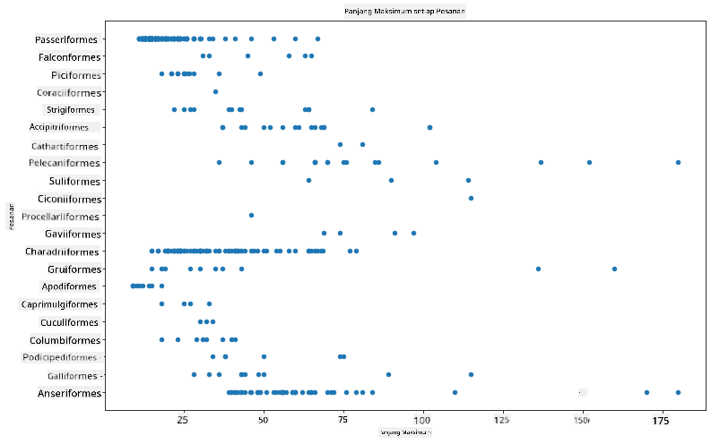
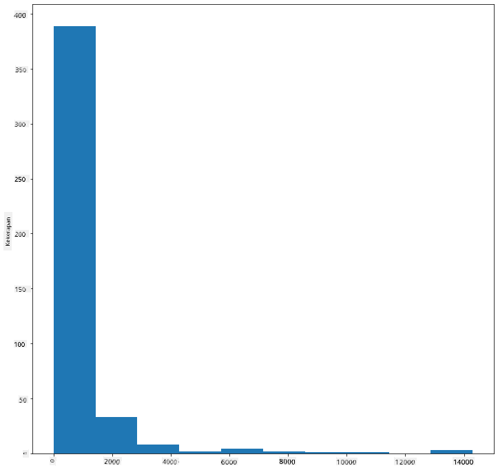
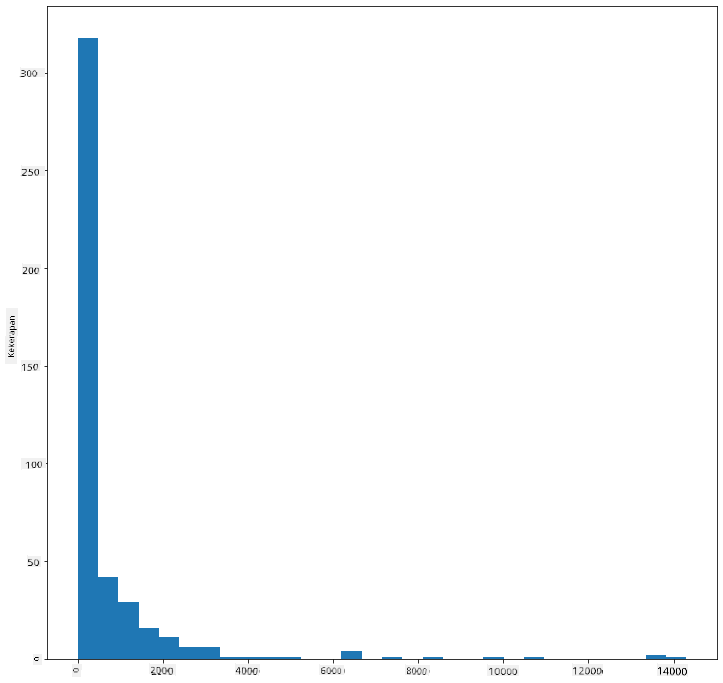
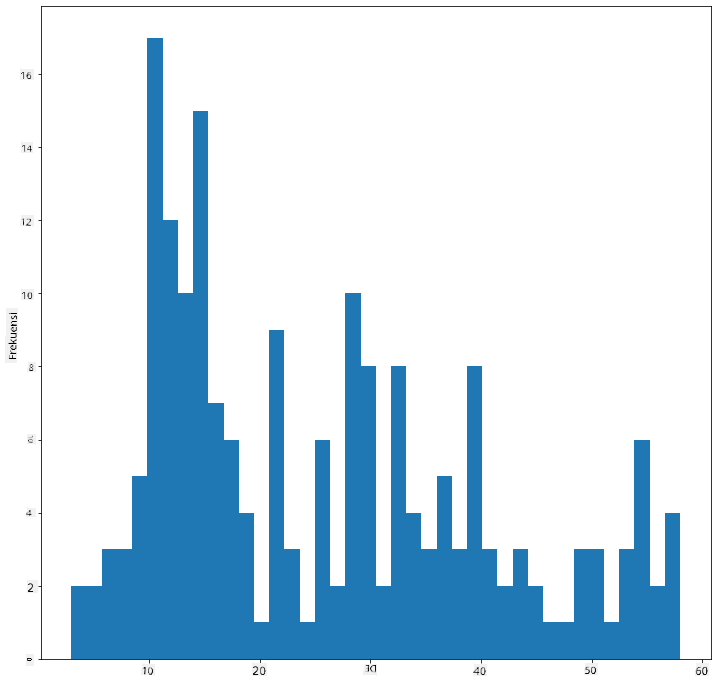
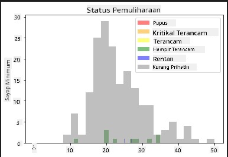
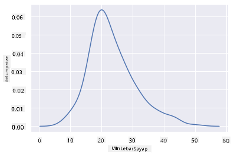
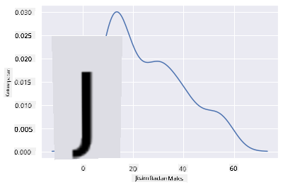
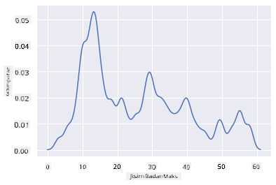
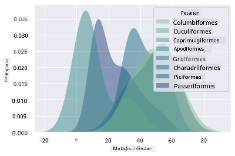
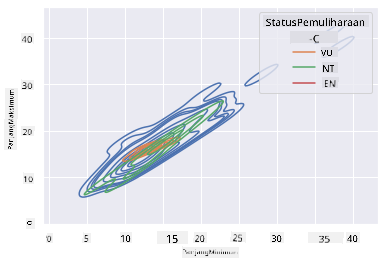

<!--
CO_OP_TRANSLATOR_METADATA:
{
  "original_hash": "87faccac113d772551486a67a607153e",
  "translation_date": "2025-08-28T18:48:49+00:00",
  "source_file": "3-Data-Visualization/10-visualization-distributions/README.md",
  "language_code": "ms"
}
-->
# Memvisualkan Taburan

| ](../../sketchnotes/10-Visualizing-Distributions.png)|
|:---:|
| Memvisualkan Taburan - _Sketchnote oleh [@nitya](https://twitter.com/nitya)_ |

Dalam pelajaran sebelumnya, anda telah mempelajari beberapa fakta menarik tentang dataset burung di Minnesota. Anda menemui data yang salah dengan memvisualkan nilai luar biasa dan melihat perbezaan antara kategori burung berdasarkan panjang maksimum mereka.

## [Kuiz pra-kuliah](https://purple-hill-04aebfb03.1.azurestaticapps.net/quiz/18)
## Terokai dataset burung

Satu lagi cara untuk menyelidik data adalah dengan melihat taburannya, atau bagaimana data diatur sepanjang paksi. Sebagai contoh, mungkin anda ingin mengetahui taburan umum, untuk dataset ini, bagi lebar sayap maksimum atau jisim badan maksimum burung di Minnesota.

Mari kita temui beberapa fakta tentang taburan data dalam dataset ini. Dalam fail _notebook.ipynb_ di akar folder pelajaran ini, import Pandas, Matplotlib, dan data anda:

```python
import pandas as pd
import matplotlib.pyplot as plt
birds = pd.read_csv('../../data/birds.csv')
birds.head()
```

|      | Nama                         | NamaSaintifik          | Kategori              | Order        | Keluarga | Genus       | StatusKonservasi   | MinPanjang | MaxPanjang | MinJisimBadan | MaxJisimBadan | MinLebarSayap | MaxLebarSayap |
| ---: | :--------------------------- | :--------------------- | :-------------------- | :----------- | :------- | :---------- | :----------------- | --------: | --------: | ----------: | ----------: | ----------: | ----------: |
|    0 | Itik bersiul perut hitam     | Dendrocygna autumnalis | Itik/Angsa/BurungAir  | Anseriformes | Anatidae | Dendrocygna | LC                 |        47 |        56 |         652 |        1020 |          76 |          94 |
|    1 | Itik bersiul fulvous         | Dendrocygna bicolor    | Itik/Angsa/BurungAir  | Anseriformes | Anatidae | Dendrocygna | LC                 |        45 |        53 |         712 |        1050 |          85 |          93 |
|    2 | Angsa salji                  | Anser caerulescens     | Itik/Angsa/BurungAir  | Anseriformes | Anatidae | Anser       | LC                 |        64 |        79 |        2050 |        4050 |         135 |         165 |
|    3 | Angsa Ross                   | Anser rossii           | Itik/Angsa/BurungAir  | Anseriformes | Anatidae | Anser       | LC                 |      57.3 |        64 |        1066 |        1567 |         113 |         116 |
|    4 | Angsa putih besar            | Anser albifrons        | Itik/Angsa/BurungAir  | Anseriformes | Anatidae | Anser       | LC                 |        64 |        81 |        1930 |        3310 |         130 |         165 |

Secara umum, anda boleh melihat dengan cepat cara data ditaburkan dengan menggunakan plot taburan seperti yang kita lakukan dalam pelajaran sebelumnya:

```python
birds.plot(kind='scatter',x='MaxLength',y='Order',figsize=(12,8))

plt.title('Max Length per Order')
plt.ylabel('Order')
plt.xlabel('Max Length')

plt.show()
```


Ini memberikan gambaran umum tentang taburan panjang badan per Order burung, tetapi ia bukan cara terbaik untuk memaparkan taburan sebenar. Tugas ini biasanya dilakukan dengan mencipta Histogram.
## Bekerja dengan histogram

Matplotlib menawarkan cara yang sangat baik untuk memvisualkan taburan data menggunakan Histogram. Jenis carta ini seperti carta bar di mana taburan dapat dilihat melalui naik dan turun bar. Untuk membina histogram, anda memerlukan data berangka. Untuk membina Histogram, anda boleh memplot carta dengan mendefinisikan jenis sebagai 'hist' untuk Histogram. Carta ini menunjukkan taburan MaxBodyMass untuk keseluruhan dataset dalam julat data berangka. Dengan membahagikan array data yang diberikan kepada bin yang lebih kecil, ia dapat memaparkan taburan nilai data:

```python
birds['MaxBodyMass'].plot(kind = 'hist', bins = 10, figsize = (12,12))
plt.show()
```


Seperti yang anda lihat, kebanyakan daripada 400+ burung dalam dataset ini berada dalam julat di bawah 2000 untuk Max Body Mass mereka. Dapatkan lebih banyak wawasan tentang data dengan menukar parameter `bins` kepada nombor yang lebih tinggi, seperti 30:

```python
birds['MaxBodyMass'].plot(kind = 'hist', bins = 30, figsize = (12,12))
plt.show()
```


Carta ini menunjukkan taburan dengan cara yang lebih terperinci. Carta yang kurang condong ke kiri boleh dibuat dengan memastikan anda hanya memilih data dalam julat tertentu:

Tapis data anda untuk mendapatkan hanya burung yang jisim badannya di bawah 60, dan tunjukkan 40 `bins`:

```python
filteredBirds = birds[(birds['MaxBodyMass'] > 1) & (birds['MaxBodyMass'] < 60)]      
filteredBirds['MaxBodyMass'].plot(kind = 'hist',bins = 40,figsize = (12,12))
plt.show()     
```


✅ Cuba beberapa penapis dan titik data lain. Untuk melihat taburan penuh data, keluarkan penapis `['MaxBodyMass']` untuk menunjukkan taburan berlabel.

Histogram menawarkan beberapa peningkatan warna dan pelabelan yang menarik untuk dicuba juga:

Cipta histogram 2D untuk membandingkan hubungan antara dua taburan. Mari bandingkan `MaxBodyMass` vs. `MaxLength`. Matplotlib menawarkan cara terbina dalam untuk menunjukkan pertemuan menggunakan warna yang lebih terang:

```python
x = filteredBirds['MaxBodyMass']
y = filteredBirds['MaxLength']

fig, ax = plt.subplots(tight_layout=True)
hist = ax.hist2d(x, y)
```
Nampaknya terdapat korelasi yang dijangka antara dua elemen ini sepanjang paksi yang dijangka, dengan satu titik pertemuan yang sangat kuat:


Histogram berfungsi dengan baik secara lalai untuk data berangka. Bagaimana jika anda perlu melihat taburan mengikut data teks? 
## Terokai dataset untuk taburan menggunakan data teks 

Dataset ini juga termasuk maklumat yang baik tentang kategori burung dan genus, spesies, serta keluarga mereka, serta status konservasi mereka. Mari kita selidik maklumat konservasi ini. Apakah taburan burung mengikut status konservasi mereka?

> ✅ Dalam dataset, beberapa akronim digunakan untuk menerangkan status konservasi. Akronim ini berasal dari [Kategori Senarai Merah IUCN](https://www.iucnredlist.org/), sebuah organisasi yang mengkatalogkan status spesies.
> 
> - CR: Kritikal Terancam
> - EN: Terancam
> - EX: Pupus
> - LC: Kurang Prihatin
> - NT: Hampir Terancam
> - VU: Rentan

Nilai-nilai ini berasaskan teks jadi anda perlu melakukan transformasi untuk mencipta histogram. Menggunakan dataframe filteredBirds, paparkan status konservasi bersama dengan Minimum Wingspan. Apa yang anda lihat? 

```python
x1 = filteredBirds.loc[filteredBirds.ConservationStatus=='EX', 'MinWingspan']
x2 = filteredBirds.loc[filteredBirds.ConservationStatus=='CR', 'MinWingspan']
x3 = filteredBirds.loc[filteredBirds.ConservationStatus=='EN', 'MinWingspan']
x4 = filteredBirds.loc[filteredBirds.ConservationStatus=='NT', 'MinWingspan']
x5 = filteredBirds.loc[filteredBirds.ConservationStatus=='VU', 'MinWingspan']
x6 = filteredBirds.loc[filteredBirds.ConservationStatus=='LC', 'MinWingspan']

kwargs = dict(alpha=0.5, bins=20)

plt.hist(x1, **kwargs, color='red', label='Extinct')
plt.hist(x2, **kwargs, color='orange', label='Critically Endangered')
plt.hist(x3, **kwargs, color='yellow', label='Endangered')
plt.hist(x4, **kwargs, color='green', label='Near Threatened')
plt.hist(x5, **kwargs, color='blue', label='Vulnerable')
plt.hist(x6, **kwargs, color='gray', label='Least Concern')

plt.gca().set(title='Conservation Status', ylabel='Min Wingspan')
plt.legend();
```



Nampaknya tidak ada korelasi yang baik antara lebar sayap minimum dan status konservasi. Uji elemen lain dalam dataset menggunakan kaedah ini. Anda juga boleh mencuba penapis yang berbeza. Adakah anda menemui sebarang korelasi?

## Plot ketumpatan

Anda mungkin telah perasan bahawa histogram yang kita lihat setakat ini adalah 'bertingkat' dan tidak mengalir dengan lancar dalam lengkungan. Untuk menunjukkan carta ketumpatan yang lebih lancar, anda boleh mencuba plot ketumpatan.

Untuk bekerja dengan plot ketumpatan, biasakan diri dengan pustaka plot baru, [Seaborn](https://seaborn.pydata.org/generated/seaborn.kdeplot.html). 

Memuatkan Seaborn, cuba plot ketumpatan asas:

```python
import seaborn as sns
import matplotlib.pyplot as plt
sns.kdeplot(filteredBirds['MinWingspan'])
plt.show()
```


Anda boleh melihat bagaimana plot ini mencerminkan yang sebelumnya untuk data Minimum Wingspan; ia hanya sedikit lebih lancar. Menurut dokumentasi Seaborn, "Berbanding dengan histogram, KDE boleh menghasilkan plot yang kurang berserabut dan lebih mudah ditafsirkan, terutamanya apabila melukis pelbagai taburan. Tetapi ia berpotensi memperkenalkan distorsi jika taburan asas terikat atau tidak lancar. Seperti histogram, kualiti representasi juga bergantung pada pemilihan parameter pelicinan yang baik." [sumber](https://seaborn.pydata.org/generated/seaborn.kdeplot.html) Dengan kata lain, nilai luar biasa seperti biasa akan membuat carta anda berkelakuan buruk.

Jika anda ingin mengunjungi semula garis MaxBodyMass yang bergerigi dalam carta kedua yang anda bina, anda boleh melicinkannya dengan baik dengan menciptanya semula menggunakan kaedah ini:

```python
sns.kdeplot(filteredBirds['MaxBodyMass'])
plt.show()
```


Jika anda mahukan garis yang licin tetapi tidak terlalu licin, edit parameter `bw_adjust`: 

```python
sns.kdeplot(filteredBirds['MaxBodyMass'], bw_adjust=.2)
plt.show()
```


✅ Baca tentang parameter yang tersedia untuk jenis plot ini dan bereksperimen!

Jenis carta ini menawarkan visualisasi yang sangat jelas. Dengan beberapa baris kod, sebagai contoh, anda boleh menunjukkan ketumpatan jisim badan maksimum per Order burung:

```python
sns.kdeplot(
   data=filteredBirds, x="MaxBodyMass", hue="Order",
   fill=True, common_norm=False, palette="crest",
   alpha=.5, linewidth=0,
)
```



Anda juga boleh memetakan ketumpatan beberapa pemboleh ubah dalam satu carta. Uji MaxLength dan MinLength burung berbanding status konservasi mereka:

```python
sns.kdeplot(data=filteredBirds, x="MinLength", y="MaxLength", hue="ConservationStatus")
```



Mungkin berbaloi untuk menyelidik sama ada kelompok burung 'Rentan' mengikut panjang mereka adalah bermakna atau tidak.

## 🚀 Cabaran

Histogram adalah jenis carta yang lebih canggih daripada plot taburan asas, carta bar, atau carta garis. Lakukan carian di internet untuk mencari contoh penggunaan histogram yang baik. Bagaimana ia digunakan, apa yang mereka tunjukkan, dan dalam bidang atau kawasan penyelidikan apa mereka cenderung digunakan?

## [Kuiz pasca-kuliah](https://purple-hill-04aebfb03.1.azurestaticapps.net/quiz/19)

## Ulasan & Kajian Kendiri

Dalam pelajaran ini, anda menggunakan Matplotlib dan mula bekerja dengan Seaborn untuk menunjukkan carta yang lebih canggih. Lakukan penyelidikan tentang `kdeplot` dalam Seaborn, "keluk ketumpatan kebarangkalian berterusan dalam satu atau lebih dimensi". Baca melalui [dokumentasi](https://seaborn.pydata.org/generated/seaborn.kdeplot.html) untuk memahami cara ia berfungsi.

## Tugasan

[Gunakan kemahiran anda](assignment.md)

---

**Penafian**:  
Dokumen ini telah diterjemahkan menggunakan perkhidmatan terjemahan AI [Co-op Translator](https://github.com/Azure/co-op-translator). Walaupun kami berusaha untuk memastikan ketepatan, sila ambil perhatian bahawa terjemahan automatik mungkin mengandungi kesilapan atau ketidaktepatan. Dokumen asal dalam bahasa asalnya harus dianggap sebagai sumber yang berwibawa. Untuk maklumat yang kritikal, terjemahan manusia profesional adalah disyorkan. Kami tidak bertanggungjawab atas sebarang salah faham atau salah tafsir yang timbul daripada penggunaan terjemahan ini.