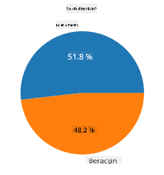
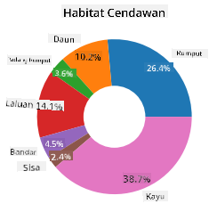
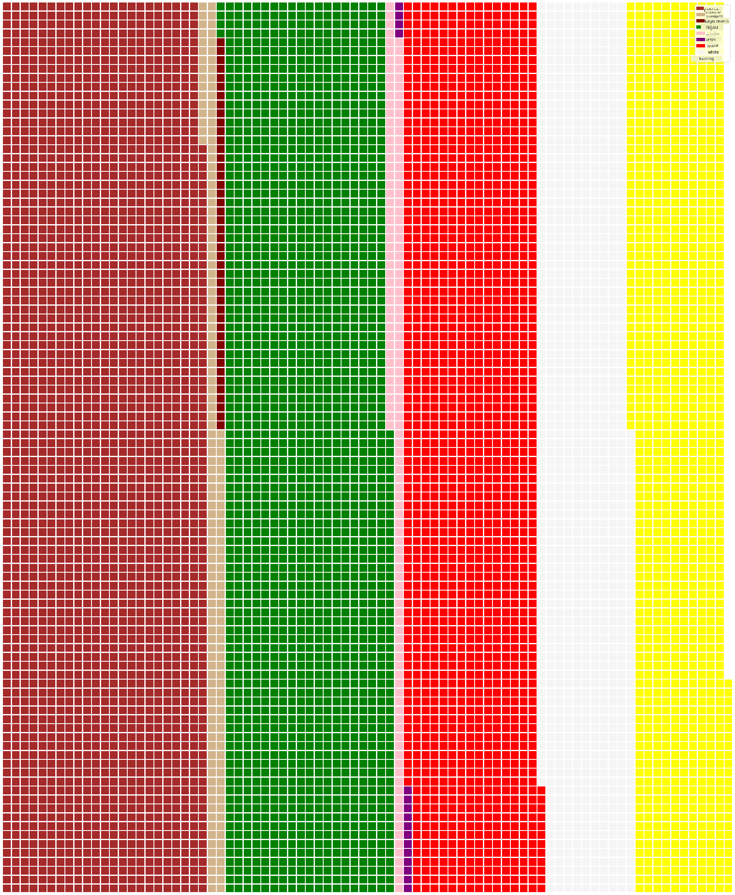

<!--
CO_OP_TRANSLATOR_METADATA:
{
  "original_hash": "af6a12015c6e250e500b570a9fa42593",
  "translation_date": "2025-08-28T18:40:07+00:00",
  "source_file": "3-Data-Visualization/11-visualization-proportions/README.md",
  "language_code": "ms"
}
-->
# Memvisualkan Perkadaran

| ](../../sketchnotes/11-Visualizing-Proportions.png)|
|:---:|
|Memvisualkan Perkadaran - _Sketchnote oleh [@nitya](https://twitter.com/nitya)_ |

Dalam pelajaran ini, anda akan menggunakan set data yang berfokuskan alam semula jadi untuk memvisualkan perkadaran, seperti berapa banyak jenis kulat yang terdapat dalam set data tentang cendawan. Mari kita terokai kulat yang menarik ini menggunakan set data yang diperoleh daripada Audubon yang menyenaraikan butiran tentang 23 spesies cendawan berinsang dalam keluarga Agaricus dan Lepiota. Anda akan bereksperimen dengan visualisasi menarik seperti:

- Carta pai 🥧  
- Carta donat 🍩  
- Carta waffle 🧇  

> 💡 Satu projek yang sangat menarik dipanggil [Charticulator](https://charticulator.com) oleh Microsoft Research menawarkan antara muka seret dan lepas percuma untuk visualisasi data. Dalam salah satu tutorial mereka, mereka juga menggunakan set data cendawan ini! Jadi anda boleh meneroka data dan belajar perpustakaan ini pada masa yang sama: [Tutorial Charticulator](https://charticulator.com/tutorials/tutorial4.html).

## [Kuiz pra-kuliah](https://purple-hill-04aebfb03.1.azurestaticapps.net/quiz/20)

## Kenali cendawan anda 🍄

Cendawan sangat menarik. Mari kita import set data untuk mengkajinya:

```python
import pandas as pd
import matplotlib.pyplot as plt
mushrooms = pd.read_csv('../../data/mushrooms.csv')
mushrooms.head()
```  
Satu jadual dicetak dengan beberapa data hebat untuk dianalisis:

| class     | cap-shape | cap-surface | cap-color | bruises | odor    | gill-attachment | gill-spacing | gill-size | gill-color | stalk-shape | stalk-root | stalk-surface-above-ring | stalk-surface-below-ring | stalk-color-above-ring | stalk-color-below-ring | veil-type | veil-color | ring-number | ring-type | spore-print-color | population | habitat |
| --------- | --------- | ----------- | --------- | ------- | ------- | --------------- | ------------ | --------- | ---------- | ----------- | ---------- | ------------------------ | ------------------------ | ---------------------- | ---------------------- | --------- | ---------- | ----------- | --------- | ----------------- | ---------- | ------- |
| Beracun   | Cembung   | Licin       | Coklat    | Lebam   | Tajam   | Bebas           | Rapat        | Sempit    | Hitam      | Membesar    | Sama       | Licin                   | Licin                   | Putih                  | Putih                  | Separa    | Putih      | Satu        | Gantung   | Hitam             | Berselerak  | Bandar  |
| Boleh dimakan | Cembung | Licin      | Kuning    | Lebam   | Badam   | Bebas           | Rapat        | Lebar     | Hitam      | Membesar    | Kelab      | Licin                   | Licin                   | Putih                  | Putih                  | Separa    | Putih      | Satu        | Gantung   | Coklat            | Banyak      | Rumput  |
| Boleh dimakan | Loceng | Licin      | Putih     | Lebam   | Anis    | Bebas           | Rapat        | Lebar     | Coklat     | Membesar    | Kelab      | Licin                   | Licin                   | Putih                  | Putih                  | Separa    | Putih      | Satu        | Gantung   | Coklat            | Banyak      | Padang  |
| Beracun   | Cembung   | Bersisik    | Putih     | Lebam   | Tajam   | Bebas           | Rapat        | Sempit    | Coklat     | Membesar    | Sama       | Licin                   | Licin                   | Putih                  | Putih                  | Separa    | Putih      | Satu        | Gantung   | Hitam             | Berselerak  | Bandar  |

Dengan segera, anda perasan bahawa semua data adalah berbentuk teks. Anda perlu menukar data ini supaya boleh digunakan dalam carta. Kebanyakan data, sebenarnya, diwakili sebagai objek:

```python
print(mushrooms.select_dtypes(["object"]).columns)
```  

Hasilnya adalah:

```output
Index(['class', 'cap-shape', 'cap-surface', 'cap-color', 'bruises', 'odor',
       'gill-attachment', 'gill-spacing', 'gill-size', 'gill-color',
       'stalk-shape', 'stalk-root', 'stalk-surface-above-ring',
       'stalk-surface-below-ring', 'stalk-color-above-ring',
       'stalk-color-below-ring', 'veil-type', 'veil-color', 'ring-number',
       'ring-type', 'spore-print-color', 'population', 'habitat'],
      dtype='object')
```  
Ambil data ini dan tukarkan lajur 'class' kepada kategori:

```python
cols = mushrooms.select_dtypes(["object"]).columns
mushrooms[cols] = mushrooms[cols].astype('category')
```  

```python
edibleclass=mushrooms.groupby(['class']).count()
edibleclass
```  

Sekarang, jika anda mencetak data cendawan, anda boleh melihat bahawa ia telah dikelompokkan ke dalam kategori mengikut kelas beracun/boleh dimakan:

|           | cap-shape | cap-surface | cap-color | bruises | odor | gill-attachment | gill-spacing | gill-size | gill-color | stalk-shape | ... | stalk-surface-below-ring | stalk-color-above-ring | stalk-color-below-ring | veil-type | veil-color | ring-number | ring-type | spore-print-color | population | habitat |
| --------- | --------- | ----------- | --------- | ------- | ---- | --------------- | ------------ | --------- | ---------- | ----------- | --- | ------------------------ | ---------------------- | ---------------------- | --------- | ---------- | ----------- | --------- | ----------------- | ---------- | ------- |
| class     |           |             |           |         |      |                 |              |           |            |             |     |                          |                        |                        |           |            |             |           |                   |            |         |
| Boleh dimakan | 4208  | 4208        | 4208      | 4208    | 4208 | 4208            | 4208         | 4208      | 4208       | 4208        | ... | 4208                     | 4208                   | 4208                   | 4208      | 4208       | 4208        | 4208      | 4208              | 4208       | 4208    |
| Beracun   | 3916      | 3916        | 3916      | 3916    | 3916 | 3916            | 3916         | 3916      | 3916       | 3916        | ... | 3916                     | 3916                   | 3916                   | 3916      | 3916       | 3916        | 3916      | 3916              | 3916       | 3916    |

Jika anda mengikuti susunan yang ditunjukkan dalam jadual ini untuk mencipta label kategori kelas anda, anda boleh membina carta pai:

## Pai!

```python
labels=['Edible','Poisonous']
plt.pie(edibleclass['population'],labels=labels,autopct='%.1f %%')
plt.title('Edible?')
plt.show()
```  
Voila, satu carta pai yang menunjukkan perkadaran data ini mengikut dua kelas cendawan ini. Sangat penting untuk mendapatkan susunan label dengan betul, terutamanya di sini, jadi pastikan anda mengesahkan susunan dengan cara label array dibina!



## Donat!

Carta pai yang lebih menarik secara visual ialah carta donat, iaitu carta pai dengan lubang di tengah. Mari kita lihat data kita menggunakan kaedah ini.

Lihat pelbagai habitat di mana cendawan tumbuh:

```python
habitat=mushrooms.groupby(['habitat']).count()
habitat
```  
Di sini, anda mengelompokkan data anda mengikut habitat. Terdapat 7 habitat yang disenaraikan, jadi gunakan itu sebagai label untuk carta donat anda:

```python
labels=['Grasses','Leaves','Meadows','Paths','Urban','Waste','Wood']

plt.pie(habitat['class'], labels=labels,
        autopct='%1.1f%%', pctdistance=0.85)
  
center_circle = plt.Circle((0, 0), 0.40, fc='white')
fig = plt.gcf()

fig.gca().add_artist(center_circle)
  
plt.title('Mushroom Habitats')
  
plt.show()
```  

  

Kod ini melukis carta dan bulatan tengah, kemudian menambah bulatan tengah itu ke dalam carta. Edit lebar bulatan tengah dengan menukar `0.40` kepada nilai lain.

Carta donat boleh diubah suai dalam pelbagai cara untuk menukar label. Label khususnya boleh diserlahkan untuk kebolehbacaan. Ketahui lebih lanjut dalam [dokumentasi](https://matplotlib.org/stable/gallery/pie_and_polar_charts/pie_and_donut_labels.html?highlight=donut).

Sekarang anda tahu cara mengelompokkan data anda dan kemudian memaparkannya sebagai pai atau donat, anda boleh meneroka jenis carta lain. Cuba carta waffle, yang hanya cara berbeza untuk meneroka kuantiti.

## Waffle!

Carta jenis 'waffle' adalah cara berbeza untuk memvisualkan kuantiti sebagai susunan 2D petak. Cuba visualkan kuantiti warna topi cendawan yang berbeza dalam set data ini. Untuk melakukannya, anda perlu memasang perpustakaan pembantu yang dipanggil [PyWaffle](https://pypi.org/project/pywaffle/) dan gunakan Matplotlib:

```python
pip install pywaffle
```  

Pilih segmen data anda untuk dikelompokkan:

```python
capcolor=mushrooms.groupby(['cap-color']).count()
capcolor
```  

Cipta carta waffle dengan mencipta label dan kemudian mengelompokkan data anda:

```python
import pandas as pd
import matplotlib.pyplot as plt
from pywaffle import Waffle
  
data ={'color': ['brown', 'buff', 'cinnamon', 'green', 'pink', 'purple', 'red', 'white', 'yellow'],
    'amount': capcolor['class']
     }
  
df = pd.DataFrame(data)
  
fig = plt.figure(
    FigureClass = Waffle,
    rows = 100,
    values = df.amount,
    labels = list(df.color),
    figsize = (30,30),
    colors=["brown", "tan", "maroon", "green", "pink", "purple", "red", "whitesmoke", "yellow"],
)
```  

Menggunakan carta waffle, anda boleh melihat dengan jelas perkadaran warna topi dalam set data cendawan ini. Menariknya, terdapat banyak cendawan bertopi hijau!



✅ Pywaffle menyokong ikon dalam carta yang menggunakan mana-mana ikon yang tersedia dalam [Font Awesome](https://fontawesome.com/). Lakukan beberapa eksperimen untuk mencipta carta waffle yang lebih menarik menggunakan ikon dan bukannya petak.

Dalam pelajaran ini, anda telah mempelajari tiga cara untuk memvisualkan perkadaran. Pertama, anda perlu mengelompokkan data anda ke dalam kategori dan kemudian memutuskan cara terbaik untuk memaparkan data tersebut - pai, donat, atau waffle. Semuanya menarik dan memberikan pengguna gambaran segera tentang set data.

## 🚀 Cabaran

Cuba cipta semula carta menarik ini dalam [Charticulator](https://charticulator.com).  
## [Kuiz pasca-kuliah](https://purple-hill-04aebfb03.1.azurestaticapps.net/quiz/21)

## Ulasan & Kajian Kendiri

Kadangkala tidak jelas bila untuk menggunakan carta pai, donat, atau waffle. Berikut adalah beberapa artikel untuk dibaca mengenai topik ini:

https://www.beautiful.ai/blog/battle-of-the-charts-pie-chart-vs-donut-chart  

https://medium.com/@hypsypops/pie-chart-vs-donut-chart-showdown-in-the-ring-5d24fd86a9ce  

https://www.mit.edu/~mbarker/formula1/f1help/11-ch-c6.htm  

https://medium.datadriveninvestor.com/data-visualization-done-the-right-way-with-tableau-waffle-chart-fdf2a19be402  

Lakukan penyelidikan untuk mencari lebih banyak maklumat tentang keputusan yang sukar ini.  

## Tugasan

[Cuba dalam Excel](assignment.md)  

---

**Penafian**:  
Dokumen ini telah diterjemahkan menggunakan perkhidmatan terjemahan AI [Co-op Translator](https://github.com/Azure/co-op-translator). Walaupun kami berusaha untuk memastikan ketepatan, sila ambil perhatian bahawa terjemahan automatik mungkin mengandungi kesilapan atau ketidaktepatan. Dokumen asal dalam bahasa asalnya harus dianggap sebagai sumber yang berwibawa. Untuk maklumat yang kritikal, terjemahan manusia profesional adalah disyorkan. Kami tidak bertanggungjawab atas sebarang salah faham atau salah tafsir yang timbul daripada penggunaan terjemahan ini.