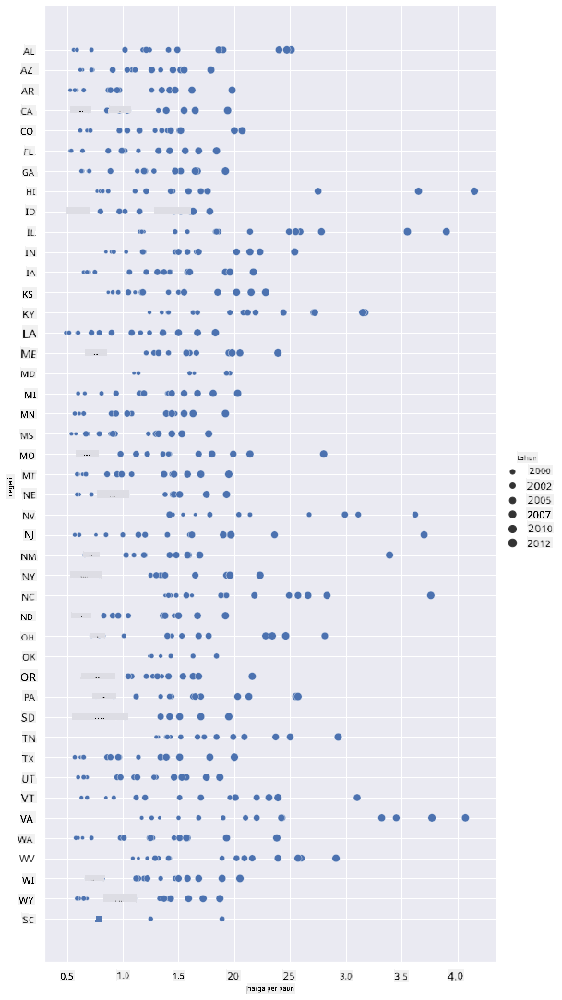
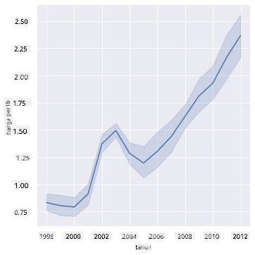
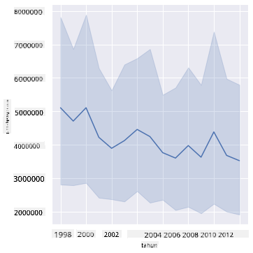
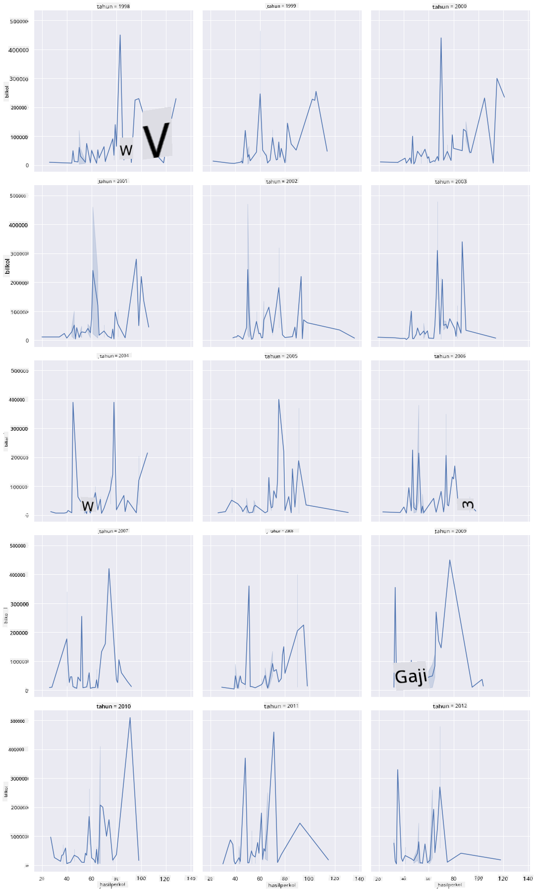
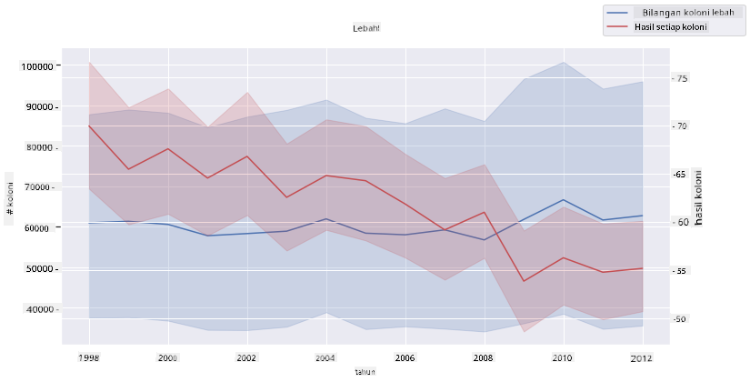

<!--
CO_OP_TRANSLATOR_METADATA:
{
  "original_hash": "0764fd4077f3f04a1d968ec371227744",
  "translation_date": "2025-09-06T11:43:27+00:00",
  "source_file": "3-Data-Visualization/12-visualization-relationships/README.md",
  "language_code": "ms"
}
-->
# Visualisasi Hubungan: Semua Tentang Madu 🍯

| ](../../sketchnotes/12-Visualizing-Relationships.png)|
|:---:|
|Visualisasi Hubungan - _Sketchnote oleh [@nitya](https://twitter.com/nitya)_ |

Meneruskan fokus kajian kita terhadap alam semula jadi, mari kita terokai visualisasi menarik untuk menunjukkan hubungan antara pelbagai jenis madu, berdasarkan dataset yang diperoleh daripada [Jabatan Pertanian Amerika Syarikat](https://www.nass.usda.gov/About_NASS/index.php).

Dataset ini mengandungi kira-kira 600 item yang memaparkan pengeluaran madu di banyak negeri di Amerika Syarikat. Sebagai contoh, anda boleh melihat bilangan koloni, hasil per koloni, jumlah pengeluaran, stok, harga per paun, dan nilai madu yang dihasilkan di negeri tertentu dari tahun 1998-2012, dengan satu baris data bagi setiap tahun untuk setiap negeri.

Adalah menarik untuk memvisualisasikan hubungan antara pengeluaran tahunan negeri tertentu dan, sebagai contoh, harga madu di negeri tersebut. Sebagai alternatif, anda boleh memvisualisasikan hubungan antara hasil madu per koloni di negeri-negeri. Tempoh tahun ini meliputi 'CCD' atau 'Colony Collapse Disorder' yang pertama kali dilihat pada tahun 2006 (http://npic.orst.edu/envir/ccd.html), menjadikannya dataset yang bermakna untuk dikaji. 🐝

## [Kuiz pra-pelajaran](https://ff-quizzes.netlify.app/en/ds/quiz/22)

Dalam pelajaran ini, anda boleh menggunakan Seaborn, yang telah anda gunakan sebelum ini, sebagai perpustakaan yang baik untuk memvisualisasikan hubungan antara pemboleh ubah. Yang paling menarik ialah penggunaan fungsi `relplot` Seaborn yang membolehkan plot taburan dan plot garis untuk dengan cepat memvisualisasikan '[hubungan statistik](https://seaborn.pydata.org/tutorial/relational.html?highlight=relationships)', yang membantu saintis data memahami dengan lebih baik bagaimana pemboleh ubah saling berkaitan.

## Scatterplots

Gunakan scatterplot untuk menunjukkan bagaimana harga madu berkembang dari tahun ke tahun, mengikut negeri. Seaborn, menggunakan `relplot`, dengan mudah mengelompokkan data negeri dan memaparkan titik data untuk kedua-dua data kategori dan numerik.

Mari kita mulakan dengan mengimport data dan Seaborn:

```python
import pandas as pd
import matplotlib.pyplot as plt
import seaborn as sns
honey = pd.read_csv('../../data/honey.csv')
honey.head()
```
Anda akan perasan bahawa data madu mempunyai beberapa kolum menarik, termasuk tahun dan harga per paun. Mari kita terokai data ini, yang dikelompokkan mengikut negeri di Amerika Syarikat:

| negeri | numcol | hasilpercol | jumlahprod | stok     | hargaperlb | nilaiprod | tahun |
| ------ | ------ | ----------- | ---------- | -------- | ---------- | --------- | ----- |
| AL     | 16000  | 71          | 1136000    | 159000   | 0.72       | 818000    | 1998  |
| AZ     | 55000  | 60          | 3300000    | 1485000  | 0.64       | 2112000   | 1998  |
| AR     | 53000  | 65          | 3445000    | 1688000  | 0.59       | 2033000   | 1998  |
| CA     | 450000 | 83          | 37350000   | 12326000 | 0.62       | 23157000  | 1998  |
| CO     | 27000  | 72          | 1944000    | 1594000  | 0.7        | 1361000   | 1998  |

Buat scatterplot asas untuk menunjukkan hubungan antara harga per paun madu dan negeri asalnya di Amerika Syarikat. Jadikan paksi `y` cukup tinggi untuk memaparkan semua negeri:

```python
sns.relplot(x="priceperlb", y="state", data=honey, height=15, aspect=.5);
```


Sekarang, tunjukkan data yang sama dengan skema warna madu untuk menunjukkan bagaimana harga berkembang dari tahun ke tahun. Anda boleh melakukannya dengan menambah parameter 'hue' untuk menunjukkan perubahan dari tahun ke tahun:

> ✅ Ketahui lebih lanjut tentang [palet warna yang boleh digunakan dalam Seaborn](https://seaborn.pydata.org/tutorial/color_palettes.html) - cuba skema warna pelangi yang indah!

```python
sns.relplot(x="priceperlb", y="state", hue="year", palette="YlOrBr", data=honey, height=15, aspect=.5);
```


Dengan perubahan skema warna ini, anda dapat melihat dengan jelas perkembangan yang kuat dari tahun ke tahun dalam harga madu per paun. Malah, jika anda melihat set sampel dalam data untuk mengesahkan (pilih negeri tertentu, contohnya Arizona), anda dapat melihat pola kenaikan harga dari tahun ke tahun, dengan beberapa pengecualian:

| negeri | numcol | hasilpercol | jumlahprod | stok    | hargaperlb | nilaiprod | tahun |
| ------ | ------ | ----------- | ---------- | ------- | ---------- | --------- | ----- |
| AZ     | 55000  | 60          | 3300000    | 1485000 | 0.64       | 2112000   | 1998  |
| AZ     | 52000  | 62          | 3224000    | 1548000 | 0.62       | 1999000   | 1999  |
| AZ     | 40000  | 59          | 2360000    | 1322000 | 0.73       | 1723000   | 2000  |
| AZ     | 43000  | 59          | 2537000    | 1142000 | 0.72       | 1827000   | 2001  |
| AZ     | 38000  | 63          | 2394000    | 1197000 | 1.08       | 2586000   | 2002  |
| AZ     | 35000  | 72          | 2520000    | 983000  | 1.34       | 3377000   | 2003  |
| AZ     | 32000  | 55          | 1760000    | 774000  | 1.11       | 1954000   | 2004  |
| AZ     | 36000  | 50          | 1800000    | 720000  | 1.04       | 1872000   | 2005  |
| AZ     | 30000  | 65          | 1950000    | 839000  | 0.91       | 1775000   | 2006  |
| AZ     | 30000  | 64          | 1920000    | 902000  | 1.26       | 2419000   | 2007  |
| AZ     | 25000  | 64          | 1600000    | 336000  | 1.26       | 2016000   | 2008  |
| AZ     | 20000  | 52          | 1040000    | 562000  | 1.45       | 1508000   | 2009  |
| AZ     | 24000  | 77          | 1848000    | 665000  | 1.52       | 2809000   | 2010  |
| AZ     | 23000  | 53          | 1219000    | 427000  | 1.55       | 1889000   | 2011  |
| AZ     | 22000  | 46          | 1012000    | 253000  | 1.79       | 1811000   | 2012  |

Cara lain untuk memvisualisasikan perkembangan ini adalah dengan menggunakan saiz, bukannya warna. Untuk pengguna yang buta warna, ini mungkin pilihan yang lebih baik. Edit visualisasi anda untuk menunjukkan kenaikan harga dengan kenaikan saiz titik:

```python
sns.relplot(x="priceperlb", y="state", size="year", data=honey, height=15, aspect=.5);
```
Anda dapat melihat saiz titik semakin besar.



Adakah ini kes mudah permintaan dan penawaran? Disebabkan faktor seperti perubahan iklim dan keruntuhan koloni, adakah madu semakin kurang tersedia untuk dibeli dari tahun ke tahun, dan oleh itu harga meningkat?

Untuk mencari korelasi antara beberapa pemboleh ubah dalam dataset ini, mari kita terokai beberapa carta garis.

## Carta Garis

Soalan: Adakah terdapat kenaikan yang jelas dalam harga madu per paun dari tahun ke tahun? Anda boleh menemui ini dengan mudah dengan mencipta satu carta garis:

```python
sns.relplot(x="year", y="priceperlb", kind="line", data=honey);
```
Jawapan: Ya, dengan beberapa pengecualian sekitar tahun 2003:



✅ Oleh kerana Seaborn mengagregatkan data di sekitar satu garis, ia memaparkan "pengukuran berganda pada setiap nilai x dengan memplotkan purata dan selang keyakinan 95% di sekitar purata". [Sumber](https://seaborn.pydata.org/tutorial/relational.html). Tingkah laku yang memakan masa ini boleh dilumpuhkan dengan menambah `ci=None`.

Soalan: Nah, pada tahun 2003 adakah kita juga melihat lonjakan dalam bekalan madu? Bagaimana jika anda melihat jumlah pengeluaran dari tahun ke tahun?

```python
sns.relplot(x="year", y="totalprod", kind="line", data=honey);
```



Jawapan: Tidak begitu. Jika anda melihat jumlah pengeluaran, ia sebenarnya kelihatan meningkat pada tahun tersebut, walaupun secara amnya jumlah madu yang dihasilkan menurun sepanjang tahun-tahun ini.

Soalan: Dalam kes itu, apa yang boleh menyebabkan lonjakan harga madu sekitar tahun 2003?

Untuk menemui ini, anda boleh menerokai grid faset.

## Grid Faset

Grid faset mengambil satu faset dataset anda (dalam kes ini, anda boleh memilih 'tahun' untuk mengelakkan terlalu banyak faset dihasilkan). Seaborn kemudian boleh membuat plot untuk setiap faset koordinat x dan y yang anda pilih untuk perbandingan visual yang lebih mudah. Adakah tahun 2003 menonjol dalam jenis perbandingan ini?

Buat grid faset dengan terus menggunakan `relplot` seperti yang disarankan oleh [dokumentasi Seaborn](https://seaborn.pydata.org/generated/seaborn.FacetGrid.html?highlight=facetgrid#seaborn.FacetGrid).

```python
sns.relplot(
    data=honey, 
    x="yieldpercol", y="numcol",
    col="year", 
    col_wrap=3,
    kind="line"
    )
```
Dalam visualisasi ini, anda boleh membandingkan hasil per koloni dan bilangan koloni dari tahun ke tahun, bersebelahan dengan susunan kolum sebanyak 3:



Untuk dataset ini, tiada apa yang benar-benar menonjol berkaitan dengan bilangan koloni dan hasilnya, dari tahun ke tahun dan negeri ke negeri. Adakah terdapat cara lain untuk mencari korelasi antara dua pemboleh ubah ini?

## Plot Garis Berganda

Cuba plot garis berganda dengan meletakkan dua plot garis di atas satu sama lain, menggunakan 'despine' Seaborn untuk menghapuskan tulang belakang atas dan kanan mereka, dan menggunakan `ax.twinx` [yang berasal dari Matplotlib](https://matplotlib.org/stable/api/_as_gen/matplotlib.axes.Axes.twinx.html). Twinx membolehkan carta berkongsi paksi x dan memaparkan dua paksi y. Jadi, paparkan hasil per koloni dan bilangan koloni, bertindih:

```python
fig, ax = plt.subplots(figsize=(12,6))
lineplot = sns.lineplot(x=honey['year'], y=honey['numcol'], data=honey, 
                        label = 'Number of bee colonies', legend=False)
sns.despine()
plt.ylabel('# colonies')
plt.title('Honey Production Year over Year');

ax2 = ax.twinx()
lineplot2 = sns.lineplot(x=honey['year'], y=honey['yieldpercol'], ax=ax2, color="r", 
                         label ='Yield per colony', legend=False) 
sns.despine(right=False)
plt.ylabel('colony yield')
ax.figure.legend();
```


Walaupun tiada apa yang menonjol di mata sekitar tahun 2003, ia membolehkan kita mengakhiri pelajaran ini dengan nota yang sedikit lebih gembira: walaupun terdapat penurunan bilangan koloni secara keseluruhan, bilangan koloni semakin stabil walaupun hasil per koloni semakin menurun.

Teruskan, lebah, teruskan!

🐝❤️
## 🚀 Cabaran

Dalam pelajaran ini, anda belajar sedikit lagi tentang kegunaan lain scatterplots dan grid garis, termasuk grid faset. Cabar diri anda untuk mencipta grid faset menggunakan dataset yang berbeza, mungkin yang anda gunakan sebelum pelajaran ini. Perhatikan berapa lama masa yang diambil untuk mencipta dan bagaimana anda perlu berhati-hati tentang berapa banyak grid yang perlu anda lukis menggunakan teknik ini.

## [Kuiz pasca-pelajaran](https://ff-quizzes.netlify.app/en/ds/quiz/23)

## Ulasan & Kajian Kendiri

Plot garis boleh menjadi mudah atau agak kompleks. Lakukan sedikit pembacaan dalam [dokumentasi Seaborn](https://seaborn.pydata.org/generated/seaborn.lineplot.html) tentang pelbagai cara anda boleh membinanya. Cuba tingkatkan carta garis yang anda bina dalam pelajaran ini dengan kaedah lain yang disenaraikan dalam dokumen tersebut.
## Tugasan

[Terokai sarang lebah](assignment.md)

---

**Penafian**:  
Dokumen ini telah diterjemahkan menggunakan perkhidmatan terjemahan AI [Co-op Translator](https://github.com/Azure/co-op-translator). Walaupun kami berusaha untuk memastikan ketepatan, sila ambil perhatian bahawa terjemahan automatik mungkin mengandungi kesilapan atau ketidaktepatan. Dokumen asal dalam bahasa asalnya harus dianggap sebagai sumber yang berwibawa. Untuk maklumat yang kritikal, terjemahan manusia profesional adalah disyorkan. Kami tidak bertanggungjawab atas sebarang salah faham atau salah tafsir yang timbul daripada penggunaan terjemahan ini.