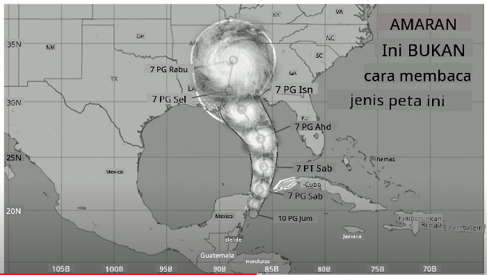
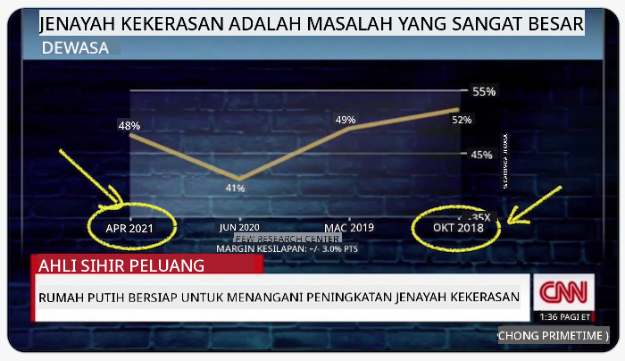
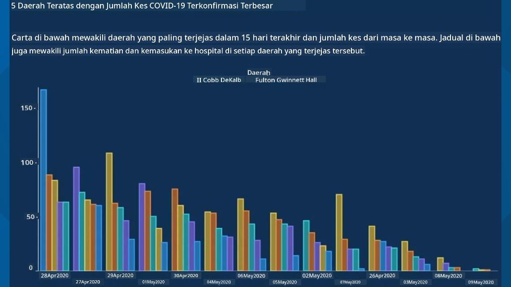
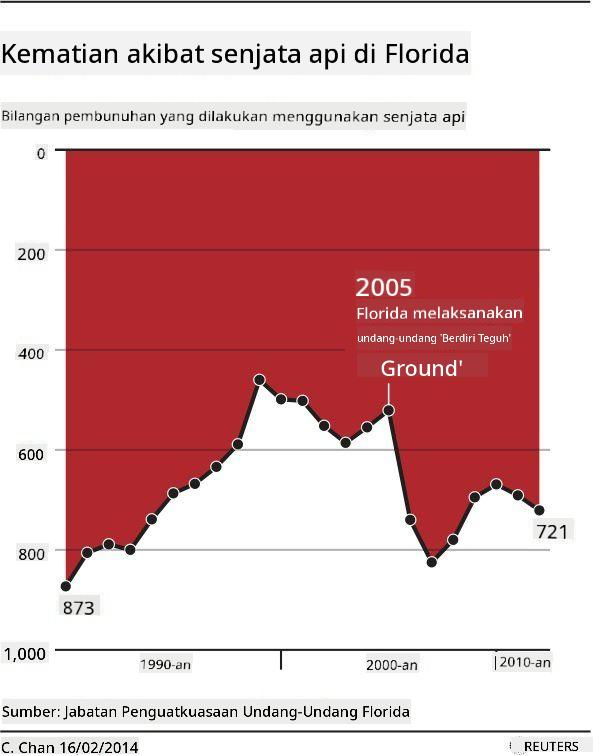
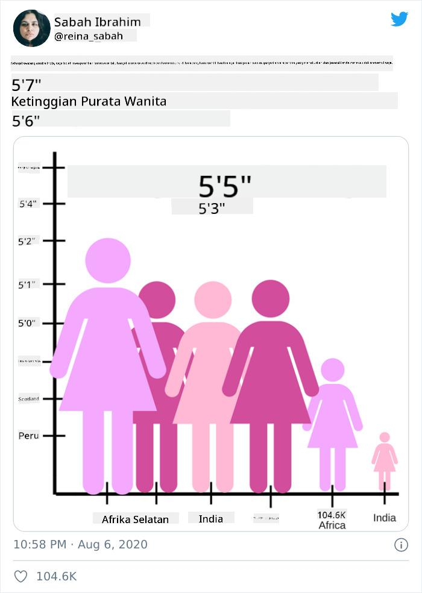
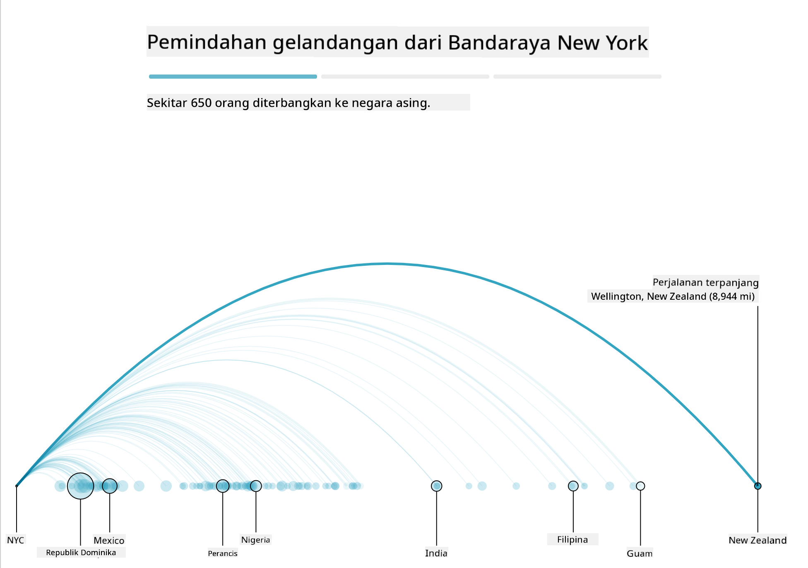
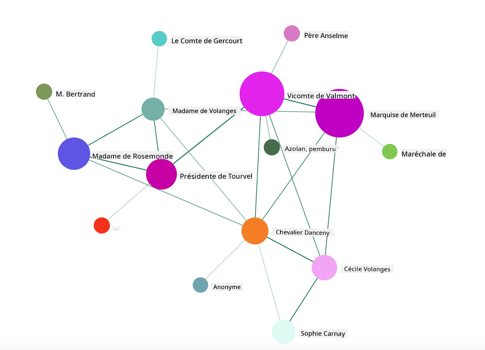

<!--
CO_OP_TRANSLATOR_METADATA:
{
  "original_hash": "4ec4747a9f4f7d194248ea29903ae165",
  "translation_date": "2025-08-28T18:44:13+00:00",
  "source_file": "3-Data-Visualization/13-meaningful-visualizations/README.md",
  "language_code": "ms"
}
-->
# Membuat Visualisasi yang Bermakna

| ](../../sketchnotes/13-MeaningfulViz.png)|
|:---:|
| Visualisasi Bermakna - _Sketchnote oleh [@nitya](https://twitter.com/nitya)_ |

> "Jika anda menyeksa data cukup lama, ia akan mengaku apa sahaja" -- [Ronald Coase](https://en.wikiquote.org/wiki/Ronald_Coase)

Salah satu kemahiran asas seorang saintis data adalah keupayaan untuk mencipta visualisasi data yang bermakna yang membantu menjawab soalan yang mungkin anda ada. Sebelum memvisualisasikan data anda, anda perlu memastikan bahawa ia telah dibersihkan dan disediakan, seperti yang telah anda lakukan dalam pelajaran sebelumnya. Selepas itu, anda boleh mula memutuskan cara terbaik untuk membentangkan data tersebut.

Dalam pelajaran ini, anda akan mengkaji:

1. Cara memilih jenis carta yang sesuai
2. Cara mengelakkan carta yang mengelirukan
3. Cara bekerja dengan warna
4. Cara menggayakan carta anda untuk kebolehbacaan
5. Cara membina penyelesaian carta animasi atau 3D
6. Cara membina visualisasi yang kreatif

## [Kuiz Pra-Kuliah](https://purple-hill-04aebfb03.1.azurestaticapps.net/quiz/24)

## Pilih jenis carta yang sesuai

Dalam pelajaran sebelumnya, anda telah bereksperimen dengan membina pelbagai jenis visualisasi data yang menarik menggunakan Matplotlib dan Seaborn untuk carta. Secara umum, anda boleh memilih [jenis carta yang sesuai](https://chartio.com/learn/charts/how-to-select-a-data-vizualization/) untuk soalan yang anda tanyakan menggunakan jadual ini:

| Anda perlu:                | Anda patut gunakan:             |
| -------------------------- | ------------------------------- |
| Menunjukkan trend data dari masa ke masa | Garis                          |
| Membandingkan kategori      | Bar, Pai                       |
| Membandingkan jumlah        | Pai, Bar Bertindan             |
| Menunjukkan hubungan        | Serakan, Garis, Facet, Garis Berganda |
| Menunjukkan taburan         | Serakan, Histogram, Kotak      |
| Menunjukkan perkadaran      | Pai, Donut, Wafel              |

> ✅ Bergantung pada komposisi data anda, anda mungkin perlu menukarnya daripada teks kepada angka untuk menyokong jenis carta tertentu.

## Elakkan penipuan

Walaupun seorang saintis data berhati-hati memilih carta yang sesuai untuk data yang betul, terdapat banyak cara data boleh dipaparkan untuk membuktikan sesuatu, sering kali dengan mengorbankan integriti data itu sendiri. Terdapat banyak contoh carta dan infografik yang mengelirukan!

[](https://www.youtube.com/watch?v=oX74Nge8Wkw "Bagaimana carta menipu")

> 🎥 Klik imej di atas untuk ceramah persidangan tentang carta yang mengelirukan

Carta ini membalikkan paksi X untuk menunjukkan kebalikan daripada kebenaran, berdasarkan tarikh:



[Carta ini](https://media.firstcoastnews.com/assets/WTLV/images/170ae16f-4643-438f-b689-50d66ca6a8d8/170ae16f-4643-438f-b689-50d66ca6a8d8_1140x641.jpg) lebih mengelirukan, kerana mata tertarik ke kanan untuk menyimpulkan bahawa, dari masa ke masa, kes COVID telah menurun di pelbagai daerah. Sebenarnya, jika anda melihat dengan teliti pada tarikh, anda akan mendapati bahawa ia telah disusun semula untuk memberikan trend menurun yang mengelirukan.



Contoh terkenal ini menggunakan warna DAN paksi Y yang terbalik untuk menipu: bukannya menyimpulkan bahawa kematian akibat senjata meningkat selepas penggubalan undang-undang mesra senjata, mata sebenarnya tertipu untuk berfikir sebaliknya:



Carta pelik ini menunjukkan bagaimana perkadaran boleh dimanipulasi, dengan kesan yang lucu:



Membandingkan perkara yang tidak boleh dibandingkan adalah satu lagi helah yang tidak jujur. Terdapat [laman web yang hebat](https://tylervigen.com/spurious-correlations) tentang 'hubungan palsu' yang memaparkan 'fakta' yang mengaitkan perkara seperti kadar perceraian di Maine dan penggunaan marjerin. Kumpulan Reddit juga mengumpulkan [penggunaan data yang buruk](https://www.reddit.com/r/dataisugly/top/?t=all).

Adalah penting untuk memahami betapa mudahnya mata boleh tertipu oleh carta yang mengelirukan. Walaupun niat saintis data adalah baik, pemilihan jenis carta yang salah, seperti carta pai yang menunjukkan terlalu banyak kategori, boleh mengelirukan.

## Warna

Anda telah melihat dalam carta 'keganasan senjata Florida' di atas bagaimana warna boleh memberikan lapisan makna tambahan kepada carta, terutamanya yang tidak direka menggunakan perpustakaan seperti Matplotlib dan Seaborn yang dilengkapi dengan pelbagai perpustakaan warna dan palet yang telah disahkan. Jika anda membuat carta secara manual, lakukan sedikit kajian tentang [teori warna](https://colormatters.com/color-and-design/basic-color-theory).

> ✅ Sedarilah, semasa mereka bentuk carta, bahawa kebolehcapaian adalah aspek penting dalam visualisasi. Sesetengah pengguna anda mungkin buta warna - adakah carta anda dipaparkan dengan baik untuk pengguna dengan masalah penglihatan?

Berhati-hati semasa memilih warna untuk carta anda, kerana warna boleh menyampaikan makna yang mungkin tidak anda maksudkan. 'Wanita merah jambu' dalam carta 'ketinggian' di atas menyampaikan makna 'feminin' yang jelas yang menambah keanehan carta itu sendiri.

Walaupun [makna warna](https://colormatters.com/color-symbolism/the-meanings-of-colors) mungkin berbeza di bahagian dunia yang berlainan, dan cenderung berubah mengikut bayangannya. Secara umum, makna warna termasuk:

| Warna  | Makna               |
| ------ | ------------------- |
| merah  | kuasa               |
| biru   | kepercayaan, kesetiaan |
| kuning | kebahagiaan, amaran |
| hijau  | ekologi, nasib, cemburu |
| ungu   | kebahagiaan         |
| jingga | keceriaan           |

Jika anda ditugaskan untuk membina carta dengan warna tersuai, pastikan carta anda boleh diakses dan warna yang anda pilih selaras dengan makna yang anda cuba sampaikan.

## Menggayakan carta anda untuk kebolehbacaan

Carta tidak bermakna jika ia tidak boleh dibaca! Luangkan masa untuk mempertimbangkan gaya lebar dan tinggi carta anda supaya ia berskala dengan baik dengan data anda. Jika satu pemboleh ubah (seperti semua 50 negeri) perlu dipaparkan, tunjukkan secara menegak pada paksi Y jika boleh untuk mengelakkan carta yang perlu ditatal secara mendatar.

Labelkan paksi anda, sediakan legenda jika perlu, dan tawarkan tooltip untuk pemahaman data yang lebih baik.

Jika data anda berbentuk teks dan panjang pada paksi X, anda boleh memiringkan teks untuk kebolehbacaan yang lebih baik. [Matplotlib](https://matplotlib.org/stable/tutorials/toolkits/mplot3d.html) menawarkan pemplotan 3D, jika data anda menyokongnya. Visualisasi data yang canggih boleh dihasilkan menggunakan `mpl_toolkits.mplot3d`.


## Paparan carta animasi dan 3D

Beberapa visualisasi data terbaik hari ini adalah animasi. Shirley Wu mempunyai visualisasi yang menakjubkan menggunakan D3, seperti '[film flowers](http://bl.ocks.org/sxywu/raw/d612c6c653fb8b4d7ff3d422be164a5d/)', di mana setiap bunga adalah visualisasi sebuah filem. Contoh lain untuk Guardian ialah 'bussed out', pengalaman interaktif yang menggabungkan visualisasi dengan Greensock dan D3 serta format artikel scrollytelling untuk menunjukkan bagaimana NYC menangani masalah gelandangan dengan menghantar orang keluar dari bandar.



> "Bussed Out: How America Moves its Homeless" daripada [the Guardian](https://www.theguardian.com/us-news/ng-interactive/2017/dec/20/bussed-out-america-moves-homeless-people-country-study). Visualisasi oleh Nadieh Bremer & Shirley Wu

Walaupun pelajaran ini tidak mencukupi untuk mengajar perpustakaan visualisasi yang berkuasa ini secara mendalam, cuba gunakan D3 dalam aplikasi Vue.js menggunakan perpustakaan untuk memaparkan visualisasi buku "Dangerous Liaisons" sebagai rangkaian sosial animasi.

> "Les Liaisons Dangereuses" ialah novel epistolari, atau novel yang disampaikan sebagai siri surat. Ditulis pada tahun 1782 oleh Choderlos de Laclos, ia menceritakan kisah manuver sosial yang kejam dan tidak bermoral oleh dua protagonis yang bersaing dalam kalangan bangsawan Perancis pada akhir abad ke-18, Vicomte de Valmont dan Marquise de Merteuil. Kedua-duanya menemui kehancuran mereka pada akhirnya tetapi tidak tanpa menyebabkan kerosakan sosial yang besar. Novel ini berkembang sebagai siri surat yang ditulis kepada pelbagai orang dalam lingkaran mereka, merancang untuk membalas dendam atau sekadar membuat masalah. Cipta visualisasi surat-surat ini untuk mengenal pasti 'kingpin' utama dalam naratif, secara visual.

Anda akan melengkapkan aplikasi web yang akan memaparkan pandangan animasi rangkaian sosial ini. Ia menggunakan perpustakaan yang dibina untuk mencipta [visual rangkaian](https://github.com/emiliorizzo/vue-d3-network) menggunakan Vue.js dan D3. Apabila aplikasi berjalan, anda boleh menarik nod di skrin untuk menyusun semula data.



## Projek: Bina carta untuk menunjukkan rangkaian menggunakan D3.js

> Folder pelajaran ini termasuk folder `solution` di mana anda boleh menemui projek yang telah siap, untuk rujukan anda.

1. Ikuti arahan dalam fail README.md di akar folder pemula. Pastikan anda mempunyai NPM dan Node.js berjalan di mesin anda sebelum memasang kebergantungan projek anda.

2. Buka folder `starter/src`. Anda akan menemui folder `assets` di mana anda boleh menemui fail .json dengan semua surat dari novel, bernombor, dengan anotasi 'to' dan 'from'.

3. Lengkapkan kod dalam `components/Nodes.vue` untuk membolehkan visualisasi. Cari kaedah yang dipanggil `createLinks()` dan tambahkan gelung bersarang berikut.

Gelung melalui objek .json untuk menangkap data 'to' dan 'from' untuk surat-surat dan bina objek `links` supaya perpustakaan visualisasi boleh menggunakannya:

```javascript
//loop through letters
      let f = 0;
      let t = 0;
      for (var i = 0; i < letters.length; i++) {
          for (var j = 0; j < characters.length; j++) {
              
            if (characters[j] == letters[i].from) {
              f = j;
            }
            if (characters[j] == letters[i].to) {
              t = j;
            }
        }
        this.links.push({ sid: f, tid: t });
      }
  ```

Jalankan aplikasi anda dari terminal (npm run serve) dan nikmati visualisasi!

## 🚀 Cabaran

Jelajahi internet untuk mencari visualisasi yang mengelirukan. Bagaimana pengarang menipu pengguna, dan adakah ia disengajakan? Cuba betulkan visualisasi untuk menunjukkan bagaimana ia sepatutnya kelihatan.

## [Kuiz Pasca-Kuliah](https://purple-hill-04aebfb03.1.azurestaticapps.net/quiz/25)

## Kajian & Pembelajaran Kendiri

Berikut adalah beberapa artikel untuk dibaca tentang visualisasi data yang mengelirukan:

https://gizmodo.com/how-to-lie-with-data-visualization-1563576606

http://ixd.prattsi.org/2017/12/visual-lies-usability-in-deceptive-data-visualizations/

Lihat visualisasi menarik ini untuk aset dan artifak sejarah:

https://handbook.pubpub.org/

Baca artikel ini tentang bagaimana animasi boleh meningkatkan visualisasi anda:

https://medium.com/@EvanSinar/use-animation-to-supercharge-data-visualization-cd905a882ad4

## Tugasan

[Bina visualisasi tersuai anda sendiri](assignment.md)

---

**Penafian**:  
Dokumen ini telah diterjemahkan menggunakan perkhidmatan terjemahan AI [Co-op Translator](https://github.com/Azure/co-op-translator). Walaupun kami berusaha untuk memastikan ketepatan, sila ambil perhatian bahawa terjemahan automatik mungkin mengandungi kesilapan atau ketidaktepatan. Dokumen asal dalam bahasa asalnya harus dianggap sebagai sumber yang berwibawa. Untuk maklumat yang kritikal, terjemahan manusia profesional adalah disyorkan. Kami tidak bertanggungjawab atas sebarang salah faham atau salah tafsir yang timbul daripada penggunaan terjemahan ini.