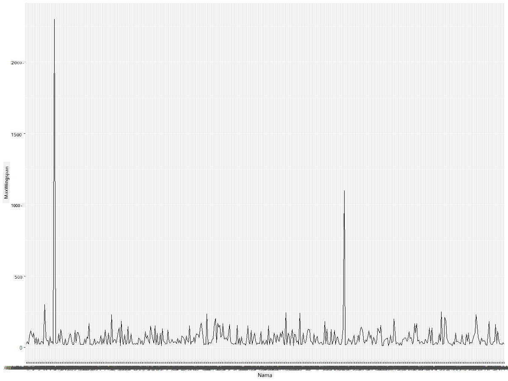
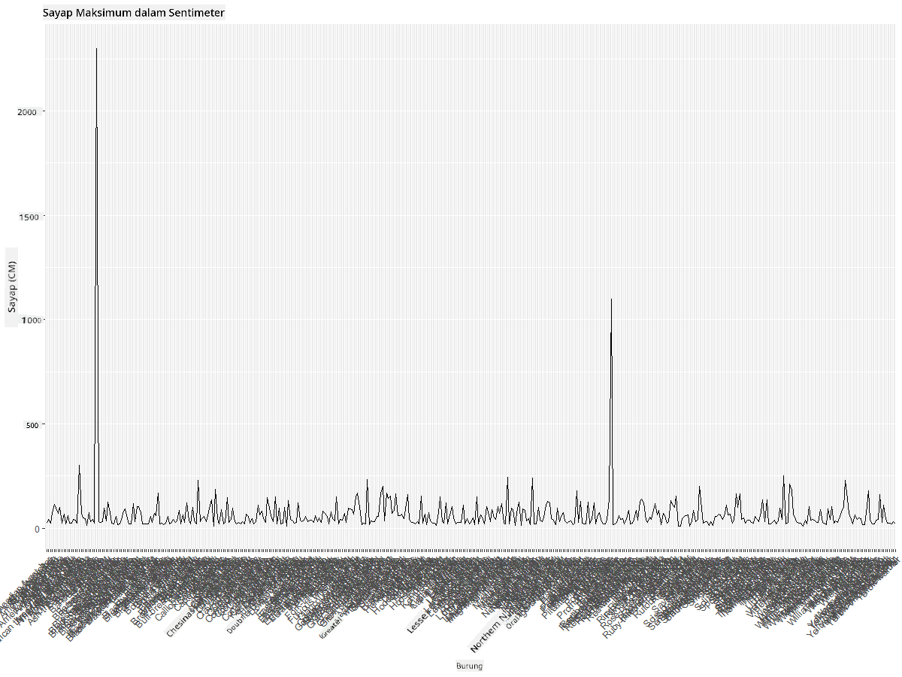
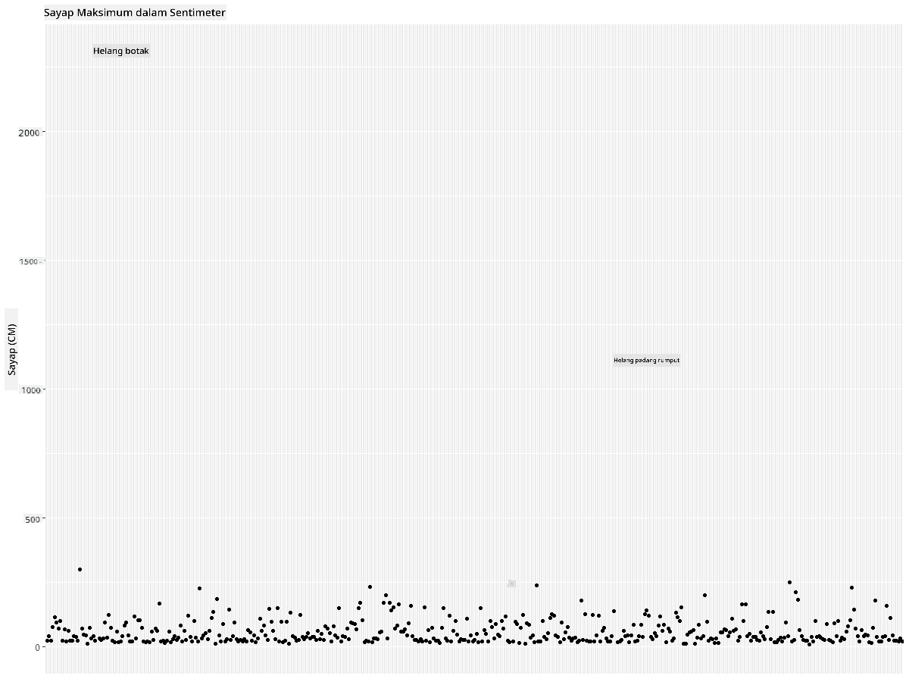
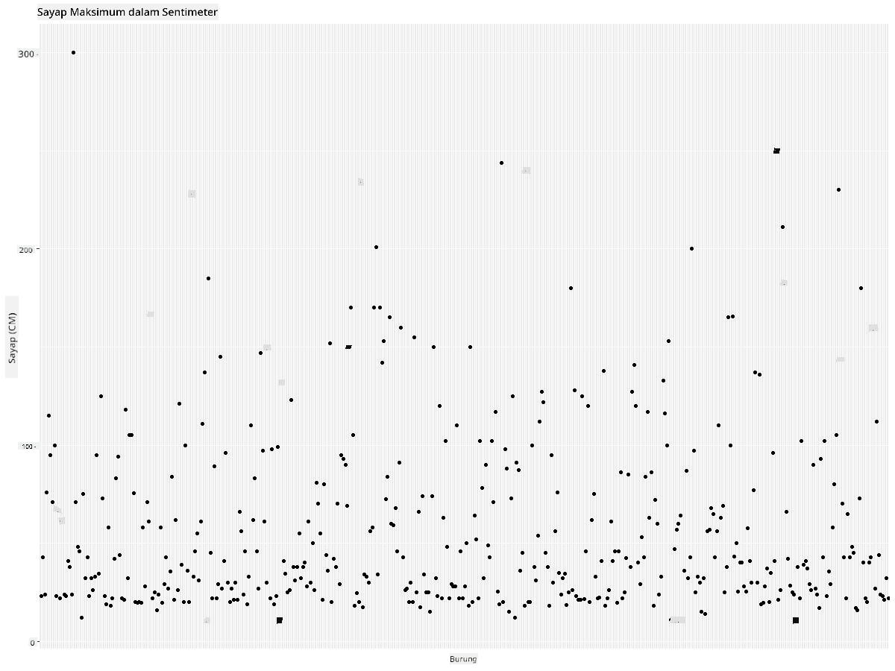
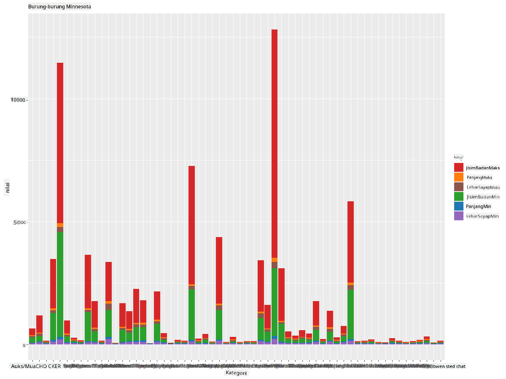
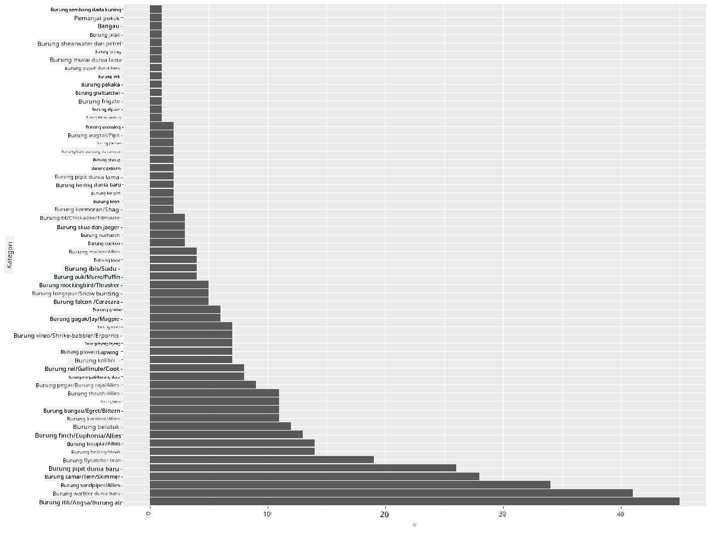
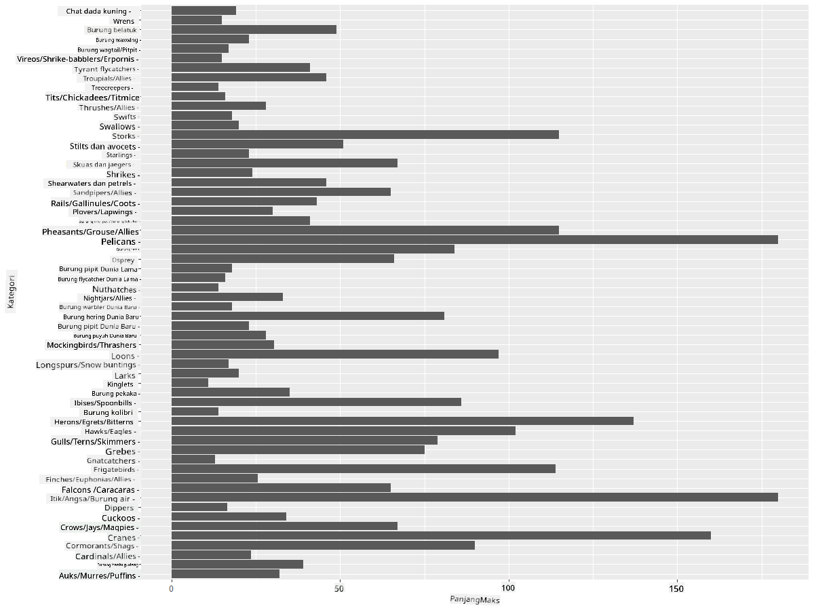
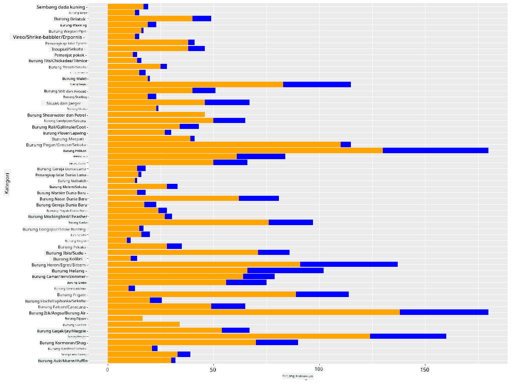

<!--
CO_OP_TRANSLATOR_METADATA:
{
  "original_hash": "22acf28f518a4769ea14fa42f4734b9f",
  "translation_date": "2025-08-28T18:31:55+00:00",
  "source_file": "3-Data-Visualization/R/09-visualization-quantities/README.md",
  "language_code": "ms"
}
-->
# Memvisualkan Kuantiti
| ](https://github.com/microsoft/Data-Science-For-Beginners/blob/main/sketchnotes/09-Visualizing-Quantities.png)|
|:---:|
| Memvisualkan Kuantiti - _Sketchnote oleh [@nitya](https://twitter.com/nitya)_ |

Dalam pelajaran ini, anda akan meneroka cara menggunakan beberapa perpustakaan pakej R yang tersedia untuk belajar mencipta visualisasi menarik berdasarkan konsep kuantiti. Dengan menggunakan set data yang telah dibersihkan tentang burung di Minnesota, anda boleh mempelajari banyak fakta menarik tentang hidupan liar tempatan.  
## [Kuiz pra-kuliah](https://purple-hill-04aebfb03.1.azurestaticapps.net/quiz/16)

## Perhatikan rentang sayap dengan ggplot2
Satu perpustakaan yang sangat baik untuk mencipta plot dan carta yang mudah dan canggih adalah [ggplot2](https://cran.r-project.org/web/packages/ggplot2/index.html). Secara umum, proses memplot data menggunakan perpustakaan ini melibatkan mengenal pasti bahagian dalam dataframe yang ingin anda sasarkan, melakukan sebarang transformasi data yang diperlukan, menetapkan nilai paksi x dan y, memilih jenis plot yang ingin ditunjukkan, dan kemudian memaparkan plot tersebut.

`ggplot2` adalah sistem untuk mencipta grafik secara deklaratif, berdasarkan The Grammar of Graphics. [Grammar of Graphics](https://en.wikipedia.org/wiki/Ggplot2) adalah skema umum untuk visualisasi data yang memecahkan grafik kepada komponen semantik seperti skala dan lapisan. Dalam erti kata lain, kemudahan mencipta plot dan grafik untuk data univariat atau multivariat dengan sedikit kod menjadikan `ggplot2` pakej paling popular untuk visualisasi dalam R. Pengguna memberitahu `ggplot2` bagaimana memetakan pemboleh ubah kepada estetika, primitif grafik yang digunakan, dan `ggplot2` akan menguruskan selebihnya.

> ✅ Plot = Data + Estetika + Geometri  
> - Data merujuk kepada set data  
> - Estetika menunjukkan pemboleh ubah yang dikaji (pemboleh ubah x dan y)  
> - Geometri merujuk kepada jenis plot (plot garis, plot bar, dll.)  

Pilih geometri terbaik (jenis plot) mengikut data anda dan cerita yang ingin anda sampaikan melalui plot.  

> - Untuk menganalisis trend: garis, lajur  
> - Untuk membandingkan nilai: bar, lajur, pai, scatterplot  
> - Untuk menunjukkan bagaimana bahagian berkaitan dengan keseluruhan: pai  
> - Untuk menunjukkan taburan data: scatterplot, bar  
> - Untuk menunjukkan hubungan antara nilai: garis, scatterplot, bubble  

✅ Anda juga boleh melihat [cheatsheet](https://nyu-cdsc.github.io/learningr/assets/data-visualization-2.1.pdf) deskriptif ini untuk ggplot2.

## Bina plot garis tentang nilai rentang sayap burung

Buka konsol R dan import set data.  
> Nota: Set data disimpan di root repo ini dalam folder `/data`.

Mari kita import set data dan perhatikan kepala (5 baris teratas) data.

```r
birds <- read.csv("../../data/birds.csv",fileEncoding="UTF-8-BOM")
head(birds)
```
Kepala data mengandungi campuran teks dan nombor:

|      | Nama                         | NamaSaintifik          | Kategori              | Order        | Famili   | Genus       | StatusKonservasi    | PanjangMin | PanjangMax | BeratBadanMin | BeratBadanMax | RentangSayapMin | RentangSayapMax |
| ---: | :--------------------------- | :--------------------- | :-------------------- | :----------- | :------- | :---------- | :----------------- | ----------: | ----------: | -------------: | -------------: | ---------------: | ---------------: |
|    0 | Itik bersiul perut hitam     | Dendrocygna autumnalis | Itik/Angsa/BurungAir  | Anseriformes | Anatidae | Dendrocygna | LC                 |        47   |        56   |         652    |        1020    |          76      |          94      |
|    1 | Itik bersiul fulvous         | Dendrocygna bicolor    | Itik/Angsa/BurungAir  | Anseriformes | Anatidae | Dendrocygna | LC                 |        45   |        53   |         712    |        1050    |          85      |          93      |
|    2 | Angsa salji                  | Anser caerulescens     | Itik/Angsa/BurungAir  | Anseriformes | Anatidae | Anser       | LC                 |        64   |        79   |        2050    |        4050    |         135      |         165      |
|    3 | Angsa Ross                   | Anser rossii           | Itik/Angsa/BurungAir  | Anseriformes | Anatidae | Anser       | LC                 |      57.3   |        64   |        1066    |        1567    |         113      |         116      |
|    4 | Angsa putih besar            | Anser albifrons        | Itik/Angsa/BurungAir  | Anseriformes | Anatidae | Anser       | LC                 |        64   |        81   |        1930    |        3310    |         130      |         165      |

Mari kita mula memplot beberapa data numerik menggunakan plot garis asas. Katakan anda ingin melihat rentang sayap maksimum untuk burung-burung menarik ini.

```r
install.packages("ggplot2")
library("ggplot2")
ggplot(data=birds, aes(x=Name, y=MaxWingspan,group=1)) +
  geom_line() 
```
Di sini, anda memasang pakej `ggplot2` dan kemudian mengimportnya ke dalam workspace menggunakan arahan `library("ggplot2")`. Untuk memplot sebarang plot dalam ggplot, fungsi `ggplot()` digunakan dan anda menentukan set data, pemboleh ubah x dan y sebagai atribut. Dalam kes ini, kita menggunakan fungsi `geom_line()` kerana kita ingin memplot plot garis.



Apa yang anda perhatikan dengan segera? Nampaknya terdapat sekurang-kurangnya satu outlier - itu rentang sayap yang sangat besar! Rentang sayap lebih dari 2000 sentimeter bersamaan lebih dari 20 meter - adakah terdapat Pterodaktil berkeliaran di Minnesota? Mari kita siasat.

Walaupun anda boleh melakukan pengisihan cepat dalam Excel untuk mencari outlier tersebut, yang mungkin adalah kesalahan taip, teruskan proses visualisasi dengan bekerja dari dalam plot.

Tambahkan label pada paksi x untuk menunjukkan jenis burung yang dimaksudkan:

```r
ggplot(data=birds, aes(x=Name, y=MaxWingspan,group=1)) +
  geom_line() +
  theme(axis.text.x = element_text(angle = 45, hjust=1))+
  xlab("Birds") +
  ylab("Wingspan (CM)") +
  ggtitle("Max Wingspan in Centimeters")
```
Kita menentukan sudut dalam `theme` dan menentukan label paksi x dan y dalam `xlab()` dan `ylab()` masing-masing. `ggtitle()` memberikan nama kepada graf/plot.



Walaupun dengan putaran label ditetapkan kepada 45 darjah, masih terlalu banyak untuk dibaca. Mari cuba strategi lain: label hanya outlier tersebut dan tetapkan label dalam carta. Anda boleh menggunakan carta scatter untuk memberikan lebih ruang kepada pelabelan:

```r
ggplot(data=birds, aes(x=Name, y=MaxWingspan,group=1)) +
  geom_point() +
  geom_text(aes(label=ifelse(MaxWingspan>500,as.character(Name),'')),hjust=0,vjust=0) + 
  theme(axis.title.x=element_blank(), axis.text.x=element_blank(), axis.ticks.x=element_blank())
  ylab("Wingspan (CM)") +
  ggtitle("Max Wingspan in Centimeters") + 
```
Apa yang berlaku di sini? Anda menggunakan fungsi `geom_point()` untuk memplot titik scatter. Dengan ini, anda menambahkan label untuk burung yang mempunyai `MaxWingspan > 500` dan juga menyembunyikan label pada paksi x untuk mengurangkan kekusutan pada plot. 

Apa yang anda temui?



## Tapis data anda

Kedua-dua Bald Eagle dan Prairie Falcon, walaupun mungkin burung yang sangat besar, nampaknya salah dilabel, dengan tambahan 0 pada rentang sayap maksimum mereka. Tidak mungkin anda akan bertemu Bald Eagle dengan rentang sayap 25 meter, tetapi jika ya, sila maklumkan kepada kami! Mari kita cipta dataframe baru tanpa dua outlier tersebut:

```r
birds_filtered <- subset(birds, MaxWingspan < 500)

ggplot(data=birds_filtered, aes(x=Name, y=MaxWingspan,group=1)) +
  geom_point() +
  ylab("Wingspan (CM)") +
  xlab("Birds") +
  ggtitle("Max Wingspan in Centimeters") + 
  geom_text(aes(label=ifelse(MaxWingspan>500,as.character(Name),'')),hjust=0,vjust=0) +
  theme(axis.text.x=element_blank(), axis.ticks.x=element_blank())
```
Kami mencipta dataframe baru `birds_filtered` dan kemudian memplot scatter plot. Dengan menapis outlier, data anda kini lebih koheren dan mudah difahami.



Sekarang kita mempunyai set data yang lebih bersih sekurang-kurangnya dari segi rentang sayap, mari kita temui lebih banyak tentang burung-burung ini.

Walaupun plot garis dan scatter boleh memaparkan maklumat tentang nilai data dan taburannya, kita ingin memikirkan nilai-nilai yang wujud dalam set data ini. Anda boleh mencipta visualisasi untuk menjawab soalan berikut tentang kuantiti:

> Berapa banyak kategori burung yang ada, dan berapa bilangannya?  
> Berapa banyak burung yang pupus, terancam, jarang, atau biasa?  
> Berapa banyak genus dan order yang terdapat dalam terminologi Linnaeus?  
## Terokai carta bar

Carta bar adalah praktikal apabila anda perlu menunjukkan pengelompokan data. Mari kita terokai kategori burung yang wujud dalam set data ini untuk melihat mana yang paling biasa berdasarkan bilangan.  
Mari kita cipta carta bar pada data yang telah ditapis.

```r
install.packages("dplyr")
install.packages("tidyverse")

library(lubridate)
library(scales)
library(dplyr)
library(ggplot2)
library(tidyverse)

birds_filtered %>% group_by(Category) %>%
  summarise(n=n(),
  MinLength = mean(MinLength),
  MaxLength = mean(MaxLength),
  MinBodyMass = mean(MinBodyMass),
  MaxBodyMass = mean(MaxBodyMass),
  MinWingspan=mean(MinWingspan),
  MaxWingspan=mean(MaxWingspan)) %>% 
  gather("key", "value", - c(Category, n)) %>%
  ggplot(aes(x = Category, y = value, group = key, fill = key)) +
  geom_bar(stat = "identity") +
  scale_fill_manual(values = c("#D62728", "#FF7F0E", "#8C564B","#2CA02C", "#1F77B4", "#9467BD")) +                   
  xlab("Category")+ggtitle("Birds of Minnesota")

```
Dalam snippet berikut, kami memasang pakej [dplyr](https://www.rdocumentation.org/packages/dplyr/versions/0.7.8) dan [lubridate](https://www.rdocumentation.org/packages/lubridate/versions/1.8.0) untuk membantu memanipulasi dan mengelompokkan data bagi memplot carta bar bertindan. Pertama, anda mengelompokkan data berdasarkan `Category` burung dan kemudian meringkaskan lajur `MinLength`, `MaxLength`, `MinBodyMass`, `MaxBodyMass`, `MinWingspan`, `MaxWingspan`. Kemudian, plot carta bar menggunakan pakej `ggplot2` dan tentukan warna untuk kategori yang berbeza serta labelnya.  



Namun, carta bar ini sukar dibaca kerana terdapat terlalu banyak data yang tidak dikelompokkan. Anda perlu memilih hanya data yang ingin anda plot, jadi mari kita lihat panjang burung berdasarkan kategori mereka.

Tapis data anda untuk hanya memasukkan kategori burung.

Memandangkan terdapat banyak kategori, anda boleh memaparkan carta ini secara menegak dan menyesuaikan ketinggiannya untuk memuatkan semua data:

```r
birds_count<-dplyr::count(birds_filtered, Category, sort = TRUE)
birds_count$Category <- factor(birds_count$Category, levels = birds_count$Category)
ggplot(birds_count,aes(Category,n))+geom_bar(stat="identity")+coord_flip()
```
Anda mula-mula mengira nilai unik dalam lajur `Category` dan kemudian menyusunnya ke dalam dataframe baru `birds_count`. Data yang disusun ini kemudian difaktorkan pada tahap yang sama supaya ia diplotkan dalam cara yang disusun. Menggunakan `ggplot2` anda kemudian memplot data dalam carta bar. `coord_flip()` memplot bar mendatar.  



Carta bar ini menunjukkan pandangan yang baik tentang bilangan burung dalam setiap kategori. Sekilas pandang, anda dapat melihat bahawa bilangan burung terbesar di rantau ini adalah dalam kategori Itik/Angsa/BurungAir. Minnesota adalah 'tanah 10,000 tasik' jadi ini tidak mengejutkan!

✅ Cuba beberapa kiraan lain pada set data ini. Adakah sesuatu yang mengejutkan anda?

## Membandingkan data

Anda boleh mencuba perbandingan data yang dikelompokkan dengan mencipta paksi baru. Cuba perbandingan MaxLength burung, berdasarkan kategorinya:

```r
birds_grouped <- birds_filtered %>%
  group_by(Category) %>%
  summarise(
  MaxLength = max(MaxLength, na.rm = T),
  MinLength = max(MinLength, na.rm = T)
           ) %>%
  arrange(Category)
  
ggplot(birds_grouped,aes(Category,MaxLength))+geom_bar(stat="identity")+coord_flip()
```
Kami mengelompokkan data `birds_filtered` mengikut `Category` dan kemudian memplot graf bar.  



Tiada yang mengejutkan di sini: burung kolibri mempunyai MaxLength paling kecil berbanding Pelikan atau Angsa. Data yang masuk akal secara logik adalah sesuatu yang baik!

Anda boleh mencipta visualisasi carta bar yang lebih menarik dengan meletakkan data secara bertindih. Mari kita tindihkan Panjang Minimum dan Maksimum pada kategori burung tertentu:

```r
ggplot(data=birds_grouped, aes(x=Category)) +
  geom_bar(aes(y=MaxLength), stat="identity", position ="identity",  fill='blue') +
  geom_bar(aes(y=MinLength), stat="identity", position="identity", fill='orange')+
  coord_flip()
```


## 🚀 Cabaran

Set data burung ini menawarkan banyak maklumat tentang pelbagai jenis burung dalam ekosistem tertentu. Cari di internet dan lihat jika anda boleh menemui set data lain yang berkaitan dengan burung. Latih diri anda membina carta dan graf tentang burung-burung ini untuk menemui fakta yang anda tidak sedari.  
## [Kuiz pasca-kuliah](https://purple-hill-04aebfb03.1.azurestaticapps.net/quiz/17)

## Ulasan & Kajian Kendiri

Pelajaran pertama ini telah memberikan anda beberapa maklumat tentang cara menggunakan `ggplot2` untuk memvisualkan kuantiti. Lakukan penyelidikan tentang cara lain untuk bekerja dengan set data untuk visualisasi. Cari dan lihat set data yang boleh anda visualkan menggunakan pakej lain seperti [Lattice](https://stat.ethz.ch/R-manual/R-devel/library/lattice/html/Lattice.html) dan [Plotly](https://github.com/plotly/plotly.R#readme).

## Tugasan
[Lines, Scatters, and Bars](assignment.md)

---

**Penafian**:  
Dokumen ini telah diterjemahkan menggunakan perkhidmatan terjemahan AI [Co-op Translator](https://github.com/Azure/co-op-translator). Walaupun kami berusaha untuk memastikan ketepatan, sila ambil maklum bahawa terjemahan automatik mungkin mengandungi kesilapan atau ketidaktepatan. Dokumen asal dalam bahasa asalnya harus dianggap sebagai sumber yang berwibawa. Untuk maklumat yang kritikal, terjemahan manusia profesional adalah disyorkan. Kami tidak bertanggungjawab atas sebarang salah faham atau salah tafsir yang timbul daripada penggunaan terjemahan ini.