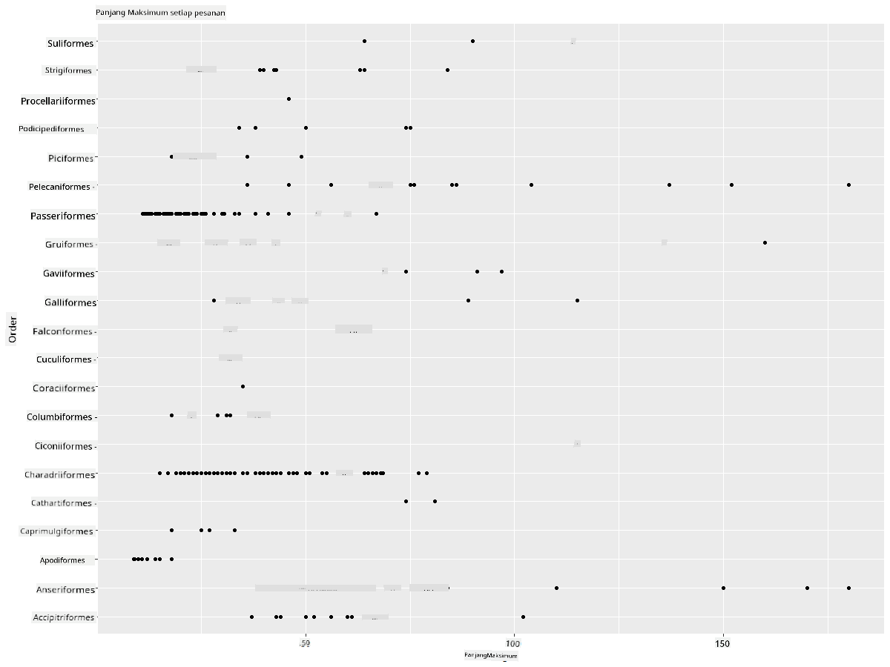
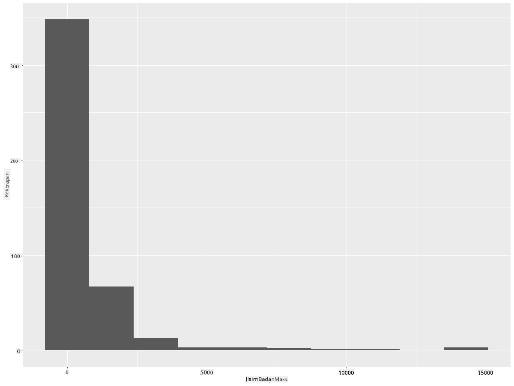
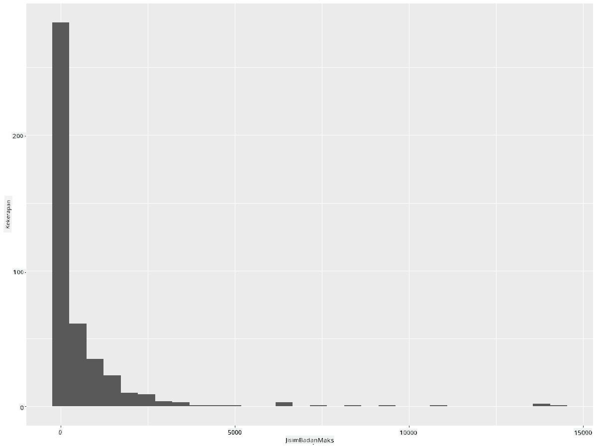
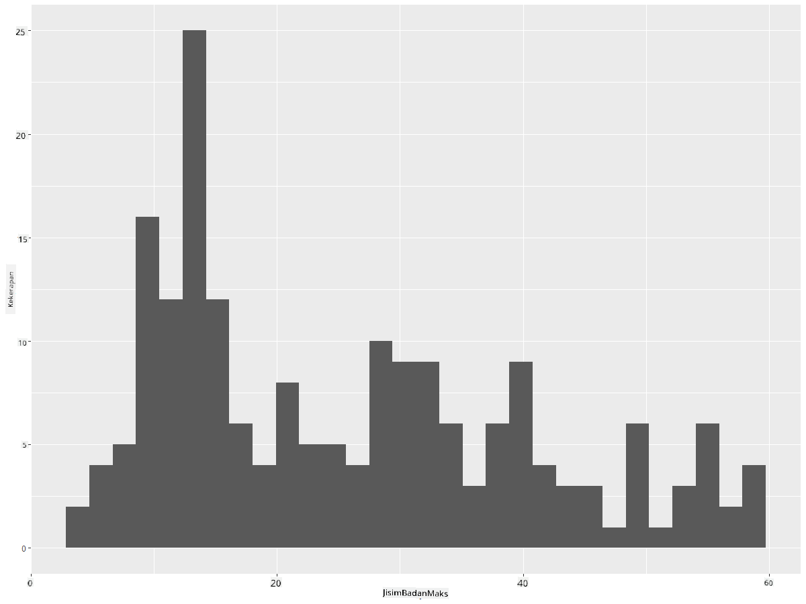
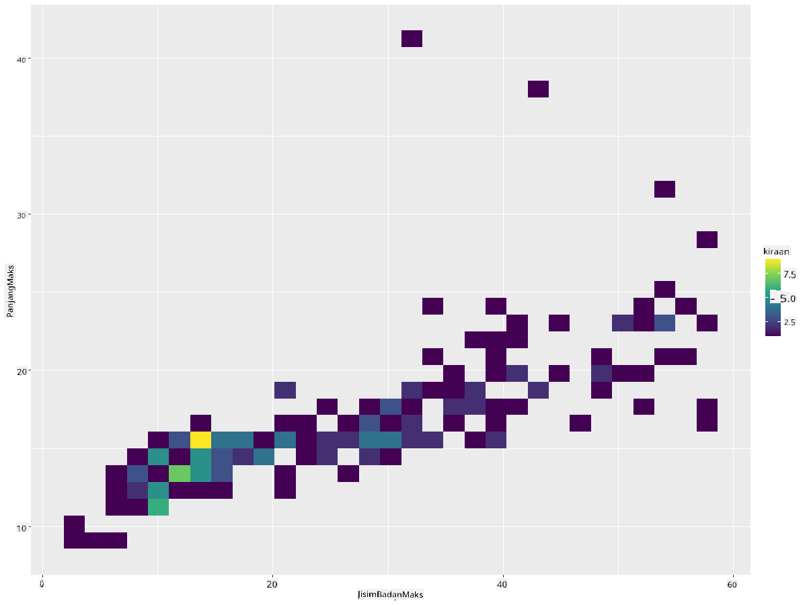
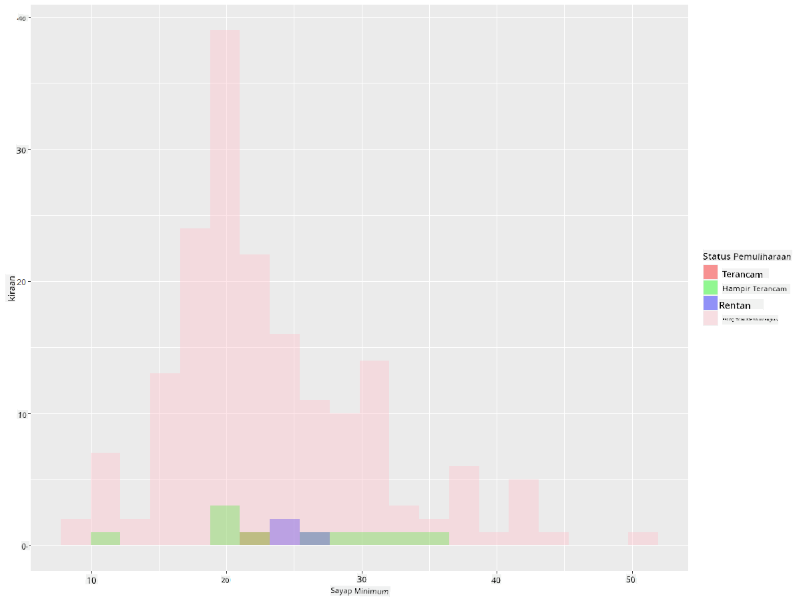
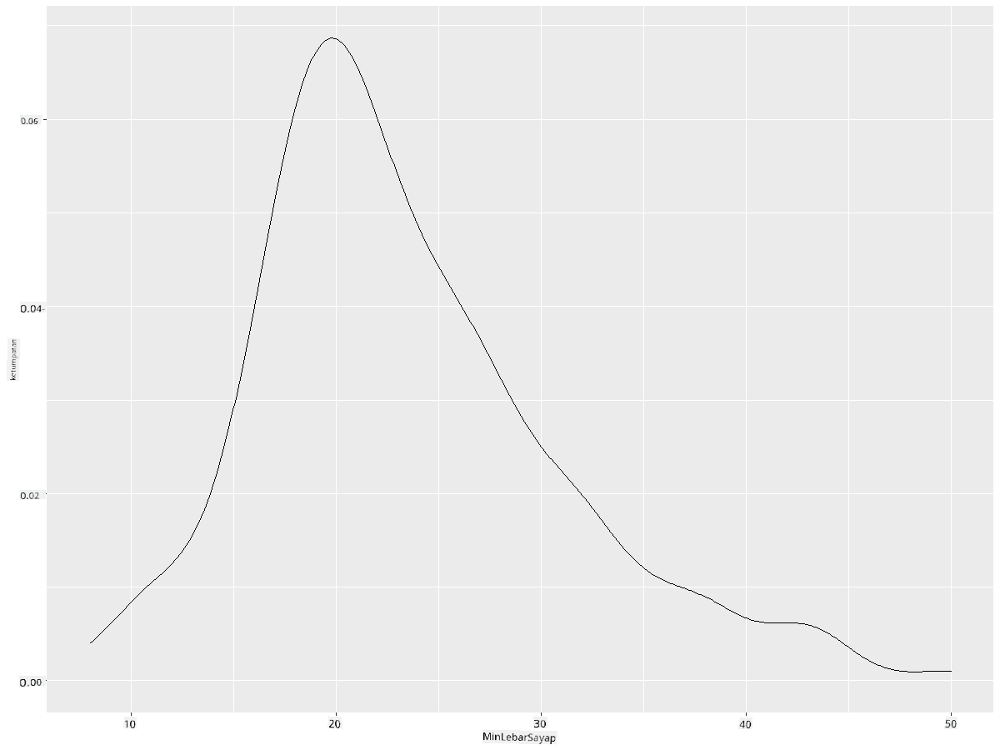
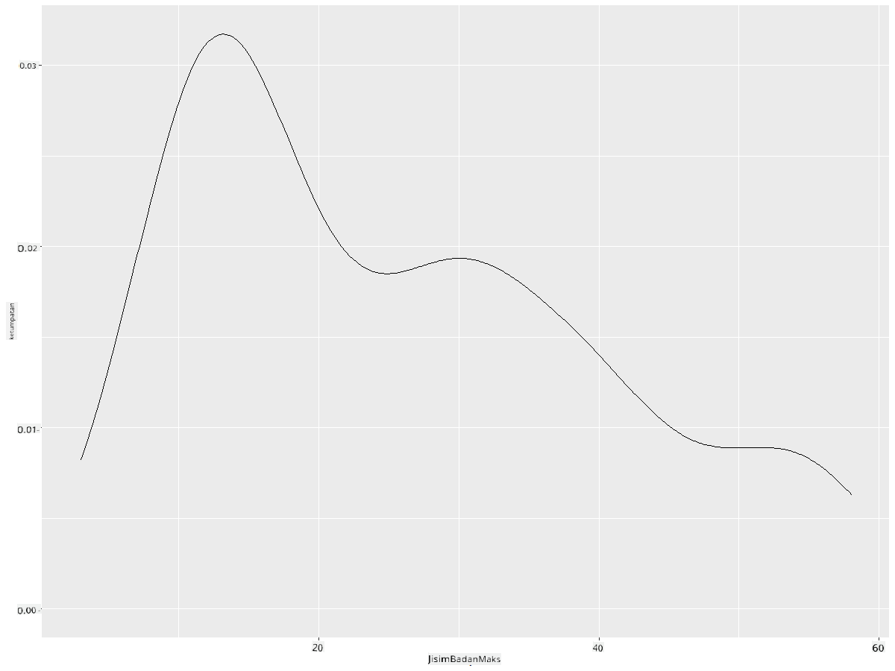
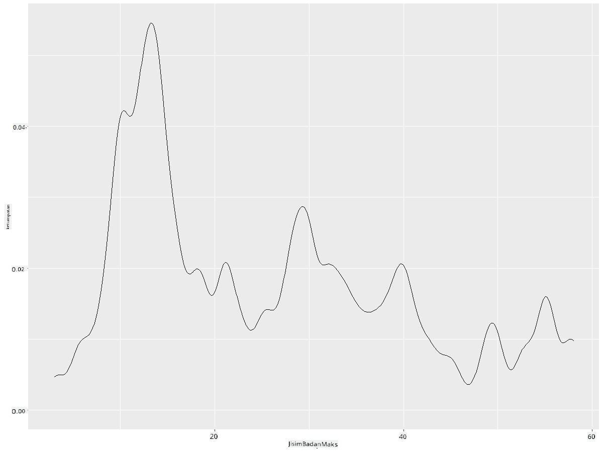
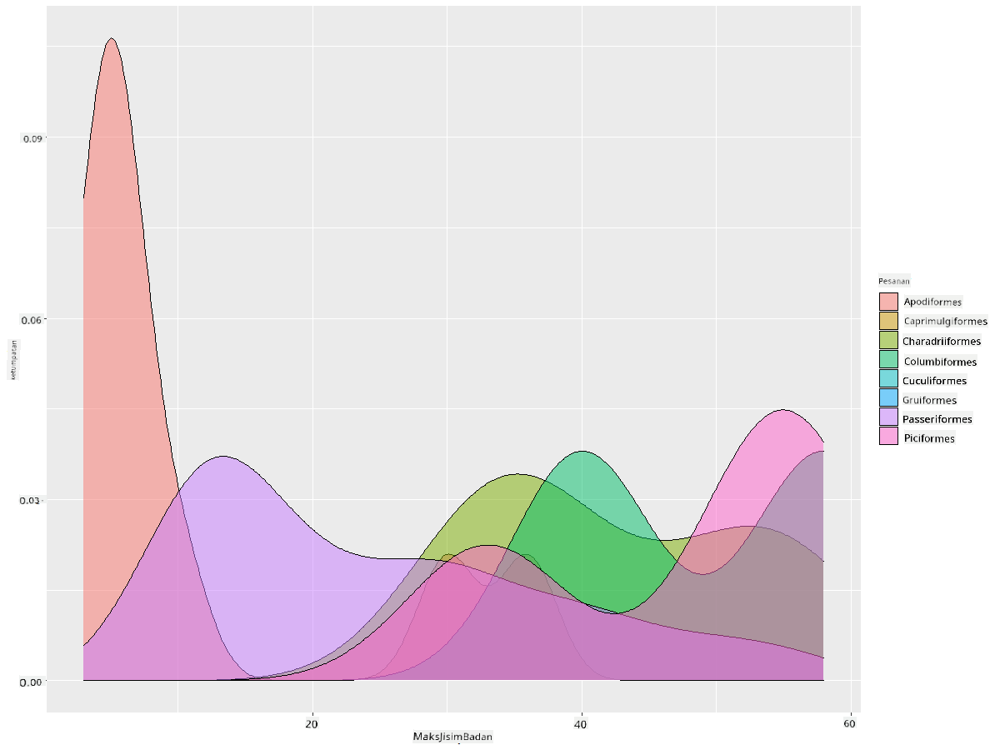

<!--
CO_OP_TRANSLATOR_METADATA:
{
  "original_hash": "ea67c0c40808fd723594de6896c37ccf",
  "translation_date": "2025-08-28T18:36:11+00:00",
  "source_file": "3-Data-Visualization/R/10-visualization-distributions/README.md",
  "language_code": "ms"
}
-->
# Memvisualkan Taburan

| ](https://github.com/microsoft/Data-Science-For-Beginners/blob/main/sketchnotes/10-Visualizing-Distributions.png)|
|:---:|
| Memvisualkan Taburan - _Sketchnote oleh [@nitya](https://twitter.com/nitya)_ |

Dalam pelajaran sebelum ini, anda telah mempelajari beberapa fakta menarik tentang dataset burung di Minnesota. Anda menemui data yang salah dengan memvisualkan nilai luar biasa dan melihat perbezaan antara kategori burung berdasarkan panjang maksimum mereka.

## [Kuiz pra-kuliah](https://purple-hill-04aebfb03.1.azurestaticapps.net/quiz/18)
## Terokai dataset burung

Satu lagi cara untuk menyelidik data adalah dengan melihat taburannya, atau bagaimana data disusun sepanjang satu paksi. Sebagai contoh, mungkin anda ingin mengetahui taburan umum, untuk dataset ini, bagi lebar sayap maksimum atau jisim badan maksimum burung di Minnesota.

Mari kita temui beberapa fakta tentang taburan data dalam dataset ini. Dalam konsol R anda, import `ggplot2` dan pangkalan data. Keluarkan nilai luar biasa dari pangkalan data seperti yang dilakukan dalam topik sebelumnya.

```r
library(ggplot2)

birds <- read.csv("../../data/birds.csv",fileEncoding="UTF-8-BOM")

birds_filtered <- subset(birds, MaxWingspan < 500)
head(birds_filtered)
```
|      | Nama                         | NamaSaintifik          | Kategori              | Order        | Keluarga | Genus       | StatusKonservasi    | PanjangMin | PanjangMax | JisimBadanMin | JisimBadanMax | LebarSayapMin | LebarSayapMax |
| ---: | :--------------------------- | :--------------------- | :-------------------- | :----------- | :------- | :---------- | :----------------- | ----------: | ----------: | -------------: | -------------: | -------------: | -------------: |
|    0 | Itik bersiul perut hitam     | Dendrocygna autumnalis | Itik/Angsa/BurungAir  | Anseriformes | Anatidae | Dendrocygna | LC                 |        47   |        56   |         652    |        1020    |          76    |          94    |
|    1 | Itik bersiul fulvous         | Dendrocygna bicolor    | Itik/Angsa/BurungAir  | Anseriformes | Anatidae | Dendrocygna | LC                 |        45   |        53   |         712    |        1050    |          85    |          93    |
|    2 | Angsa salji                  | Anser caerulescens     | Itik/Angsa/BurungAir  | Anseriformes | Anatidae | Anser       | LC                 |        64   |        79   |        2050    |        4050    |         135    |         165    |
|    3 | Angsa Ross                   | Anser rossii           | Itik/Angsa/BurungAir  | Anseriformes | Anatidae | Anser       | LC                 |      57.3   |        64   |        1066    |        1567    |         113    |         116    |
|    4 | Angsa putih besar            | Anser albifrons        | Itik/Angsa/BurungAir  | Anseriformes | Anatidae | Anser       | LC                 |        64   |        81   |        1930    |        3310    |         130    |         165    |

Secara umum, anda boleh dengan cepat melihat bagaimana data ditaburkan dengan menggunakan plot serakan seperti yang kita lakukan dalam pelajaran sebelumnya:

```r
ggplot(data=birds_filtered, aes(x=Order, y=MaxLength,group=1)) +
  geom_point() +
  ggtitle("Max Length per order") + coord_flip()
```


Ini memberikan gambaran umum tentang taburan panjang badan per Order burung, tetapi ini bukan cara terbaik untuk memaparkan taburan sebenar. Tugas ini biasanya dilakukan dengan mencipta Histogram.
## Bekerja dengan histogram

`ggplot2` menawarkan cara yang sangat baik untuk memvisualkan taburan data menggunakan Histogram. Jenis carta ini seperti carta bar di mana taburan dapat dilihat melalui naik dan turunnya bar. Untuk membina histogram, anda memerlukan data berangka. Untuk membina Histogram, anda boleh memplot carta dengan mendefinisikan jenisnya sebagai 'hist' untuk Histogram. Carta ini menunjukkan taburan JisimBadanMax untuk keseluruhan julat data dataset. Dengan membahagikan array data kepada bin yang lebih kecil, ia dapat memaparkan taburan nilai data:

```r
ggplot(data = birds_filtered, aes(x = MaxBodyMass)) + 
  geom_histogram(bins=10)+ylab('Frequency')
```


Seperti yang anda lihat, kebanyakan daripada 400+ burung dalam dataset ini berada dalam julat di bawah 2000 untuk Jisim Badan Maksimum mereka. Dapatkan lebih banyak wawasan tentang data dengan menukar parameter `bins` kepada nombor yang lebih tinggi, seperti 30:

```r
ggplot(data = birds_filtered, aes(x = MaxBodyMass)) + geom_histogram(bins=30)+ylab('Frequency')
```



Carta ini menunjukkan taburan dengan cara yang lebih terperinci. Carta yang kurang condong ke kiri boleh dibuat dengan memastikan anda hanya memilih data dalam julat tertentu:

Tapis data anda untuk mendapatkan hanya burung yang jisim badannya di bawah 60, dan tunjukkan 30 `bins`:

```r
birds_filtered_1 <- subset(birds_filtered, MaxBodyMass > 1 & MaxBodyMass < 60)
ggplot(data = birds_filtered_1, aes(x = MaxBodyMass)) + 
  geom_histogram(bins=30)+ylab('Frequency')
```



✅ Cuba beberapa penapis dan titik data lain. Untuk melihat taburan penuh data, keluarkan penapis `['MaxBodyMass']` untuk menunjukkan taburan berlabel.

Histogram menawarkan beberapa peningkatan warna dan pelabelan yang menarik untuk dicuba juga:

Cipta histogram 2D untuk membandingkan hubungan antara dua taburan. Mari bandingkan `MaxBodyMass` vs. `MaxLength`. `ggplot2` menawarkan cara terbina untuk menunjukkan pertemuan menggunakan warna yang lebih terang:

```r
ggplot(data=birds_filtered_1, aes(x=MaxBodyMass, y=MaxLength) ) +
  geom_bin2d() +scale_fill_continuous(type = "viridis")
```
Nampaknya terdapat korelasi yang dijangka antara kedua-dua elemen ini sepanjang paksi yang dijangka, dengan satu titik pertemuan yang sangat kuat:



Histogram berfungsi dengan baik secara lalai untuk data berangka. Bagaimana jika anda perlu melihat taburan mengikut data teks? 
## Terokai dataset untuk taburan menggunakan data teks 

Dataset ini juga merangkumi maklumat yang baik tentang kategori burung dan genus, spesies, serta keluarga mereka, termasuk status konservasi mereka. Mari kita selidiki maklumat konservasi ini. Apakah taburan burung mengikut status konservasi mereka?

> ✅ Dalam dataset, beberapa akronim digunakan untuk menggambarkan status konservasi. Akronim ini berasal dari [Kategori Senarai Merah IUCN](https://www.iucnredlist.org/), sebuah organisasi yang mengkatalogkan status spesies.
> 
> - CR: Kritikal Terancam
> - EN: Terancam
> - EX: Pupus
> - LC: Kurang Prihatin
> - NT: Hampir Terancam
> - VU: Rentan

Ini adalah nilai berasaskan teks jadi anda perlu melakukan transformasi untuk mencipta histogram. Menggunakan dataframe filteredBirds, paparkan status konservasi bersama LebarSayap Minimum mereka. Apa yang anda lihat? 

```r
birds_filtered_1$ConservationStatus[birds_filtered_1$ConservationStatus == 'EX'] <- 'x1' 
birds_filtered_1$ConservationStatus[birds_filtered_1$ConservationStatus == 'CR'] <- 'x2'
birds_filtered_1$ConservationStatus[birds_filtered_1$ConservationStatus == 'EN'] <- 'x3'
birds_filtered_1$ConservationStatus[birds_filtered_1$ConservationStatus == 'NT'] <- 'x4'
birds_filtered_1$ConservationStatus[birds_filtered_1$ConservationStatus == 'VU'] <- 'x5'
birds_filtered_1$ConservationStatus[birds_filtered_1$ConservationStatus == 'LC'] <- 'x6'

ggplot(data=birds_filtered_1, aes(x = MinWingspan, fill = ConservationStatus)) +
  geom_histogram(position = "identity", alpha = 0.4, bins = 20) +
  scale_fill_manual(name="Conservation Status",values=c("red","green","blue","pink"),labels=c("Endangered","Near Threathened","Vulnerable","Least Concern"))
```



Nampaknya tidak ada korelasi yang baik antara lebar sayap minimum dan status konservasi. Uji elemen lain dalam dataset menggunakan kaedah ini. Anda juga boleh mencuba penapis yang berbeza. Adakah anda menemui sebarang korelasi?

## Plot ketumpatan

Anda mungkin perasan bahawa histogram yang kita lihat setakat ini adalah 'bertingkat' dan tidak mengalir dengan lancar dalam lengkungan. Untuk menunjukkan carta ketumpatan yang lebih lancar, anda boleh mencuba plot ketumpatan.

Mari kita bekerja dengan plot ketumpatan sekarang!

```r
ggplot(data = birds_filtered_1, aes(x = MinWingspan)) + 
  geom_density()
```


Anda dapat melihat bagaimana plot ini mencerminkan yang sebelumnya untuk data LebarSayap Minimum; ia hanya sedikit lebih lancar. Jika anda ingin melihat garis JisimBadanMax yang bergerigi dalam carta kedua yang anda bina, anda boleh melicinkannya dengan baik dengan menciptanya semula menggunakan kaedah ini:

```r
ggplot(data = birds_filtered_1, aes(x = MaxBodyMass)) + 
  geom_density()
```


Jika anda mahukan garis yang lancar, tetapi tidak terlalu lancar, edit parameter `adjust`: 

```r
ggplot(data = birds_filtered_1, aes(x = MaxBodyMass)) + 
  geom_density(adjust = 1/5)
```


✅ Baca tentang parameter yang tersedia untuk jenis plot ini dan bereksperimen!

Jenis carta ini menawarkan visualisasi yang sangat jelas. Dengan beberapa baris kod, sebagai contoh, anda boleh menunjukkan ketumpatan jisim badan maksimum per Order burung:

```r
ggplot(data=birds_filtered_1,aes(x = MaxBodyMass, fill = Order)) +
  geom_density(alpha=0.5)
```


## 🚀 Cabaran

Histogram adalah jenis carta yang lebih canggih daripada plot serakan asas, carta bar, atau carta garis. Lakukan carian di internet untuk mencari contoh penggunaan histogram yang baik. Bagaimana ia digunakan, apa yang mereka tunjukkan, dan dalam bidang atau kawasan penyelidikan apa mereka cenderung digunakan?

## [Kuiz pasca-kuliah](https://purple-hill-04aebfb03.1.azurestaticapps.net/quiz/19)

## Ulasan & Kajian Kendiri

Dalam pelajaran ini, anda menggunakan `ggplot2` dan mula bekerja untuk menunjukkan carta yang lebih canggih. Lakukan penyelidikan tentang `geom_density_2d()` iaitu "keluk ketumpatan kebarangkalian berterusan dalam satu atau lebih dimensi". Baca [dokumentasi](https://ggplot2.tidyverse.org/reference/geom_density_2d.html) untuk memahami cara ia berfungsi.

## Tugasan

[Gunakan kemahiran anda](assignment.md)

---

**Penafian**:  
Dokumen ini telah diterjemahkan menggunakan perkhidmatan terjemahan AI [Co-op Translator](https://github.com/Azure/co-op-translator). Walaupun kami berusaha untuk memastikan ketepatan, sila ambil maklum bahawa terjemahan automatik mungkin mengandungi kesilapan atau ketidaktepatan. Dokumen asal dalam bahasa asalnya harus dianggap sebagai sumber yang berwibawa. Untuk maklumat yang kritikal, terjemahan manusia profesional adalah disyorkan. Kami tidak bertanggungjawab atas sebarang salah faham atau salah tafsir yang timbul daripada penggunaan terjemahan ini.