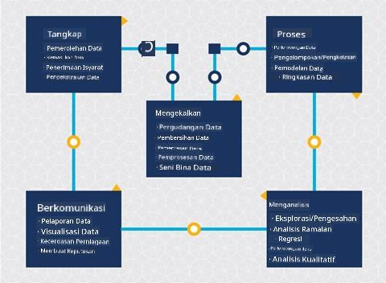
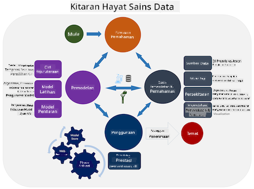
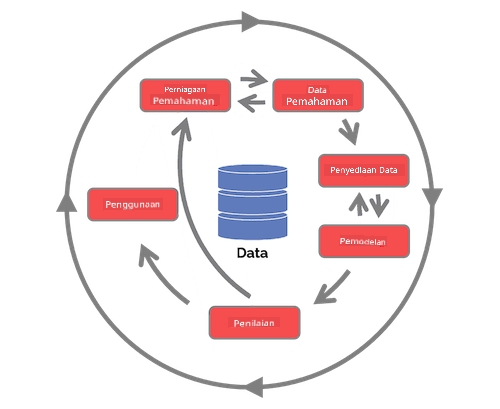

<!--
CO_OP_TRANSLATOR_METADATA:
{
  "original_hash": "c368f8f2506fe56bca0f7be05c4eb71d",
  "translation_date": "2025-08-28T18:23:29+00:00",
  "source_file": "4-Data-Science-Lifecycle/14-Introduction/README.md",
  "language_code": "ms"
}
-->
# Pengenalan kepada Kitaran Hayat Sains Data

| ](../../sketchnotes/14-DataScience-Lifecycle.png)|
|:---:|
| Pengenalan kepada Kitaran Hayat Sains Data - _Sketchnote oleh [@nitya](https://twitter.com/nitya)_ |

## [Kuiz Pra-Kuliah](https://red-water-0103e7a0f.azurestaticapps.net/quiz/26)

Pada tahap ini, anda mungkin telah menyedari bahawa sains data adalah satu proses. Proses ini boleh dibahagikan kepada 5 peringkat:

- Penangkapan
- Pemprosesan
- Analisis
- Komunikasi
- Penyelenggaraan

Pelajaran ini memberi fokus kepada 3 bahagian kitaran hayat: penangkapan, pemprosesan, dan penyelenggaraan.

> Foto oleh [Berkeley School of Information](https://ischoolonline.berkeley.edu/data-science/what-is-data-science/)

## Penangkapan

Peringkat pertama dalam kitaran hayat sangat penting kerana peringkat seterusnya bergantung padanya. Ia secara praktikal adalah dua peringkat yang digabungkan menjadi satu: memperoleh data dan menentukan tujuan serta masalah yang perlu diselesaikan.  
Menentukan matlamat projek memerlukan konteks yang lebih mendalam tentang masalah atau persoalan. Pertama, kita perlu mengenal pasti dan memperoleh pihak yang memerlukan masalah mereka diselesaikan. Ini mungkin melibatkan pihak berkepentingan dalam perniagaan atau penaja projek, yang boleh membantu mengenal pasti siapa atau apa yang akan mendapat manfaat daripada projek ini serta apa dan mengapa mereka memerlukannya. Matlamat yang ditentukan dengan baik harus boleh diukur dan dikuantifikasi untuk menentukan hasil yang boleh diterima.

Soalan yang mungkin ditanya oleh saintis data:
- Adakah masalah ini pernah didekati sebelum ini? Apa yang telah ditemui?
- Adakah tujuan dan matlamat difahami oleh semua pihak yang terlibat?
- Adakah terdapat kekaburan dan bagaimana untuk mengurangkannya?
- Apakah kekangan yang ada?
- Bagaimana rupa hasil akhir yang berpotensi?
- Berapa banyak sumber (masa, tenaga kerja, pengiraan) yang tersedia?

Seterusnya adalah mengenal pasti, mengumpul, dan akhirnya meneroka data yang diperlukan untuk mencapai matlamat yang telah ditentukan ini. Pada langkah pemerolehan ini, saintis data juga mesti menilai kuantiti dan kualiti data. Ini memerlukan sedikit penerokaan data untuk mengesahkan bahawa apa yang telah diperoleh akan menyokong pencapaian hasil yang diinginkan.

Soalan yang mungkin ditanya oleh saintis data tentang data:
- Apakah data yang sudah tersedia kepada saya?
- Siapa pemilik data ini?
- Apakah kebimbangan privasi?
- Adakah saya mempunyai cukup data untuk menyelesaikan masalah ini?
- Adakah kualiti data boleh diterima untuk masalah ini?
- Jika saya menemui maklumat tambahan melalui data ini, patutkah kita mempertimbangkan untuk mengubah atau mentakrifkan semula matlamat?

## Pemprosesan

Peringkat pemprosesan dalam kitaran hayat memberi fokus kepada penemuan corak dalam data serta pemodelan. Beberapa teknik yang digunakan dalam peringkat pemprosesan memerlukan kaedah statistik untuk mengenal pasti corak. Biasanya, ini adalah tugas yang membosankan untuk dilakukan oleh manusia dengan set data yang besar dan akan bergantung kepada komputer untuk mempercepatkan proses. Peringkat ini juga merupakan tempat sains data dan pembelajaran mesin berinteraksi. Seperti yang anda pelajari dalam pelajaran pertama, pembelajaran mesin adalah proses membina model untuk memahami data. Model adalah representasi hubungan antara pemboleh ubah dalam data yang membantu meramalkan hasil.

Teknik biasa yang digunakan dalam peringkat ini dibincangkan dalam kurikulum ML untuk Pemula. Ikuti pautan untuk mengetahui lebih lanjut tentangnya:

- [Klasifikasi](https://github.com/microsoft/ML-For-Beginners/tree/main/4-Classification): Mengatur data ke dalam kategori untuk penggunaan yang lebih efisien.
- [Pengelompokan](https://github.com/microsoft/ML-For-Beginners/tree/main/5-Clustering): Mengelompokkan data ke dalam kumpulan yang serupa.
- [Regresi](https://github.com/microsoft/ML-For-Beginners/tree/main/2-Regression): Menentukan hubungan antara pemboleh ubah untuk meramalkan atau meramal nilai.

## Penyelenggaraan

Dalam rajah kitaran hayat, anda mungkin perasan bahawa penyelenggaraan terletak di antara penangkapan dan pemprosesan. Penyelenggaraan adalah proses berterusan untuk mengurus, menyimpan, dan melindungi data sepanjang proses projek dan harus dipertimbangkan sepanjang keseluruhan projek.

### Penyimpanan Data

Pertimbangan tentang bagaimana dan di mana data disimpan boleh mempengaruhi kos penyimpanan serta prestasi kelajuan akses data. Keputusan seperti ini tidak mungkin dibuat oleh saintis data sahaja tetapi mereka mungkin mendapati diri mereka membuat pilihan tentang bagaimana bekerja dengan data berdasarkan cara ia disimpan.

Berikut adalah beberapa aspek sistem penyimpanan data moden yang boleh mempengaruhi pilihan ini:

**Di premis vs di luar premis vs awan awam atau peribadi**

Di premis merujuk kepada hosting dan pengurusan data pada peralatan anda sendiri, seperti memiliki pelayan dengan cakera keras yang menyimpan data, manakala di luar premis bergantung kepada peralatan yang anda tidak miliki, seperti pusat data. Awan awam adalah pilihan popular untuk menyimpan data yang tidak memerlukan pengetahuan tentang bagaimana atau di mana data disimpan, di mana awam merujuk kepada infrastruktur asas yang disatukan dan dikongsi oleh semua yang menggunakan awan. Sesetengah organisasi mempunyai dasar keselamatan yang ketat yang memerlukan mereka mempunyai akses penuh kepada peralatan di mana data dihoskan dan akan bergantung kepada awan peribadi yang menyediakan perkhidmatan awan sendiri. Anda akan belajar lebih lanjut tentang data di awan dalam [pelajaran seterusnya](https://github.com/microsoft/Data-Science-For-Beginners/tree/main/5-Data-Science-In-Cloud).

**Data sejuk vs data panas**

Apabila melatih model anda, anda mungkin memerlukan lebih banyak data latihan. Jika anda berpuas hati dengan model anda, lebih banyak data akan tiba untuk model berfungsi dengan tujuannya. Dalam mana-mana kes, kos penyimpanan dan akses data akan meningkat apabila anda mengumpul lebih banyak daripadanya. Memisahkan data yang jarang digunakan, dikenali sebagai data sejuk, daripada data yang sering diakses, dikenali sebagai data panas, boleh menjadi pilihan penyimpanan data yang lebih murah melalui perkhidmatan perkakasan atau perisian. Jika data sejuk perlu diakses, ia mungkin mengambil masa sedikit lebih lama untuk diperoleh berbanding data panas.

### Pengurusan Data

Semasa anda bekerja dengan data, anda mungkin mendapati bahawa sebahagian data perlu dibersihkan menggunakan beberapa teknik yang dibincangkan dalam pelajaran yang memberi fokus kepada [penyediaan data](https://github.com/microsoft/Data-Science-For-Beginners/tree/main/2-Working-With-Data/08-data-preparation) untuk membina model yang tepat. Apabila data baharu tiba, ia akan memerlukan aplikasi yang sama untuk mengekalkan konsistensi dalam kualiti. Sesetengah projek akan melibatkan penggunaan alat automatik untuk pembersihan, pengagregatan, dan pemampatan sebelum data dipindahkan ke lokasi akhirnya. Azure Data Factory adalah contoh salah satu alat ini.

### Melindungi Data

Salah satu matlamat utama melindungi data adalah memastikan bahawa mereka yang bekerja dengannya mengawal apa yang dikumpulkan dan dalam konteks apa ia digunakan. Menjaga data tetap selamat melibatkan mengehadkan akses hanya kepada mereka yang memerlukannya, mematuhi undang-undang dan peraturan tempatan, serta mengekalkan standard etika, seperti yang dibincangkan dalam [pelajaran etika](https://github.com/microsoft/Data-Science-For-Beginners/tree/main/1-Introduction/02-ethics).

Berikut adalah beberapa perkara yang mungkin dilakukan oleh pasukan dengan mengambil kira keselamatan:
- Mengesahkan bahawa semua data disulitkan
- Memberikan maklumat kepada pelanggan tentang bagaimana data mereka digunakan
- Menghapuskan akses data daripada mereka yang telah meninggalkan projek
- Membenarkan hanya ahli projek tertentu untuk mengubah data

## 🚀 Cabaran

Terdapat banyak versi Kitaran Hayat Sains Data, di mana setiap langkah mungkin mempunyai nama dan bilangan peringkat yang berbeza tetapi akan mengandungi proses yang sama seperti yang disebutkan dalam pelajaran ini.

Terokai [Kitaran Hayat Proses Sains Data Pasukan](https://docs.microsoft.com/en-us/azure/architecture/data-science-process/lifecycle) dan [Proses standard industri untuk perlombongan data](https://www.datascience-pm.com/crisp-dm-2/). Namakan 3 persamaan dan perbezaan antara kedua-duanya.

|Proses Sains Data Pasukan (TDSP)|Proses standard industri untuk perlombongan data (CRISP-DM)|
|--|--|
| |  |
| Imej oleh [Microsoft](https://docs.microsoft.comazure/architecture/data-science-process/lifecycle) | Imej oleh [Data Science Process Alliance](https://www.datascience-pm.com/crisp-dm-2/) |

## [Kuiz Pasca-Kuliah](https://red-water-0103e7a0f.azurestaticapps.net/quiz/27)

## Ulasan & Kajian Kendiri

Mengaplikasikan Kitaran Hayat Sains Data melibatkan pelbagai peranan dan tugas, di mana sesetengahnya mungkin memberi fokus kepada bahagian tertentu dalam setiap peringkat. Proses Sains Data Pasukan menyediakan beberapa sumber yang menerangkan jenis peranan dan tugas yang mungkin dimiliki seseorang dalam projek.

* [Peranan dan tugas Proses Sains Data Pasukan](https://docs.microsoft.com/en-us/azure/architecture/data-science-process/roles-tasks)
* [Melaksanakan tugas sains data: penerokaan, pemodelan, dan penyebaran](https://docs.microsoft.com/en-us/azure/architecture/data-science-process/execute-data-science-tasks)

## Tugasan

[Menilai Dataset](assignment.md)

---

**Penafian**:  
Dokumen ini telah diterjemahkan menggunakan perkhidmatan terjemahan AI [Co-op Translator](https://github.com/Azure/co-op-translator). Walaupun kami berusaha untuk memastikan ketepatan, sila ambil maklum bahawa terjemahan automatik mungkin mengandungi kesilapan atau ketidaktepatan. Dokumen asal dalam bahasa asalnya harus dianggap sebagai sumber yang berwibawa. Untuk maklumat penting, terjemahan manusia profesional adalah disyorkan. Kami tidak bertanggungjawab atas sebarang salah faham atau salah tafsir yang timbul daripada penggunaan terjemahan ini.