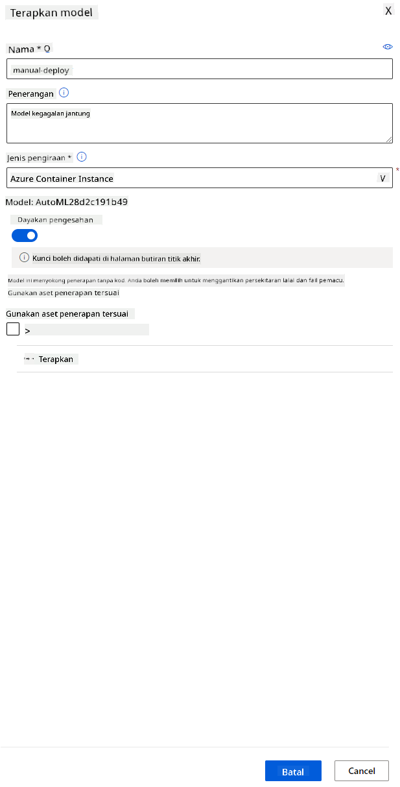

<!--
CO_OP_TRANSLATOR_METADATA:
{
  "original_hash": "14b2a7f1c63202920bd98eeb913f5614",
  "translation_date": "2025-08-28T17:57:00+00:00",
  "source_file": "5-Data-Science-In-Cloud/18-Low-Code/README.md",
  "language_code": "ms"
}
-->
# Sains Data di Awan: Cara "Kod Rendah/Tanpa Kod"

| ](../../sketchnotes/18-DataScience-Cloud.png)|
|:---:|
| Sains Data di Awan: Kod Rendah - _Sketchnote oleh [@nitya](https://twitter.com/nitya)_ |

Kandungan:

- [Sains Data di Awan: Cara "Kod Rendah/Tanpa Kod"](../../../../5-Data-Science-In-Cloud/18-Low-Code)
  - [Kuiz Pra-Kuliah](../../../../5-Data-Science-In-Cloud/18-Low-Code)
  - [1. Pengenalan](../../../../5-Data-Science-In-Cloud/18-Low-Code)
    - [1.1 Apa itu Azure Machine Learning?](../../../../5-Data-Science-In-Cloud/18-Low-Code)
    - [1.2 Projek Ramalan Kegagalan Jantung:](../../../../5-Data-Science-In-Cloud/18-Low-Code)
    - [1.3 Dataset Kegagalan Jantung:](../../../../5-Data-Science-In-Cloud/18-Low-Code)
  - [2. Latihan model Kod Rendah/Tanpa Kod dalam Azure ML Studio](../../../../5-Data-Science-In-Cloud/18-Low-Code)
    - [2.1 Cipta ruang kerja Azure ML](../../../../5-Data-Science-In-Cloud/18-Low-Code)
    - [2.2 Sumber Pengiraan](../../../../5-Data-Science-In-Cloud/18-Low-Code)
      - [2.2.1 Memilih pilihan yang sesuai untuk sumber pengiraan anda](../../../../5-Data-Science-In-Cloud/18-Low-Code)
      - [2.2.2 Mencipta kluster pengiraan](../../../../5-Data-Science-In-Cloud/18-Low-Code)
    - [2.3 Memuatkan Dataset](../../../../5-Data-Science-In-Cloud/18-Low-Code)
    - [2.4 Latihan Kod Rendah/Tanpa Kod dengan AutoML](../../../../5-Data-Science-In-Cloud/18-Low-Code)
  - [3. Penggunaan model Kod Rendah/Tanpa Kod dan penggunaan endpoint](../../../../5-Data-Science-In-Cloud/18-Low-Code)
    - [3.1 Penggunaan model](../../../../5-Data-Science-In-Cloud/18-Low-Code)
    - [3.2 Penggunaan endpoint](../../../../5-Data-Science-In-Cloud/18-Low-Code)
  - [🚀 Cabaran](../../../../5-Data-Science-In-Cloud/18-Low-Code)
  - [Kuiz Pasca-Kuliah](../../../../5-Data-Science-In-Cloud/18-Low-Code)
  - [Ulasan & Kajian Kendiri](../../../../5-Data-Science-In-Cloud/18-Low-Code)
  - [Tugasan](../../../../5-Data-Science-In-Cloud/18-Low-Code)

## [Kuiz Pra-Kuliah](https://purple-hill-04aebfb03.1.azurestaticapps.net/quiz/34)

## 1. Pengenalan

### 1.1 Apa itu Azure Machine Learning?

Platform awan Azure terdiri daripada lebih 200 produk dan perkhidmatan awan yang direka untuk membantu anda mencipta penyelesaian baharu. Saintis data menghabiskan banyak masa meneroka dan memproses data, serta mencuba pelbagai algoritma latihan model untuk menghasilkan model yang tepat. Tugas-tugas ini memakan masa dan sering menggunakan perkakasan pengiraan yang mahal secara tidak efisien.

[Azure ML](https://docs.microsoft.com/azure/machine-learning/overview-what-is-azure-machine-learning?WT.mc_id=academic-77958-bethanycheum&ocid=AID3041109) ialah platform berasaskan awan untuk membina dan mengendalikan penyelesaian pembelajaran mesin di Azure. Ia merangkumi pelbagai ciri dan keupayaan yang membantu saintis data menyediakan data, melatih model, menerbitkan perkhidmatan ramalan, dan memantau penggunaannya. Yang paling penting, ia membantu meningkatkan kecekapan mereka dengan mengautomasi banyak tugas yang memakan masa yang berkaitan dengan latihan model; dan ia membolehkan mereka menggunakan sumber pengiraan berasaskan awan yang boleh diskalakan secara efektif untuk mengendalikan jumlah data yang besar sambil menanggung kos hanya apabila digunakan.

Azure ML menyediakan semua alat yang diperlukan oleh pembangun dan saintis data untuk aliran kerja pembelajaran mesin mereka. Ini termasuk:

- **Azure Machine Learning Studio**: portal web dalam Azure Machine Learning untuk pilihan kod rendah dan tanpa kod untuk latihan model, penggunaan, automasi, penjejakan, dan pengurusan aset. Studio ini berintegrasi dengan Azure Machine Learning SDK untuk pengalaman yang lancar.
- **Jupyter Notebooks**: prototaip dan uji model ML dengan cepat.
- **Azure Machine Learning Designer**: membolehkan seret-dan-lepas modul untuk membina eksperimen dan kemudian menggunakan pipeline dalam persekitaran kod rendah.
- **Antaramuka AutoML**: mengautomasi tugas berulang dalam pembangunan model pembelajaran mesin, membolehkan pembinaan model ML dengan skala, kecekapan, dan produktiviti yang tinggi, sambil mengekalkan kualiti model.
- **Pelabelan Data**: alat ML yang dibantu untuk melabel data secara automatik.
- **Sambungan pembelajaran mesin untuk Visual Studio Code**: menyediakan persekitaran pembangunan penuh untuk membina dan mengurus projek ML.
- **CLI pembelajaran mesin**: menyediakan arahan untuk mengurus sumber Azure ML dari baris arahan.
- **Integrasi dengan rangka kerja sumber terbuka** seperti PyTorch, TensorFlow, Scikit-learn, dan banyak lagi untuk melatih, menggunakan, dan mengurus proses pembelajaran mesin dari hujung ke hujung.
- **MLflow**: perpustakaan sumber terbuka untuk mengurus kitaran hayat eksperimen pembelajaran mesin anda. **MLFlow Tracking** ialah komponen MLflow yang mencatat dan menjejaki metrik latihan dan artifak model anda, tanpa mengira persekitaran eksperimen anda.

### 1.2 Projek Ramalan Kegagalan Jantung:

Tidak dapat dinafikan bahawa membuat dan membina projek adalah cara terbaik untuk menguji kemahiran dan pengetahuan anda. Dalam pelajaran ini, kita akan meneroka dua cara berbeza untuk membina projek sains data bagi ramalan serangan kegagalan jantung dalam Azure ML Studio, melalui Kod Rendah/Tanpa Kod dan melalui Azure ML SDK seperti yang ditunjukkan dalam skema berikut:


Setiap cara mempunyai kelebihan dan kekurangannya sendiri. Cara Kod Rendah/Tanpa Kod lebih mudah untuk dimulakan kerana ia melibatkan interaksi dengan GUI (Antaramuka Pengguna Grafik), tanpa memerlukan pengetahuan kod sebelumnya. Kaedah ini membolehkan ujian cepat terhadap kebolehlaksanaan projek dan mencipta POC (Bukti Konsep). Walau bagaimanapun, apabila projek berkembang dan perlu bersedia untuk pengeluaran, tidak praktikal untuk mencipta sumber melalui GUI. Kita perlu mengautomasi semuanya secara programatik, dari penciptaan sumber hingga penggunaan model. Di sinilah pengetahuan tentang cara menggunakan Azure ML SDK menjadi penting.

|                   | Kod Rendah/Tanpa Kod | Azure ML SDK              |
|-------------------|----------------------|---------------------------|
| Kepakaran kod     | Tidak diperlukan     | Diperlukan                |
| Masa pembangunan  | Cepat dan mudah      | Bergantung pada kepakaran kod |
| Sedia untuk pengeluaran | Tidak               | Ya                        |

### 1.3 Dataset Kegagalan Jantung:

Penyakit kardiovaskular (CVD) adalah penyebab utama kematian di seluruh dunia, menyumbang 31% daripada semua kematian global. Faktor risiko persekitaran dan tingkah laku seperti penggunaan tembakau, diet tidak sihat dan obesiti, kurang aktiviti fizikal, dan penggunaan alkohol yang berbahaya boleh digunakan sebagai ciri untuk model anggaran. Keupayaan untuk menganggarkan kebarangkalian perkembangan CVD boleh sangat berguna untuk mencegah serangan pada individu berisiko tinggi.

Kaggle telah menyediakan [Dataset Kegagalan Jantung](https://www.kaggle.com/andrewmvd/heart-failure-clinical-data) yang boleh diakses secara umum, yang akan kita gunakan untuk projek ini. Anda boleh memuat turun dataset sekarang. Ini adalah dataset tabular dengan 13 lajur (12 ciri dan 1 pemboleh ubah sasaran) dan 299 baris.

|    | Nama Pemboleh Ubah         | Jenis            | Penerangan                                               | Contoh            |
|----|---------------------------|------------------|---------------------------------------------------------|-------------------|
| 1  | age                       | numerik          | umur pesakit                                            | 25                |
| 2  | anaemia                   | boolean          | Penurunan sel darah merah atau hemoglobin               | 0 atau 1          |
| 3  | creatinine_phosphokinase  | numerik          | Tahap enzim CPK dalam darah                             | 542               |
| 4  | diabetes                  | boolean          | Jika pesakit mempunyai diabetes                         | 0 atau 1          |
| 5  | ejection_fraction         | numerik          | Peratusan darah yang keluar dari jantung pada setiap kontraksi | 45                |
| 6  | high_blood_pressure       | boolean          | Jika pesakit mempunyai hipertensi                       | 0 atau 1          |
| 7  | platelets                 | numerik          | Platelet dalam darah                                    | 149000            |
| 8  | serum_creatinine          | numerik          | Tahap serum kreatinin dalam darah                       | 0.5               |
| 9  | serum_sodium              | numerik          | Tahap serum natrium dalam darah                         | jun               |
| 10 | sex                       | boolean          | wanita atau lelaki                                      | 0 atau 1          |
| 11 | smoking                   | boolean          | Jika pesakit merokok                                    | 0 atau 1          |
| 12 | time                      | numerik          | tempoh susulan (hari)                                   | 4                 |
|----|---------------------------|------------------|---------------------------------------------------------|-------------------|
| 21 | DEATH_EVENT [Sasaran]     | boolean          | jika pesakit meninggal dunia semasa tempoh susulan      | 0 atau 1          |

Setelah anda mempunyai dataset, kita boleh memulakan projek dalam Azure.

## 2. Latihan model Kod Rendah/Tanpa Kod dalam Azure ML Studio

### 2.1 Cipta ruang kerja Azure ML

Untuk melatih model dalam Azure ML, anda perlu mencipta ruang kerja Azure ML terlebih dahulu. Ruang kerja adalah sumber peringkat atas untuk Azure Machine Learning, menyediakan tempat berpusat untuk bekerja dengan semua artifak yang anda cipta semasa menggunakan Azure Machine Learning. Ruang kerja menyimpan sejarah semua latihan, termasuk log, metrik, output, dan snapshot skrip anda. Anda menggunakan maklumat ini untuk menentukan latihan mana yang menghasilkan model terbaik. [Ketahui lebih lanjut](https://docs.microsoft.com/azure/machine-learning/concept-workspace?WT.mc_id=academic-77958-bethanycheum&ocid=AID3041109)

Adalah disyorkan untuk menggunakan pelayar yang paling terkini yang serasi dengan sistem operasi anda. Pelayar berikut disokong:

- Microsoft Edge (Microsoft Edge baharu, versi terkini. Bukan Microsoft Edge lama)
- Safari (versi terkini, hanya untuk Mac)
- Chrome (versi terkini)
- Firefox (versi terkini)

Untuk menggunakan Azure Machine Learning, cipta ruang kerja dalam langganan Azure anda. Anda kemudian boleh menggunakan ruang kerja ini untuk mengurus data, sumber pengiraan, kod, model, dan artifak lain yang berkaitan dengan beban kerja pembelajaran mesin anda.

> **_NOTA:_** Langganan Azure anda akan dikenakan sedikit bayaran untuk penyimpanan data selagi ruang kerja Azure Machine Learning wujud dalam langganan anda, jadi kami mengesyorkan anda memadamkan ruang kerja Azure Machine Learning apabila anda tidak lagi menggunakannya.

1. Log masuk ke [portal Azure](https://ms.portal.azure.com/) menggunakan kelayakan Microsoft yang dikaitkan dengan langganan Azure anda.
2. Pilih **＋Cipta sumber**
   
   

   Cari Machine Learning dan pilih jubin Machine Learning

   

   Klik butang cipta

   

   Isikan tetapan seperti berikut:
   - Langganan: Langganan Azure anda
   - Kumpulan sumber: Cipta atau pilih kumpulan sumber
   - Nama ruang kerja: Masukkan nama unik untuk ruang kerja anda
   - Wilayah: Pilih wilayah geografi yang paling dekat dengan anda
   - Akaun penyimpanan: Perhatikan akaun penyimpanan baharu lalai yang akan dicipta untuk ruang kerja anda
   - Key vault: Perhatikan key vault baharu lalai yang akan dicipta untuk ruang kerja anda
   - Application insights: Perhatikan sumber application insights baharu lalai yang akan dicipta untuk ruang kerja anda
   - Container registry: Tiada (satu akan dicipta secara automatik kali pertama anda menggunakan model ke dalam kontena)

    

   - Klik butang semak + cipta dan kemudian pada butang cipta
3. Tunggu ruang kerja anda dicipta (ini mungkin mengambil masa beberapa minit). Kemudian pergi ke ruang kerja tersebut dalam portal. Anda boleh mencarinya melalui perkhidmatan Azure Machine Learning.
4. Pada halaman Gambaran Keseluruhan untuk ruang kerja anda, lancarkan Azure Machine Learning studio (atau buka tab pelayar baharu dan navigasi ke https://ml.azure.com), dan log masuk ke Azure Machine Learning studio menggunakan akaun Microsoft anda. Jika diminta, pilih direktori dan langganan Azure anda, serta ruang kerja Azure Machine Learning anda.
   


5. Dalam Azure Machine Learning studio, togol ikon ☰ di bahagian atas kiri untuk melihat pelbagai halaman dalam antaramuka. Anda boleh menggunakan halaman ini untuk mengurus sumber dalam ruang kerja anda.


Anda boleh mengurus ruang kerja anda menggunakan portal Azure, tetapi untuk saintis data dan jurutera operasi Pembelajaran Mesin, Azure Machine Learning Studio menyediakan antaramuka pengguna yang lebih fokus untuk mengurus sumber ruang kerja.

### 2.2 Sumber Pengiraan

Sumber Pengiraan adalah sumber berasaskan awan di mana anda boleh menjalankan proses latihan model dan penerokaan data. Terdapat empat jenis sumber pengiraan yang boleh anda cipta:

- **Compute Instances**: Stesen kerja pembangunan yang boleh digunakan oleh saintis data untuk bekerja dengan data dan model. Ini melibatkan penciptaan Mesin Maya (VM) dan melancarkan instans buku nota. Anda kemudian boleh melatih model dengan memanggil kluster pengiraan dari buku nota.
- **Compute Clusters**: Kluster VM yang boleh diskalakan untuk pemprosesan kod eksperimen atas permintaan. Anda akan memerlukannya semasa melatih model. Kluster pengiraan juga boleh menggunakan sumber GPU atau CPU khusus.
- **Inference Clusters**: Sasaran penggunaan untuk perkhidmatan ramalan yang menggunakan model yang telah dilatih.
- **Attached Compute**: Pautan kepada sumber pengiraan Azure sedia ada, seperti Virtual Machines atau kluster Azure Databricks.

#### 2.2.1 Memilih pilihan yang tepat untuk sumber pengiraan anda

Beberapa faktor utama perlu dipertimbangkan semasa mencipta sumber pengiraan, dan pilihan tersebut boleh menjadi keputusan yang kritikal.

**Adakah anda memerlukan CPU atau GPU?**

CPU (Central Processing Unit) ialah litar elektronik yang melaksanakan arahan dalam program komputer. GPU (Graphics Processing Unit) pula ialah litar elektronik khusus yang boleh melaksanakan kod berkaitan grafik pada kadar yang sangat tinggi.

Perbezaan utama antara seni bina CPU dan GPU ialah CPU direka untuk menangani pelbagai tugas dengan cepat (diukur dengan kelajuan jam CPU), tetapi terhad dalam keupayaan tugas serentak. GPU pula direka untuk pengiraan selari dan oleh itu jauh lebih baik untuk tugas pembelajaran mendalam.

| CPU                                     | GPU                         |
|-----------------------------------------|-----------------------------|
| Kurang mahal                            | Lebih mahal                 |
| Tahap serentak yang lebih rendah        | Tahap serentak yang lebih tinggi |
| Lebih perlahan dalam melatih model pembelajaran mendalam | Optimum untuk pembelajaran mendalam |

**Saiz Kluster**

Kluster yang lebih besar lebih mahal tetapi akan memberikan respons yang lebih baik. Oleh itu, jika anda mempunyai masa tetapi kekurangan wang, anda harus bermula dengan kluster kecil. Sebaliknya, jika anda mempunyai wang tetapi kekurangan masa, anda harus bermula dengan kluster yang lebih besar.

**Saiz VM**

Bergantung pada kekangan masa dan bajet anda, anda boleh memvariasikan saiz RAM, cakera, bilangan teras, dan kelajuan jam. Meningkatkan semua parameter ini akan lebih mahal, tetapi akan memberikan prestasi yang lebih baik.

**Instance Berdedikasi atau Keutamaan Rendah?**

Instance keutamaan rendah bermaksud ia boleh terganggu: pada dasarnya, Microsoft Azure boleh mengambil sumber tersebut dan memberikannya kepada tugas lain, sekali gus mengganggu kerja. Instance berdedikasi, atau tidak boleh terganggu, bermaksud kerja tidak akan dihentikan tanpa kebenaran anda. 
Ini adalah satu lagi pertimbangan antara masa dan wang, kerana instance yang boleh terganggu adalah lebih murah daripada yang berdedikasi.

#### 2.2.2 Mencipta kluster pengiraan

Dalam [ruang kerja Azure ML](https://ml.azure.com/) yang telah kita cipta sebelum ini, pergi ke bahagian pengiraan dan anda akan dapat melihat pelbagai sumber pengiraan yang baru sahaja kita bincangkan (contohnya instance pengiraan, kluster pengiraan, kluster inferens, dan pengiraan yang dilampirkan). Untuk projek ini, kita akan memerlukan kluster pengiraan untuk melatih model. Dalam Studio, klik pada menu "Compute", kemudian tab "Compute cluster" dan klik pada butang "+ New" untuk mencipta kluster pengiraan.


1. Pilih pilihan anda: Dedicated vs Low priority, CPU atau GPU, saiz VM dan bilangan teras (anda boleh mengekalkan tetapan lalai untuk projek ini).
2. Klik pada butang Next.


3. Berikan kluster nama pengiraan.
4. Pilih pilihan anda: Bilangan minimum/maksimum nod, masa tidak aktif sebelum skala turun, akses SSH. Perhatikan bahawa jika bilangan minimum nod adalah 0, anda akan menjimatkan wang apabila kluster tidak aktif. Perhatikan bahawa semakin tinggi bilangan maksimum nod, semakin pendek masa latihan. Bilangan maksimum nod yang disyorkan ialah 3.  
5. Klik pada butang "Create". Langkah ini mungkin mengambil masa beberapa minit.


Hebat! Sekarang kita mempunyai kluster pengiraan, kita perlu memuatkan data ke Azure ML Studio.

### 2.3 Memuatkan Dataset

1. Dalam [ruang kerja Azure ML](https://ml.azure.com/) yang telah kita cipta sebelum ini, klik pada "Datasets" di menu kiri dan klik pada butang "+ Create dataset" untuk mencipta dataset. Pilih pilihan "From local files" dan pilih dataset Kaggle yang telah kita muat turun sebelum ini.
   
   

2. Berikan dataset anda nama, jenis, dan deskripsi. Klik Next. Muat naik data daripada fail. Klik Next.
   
   

3. Dalam Schema, tukar jenis data kepada Boolean untuk ciri-ciri berikut: anaemia, diabetes, tekanan darah tinggi, jantina, merokok, dan DEATH_EVENT. Klik Next dan Klik Create.
   
   

Bagus! Sekarang dataset telah tersedia dan kluster pengiraan telah dicipta, kita boleh memulakan latihan model!

### 2.4 Latihan Low code/No code dengan AutoML

Pembangunan model pembelajaran mesin tradisional memerlukan banyak sumber, memerlukan pengetahuan domain yang signifikan, dan masa untuk menghasilkan serta membandingkan berpuluh-puluh model. 
Pembelajaran mesin automatik (AutoML) ialah proses mengautomasi tugas-tugas pembangunan model pembelajaran mesin yang memakan masa dan berulang. Ia membolehkan saintis data, penganalisis, dan pembangun membina model ML dengan skala, kecekapan, dan produktiviti yang tinggi, sambil mengekalkan kualiti model. Ia mengurangkan masa yang diperlukan untuk mendapatkan model ML yang sedia untuk pengeluaran dengan mudah dan cekap. [Ketahui lebih lanjut](https://docs.microsoft.com/azure/machine-learning/concept-automated-ml?WT.mc_id=academic-77958-bethanycheum&ocid=AID3041109)

1. Dalam [ruang kerja Azure ML](https://ml.azure.com/) yang telah kita cipta sebelum ini, klik pada "Automated ML" di menu kiri dan pilih dataset yang baru sahaja anda muat naik. Klik Next.

   

2. Masukkan nama eksperimen baru, lajur sasaran (DEATH_EVENT), dan kluster pengiraan yang telah kita cipta. Klik Next.
   
   

3. Pilih "Classification" dan Klik Finish. Langkah ini mungkin mengambil masa antara 30 minit hingga 1 jam, bergantung pada saiz kluster pengiraan anda.
    
    

4. Setelah proses selesai, klik pada tab "Automated ML", klik pada eksperimen anda, dan klik pada Algoritma dalam kad "Best model summary".
    
    

Di sini anda boleh melihat deskripsi terperinci tentang model terbaik yang dihasilkan oleh AutoML. Anda juga boleh meneroka model lain yang dihasilkan dalam tab Models. Luangkan beberapa minit untuk meneroka model dalam butang Explanations (preview). Setelah anda memilih model yang ingin digunakan (di sini kita akan memilih model terbaik yang dipilih oleh AutoML), kita akan melihat cara untuk melaksanakannya.

## 3. Pelaksanaan model Low code/No code dan penggunaan endpoint
### 3.1 Pelaksanaan model

Antara muka pembelajaran mesin automatik membolehkan anda melaksanakan model terbaik sebagai perkhidmatan web dalam beberapa langkah. Pelaksanaan ialah integrasi model supaya ia boleh membuat ramalan berdasarkan data baru dan mengenal pasti kawasan peluang yang berpotensi. Untuk projek ini, pelaksanaan ke perkhidmatan web bermaksud aplikasi perubatan akan dapat menggunakan model untuk membuat ramalan langsung tentang risiko pesakit mereka mengalami serangan jantung.

Dalam deskripsi model terbaik, klik pada butang "Deploy".
    


15. Berikan nama, deskripsi, jenis pengiraan (Azure Container Instance), aktifkan pengesahan, dan klik pada Deploy. Langkah ini mungkin mengambil masa kira-kira 20 minit untuk diselesaikan. Proses pelaksanaan melibatkan beberapa langkah termasuk mendaftarkan model, menjana sumber, dan mengkonfigurasinya untuk perkhidmatan web. Mesej status akan muncul di bawah status Deploy. Pilih Refresh secara berkala untuk memeriksa status pelaksanaan. Ia akan dilaksanakan dan berjalan apabila statusnya "Healthy".



16. Setelah ia dilaksanakan, klik pada tab Endpoint dan klik pada endpoint yang baru sahaja anda laksanakan. Di sini anda boleh menemui semua butiran yang perlu anda ketahui tentang endpoint tersebut.


Hebat! Sekarang kita mempunyai model yang dilaksanakan, kita boleh memulakan penggunaan endpoint.

### 3.2 Penggunaan endpoint

Klik pada tab "Consume". Di sini anda boleh menemui endpoint REST dan skrip Python dalam pilihan penggunaan. Luangkan masa untuk membaca kod Python tersebut.

Skrip ini boleh dijalankan terus dari mesin tempatan anda dan akan menggunakan endpoint anda.


Luangkan masa untuk memeriksa dua baris kod ini:

```python
url = 'http://98e3715f-xxxx-xxxx-xxxx-9ec22d57b796.centralus.azurecontainer.io/score'
api_key = '' # Replace this with the API key for the web service
```
Pembolehubah `url` ialah endpoint REST yang terdapat dalam tab consume dan pembolehubah `api_key` ialah kunci utama yang juga terdapat dalam tab consume (hanya jika anda telah mengaktifkan pengesahan). Inilah cara skrip boleh menggunakan endpoint.

18. Dengan menjalankan skrip, anda sepatutnya melihat output berikut:
    ```python
    b'"{\\"result\\": [true]}"'
    ```
Ini bermaksud bahawa ramalan kegagalan jantung untuk data yang diberikan adalah benar. Ini masuk akal kerana jika anda melihat lebih dekat pada data yang dijana secara automatik dalam skrip, semuanya adalah 0 dan palsu secara lalai. Anda boleh menukar data dengan sampel input berikut:

```python
data = {
    "data":
    [
        {
            'age': "0",
            'anaemia': "false",
            'creatinine_phosphokinase': "0",
            'diabetes': "false",
            'ejection_fraction': "0",
            'high_blood_pressure': "false",
            'platelets': "0",
            'serum_creatinine': "0",
            'serum_sodium': "0",
            'sex': "false",
            'smoking': "false",
            'time': "0",
        },
        {
            'age': "60",
            'anaemia': "false",
            'creatinine_phosphokinase': "500",
            'diabetes': "false",
            'ejection_fraction': "38",
            'high_blood_pressure': "false",
            'platelets': "260000",
            'serum_creatinine': "1.40",
            'serum_sodium': "137",
            'sex': "false",
            'smoking': "false",
            'time': "130",
        },
    ],
}
```
Skrip sepatutnya mengembalikan:
    ```python
    b'"{\\"result\\": [true, false]}"'
    ```

Tahniah! Anda baru sahaja menggunakan model yang dilaksanakan dan melatihnya di Azure ML!

> **_NOTA:_** Setelah anda selesai dengan projek ini, jangan lupa untuk memadamkan semua sumber.
## 🚀 Cabaran

Perhatikan dengan teliti penjelasan model dan butiran yang dihasilkan oleh AutoML untuk model-model terbaik. Cuba fahami mengapa model terbaik lebih baik daripada yang lain. Algoritma apa yang dibandingkan? Apakah perbezaan antara mereka? Mengapa yang terbaik berprestasi lebih baik dalam kes ini?

## [Kuiz Selepas Kuliah](https://purple-hill-04aebfb03.1.azurestaticapps.net/quiz/35)

## Ulasan & Kajian Kendiri

Dalam pelajaran ini, anda telah belajar cara melatih, melaksanakan, dan menggunakan model untuk meramalkan risiko kegagalan jantung dengan cara Low code/No code di awan. Jika anda belum melakukannya, selami lebih dalam penjelasan model yang dihasilkan oleh AutoML untuk model-model terbaik dan cuba fahami mengapa model terbaik lebih baik daripada yang lain.

Anda boleh mendalami AutoML Low code/No code dengan membaca [dokumentasi ini](https://docs.microsoft.com/azure/machine-learning/tutorial-first-experiment-automated-ml?WT.mc_id=academic-77958-bethanycheum&ocid=AID3041109).

## Tugasan

[Projek Data Sains Low code/No code di Azure ML](assignment.md)

---

**Penafian**:  
Dokumen ini telah diterjemahkan menggunakan perkhidmatan terjemahan AI [Co-op Translator](https://github.com/Azure/co-op-translator). Walaupun kami berusaha untuk memastikan ketepatan, sila ambil perhatian bahawa terjemahan automatik mungkin mengandungi kesilapan atau ketidaktepatan. Dokumen asal dalam bahasa asalnya harus dianggap sebagai sumber yang berwibawa. Untuk maklumat penting, terjemahan manusia profesional adalah disyorkan. Kami tidak bertanggungjawab atas sebarang salah faham atau salah tafsir yang timbul daripada penggunaan terjemahan ini.