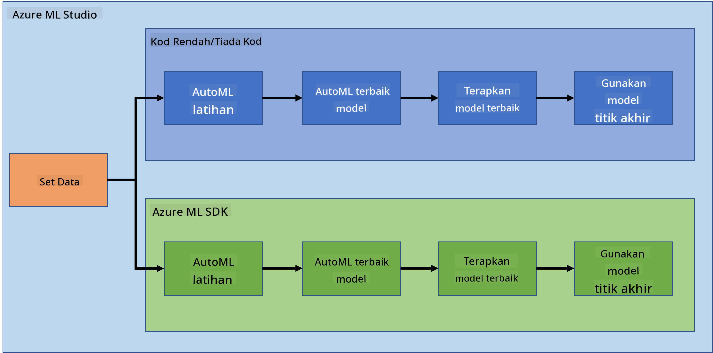
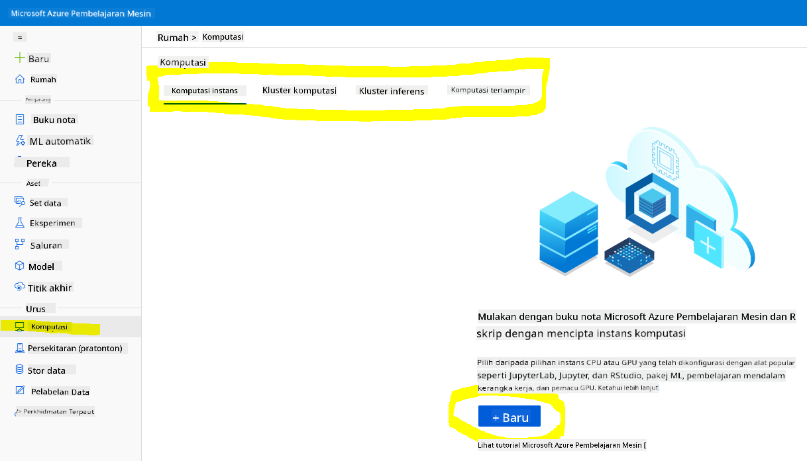
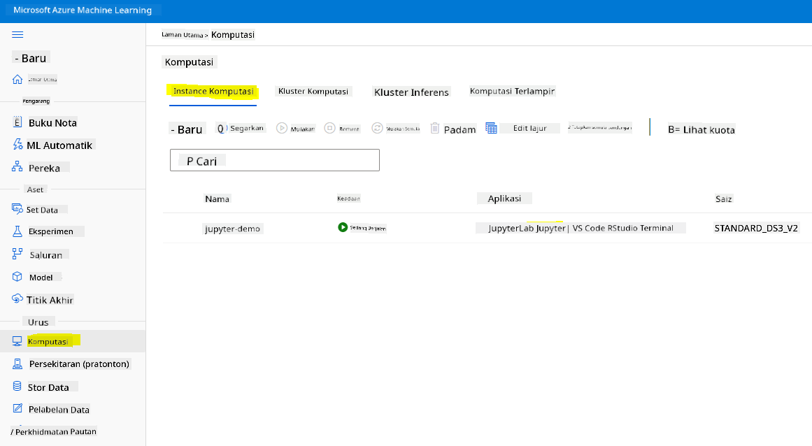
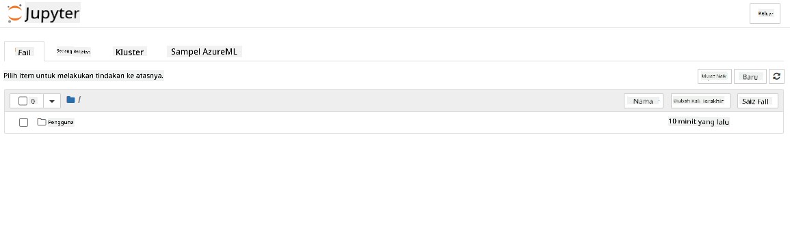

<!--
CO_OP_TRANSLATOR_METADATA:
{
  "original_hash": "5da2d6b3736f6d668b89de9bf3bdd31b",
  "translation_date": "2025-09-04T20:43:08+00:00",
  "source_file": "5-Data-Science-In-Cloud/19-Azure/README.md",
  "language_code": "ms"
}
-->
# Sains Data di Awan: Cara "Azure ML SDK"

| ](../../sketchnotes/19-DataScience-Cloud.png)|
|:---:|
| Sains Data di Awan: Azure ML SDK - _Sketchnote oleh [@nitya](https://twitter.com/nitya)_ |

Kandungan:

- [Sains Data di Awan: Cara "Azure ML SDK"](../../../../5-Data-Science-In-Cloud/19-Azure)
  - [Kuiz Pra-Kuliah](../../../../5-Data-Science-In-Cloud/19-Azure)
  - [1. Pengenalan](../../../../5-Data-Science-In-Cloud/19-Azure)
    - [1.1 Apa itu Azure ML SDK?](../../../../5-Data-Science-In-Cloud/19-Azure)
    - [1.2 Projek ramalan kegagalan jantung dan pengenalan dataset](../../../../5-Data-Science-In-Cloud/19-Azure)
  - [2. Melatih model dengan Azure ML SDK](../../../../5-Data-Science-In-Cloud/19-Azure)
    - [2.1 Membuat ruang kerja Azure ML](../../../../5-Data-Science-In-Cloud/19-Azure)
    - [2.2 Membuat instans pengiraan](../../../../5-Data-Science-In-Cloud/19-Azure)
    - [2.3 Memuat dataset](../../../../5-Data-Science-In-Cloud/19-Azure)
    - [2.4 Membuat Notebook](../../../../5-Data-Science-In-Cloud/19-Azure)
    - [2.5 Melatih model](../../../../5-Data-Science-In-Cloud/19-Azure)
      - [2.5.1 Menyediakan ruang kerja, eksperimen, kluster pengiraan dan dataset](../../../../5-Data-Science-In-Cloud/19-Azure)
      - [2.5.2 Konfigurasi AutoML dan latihan](../../../../5-Data-Science-In-Cloud/19-Azure)
  - [3. Penyebaran model dan penggunaan endpoint dengan Azure ML SDK](../../../../5-Data-Science-In-Cloud/19-Azure)
    - [3.1 Menyimpan model terbaik](../../../../5-Data-Science-In-Cloud/19-Azure)
    - [3.2 Penyebaran model](../../../../5-Data-Science-In-Cloud/19-Azure)
    - [3.3 Penggunaan endpoint](../../../../5-Data-Science-In-Cloud/19-Azure)
  - [🚀 Cabaran](../../../../5-Data-Science-In-Cloud/19-Azure)
  - [Kuiz Pasca-Kuliah](../../../../5-Data-Science-In-Cloud/19-Azure)
  - [Ulasan & Kajian Kendiri](../../../../5-Data-Science-In-Cloud/19-Azure)
  - [Tugasan](../../../../5-Data-Science-In-Cloud/19-Azure)

## [Kuiz Pra-Kuliah](https://purple-hill-04aebfb03.1.azurestaticapps.net/quiz/36)

## 1. Pengenalan

### 1.1 Apa itu Azure ML SDK?

Saintis data dan pembangun AI menggunakan Azure Machine Learning SDK untuk membina dan menjalankan aliran kerja pembelajaran mesin dengan perkhidmatan Azure Machine Learning. Anda boleh berinteraksi dengan perkhidmatan ini dalam mana-mana persekitaran Python, termasuk Jupyter Notebooks, Visual Studio Code, atau IDE Python kegemaran anda.

Bidang utama SDK termasuk:

- Meneroka, menyediakan dan mengurus kitaran hayat dataset yang digunakan dalam eksperimen pembelajaran mesin.
- Mengurus sumber awan untuk pemantauan, log, dan pengorganisasian eksperimen pembelajaran mesin.
- Melatih model sama ada secara tempatan atau menggunakan sumber awan, termasuk latihan model yang dipercepatkan GPU.
- Menggunakan pembelajaran mesin automatik, yang menerima parameter konfigurasi dan data latihan. Ia secara automatik mengulangi algoritma dan tetapan hiperparameter untuk mencari model terbaik untuk menjalankan ramalan.
- Menyebarkan perkhidmatan web untuk menukar model yang telah dilatih menjadi perkhidmatan RESTful yang boleh digunakan dalam mana-mana aplikasi.

[Ketahui lebih lanjut tentang Azure Machine Learning SDK](https://docs.microsoft.com/python/api/overview/azure/ml?WT.mc_id=academic-77958-bethanycheum&ocid=AID3041109)

Dalam [pelajaran sebelumnya](../18-Low-Code/README.md), kita telah melihat cara melatih, menyebarkan dan menggunakan model dengan pendekatan Low code/No code. Kita menggunakan dataset Kegagalan Jantung untuk menghasilkan model ramalan kegagalan jantung. Dalam pelajaran ini, kita akan melakukan perkara yang sama tetapi menggunakan Azure Machine Learning SDK.



### 1.2 Projek ramalan kegagalan jantung dan pengenalan dataset

Lihat [di sini](../18-Low-Code/README.md) untuk pengenalan projek ramalan kegagalan jantung dan dataset.

## 2. Melatih model dengan Azure ML SDK
### 2.1 Membuat ruang kerja Azure ML

Untuk kemudahan, kita akan bekerja dalam jupyter notebook. Ini bermaksud anda sudah mempunyai Ruang Kerja dan instans pengiraan. Jika anda sudah mempunyai Ruang Kerja, anda boleh terus ke bahagian 2.3 Penciptaan Notebook.

Jika belum, sila ikuti arahan dalam bahagian **2.1 Membuat ruang kerja Azure ML** dalam [pelajaran sebelumnya](../18-Low-Code/README.md) untuk membuat ruang kerja.

### 2.2 Membuat instans pengiraan

Dalam [ruang kerja Azure ML](https://ml.azure.com/) yang kita buat sebelum ini, pergi ke menu pengiraan dan anda akan melihat pelbagai sumber pengiraan yang tersedia.



Mari buat instans pengiraan untuk menyediakan jupyter notebook. 
1. Klik pada butang + Baru. 
2. Berikan nama kepada instans pengiraan anda.
3. Pilih pilihan anda: CPU atau GPU, saiz VM dan bilangan teras.
4. Klik pada butang Buat.

Tahniah, anda baru sahaja membuat instans pengiraan! Kita akan menggunakan instans pengiraan ini untuk membuat Notebook dalam bahagian [Membuat Notebook](../../../../5-Data-Science-In-Cloud/19-Azure).

### 2.3 Memuat dataset
Rujuk [pelajaran sebelumnya](../18-Low-Code/README.md) dalam bahagian **2.3 Memuat dataset** jika anda belum memuat naik dataset.

### 2.4 Membuat Notebook

> **_NOTA:_** Untuk langkah seterusnya, anda boleh sama ada membuat notebook baru dari awal, atau memuat naik [notebook yang telah kita buat](notebook.ipynb) ke Azure ML Studio anda. Untuk memuat naiknya, klik sahaja pada menu "Notebook" dan muat naik notebook tersebut.

Notebook adalah bahagian yang sangat penting dalam proses sains data. Ia boleh digunakan untuk menjalankan Analisis Data Eksplorasi (EDA), memanggil kluster pengiraan untuk melatih model, atau memanggil kluster inferens untuk menyebarkan endpoint. 

Untuk membuat Notebook, kita memerlukan nod pengiraan yang menyediakan instans jupyter notebook. Kembali ke [ruang kerja Azure ML](https://ml.azure.com/) dan klik pada Instans Pengiraan. Dalam senarai instans pengiraan, anda sepatutnya melihat [instans pengiraan yang kita buat sebelum ini](../../../../5-Data-Science-In-Cloud/19-Azure). 

1. Dalam bahagian Aplikasi, klik pada pilihan Jupyter. 
2. Tandakan kotak "Ya, saya faham" dan klik pada butang Teruskan.

3. Ini akan membuka tab pelayar baru dengan instans jupyter notebook anda seperti berikut. Klik pada butang "Baru" untuk membuat notebook.



Sekarang kita mempunyai Notebook, kita boleh mula melatih model dengan Azure ML SDK.

### 2.5 Melatih model

Pertama sekali, jika anda mempunyai sebarang keraguan, rujuk [dokumentasi Azure ML SDK](https://docs.microsoft.com/python/api/overview/azure/ml?WT.mc_id=academic-77958-bethanycheum&ocid=AID3041109). Ia mengandungi semua maklumat yang diperlukan untuk memahami modul yang akan kita lihat dalam pelajaran ini.

#### 2.5.1 Menyediakan ruang kerja, eksperimen, kluster pengiraan dan dataset

Anda perlu memuatkan `workspace` dari fail konfigurasi menggunakan kod berikut:

```python
from azureml.core import Workspace
ws = Workspace.from_config()
```

Ini mengembalikan objek jenis `Workspace` yang mewakili ruang kerja. Kemudian anda perlu membuat `experiment` menggunakan kod berikut:

```python
from azureml.core import Experiment
experiment_name = 'aml-experiment'
experiment = Experiment(ws, experiment_name)
```
Untuk mendapatkan atau membuat eksperimen dari ruang kerja, anda meminta eksperimen menggunakan nama eksperimen. Nama eksperimen mesti terdiri daripada 3-36 aksara, bermula dengan huruf atau nombor, dan hanya boleh mengandungi huruf, nombor, garis bawah, dan tanda hubung. Jika eksperimen tidak dijumpai dalam ruang kerja, eksperimen baru akan dibuat.

Sekarang anda perlu membuat kluster pengiraan untuk latihan menggunakan kod berikut. Perhatikan bahawa langkah ini boleh mengambil masa beberapa minit. 

```python
from azureml.core.compute import AmlCompute

aml_name = "heart-f-cluster"
try:
    aml_compute = AmlCompute(ws, aml_name)
    print('Found existing AML compute context.')
except:
    print('Creating new AML compute context.')
    aml_config = AmlCompute.provisioning_configuration(vm_size = "Standard_D2_v2", min_nodes=1, max_nodes=3)
    aml_compute = AmlCompute.create(ws, name = aml_name, provisioning_configuration = aml_config)
    aml_compute.wait_for_completion(show_output = True)

cts = ws.compute_targets
compute_target = cts[aml_name]
```

Anda boleh mendapatkan dataset dari ruang kerja menggunakan nama dataset dengan cara berikut:

```python
dataset = ws.datasets['heart-failure-records']
df = dataset.to_pandas_dataframe()
df.describe()
```
#### 2.5.2 Konfigurasi AutoML dan latihan

Untuk menetapkan konfigurasi AutoML, gunakan kelas [AutoMLConfig](https://docs.microsoft.com/python/api/azureml-train-automl-client/azureml.train.automl.automlconfig(class)?WT.mc_id=academic-77958-bethanycheum&ocid=AID3041109).

Seperti yang diterangkan dalam dokumen, terdapat banyak parameter yang boleh anda mainkan. Untuk projek ini, kita akan menggunakan parameter berikut:

- `experiment_timeout_minutes`: Jumlah masa maksimum (dalam minit) yang dibenarkan untuk eksperimen berjalan sebelum ia dihentikan secara automatik dan hasilnya tersedia secara automatik.
- `max_concurrent_iterations`: Bilangan maksimum iterasi latihan serentak yang dibenarkan untuk eksperimen.
- `primary_metric`: Metrik utama yang digunakan untuk menentukan status eksperimen.
- `compute_target`: Sasaran pengiraan Azure Machine Learning untuk menjalankan eksperimen Pembelajaran Mesin Automatik.
- `task`: Jenis tugas untuk dijalankan. Nilai boleh 'classification', 'regression', atau 'forecasting' bergantung pada jenis masalah ML automatik yang ingin diselesaikan.
- `training_data`: Data latihan yang akan digunakan dalam eksperimen. Ia harus mengandungi ciri latihan dan kolum label (secara opsional kolum berat sampel).
- `label_column_name`: Nama kolum label.
- `path`: Laluan penuh ke folder projek Azure Machine Learning.
- `enable_early_stopping`: Sama ada untuk membolehkan penamatan awal jika skor tidak bertambah baik dalam jangka pendek.
- `featurization`: Penunjuk sama ada langkah featurization harus dilakukan secara automatik atau tidak, atau sama ada featurization yang disesuaikan harus digunakan.
- `debug_log`: Fail log untuk menulis maklumat debug.

```python
from azureml.train.automl import AutoMLConfig

project_folder = './aml-project'

automl_settings = {
    "experiment_timeout_minutes": 20,
    "max_concurrent_iterations": 3,
    "primary_metric" : 'AUC_weighted'
}

automl_config = AutoMLConfig(compute_target=compute_target,
                             task = "classification",
                             training_data=dataset,
                             label_column_name="DEATH_EVENT",
                             path = project_folder,  
                             enable_early_stopping= True,
                             featurization= 'auto',
                             debug_log = "automl_errors.log",
                             **automl_settings
                            )
```
Sekarang konfigurasi anda telah ditetapkan, anda boleh melatih model menggunakan kod berikut. Langkah ini boleh mengambil masa sehingga satu jam bergantung pada saiz kluster anda.

```python
remote_run = experiment.submit(automl_config)
```
Anda boleh menjalankan widget RunDetails untuk menunjukkan eksperimen yang berbeza.
```python
from azureml.widgets import RunDetails
RunDetails(remote_run).show()
```
## 3. Penyebaran model dan penggunaan endpoint dengan Azure ML SDK

### 3.1 Menyimpan model terbaik

`remote_run` adalah objek jenis [AutoMLRun](https://docs.microsoft.com/python/api/azureml-train-automl-client/azureml.train.automl.run.automlrun?WT.mc_id=academic-77958-bethanycheum&ocid=AID3041109). Objek ini mengandungi kaedah `get_output()` yang mengembalikan run terbaik dan model yang sesuai.

```python
best_run, fitted_model = remote_run.get_output()
```
Anda boleh melihat parameter yang digunakan untuk model terbaik dengan hanya mencetak fitted_model dan melihat sifat model terbaik dengan menggunakan kaedah [get_properties()](https://docs.microsoft.com/python/api/azureml-core/azureml.core.run(class)?view=azure-ml-py#azureml_core_Run_get_properties?WT.mc_id=academic-77958-bethanycheum&ocid=AID3041109).

```python
best_run.get_properties()
```

Sekarang daftarkan model dengan kaedah [register_model](https://docs.microsoft.com/python/api/azureml-train-automl-client/azureml.train.automl.run.automlrun?view=azure-ml-py#register-model-model-name-none--description-none--tags-none--iteration-none--metric-none-?WT.mc_id=academic-77958-bethanycheum&ocid=AID3041109).
```python
model_name = best_run.properties['model_name']
script_file_name = 'inference/score.py'
best_run.download_file('outputs/scoring_file_v_1_0_0.py', 'inference/score.py')
description = "aml heart failure project sdk"
model = best_run.register_model(model_name = model_name,
                                model_path = './outputs/',
                                description = description,
                                tags = None)
```
### 3.2 Penyebaran model

Setelah model terbaik disimpan, kita boleh menyebarkannya dengan kelas [InferenceConfig](https://docs.microsoft.com/python/api/azureml-core/azureml.core.model.inferenceconfig?view=azure-ml-py?ocid=AID3041109). InferenceConfig mewakili tetapan konfigurasi untuk persekitaran tersuai yang digunakan untuk penyebaran. Kelas [AciWebservice](https://docs.microsoft.com/python/api/azureml-core/azureml.core.webservice.aciwebservice?view=azure-ml-py) mewakili model pembelajaran mesin yang disebarkan sebagai endpoint perkhidmatan web pada Azure Container Instances. Perkhidmatan web yang disebarkan dibuat daripada model, skrip, dan fail yang berkaitan. Perkhidmatan web yang dihasilkan adalah endpoint HTTP yang seimbang beban dengan API REST. Anda boleh menghantar data ke API ini dan menerima ramalan yang dikembalikan oleh model.

Model disebarkan menggunakan kaedah [deploy](https://docs.microsoft.com/python/api/azureml-core/azureml.core.model(class)?view=azure-ml-py#deploy-workspace--name--models--inference-config-none--deployment-config-none--deployment-target-none--overwrite-false--show-output-false-?WT.mc_id=academic-77958-bethanycheum&ocid=AID3041109).

```python
from azureml.core.model import InferenceConfig, Model
from azureml.core.webservice import AciWebservice

inference_config = InferenceConfig(entry_script=script_file_name, environment=best_run.get_environment())

aciconfig = AciWebservice.deploy_configuration(cpu_cores = 1,
                                               memory_gb = 1,
                                               tags = {'type': "automl-heart-failure-prediction"},
                                               description = 'Sample service for AutoML Heart Failure Prediction')

aci_service_name = 'automl-hf-sdk'
aci_service = Model.deploy(ws, aci_service_name, [model], inference_config, aciconfig)
aci_service.wait_for_deployment(True)
print(aci_service.state)
```
Langkah ini sepatutnya mengambil masa beberapa minit.

### 3.3 Penggunaan endpoint

Anda menggunakan endpoint anda dengan mencipta input sampel:

```python
data = {
    "data":
    [
        {
            'age': "60",
            'anaemia': "false",
            'creatinine_phosphokinase': "500",
            'diabetes': "false",
            'ejection_fraction': "38",
            'high_blood_pressure': "false",
            'platelets': "260000",
            'serum_creatinine': "1.40",
            'serum_sodium': "137",
            'sex': "false",
            'smoking': "false",
            'time': "130",
        },
    ],
}

test_sample = str.encode(json.dumps(data))
```
Dan kemudian anda boleh menghantar input ini ke model anda untuk ramalan:
```python
response = aci_service.run(input_data=test_sample)
response
```
Ini sepatutnya menghasilkan `'{"result": [false]}'`. Ini bermaksud input pesakit yang kita hantar ke endpoint menghasilkan ramalan `false` yang bermaksud orang ini tidak berkemungkinan mengalami serangan jantung.

Tahniah! Anda baru sahaja menggunakan model yang telah dilatih dan diterapkan di Azure ML dengan Azure ML SDK!


> **_NOTE:_** Setelah anda selesai dengan projek ini, jangan lupa untuk memadamkan semua sumber.

## 🚀 Cabaran

Terdapat banyak perkara lain yang boleh anda lakukan melalui SDK, malangnya, kita tidak dapat melihat semuanya dalam pelajaran ini. Tetapi berita baiknya, belajar cara menyemak imbas dokumentasi SDK boleh membawa anda jauh secara sendiri. Lihat dokumentasi Azure ML SDK dan cari kelas `Pipeline` yang membolehkan anda mencipta pipeline. Pipeline adalah koleksi langkah-langkah yang boleh dilaksanakan sebagai aliran kerja.

**PETUNJUK:** Pergi ke [dokumentasi SDK](https://docs.microsoft.com/python/api/overview/azure/ml/?view=azure-ml-py?WT.mc_id=academic-77958-bethanycheum&ocid=AID3041109) dan taip kata kunci dalam bar carian seperti "Pipeline". Anda sepatutnya melihat kelas `azureml.pipeline.core.Pipeline` dalam hasil carian.

## [Kuiz selepas kuliah](https://ff-quizzes.netlify.app/en/ds/)

## Ulasan & Kajian Kendiri

Dalam pelajaran ini, anda telah belajar cara melatih, menerapkan dan menggunakan model untuk meramalkan risiko kegagalan jantung dengan Azure ML SDK di awan. Semak [dokumentasi ini](https://docs.microsoft.com/python/api/overview/azure/ml/?view=azure-ml-py?WT.mc_id=academic-77958-bethanycheum&ocid=AID3041109) untuk maklumat lanjut tentang Azure ML SDK. Cuba cipta model anda sendiri dengan Azure ML SDK. 

## Tugasan

[Projek Sains Data menggunakan Azure ML SDK](assignment.md)

---

**Penafian**:  
Dokumen ini telah diterjemahkan menggunakan perkhidmatan terjemahan AI [Co-op Translator](https://github.com/Azure/co-op-translator). Walaupun kami berusaha untuk memastikan ketepatan, sila ambil maklum bahawa terjemahan automatik mungkin mengandungi kesilapan atau ketidaktepatan. Dokumen asal dalam bahasa asalnya harus dianggap sebagai sumber yang berwibawa. Untuk maklumat yang kritikal, terjemahan manusia profesional adalah disyorkan. Kami tidak bertanggungjawab atas sebarang salah faham atau salah tafsir yang timbul daripada penggunaan terjemahan ini.