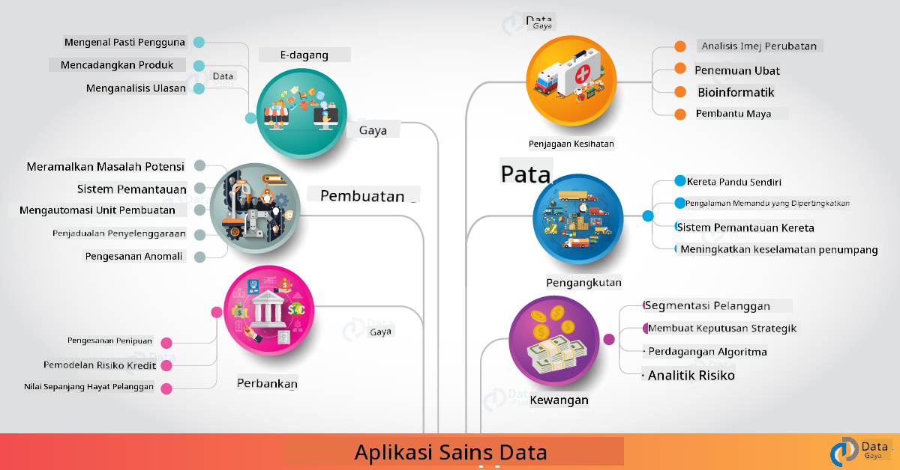

<!--
CO_OP_TRANSLATOR_METADATA:
{
  "original_hash": "0f67a4139454816631526779a456b734",
  "translation_date": "2025-09-06T18:38:19+00:00",
  "source_file": "6-Data-Science-In-Wild/20-Real-World-Examples/README.md",
  "language_code": "ms"
}
-->
# Sains Data di Dunia Sebenar

|  ](../../sketchnotes/20-DataScience-RealWorld.png) |
| :--------------------------------------------------------------------------------------------------------------: |
|               Sains Data di Dunia Sebenar - _Sketchnote oleh [@nitya](https://twitter.com/nitya)_               |

Kita hampir sampai ke penghujung perjalanan pembelajaran ini!

Kita bermula dengan definisi sains data dan etika, meneroka pelbagai alat & teknik untuk analisis dan visualisasi data, mengkaji kitaran hayat sains data, dan melihat cara untuk meningkatkan skala serta mengautomasi aliran kerja sains data menggunakan perkhidmatan pengkomputeran awan. Jadi, anda mungkin tertanya-tanya: _"Bagaimana sebenarnya saya boleh memetakan semua pembelajaran ini kepada konteks dunia sebenar?"_

Dalam pelajaran ini, kita akan meneroka aplikasi dunia sebenar sains data merentasi industri dan menyelami contoh-contoh spesifik dalam konteks penyelidikan, kemanusiaan digital, dan kelestarian. Kita juga akan melihat peluang projek pelajar dan mengakhiri dengan sumber berguna untuk membantu anda meneruskan perjalanan pembelajaran anda!

## Kuiz Pra-Kuliah

## [Kuiz pra-kuliah](https://ff-quizzes.netlify.app/en/ds/quiz/38)

## Sains Data + Industri

Terima kasih kepada pendemokrasian AI, pembangun kini lebih mudah untuk mereka bentuk dan mengintegrasikan pembuatan keputusan berasaskan AI serta pandangan berasaskan data ke dalam pengalaman pengguna dan aliran kerja pembangunan. Berikut adalah beberapa contoh bagaimana sains data "digunakan" dalam aplikasi dunia sebenar merentasi industri:

 * [Google Flu Trends](https://www.wired.com/2015/10/can-learn-epic-failure-google-flu-trends/) menggunakan sains data untuk mengaitkan istilah carian dengan trend selesema. Walaupun pendekatan ini mempunyai kelemahan, ia meningkatkan kesedaran tentang kemungkinan (dan cabaran) ramalan penjagaan kesihatan berasaskan data.

 * [Ramalan Laluan UPS](https://www.technologyreview.com/2018/11/21/139000/how-ups-uses-ai-to-outsmart-bad-weather/) - menerangkan bagaimana UPS menggunakan sains data dan pembelajaran mesin untuk meramalkan laluan penghantaran yang optimum, dengan mengambil kira keadaan cuaca, corak trafik, tarikh akhir penghantaran dan banyak lagi.

 * [Visualisasi Laluan Teksi NYC](http://chriswhong.github.io/nyctaxi/) - data yang dikumpulkan menggunakan [Undang-Undang Kebebasan Maklumat](https://chriswhong.com/open-data/foil_nyc_taxi/) membantu memvisualisasikan satu hari dalam kehidupan teksi NYC, membantu kita memahami bagaimana mereka menavigasi bandar yang sibuk, pendapatan mereka, dan tempoh perjalanan sepanjang setiap tempoh 24 jam.

 * [Uber Data Science Workbench](https://eng.uber.com/dsw/) - menggunakan data (lokasi pengambilan & penghantaran, tempoh perjalanan, laluan pilihan dll.) yang dikumpulkan daripada berjuta-juta perjalanan Uber *setiap hari* untuk membina alat analitik data bagi membantu dengan penetapan harga, keselamatan, pengesanan penipuan dan keputusan navigasi.

 * [Analitik Sukan](https://towardsdatascience.com/scope-of-analytics-in-sports-world-37ed09c39860) - memberi tumpuan kepada _analitik ramalan_ (analisis pasukan dan pemain - fikirkan [Moneyball](https://datasciencedegree.wisconsin.edu/blog/moneyball-proves-importance-big-data-big-ideas/) - dan pengurusan peminat) dan _visualisasi data_ (papan pemuka pasukan & peminat, permainan dll.) dengan aplikasi seperti pencarian bakat, perjudian sukan dan pengurusan inventori/tempat.

 * [Sains Data dalam Perbankan](https://data-flair.training/blogs/data-science-in-banking/) - menonjolkan nilai sains data dalam industri kewangan dengan aplikasi yang merangkumi pemodelan risiko dan pengesanan penipuan, kepada segmentasi pelanggan, ramalan masa nyata dan sistem cadangan. Analitik ramalan juga mendorong langkah kritikal seperti [skor kredit](https://dzone.com/articles/using-big-data-and-predictive-analytics-for-credit).

 * [Sains Data dalam Penjagaan Kesihatan](https://data-flair.training/blogs/data-science-in-healthcare/) - menonjolkan aplikasi seperti pengimejan perubatan (contohnya, MRI, X-Ray, CT-Scan), genomik (penjujukan DNA), pembangunan ubat (penilaian risiko, ramalan kejayaan), analitik ramalan (penjagaan pesakit & logistik bekalan), pengesanan & pencegahan penyakit dll.

 Kredit Imej: [Data Flair: 6 Amazing Data Science Applications ](https://data-flair.training/blogs/data-science-applications/)

Rajah ini menunjukkan domain lain dan contoh untuk menerapkan teknik sains data. Mahu meneroka aplikasi lain? Lihat bahagian [Kajian & Pembelajaran Kendiri](../../../../6-Data-Science-In-Wild/20-Real-World-Examples) di bawah.

## Sains Data + Penyelidikan

|  ](../../sketchnotes/20-DataScience-Research.png) |
| :---------------------------------------------------------------------------------------------------------------: |
|              Sains Data & Penyelidikan - _Sketchnote oleh [@nitya](https://twitter.com/nitya)_              |

Walaupun aplikasi dunia sebenar sering memberi tumpuan kepada kes penggunaan industri pada skala besar, aplikasi dan projek _penyelidikan_ boleh berguna dari dua perspektif:

* _peluang inovasi_ - meneroka prototaip pantas konsep maju dan menguji pengalaman pengguna untuk aplikasi generasi akan datang.
* _cabaran pelaksanaan_ - menyiasat potensi bahaya atau akibat yang tidak diingini daripada teknologi sains data dalam konteks dunia sebenar.

Bagi pelajar, projek penyelidikan ini boleh memberikan peluang pembelajaran dan kerjasama yang dapat meningkatkan pemahaman anda tentang topik tersebut, serta memperluaskan kesedaran dan penglibatan anda dengan individu atau pasukan yang relevan yang bekerja dalam bidang yang diminati. Jadi, bagaimana rupa projek penyelidikan dan bagaimana ia boleh memberi impak?

Mari kita lihat satu contoh - [MIT Gender Shades Study](http://gendershades.org/overview.html) oleh Joy Buolamwini (MIT Media Labs) dengan [kertas penyelidikan utama](http://proceedings.mlr.press/v81/buolamwini18a/buolamwini18a.pdf) yang ditulis bersama Timnit Gebru (ketika itu di Microsoft Research) yang memberi tumpuan kepada 

 * **Apa:** Objektif projek penyelidikan adalah untuk _menilai bias yang terdapat dalam algoritma dan set data analisis wajah automatik_ berdasarkan jantina dan jenis kulit. 
 * **Mengapa:** Analisis wajah digunakan dalam bidang seperti penguatkuasaan undang-undang, keselamatan lapangan terbang, sistem pengambilan pekerja dan banyak lagi - konteks di mana klasifikasi yang tidak tepat (contohnya, disebabkan bias) boleh menyebabkan potensi bahaya ekonomi dan sosial kepada individu atau kumpulan yang terjejas. Memahami (dan menghapuskan atau mengurangkan) bias adalah kunci kepada keadilan dalam penggunaan.
 * **Bagaimana:** Penyelidik menyedari bahawa penanda aras sedia ada menggunakan subjek yang kebanyakannya berkulit cerah, dan mengumpulkan set data baharu (1000+ imej) yang _lebih seimbang_ mengikut jantina dan jenis kulit. Set data ini digunakan untuk menilai ketepatan tiga produk klasifikasi jantina (daripada Microsoft, IBM & Face++). 

Hasil menunjukkan bahawa walaupun ketepatan klasifikasi keseluruhan adalah baik, terdapat perbezaan yang ketara dalam kadar kesilapan antara pelbagai subkumpulan - dengan **kesalahan pengenalan jantina** lebih tinggi untuk wanita atau individu berkulit gelap, menunjukkan adanya bias.

**Hasil Utama:** Meningkatkan kesedaran bahawa sains data memerlukan lebih banyak _set data yang mewakili_ (subkumpulan seimbang) dan lebih banyak _pasukan inklusif_ (latar belakang yang pelbagai) untuk mengenal pasti dan menghapuskan atau mengurangkan bias seperti ini lebih awal dalam penyelesaian AI. Usaha penyelidikan seperti ini juga penting dalam banyak organisasi untuk menentukan prinsip dan amalan bagi _AI yang bertanggungjawab_ untuk meningkatkan keadilan dalam produk dan proses AI mereka.

**Mahu belajar tentang usaha penyelidikan relevan di Microsoft?** 

* Lihat [Projek Penyelidikan Microsoft](https://www.microsoft.com/research/research-area/artificial-intelligence/?facet%5Btax%5D%5Bmsr-research-area%5D%5B%5D=13556&facet%5Btax%5D%5Bmsr-content-type%5D%5B%5D=msr-project) dalam Kecerdasan Buatan.
* Terokai projek pelajar dari [Microsoft Research Data Science Summer School](https://www.microsoft.com/en-us/research/academic-program/data-science-summer-school/).
* Lihat projek [Fairlearn](https://fairlearn.org/) dan inisiatif [AI yang Bertanggungjawab](https://www.microsoft.com/en-us/ai/responsible-ai?activetab=pivot1%3aprimaryr6).

## Sains Data + Kemanusiaan

|  ](../../sketchnotes/20-DataScience-Humanities.png) |
| :---------------------------------------------------------------------------------------------------------------: |
|              Sains Data & Kemanusiaan Digital - _Sketchnote oleh [@nitya](https://twitter.com/nitya)_              |

Kemanusiaan Digital [telah didefinisikan](https://digitalhumanities.stanford.edu/about-dh-stanford) sebagai "koleksi amalan dan pendekatan yang menggabungkan kaedah pengiraan dengan penyelidikan humanistik". Projek [Stanford](https://digitalhumanities.stanford.edu/projects) seperti _"rebooting history"_ dan _"poetic thinking"_ menggambarkan hubungan antara [Kemanusiaan Digital dan Sains Data](https://digitalhumanities.stanford.edu/digital-humanities-and-data-science) - menekankan teknik seperti analisis rangkaian, visualisasi maklumat, analisis spatial dan teks yang dapat membantu kita mengkaji semula set data sejarah dan sastera untuk mendapatkan wawasan dan perspektif baharu.

*Mahu meneroka dan mengembangkan projek dalam bidang ini?*

Lihat ["Emily Dickinson and the Meter of Mood"](https://gist.github.com/jlooper/ce4d102efd057137bc000db796bfd671) - contoh hebat daripada [Jen Looper](https://twitter.com/jenlooper) yang bertanya bagaimana kita boleh menggunakan sains data untuk mengkaji semula puisi yang biasa dan menilai semula maknanya serta sumbangan pengarangnya dalam konteks baharu. Sebagai contoh, _bolehkah kita meramalkan musim di mana puisi ditulis dengan menganalisis nada atau sentimennya_ - dan apa yang ini memberitahu kita tentang keadaan fikiran pengarang sepanjang tempoh yang relevan?

Untuk menjawab soalan itu, kita mengikuti langkah-langkah kitaran hayat sains data:
 * [`Pemerolehan Data`](https://gist.github.com/jlooper/ce4d102efd057137bc000db796bfd671#acquiring-the-dataset) - untuk mengumpulkan set data yang relevan untuk analisis. Pilihan termasuk menggunakan API (contohnya, [Poetry DB API](https://poetrydb.org/index.html)) atau mengikis halaman web (contohnya, [Project Gutenberg](https://www.gutenberg.org/files/12242/12242-h/12242-h.htm)) menggunakan alat seperti [Scrapy](https://scrapy.org/).
 * [`Pembersihan Data`](https://gist.github.com/jlooper/ce4d102efd057137bc000db796bfd671#clean-the-data) - menerangkan bagaimana teks boleh diformat, disanitasi dan dipermudahkan menggunakan alat asas seperti Visual Studio Code dan Microsoft Excel.
 * [`Analisis Data`](https://gist.github.com/jlooper/ce4d102efd057137bc000db796bfd671#working-with-the-data-in-a-notebook) - menerangkan bagaimana kita kini boleh mengimport set data ke dalam "Notebooks" untuk analisis menggunakan pakej Python (seperti pandas, numpy dan matplotlib) untuk mengatur dan memvisualisasikan data.
 * [`Analisis Sentimen`](https://gist.github.com/jlooper/ce4d102efd057137bc000db796bfd671#sentiment-analysis-using-cognitive-services) - menerangkan bagaimana kita boleh mengintegrasikan perkhidmatan awan seperti Text Analytics, menggunakan alat kod rendah seperti [Power Automate](https://flow.microsoft.com/en-us/) untuk aliran kerja pemprosesan data automatik.

Menggunakan aliran kerja ini, kita boleh meneroka kesan musim terhadap sentimen puisi, dan membantu kita membentuk perspektif kita sendiri tentang pengarangnya. Cubalah sendiri - kemudian kembangkan notebook untuk bertanya soalan lain atau memvisualisasikan data dengan cara baharu!

> Anda boleh menggunakan beberapa alat dalam [Digital Humanities toolkit](https://github.com/Digital-Humanities-Toolkit) untuk meneruskan jalan penyelidikan ini.

## Sains Data + Kelestarian

|  ](../../sketchnotes/20-DataScience-Sustainability.png) |
| :---------------------------------------------------------------------------------------------------------------: |
|              Sains Data & Kelestarian - _Sketchnote oleh [@nitya](https://twitter.com/nitya)_              |

[Agenda 2030 Untuk Pembangunan Lestari](https://sdgs.un.org/2030agenda) - yang diterima pakai oleh semua anggota Pertubuhan Bangsa-Bangsa Bersatu pada tahun 2015 - mengenal pasti 17 matlamat termasuk yang memberi tumpuan kepada **Melindungi Planet** daripada kemerosotan dan kesan perubahan iklim. Inisiatif [Microsoft Sustainability](https://www.microsoft.com/en-us/sustainability) menyokong matlamat ini dengan meneroka cara di mana penyelesaian teknologi dapat menyokong dan membina masa depan yang lebih lestari dengan [fokus pada 4 matlamat](https://dev.to/azure/a-visual-guide-to-sustainable-software-engineering-53hh) - menjadi karbon negatif, air positif, sifar sisa, dan bio-diversiti menjelang 2030.

Menangani cabaran ini secara berskala dan tepat pada masanya memerlukan pemikiran berskala awan - dan data berskala besar. Inisiatif [Planetary Computer](https://planetarycomputer.microsoft.com/) menyediakan 4 komponen untuk membantu saintis data dan pembangun dalam usaha ini:
 
 * [Katalog Data](https://planetarycomputer.microsoft.com/catalog) - dengan petabyte data Sistem Bumi (percuma & dihoskan Azure).
 * [Planetary API](https://planetarycomputer.microsoft.com/docs/reference/stac/) - untuk membantu pengguna mencari data yang relevan merentasi ruang dan masa.
 * [Hub](https://planetarycomputer.microsoft.com/docs/overview/environment/) - persekitaran terurus untuk saintis memproses set data geospatial yang besar.
 * [Aplikasi](https://planetarycomputer.microsoft.com/applications) - mempamerkan kes penggunaan & alat untuk wawasan kelestarian.
**Projek Planetary Computer kini dalam peringkat pratonton (setakat Sep 2021)** - berikut adalah cara anda boleh mula menyumbang kepada penyelesaian kelestarian menggunakan sains data.

* [Mohon akses](https://planetarycomputer.microsoft.com/account/request) untuk memulakan penerokaan dan berhubung dengan rakan sebaya.
* [Terokai dokumentasi](https://planetarycomputer.microsoft.com/docs/overview/about) untuk memahami set data dan API yang disokong.
* Terokai aplikasi seperti [Pemantauan Ekosistem](https://analytics-lab.org/ecosystemmonitoring/) untuk mendapatkan inspirasi idea aplikasi.

Fikirkan bagaimana anda boleh menggunakan visualisasi data untuk mendedahkan atau memperkuatkan pandangan yang relevan dalam bidang seperti perubahan iklim dan penebangan hutan. Atau fikirkan bagaimana pandangan ini boleh digunakan untuk mencipta pengalaman pengguna baharu yang mendorong perubahan tingkah laku ke arah kehidupan yang lebih lestari.

## Sains Data + Pelajar

Kami telah membincangkan aplikasi dunia sebenar dalam industri dan penyelidikan, serta meneroka contoh aplikasi sains data dalam kemanusiaan digital dan kelestarian. Jadi, bagaimana anda boleh membina kemahiran anda dan berkongsi kepakaran anda sebagai pemula dalam sains data?

Berikut adalah beberapa contoh projek pelajar sains data untuk memberi inspirasi kepada anda.

* [Sekolah Musim Panas Sains Data MSR](https://www.microsoft.com/en-us/research/academic-program/data-science-summer-school/#!projects) dengan [projek GitHub](https://github.com/msr-ds3) yang meneroka topik seperti:
   - [Bias Perkauman dalam Penggunaan Kekuatan oleh Polis](https://www.microsoft.com/en-us/research/video/data-science-summer-school-2019-replicating-an-empirical-analysis-of-racial-differences-in-police-use-of-force/) | [Github](https://github.com/msr-ds3/stop-question-frisk)
   - [Kebolehpercayaan Sistem Subway NYC](https://www.microsoft.com/en-us/research/video/data-science-summer-school-2018-exploring-the-reliability-of-the-nyc-subway-system/) | [Github](https://github.com/msr-ds3/nyctransit)
* [Mendigitalkan Budaya Material: Meneroka pengagihan sosio-ekonomi di Sirkap](https://claremont.maps.arcgis.com/apps/Cascade/index.html?appid=bdf2aef0f45a4674ba41cd373fa23afc) - daripada [Ornella Altunyan](https://twitter.com/ornelladotcom) dan pasukan di Claremont, menggunakan [ArcGIS StoryMaps](https://storymaps.arcgis.com/).

## 🚀 Cabaran

Cari artikel yang mencadangkan projek sains data yang mesra pemula - seperti [50 topik ini](https://www.upgrad.com/blog/data-science-project-ideas-topics-beginners/) atau [21 idea projek ini](https://www.intellspot.com/data-science-project-ideas) atau [16 projek ini dengan kod sumber](https://data-flair.training/blogs/data-science-project-ideas/) yang anda boleh analisis dan ubah suai. Dan jangan lupa untuk menulis blog tentang perjalanan pembelajaran anda dan berkongsi pandangan anda dengan kami semua.

## Kuiz Selepas Kuliah

## [Kuiz selepas kuliah](https://ff-quizzes.netlify.app/en/ds/quiz/39)

## Ulasan & Kajian Kendiri

Ingin meneroka lebih banyak kes penggunaan? Berikut adalah beberapa artikel yang berkaitan:
* [17 Aplikasi dan Contoh Sains Data](https://builtin.com/data-science/data-science-applications-examples) - Jul 2021
* [11 Aplikasi Sains Data yang Mengagumkan dalam Dunia Sebenar](https://myblindbird.com/data-science-applications-real-world/) - Mei 2021
* [Sains Data Dalam Dunia Sebenar](https://towardsdatascience.com/data-science-in-the-real-world/home) - Koleksi Artikel
* [12 Aplikasi Sains Data Dunia Sebenar dengan Contoh](https://www.scaler.com/blog/data-science-applications/) - Mei 2024
* Sains Data Dalam: [Pendidikan](https://data-flair.training/blogs/data-science-in-education/), [Pertanian](https://data-flair.training/blogs/data-science-in-agriculture/), [Kewangan](https://data-flair.training/blogs/data-science-in-finance/), [Filem](https://data-flair.training/blogs/data-science-at-movies/), [Penjagaan Kesihatan](https://onlinedegrees.sandiego.edu/data-science-health-care/) & banyak lagi.

## Tugasan

[Terokai Set Data Planetary Computer](assignment.md)

---

**Penafian**:  
Dokumen ini telah diterjemahkan menggunakan perkhidmatan terjemahan AI [Co-op Translator](https://github.com/Azure/co-op-translator). Walaupun kami berusaha untuk memastikan ketepatan, sila ambil maklum bahawa terjemahan automatik mungkin mengandungi kesilapan atau ketidaktepatan. Dokumen asal dalam bahasa asalnya harus dianggap sebagai sumber yang berwibawa. Untuk maklumat penting, terjemahan manusia profesional adalah disyorkan. Kami tidak bertanggungjawab atas sebarang salah faham atau salah tafsir yang timbul daripada penggunaan terjemahan ini.