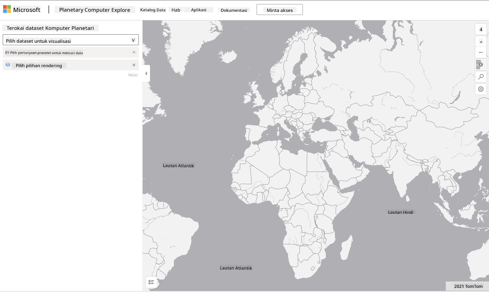

<!--
CO_OP_TRANSLATOR_METADATA:
{
  "original_hash": "d1e05715f9d97de6c4f1fb0c5a4702c0",
  "translation_date": "2025-08-28T19:10:14+00:00",
  "source_file": "6-Data-Science-In-Wild/20-Real-World-Examples/assignment.md",
  "language_code": "ms"
}
-->
# Terokai Dataset Planetary Computer

## Arahan

Dalam pelajaran ini, kita telah membincangkan pelbagai domain aplikasi sains data - dengan penekanan mendalam pada contoh-contoh berkaitan penyelidikan, kelestarian, dan kemanusiaan digital. Dalam tugasan ini, anda akan meneroka salah satu contoh ini dengan lebih terperinci, dan menggunakan pembelajaran anda tentang visualisasi data dan analisis untuk mendapatkan wawasan tentang data kelestarian.

Projek [Planetary Computer](https://planetarycomputer.microsoft.com/) mempunyai dataset dan API yang boleh diakses dengan akaun - mohon satu akaun jika anda ingin mencuba langkah bonus dalam tugasan ini. Laman web ini juga menyediakan ciri [Explorer](https://planetarycomputer.microsoft.com/explore) yang boleh digunakan tanpa perlu membuat akaun.

`Langkah-langkah:`
Antara muka Explorer (seperti yang ditunjukkan dalam tangkapan skrin di bawah) membolehkan anda memilih dataset (daripada pilihan yang disediakan), pertanyaan pratetap (untuk menapis data), dan pilihan rendering (untuk mencipta visualisasi yang relevan). Dalam tugasan ini, tugas anda adalah:

 1. Baca [dokumentasi Explorer](https://planetarycomputer.microsoft.com/docs/overview/explorer/) - fahami opsyen yang ada.
 2. Terokai [Katalog dataset](https://planetarycomputer.microsoft.com/catalog) - pelajari tujuan setiap dataset.
 3. Gunakan Explorer - pilih dataset yang menarik, pilih pertanyaan dan pilihan rendering yang relevan.

`Tugas Anda:`
Sekarang kaji visualisasi yang dipaparkan dalam pelayar dan jawab soalan berikut:
 * Apakah _ciri-ciri_ yang terdapat dalam dataset tersebut?
 * Apakah _wawasan_ atau hasil yang diberikan oleh visualisasi tersebut?
 * Apakah _implikasi_ daripada wawasan tersebut terhadap matlamat kelestarian projek?
 * Apakah _keterbatasan_ visualisasi tersebut (iaitu, apakah wawasan yang tidak anda peroleh)?
 * Jika anda boleh mendapatkan data mentah, apakah _visualisasi alternatif_ yang akan anda cipta, dan mengapa?

`Mata Bonus:`
Mohon akaun - dan log masuk apabila diterima.
 * Gunakan opsyen _Launch Hub_ untuk membuka data mentah dalam Notebook.
 * Terokai data secara interaktif, dan laksanakan visualisasi alternatif yang anda fikirkan.
 * Sekarang analisis visualisasi tersuai anda - adakah anda dapat memperoleh wawasan yang anda terlepas sebelum ini?

## Rubrik

Cemerlang | Memadai | Perlu Penambahbaikan
--- | --- | -- |
Kelima-lima soalan utama dijawab. Pelajar dengan jelas mengenal pasti bagaimana visualisasi semasa dan alternatif boleh memberikan wawasan terhadap objektif atau hasil kelestarian.| Pelajar menjawab sekurang-kurangnya 3 soalan utama dengan terperinci, menunjukkan pengalaman praktikal dengan Explorer. | Pelajar gagal menjawab beberapa soalan, atau memberikan perincian yang tidak mencukupi - menunjukkan tiada usaha bermakna dilakukan untuk projek ini |

---

**Penafian**:  
Dokumen ini telah diterjemahkan menggunakan perkhidmatan terjemahan AI [Co-op Translator](https://github.com/Azure/co-op-translator). Walaupun kami berusaha untuk memastikan ketepatan, sila ambil perhatian bahawa terjemahan automatik mungkin mengandungi kesilapan atau ketidaktepatan. Dokumen asal dalam bahasa asalnya harus dianggap sebagai sumber yang berwibawa. Untuk maklumat yang kritikal, terjemahan manusia profesional adalah disyorkan. Kami tidak bertanggungjawab atas sebarang salah faham atau salah tafsir yang timbul daripada penggunaan terjemahan ini.