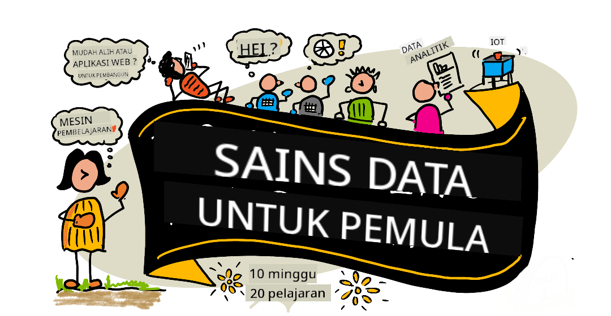

<!--
CO_OP_TRANSLATOR_METADATA:
{
  "original_hash": "dd9a1deb4da680b2cf11ba2e9f5a0a6e",
  "translation_date": "2025-09-29T22:02:10+00:00",
  "source_file": "README.md",
  "language_code": "ms"
}
-->
# Sains Data untuk Pemula - Kurikulum

Azure Cloud Advocates di Microsoft dengan sukacitanya menawarkan kurikulum 10 minggu, 20 pelajaran tentang Sains Data. Setiap pelajaran termasuk kuiz sebelum dan selepas pelajaran, arahan bertulis untuk melengkapkan pelajaran, penyelesaian, dan tugasan. Pedagogi berasaskan projek kami membolehkan anda belajar sambil membina, cara yang terbukti untuk kemahiran baharu 'melekat'.

**Terima kasih yang tulus kepada penulis kami:** [Jasmine Greenaway](https://www.twitter.com/paladique), [Dmitry Soshnikov](http://soshnikov.com), [Nitya Narasimhan](https://twitter.com/nitya), [Jalen McGee](https://twitter.com/JalenMcG), [Jen Looper](https://twitter.com/jenlooper), [Maud Levy](https://twitter.com/maudstweets), [Tiffany Souterre](https://twitter.com/TiffanySouterre), [Christopher Harrison](https://www.twitter.com/geektrainer).

**🙏 Terima kasih khas 🙏 kepada [Microsoft Student Ambassador](https://studentambassadors.microsoft.com/) penulis, pengulas dan penyumbang kandungan,** terutamanya Aaryan Arora, [Aditya Garg](https://github.com/AdityaGarg00), [Alondra Sanchez](https://www.linkedin.com/in/alondra-sanchez-molina/), [Ankita Singh](https://www.linkedin.com/in/ankitasingh007), [Anupam Mishra](https://www.linkedin.com/in/anupam--mishra/), [Arpita Das](https://www.linkedin.com/in/arpitadas01/), ChhailBihari Dubey, [Dibri Nsofor](https://www.linkedin.com/in/dibrinsofor), [Dishita Bhasin](https://www.linkedin.com/in/dishita-bhasin-7065281bb), [Majd Safi](https://www.linkedin.com/in/majd-s/), [Max Blum](https://www.linkedin.com/in/max-blum-6036a1186/), [Miguel Correa](https://www.linkedin.com/in/miguelmque/), [Mohamma Iftekher (Iftu) Ebne Jalal](https://twitter.com/iftu119), [Nawrin Tabassum](https://www.linkedin.com/in/nawrin-tabassum), [Raymond Wangsa Putra](https://www.linkedin.com/in/raymond-wp/), [Rohit Yadav](https://www.linkedin.com/in/rty2423), Samridhi Sharma, [Sanya Sinha](https://www.linkedin.com/mwlite/in/sanya-sinha-13aab1200),
[Sheena Narula](https://www.linkedin.com/in/sheena-narua-n/), [Tauqeer Ahmad](https://www.linkedin.com/in/tauqeerahmad5201/), Yogendrasingh Pawar , [Vidushi Gupta](https://www.linkedin.com/in/vidushi-gupta07/), [Jasleen Sondhi](https://www.linkedin.com/in/jasleen-sondhi/)

||
|:---:|
| Sains Data untuk Pemula - _Sketchnote oleh [@nitya](https://twitter.com/nitya)_ |

### 🌐 Sokongan Pelbagai Bahasa

#### Disokong melalui GitHub Action (Automatik & Sentiasa Terkini)

[Perancis](../fr/README.md) | [Sepanyol](../es/README.md) | [Jerman](../de/README.md) | [Rusia](../ru/README.md) | [Arab](../ar/README.md) | [Parsi (Farsi)](../fa/README.md) | [Urdu](../ur/README.md) | [Cina (Ringkas)](../zh/README.md) | [Cina (Tradisional, Macau)](../mo/README.md) | [Cina (Tradisional, Hong Kong)](../hk/README.md) | [Cina (Tradisional, Taiwan)](../tw/README.md) | [Jepun](../ja/README.md) | [Korea](../ko/README.md) | [Hindi](../hi/README.md) | [Bengali](../bn/README.md) | [Marathi](../mr/README.md) | [Nepali](../ne/README.md) | [Punjabi (Gurmukhi)](../pa/README.md) | [Portugis (Portugal)](../pt/README.md) | [Portugis (Brazil)](../br/README.md) | [Itali](../it/README.md) | [Poland](../pl/README.md) | [Turki](../tr/README.md) | [Yunani](../el/README.md) | [Thai](../th/README.md) | [Sweden](../sv/README.md) | [Denmark](../da/README.md) | [Norway](../no/README.md) | [Finland](../fi/README.md) | [Belanda](../nl/README.md) | [Ibrani](../he/README.md) | [Vietnam](../vi/README.md) | [Indonesia](../id/README.md) | [Melayu](./README.md) | [Tagalog (Filipina)](../tl/README.md) | [Swahili](../sw/README.md) | [Hungary](../hu/README.md) | [Czech](../cs/README.md) | [Slovak](../sk/README.md) | [Romania](../ro/README.md) | [Bulgaria](../bg/README.md) | [Serbia (Cyrillic)](../sr/README.md) | [Croatia](../hr/README.md) | [Slovenia](../sl/README.md) | [Ukraine](../uk/README.md) | [Burma (Myanmar)](../my/README.md)

**Jika anda ingin menambah sokongan bahasa terjemahan tambahan, senarai bahasa yang disokong boleh didapati [di sini](https://github.com/Azure/co-op-translator/blob/main/getting_started/supported-languages.md)**

#### Sertai Komuniti Kami 

Kami sedang menjalankan siri pembelajaran dengan AI di Discord, ketahui lebih lanjut dan sertai kami di [Siri Pembelajaran dengan AI](https://aka.ms/learnwithai/discord) dari 18 - 30 September, 2025. Anda akan mendapat tip dan trik menggunakan GitHub Copilot untuk Sains Data.

# Adakah anda seorang pelajar?

Mulakan dengan sumber berikut:

- [Halaman Hab Pelajar](https://docs.microsoft.com/en-gb/learn/student-hub?WT.mc_id=academic-77958-bethanycheum) Di halaman ini, anda akan menemui sumber untuk pemula, pakej pelajar dan juga cara untuk mendapatkan baucar sijil percuma. Ini adalah satu halaman yang patut anda tandai dan periksa dari semasa ke semasa kerana kami menukar kandungan sekurang-kurangnya setiap bulan.
- [Microsoft Learn Student Ambassadors](https://studentambassadors.microsoft.com?WT.mc_id=academic-77958-bethanycheum) Sertai komuniti global duta pelajar, ini boleh menjadi jalan anda ke Microsoft.

# Memulakan

> **Guru**: kami telah [menyertakan beberapa cadangan](for-teachers.md) tentang cara menggunakan kurikulum ini. Kami menghargai maklum balas anda [di forum perbincangan kami](https://github.com/microsoft/Data-Science-For-Beginners/discussions)!

> **[Pelajar](https://aka.ms/student-page)**: untuk menggunakan kurikulum ini secara individu, fork keseluruhan repo dan lengkapkan latihan secara sendiri, bermula dengan kuiz pra-kuliah. Kemudian baca kuliah dan lengkapkan aktiviti lain. Cuba buat projek dengan memahami pelajaran daripada menyalin kod penyelesaian; walau bagaimanapun, kod tersebut tersedia dalam folder /solutions dalam setiap pelajaran berorientasikan projek. Idea lain adalah membentuk kumpulan belajar dengan rakan-rakan dan melalui kandungan bersama-sama. Untuk kajian lanjut, kami mengesyorkan [Microsoft Learn](https://docs.microsoft.com/en-us/users/jenlooper-2911/collections/qprpajyoy3x0g7?WT.mc_id=academic-77958-bethanycheum).

## Kenali Pasukan

**Gif oleh** [Mohit Jaisal](https://www.linkedin.com/in/mohitjaisal)

> 🎥 Klik imej di atas untuk video tentang projek dan orang yang menciptanya!

## Pedagogi

Kami telah memilih dua prinsip pedagogi semasa membina kurikulum ini: memastikan ia berasaskan projek dan termasuk kuiz yang kerap. Menjelang akhir siri ini, pelajar akan mempelajari prinsip asas sains data, termasuk konsep etika, penyediaan data, pelbagai cara bekerja dengan data, visualisasi data, analisis data, kes penggunaan dunia sebenar sains data, dan banyak lagi.

Selain itu, kuiz berisiko rendah sebelum kelas menetapkan niat pelajar untuk mempelajari topik, manakala kuiz kedua selepas kelas memastikan pengekalan lanjut. Kurikulum ini direka untuk fleksibel dan menyeronokkan dan boleh diambil secara keseluruhan atau sebahagian. Projek bermula kecil dan menjadi semakin kompleks menjelang akhir kitaran 10 minggu.

> Temui [Kod Etika](CODE_OF_CONDUCT.md), [Penyumbangan](CONTRIBUTING.md), [Panduan Terjemahan](TRANSLATIONS.md). Kami mengalu-alukan maklum balas membina anda!

## Setiap pelajaran termasuk:

- Sketchnote pilihan
- Video tambahan pilihan
- Kuiz pemanasan sebelum pelajaran
- Pelajaran bertulis
- Untuk pelajaran berasaskan projek, panduan langkah demi langkah tentang cara membina projek
- Pemeriksaan pengetahuan
- Cabaran
- Bacaan tambahan
- Tugasan
- [Kuiz selepas pelajaran](https://ff-quizzes.netlify.app/en/)

> **Nota tentang kuiz**: Semua kuiz terdapat dalam folder Quiz-App, untuk sejumlah 40 kuiz dengan tiga soalan setiap satu. Ia dipautkan dari dalam pelajaran, tetapi aplikasi kuiz boleh dijalankan secara tempatan atau dideploy ke Azure; ikuti arahan dalam folder `quiz-app`. Ia sedang dilokalkan secara beransur-ansur.

## Pelajaran
||
|:---:|
| Data Science Untuk Pemula: Peta Jalan - _Sketchnote oleh [@nitya](https://twitter.com/nitya)_ |

| Nombor Pelajaran | Topik | Kumpulan Pelajaran | Objektif Pembelajaran | Pelajaran Berkaitan | Pengarang |
| :-----------: | :----------------------------------------: | :--------------------------------------------------: | :-----------------------------------------------------------------------------------------------------------------------------------------------------------------------: | :---------------------------------------------------------------------: | :----: |
| 01 | Mendefinisikan Sains Data | [Pengenalan](1-Introduction/README.md) | Belajar konsep asas di sebalik sains data dan bagaimana ia berkaitan dengan kecerdasan buatan, pembelajaran mesin, dan data besar. | [pelajaran](1-Introduction/01-defining-data-science/README.md) [video](https://youtu.be/beZ7Mb_oz9I) | [Dmitry](http://soshnikov.com) |
| 02 | Etika Sains Data | [Pengenalan](1-Introduction/README.md) | Konsep Etika Data, Cabaran & Kerangka Kerja. | [pelajaran](1-Introduction/02-ethics/README.md) | [Nitya](https://twitter.com/nitya) |
| 03 | Mendefinisikan Data | [Pengenalan](1-Introduction/README.md) | Bagaimana data diklasifikasikan dan sumber-sumber umumnya. | [pelajaran](1-Introduction/03-defining-data/README.md) | [Jasmine](https://www.twitter.com/paladique) |
| 04 | Pengenalan kepada Statistik & Kebarangkalian | [Pengenalan](1-Introduction/README.md) | Teknik matematik kebarangkalian dan statistik untuk memahami data. | [pelajaran](1-Introduction/04-stats-and-probability/README.md) [video](https://youtu.be/Z5Zy85g4Yjw) | [Dmitry](http://soshnikov.com) |
| 05 | Bekerja dengan Data Relasi | [Bekerja Dengan Data](2-Working-With-Data/README.md) | Pengenalan kepada data relasi dan asas penerokaan serta analisis data relasi dengan Structured Query Language, juga dikenali sebagai SQL (disebut “see-quell”). | [pelajaran](2-Working-With-Data/05-relational-databases/README.md) | [Christopher](https://www.twitter.com/geektrainer) | | |
| 06 | Bekerja dengan Data NoSQL | [Bekerja Dengan Data](2-Working-With-Data/README.md) | Pengenalan kepada data bukan relasi, pelbagai jenisnya, dan asas penerokaan serta analisis pangkalan data dokumen. | [pelajaran](2-Working-With-Data/06-non-relational/README.md) | [Jasmine](https://twitter.com/paladique)|
| 07 | Bekerja dengan Python | [Bekerja Dengan Data](2-Working-With-Data/README.md) | Asas menggunakan Python untuk penerokaan data dengan pustaka seperti Pandas. Pemahaman asas tentang pengaturcaraan Python disarankan. | [pelajaran](2-Working-With-Data/07-python/README.md) [video](https://youtu.be/dZjWOGbsN4Y) | [Dmitry](http://soshnikov.com) |
| 08 | Penyediaan Data | [Bekerja Dengan Data](2-Working-With-Data/README.md) | Topik tentang teknik data untuk membersihkan dan mengubah data bagi menangani cabaran data yang hilang, tidak tepat, atau tidak lengkap. | [pelajaran](2-Working-With-Data/08-data-preparation/README.md) | [Jasmine](https://www.twitter.com/paladique) |
| 09 | Memvisualkan Kuantiti | [Visualisasi Data](3-Data-Visualization/README.md) | Belajar cara menggunakan Matplotlib untuk memvisualkan data burung 🦆 | [pelajaran](3-Data-Visualization/09-visualization-quantities/README.md) | [Jen](https://twitter.com/jenlooper) |
| 10 | Memvisualkan Taburan Data | [Visualisasi Data](3-Data-Visualization/README.md) | Memvisualkan pemerhatian dan tren dalam satu interval. | [pelajaran](3-Data-Visualization/10-visualization-distributions/README.md) | [Jen](https://twitter.com/jenlooper) |
| 11 | Memvisualkan Perkadaran | [Visualisasi Data](3-Data-Visualization/README.md) | Memvisualkan peratusan diskret dan berkumpulan. | [pelajaran](3-Data-Visualization/11-visualization-proportions/README.md) | [Jen](https://twitter.com/jenlooper) |
| 12 | Memvisualkan Hubungan | [Visualisasi Data](3-Data-Visualization/README.md) | Memvisualkan hubungan dan korelasi antara set data dan pemboleh ubahnya. | [pelajaran](3-Data-Visualization/12-visualization-relationships/README.md) | [Jen](https://twitter.com/jenlooper) |
| 13 | Visualisasi Bermakna | [Visualisasi Data](3-Data-Visualization/README.md) | Teknik dan panduan untuk menjadikan visualisasi anda bernilai bagi penyelesaian masalah dan wawasan yang efektif. | [pelajaran](3-Data-Visualization/13-meaningful-visualizations/README.md) | [Jen](https://twitter.com/jenlooper) |
| 14 | Pengenalan kepada Kitaran Hayat Sains Data | [Kitaran Hayat](4-Data-Science-Lifecycle/README.md) | Pengenalan kepada kitaran hayat sains data dan langkah pertama untuk memperoleh serta mengekstrak data. | [pelajaran](4-Data-Science-Lifecycle/14-Introduction/README.md) | [Jasmine](https://twitter.com/paladique) |
| 15 | Menganalisis | [Kitaran Hayat](4-Data-Science-Lifecycle/README.md) | Fasa ini dalam kitaran hayat sains data memberi fokus kepada teknik untuk menganalisis data. | [pelajaran](4-Data-Science-Lifecycle/15-analyzing/README.md) | [Jasmine](https://twitter.com/paladique) | | |
| 16 | Komunikasi | [Kitaran Hayat](4-Data-Science-Lifecycle/README.md) | Fasa ini dalam kitaran hayat sains data memberi fokus kepada menyampaikan wawasan dari data dengan cara yang memudahkan pembuat keputusan untuk memahami. | [pelajaran](4-Data-Science-Lifecycle/16-communication/README.md) | [Jalen](https://twitter.com/JalenMcG) | | |
| 17 | Sains Data di Awan | [Data Awan](5-Data-Science-In-Cloud/README.md) | Siri pelajaran ini memperkenalkan sains data di awan dan manfaatnya. | [pelajaran](5-Data-Science-In-Cloud/17-Introduction/README.md) | [Tiffany](https://twitter.com/TiffanySouterre) dan [Maud](https://twitter.com/maudstweets) |
| 18 | Sains Data di Awan | [Data Awan](5-Data-Science-In-Cloud/README.md) | Melatih model menggunakan alat Low Code. |[pelajaran](5-Data-Science-In-Cloud/18-Low-Code/README.md) | [Tiffany](https://twitter.com/TiffanySouterre) dan [Maud](https://twitter.com/maudstweets) |
| 19 | Sains Data di Awan | [Data Awan](5-Data-Science-In-Cloud/README.md) | Menyebarkan model dengan Azure Machine Learning Studio. | [pelajaran](5-Data-Science-In-Cloud/19-Azure/README.md)| [Tiffany](https://twitter.com/TiffanySouterre) dan [Maud](https://twitter.com/maudstweets) |
| 20 | Sains Data di Dunia Nyata | [Di Dunia Nyata](6-Data-Science-In-Wild/README.md) | Projek yang didorong oleh sains data dalam dunia nyata. | [pelajaran](6-Data-Science-In-Wild/20-Real-World-Examples/README.md) | [Nitya](https://twitter.com/nitya) |

## GitHub Codespaces

Ikuti langkah-langkah ini untuk membuka contoh ini dalam Codespace:
1. Klik menu drop-down Code dan pilih pilihan Open with Codespaces.
2. Pilih + New codespace di bahagian bawah panel.
Untuk maklumat lanjut, lihat [dokumentasi GitHub](https://docs.github.com/en/codespaces/developing-in-codespaces/creating-a-codespace-for-a-repository#creating-a-codespace).

## VSCode Remote - Containers
Ikuti langkah-langkah ini untuk membuka repo ini dalam kontena menggunakan mesin tempatan anda dan VSCode dengan sambungan VS Code Remote - Containers:

1. Jika ini kali pertama anda menggunakan kontena pembangunan, pastikan sistem anda memenuhi prasyarat (contohnya, mempunyai Docker dipasang) dalam [dokumentasi memulakan](https://code.visualstudio.com/docs/devcontainers/containers#_getting-started).

Untuk menggunakan repositori ini, anda boleh membukanya dalam volume Docker yang terasing:

**Nota**: Di belakang tabir, ini akan menggunakan Remote-Containers: **Clone Repository in Container Volume...** arahan untuk mengklon kod sumber dalam volume Docker dan bukannya sistem fail tempatan. [Volumes](https://docs.docker.com/storage/volumes/) adalah mekanisme yang disukai untuk mengekalkan data kontena.

Atau buka versi repositori yang telah diklon atau dimuat turun secara tempatan:

- Klon repositori ini ke sistem fail tempatan anda.
- Tekan F1 dan pilih arahan **Remote-Containers: Open Folder in Container...**.
- Pilih salinan yang telah diklon folder ini, tunggu kontena untuk dimulakan, dan cuba perkara-perkara.

## Akses Luar Talian

Anda boleh menjalankan dokumentasi ini secara luar talian dengan menggunakan [Docsify](https://docsify.js.org/#/). Fork repo ini, [pasang Docsify](https://docsify.js.org/#/quickstart) pada mesin tempatan anda, kemudian di folder root repo ini, taip `docsify serve`. Laman web akan disediakan pada port 3000 di localhost anda: `localhost:3000`.

> Nota, notebook tidak akan dirender melalui Docsify, jadi apabila anda perlu menjalankan notebook, lakukan secara berasingan dalam VS Code yang menjalankan kernel Python.

## Kurikulum Lain

Pasukan kami menghasilkan kurikulum lain! Lihat:

- [Edge AI untuk Pemula](https://aka.ms/edgeai-for-beginners)
- [AI Agents untuk Pemula](https://aka.ms/ai-agents-beginners)
- [Generative AI untuk Pemula](https://aka.ms/genai-beginners)
- [Generative AI untuk Pemula .NET](https://github.com/microsoft/Generative-AI-for-beginners-dotnet)
- [Generative AI dengan JavaScript](https://github.com/microsoft/generative-ai-with-javascript)
- [Generative AI dengan Java](https://aka.ms/genaijava)
- [AI untuk Pemula](https://aka.ms/ai-beginners)
- [Data Science untuk Pemula](https://aka.ms/datascience-beginners)
- [Bash untuk Pemula](https://github.com/microsoft/bash-for-beginners)
- [ML untuk Pemula](https://aka.ms/ml-beginners)
- [Keselamatan Siber untuk Pemula](https://github.com/microsoft/Security-101) 
- [Web Dev untuk Pemula](https://aka.ms/webdev-beginners)
- [IoT untuk Pemula](https://aka.ms/iot-beginners)
- [Machine Learning untuk Pemula](https://aka.ms/ml-beginners)
- [Pembangunan XR untuk Pemula](https://aka.ms/xr-dev-for-beginners)
- [Menguasai GitHub Copilot untuk Pengaturcaraan Berpasangan AI](https://aka.ms/GitHubCopilotAI)
- [Pembangunan XR untuk Pemula](https://github.com/microsoft/xr-development-for-beginners)
- [Menguasai GitHub Copilot untuk Pembangun C#/.NET](https://github.com/microsoft/mastering-github-copilot-for-dotnet-csharp-developers)
- [Pilih Pengembaraan Copilot Anda Sendiri](https://github.com/microsoft/CopilotAdventures)

---

**Penafian**:  
Dokumen ini telah diterjemahkan menggunakan perkhidmatan terjemahan AI [Co-op Translator](https://github.com/Azure/co-op-translator). Walaupun kami berusaha untuk memastikan ketepatan, sila ambil perhatian bahawa terjemahan automatik mungkin mengandungi kesilapan atau ketidaktepatan. Dokumen asal dalam bahasa asalnya harus dianggap sebagai sumber yang berwibawa. Untuk maklumat yang kritikal, terjemahan manusia profesional adalah disyorkan. Kami tidak bertanggungjawab atas sebarang salah faham atau salah tafsir yang timbul daripada penggunaan terjemahan ini.