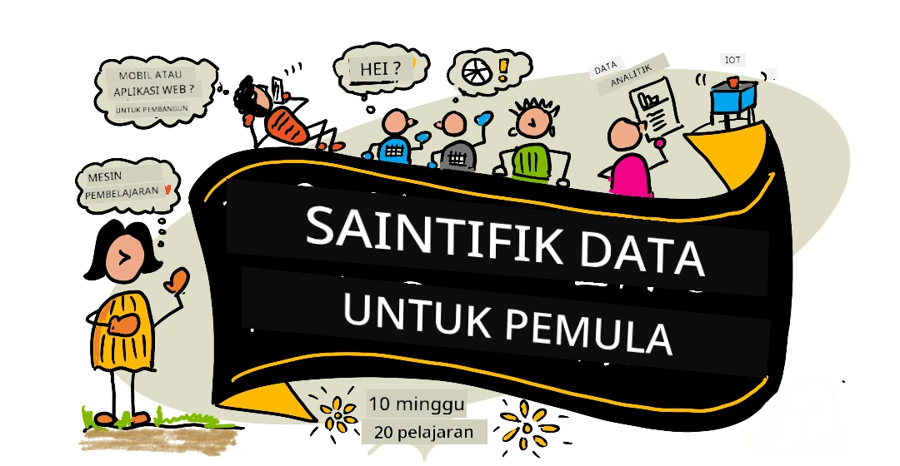
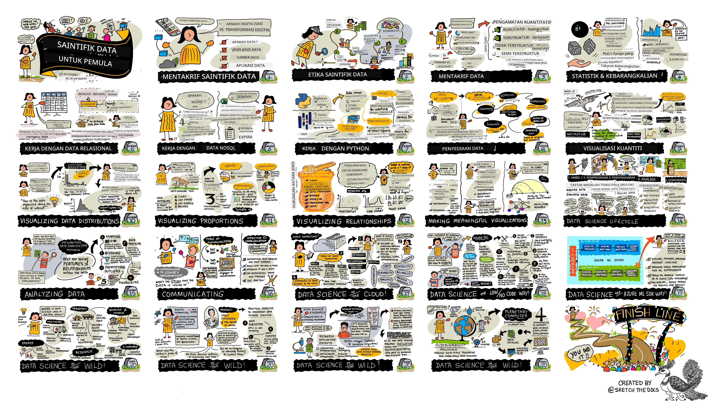

# Sains Data untuk Pemula - Kurikulum

[](https://github.com/codespaces/new?hide_repo_select=true&ref=main&repo=344191198)

[](https://github.com/microsoft/Data-Science-For-Beginners/blob/master/LICENSE)
[](https://GitHub.com/microsoft/Data-Science-For-Beginners/graphs/contributors/)
[](https://GitHub.com/microsoft/Data-Science-For-Beginners/issues/)
[](https://GitHub.com/microsoft/Data-Science-For-Beginners/pulls/)
[](http://makeapullrequest.com)

[](https://GitHub.com/microsoft/Data-Science-For-Beginners/watchers/)
[](https://GitHub.com/microsoft/Data-Science-For-Beginners/network/)
[](https://GitHub.com/microsoft/Data-Science-For-Beginners/stargazers/)


[](https://discord.gg/nTYy5BXMWG)

[](https://aka.ms/foundry/forum)

Pendukung Azure Cloud di Microsoft dengan sukacitanya menawarkan kurikulum 10 minggu, 20 pelajaran mengenai Sains Data. Setiap pelajaran merangkumi kuiz pra-pelajaran dan pasca-pelajaran, arahan bertulis untuk menyelesaikan pelajaran, satu penyelesaian, dan tugasan. Pedagogi berasaskan projek kami membolehkan anda belajar sambil membina, satu cara terbukti supaya kemahiran baru terus melekat.

**Terima kasih yang tidak terhingga kepada penulis kami:** [Jasmine Greenaway](https://www.twitter.com/paladique), [Dmitry Soshnikov](http://soshnikov.com), [Nitya Narasimhan](https://twitter.com/nitya), [Jalen McGee](https://twitter.com/JalenMcG), [Jen Looper](https://twitter.com/jenlooper), [Maud Levy](https://twitter.com/maudstweets), [Tiffany Souterre](https://twitter.com/TiffanySouterre), [Christopher Harrison](https://www.twitter.com/geektrainer).

**🙏 Terima kasih khusus 🙏 kepada penulis, penilai dan penyumbang kandungan [Duta Pelajar Microsoft](https://studentambassadors.microsoft.com/),** terutamanya Aaryan Arora, [Aditya Garg](https://github.com/AdityaGarg00), [Alondra Sanchez](https://www.linkedin.com/in/alondra-sanchez-molina/), [Ankita Singh](https://www.linkedin.com/in/ankitasingh007), [Anupam Mishra](https://www.linkedin.com/in/anupam--mishra/), [Arpita Das](https://www.linkedin.com/in/arpitadas01/), ChhailBihari Dubey, [Dibri Nsofor](https://www.linkedin.com/in/dibrinsofor), [Dishita Bhasin](https://www.linkedin.com/in/dishita-bhasin-7065281bb), [Majd Safi](https://www.linkedin.com/in/majd-s/), [Max Blum](https://www.linkedin.com/in/max-blum-6036a1186/), [Miguel Correa](https://www.linkedin.com/in/miguelmque/), [Mohamma Iftekher (Iftu) Ebne Jalal](https://twitter.com/iftu119), [Nawrin Tabassum](https://www.linkedin.com/in/nawrin-tabassum), [Raymond Wangsa Putra](https://www.linkedin.com/in/raymond-wp/), [Rohit Yadav](https://www.linkedin.com/in/rty2423), Samridhi Sharma, [Sanya Sinha](https://www.linkedin.com/mwlite/in/sanya-sinha-13aab1200),
[Sheena Narula](https://www.linkedin.com/in/sheena-narua-n/), [Tauqeer Ahmad](https://www.linkedin.com/in/tauqeerahmad5201/), Yogendrasingh Pawar , [Vidushi Gupta](https://www.linkedin.com/in/vidushi-gupta07/), [Jasleen Sondhi](https://www.linkedin.com/in/jasleen-sondhi/)

||
|:---:|
| Sains Data untuk Pemula - _Sketchnote oleh [@nitya](https://twitter.com/nitya)_ |

### 🌐 Sokongan Pelbagai Bahasa

#### Disokong melalui Tindakan GitHub (Automatik & Sentiasa Terkini)

<!-- CO-OP TRANSLATOR LANGUAGES TABLE START -->
[Arabic](../ar/README.md) | [Bengali](../bn/README.md) | [Bulgarian](../bg/README.md) | [Burmese (Myanmar)](../my/README.md) | [Chinese (Simplified)](../zh-CN/README.md) | [Chinese (Traditional, Hong Kong)](../zh-HK/README.md) | [Chinese (Traditional, Macau)](../zh-MO/README.md) | [Chinese (Traditional, Taiwan)](../zh-TW/README.md) | [Croatian](../hr/README.md) | [Czech](../cs/README.md) | [Danish](../da/README.md) | [Dutch](../nl/README.md) | [Estonian](../et/README.md) | [Finnish](../fi/README.md) | [French](../fr/README.md) | [German](../de/README.md) | [Greek](../el/README.md) | [Hebrew](../he/README.md) | [Hindi](../hi/README.md) | [Hungarian](../hu/README.md) | [Indonesian](../id/README.md) | [Italian](../it/README.md) | [Japanese](../ja/README.md) | [Kannada](../kn/README.md) | [Khmer](../km/README.md) | [Korean](../ko/README.md) | [Lithuanian](../lt/README.md) | [Malay](./README.md) | [Malayalam](../ml/README.md) | [Marathi](../mr/README.md) | [Nepali](../ne/README.md) | [Nigerian Pidgin](../pcm/README.md) | [Norwegian](../no/README.md) | [Persian (Farsi)](../fa/README.md) | [Polish](../pl/README.md) | [Portuguese (Brazil)](../pt-BR/README.md) | [Portuguese (Portugal)](../pt-PT/README.md) | [Punjabi (Gurmukhi)](../pa/README.md) | [Romanian](../ro/README.md) | [Russian](../ru/README.md) | [Serbian (Cyrillic)](../sr/README.md) | [Slovak](../sk/README.md) | [Slovenian](../sl/README.md) | [Spanish](../es/README.md) | [Swahili](../sw/README.md) | [Swedish](../sv/README.md) | [Tagalog (Filipino)](../tl/README.md) | [Tamil](../ta/README.md) | [Telugu](../te/README.md) | [Thai](../th/README.md) | [Turkish](../tr/README.md) | [Ukrainian](../uk/README.md) | [Urdu](../ur/README.md) | [Vietnamese](../vi/README.md)

> **Lebih suka Klon secara Tempatan?**
>
> Repositori ini termasuk lebih daripada 50 terjemahan bahasa yang secara ketara meningkatkan saiz muat turun. Untuk klon tanpa terjemahan, gunakan sparse checkout:
>
> **Bash / macOS / Linux:**
> ```bash
> git clone --filter=blob:none --sparse https://github.com/microsoft/Data-Science-For-Beginners.git
> cd Data-Science-For-Beginners
> git sparse-checkout set --no-cone '/*' '!translations' '!translated_images'
> ```
>
> **CMD (Windows):**
> ```cmd
> git clone --filter=blob:none --sparse https://github.com/microsoft/Data-Science-For-Beginners.git
> cd Data-Science-For-Beginners
> git sparse-checkout set --no-cone "/*" "!translations" "!translated_images"
> ```
>
> Ini memberi anda segala yang diperlukan untuk menyelesaikan kursus dengan muat turun yang lebih pantas.
<!-- CO-OP TRANSLATOR LANGUAGES TABLE END -->

**Jika anda ingin menyokong bahasa terjemahan tambahan disenaraikan [di sini](https://github.com/Azure/co-op-translator/blob/main/getting_started/supported-languages.md)**

#### Sertai Komuniti Kami 
[](https://discord.gg/nTYy5BXMWG)

Kami mempunyai siri belajar Discord dengan AI sedang berlangsung, ketahui lebih lanjut dan sertai kami di [Siri Belajar dengan AI](https://aka.ms/learnwithai/discord) dari 18 - 30 September, 2025. Anda akan mendapat petua dan trik menggunakan GitHub Copilot untuk Sains Data.


# Adakah anda seorang pelajar?

Mulakan dengan sumber berikut:

- [Halaman Hub Pelajar](https://docs.microsoft.com/en-gb/learn/student-hub?WT.mc_id=academic-77958-bethanycheum) Dalam halaman ini, anda akan menemui sumber untuk pemula, Pakej Pelajar dan juga cara untuk mendapatkan baucar sijil percuma. Ini adalah satu halaman yang anda ingin tandakan dan semak dari masa ke masa kerana kami menukar kandungan sekurang-kurangnya setiap bulan.
- [Duta Pelajar Microsoft Learn](https://studentambassadors.microsoft.com?WT.mc_id=academic-77958-bethanycheum) Sertai komuniti global duta pelajar, ini boleh menjadi jalan anda ke Microsoft.

# Mula

## 📚 Dokumentasi

- **[Panduan Pemasangan](INSTALLATION.md)** - Arahan langkah demi langkah untuk pemula
- **[Panduan Penggunaan](USAGE.md)** - Contoh dan aliran kerja biasa
- **[Penyelesaian Masalah](TROUBLESHOOTING.md)** - Penyelesaian kepada masalah biasa
- **[Panduan Menyumbang](CONTRIBUTING.md)** - Cara menyumbang kepada projek ini
- **[Untuk Guru](for-teachers.md)** - Panduan pengajaran dan sumber kelas

## 👨‍🎓 Untuk Pelajar
> **Pemula Lengkap**: Baru dalam sains data? Mulakan dengan [contoh mesra pemula kami](examples/README.md)! Contoh mudah dan lengkap dengan komen ini akan membantu anda memahami asas sebelum menyelami kurikulum penuh.
> **[Pelajar](https://aka.ms/student-page)**: untuk menggunakan kurikulum ini secara sendiri, buat garpu keseluruhan repositori dan selesaikan latihan sendiri, bermula dengan kuiz pra-ceramah. Kemudian baca ceramah dan selesaikan aktiviti lain. Cuba buat projek dengan memahami pelajaran daripada hanya menyalin kod penyelesaian; namun kod itu tersedia dalam folder /solutions dalam setiap pelajaran berfokus projek. Satu lagi idea adalah membentuk kumpulan belajar bersama rakan dan lalui kandungan bersama. Untuk kajian lanjut, kami cadangkan [Microsoft Learn](https://docs.microsoft.com/en-us/users/jenlooper-2911/collections/qprpajyoy3x0g7?WT.mc_id=academic-77958-bethanycheum).

**Mula Pantas:**
1. Semak [Panduan Pemasangan](INSTALLATION.md) untuk menyediakan persekitaran anda
2. Tinjau [Panduan Penggunaan](USAGE.md) untuk belajar cara menggunakan kurikulum
3. Mula dengan Pelajaran 1 dan teruskan secara berurutan
4. Sertai [komuniti Discord kami](https://aka.ms/ds4beginners/discord) untuk sokongan

## 👩‍🏫 Untuk Guru
> **Guru**: kami telah [menyertakan beberapa cadangan](for-teachers.md) tentang cara menggunakan kurikulum ini. Kami mengalu-alukan maklum balas anda [dalam forum perbincangan kami](https://github.com/microsoft/Data-Science-For-Beginners/discussions)!

## Kenali Pasukan

[](https://youtu.be/8mzavjQSMM4 "Video promo")

**Gif oleh** [Mohit Jaisal](https://www.linkedin.com/in/mohitjaisal)

> 🎥 Klik imej di atas untuk menonton video mengenai projek ini dan orang-orang yang menciptakannya!

## Pedagogi

Kami telah memilih dua prinsip pedagogi semasa membina kurikulum ini: memastikan ia berasaskan projek dan merangkumi kuiz yang kerap. Menjelang akhir siri ini, pelajar akan mempelajari prinsip asas ilmu data, termasuk konsep etika, penyediaan data, pelbagai cara bekerja dengan data, visualisasi data, analisis data, kes penggunaan ilmu data dunia sebenar, dan banyak lagi.

Selain itu, kuiz bertaraf rendah sebelum kelas menetapkan hasrat pelajar untuk mempelajari topik, manakala kuiz kedua selepas kelas memastikan pengekalan yang lebih baik. Kurikulum ini direka untuk fleksibel dan menyeronokkan serta boleh diikuti secara keseluruhan atau sebahagian. Projek-projek bermula kecil dan menjadi semakin kompleks menjelang akhir kitaran 10 minggu.

> Dapatkan [Kod Etika](CODE_OF_CONDUCT.md), [Sumbangan](CONTRIBUTING.md), dan garis panduan [Terjemahan](TRANSLATIONS.md) kami. Kami mengalu-alukan maklum balas membina anda!

## Setiap pelajaran merangkumi:

- Sketchnote pilihan
- Video tambahan pilihan
- Kuiz pemanasan pra-pelajaran
- Pelajaran bertulis
- Untuk pelajaran berasaskan projek, panduan langkah demi langkah tentang cara membina projek
- Semakan pengetahuan
- Cabaran
- Bacaan tambahan
- Tugasan
- [Kuiz pasca-pelajaran](https://ff-quizzes.netlify.app/en/)

> **Nota tentang kuiz**: Semua kuiz disimpan dalam folder Quiz-App, dengan jumlah 40 kuiz masing-masing mengandungi tiga soalan. Ia dihubungkan dari dalam pelajaran, tetapi aplikasi kuiz boleh dijalankan secara tempatan atau dikerah ke Azure; ikut arahan dalam folder `quiz-app`. Ia sedang diperingkatkan penterjemahannya secara berperingkat.

## 🎓 Contoh Mesra Pemula

**Baru dalam Ilmu Data?** Kami telah menyediakan direktori [contoh](examples/README.md) khas dengan kod ringkas dan ulasan terperinci untuk membantu anda memulakan:

- 🌟 **Hello World** - Program ilmu data pertama anda
- 📂 **Memuatkan Data** - Belajar membaca dan meneroka set data
- 📊 **Analisis Mudah** - Mengira statistik dan mencari corak
- 📈 **Visualisasi Asas** - Membuat carta dan graf
- 🔬 **Projek Dunia Sebenar** - Aliran kerja lengkap dari mula hingga selesai

Setiap contoh termasuk ulasan terperinci yang menerangkan setiap langkah, sangat sesuai untuk pemula mutlak!

👉 **[Mula dengan contoh](examples/README.md)** 👈

## Pelajaran


||
|:---:|
| Ilmu Data untuk Pemula: Peta Jalan - _Sketchnote oleh [@nitya](https://twitter.com/nitya)_ |


| Nombor Pelajaran | Topik | Kumpulan Pelajaran | Objektif Pembelajaran | Pelajaran Berkait | Penulis |
| :-----------: | :----------------------------------------: | :--------------------------------------------------: | :-----------------------------------------------------------------------------------------------------------------------------------------------------------------------: | :---------------------------------------------------------------------: | :----: |
| 01 | Mendefinisikan Ilmu Data | [Pengenalan](1-Introduction/README.md) | Pelajari konsep asas di sebalik ilmu data dan bagaimana ia berkait dengan kecerdasan buatan, pembelajaran mesin, dan data besar. | [pelajaran](1-Introduction/01-defining-data-science/README.md) [video](https://youtu.be/beZ7Mb_oz9I) | [Dmitry](http://soshnikov.com) |
| 02 | Etika Ilmu Data | [Pengenalan](1-Introduction/README.md) | Konsep Etika Data, Cabaran & Rangka Kerja. | [pelajaran](1-Introduction/02-ethics/README.md) | [Nitya](https://twitter.com/nitya) |
| 03 | Mendefinisikan Data | [Pengenalan](1-Introduction/README.md) | Cara data diklasifikasikan dan sumber biasa data. | [pelajaran](1-Introduction/03-defining-data/README.md) | [Jasmine](https://www.twitter.com/paladique) |
| 04 | Pengenalan kepada Statistik & Kebarangkalian | [Pengenalan](1-Introduction/README.md) | Teknik matematik kebarangkalian dan statistik untuk memahami data. | [pelajaran](1-Introduction/04-stats-and-probability/README.md) [video](https://youtu.be/Z5Zy85g4Yjw) | [Dmitry](http://soshnikov.com) |
| 05 | Bekerja dengan Data Relasi | [Bekerja Dengan Data](2-Working-With-Data/README.md) | Pengenalan kepada data relasi dan asas meneroka serta menganalisis data relasi dengan Structured Query Language, juga dikenali sebagai SQL (disebut "see-quell"). | [pelajaran](2-Working-With-Data/05-relational-databases/README.md) | [Christopher](https://www.twitter.com/geektrainer) | | |
| 06 | Bekerja dengan Data NoSQL | [Bekerja Dengan Data](2-Working-With-Data/README.md) | Pengenalan kepada data bukan relasi, pelbagai jenisnya dan asas meneroka serta menganalisis pangkalan data dokumen. | [pelajaran](2-Working-With-Data/06-non-relational/README.md) | [Jasmine](https://twitter.com/paladique)|
| 07 | Bekerja dengan Python | [Bekerja Dengan Data](2-Working-With-Data/README.md) | Asas menggunakan Python untuk penerokaan data dengan perpustakaan seperti Pandas. Pemahaman asas pengaturcaraan Python disyorkan. | [pelajaran](2-Working-With-Data/07-python/README.md) [video](https://youtu.be/dZjWOGbsN4Y) | [Dmitry](http://soshnikov.com) |
| 08 | Penyediaan Data | [Bekerja Dengan Data](2-Working-With-Data/README.md) | Topik teknik data untuk membersihkan dan mengubah data untuk menangani cabaran data hilang, tidak tepat, atau tidak lengkap. | [pelajaran](2-Working-With-Data/08-data-preparation/README.md) | [Jasmine](https://www.twitter.com/paladique) |
| 09 | Visualisasi Kuantiti | [Visualisasi Data](3-Data-Visualization/README.md) | Belajar menggunakan Matplotlib untuk memvisualisasikan data burung 🦆 | [pelajaran](3-Data-Visualization/09-visualization-quantities/README.md) | [Jen](https://twitter.com/jenlooper) |
| 10 | Visualisasi Taburan Data | [Visualisasi Data](3-Data-Visualization/README.md) | Memvisualisasi pemerhatian dan tren dalam satu selang. | [pelajaran](3-Data-Visualization/10-visualization-distributions/README.md) | [Jen](https://twitter.com/jenlooper) |
| 11 | Visualisasi Peratusan | [Visualisasi Data](3-Data-Visualization/README.md) | Memvisualisasikan peratusan diskret dan berkumpulan. | [pelajaran](3-Data-Visualization/11-visualization-proportions/README.md) | [Jen](https://twitter.com/jenlooper) |
| 12 | Visualisasi Hubungan | [Visualisasi Data](3-Data-Visualization/README.md) | Memvisualisasikan hubungan dan korelasi antara set data dan pembolehubahnya. | [pelajaran](3-Data-Visualization/12-visualization-relationships/README.md) | [Jen](https://twitter.com/jenlooper) |
| 13 | Visualisasi Bermakna | [Visualisasi Data](3-Data-Visualization/README.md) | Teknik dan panduan untuk menjadikan visualisasi anda bernilai bagi penyelesaian masalah dan kefahaman yang berkesan. | [pelajaran](3-Data-Visualization/13-meaningful-visualizations/README.md) | [Jen](https://twitter.com/jenlooper) |
| 14 | Pengenalan kepada kitaran hayat Ilmu Data | [Kitaran Hayat](4-Data-Science-Lifecycle/README.md) | Pengenalan kepada kitaran hayat ilmu data dan langkah pertama untuk memperoleh serta mengekstrak data. | [pelajaran](4-Data-Science-Lifecycle/14-Introduction/README.md) | [Jasmine](https://twitter.com/paladique) |
| 15 | Menganalisis | [Kitaran Hayat](4-Data-Science-Lifecycle/README.md) | Fasa ini dalam kitaran hayat ilmu data menumpukan pada teknik untuk menganalisis data. | [pelajaran](4-Data-Science-Lifecycle/15-analyzing/README.md) | [Jasmine](https://twitter.com/paladique) | | |
| 16 | Komunikasi | [Kitaran Hayat](4-Data-Science-Lifecycle/README.md) | Fasa ini dalam kitaran hayat ilmu data menumpukan pada penyampaian pandangan dari data dengan cara yang memudahkan pembuat keputusan memahami. | [pelajaran](4-Data-Science-Lifecycle/16-communication/README.md) | [Jalen](https://twitter.com/JalenMcG) | | |
| 17 | Ilmu Data di Awan | [Data Awan](5-Data-Science-In-Cloud/README.md) | Siri pelajaran ini memperkenalkan ilmu data di awan dan manfaatnya. | [pelajaran](5-Data-Science-In-Cloud/17-Introduction/README.md) | [Tiffany](https://twitter.com/TiffanySouterre) dan [Maud](https://twitter.com/maudstweets) |
| 18 | Ilmu Data di Awan | [Data Awan](5-Data-Science-In-Cloud/README.md) | Melatih model menggunakan alat Kod Rendah. |[pelajaran](5-Data-Science-In-Cloud/18-Low-Code/README.md) | [Tiffany](https://twitter.com/TiffanySouterre) dan [Maud](https://twitter.com/maudstweets) |
| 19 | Ilmu Data di Awan | [Data Awan](5-Data-Science-In-Cloud/README.md) | Menyebarkan model dengan Azure Machine Learning Studio. | [pelajaran](5-Data-Science-In-Cloud/19-Azure/README.md)| [Tiffany](https://twitter.com/TiffanySouterre) dan [Maud](https://twitter.com/maudstweets) |
| 20 | Ilmu Data di Dunia Nyata | [Di Dunia Nyata](6-Data-Science-In-Wild/README.md) | Projek berasaskan ilmu data dalam dunia sebenar. | [pelajaran](6-Data-Science-In-Wild/20-Real-World-Examples/README.md) | [Nitya](https://twitter.com/nitya) |

## GitHub Codespaces

Ikuti langkah-langkah ini untuk membuka contoh ini dalam Codespace:
1. Klik menu lungsur Code dan pilih pilihan Open with Codespaces.
2. Pilih + New codespace di bahagian bawah pane.
Untuk maklumat lanjut, lihat [dokumentasi GitHub](https://docs.github.com/en/codespaces/developing-in-codespaces/creating-a-codespace-for-a-repository#creating-a-codespace).

## VSCode Remote - Containers
Ikuti langkah berikut untuk membuka repo ini dalam kontena menggunakan mesin tempatan anda dan VSCode dengan sambungan VS Code Remote - Containers:

1. Jika ini kali pertama anda menggunakan kontena pembangunan, sila pastikan sistem anda memenuhi prasyarat (contoh: telah memasang Docker) dalam [dokumentasi memulakan](https://code.visualstudio.com/docs/devcontainers/containers#_getting-started).

Untuk menggunakan repositori ini, anda boleh membuka repo dalam volum Docker yang terasing:

**Nota**: Di balik tabir, ini akan menggunakan perintah Remote-Containers: **Clone Repository in Container Volume...** untuk mengklon kod sumber dalam volum Docker dan bukan sistem fail tempatan. [Volum](https://docs.docker.com/storage/volumes/) adalah mekanisme yang disyorkan untuk menyimpan data kontena.

Atau buka salinan repo yang telah diklon atau dimuat turun secara tempatan:

- Klon repositori ini ke sistem fail tempatan anda.
- Tekan F1 dan pilih perintah **Remote-Containers: Open Folder in Container...**.
- Pilih salinan folder ini yang telah diklon, tunggu kontena dimulakan, dan cuba gunakan.

## Akses Luar Talian

Anda boleh menjalankan dokumentasi ini secara offline dengan menggunakan [Docsify](https://docsify.js.org/#/). Forq repo ini, [pasang Docsify](https://docsify.js.org/#/quickstart) pada mesin tempatan anda, kemudian dalam folder akar repo ini, taip `docsify serve`. Laman web akan dihidangkan pada port 3000 di localhost anda: `localhost:3000`.

> Nota, buku nota tidak akan dipaparkan melalui Docsify, jadi apabila perlu menjalankan buku nota, lakukan secara berasingan dalam VS Code yang menjalankan kernel Python.

## Kurikulum Lain

Pasukan kami juga menghasilkan kurikulum lain! Lihat:

<!-- CO-OP TRANSLATOR OTHER COURSES START -->
### LangChain
[](https://aka.ms/langchain4j-for-beginners)
[](https://aka.ms/langchainjs-for-beginners?WT.mc_id=m365-94501-dwahlin)
[](https://github.com/microsoft/langchain-for-beginners?WT.mc_id=m365-94501-dwahlin)
---

### Azure / Edge / MCP / Ejen
[](https://github.com/microsoft/AZD-for-beginners?WT.mc_id=academic-105485-koreyst)
[](https://github.com/microsoft/edgeai-for-beginners?WT.mc_id=academic-105485-koreyst)
[](https://github.com/microsoft/mcp-for-beginners?WT.mc_id=academic-105485-koreyst)
[](https://github.com/microsoft/ai-agents-for-beginners?WT.mc_id=academic-105485-koreyst)

---
 
### Siri AI Generatif
[](https://github.com/microsoft/generative-ai-for-beginners?WT.mc_id=academic-105485-koreyst)
[-9333EA?style=for-the-badge&labelColor=E5E7EB&color=9333EA)](https://github.com/microsoft/Generative-AI-for-beginners-dotnet?WT.mc_id=academic-105485-koreyst)
[-C084FC?style=for-the-badge&labelColor=E5E7EB&color=C084FC)](https://github.com/microsoft/generative-ai-for-beginners-java?WT.mc_id=academic-105485-koreyst)
[-E879F9?style=for-the-badge&labelColor=E5E7EB&color=E879F9)](https://github.com/microsoft/generative-ai-with-javascript?WT.mc_id=academic-105485-koreyst)

---
 
### Pembelajaran Teras
[](https://aka.ms/ml-beginners?WT.mc_id=academic-105485-koreyst)
[](https://aka.ms/datascience-beginners?WT.mc_id=academic-105485-koreyst)
[](https://aka.ms/ai-beginners?WT.mc_id=academic-105485-koreyst)
[](https://github.com/microsoft/Security-101?WT.mc_id=academic-96948-sayoung)
[](https://aka.ms/webdev-beginners?WT.mc_id=academic-105485-koreyst)
[](https://aka.ms/iot-beginners?WT.mc_id=academic-105485-koreyst)
[](https://github.com/microsoft/xr-development-for-beginners?WT.mc_id=academic-105485-koreyst)

---
 
### Siri Copilot
[](https://aka.ms/GitHubCopilotAI?WT.mc_id=academic-105485-koreyst)
[](https://github.com/microsoft/mastering-github-copilot-for-dotnet-csharp-developers?WT.mc_id=academic-105485-koreyst)
[](https://github.com/microsoft/CopilotAdventures?WT.mc_id=academic-105485-koreyst)
<!-- CO-OP TRANSLATOR OTHER COURSES END -->

## Mendapatkan Bantuan

**Menghadapi masalah?** Semak [Panduan Penyelesaian Masalah](TROUBLESHOOTING.md) kami untuk penyelesaian kepada masalah biasa.

Jika anda tersekat atau mempunyai sebarang soalan tentang membina aplikasi AI. Sertai pelajar lain dan pembangun berpengalaman dalam perbincangan mengenai MCP. Ia adalah komuniti yang menyokong di mana soalan dialu-alukan dan ilmu dikongsi dengan bebas.

[](https://discord.gg/nTYy5BXMWG)

Jika anda mempunyai maklum balas produk atau ralat semasa membina, lawati:

[](https://aka.ms/foundry/forum)

---

<!-- CO-OP TRANSLATOR DISCLAIMER START -->
**Penafian**:  
Dokumen ini telah diterjemahkan menggunakan perkhidmatan terjemahan AI [Co-op Translator](https://github.com/Azure/co-op-translator). Walaupun kami berusaha untuk ketepatan, sila ambil maklum bahawa terjemahan automatik mungkin mengandungi kesilapan atau ketidaktepatan. Dokumen asal dalam bahasa asalnya harus dianggap sebagai sumber yang sahih. Untuk maklumat penting, terjemahan profesional oleh manusia adalah disyorkan. Kami tidak bertanggungjawab atas sebarang salah faham atau salah tafsir yang timbul daripada penggunaan terjemahan ini.
<!-- CO-OP TRANSLATOR DISCLAIMER END -->