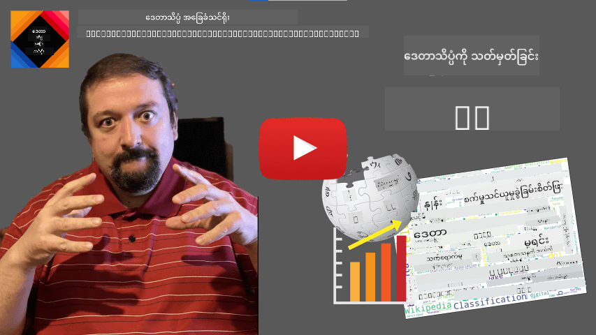

<!--
CO_OP_TRANSLATOR_METADATA:
{
  "original_hash": "2583a9894af7123b2fcae3376b14c035",
  "translation_date": "2025-08-30T19:31:30+00:00",
  "source_file": "1-Introduction/01-defining-data-science/README.md",
  "language_code": "my"
}
-->
# ဒေတာ သိပ္ပံကို သတ်မှတ်ခြင်း

|  ](../../sketchnotes/01-Definitions.png) |
| :----------------------------------------------------------------------------------------------------: |
|              ဒေတာ သိပ္ပံကို သတ်မှတ်ခြင်း - _Sketchnote by [@nitya](https://twitter.com/nitya)_               |

---

## [မဆွေးနွေးမီ မေးခွန်းများ](https://purple-hill-04aebfb03.1.azurestaticapps.net/quiz/0)

## ဒေတာ ဆိုတာဘာလဲ?
နေ့စဉ်ဘဝမှာ ဒေတာတွေက ကျွန်တော်တို့ကို အမြဲဝန်းရံနေပါတယ်။ သင်အခုဖတ်နေတဲ့ စာသားက ဒေတာတစ်ခုပါပဲ။ သင့်ဖုန်းထဲမှာရှိတဲ့ သူငယ်ချင်းတွေရဲ့ ဖုန်းနံပါတ်စာရင်းက ဒေတာတစ်ခုဖြစ်သလို၊ နာရီမှာ ပြထားတဲ့ လက်ရှိအချိန်လည်း ဒေတာတစ်ခုပါပဲ။ လူသားတွေဟာ ဒေတာနဲ့ သဘာဝအတိုင်း အလုပ်လုပ်တတ်ကြပါတယ်၊ ဥပမာ - ငွေကို ရေတွက်တာ၊ သူငယ်ချင်းတွေကို စာရေးတာတွေပါ။

ဒါပေမယ့် ကွန်ပျူတာတွေ ပေါ်ထွက်လာပြီးနောက် ဒေတာဟာ အရေးကြီးမှု ပိုများလာပါတယ်။ ကွန်ပျူတာတွေရဲ့ အဓိကအလုပ်က တွက်ချက်မှုတွေကို လုပ်ဆောင်တာဖြစ်ပေမယ့် ဒေတာမရှိရင် အလုပ်မလုပ်နိုင်ပါဘူး။ ဒါကြောင့် ကွန်ပျူတာတွေ ဒေတာကို ဘယ်လို သိမ်းဆည်းပြီး လုပ်ဆောင်တတ်သလဲဆိုတာကို နားလည်ဖို့ လိုအပ်ပါတယ်။

အင်တာနက် ပေါ်ထွက်လာပြီးနောက် ကွန်ပျူတာတွေဟာ ဒေတာကို ကိုင်တွယ်စီမံတဲ့ စက်ပစ္စည်းအဖြစ် ပိုပြီး အရေးကြီးလာပါတယ်။ သင်စဉ်းစားကြည့်ပါ - အခုဆိုရင် ကျွန်တော်တို့ဟာ တွက်ချက်မှုတွေကို လုပ်တာထက် ဒေတာကို ကိုင်တွယ်ပြီး ဆက်သွယ်မှုလုပ်တာ ပိုများလာပါတယ်။ သူငယ်ချင်းကို အီးမေးလ်ရေးတာ၊ အင်တာနက်မှာ အချက်အလက်ရှာတာတွေဟာ အခြေခံအားဖြင့် ဒေတာကို ဖန်တီးတာ၊ သိမ်းဆည်းတာ၊ ပို့ဆောင်တာ၊ ပြောင်းလဲတာတွေပါပဲ။
> သင်ကွန်ပျူတာကို တကယ်တမ်း တွက်ချက်မှုလုပ်ဖို့ အသုံးပြုခဲ့တဲ့ နောက်ဆုံးအကြိမ်ကို သတိရနိုင်ပါသလား?

## ဒေတာ သိပ္ပံ ဆိုတာဘာလဲ?

[Wikipedia](https://en.wikipedia.org/wiki/Data_science) မှာ **ဒေတာ သိပ္ပံ** ကို *သိပ္ပံနည်းလမ်းတွေကို အသုံးပြုပြီး ဖွဲ့စည်းထားတဲ့ ဒေတာနဲ့ မဖွဲ့စည်းထားတဲ့ ဒေတာတွေထဲကနေ အသိပညာနဲ့ အချက်အလက်တွေကို ထုတ်ယူပြီး၊ အက်ရှင်လုပ်ဆောင်နိုင်တဲ့ အချက်အလက်တွေကို အမျိုးမျိုးသော လုပ်ငန်းခွင်တွေမှာ အသုံးချတဲ့ သိပ္ပံနယ်ပယ်တစ်ခု* လို့ သတ်မှတ်ထားပါတယ်။

ဒီအဓိပ္ပာယ်မှာ ဒေတာ သိပ္ပံရဲ့ အရေးကြီးတဲ့ အချက်အချို့ကို ဖော်ပြထားပါတယ် -

* ဒေတာ သိပ္ပံရဲ့ အဓိကရည်မှန်းချက်က **အသိပညာကို ထုတ်ယူ**ဖို့ ဖြစ်ပါတယ်၊ ဒါမှဆိုရင် ဒေတာကို **နားလည်**ပြီး၊ ဖုံးကွယ်နေတဲ့ ဆက်စပ်မှုတွေကို ရှာဖွေပြီး **မော်ဒယ်** တစ်ခုတည်ဆောက်နိုင်မှာ ဖြစ်ပါတယ်။
* ဒေတာ သိပ္ပံဟာ **သိပ္ပံနည်းလမ်းတွေ**ကို အသုံးပြုပါတယ်၊ ဥပမာ - အလားအလာနဲ့ သင်္ချာ။ *ဒေတာ သိပ္ပံ* ဆိုတဲ့ စကားလုံးကို ပထမဆုံး အသုံးပြုခဲ့တဲ့အခါမှာ ဒေတာ သိပ္ပံဟာ သင်္ချာရဲ့ နာမည်အသစ်တစ်ခုသာ ဖြစ်တယ်လို့ အချို့က ဆိုခဲ့ကြပါတယ်။ ယနေ့မှာတော့ ဒေတာ သိပ္ပံဟာ ပိုကျယ်ပြန့်တဲ့ နယ်ပယ်တစ်ခုဖြစ်ကြောင်း ထင်ရှားလာပါတယ်။
* ရရှိတဲ့ အသိပညာတွေကို **အက်ရှင်လုပ်ဆောင်နိုင်တဲ့ အချက်အလက်**တွေ အဖြစ် အသုံးချနိုင်ဖို့ လိုအပ်ပါတယ်၊ ဒါမှဆိုရင် လက်တွေ့လုပ်ငန်းခွင်တွေမှာ အသုံးချနိုင်မယ့် အချက်အလက်တွေ ဖြစ်ပါတယ်။
* **ဖွဲ့စည်းထားတဲ့ ဒေတာ**နဲ့ **မဖွဲ့စည်းထားတဲ့ ဒေတာ** နှစ်မျိုးလုံးကို ကိုင်တွယ်နိုင်ဖို့ လိုအပ်ပါတယ်။ ဒေတာရဲ့ အမျိုးအစားတွေကို ကျွန်တော်တို့ ဒီသင်တန်းမှာ နောက်ပိုင်းမှာ ပြန်လည်ဆွေးနွေးပါမယ်။
* **လျှောက်လွှာနယ်ပယ်** ဆိုတာ အရေးကြီးတဲ့ အယူအဆတစ်ခုဖြစ်ပြီး၊ ဒေတာ သိပ္ပံပညာရှင်တွေဟာ ပြဿနာနယ်ပယ်မှာ အနည်းဆုံး အတတ်နိုင်ဆုံး အဆင့်တစ်ခုအထိ ကျွမ်းကျင်မှုရှိဖို့ လိုအပ်ပါတယ်၊ ဥပမာ - ဘဏ္ဍာရေး၊ ဆေးဘက်ဆိုင်ရာ၊ စျေးကွက်ရှာဖွေရေး စသဖြင့်။

> ဒေတာ သိပ္ပံရဲ့ အရေးကြီးတဲ့ အချက်တစ်ခုက ဒေတာကို ဘယ်လို စုဆောင်းပြီး သိမ်းဆည်းပြီး ကွန်ပျူတာတွေနဲ့ ကိုင်တွယ်နိုင်မလဲဆိုတာကိုလည်း လေ့လာတာပါ။ သင်္ချာက ကျွန်တော်တို့ကို သင်္ချာဆိုင်ရာ အခြေခံပညာပေးသလို၊ ဒေတာ သိပ္ပံက ဒေတာထဲက အချက်အလက်တွေကို တကယ်တမ်း ရှာဖွေဖို့ သင်္ချာဆိုင်ရာ အယူအဆတွေကို အသုံးချပါတယ်။

ဒေတာ သိပ္ပံကို [Jim Gray](https://en.wikipedia.org/wiki/Jim_Gray_(computer_scientist)) က သတ်မှတ်ခဲ့တဲ့ နည်းလမ်းတစ်ခုအနေနဲ့ ကြည့်မယ်ဆိုရင်၊ ဒေတာ သိပ္ပံဟာ သိပ္ပံရဲ့ သီးခြားနယ်ပယ်တစ်ခုအဖြစ် ရှုမြင်နိုင်ပါတယ် -

* **အတွေ့အကြုံအခြေပြု**, အတွေ့အကြုံနဲ့ စမ်းသပ်မှုရလဒ်တွေကို အဓိကအားထားတဲ့ နည်းလမ်း
* **သီအိုရီအခြေပြု**, ရှိပြီးသား သိပ္ပံပညာမှ အသစ်သော အယူအဆတွေကို ဖန်တီးခြင်း
* **ကွန်ပျူတာအခြေပြု**, ကွန်ပျူတာစမ်းသပ်မှုတွေမှ အသစ်သော မူဝါဒတွေကို ရှာဖွေခြင်း
* **ဒေတာအခြေပြု**, ဒေတာထဲက ဆက်စပ်မှုနဲ့ ပုံစံတွေကို ရှာဖွေခြင်း

## ဆက်စပ်နယ်ပယ်များ

ဒေတာဟာ အရာရာမှာ ရှိနေတဲ့အတွက် ဒေတာ သိပ္ပံဟာလည်း ကျယ်ပြန့်တဲ့ နယ်ပယ်တစ်ခုဖြစ်ပြီး အခြားသော အတော်များများသော နယ်ပယ်များကို ထိတွေ့နေပါတယ်။
သင်ဤနည်းလမ်းကို အကောင်းဆုံးမဟုတ်ဘူးလို့ ပြောနိုင်ပါတယ်၊ အကြောင်းကတော့ module တွေဟာ အရှည်အတို မတူညီနိုင်တာကြောင့်ပါ။ module ရဲ့ အရှည် (စာလုံးအရေအတွက်) နဲ့ အချိန်ကို ခွဲတွက်ပြီး၊ အဲဒီတန်ဖိုးတွေကို နှိုင်းယှဉ်တာက ပိုတရားမျှတနိုင်ပါတယ်။
ကျွန်ုပ်တို့ မျိုးစုံရွေးချယ်မှု စမ်းသပ်မှုရလဒ်များကို စတင်ခွဲခြမ်းစိတ်ဖြာစဉ်တွင် ကျောင်းသားများ နားလည်ရန် အခက်အခဲရှိသော အကြောင်းအရာများကို သတ်မှတ်နိုင်ပြီး၊ ထိုအချက်အလက်များကို အသုံးပြု၍ အကြောင်းအရာများကို တိုးတက်အောင် ပြုလုပ်နိုင်ပါသည်။ ၎င်းကို ပြုလုပ်ရန်၊ စမ်းသပ်မှုများကို တစ်ခုချင်းစီသည် အချို့သော အကြောင်းအရာ သို့မဟုတ် အသိပညာတစ်ခုနှင့် ဆက်စပ်နေစေရန် ဒီဇိုင်းဆွဲရန် လိုအပ်ပါသည်။

ပိုပြီး ရှုပ်ထွေးစေလိုပါက၊ ကျွန်ုပ်တို့ သင်ခန်းစာတစ်ခုချင်းစီအတွက် သုံးစွဲချိန်ကို ကျောင်းသားများ၏ အသက်အုပ်စုနှင့် နှိုင်းယှဉ်ကြည့်နိုင်ပါသည်။ အသက်အုပ်စုတစ်ချို့အတွက် သင်ခန်းစာကို ပြီးစီးရန် မသင့်တော်လောက်အောင် ကြာမြင့်နေသည်ကို သို့မဟုတ် သင်ခန်းစာကို ပြီးစီးမီ ကျောင်းသားများ ထွက်သွားကြသည်ကို တွေ့နိုင်ပါသည်။ ၎င်းက သင်ခန်းစာအတွက် အသက်အကြံပြုချက်များပေးရန်နှင့် မျှော်လင့်ချက်မှားခြင်းကြောင့် လူများ မကျေနပ်မှုကို လျှော့ချရန် ကူညီနိုင်ပါသည်။

## 🚀 စိန်ခေါ်မှု

ဤစိန်ခေါ်မှုတွင် ကျွန်ုပ်တို့ Data Science နယ်ပယ်နှင့် သက်ဆိုင်သော အကြောင်းအရာများကို စာသားများကို ကြည့်ပြီး ရှာဖွေကြိုးစားပါမည်။ ကျွန်ုပ်တို့ Data Science အကြောင်း Wikipedia ဆောင်းပါးတစ်ခုကို ဒေါင်းလုဒ်လုပ်ပြီး စာသားကို ပြုပြင်ပြီး၊ ထို့နောက် အောက်ပါပုံကဲ့သို့သော စကားလုံးတိမ်တစ်ခုကို တည်ဆောက်ပါမည်-

[`notebook.ipynb`](../../../../../../../../../1-Introduction/01-defining-data-science/notebook.ipynb ':ignore') သို့ သွား၍ ကုဒ်ကို ဖတ်ရှုပါ။ သင်သည် ကုဒ်ကို လည်ပတ်စေပြီး၊ ဒေတာပြောင်းလဲမှုများကို အချိန်နှင့်တပြေးညီ ဘယ်လိုလုပ်ဆောင်သည်ကို ကြည့်ရှုနိုင်ပါသည်။

> Jupyter Notebook တွင် ကုဒ်ကို ဘယ်လို လည်ပတ်ရမည်ကို မသိသေးပါက၊ [ဤဆောင်းပါး](https://soshnikov.com/education/how-to-execute-notebooks-from-github/) ကို ကြည့်ပါ။

## [Post-lecture quiz](https://purple-hill-04aebfb03.1.azurestaticapps.net/quiz/1)

## လုပ်ငန်းများ

* **Task 1**: အထက်ပါ ကုဒ်ကို ပြုပြင်ပြီး **Big Data** နှင့် **Machine Learning** နယ်ပယ်များအတွက် သက်ဆိုင်သော အကြောင်းအရာများကို ရှာဖွေပါ။
* **Task 2**: [Data Science အခြေအနေများအကြောင်း စဉ်းစားပါ](assignment.md)

## အကျိုးတူဆောင်ရွက်သူများ

ဤသင်ခန်းစာကို [Dmitry Soshnikov](http://soshnikov.com) မှ ♥️ ဖြင့် ရေးသားထားပါသည်။

---

**အကြောင်းကြားချက်**:  
ဤစာရွက်စာတမ်းကို AI ဘာသာပြန်ဝန်ဆောင်မှု [Co-op Translator](https://github.com/Azure/co-op-translator) ကို အသုံးပြု၍ ဘာသာပြန်ထားပါသည်။ ကျွန်ုပ်တို့သည် တိကျမှုအတွက် ကြိုးစားနေသော်လည်း၊ အလိုအလျောက် ဘာသာပြန်ခြင်းတွင် အမှားများ သို့မဟုတ် မတိကျမှုများ ပါဝင်နိုင်သည်ကို သတိပြုပါ။ မူရင်းစာရွက်စာတမ်းကို ၎င်း၏ မူရင်းဘာသာစကားဖြင့် အာဏာတရားရှိသော အရင်းအမြစ်အဖြစ် သတ်မှတ်သင့်ပါသည်။ အရေးကြီးသော အချက်အလက်များအတွက် လူ့ဘာသာပြန်ပညာရှင်များမှ ပရော်ဖက်ရှင်နယ် ဘာသာပြန်ခြင်းကို အကြံပြုပါသည်။ ဤဘာသာပြန်ကို အသုံးပြုခြင်းမှ ဖြစ်ပေါ်လာသော အလွဲအမှားများ သို့မဟုတ် အနားလွဲမှုများအတွက် ကျွန်ုပ်တို့သည် တာဝန်မယူပါ။