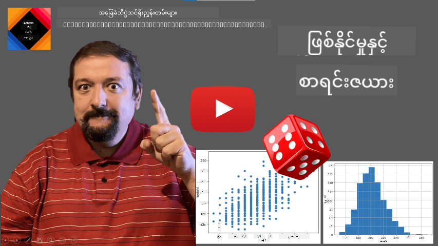
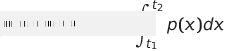
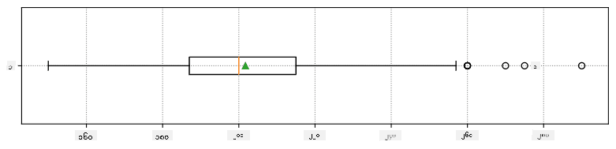
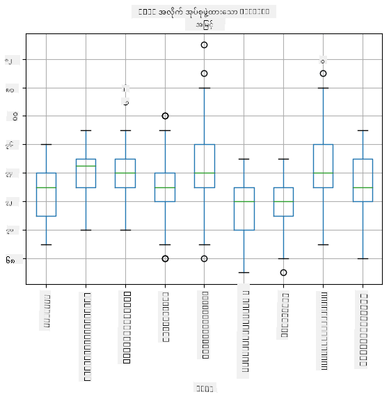
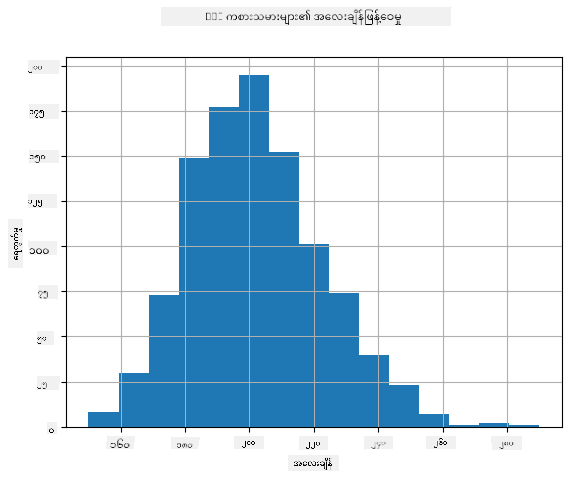
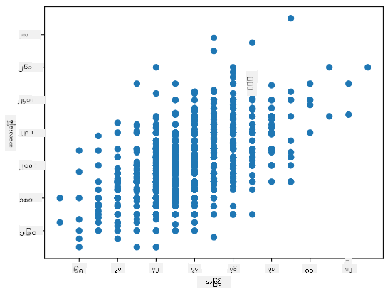

<!--
CO_OP_TRANSLATOR_METADATA:
{
  "original_hash": "ce95884566a74db72572cd51f0cb25ad",
  "translation_date": "2025-09-06T14:19:34+00:00",
  "source_file": "1-Introduction/04-stats-and-probability/README.md",
  "language_code": "my"
}
-->
# စာရင်းအင်းနှင့် အလားအလာအကြောင်း အကျဉ်းချုပ်

| ](../../sketchnotes/04-Statistics-Probability.png)|
|:---:|
| စာရင်းအင်းနှင့် အလားအလာ - _Sketchnote by [@nitya](https://twitter.com/nitya)_ |

စာရင်းအင်းနှင့် အလားအလာ သီအိုရီသည် သင်္ချာ၏ အလွန်နီးစပ်သော နယ်ပယ်နှစ်ခုဖြစ်ပြီး ဒေတာသိပ္ပံတွင် အလွန်အရေးပါသည်။ သင်္ချာအကြောင်း အနက်ရှိုင်းစွာ မသိဘဲ ဒေတာနှင့် လုပ်ဆောင်နိုင်သော်လည်း အခြေခံအယူအဆအချို့ကို သိထားခြင်းက ပိုမိုကောင်းမွန်ပါသည်။ ဒီမှာ သင်စတင်နိုင်ရန် အကျိုးရှိမည့် အကျဉ်းချုပ်တစ်ခုကို တင်ပြပါမည်။

[](https://youtu.be/Z5Zy85g4Yjw)

## [Pre-lecture quiz](https://ff-quizzes.netlify.app/en/ds/quiz/6)

## အလားအလာနှင့် အလွတ်တန်းအပြောင်းအလဲများ

**အလားအလာ** ဆိုသည်မှာ 0 နှင့် 1 အကြားရှိ နံပါတ်တစ်ခုဖြစ်ပြီး **ဖြစ်ရပ်** တစ်ခုဖြစ်နိုင်မှုကို ဖော်ပြသည်။ ၎င်းကို အလားအလာရှိသော ရလဒ်များ၏ အရေအတွက်ကို (ဖြစ်ရပ်ကို ဖြစ်စေသော) ရလဒ်များ၏ စုစုပေါင်းအရေအတွက်ဖြင့် ခွဲခြင်းဖြင့် သတ်မှတ်သည်။ ဥပမာအားဖြင့် ကစားသမားတစ်ခုကို လွှဲလိုက်သောအခါ ကျွန်ုပ်တို့ အတိအကျနံပါတ်တစ်ခုရရှိရန် အလားအလာမှာ 3/6 = 0.5 ဖြစ်သည်။

ဖြစ်ရပ်များအကြောင်း ပြောသောအခါ ကျွန်ုပ်တို့ **အလွတ်တန်းအပြောင်းအလဲများ** ကို အသုံးပြုသည်။ ဥပမာအားဖြင့် ကစားသမားတစ်ခုကို လွှဲလိုက်သောအခါရရှိသော နံပါတ်ကို ကိုယ်စားပြုသော အလွတ်တန်းအပြောင်းအလဲသည် 1 မှ 6 အထိတန်ဖိုးများကို ယူပါမည်။ 1 မှ 6 အထိနံပါတ်များ၏ စုစုပေါင်းကို **နမူနာအကျယ်** ဟုခေါ်သည်။ ကျွန်ုပ်တို့သည် အလွတ်တန်းအပြောင်းအလဲတစ်ခုသည် တန်ဖိုးတစ်ခုကို ယူသော အလားအလာအကြောင်း ပြောနိုင်သည်၊ ဥပမာအားဖြင့် P(X=3)=1/6 ဖြစ်သည်။

ယခင်ဥပမာတွင် အလွတ်တန်းအပြောင်းအလဲသည် **Discrete** ဟုခေါ်သည်၊ အကြောင်းမှာ ၎င်းတွင် ရေတွက်နိုင်သော နမူနာအကျယ်ရှိပြီး၊ သီးခြားတန်ဖိုးများကို ရေတွက်နိုင်သည်။ နမူနာအကျယ်သည် အမှန်တကယ်နံပါတ်များ၏ အကွာအဝေး သို့မဟုတ် အမှန်တကယ်နံပါတ်များ၏ စုစုပေါင်းဖြစ်သော အခြေအနေများရှိသည်။ ၎င်းတို့ကို **Continuous** ဟုခေါ်သည်။ ကောင်းမွန်သော ဥပမာတစ်ခုမှာ ဘတ်စ်ကားရောက်ရှိချိန်ဖြစ်သည်။

## အလားအလာဖြန့်ဝေမှု

Discrete အလွတ်တန်းအပြောင်းအလဲများ၏ အခြေအနေတွင် ဖြစ်ရပ်တစ်ခုစီ၏ အလားအလာကို P(X) ဟုခေါ်သော အလုပ်လုပ်ပုံတစ်ခုဖြင့် ဖော်ပြရန် လွယ်ကူသည်။ နမူနာအကျယ် *S* မှ *s* တန်ဖိုးတစ်ခုစီအတွက် ၎င်းသည် 0 မှ 1 အထိနံပါတ်တစ်ခုကို ပေးမည်၊ ဖြစ်ရပ်အားလုံးအတွက် P(X=s) တန်ဖိုးအားလုံး၏ စုစုပေါင်းသည် 1 ဖြစ်ရမည်။

အလွန်ကျော်ကြားသော discrete distribution တစ်ခုမှာ **uniform distribution** ဖြစ်ပြီး၊ ၎င်းတွင် N elements ရှိသော နမူနာအကျယ်ရှိပြီး၊ ၎င်းတို့၏ တစ်ခုစီအတွက် အလားအလာမှာ 1/N ဖြစ်သည်။

Continuous variable တစ်ခု၏ အလားအလာဖြန့်ဝေမှုကို ဖော်ပြရန် ပိုမိုခက်ခဲသည်၊ တန်ဖိုးများကို [a,b] အကွာအဝေး သို့မဟုတ် အမှန်တကယ်နံပါတ်များ၏ စုစုပေါင်း ℝ မှ ဆွဲယူသည်။ ဘတ်စ်ကားရောက်ရှိချိန်ကို စဉ်းစားပါ။ အမှန်တကယ်တွင် တိကျသောရောက်ရှိချိန် *t* အတွက် ဘတ်စ်ကားသည် အတိအကျအချိန်၌ ရောက်ရှိမည့် အလားအလာမှာ 0 ဖြစ်သည်။

> အလားအလာ 0 ရှိသော ဖြစ်ရပ်များသည် ဖြစ်ပျက်သည်၊ အလွန်မကြာခဏဖြစ်ပျက်သည်! အနည်းဆုံး ဘတ်စ်ကားရောက်ရှိသောအခါတိုင်း!

ကျွန်ုပ်တို့သည် variable တစ်ခုသည် တန်ဖိုးများ၏ interval တစ်ခုတွင် ကျရောက်သော အလားအလာအကြောင်းသာ ပြောနိုင်သည်၊ ဥပမာအားဖြင့် P(t<sub>1</sub>≤X<t<sub>2</sub>)။ ဒီအခြေအနေတွင် အလားအလာဖြန့်ဝေမှုကို **probability density function** p(x) ဖြင့် ဖော်ပြသည်၊ ၎င်းသည်



Continuous uniform distribution ဟုခေါ်သော uniform distribution ၏ continuous analog ကို အကန့်အသတ် interval တစ်ခုတွင် သတ်မှတ်သည်။ X တန်ဖိုးသည် အကွာအဝေး l တွင် ကျရောက်သော အလားအလာသည် l နှင့် အချိုးကျပြီး 1 အထိ မြင့်တက်သည်။

အရေးပါသော distribution တစ်ခုမှာ **normal distribution** ဖြစ်ပြီး၊ ကျွန်ုပ်တို့သည် အောက်တွင် ပိုမိုအသေးစိတ်ဆွေးနွေးမည်။

## ပျမ်းမျှတန်ဖိုး၊ အပြောင်းအလဲနှင့် စံချိန်လှိုင်း

အလွတ်တန်းအပြောင်းအလဲ X ၏ နမူနာ n ခုကို ဆွဲယူသည်ဟု ယူပါစို့။ x<sub>1</sub>, x<sub>2</sub>, ..., x<sub>n</sub>။ **ပျမ်းမျှတန်ဖိုး** (သို့မဟုတ် **အင်္ဂါရပ်ပျမ်းမျှ**) ကို x<sub>1</sub>+x<sub>2</sub>+x<sub>n</sub>/n ဟု ရိုးရှင်းသောနည်းဖြင့် သတ်မှတ်နိုင်သည်။ နမူနာအရွယ်အစားကို ကြီးထွားစေသောအခါ (n→∞ ဖြစ်သောအကန့်အသတ်ကို ယူပါ) distribution ၏ ပျမ်းမျှတန်ဖိုး (**မျှော်မှန်းချက်**) ကို ရရှိမည်။ **E**(x) ဟု မျှော်မှန်းချက်ကို မှတ်သားမည်။

> Discrete distribution တစ်ခုစီအတွက် {x<sub>1</sub>, x<sub>2</sub>, ..., x<sub>N</sub>} တန်ဖိုးများနှင့် ၎င်းတို့၏ အလားအလာ p<sub>1</sub>, p<sub>2</sub>, ..., p<sub>N</sub> အတွက် မျှော်မှန်းချက်သည် E(X)=x<sub>1</sub>p<sub>1</sub>+x<sub>2</sub>p<sub>2</sub>+...+x<sub>N</sub>p<sub>N</sub> ဖြစ်သည်ကို သက်သေပြနိုင်သည်။

တန်ဖိုးများသည် ဘယ်လောက်အထိ ပျံ့နှံ့နေသည်ကို သတ်မှတ်ရန် variance σ<sup>2</sup> = ∑(x<sub>i</sub> - μ)<sup>2</sup>/n ကို တွက်ချက်နိုင်သည်၊ ဤတွင် μ သည် နမူနာ၏ ပျမ်းမျှတန်ဖိုးဖြစ်သည်။ σ ကို **စံချိန်လှိုင်း** ဟုခေါ်ပြီး၊ σ<sup>2</sup> ကို **variance** ဟုခေါ်သည်။

## Mode, Median နှင့် Quartiles

တစ်ခါတစ်ရံ ပျမ်းမျှတန်ဖိုးသည် ဒေတာအတွက် "ပုံမှန်" တန်ဖိုးကို လုံလောက်စွာ ကိုယ်စားပြုမထားနိုင်ပါ။ ဥပမာအားဖြင့် အလွန်အမင်းသော တန်ဖိုးအချို့သည် အကွာအဝေးအပြင်မှာရှိပြီး၊ ၎င်းတို့သည် ပျမ်းမျှတန်ဖိုးကို သက်ရောက်စေနိုင်သည်။ အခြားသော ကောင်းမွန်သော အညွှန်းက **median** ဖြစ်ပြီး၊ ဒေတာအချက်အလက်၏ တစ်ဝက်သည် ၎င်းထက် နိမ့်ပြီး၊ အခြားတစ်ဝက်သည် - မြင့်သည်။

ဒေတာ၏ distribution ကို နားလည်ရန် ကူညီရန် **quartiles** အကြောင်း ပြောခြင်းသည် အကျိုးရှိသည်-

* ပထမ quartile သို့မဟုတ် Q1 သည် ဒေတာ၏ 25% သည် ၎င်းထက် နိမ့်သော တန်ဖိုးဖြစ်သည်။
* တတိယ quartile သို့မဟုတ် Q3 သည် ဒေတာ၏ 75% သည် ၎င်းထက် နိမ့်သော တန်ဖိုးဖြစ်သည်။

Median နှင့် quartiles တစ်ခုချင်းစီ၏ ဆက်နွယ်မှုကို **box plot** ဟုခေါ်သော အကြမ်းဖျင်းပုံစံတွင် ဖော်ပြနိုင်သည်-


ဒီမှာ **inter-quartile range** IQR=Q3-Q1 ကို တွက်ချက်ပြီး၊ **outliers** ဟုခေါ်သော တန်ဖိုးများကို တွက်ချက်သည် - [Q1-1.5*IQR,Q3+1.5*IQR] အကန့်အသတ်များအပြင်မှာရှိသော တန်ဖိုးများ။

နည်းနည်းသော တန်ဖိုးများကိုသာ ပါဝင်သော နမူနာ distribution အတွက် "ပုံမှန်" တန်ဖိုးက အများဆုံး ထပ်တလဲလဲ ဖြစ်သော တန်ဖိုးဖြစ်ပြီး၊ ၎င်းကို **mode** ဟုခေါ်သည်။ ၎င်းကို အရောင်များကဲ့သို့သော category ဒေတာတွင် အများအားဖြင့် အသုံးပြုသည်။ လူအုပ်နှစ်စုရှိသော အခြေအနေကို စဉ်းစားပါ - အချို့သည် အနီရောင်ကို အလွန်နှစ်သက်ပြီး၊ အခြားသူများသည် အပြာရောင်ကို နှစ်သက်သည်။ အရောင်များကို နံပါတ်များဖြင့် ကုဒ်ပြုလုပ်ပါက၊ အကြိုက်ဆုံးအရောင်အတွက် ပျမ်းမျှတန်ဖိုးသည် လိမ္မော်-အစိမ်းရောင် spectrum တစ်ခုတွင် ရှိမည်ဖြစ်ပြီး၊ ၎င်းသည် အုပ်စုတစ်ခုမှ အကြိုက်နှစ်သက်မှုကို မဖော်ပြနိုင်ပါ။ သို့သော် mode သည် အရောင်တစ်ခု သို့မဟုတ် အရောင်နှစ်ခုဖြစ်နိုင်ပြီး၊ ၎င်းတို့ကို မဲပေးသော လူအရေအတွက်သည် တူညီပါက (ဤအခြေအနေတွင် sample ကို **multimodal** ဟုခေါ်သည်)။

## အမှန်တကယ် ဒေတာ

အမှန်တကယ် ဒေတာကို ခွဲခြားသောအခါ၊ ၎င်းတို့သည် အလွတ်တန်းအပြောင်းအလဲများ မဟုတ်သောအခါများစွာရှိသည်၊ အဓိကအားဖြင့် ကျွန်ုပ်တို့သည် မသိသောရလဒ်ဖြင့် စမ်းသပ်မှုများ မလုပ်ဆောင်ပါ။ ဥပမာအားဖြင့် ဘေ့စ်ဘောကစားသမားအဖွဲ့တစ်ခုကို စဉ်းစားပါ၊ ၎င်းတို့၏ ကိုယ်ခန္ဓာဒေတာများ၊ height, weight နှင့် အသက်ကဲ့သို့သော။ ၎င်းနံပါတ်များသည် အလွတ်တန်းမဟုတ်သော်လည်း၊ ကျွန်ုပ်တို့သည် အတူတူသော သင်္ချာဆိုင်ရာ အယူအဆများကို လျှောက်ထားနိုင်သည်။ ဥပမာအားဖြင့် လူများ၏ အလေးချိန်များ၏ နမူနာတစ်ခုကို အလွတ်တန်းအပြောင်းအလဲတစ်ခုမှ ဆွဲယူသော တန်ဖိုးများ၏ နမူနာတစ်ခုအဖြစ် စဉ်းစားနိုင်သည်။ အောက်တွင် [Major League Baseball](http://mlb.mlb.com/index.jsp) မှ ဘေ့စ်ဘောကစားသမားများ၏ အလေးချိန်များ၏ နမူနာကို ဖော်ပြထားသည်၊ [ဒီဒေတာ](http://wiki.stat.ucla.edu/socr/index.php/SOCR_Data_MLB_HeightsWeights) မှ ယူထားသည် (သင့်အဆင်ပြေစေရန်၊ ပထမ 20 တန်ဖိုးများကိုသာ ဖော်ပြထားသည်)။

```
[180.0, 215.0, 210.0, 210.0, 188.0, 176.0, 209.0, 200.0, 231.0, 180.0, 188.0, 180.0, 185.0, 160.0, 180.0, 185.0, 197.0, 189.0, 185.0, 219.0]
```

> **Note**: ဒီဒေတာကို အသုံးပြု၍ လုပ်ဆောင်မှုကို ကြည့်ရန် [accompanying notebook](notebook.ipynb) ကို ကြည့်ပါ။ ဒီသင်ခန်းစာတစ်လျှောက်တွင် စိန်ခေါ်မှုများစွာလည်းရှိပြီး၊ ၎င်းတို့ကို notebook တွင် code အချို့ ထည့်သွင်းခြင်းဖြင့် ပြီးမြောက်နိုင်သည်။ ဒေတာကို လုပ်ဆောင်ရန် မသိပါက စိတ်မပူပါနှင့် - ကျွန်ုပ်တို့သည် Python ကို အသုံးပြု၍ ဒေတာနှင့် လုပ်ဆောင်ရန် နောက်ပိုင်းတွင် ပြန်လာပါမည်။ Jupyter Notebook တွင် code ကို အကောင်အထည်ဖော်ရန် မသိပါက [ဒီဆောင်းပါး](https://soshnikov.com/education/how-to-execute-notebooks-from-github/) ကို ကြည့်ပါ။

ဒီမှာ ကျွန်ုပ်တို့၏ ဒေတာအတွက် ပျမ်းမျှတန်ဖိုး၊ median နှင့် quartiles ကို ဖော်ပြထားသော box plot ဖြစ်သည်-



ကျွန်ုပ်တို့၏ ဒေတာတွင် ကစားသမား **roles** အကြောင်း အချက်အလက်များ ပါဝင်သောကြောင့် role အလိုက် box plot ကိုလည်း ပြုလုပ်နိုင်သည် - ၎င်းသည် parameter values များသည် roles အလိုက် ဘယ်လိုကွဲပြားနေသည်ကို နားလည်ရန် ကူညီပေးမည်။ ဒီအကြိမ်မှာ height ကို စဉ်းစားပါမည်-



ဒီ diagram က ပထမ base ကစားသမား height သည် ဒုတိယ base ကစားသမား height ထက် ပျမ်းမျှအားဖြင့် မြင့်သည်ကို ဖော်ပြသည်။ ဒီသင်ခန်းစာတွင် ကျွန်ုပ်တို့သည် ဒီအယူအဆကို ပိုမိုတိကျစွာ စမ်းသပ်နိုင်သော နည်းလမ်းများနှင့် ကျွန်ုပ်တို့၏ ဒေတာသည် အထောက်အထားအလုံလောက်ရှိသည်ကို သက်သေပြနိုင်သော နည်းလမ်းများကို လေ့လာမည်။

> အမှန်တကယ် ဒေတာနှင့် လုပ်ဆောင်သောအခါ၊ ဒေတာအချက်အလက်အားလုံးသည် probability distribution တစ်ခုမှ ဆွဲယူသော နမူနာများဖြစ်သည်ဟု ယူဆသည်။ ဒီအယူအဆသည် machine learning နည်းလမ်းများကို လျှောက်ထားရန်နှင့် အလုပ်လုပ်နိုင်သော ခန့်မှန်းမှုမော်ဒယ်များကို တည်ဆောက်ရန် ခွင့်ပြုသည်။

ကျွန်ုပ်တို့၏ ဒေတာ distribution ကို ကြည့်ရန် **histogram** ဟုခေါ်သော graph တစ်ခုကို ရှုနိုင်သည်။ X-axis တွင် အလေးချိန် interval များ (so-called **bins**) ပါဝင်ပြီး၊ vertical axis တွင် random variable sample သည် interval တစ်ခုတွင် ရှိသောအခါ အကြိမ်အရေအတွက်ကို ဖော်ပြသည်။



ဒီ histogram မှာ အလေးချိန်များအားလုံးသည် ပျမ်းမျှအလေးချိန်

1</sub>, ..., X<sub>n</sub> ကို ကျွန်ုပ်တို့၏ distribution မှ ရယူသည်။ Distribution မှ sample တစ်ခုစီကို ရယူတိုင်း၊ mean value μ သည် မတူညီသော တန်ဖိုးတစ်ခုဖြစ်လာမည်ဖြစ်သည်။ ထို့ကြောင့် μ ကို random variable တစ်ခုအဖြစ် သတ်မှတ်နိုင်သည်။ **Confidence interval** သည် confidence p နှင့်အတူ (L<sub>p</sub>, R<sub>p</sub>) တန်ဖိုးစုံဖြစ်ပြီး၊ **P**(L<sub>p</sub> ≤ μ ≤ R<sub>p</sub>) = p ဖြစ်သည်။ အဆိုပါ interval အတွင်း measured mean value ရောက်ရှိနိုင်မည့် probability သည် p နှင့် ညီမျှသည်။

အဆိုပါ confidence intervals များကို မည်သို့တွက်ချက်ရမည်ကို အပြည့်အဝဆွေးနွေးရန် ကျွန်ုပ်တို့၏ အကျဉ်းချုပ်အတွင်း မပါဝင်ပါ။ [Wikipedia](https://en.wikipedia.org/wiki/Confidence_interval) တွင် အသေးစိတ်ကို ရှာဖွေနိုင်သည်။ အကျဉ်းချုပ်အားဖြင့်၊ population၏ true mean နှင့် ဆက်စပ် sample mean distribution ကို သတ်မှတ်ပြီး၊ ၎င်းကို **student distribution** ဟု ခေါ်သည်။

> **စိတ်ဝင်စားဖွယ် အချက်**: Student distribution ကို သင်္ချာပညာရှင် William Sealy Gosset ၏ နာမည်ဖြင့် မဟုတ်ဘဲ "Student" ဟု အမည်ခံ၍ ထုတ်ဝေခဲ့သည်။ သူသည် Guinness brewery တွင် အလုပ်လုပ်ခဲ့ပြီး၊ statistical tests များကို raw materials ၏ အရည်အသွေးသတ်မှတ်ရန် အသုံးပြုနေကြောင်း အများပြည်သူ မသိစေရန် သူ၏အလုပ်ရှင်က မလိုလားခဲ့ကြောင်း တစ်ခုသော သတင်းအချက်အလက်အရ သိရသည်။

Population ၏ mean μ ကို confidence p ဖြင့် ခန့်မှန်းလိုပါက၊ Student distribution A ၏ *(1-p)/2-th percentile* ကို ရယူရမည်ဖြစ်သည်။ ၎င်းကို tables များမှ ရယူနိုင်သလို၊ statistical software (ဥပမာ Python, R စသည်) ၏ built-in functions များကို အသုံးပြု၍လည်း ရနိုင်သည်။ ထို့နောက် μ အတွက် interval သည် X ± A*D/√n ဖြစ်မည်ဖြစ်သည်။ ဤတွင် X သည် sample ၏ mean ဖြစ်ပြီး၊ D သည် standard deviation ဖြစ်သည်။

> **မှတ်ချက်**: Student distribution နှင့် ဆက်စပ်သော [degrees of freedom](https://en.wikipedia.org/wiki/Degrees_of_freedom_(statistics)) ၏ အရေးပါမှုကို မဆွေးနွေးထားပါ။ ဤအကြောင်းအရာကို နက်နက်ရှိုင်းရှိုင်း နားလည်လိုပါက သင်္ချာနှင့် စာရင်းအင်းဆိုင်ရာ စာအုပ်များကို ရည်ညွှန်းပါ။

Weight နှင့် height များအတွက် confidence interval တွက်ချက်မှု၏ ဥပမာကို [accompanying notebooks](notebook.ipynb) တွင် ကြည့်ရှုနိုင်သည်။

| p | Weight mean |
|-----|-----------|
| 0.85 | 201.73±0.94 |
| 0.90 | 201.73±1.08 |
| 0.95 | 201.73±1.28 |

Confidence probability မြင့်မားလျှင် confidence interval သည် ပိုကျယ်လာသည်ကို သတိပြုပါ။

## Hypothesis Testing 

Baseball players dataset တွင် player roles များကို အောက်ပါအတိုင်း အကျဉ်းချုပ်နိုင်သည် ([accompanying notebook](notebook.ipynb) တွင် ဤဇယားကို မည်သို့တွက်ချက်ရမည်ကို ကြည့်ပါ):

| Role | Height | Weight | Count |
|------|--------|--------|-------|
| Catcher | 72.723684 | 204.328947 | 76 |
| Designated_Hitter | 74.222222 | 220.888889 | 18 |
| First_Baseman | 74.000000 | 213.109091 | 55 |
| Outfielder | 73.010309 | 199.113402 | 194 |
| Relief_Pitcher | 74.374603 | 203.517460 | 315 |
| Second_Baseman | 71.362069 | 184.344828 | 58 |
| Shortstop | 71.903846 | 182.923077 | 52 |
| Starting_Pitcher | 74.719457 | 205.163636 | 221 |
| Third_Baseman | 73.044444 | 200.955556 | 45 |

First basemen ၏ mean height သည် second basemen ထက် မြင့်မားသည်ကို သတိပြုမိနိုင်သည်။ ထို့ကြောင့် **first basemen သည် second basemen ထက် မြင့်မားသည်** ဟု သတ်မှတ်လို temptation ရှိနိုင်သည်။

> ဤအဆိုကို **hypothesis** ဟု ခေါ်သည်၊ အချက်အလက်သည် အမှန်ဖြစ်မဖြစ် မသိရသေးသောကြောင့် ဖြစ်သည်။

သို့သော်၊ ဤသတ်မှတ်ချက်ကို ပြုလုပ်နိုင်မည်မဟုတ်မည်ကို အချို့သောအခါတွင် မရှင်းလင်းနိုင်ပါ။ အထက်တွင် ဆွေးနွေးခဲ့သည့်အတိုင်း၊ mean တစ်ခုစီတွင် confidence interval တစ်ခုစီ ပါရှိပြီး၊ ဤကွာခြားမှုသည် statistical error ဖြစ်နိုင်သည်။ Hypothesis ကို စမ်းသပ်ရန် ပိုမိုတိကျသော နည်းလမ်းတစ်ခုလိုအပ်သည်။

First basemen နှင့် second basemen ၏ height များအတွက် confidence intervals ကို သီးခြားတွက်ချက်ကြည့်ပါစို့:

| Confidence | First Basemen | Second Basemen |
|------------|---------------|----------------|
| 0.85 | 73.62..74.38 | 71.04..71.69 |
| 0.90 | 73.56..74.44 | 70.99..71.73 |
| 0.95 | 73.47..74.53 | 70.92..71.81 |

Confidence မည်သည့်တစ်ခုတွင်မဆို interval များသည် မတူညီကြောင်း တွေ့ရသည်။ ထို့ကြောင့် first basemen သည် second basemen ထက် မြင့်မားကြောင်း hypothesis ကို အတည်ပြုသည်။

ပိုမိုတိကျစွာဆိုရသော်၊ ကျွန်ုပ်တို့ ဖြေရှင်းနေသော ပြဿနာသည် **probability distributions နှစ်ခုတူညီကြောင်း** သို့မဟုတ် အနည်းဆုံး parameters တူညီကြောင်း စစ်ဆေးခြင်းဖြစ်သည်။ Distribution အမျိုးအစားပေါ်မူတည်၍၊ အမျိုးမျိုးသော tests များကို အသုံးပြုရမည်ဖြစ်သည်။ Distribution များသည် normal ဖြစ်ကြောင်း သိပါက၊ **[Student t-test](https://en.wikipedia.org/wiki/Student%27s_t-test)** ကို အသုံးပြုနိုင်သည်။

Student t-test တွင်၊ **t-value** ဟုခေါ်သော တန်ဖိုးကို တွက်ချက်ပြီး၊ ၎င်းသည် variance ကို ထည့်သွင်းစဉ်းစားထားသည်။ T-value သည် **student distribution** ကို လိုက်နာကြောင်း သက်သေပြထားပြီး၊ confidence level **p** အတွက် threshold value ကို ရယူနိုင်သည် (ဤတန်ဖိုးကို တွက်ချက်နိုင်သလို၊ tables တွင်လည်း ရှာနိုင်သည်)။ ထို့နောက် hypothesis ကို အတည်ပြုရန် သို့မဟုတ် ပယ်ချရန် t-value ကို threshold နှင့် နှိုင်းယှဉ်သည်။

Python တွင်၊ **SciPy** package ကို အသုံးပြုနိုင်ပြီး၊ ၎င်းတွင် `ttest_ind` function ပါဝင်သည် (statistical functions အသုံးဝင်သော အခြားများစွာပါဝင်သည်)။ Function သည် t-value ကို ကျွန်ုပ်တို့အတွက် တွက်ချက်ပေးပြီး၊ confidence p-value ကိုလည်း reverse lookup ပြုလုပ်ပေးသည်။ ထို့ကြောင့် confidence ကိုသာ ကြည့်၍ သတ်မှတ်ချက်ပြုနိုင်သည်။

ဥပမာအားဖြင့်၊ first basemen နှင့် second basemen ၏ height များကို နှိုင်းယှဉ်သောအခါ၊ အောက်ပါရလဒ်များရရှိသည်။
```python
from scipy.stats import ttest_ind

tval, pval = ttest_ind(df.loc[df['Role']=='First_Baseman',['Height']], df.loc[df['Role']=='Designated_Hitter',['Height']],equal_var=False)
print(f"T-value = {tval[0]:.2f}\nP-value: {pval[0]}")
```
```
T-value = 7.65
P-value: 9.137321189738925e-12
```
ဤအခါတွင်၊ p-value သည် အလွန်နိမ့်သောကြောင့်၊ first basemen သည် taller ဖြစ်ကြောင်း အတည်ပြုသည့် အထောက်အထားအားကောင်းသည်။

ထို့အပြင်၊ စမ်းသပ်လိုသည့် hypothesis အမျိုးအစား အခြားများလည်း ရှိနိုင်သည်၊ ဥပမာအားဖြင့်:
* Sample တစ်ခုသည် distribution တစ်ခုနှင့် ကိုက်ညီကြောင်း သက်သေပြရန်
* Sample ၏ mean value တစ်ခုသည် သတ်မှတ်ထားသော တန်ဖိုးနှင့် ကိုက်ညီကြောင်း သက်သေပြရန်
* Samples အများအပြား၏ mean များကို နှိုင်းယှဉ်ရန် (ဥပမာ၊ အသက်အရွယ်အုပ်စုများအကြား ပျော်ရွှင်မှုအဆင့်ကွာခြားမှု)

## Law of Large Numbers and Central Limit Theorem

Normal distribution အရေးပါမှု၏ အဓိကအကြောင်းအရင်းတစ်ခုမှာ **central limit theorem** ဖြစ်သည်။ N → ∞ ဖြစ်သည့်အခါ၊ mean Σ<sub>i</sub>X<sub>i</sub> သည် μ နှင့် σ<sup>2</sup>/N ဖြင့် normal distribution ဖြစ်လာမည်။

> Central limit theorem ကို အခြားနည်းလမ်းဖြင့် အဓိပ္ပာယ်ဖွင့်ဆိုပါက၊ random variable values များ၏ summation ၏ mean ကို တွက်ချက်သည့်အခါ၊ normal distribution ကိုရရှိမည်ဟု ဆိုနိုင်သည်။

Central limit theorem မှလည်း၊ N → ∞ ဖြစ်သည့်အခါ၊ sample mean သည် μ နှင့် ညီမျှဖြစ်မည့် probability သည် 1 ဖြစ်လာမည်ကို သက်သေပြသည်။ ၎င်းကို **law of large numbers** ဟု ခေါ်သည်။

## Covariance and Correlation

Data Science ၏ အဓိကလုပ်ဆောင်ချက်တစ်ခုမှာ ဒေတာများအကြား ဆက်စပ်မှုများကို ရှာဖွေခြင်းဖြစ်သည်။ Sequence နှစ်ခုသည် တစ်ချိန်တည်းတွင် အတူတူတက်/ကျနေပါက၊ သို့မဟုတ် တစ်ခုတက်နေစဉ် တစ်ခုကျနေပါက၊ ၎င်းတို့သည် **correlate** ဖြစ်ကြောင်း ဆိုနိုင်သည်။

> Correlation သည် causal relationship ကို မပြသနိုင်ပါ၊ တစ်ခါတစ်ရံ variable နှစ်ခုသည် အခြားအကြောင်းတစ်ခုကြောင့် ဆက်စပ်နေနိုင်သည်၊ သို့မဟုတ် အကြောင်းမဲ့ correlation ဖြစ်နိုင်သည်။ သို့သော်၊ အားကောင်းသော mathematical correlation သည် variable နှစ်ခု ဆက်စပ်နေကြောင်း ပြသနိုင်သည်။

Mathematically, **covariance** သည် random variables နှစ်ခုအကြား ဆက်စပ်မှုကို ပြသသည့် အဓိကအချက်ဖြစ်သည်။ Cov(X,Y) = **E**\[(X-**E**(X))(Y-**E**(Y))\] ဖြင့် တွက်ချက်သည်။ Variable နှစ်ခုသည် mean value များမှ deviation တူညီပါက၊ covariance သည် positive ဖြစ်မည်။ Deviations မတူညီပါက၊ covariance သည် negative ဖြစ်မည်။ Deviations မဆက်စပ်ပါက၊ covariance သည် 0 ဖြစ်မည်။

Covariance ၏ absolute value သည် correlation ၏ အရွယ်အစားကို မပြသနိုင်ပါ၊ ထို့ကြောင့် standard deviation ဖြင့် normalize ပြုလုပ်၍ **correlation** ကို ရယူရမည်။ Correlation သည် [-1,1] အတွင်းရှိပြီး၊ 1 သည် အားကောင်းသော positive correlation ကို ပြသသည်၊ -1 သည် အားကောင်းသော negative correlation ကို ပြသသည်၊ 0 သည် correlation မရှိကြောင်း ပြသသည်။

**ဥပမာ**: Baseball players ၏ weight နှင့် height အကြား correlation ကို တွက်ချက်ကြည့်ပါ:
```python
print(np.corrcoef(weights,heights))
```
ရလဒ်အနေဖြင့် **correlation matrix** ကို ရရှိမည်:
```
array([[1.        , 0.52959196],
       [0.52959196, 1.        ]])
```

> Correlation matrix C ကို input sequences S<sub>1</sub>, ..., S<sub>n</sub> အတွက် တွက်ချက်နိုင်သည်။ C<sub>ij</sub> သည် S<sub>i</sub> နှင့် S<sub>j</sub> အကြား correlation ဖြစ်ပြီး၊ diagonal elements သည် အမြဲ 1 ဖြစ်သည်။

ဤအခါတွင်၊ 0.53 သည် weight နှင့် height အကြား correlation ရှိကြောင်း ပြသသည်။ Scatter plot ကို ရေးဆွဲ၍ visual relationship ကိုလည်း ကြည့်နိုင်သည်:



> Correlation နှင့် covariance ၏ နောက်ထပ်ဥပမာများကို [accompanying notebook](notebook.ipynb) တွင် ရှာဖွေနိုင်သည်။

## နိဂုံးချုပ်

ဤအခန်းတွင် ကျွန်ုပ်တို့ သင်ယူခဲ့သည်မှာ:

* mean, variance, mode နှင့် quartiles ကဲ့သို့သော ဒေတာ၏ အခြေခံ statistical properties
* normal distribution အပါအဝင် random variables ၏ distribution များ
* property များအကြား correlation ရှာဖွေခြင်း
* hypothesis များကို သက်သေပြရန် သင်္ချာနှင့် စာရင်းအင်း၏ တိကျသော နည်းလမ်းများ
* data sample ကို အသုံးပြု၍ random variable ၏ confidence intervals တွက်ချက်ခြင်း

Probability နှင့် statistics ၏ အခြေခံအချက်များကို သင်ယူခဲ့ပြီး၊ ဤသင်တန်းအတွက် စတင်ရန် လုံလောက်သည်။

## 🚀 စိန်ခေါ်မှု

Notebook တွင်ပါရှိ sample code ကို အသုံးပြု၍ အောက်ပါ hypothesis များကို စမ်းသပ်ပါ:
1. First basemen သည် second basemen ထက် အသက်ကြီးကြသည်။
2. First basemen သည် third basemen ထက် မြင့်မားကြသည်။
3. Shortstops သည် second basemen ထက် မြင့်မားကြသည်။

## [Post-lecture quiz](https://ff-quizzes.netlify.app/en/ds/quiz/7)

## ပြန်လည်သုံးသပ်ခြင်းနှင့် ကိုယ်တိုင်လေ့လာခြင်း

Probability နှင့် statistics သည် အလွန်ကျယ်ပြန့်သော အကြောင်းအရာဖြစ်ပြီး၊ ၎င်းအတွက် သီးခြားသင်တန်းတစ်ခု လိုအပ်သည်။ သင်္ချာနှင့် စာရင်းအင်း၏ နက်ရှိုင်းသောသီအိုရီများကို ဆက်လက်လေ့လာလိုပါက၊ အောက်ပါစာအုပ်များကို ဖတ်ရှုနိုင်သည်:

1. [Carlos Fernandez-Granda](https://cims.nyu.edu/~cfgranda/) ၏ [Probability and Statistics for Data Science](https://cims.nyu.edu/~cfgranda/pages/stuff/probability_stats_for_DS.pdf) (အွန်လိုင်းတွင် ရရှိနိုင်သည်)
1. [Peter and Andrew Bruce. Practical Statistics for Data Scientists.](https://www.oreilly.com/library/view/practical-statistics-for/9781491952955/) [[sample code in R](https://github.com/andrewgbruce/statistics-for-data-scientists)] 
1. [James D. Miller. Statistics for Data Science](https://www.packtpub.com/product/statistics-for-data-science/9781788290678) [[sample code in R](https://github.com/PacktPublishing/Statistics-for-Data-Science)]

## လုပ်ငန်းတာဝန်

[Small Diabetes Study](assignment.md)

## အကျိုးတူဆောင်ရွက်သူများ

ဤသင်ခန်းစာကို [Dmitry Soshnikov](http://soshnikov.com) ၏ အချစ်နှင့်အတူ ရေးသားထားသည်။

---

**အကြောင်းကြားချက်**:  
ဤစာရွက်စာတမ်းကို AI ဘာသာပြန်ဝန်ဆောင်မှု [Co-op Translator](https://github.com/Azure/co-op-translator) ကို အသုံးပြု၍ ဘာသာပြန်ထားပါသည်။ ကျွန်ုပ်တို့သည် တိကျမှုအတွက် ကြိုးစားနေသော်လည်း၊ အလိုအလျောက် ဘာသာပြန်မှုများတွင် အမှားများ သို့မဟုတ် မတိကျမှုများ ပါဝင်နိုင်သည်ကို သတိပြုပါ။ မူရင်းစာရွက်စာတမ်းကို ၎င်း၏ မူလဘာသာစကားဖြင့် အာဏာတရားရှိသော အရင်းအမြစ်အဖြစ် ရှုလေ့လာသင့်ပါသည်။ အရေးကြီးသော အချက်အလက်များအတွက် လူ့ဘာသာပြန်ပညာရှင်များမှ ပရော်ဖက်ရှင်နယ် ဘာသာပြန်မှုကို အကြံပြုပါသည်။ ဤဘာသာပြန်မှုကို အသုံးပြုခြင်းမှ ဖြစ်ပေါ်လာသော အလွဲအလွတ်များ သို့မဟုတ် အနားလွဲမှုများအတွက် ကျွန်ုပ်တို့သည် တာဝန်မယူပါ။