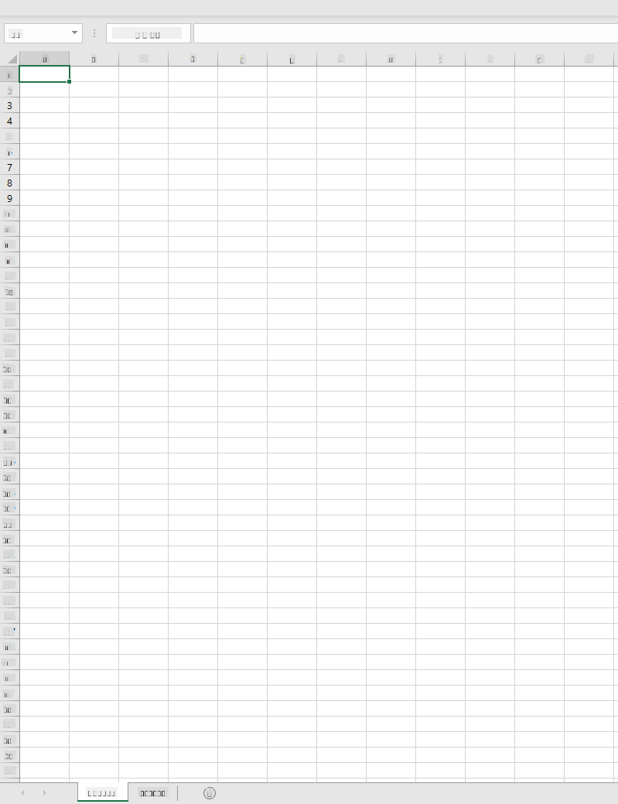
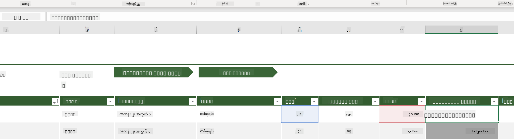
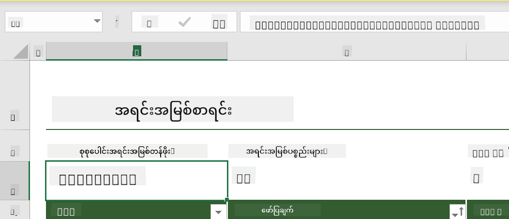
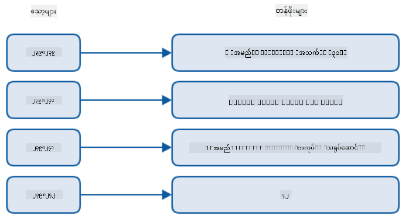
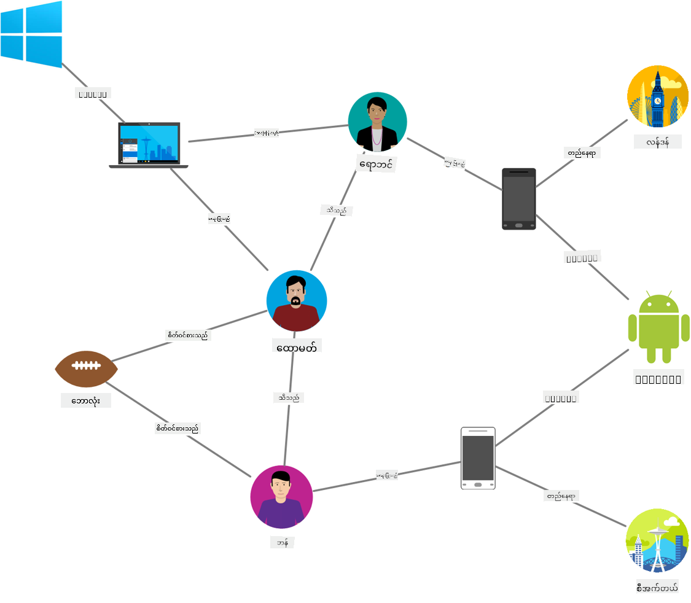
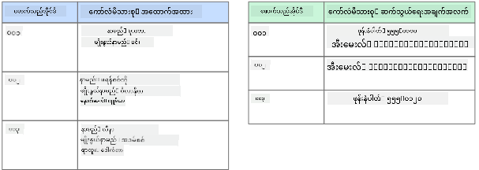
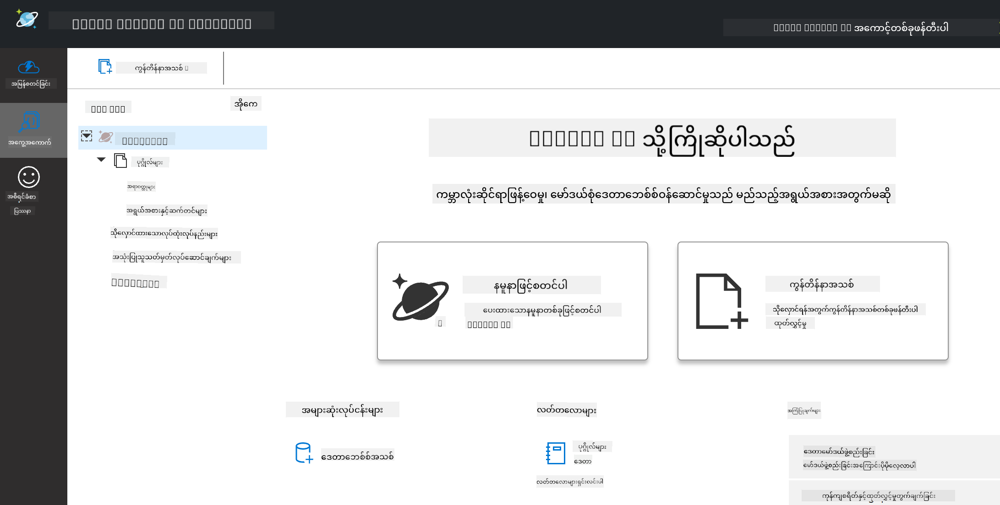
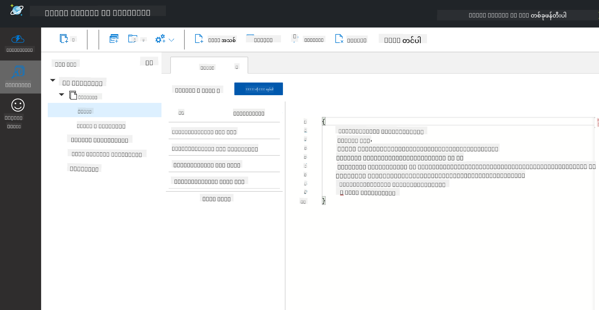
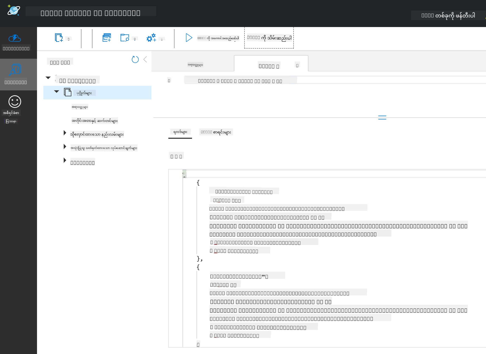

<!--
CO_OP_TRANSLATOR_METADATA:
{
  "original_hash": "32ddfef8121650f2ca2f3416fd283c37",
  "translation_date": "2025-08-30T18:03:00+00:00",
  "source_file": "2-Working-With-Data/06-non-relational/README.md",
  "language_code": "my"
}
-->
# ဒေတာနှင့် အလုပ်လုပ်ခြင်း: မဟုတ်သော ဆက်စပ်ဒေတာ

| ](../../sketchnotes/06-NoSQL.png)|
|:---:|
|NoSQL ဒေတာနှင့် အလုပ်လုပ်ခြင်း - _Sketchnote by [@nitya](https://twitter.com/nitya)_ |

## [Pre-Lecture Quiz](https://purple-hill-04aebfb03.1.azurestaticapps.net/quiz/10)

ဒေတာသည် ဆက်စပ်ဒေတာဘေ့စ်များတွင်သာ ကန့်သတ်ထားခြင်းမဟုတ်ပါ။ ဒီသင်ခန်းစာမှာ မဟုတ်သော ဆက်စပ်ဒေတာ (Non-Relational Data) ကို အဓိကထားပြီး စာရင်းဇယားများနှင့် NoSQL အခြေခံများကို လေ့လာသွားပါမည်။

## စာရင်းဇယားများ (Spreadsheets)

စာရင်းဇယားများသည် ဒေတာကို သိမ်းဆည်းရန်နှင့် စမ်းသပ်ရန် လူကြိုက်များသော နည်းလမ်းတစ်ခုဖြစ်ပြီး စတင်ရန် အလုပ်ပင်ပန်းမှုနည်းပါသည်။ ဒီသင်ခန်းစာတွင် စာရင်းဇယား၏ အခြေခံအစိတ်အပိုင်းများ၊ ဖော်မြူလာများနှင့် ဖန်ရှင်များကို လေ့လာသွားပါမည်။ ဥပမာများကို Microsoft Excel ဖြင့် ဖော်ပြမည်ဖြစ်သော်လည်း အခြားစာရင်းဇယားဆော့ဖ်ဝဲများနှင့် နှိုင်းယှဉ်ပါက အများစုမှာ နာမည်နှင့် လုပ်ဆောင်မှုအဆင့်များ တူညီပါမည်။



စာရင်းဇယားသည် ဖိုင်တစ်ခုဖြစ်ပြီး ကွန်ပျူတာ၊ စက်ပစ္စည်း သို့မဟုတ် cloud-based ဖိုင်စနစ်တွင် ရရှိနိုင်ပါသည်။ ဆော့ဖ်ဝဲကို browser-based ဖြစ်နိုင်သလို ကွန်ပျူတာတွင် ထည့်သွင်းရမည့် အက်ပ်လည်း ဖြစ်နိုင်ပါသည်။ Excel တွင် ဒီဖိုင်များကို **workbooks** ဟု သတ်မှတ်ထားပြီး ဒီသင်ခန်းစာတစ်ခုလုံးတွင် ဒီအသုံးအနှုန်းကို သုံးသွားပါမည်။

Workbook တစ်ခုတွင် worksheet တစ်ခု သို့မဟုတ် အများအပြား ပါဝင်နိုင်ပြီး worksheet တစ်ခုစီကို tabs ဖြင့် အမည်ပေးထားသည်။ Worksheet တစ်ခုတွင် **cells** ဟုခေါ်သော စတုရန်းပုံသဏ္ဍာန်များပါဝင်ပြီး ဒေတာအမှန်တစ်ခုကို ထည့်သွင်းထားသည်။ Cell တစ်ခုသည် အတန်းနှင့် ကော်လံ၏ ချင်းဆက်မှုဖြစ်ပြီး ကော်လံများကို အက္ခရာများဖြင့် အတန်းများကို အနံပါတ်များဖြင့် သတ်မှတ်ထားသည်။ စာရင်းဇယားတစ်ခုတွင် အတန်းအနည်းငယ်တွင် header များပါဝင်ပြီး cell တွင်ရှိသော ဒေတာကို ဖော်ပြထားသည်။

Excel workbook ၏ အခြေခံအစိတ်အပိုင်းများဖြင့် Microsoft Templates မှ [ဥပမာ](https://templates.office.com/) တစ်ခုကို အသုံးပြုကာ စာရင်းဇယား၏ အပိုင်းအခြားများကို လေ့လာသွားပါမည်။

### စာရင်းစီမံခြင်း

"InventoryExample" ဟုအမည်ပေးထားသော စာရင်းဇယားဖိုင်သည် inventory အတွင်းရှိ ပစ္စည်းများကို ဖော်ပြထားသော စီမံထားသော စာရင်းဇယားဖြစ်ပြီး worksheet သုံးခုပါဝင်သည်။ Tabs များကို "Inventory List", "Inventory Pick List" နှင့် "Bin Lookup" ဟု အမည်ပေးထားသည်။ Inventory List worksheet ၏ အတန်း ၄ သည် header ဖြစ်ပြီး header ကော်လံတွင်ရှိသော cell တစ်ခုစီ၏ တန်ဖိုးကို ဖော်ပြထားသည်။



တစ်ခါတစ်ရံ cell တစ်ခုသည် ၎င်း၏ တန်ဖိုးကို ထုတ်ယူရန် အခြား cell များ၏ တန်ဖိုးများပေါ် မူတည်ရပါသည်။ Inventory List စာရင်းဇယားသည် inventory အတွင်းရှိ ပစ္စည်းတစ်ခုစီ၏ ကုန်ကျစရိတ်ကို ထိန်းသိမ်းထားသော်လည်း inventory အတွင်းရှိ အားလုံး၏ တန်ဖိုးကို သိရန် လိုအပ်ပါက [**Formulas**](https://support.microsoft.com/en-us/office/overview-of-formulas-34519a4e-1e8d-4f4b-84d4-d642c4f63263) ကို အသုံးပြုကာ cell ဒေတာများပေါ်တွင် လုပ်ဆောင်မှုများ ပြုလုပ်နိုင်သည်။ ဤဥပမာတွင် Inventory Value ကော်လံတွင် ဖော်မြူလာတစ်ခုကို အသုံးပြုကာ QTY header အောက်ရှိ အရေအတွက်နှင့် COST header အောက်ရှိ ကုန်ကျစရိတ်ကို များစွာမြှောက်ကာ တန်ဖိုးကိုတွက်ချက်ထားသည်။ Cell ကို နှစ်ချက်နှိပ်ခြင်း သို့မဟုတ် အထူးပြခြင်းဖြင့် ဖော်မြူလာကို ကြည့်နိုင်သည်။ ဖော်မြူလာများသည် အချိန်တိုင်း "=" သင်္ကေတဖြင့် စတင်ပြီး တွက်ချက်မှု သို့မဟုတ် လုပ်ဆောင်မှုကို ဆက်လက်ဖော်ပြသည်။



Inventory Value ၏ တန်ဖိုးအားလုံးကို ပေါင်းထည့်ကာ စုစုပေါင်းတန်ဖိုးကို ရရှိရန် ဖော်မြူလာတစ်ခုကို အသုံးပြုနိုင်သည်။ Cell တစ်ခုစီကို ပေါင်းထည့်ကာ စုစုပေါင်းကို တွက်ချက်နိုင်သော်လည်း ၎င်းသည် အချိန်စားသော အလုပ်ဖြစ်နိုင်သည်။ Excel တွင် [**functions**](https://support.microsoft.com/en-us/office/sum-function-043e1c7d-7726-4e80-8f32-07b23e057f89) ဟုခေါ်သော ကြိုတင်သတ်မှတ်ထားသော ဖော်မြူလာများကို cell တန်ဖိုးများပေါ်တွင် တွက်ချက်မှုများ ပြုလုပ်ရန် အသုံးပြုနိုင်သည်။ Functions များသည် arguments လိုအပ်ပြီး ၎င်းတို့သည် တွက်ချက်မှုများ ပြုလုပ်ရန် လိုအပ်သော တန်ဖိုးများဖြစ်သည်။ Functions များတွင် argument တစ်ခုထက်ပိုမိုလိုအပ်ပါက ၎င်းတို့ကို အတိအကျ အစီအစဉ်အတိုင်း ရေးသားရမည်။ ဤဥပမာတွင် SUM function ကို အသုံးပြုကာ Inventory Value ၏ တန်ဖိုးများကို argument အဖြစ် အသုံးပြုကာ စုစုပေါင်းတန်ဖိုးကို တွက်ချက်ထားပြီး row 3, column B (B3) တွင် ဖော်ပြထားသည်။

## NoSQL

NoSQL သည် မဟုတ်သော ဆက်စပ်ဒေတာကို သိမ်းဆည်းရန် အမျိုးမျိုးသော နည်းလမ်းများကို ဖော်ပြသည့် umbrella term ဖြစ်ပြီး "non-SQL", "non-relational" သို့မဟုတ် "not only SQL" ဟု အဓိပ္ပာယ်ဖွင့်ဆိုနိုင်သည်။ ဒီလိုဒေတာဘေ့စ်စနစ်များကို အမျိုးအစား ၄ မျိုးအဖြစ် ခွဲခြားနိုင်သည်။


> [Michał Białecki Blog](https://www.michalbialecki.com/2018/03/18/azure-cosmos-db-key-value-database-cloud/) မှ ရင်းမြစ်

[Key-value](https://docs.microsoft.com/en-us/azure/architecture/data-guide/big-data/non-relational-data#keyvalue-data-stores) ဒေတာဘေ့စ်များသည် တန်ဖိုးနှင့် ဆက်စပ်ထားသော တူညီမရသော key များကို တွဲဖက်ထားသည်။ ၎င်းတို့ကို [hash table](https://www.hackerearth.com/practice/data-structures/hash-tables/basics-of-hash-tables/tutorial/) တစ်ခုနှင့် သင့်လျော်သော hashing function ကို အသုံးပြုကာ သိမ်းဆည်းထားသည်။


> [Microsoft](https://docs.microsoft.com/en-us/azure/cosmos-db/graph/graph-introduction#graph-database-by-example) မှ ရင်းမြစ်

[Graph](https://docs.microsoft.com/en-us/azure/architecture/data-guide/big-data/non-relational-data#graph-data-stores) ဒေတာဘေ့စ်များသည် ဒေတာအတွင်းရှိ ဆက်စပ်မှုများကို ဖော်ပြပြီး nodes နှင့် edges များအဖြစ် ဖော်ပြထားသည်။ Node တစ်ခုသည် ကျောင်းသား သို့မဟုတ် ဘဏ်စာရင်းကဲ့သို့ အမှန်တစ်ခုကို ကိုယ်စားပြုသည်။ Edge များသည် entity နှစ်ခုအကြား ဆက်စပ်မှုကို ကိုယ်စားပြုသည်။ Node နှင့် edge တစ်ခုစီတွင် ထပ်ဆောင်းအချက်အလက်များကို ဖော်ပြသည့် properties များပါဝင်သည်။



[Columnar](https://docs.microsoft.com/en-us/azure/architecture/data-guide/big-data/non-relational-data#columnar-data-stores) ဒေတာစတိုးများသည် ဒေတာကို ကော်လံများနှင့် အတန်းများအဖြစ် စီစဉ်ထားပြီး ဆက်စပ်ဒေတာစနစ်နှင့် ဆင်တူသော်လည်း ကော်လံတစ်ခုစီကို column family ဟုခေါ်သော အုပ်စုများအဖြစ် ခွဲခြားထားသည်။

### Azure Cosmos DB နှင့် Document Data Stores

[Document](https://docs.microsoft.com/en-us/azure/architecture/data-guide/big-data/non-relational-data#document-data-stores) ဒေတာစတိုးများသည် key-value ဒေတာစတိုး၏ အယူအဆကို အခြေခံထားပြီး fields နှင့် objects များဖြင့် ဖွဲ့စည်းထားသည်။ Cosmos DB emulator ဖြင့် document ဒေတာဘေ့စ်များကို လေ့လာသွားပါမည်။

Cosmos DB ဒေတာဘေ့စ်သည် "Not Only SQL" ဟု သတ်မှတ်နိုင်ပြီး Cosmos DB ၏ document ဒေတာဘေ့စ်သည် SQL ကို အသုံးပြုကာ ဒေတာကို query လုပ်သည်။ SQL ၏ အခြေခံများကို [ယခင်သင်ခန်းစာ](../05-relational-databases/README.md) တွင် ဖော်ပြထားပြီး ဒီနေရာတွင် document ဒေတာဘေ့စ်တွင် အချို့သော query များကို အသုံးပြုနိုင်ပါမည်။ Cosmos DB Emulator ကို အသုံးပြုကာ ဒေတာဘေ့စ်တစ်ခုကို တည်ဆောက်ပြီး လေ့လာနိုင်ပါသည်။ Emulator အကြောင်းကို [ဒီမှာ](https://docs.microsoft.com/en-us/azure/cosmos-db/local-emulator?tabs=ssl-netstd21) ဖတ်ရှုနိုင်ပါသည်။

Document တစ်ခုသည် fields နှင့် object values များဖြင့် ဖွဲ့စည်းထားပြီး fields များသည် object value ၏ အဓိပ္ပာယ်ကို ဖော်ပြသည်။ အောက်တွင် document တစ်ခု၏ ဥပမာကို ဖော်ပြထားသည်။

```json
{
    "firstname": "Eva",
    "age": 44,
    "id": "8c74a315-aebf-4a16-bb38-2430a9896ce5",
    "_rid": "bHwDAPQz8s0BAAAAAAAAAA==",
    "_self": "dbs/bHwDAA==/colls/bHwDAPQz8s0=/docs/bHwDAPQz8s0BAAAAAAAAAA==/",
    "_etag": "\"00000000-0000-0000-9f95-010a691e01d7\"",
    "_attachments": "attachments/",
    "_ts": 1630544034
}
```

ဒီ document ၏ စိတ်ဝင်စားဖွယ် field များမှာ `firstname`, `id`, နှင့် `age` ဖြစ်သည်။ အခြား field များသည် Cosmos DB မှ auto-generate လုပ်ထားခြင်းဖြစ်သည်။

#### Cosmos DB Emulator ဖြင့် ဒေတာကို လေ့လာခြင်း

Windows အတွက် Emulator ကို [ဒီမှာ](https://aka.ms/cosmosdb-emulator) ဒေါင်းလုပ်လုပ်နိုင်သည်။ macOS နှင့် Linux အတွက် Emulator ကို အသုံးပြုရန် [ဒီစာရွက်စာတမ်း](https://docs.microsoft.com/en-us/azure/cosmos-db/local-emulator?tabs=ssl-netstd21#run-on-linux-macos) ကို ကိုးကားပါ။

Emulator သည် browser window တစ်ခုကို ဖွင့်ပြီး Explorer view တွင် document များကို လေ့လာနိုင်သည်။



လိုက်နာနေပါက "Start with Sample" ကို နှိပ်ပြီး SampleDB ဟုခေါ်သော ဒေတာဘေ့စ်ကို ဖန်တီးပါ။ SampleDB ကို arrow ဖြင့် ဖွင့်ပါက `Persons` ဟုခေါ်သော container တစ်ခုကို တွေ့ပါမည်။ Container သည် item များ၏ စုစည်းမှုဖြစ်ပြီး ၎င်းတို့သည် container အတွင်းရှိ document များဖြစ်သည်။ `Items` အောက်တွင် document လေးခုကို လေ့လာနိုင်ပါသည်။



#### Cosmos DB Emulator ဖြင့် Document Data ကို Query လုပ်ခြင်း

Sample data ကို query လုပ်ရန် SQL Query button (ဘယ်ဘက်မှ ဒုတိယ button) ကို နှိပ်ပါ။

`SELECT * FROM c` သည် container အတွင်းရှိ document အားလုံးကို ပြန်ပေးသည်။ အောက်တွင် where clause ကို ထည့်ပြီး အသက် ၄၀ ထက်ငယ်သောလူများကို ရှာဖွေကြည့်ပါ။

`SELECT * FROM c where c.age < 40`



Query သည် document နှစ်ခုကို ပြန်ပေးပြီး document တစ်ခုစီ၏ အသက်တန်ဖိုးသည် ၄၀ ထက်ငယ်သည်ကို သတိပြုပါ။

#### JSON နှင့် Documents

JavaScript Object Notation (JSON) နှင့် ရင်းနှီးပါက document များသည် JSON နှင့် ဆင်တူသည်ကို သတိပြုမည်ဖြစ်သည်။ ဒီ directory တွင် `PersonsData.json` ဖိုင်တစ်ခုရှိပြီး ၎င်းကို Emulator ၏ Persons container တွင် `Upload Item` button ဖြင့် upload လုပ်နိုင်သည်။

အများစုတွင် JSON ဒေတာကို ပြန်ပေးသော API များသည် document ဒေတာဘေ့စ်များတွင် တိုက်ရိုက်သိမ်းဆည်းနိုင်သည်။ အောက်တွင် Microsoft Twitter အကောင့်မှ tweet များကို Twitter API ဖြင့် ရယူကာ Cosmos DB တွင် ထည့်သွင်းထားသော document တစ်ခုကို ဖော်ပြထားသည်။

```json
{
    "created_at": "2021-08-31T19:03:01.000Z",
    "id": "1432780985872142341",
    "text": "Blank slate. Like this tweet if you’ve ever painted in Microsoft Paint before. https://t.co/cFeEs8eOPK",
    "_rid": "dhAmAIUsA4oHAAAAAAAAAA==",
    "_self": "dbs/dhAmAA==/colls/dhAmAIUsA4o=/docs/dhAmAIUsA4oHAAAAAAAAAA==/",
    "_etag": "\"00000000-0000-0000-9f84-a0958ad901d7\"",
    "_attachments": "attachments/",
    "_ts": 1630537000
```

ဒီ document ၏ စိတ်ဝင်စားဖွယ် field များမှာ `created_at`, `id`, နှင့် `text` ဖြစ်သည်။

## 🚀 စိန်ခေါ်မှု

`TwitterData.json` ဖိုင်တစ်ခုကို SampleDB ဒေတာဘေ့စ်တွင် upload လုပ်နိုင်သည်။ ၎င်းကို သီးခြား container တွင် ထည့်သွင်းရန် အကြံပြုပါသည်။ ၎င်းကို ပြုလုပ်ရန်:

1. ညာဘက်ထိပ်တွင်ရှိသော new container button ကို နှိပ်ပါ
1. ရှိပြီးသား ဒေတာဘေ့စ် (SampleDB) ကို ရွေးချယ်ပြီး container id ကို ဖန်တီးပါ
1. Partition key ကို `/id` အဖြစ် သတ်မှတ်ပါ
1. OK ကို နှိပ်ပါ (ဤ view တွင် အခြားအချက်အလက်များကို လျစ်လျူရှုနိုင်သည်၊ ဒါဟာ သင့်စက်ပေါ်တွင် လုပ်ဆောင်နေသော dataset သေးငယ်တစ်ခုဖြစ်သည်)
1. သင့် container အသစ်ကို ဖွင့်ပြီး Twitter Data ဖိုင်ကို `Upload Item` button ဖြင့် upload လုပ်ပါ

Text field တွင် Microsoft ပါဝင်သော document များကို ရှာဖွေရန် select query များကို စမ်းကြည့်ပါ။ အကြံပြုချက် - [LIKE keyword](https://docs.microsoft.com/en-us/azure/cosmos-db/sql/sql-query-keywords#using-like-with-the--wildcard-character) ကို အသုံးပြုကြည့်ပါ။

## [Post-Lecture Quiz](https://purple-hill-04aebfb03.1.azurestaticapps.net/quiz/11)

## ပြန်လည်သုံးသပ်ခြင်းနှင့် ကိုယ်တိုင်လေ့လာခြင်း

- ဒီသင်ခန်းစာတွင် မဖော်ပြထားသော စာရင်းဇယား၏ အပိုဆောင်းဖော်ပြမှုများနှင့် လုပ်ဆောင်ချက်များလည်း ရှိပါသည်။ Microsoft ၏ Excel အတွက် [စာရွက်စာတမ်းများနှင့် ဗီဒီယိုများ](https://support.microsoft.com/excel) ကို စိတ်ဝင်စားပါက လေ့လာနိုင်ပါသည်။

- မဟုတ်သော ဆက်စပ်ဒေတာ၏ အမျိုးအစားများ၏ လက္ခဏာများကို ဖော်ပြထားသော ဒီ architectural documentation ကို ဖတ်ရှုပါ: [Non-relational

---

**ဝက်ဘ်ဆိုက်မှတ်ချက်**:  
ဤစာရွက်စာတမ်းကို AI ဘာသာပြန်ဝန်ဆောင်မှု [Co-op Translator](https://github.com/Azure/co-op-translator) ကို အသုံးပြု၍ ဘာသာပြန်ထားပါသည်။ ကျွန်ုပ်တို့သည် တိကျမှန်ကန်မှုအတွက် ကြိုးစားနေသော်လည်း၊ အလိုအလျောက်ဘာသာပြန်ခြင်းတွင် အမှားများ သို့မဟုတ် မမှန်ကန်မှုများ ပါဝင်နိုင်ကြောင်း သတိပြုပါ။ မူလဘာသာစကားဖြင့် ရေးသားထားသော စာရွက်စာတမ်းကို အာဏာတည်သော ရင်းမြစ်အဖြစ် သတ်မှတ်သင့်ပါသည်။ အရေးကြီးသော အချက်အလက်များအတွက် လူ့ဘာသာပြန်ပညာရှင်များကို အသုံးပြုရန် အကြံပြုပါသည်။ ဤဘာသာပြန်ကို အသုံးပြုခြင်းမှ ဖြစ်ပေါ်လာသော နားလည်မှုမှားများ သို့မဟုတ် အဓိပ္ပာယ်မှားများအတွက် ကျွန်ုပ်တို့သည် တာဝန်မယူပါ။